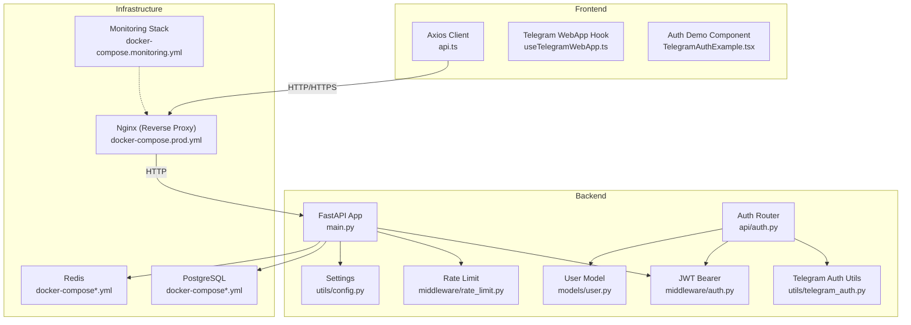
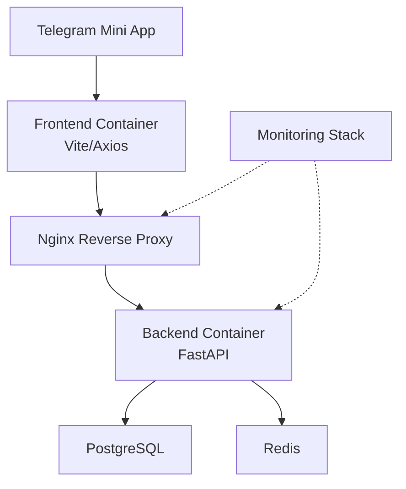
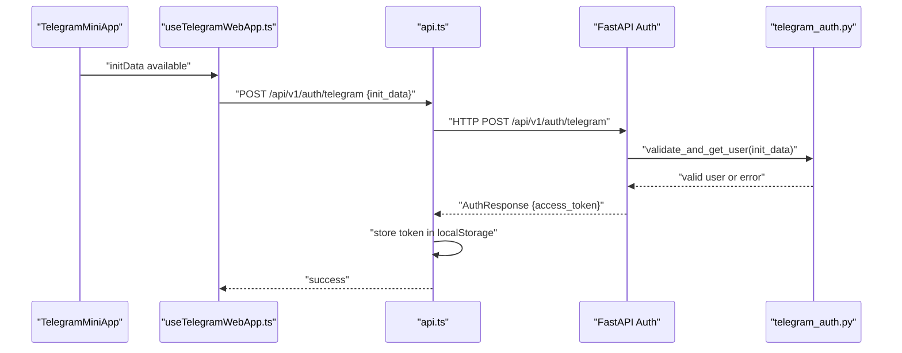
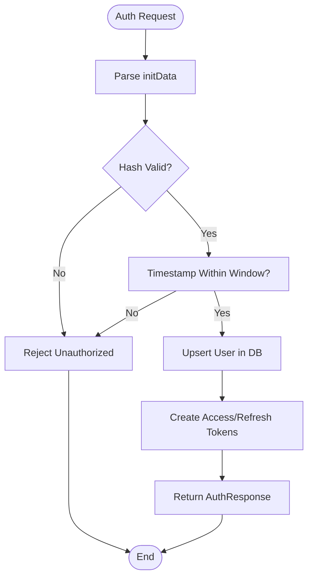
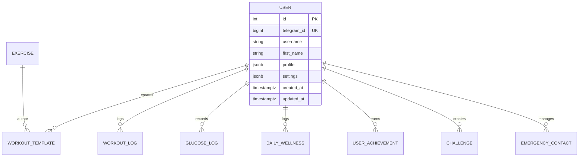
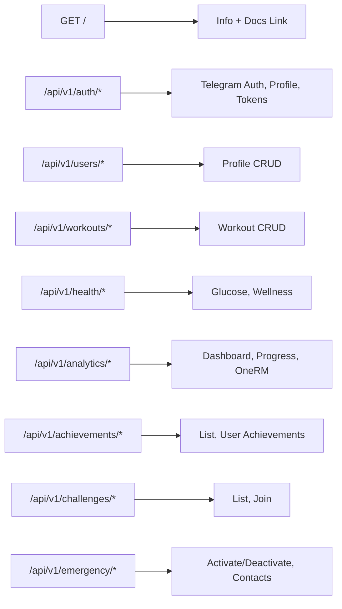
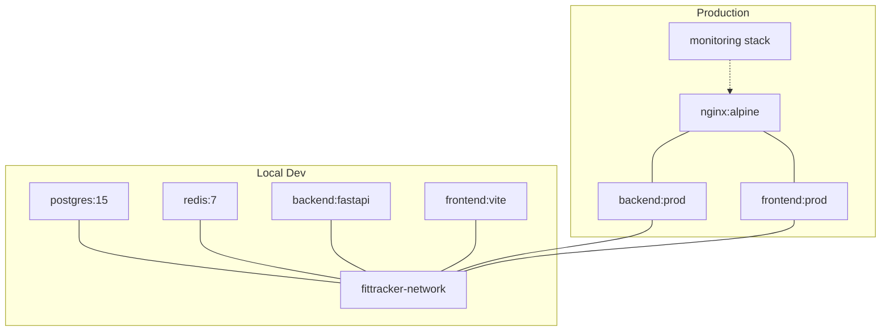
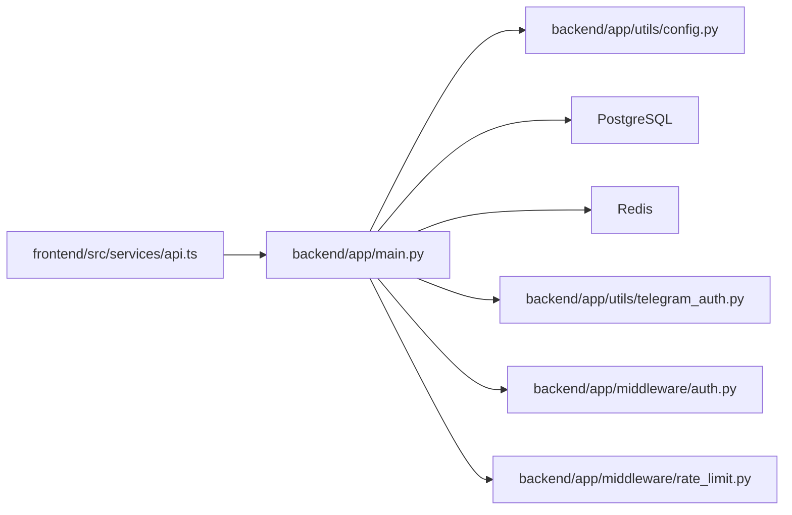

# Architecture & Design

<cite>
**Referenced Files in This Document**
- [backend/app/main.py](file://backend/app/main.py)
- [backend/app/api/auth.py](file://backend/app/api/auth.py)
- [backend/app/middleware/auth.py](file://backend/app/middleware/auth.py)
- [backend/app/utils/telegram_auth.py](file://backend/app/utils/telegram_auth.py)
- [backend/app/middleware/rate_limit.py](file://backend/app/middleware/rate_limit.py)
- [backend/app/utils/config.py](file://backend/app/utils/config.py)
- [backend/app/models/user.py](file://backend/app/models/user.py)
- [frontend/src/services/api.ts](file://frontend/src/services/api.ts)
- [frontend/src/hooks/useTelegramWebApp.ts](file://frontend/src/hooks/useTelegramWebApp.ts)
- [frontend/src/components/auth/TelegramAuthExample.tsx](file://frontend/src/components/auth/TelegramAuthExample.tsx)
- [docker-compose.yml](file://docker-compose.yml)
- [docker-compose.prod.yml](file://docker-compose.prod.yml)
- [monitoring/docker-compose.monitoring.yml](file://monitoring/docker-compose.monitoring.yml)
- [database/migrations/versions/cd723942379e_initial_schema.py](file://database/migrations/versions/cd723942379e_initial_schema.py)
- [README.md](file://README.md)
</cite>

## Table of Contents
1. [Introduction](#introduction)
2. [Project Structure](#project-structure)
3. [Core Components](#core-components)
4. [Architecture Overview](#architecture-overview)
5. [Detailed Component Analysis](#detailed-component-analysis)
6. [Dependency Analysis](#dependency-analysis)
7. [Performance Considerations](#performance-considerations)
8. [Troubleshooting Guide](#troubleshooting-guide)
9. [Conclusion](#conclusion)
10. [Appendices](#appendices)

## Introduction
This document describes the system architecture of FitTracker Pro, a Telegram Mini App for fitness and health tracking. It covers the high-level architecture, including the Telegram Mini App front-end, FastAPI back-end, PostgreSQL database, and monitoring stack. It explains component interactions, data flows, integration patterns between the front-end and back-end, microservices architecture, containerization strategy, deployment topology, cross-cutting concerns (authentication, security, monitoring, error handling), technology stack decisions, architectural patterns, and scalability considerations.

## Project Structure
FitTracker Pro follows a clear separation of concerns:
- Frontend: React + TypeScript + Vite with Telegram Mini Apps SDK integration
- Backend: FastAPI with asynchronous SQLAlchemy, Alembic migrations, Redis caching, and Sentry error tracking
- Database: PostgreSQL with initial schema and migration support
- Monitoring: Prometheus, Grafana, Loki, and cAdvisor
- DevOps: Docker and Docker Compose for local development and production deployment

**Diagram sources**
- [backend/app/main.py:56-106](file://backend/app/main.py#L56-L106)
- [backend/app/api/auth.py:95-175](file://backend/app/api/auth.py#L95-L175)
- [backend/app/middleware/auth.py:111-131](file://backend/app/middleware/auth.py#L111-L131)
- [backend/app/middleware/rate_limit.py:37-179](file://backend/app/middleware/rate_limit.py#L37-L179)
- [backend/app/utils/config.py:15-55](file://backend/app/utils/config.py#L15-L55)
- [backend/app/utils/telegram_auth.py:14-105](file://backend/app/utils/telegram_auth.py#L14-L105)
- [backend/app/models/user.py:23-132](file://backend/app/models/user.py#L23-L132)
- [frontend/src/services/api.ts:1-69](file://frontend/src/services/api.ts#L1-L69)
- [frontend/src/hooks/useTelegramWebApp.ts:120-506](file://frontend/src/hooks/useTelegramWebApp.ts#L120-L506)
- [frontend/src/components/auth/TelegramAuthExample.tsx:17-122](file://frontend/src/components/auth/TelegramAuthExample.tsx#L17-L122)
- [docker-compose.yml:43-90](file://docker-compose.yml#L43-L90)
- [docker-compose.prod.yml:102-124](file://docker-compose.prod.yml#L102-L124)
- [monitoring/docker-compose.monitoring.yml:1-124](file://monitoring/docker-compose.monitoring.yml#L1-L124)

**Section sources**
- [README.md:1-237](file://README.md#L1-L237)
- [docker-compose.yml:1-99](file://docker-compose.yml#L1-L99)
- [docker-compose.prod.yml:1-132](file://docker-compose.prod.yml#L1-L132)

## Core Components
- Telegram Mini App front-end
  - Axios-based API client with automatic auth token injection
  - Telegram WebApp integration hook for native capabilities
  - Example authentication component demonstrating Telegram initData exchange
- FastAPI back-end
  - Centralized router registration and middleware pipeline
  - Telegram WebApp authentication utilities and validators
  - JWT-based authentication and authorization dependencies
  - Rate limiting middleware using Redis with graceful degradation
  - Configuration via Pydantic settings
- Database
  - PostgreSQL with Alembic migrations and JSONB fields for flexible user profiles/settings
- Monitoring stack
  - Prometheus, Grafana, Loki, cAdvisor, and Node Exporter for observability

**Section sources**
- [frontend/src/services/api.ts:1-69](file://frontend/src/services/api.ts#L1-L69)
- [frontend/src/hooks/useTelegramWebApp.ts:120-506](file://frontend/src/hooks/useTelegramWebApp.ts#L120-L506)
- [frontend/src/components/auth/TelegramAuthExample.tsx:17-122](file://frontend/src/components/auth/TelegramAuthExample.tsx#L17-L122)
- [backend/app/main.py:13-106](file://backend/app/main.py#L13-L106)
- [backend/app/utils/telegram_auth.py:14-105](file://backend/app/utils/telegram_auth.py#L14-L105)
- [backend/app/middleware/auth.py:111-131](file://backend/app/middleware/auth.py#L111-L131)
- [backend/app/middleware/rate_limit.py:37-179](file://backend/app/middleware/rate_limit.py#L37-L179)
- [backend/app/utils/config.py:15-55](file://backend/app/utils/config.py#L15-L55)
- [database/migrations/versions/cd723942379e_initial_schema.py:19-460](file://database/migrations/versions/cd723942379e_initial_schema.py#L19-L460)

## Architecture Overview
FitTracker Pro uses a containerized microservice-style layout:
- Frontend container serves static assets behind Nginx in production
- Backend container exposes REST APIs with CORS, rate limiting, and JWT auth
- Shared infrastructure containers: PostgreSQL (primary data store), Redis (caching/rate limiting), and optional monitoring stack

**Diagram sources**
- [docker-compose.prod.yml:102-124](file://docker-compose.prod.yml#L102-L124)
- [docker-compose.yml:43-90](file://docker-compose.yml#L43-L90)
- [monitoring/docker-compose.monitoring.yml:1-124](file://monitoring/docker-compose.monitoring.yml#L1-L124)

## Detailed Component Analysis

### Telegram Mini App Integration
The front-end integrates tightly with Telegram WebApp:
- Initialization and theming via a dedicated hook
- Retrieval of initData from the WebApp
- Submission of initData to the backend for validation and token issuance
- Automatic Authorization header injection for subsequent API calls

**Diagram sources**
- [frontend/src/hooks/useTelegramWebApp.ts:120-506](file://frontend/src/hooks/useTelegramWebApp.ts#L120-L506)
- [frontend/src/services/api.ts:1-69](file://frontend/src/services/api.ts#L1-L69)
- [backend/app/api/auth.py:95-175](file://backend/app/api/auth.py#L95-L175)
- [backend/app/utils/telegram_auth.py:172-204](file://backend/app/utils/telegram_auth.py#L172-L204)

**Section sources**
- [frontend/src/components/auth/TelegramAuthExample.tsx:62-122](file://frontend/src/components/auth/TelegramAuthExample.tsx#L62-L122)
- [frontend/src/services/api.ts:21-45](file://frontend/src/services/api.ts#L21-L45)
- [backend/app/api/auth.py:95-175](file://backend/app/api/auth.py#L95-L175)
- [backend/app/utils/telegram_auth.py:108-156](file://backend/app/utils/telegram_auth.py#L108-L156)

### Authentication and Authorization
- Telegram initData validation with HMAC-SHA256 and timestamp checks
- User creation/upsertion based on Telegram identity
- JWT access/refresh tokens with configurable expiration
- Protected routes enforced via JWT Bearer middleware
- Token refresh and logout endpoints

**Diagram sources**
- [backend/app/utils/telegram_auth.py:54-105](file://backend/app/utils/telegram_auth.py#L54-L105)
- [backend/app/utils/telegram_auth.py:108-156](file://backend/app/utils/telegram_auth.py#L108-L156)
- [backend/app/api/auth.py:41-91](file://backend/app/api/auth.py#L41-L91)
- [backend/app/middleware/auth.py:21-77](file://backend/app/middleware/auth.py#L21-L77)

**Section sources**
- [backend/app/api/auth.py:95-175](file://backend/app/api/auth.py#L95-L175)
- [backend/app/middleware/auth.py:111-131](file://backend/app/middleware/auth.py#L111-L131)
- [backend/app/utils/telegram_auth.py:14-105](file://backend/app/utils/telegram_auth.py#L14-L105)

### Data Model: User
The User entity encapsulates Telegram identity, profile, and settings using JSONB for flexibility. It defines relationships to related entities (workouts, health logs, achievements, etc.) and includes indexes for performance.

**Diagram sources**
- [backend/app/models/user.py:23-132](file://backend/app/models/user.py#L23-L132)
- [database/migrations/versions/cd723942379e_initial_schema.py:26-42](file://database/migrations/versions/cd723942379e_initial_schema.py#L26-L42)

**Section sources**
- [backend/app/models/user.py:23-132](file://backend/app/models/user.py#L23-L132)
- [database/migrations/versions/cd723942379e_initial_schema.py:19-460](file://database/migrations/versions/cd723942379e_initial_schema.py#L19-L460)

### Backend API Surface and Routing
The backend registers routers for health, auth, users, workouts, exercises, health metrics, analytics, achievements, challenges, and emergency endpoints. The root path returns metadata and links to docs.

**Diagram sources**
- [backend/app/main.py:89-106](file://backend/app/main.py#L89-L106)

**Section sources**
- [backend/app/main.py:56-106](file://backend/app/main.py#L56-L106)

### Containerization and Deployment Topology
- Local development: docker-compose spins up PostgreSQL, Redis, backend, and frontend with shared network
- Production: docker-compose.prod.yml adds Nginx reverse proxy, SSL mounts, resource limits, and external network sharing with monitoring stack

**Diagram sources**
- [docker-compose.yml:1-99](file://docker-compose.yml#L1-L99)
- [docker-compose.prod.yml:1-132](file://docker-compose.prod.yml#L1-L132)
- [monitoring/docker-compose.monitoring.yml:1-124](file://monitoring/docker-compose.monitoring.yml#L1-L124)

**Section sources**
- [docker-compose.yml:1-99](file://docker-compose.yml#L1-L99)
- [docker-compose.prod.yml:1-132](file://docker-compose.prod.yml#L1-L132)

## Dependency Analysis
- Frontend-to-Backend
  - Axios client injects Authorization header automatically
  - Front-end expects backend endpoints for Telegram auth and protected routes
- Backend-to-Infrastructure
  - Database and Redis URLs configured via environment
  - Sentry DSN enables error tracking
  - CORS configured via environment variable
- Backend-to-Frontend
  - Telegram WebApp URL configured for redirect and validation
  - Front-end reads VITE_API_URL to target backend

**Diagram sources**
- [frontend/src/services/api.ts:1-69](file://frontend/src/services/api.ts#L1-L69)
- [backend/app/main.py:25-87](file://backend/app/main.py#L25-L87)
- [backend/app/utils/config.py:15-55](file://backend/app/utils/config.py#L15-L55)
- [backend/app/utils/telegram_auth.py:14-105](file://backend/app/utils/telegram_auth.py#L14-L105)
- [backend/app/middleware/auth.py:111-131](file://backend/app/middleware/auth.py#L111-L131)
- [backend/app/middleware/rate_limit.py:37-179](file://backend/app/middleware/rate_limit.py#L37-L179)

**Section sources**
- [frontend/src/services/api.ts:1-69](file://frontend/src/services/api.ts#L1-L69)
- [backend/app/main.py:25-87](file://backend/app/main.py#L25-L87)
- [backend/app/utils/config.py:15-55](file://backend/app/utils/config.py#L15-L55)

## Performance Considerations
- Asynchronous database operations with SQLAlchemy asyncpg reduce latency under load
- Redis-backed rate limiting with graceful fallback to in-memory storage ensures resilience
- JSONB fields enable flexible schemas while maintaining query performance with GIN indexes
- Caching via Redis supports token storage and rate-limit state
- Resource limits in production compose help prevent resource exhaustion

[No sources needed since this section provides general guidance]

## Troubleshooting Guide
- Authentication failures
  - Validate Telegram initData signature and timestamp window
  - Ensure backend SECRET_KEY and TELEGRAM_BOT_TOKEN are set
- CORS and proxy issues
  - Confirm ALLOWED_ORIGINS includes frontend origins
  - Verify Nginx configuration and SSL mounts in production
- Rate limiting errors
  - Inspect X-RateLimit-* headers and Retry-After
  - Check Redis connectivity or fallback behavior
- Sentry error tracking
  - Configure SENTRY_DSN for error reporting in both frontend and backend
- Database migrations
  - Run Alembic upgrade after deploying backend container

**Section sources**
- [backend/app/utils/telegram_auth.py:108-156](file://backend/app/utils/telegram_auth.py#L108-L156)
- [backend/app/middleware/rate_limit.py:159-169](file://backend/app/middleware/rate_limit.py#L159-L169)
- [backend/app/utils/config.py:40-47](file://backend/app/utils/config.py#L40-L47)
- [docker-compose.prod.yml:102-124](file://docker-compose.prod.yml#L102-L124)

## Conclusion
FitTracker Pro employs a pragmatic, container-first architecture combining a React-based Telegram Mini App front-end with a FastAPI-powered backend, PostgreSQL for persistence, and Redis for caching and rate limiting. The system emphasizes secure, scalable operations through JWT-based authentication, Telegram WebApp integration, robust middleware, and a comprehensive monitoring stack. The documented deployment topologies and cross-cutting concerns provide a solid foundation for development, testing, and production operations.

[No sources needed since this section summarizes without analyzing specific files]

## Appendices

### Technology Stack Decisions
- Frontend: React + TypeScript + Vite for rapid development and strong typing; Telegram Mini Apps SDK for native integrations
- Backend: FastAPI for high-performance async APIs; SQLAlchemy for ORM; Alembic for migrations
- Infrastructure: PostgreSQL for relational data and JSONB flexibility; Redis for caching and rate limiting
- Observability: Prometheus + Grafana for metrics and visualization; Loki for log aggregation; cAdvisor and Node Exporter for container/system metrics
- DevOps: Docker and Docker Compose for reproducible environments; GitHub Actions for CI/CD

**Section sources**
- [README.md:18-44](file://README.md#L18-L44)
- [monitoring/docker-compose.monitoring.yml:1-124](file://monitoring/docker-compose.monitoring.yml#L1-L124)

### Scalability Considerations
- Stateless backend design with JWT tokens and Redis for session-like state
- Horizontal scaling potential for backend replicas behind Nginx
- Database partitioning and indexing strategies for high-cardinality JSONB fields
- CDN-friendly static assets served by Nginx in production

[No sources needed since this section provides general guidance]