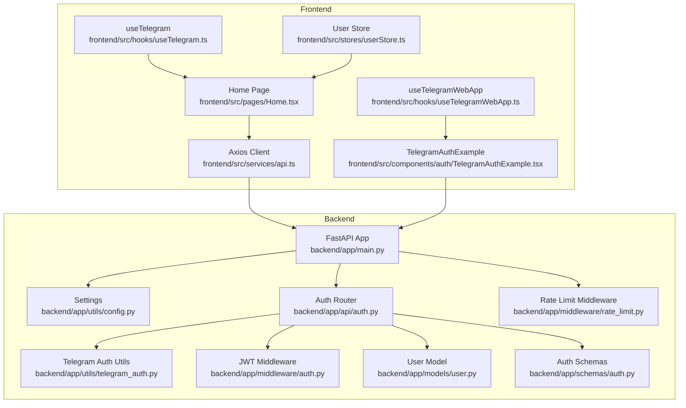
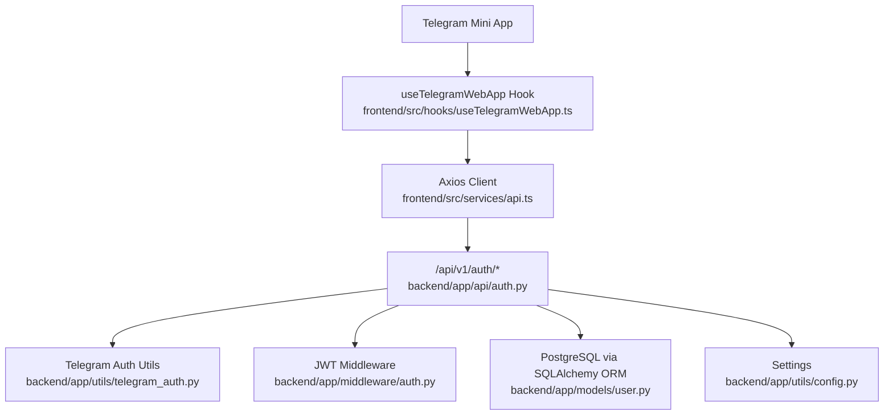
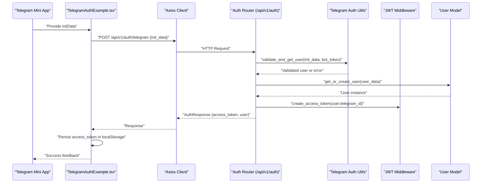
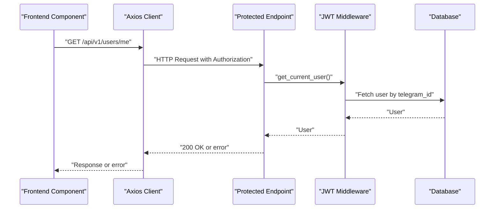
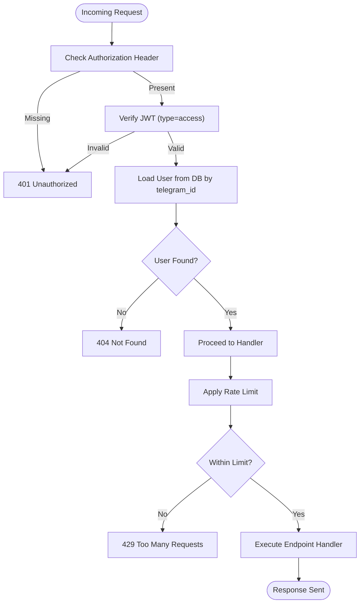
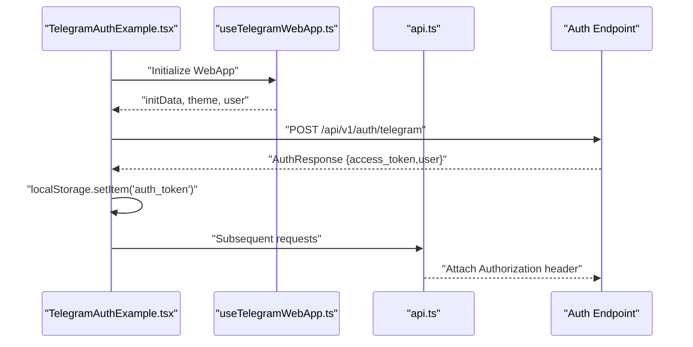
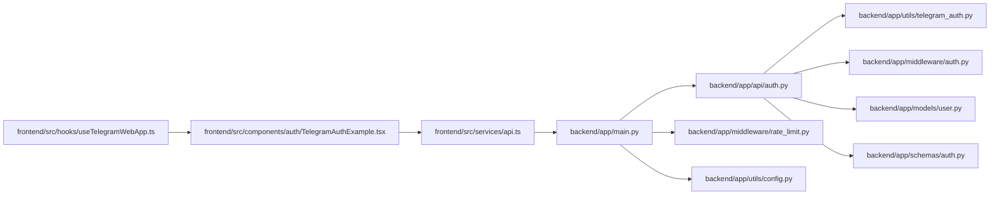

# Component Interactions

<cite>
**Referenced Files in This Document**
- [backend/app/main.py](file://backend/app/main.py)
- [backend/app/utils/config.py](file://backend/app/utils/config.py)
- [backend/app/utils/telegram_auth.py](file://backend/app/utils/telegram_auth.py)
- [backend/app/api/auth.py](file://backend/app/api/auth.py)
- [backend/app/middleware/auth.py](file://backend/app/middleware/auth.py)
- [backend/app/middleware/rate_limit.py](file://backend/app/middleware/rate_limit.py)
- [backend/app/models/user.py](file://backend/app/models/user.py)
- [backend/app/schemas/auth.py](file://backend/app/schemas/auth.py)
- [frontend/src/services/api.ts](file://frontend/src/services/api.ts)
- [frontend/src/hooks/useTelegramWebApp.ts](file://frontend/src/hooks/useTelegramWebApp.ts)
- [frontend/src/hooks/useTelegram.ts](file://frontend/src/hooks/useTelegram.ts)
- [frontend/src/components/auth/TelegramAuthExample.tsx](file://frontend/src/components/auth/TelegramAuthExample.tsx)
- [frontend/src/stores/userStore.ts](file://frontend/src/stores/userStore.ts)
- [frontend/src/pages/Home.tsx](file://frontend/src/pages/Home.tsx)
</cite>

## Table of Contents
1. [Introduction](#introduction)
2. [Project Structure](#project-structure)
3. [Core Components](#core-components)
4. [Architecture Overview](#architecture-overview)
5. [Detailed Component Analysis](#detailed-component-analysis)
6. [Dependency Analysis](#dependency-analysis)
7. [Performance Considerations](#performance-considerations)
8. [Troubleshooting Guide](#troubleshooting-guide)
9. [Conclusion](#conclusion)

## Introduction
This document explains how the Telegram Mini App interacts with the FitTracker Pro backend API, focusing on authentication flows, data exchange patterns, and middleware behavior. It details how frontend components communicate with backend services, including request-response cycles, error handling, and state synchronization. Real-time communication mechanisms are not implemented in the current codebase; therefore, this document emphasizes synchronous HTTP interactions and local state management.

## Project Structure
The system consists of:
- Frontend (React + TypeScript) using Telegram WebApp SDK and a lightweight HTTP client
- Backend (FastAPI) exposing REST endpoints, JWT-based authentication, and rate limiting
- Shared configuration and utilities for Telegram authentication and security

**Diagram sources**
- [backend/app/main.py:89-106](file://backend/app/main.py#L89-L106)
- [backend/app/api/auth.py:36-36](file://backend/app/api/auth.py#L36-L36)
- [backend/app/utils/telegram_auth.py:14-225](file://backend/app/utils/telegram_auth.py#L14-L225)
- [backend/app/middleware/auth.py:174-203](file://backend/app/middleware/auth.py#L174-L203)
- [backend/app/middleware/rate_limit.py:37-179](file://backend/app/middleware/rate_limit.py#L37-L179)
- [backend/app/models/user.py:23-132](file://backend/app/models/user.py#L23-L132)
- [backend/app/schemas/auth.py:10-90](file://backend/app/schemas/auth.py#L10-L90)
- [frontend/src/services/api.ts:6-69](file://frontend/src/services/api.ts#L6-L69)
- [frontend/src/hooks/useTelegramWebApp.ts:120-506](file://frontend/src/hooks/useTelegramWebApp.ts#L120-L506)
- [frontend/src/hooks/useTelegram.ts:4-47](file://frontend/src/hooks/useTelegram.ts#L4-L47)
- [frontend/src/components/auth/TelegramAuthExample.tsx:17-222](file://frontend/src/components/auth/TelegramAuthExample.tsx#L17-L222)
- [frontend/src/pages/Home.tsx:22-277](file://frontend/src/pages/Home.tsx#L22-L277)
- [frontend/src/stores/userStore.ts:15-31](file://frontend/src/stores/userStore.ts#L15-L31)

**Section sources**
- [backend/app/main.py:89-106](file://backend/app/main.py#L89-L106)
- [frontend/src/services/api.ts:6-69](file://frontend/src/services/api.ts#L6-L69)

## Core Components
- Backend application entry and routing:
  - Registers routers under /api/v1 and applies CORS and rate-limiting middleware.
- Authentication utilities:
  - Validates Telegram initData, extracts user data, and creates simple auth tokens.
- Auth endpoints:
  - Accepts Telegram initData, validates it, creates/updates a user, and returns JWT tokens.
- JWT middleware:
  - Creates and verifies access/refresh tokens; exposes dependencies to fetch current user.
- Rate limiting:
  - Enforces per-endpoint limits using Redis or in-memory fallback.
- Frontend HTTP client:
  - Centralized Axios client with interceptors for auth token injection and error logging.
- Telegram WebApp integration:
  - React hooks to initialize WebApp, read initData, and trigger UI actions.
- Example authentication component:
  - Demonstrates sending initData to backend and storing JWT tokens.
- User store:
  - Local Zustand store for user state persistence.

**Section sources**
- [backend/app/main.py:77-106](file://backend/app/main.py#L77-L106)
- [backend/app/utils/telegram_auth.py:54-225](file://backend/app/utils/telegram_auth.py#L54-L225)
- [backend/app/api/auth.py:95-184](file://backend/app/api/auth.py#L95-L184)
- [backend/app/middleware/auth.py:21-203](file://backend/app/middleware/auth.py#L21-L203)
- [backend/app/middleware/rate_limit.py:37-179](file://backend/app/middleware/rate_limit.py#L37-L179)
- [frontend/src/services/api.ts:6-69](file://frontend/src/services/api.ts#L6-L69)
- [frontend/src/hooks/useTelegramWebApp.ts:120-506](file://frontend/src/hooks/useTelegramWebApp.ts#L120-L506)
- [frontend/src/components/auth/TelegramAuthExample.tsx:62-122](file://frontend/src/components/auth/TelegramAuthExample.tsx#L62-L122)
- [frontend/src/stores/userStore.ts:15-31](file://frontend/src/stores/userStore.ts#L15-L31)

## Architecture Overview
The backend is a FastAPI application with:
- Routers mounted under /api/v1 for health, auth, users, workouts, exercises, health, analytics, achievements, challenges, and emergency.
- Global middleware for CORS and rate limiting.
- Auth endpoints protected by JWT bearer tokens (except /auth/telegram).

**Diagram sources**
- [backend/app/main.py:89-106](file://backend/app/main.py#L89-L106)
- [backend/app/api/auth.py:95-184](file://backend/app/api/auth.py#L95-L184)
- [backend/app/utils/telegram_auth.py:54-225](file://backend/app/utils/telegram_auth.py#L54-L225)
- [backend/app/middleware/auth.py:174-203](file://backend/app/middleware/auth.py#L174-L203)
- [backend/app/models/user.py:23-132](file://backend/app/models/user.py#L23-L132)
- [backend/app/utils/config.py:15-55](file://backend/app/utils/config.py#L15-L55)
- [frontend/src/services/api.ts:6-69](file://frontend/src/services/api.ts#L6-L69)
- [frontend/src/hooks/useTelegramWebApp.ts:120-506](file://frontend/src/hooks/useTelegramWebApp.ts#L120-L506)

## Detailed Component Analysis

### Authentication Flow: Telegram Mini App to Backend
This sequence illustrates the end-to-end authentication flow from the Telegram Mini App to the backend and back to the frontend.

**Diagram sources**
- [frontend/src/components/auth/TelegramAuthExample.tsx:74-107](file://frontend/src/components/auth/TelegramAuthExample.tsx#L74-L107)
- [frontend/src/services/api.ts:52-54](file://frontend/src/services/api.ts#L52-L54)
- [backend/app/api/auth.py:135-175](file://backend/app/api/auth.py#L135-L175)
- [backend/app/utils/telegram_auth.py:172-204](file://backend/app/utils/telegram_auth.py#L172-L204)
- [backend/app/middleware/auth.py:21-49](file://backend/app/middleware/auth.py#L21-L49)
- [backend/app/models/user.py:49-90](file://backend/app/models/user.py#L49-L90)

**Section sources**
- [backend/app/api/auth.py:95-184](file://backend/app/api/auth.py#L95-L184)
- [backend/app/utils/telegram_auth.py:54-225](file://backend/app/utils/telegram_auth.py#L54-L225)
- [backend/app/middleware/auth.py:21-203](file://backend/app/middleware/auth.py#L21-L203)
- [frontend/src/components/auth/TelegramAuthExample.tsx:62-122](file://frontend/src/components/auth/TelegramAuthExample.tsx#L62-L122)
- [frontend/src/services/api.ts:52-65](file://frontend/src/services/api.ts#L52-L65)

### Data Exchange Patterns and Request-Response Cycles
- Authentication:
  - Frontend sends raw initData to /api/v1/auth/telegram.
  - Backend validates initData, ensures user exists, issues JWT access token.
- Subsequent Requests:
  - Frontend’s Axios client automatically attaches Authorization: Bearer <token> for protected routes.
  - Backend enforces JWT bearer requirement for most endpoints via dependencies.
- Error Handling:
  - Frontend logs API errors via response interceptor.
  - Backend raises HTTPException with appropriate status codes and messages.

**Diagram sources**
- [frontend/src/services/api.ts:21-45](file://frontend/src/services/api.ts#L21-L45)
- [backend/app/middleware/auth.py:174-203](file://backend/app/middleware/auth.py#L174-L203)
- [backend/app/api/auth.py:186-222](file://backend/app/api/auth.py#L186-L222)

**Section sources**
- [frontend/src/services/api.ts:21-45](file://frontend/src/services/api.ts#L21-L45)
- [backend/app/middleware/auth.py:133-203](file://backend/app/middleware/auth.py#L133-L203)
- [backend/app/api/auth.py:186-222](file://backend/app/api/auth.py#L186-L222)

### Middleware Architecture and Authentication Middleware Flow
- JWT creation and verification:
  - Access tokens expire after a configurable duration; refresh tokens last 7 days.
  - Token verification decodes JWT and checks token type.
- Dependency chain:
  - get_current_user_id validates Authorization header and extracts user_id.
  - get_current_user loads the User entity from the database.
- Rate limiting:
  - Per-endpoint limits enforced globally; Redis-backed with in-memory fallback.
  - Headers returned indicate limit, remaining, and reset time.

**Diagram sources**
- [backend/app/middleware/auth.py:133-203](file://backend/app/middleware/auth.py#L133-L203)
- [backend/app/middleware/rate_limit.py:137-179](file://backend/app/middleware/rate_limit.py#L137-L179)

**Section sources**
- [backend/app/middleware/auth.py:21-203](file://backend/app/middleware/auth.py#L21-L203)
- [backend/app/middleware/rate_limit.py:37-179](file://backend/app/middleware/rate_limit.py#L37-L179)

### Frontend-Backend Interaction Patterns
- Telegram WebApp initialization:
  - useTelegramWebApp initializes WebApp, exposes theme and UI controls.
- Authentication example:
  - TelegramAuthExample obtains initData, posts to backend, persists token, and triggers haptic feedback.
- HTTP client:
  - api.ts injects Authorization header and centralizes error logging.
- State synchronization:
  - userStore persists user state locally; Home page reads Telegram user data and updates UI.

**Diagram sources**
- [frontend/src/components/auth/TelegramAuthExample.tsx:74-107](file://frontend/src/components/auth/TelegramAuthExample.tsx#L74-L107)
- [frontend/src/hooks/useTelegramWebApp.ts:166-175](file://frontend/src/hooks/useTelegramWebApp.ts#L166-L175)
- [frontend/src/services/api.ts:21-33](file://frontend/src/services/api.ts#L21-L33)

**Section sources**
- [frontend/src/hooks/useTelegramWebApp.ts:120-506](file://frontend/src/hooks/useTelegramWebApp.ts#L120-L506)
- [frontend/src/components/auth/TelegramAuthExample.tsx:62-122](file://frontend/src/components/auth/TelegramAuthExample.tsx#L62-L122)
- [frontend/src/services/api.ts:21-45](file://frontend/src/services/api.ts#L21-L45)
- [frontend/src/stores/userStore.ts:15-31](file://frontend/src/stores/userStore.ts#L15-L31)
- [frontend/src/pages/Home.tsx:46-53](file://frontend/src/pages/Home.tsx#L46-L53)

## Dependency Analysis
- Backend:
  - main.py registers routers and middleware; depends on settings for configuration.
  - auth router depends on telegram_auth utilities, JWT middleware, models, and schemas.
  - rate limit middleware depends on settings for Redis URL and endpoint-specific limits.
- Frontend:
  - api.ts depends on environment variables for base URL.
  - useTelegramWebApp depends on Telegram WebApp SDK.
  - TelegramAuthExample depends on useTelegramWebApp and api.ts.

**Diagram sources**
- [backend/app/main.py:89-106](file://backend/app/main.py#L89-L106)
- [backend/app/api/auth.py:13-34](file://backend/app/api/auth.py#L13-L34)
- [backend/app/utils/telegram_auth.py:11-11](file://backend/app/utils/telegram_auth.py#L11-L11)
- [backend/app/middleware/auth.py:14-15](file://backend/app/middleware/auth.py#L14-L15)
- [backend/app/middleware/rate_limit.py:44-58](file://backend/app/middleware/rate_limit.py#L44-L58)
- [backend/app/utils/config.py:15-55](file://backend/app/utils/config.py#L15-L55)
- [frontend/src/services/api.ts](file://frontend/src/services/api.ts#L4)
- [frontend/src/hooks/useTelegramWebApp.ts:120-506](file://frontend/src/hooks/useTelegramWebApp.ts#L120-L506)
- [frontend/src/components/auth/TelegramAuthExample.tsx:17-222](file://frontend/src/components/auth/TelegramAuthExample.tsx#L17-L222)

**Section sources**
- [backend/app/main.py:89-106](file://backend/app/main.py#L89-L106)
- [backend/app/api/auth.py:13-34](file://backend/app/api/auth.py#L13-L34)
- [frontend/src/services/api.ts](file://frontend/src/services/api.ts#L4)

## Performance Considerations
- Rate limiting:
  - Enforced per endpoint with Redis-backed counters and in-memory fallback when Redis is unavailable.
  - Responses include X-RateLimit-* headers to inform clients about remaining quota and reset time.
- Token lifecycle:
  - Access tokens are short-lived; refresh tokens are long-lived. Consider implementing token rotation and optional blacklist for enhanced security.
- Frontend caching:
  - Local state management (Zustand) reduces redundant network calls; consider adding optimistic updates and selective re-fetching.

[No sources needed since this section provides general guidance]

## Troubleshooting Guide
- Authentication failures:
  - Validate that the Telegram bot token matches the backend configuration and that initData is passed intact.
  - Check for expired initData (default max age 300 seconds) and invalid signatures.
- Missing Authorization header:
  - Ensure the frontend stores and attaches the JWT access token for protected endpoints.
- Rate limit exceeded:
  - Inspect X-RateLimit-Remaining and Retry-After headers; reduce request frequency or adjust limits.
- WebApp initialization:
  - Confirm Telegram WebApp SDK is available and initialized before reading initData.

**Section sources**
- [backend/app/utils/telegram_auth.py:108-156](file://backend/app/utils/telegram_auth.py#L108-L156)
- [backend/app/middleware/rate_limit.py:159-169](file://backend/app/middleware/rate_limit.py#L159-L169)
- [frontend/src/services/api.ts:21-45](file://frontend/src/services/api.ts#L21-L45)
- [frontend/src/hooks/useTelegramWebApp.ts:101-105](file://frontend/src/hooks/useTelegramWebApp.ts#L101-L105)

## Conclusion
FitTracker Pro integrates the Telegram Mini App with a FastAPI backend through a secure, token-based authentication flow. The frontend leverages the Telegram WebApp SDK and a centralized HTTP client to communicate with backend endpoints. Authentication relies on validating Telegram initData, creating a user record, and issuing JWT tokens. Global middleware enforces CORS, rate limiting, and JWT-based authorization. While real-time communication is not implemented, the architecture supports scalable enhancements such as WebSocket-based updates and token blacklisting.