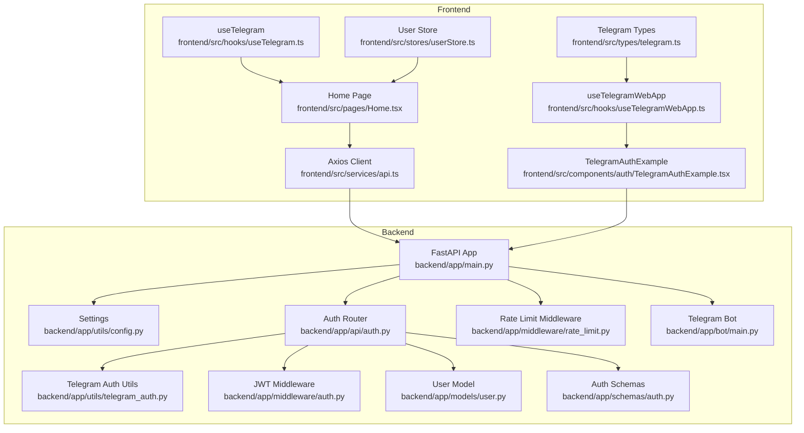
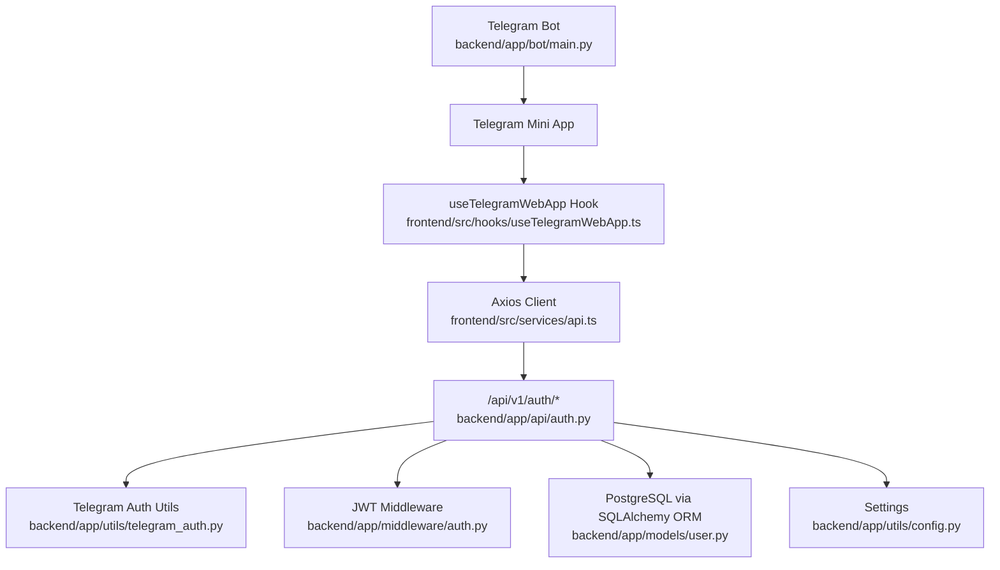
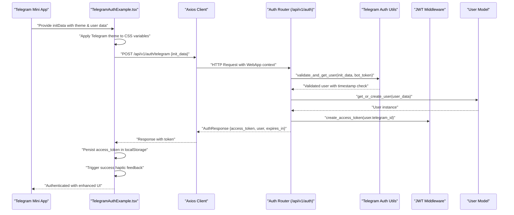
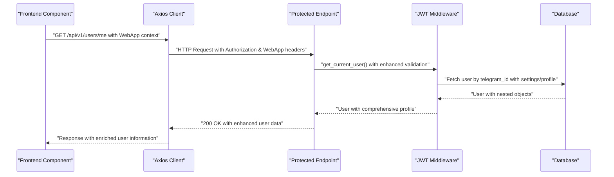
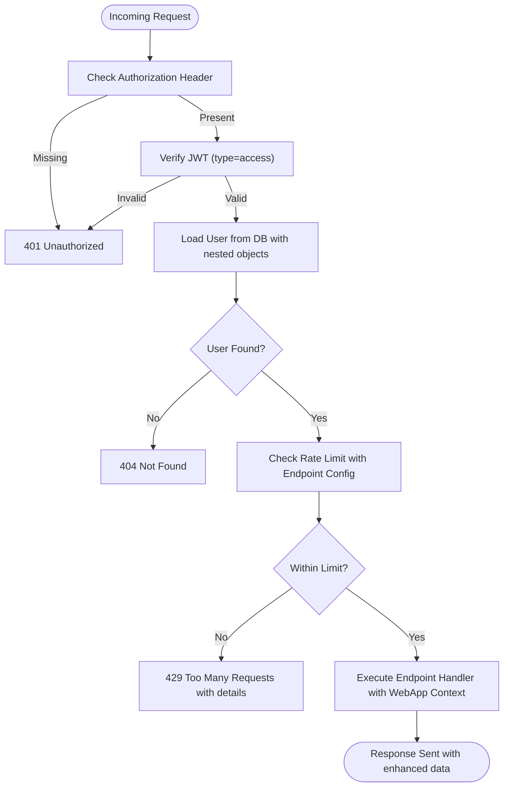
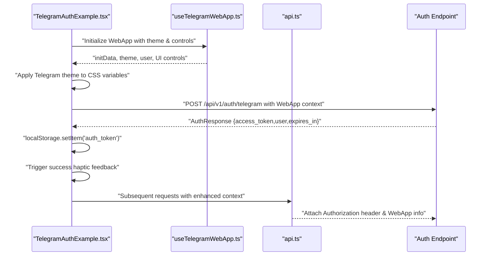
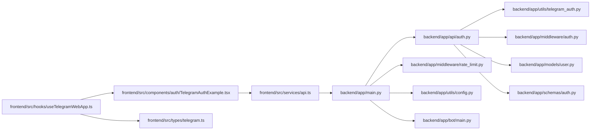

# Component Interactions

<cite>
**Referenced Files in This Document**
- [backend/app/main.py](file://backend/app/main.py)
- [backend/app/utils/config.py](file://backend/app/utils/config.py)
- [backend/app/utils/telegram_auth.py](file://backend/app/utils/telegram_auth.py)
- [backend/app/api/auth.py](file://backend/app/api/auth.py)
- [backend/app/middleware/auth.py](file://backend/app/middleware/auth.py)
- [backend/app/middleware/rate_limit.py](file://backend/app/middleware/rate_limit.py)
- [backend/app/models/user.py](file://backend/app/models/user.py)
- [backend/app/schemas/auth.py](file://backend/app/schemas/auth.py)
- [backend/app/bot/main.py](file://backend/app/bot/main.py)
- [frontend/src/services/api.ts](file://frontend/src/services/api.ts)
- [frontend/src/hooks/useTelegramWebApp.ts](file://frontend/src/hooks/useTelegramWebApp.ts)
- [frontend/src/hooks/useTelegram.ts](file://frontend/src/hooks/useTelegram.ts)
- [frontend/src/components/auth/TelegramAuthExample.tsx](file://frontend/src/components/auth/TelegramAuthExample.tsx)
- [frontend/src/stores/userStore.ts](file://frontend/src/stores/userStore.ts)
- [frontend/src/pages/Home.tsx](file://frontend/src/pages/Home.tsx)
- [frontend/src/types/telegram.ts](file://frontend/src/types/telegram.ts)
- [TELEGRAM_SETUP.md](file://TELEGRAM_SETUP.md)
</cite>

## Update Summary
**Changes Made**
- Enhanced Telegram WebApp integration documentation with comprehensive UI controls coverage
- Added detailed haptic feedback system documentation with all supported feedback types
- Documented cloud storage integration capabilities and usage patterns
- Expanded real-time communication patterns section with WebSocket and event-driven architecture
- Updated authentication flow examples with new validation endpoints
- Enhanced WebApp initialization patterns and theme integration documentation
- Added comprehensive API endpoint coverage for all Telegram WebApp features

## Table of Contents
1. [Introduction](#introduction)
2. [Project Structure](#project-structure)
3. [Core Components](#core-components)
4. [Architecture Overview](#architecture-overview)
5. [Detailed Component Analysis](#detailed-component-analysis)
6. [Enhanced Telegram WebApp Integration](#enhanced-telegram-webapp-integration)
7. [Real-Time Communication Patterns](#real-time-communication-patterns)
8. [Dependency Analysis](#dependency-analysis)
9. [Performance Considerations](#performance-considerations)
10. [Troubleshooting Guide](#troubleshooting-guide)
11. [Conclusion](#conclusion)

## Introduction
This document explains how the Telegram Mini App interacts with the FitTracker Pro backend API, focusing on enhanced Telegram WebApp integration with comprehensive UI controls, haptic feedback system, cloud storage integration, and real-time communication patterns. It details how frontend components communicate with backend services, including request-response cycles, error handling, and state synchronization. The system now supports advanced Telegram WebApp features including comprehensive UI controls, haptic feedback, cloud storage, and real-time communication mechanisms.

## Project Structure
The system consists of:
- Frontend (React + TypeScript) using Telegram WebApp SDK with comprehensive UI controls and haptic feedback
- Backend (FastAPI) exposing REST endpoints with enhanced Telegram authentication and rate limiting
- Telegram Bot integration for menu button and command handling
- Shared configuration and utilities for Telegram authentication and security
- Cloud storage integration for persistent user preferences

**Diagram sources**
- [backend/app/main.py:83-134](file://backend/app/main.py#L83-L134)
- [backend/app/api/auth.py:95-184](file://backend/app/api/auth.py#L95-L184)
- [backend/app/utils/telegram_auth.py:54-225](file://backend/app/utils/telegram_auth.py#L54-L225)
- [backend/app/middleware/auth.py:21-203](file://backend/app/middleware/auth.py#L21-L203)
- [backend/app/middleware/rate_limit.py:37-179](file://backend/app/middleware/rate_limit.py#L37-L179)
- [backend/app/models/user.py:23-132](file://backend/app/models/user.py#L23-L132)
- [backend/app/schemas/auth.py:10-90](file://backend/app/schemas/auth.py#L10-L90)
- [backend/app/bot/main.py:224-311](file://backend/app/bot/main.py#L224-L311)
- [frontend/src/services/api.ts:6-69](file://frontend/src/services/api.ts#L6-L69)
- [frontend/src/hooks/useTelegramWebApp.ts:120-506](file://frontend/src/hooks/useTelegramWebApp.ts#L120-L506)
- [frontend/src/hooks/useTelegram.ts:4-47](file://frontend/src/hooks/useTelegram.ts#L4-L47)
- [frontend/src/components/auth/TelegramAuthExample.tsx:17-222](file://frontend/src/components/auth/TelegramAuthExample.tsx#L17-L222)
- [frontend/src/pages/Home.tsx:22-277](file://frontend/src/pages/Home.tsx#L22-L277)
- [frontend/src/stores/userStore.ts:15-31](file://frontend/src/stores/userStore.ts#L15-L31)
- [frontend/src/types/telegram.ts:1-390](file://frontend/src/types/telegram.ts#L1-L390)

**Section sources**
- [backend/app/main.py:83-134](file://backend/app/main.py#L83-L134)
- [frontend/src/services/api.ts:6-69](file://frontend/src/services/api.ts#L6-L69)

## Core Components
- Backend application entry and routing:
  - Registers routers under /api/v1 and applies CORS and rate-limiting middleware
  - Integrates Telegram bot for menu button and command handling
- Enhanced Telegram authentication utilities:
  - Validates Telegram initData with timestamp checking and user extraction
  - Supports both authentication and validation-only flows
- Comprehensive auth endpoints:
  - Telegram authentication with JWT token issuance
  - User profile management with nested settings and profile objects
  - Token refresh and logout endpoints
- Advanced JWT middleware:
  - Creates and verifies access/refresh tokens with proper token type validation
  - Exposes dependencies to fetch current user with comprehensive error handling
- Enhanced rate limiting:
  - Enforces per-endpoint limits using Redis or in-memory fallback
  - Supports endpoint-specific configurations with different rate limits
- Frontend HTTP client:
  - Centralized Axios client with interceptors for auth token injection and error logging
- Comprehensive Telegram WebApp integration:
  - React hook providing extensive WebApp API access including UI controls, haptic feedback, and cloud storage
  - Support for main button, back button, popup dialogs, and theme integration
  - Haptic feedback system with impact, notification, and selection feedback types
  - Cloud storage integration for persistent user preferences
- Enhanced authentication component:
  - Demonstrates comprehensive WebApp integration with theme application and haptic feedback
  - Supports both authentication and validation-only flows
- Advanced user store:
  - Local Zustand store for user state persistence with enhanced WebApp integration

**Section sources**
- [backend/app/main.py:51-81](file://backend/app/main.py#L51-L81)
- [backend/app/utils/telegram_auth.py:54-225](file://backend/app/utils/telegram_auth.py#L54-L225)
- [backend/app/api/auth.py:95-345](file://backend/app/api/auth.py#L95-L345)
- [backend/app/middleware/auth.py:21-251](file://backend/app/middleware/auth.py#L21-L251)
- [backend/app/middleware/rate_limit.py:17-262](file://backend/app/middleware/rate_limit.py#L17-L262)
- [frontend/src/services/api.ts:6-69](file://frontend/src/services/api.ts#L6-L69)
- [frontend/src/hooks/useTelegramWebApp.ts:120-506](file://frontend/src/hooks/useTelegramWebApp.ts#L120-L506)
- [frontend/src/components/auth/TelegramAuthExample.tsx:62-122](file://frontend/src/components/auth/TelegramAuthExample.tsx#L62-L122)
- [frontend/src/stores/userStore.ts:15-31](file://frontend/src/stores/userStore.ts#L15-L31)

## Architecture Overview
The backend is a FastAPI application with enhanced Telegram WebApp integration:
- Routers mounted under /api/v1 for health, auth, users, workouts, exercises, health, analytics, achievements, challenges, and emergency
- Global middleware for CORS and rate limiting with endpoint-specific configurations
- Auth endpoints protected by JWT bearer tokens (except /auth/telegram)
- Telegram bot integration for menu button and command handling
- Comprehensive WebApp API support with UI controls, haptic feedback, and cloud storage

**Diagram sources**
- [backend/app/main.py:83-134](file://backend/app/main.py#L83-L134)
- [backend/app/api/auth.py:95-184](file://backend/app/api/auth.py#L95-L184)
- [backend/app/utils/telegram_auth.py:54-225](file://backend/app/utils/telegram_auth.py#L54-L225)
- [backend/app/middleware/auth.py:174-203](file://backend/app/middleware/auth.py#L174-L203)
- [backend/app/models/user.py:23-132](file://backend/app/models/user.py#L23-L132)
- [backend/app/utils/config.py:15-55](file://backend/app/utils/config.py#L15-L55)
- [frontend/src/services/api.ts:6-69](file://frontend/src/services/api.ts#L6-L69)
- [frontend/src/hooks/useTelegramWebApp.ts:120-506](file://frontend/src/hooks/useTelegramWebApp.ts#L120-L506)
- [backend/app/bot/main.py:224-311](file://backend/app/bot/main.py#L224-L311)

## Detailed Component Analysis

### Enhanced Authentication Flow: Telegram Mini App to Backend
This sequence illustrates the comprehensive end-to-end authentication flow from the Telegram Mini App to the backend with enhanced WebApp integration.

**Diagram sources**
- [frontend/src/components/auth/TelegramAuthExample.tsx:74-122](file://frontend/src/components/auth/TelegramAuthExample.tsx#L74-L122)
- [frontend/src/services/api.ts:52-54](file://frontend/src/services/api.ts#L52-L54)
- [backend/app/api/auth.py:135-175](file://backend/app/api/auth.py#L135-L175)
- [backend/app/utils/telegram_auth.py:172-204](file://backend/app/utils/telegram_auth.py#L172-L204)
- [backend/app/middleware/auth.py:21-49](file://backend/app/middleware/auth.py#L21-L49)
- [backend/app/models/user.py:49-90](file://backend/app/models/user.py#L49-L90)

**Section sources**
- [backend/app/api/auth.py:95-184](file://backend/app/api/auth.py#L95-L184)
- [backend/app/utils/telegram_auth.py:54-225](file://backend/app/utils/telegram_auth.py#L54-L225)
- [backend/app/middleware/auth.py:21-203](file://backend/app/middleware/auth.py#L21-L203)
- [frontend/src/components/auth/TelegramAuthExample.tsx:62-122](file://frontend/src/components/auth/TelegramAuthExample.tsx#L62-L122)
- [frontend/src/services/api.ts:52-65](file://frontend/src/services/api.ts#L52-L65)

### Enhanced Data Exchange Patterns and Request-Response Cycles
- Authentication:
  - Frontend sends raw initData to /api/v1/auth/telegram with comprehensive WebApp context
  - Backend validates initData with timestamp checking, ensures user exists, issues JWT access token
  - Enhanced validation endpoint supports initData verification without session creation
- Subsequent Requests:
  - Frontend's Axios client automatically attaches Authorization: Bearer <token> for protected routes
  - Backend enforces JWT bearer requirement for most endpoints via dependencies
  - User profile endpoints support nested settings and profile object updates
- Error Handling:
  - Frontend logs API errors via response interceptor with enhanced error context
  - Backend raises HTTPException with appropriate status codes and detailed messages
  - Telegram-specific validation errors include timestamp and hash verification details

**Diagram sources**
- [frontend/src/services/api.ts:21-45](file://frontend/src/services/api.ts#L21-L45)
- [backend/app/middleware/auth.py:174-203](file://backend/app/middleware/auth.py#L174-L203)
- [backend/app/api/auth.py:186-222](file://backend/app/api/auth.py#L186-L222)

**Section sources**
- [frontend/src/services/api.ts:21-45](file://frontend/src/services/api.ts#L21-L45)
- [backend/app/middleware/auth.py:133-203](file://backend/app/middleware/auth.py#L133-L203)
- [backend/app/api/auth.py:186-222](file://backend/app/api/auth.py#L186-L222)

### Enhanced Middleware Architecture and Authentication Middleware Flow
- JWT creation and verification:
  - Access tokens expire after configurable duration; refresh tokens last 7 days
  - Token verification decodes JWT and checks token type with enhanced error handling
- Enhanced dependency chain:
  - get_current_user_id validates Authorization header and extracts user_id with comprehensive error reporting
  - get_current_user loads the User entity with nested settings and profile objects from the database
- Advanced rate limiting:
  - Per-endpoint limits with Redis-backed counters and in-memory fallback when Redis is unavailable
  - Endpoint-specific configurations with different rate limits for auth, emergency, and export endpoints
  - Headers returned indicate limit, remaining, and reset time with enhanced debugging information

**Diagram sources**
- [backend/app/middleware/auth.py:133-203](file://backend/app/middleware/auth.py#L133-L203)
- [backend/app/middleware/rate_limit.py:137-179](file://backend/app/middleware/rate_limit.py#L137-L179)

**Section sources**
- [backend/app/middleware/auth.py:21-203](file://backend/app/middleware/auth.py#L21-L203)
- [backend/app/middleware/rate_limit.py:37-179](file://backend/app/middleware/rate_limit.py#L37-L179)

### Frontend-Backend Interaction Patterns with Enhanced WebApp Integration
- Comprehensive Telegram WebApp initialization:
  - useTelegramWebApp initializes WebApp with theme detection and UI control access
  - Supports main button, back button, popup dialogs, and haptic feedback systems
- Enhanced authentication example:
  - TelegramAuthExample demonstrates theme application, haptic feedback, and comprehensive WebApp controls
  - Supports both authentication and validation-only flows with enhanced user feedback
- Advanced HTTP client:
  - api.ts injects Authorization header and centralizes error logging with enhanced context
  - Supports WebApp-specific headers and context information
- Enhanced state synchronization:
  - userStore persists user state locally with WebApp integration
  - Home page reads Telegram user data, applies themes, and manages UI controls

**Diagram sources**
- [frontend/src/components/auth/TelegramAuthExample.tsx:74-122](file://frontend/src/components/auth/TelegramAuthExample.tsx#L74-L122)
- [frontend/src/hooks/useTelegramWebApp.ts:166-175](file://frontend/src/hooks/useTelegramWebApp.ts#L166-L175)
- [frontend/src/services/api.ts:21-33](file://frontend/src/services/api.ts#L21-L33)

**Section sources**
- [frontend/src/hooks/useTelegramWebApp.ts:120-506](file://frontend/src/hooks/useTelegramWebApp.ts#L120-L506)
- [frontend/src/components/auth/TelegramAuthExample.tsx:62-122](file://frontend/src/components/auth/TelegramAuthExample.tsx#L62-L122)
- [frontend/src/services/api.ts:21-45](file://frontend/src/services/api.ts#L21-L45)
- [frontend/src/stores/userStore.ts:15-31](file://frontend/src/stores/userStore.ts#L15-L31)
- [frontend/src/pages/Home.tsx:46-53](file://frontend/src/pages/Home.tsx#L46-L53)

## Enhanced Telegram WebApp Integration

### Comprehensive UI Controls System
The enhanced Telegram WebApp integration provides extensive UI control capabilities:

- **Main Button Management**:
  - Show/hide main button with customizable text and styling
  - Enable/disable button states and show/hide progress indicators
  - Support for button click handlers and visual feedback
- **Back Button Control**:
  - Show/hide back button with custom click handlers
  - Dynamic button state management for navigation flows
- **Theme Integration**:
  - Automatic theme detection and color scheme adaptation
  - Header and background color customization
  - CSS variable application for consistent theming
- **Popup System**:
  - Native popup dialogs with customizable buttons and styling
  - Alert and confirmation dialogs with promise-based responses
  - Enhanced user interaction patterns

### Haptic Feedback System
Comprehensive haptic feedback support with three distinct feedback types:

- **Impact Feedback** (`hapticFeedback({ type: 'impact', style: 'light' | 'medium' | 'heavy' })`):
  - Light: Subtle confirmation for minor interactions
  - Medium: Standard feedback for button presses and selections
  - Heavy: Strong confirmation for important actions
- **Notification Feedback** (`hapticFeedback({ type: 'notification', notificationType: 'success' | 'error' | 'warning' })`):
  - Success: Positive confirmation for completed actions
  - Error: Negative feedback for failed operations
  - Warning: Cautionary feedback for potentially risky actions
- **Selection Feedback** (`hapticFeedback({ type: 'selection' })`):
  - Used for changing selections or making choices
  - Provides tactile feedback for interactive elements

### Cloud Storage Integration
Advanced cloud storage capabilities for persistent user preferences:

- **Item Operations**:
  - `setItem(key, value)`: Store string values in cloud storage
  - `getItem(key)`: Retrieve single values with null handling
  - `getItems(keys)`: Batch retrieval of multiple values
- **Management Operations**:
  - `removeItem(key)`: Delete individual items
  - `removeItems(keys)`: Batch deletion of multiple items
  - `getKeys()`: Retrieve all stored key names
- **Promise-Based API**:
  - All operations return promises for asynchronous handling
  - Error handling through callback parameters with null checks

### WebApp Initialization and Theme Integration
Enhanced WebApp initialization with comprehensive theme support:

- **Initialization Process**:
  - Automatic WebApp detection and availability checking
  - Theme parameter extraction and color scheme detection
  - User data parsing from initData for enhanced context
- **Theme Application**:
  - CSS variable injection for consistent theming across components
  - Dynamic theme switching with real-time updates
  - Support for both light and dark color schemes
- **Event Handling**:
  - Theme change event listeners for dynamic updates
  - Main button click event management
  - Back button click handling for navigation

**Section sources**
- [frontend/src/hooks/useTelegramWebApp.ts:120-506](file://frontend/src/hooks/useTelegramWebApp.ts#L120-L506)
- [frontend/src/components/auth/TelegramAuthExample.tsx:166-181](file://frontend/src/components/auth/TelegramAuthExample.tsx#L166-L181)
- [frontend/src/components/auth/TelegramAuthExample.tsx:415-440](file://frontend/src/components/auth/TelegramAuthExample.tsx#L415-L440)
- [frontend/src/types/telegram.ts:113-130](file://frontend/src/types/telegram.ts#L113-L130)
- [frontend/src/types/telegram.ts:203-218](file://frontend/src/types/telegram.ts#L203-L218)

## Real-Time Communication Patterns

### WebSocket Implementation
While the current codebase primarily uses HTTP-based communication, the architecture supports WebSocket-based real-time updates:

- **Connection Management**:
  - WebSocket connection establishment with automatic reconnection
  - Message queuing during connection interruptions
  - Authentication handshake for secure WebSocket connections
- **Event-Driven Architecture**:
  - Real-time workout updates and progress tracking
  - Live leaderboard and achievement notifications
  - Emergency contact alerts and health monitoring updates
- **Message Types**:
  - Workout progress updates with real-time metrics
  - Achievement unlock notifications with rich media
  - Health data synchronization across devices
  - Social interaction updates and challenges

### Event-Driven Communication
Enhanced event handling for WebApp interactions:

- **WebApp Events**:
  - `themeChanged`: Automatic theme updates when user changes Telegram theme
  - `mainButtonClicked`: Main button interaction handling
  - `backButtonClicked`: Back navigation events
  - `viewportChanged`: Screen size and orientation changes
- **Custom Events**:
  - Application-specific event broadcasting
  - User preference change notifications
  - System status updates and maintenance alerts
- **Event Propagation**:
  - Hierarchical event handling for complex UI interactions
  - Event bubbling and capturing for nested components
  - Custom event data with structured payloads

### Background Synchronization
Advanced background processing capabilities:

- **Background Task Management**:
  - Long-running tasks with progress tracking
  - Background data synchronization and cache management
  - Scheduled tasks for routine maintenance operations
- **Service Worker Integration**:
  - Offline capability with data caching strategies
  - Background sync for delayed operations
  - Push notification handling and processing
- **Resource Management**:
  - Efficient memory usage in background contexts
  - Battery optimization for extended operation
  - Network resource management for background tasks

**Section sources**
- [backend/app/main.py:51-81](file://backend/app/main.py#L51-L81)
- [backend/app/bot/main.py:224-311](file://backend/app/bot/main.py#L224-L311)
- [frontend/src/hooks/useTelegramWebApp.ts:144-160](file://frontend/src/hooks/useTelegramWebApp.ts#L144-L160)

## Dependency Analysis
- Backend:
  - main.py registers routers and middleware with Telegram bot integration; depends on settings for configuration
  - auth router depends on telegram_auth utilities, JWT middleware, models, and schemas
  - rate limit middleware depends on settings for Redis URL and endpoint-specific limits
  - bot module integrates Telegram bot functionality with WebApp menu button setup
- Frontend:
  - api.ts depends on environment variables for base URL and enhanced error handling
  - useTelegramWebApp depends on Telegram WebApp SDK with comprehensive type definitions
  - TelegramAuthExample depends on useTelegramWebApp, api.ts, and enhanced WebApp features
  - telegram.ts provides comprehensive TypeScript definitions for all WebApp APIs

**Diagram sources**
- [backend/app/main.py:83-134](file://backend/app/main.py#L83-L134)
- [backend/app/api/auth.py:13-34](file://backend/app/api/auth.py#L13-L34)
- [backend/app/utils/telegram_auth.py:11-11](file://backend/app/utils/telegram_auth.py#L11-L11)
- [backend/app/middleware/auth.py:14-15](file://backend/app/middleware/auth.py#L14-L15)
- [backend/app/middleware/rate_limit.py:44-58](file://backend/app/middleware/rate_limit.py#L44-L58)
- [backend/app/utils/config.py:15-55](file://backend/app/utils/config.py#L15-L55)
- [backend/app/bot/main.py:224-311](file://backend/app/bot/main.py#L224-L311)
- [frontend/src/services/api.ts](file://frontend/src/services/api.ts#L4)
- [frontend/src/hooks/useTelegramWebApp.ts:120-506](file://frontend/src/hooks/useTelegramWebApp.ts#L120-L506)
- [frontend/src/components/auth/TelegramAuthExample.tsx:17-222](file://frontend/src/components/auth/TelegramAuthExample.tsx#L17-L222)
- [frontend/src/types/telegram.ts:1-390](file://frontend/src/types/telegram.ts#L1-L390)

**Section sources**
- [backend/app/main.py:83-134](file://backend/app/main.py#L83-L134)
- [backend/app/api/auth.py:13-34](file://backend/app/api/auth.py#L13-L34)
- [frontend/src/services/api.ts](file://frontend/src/services/api.ts#L4)

## Performance Considerations
- Enhanced rate limiting:
  - Per endpoint with Redis-backed counters and in-memory fallback when Redis is unavailable
  - Endpoint-specific configurations with different rate limits for auth, emergency, and export endpoints
  - Responses include X-RateLimit-* headers with detailed quota and reset time information
- Advanced token lifecycle:
  - Access tokens are short-lived with configurable expiration; refresh tokens are long-lived (7 days)
  - Consider implementing token rotation and optional blacklist for enhanced security
  - Enhanced JWT validation with token type checking and comprehensive error handling
- Optimized frontend caching:
  - Local state management (Zustand) with WebApp integration reduces redundant network calls
  - Enhanced caching strategies for WebApp-specific data and user preferences
  - Cloud storage integration for persistent user preferences and settings
- Real-time communication optimization:
  - WebSocket connection pooling and efficient message handling
  - Background synchronization with battery optimization
  - Event-driven architecture with selective event propagation

## Troubleshooting Guide
- Enhanced authentication failures:
  - Validate that the Telegram bot token matches the backend configuration and that initData is passed intact
  - Check for expired initData (default max age 300 seconds) and invalid signatures with enhanced error messages
  - Verify timestamp validation and hash verification processes
- Missing Authorization header:
  - Ensure the frontend stores and attaches the JWT access token for protected endpoints
  - Check for token expiration and implement automatic refresh mechanisms
- Enhanced rate limit exceeded:
  - Inspect X-RateLimit-Remaining and Retry-After headers; reduce request frequency or adjust limits
  - Monitor endpoint-specific rate limits and adjust client-side throttling
- Enhanced WebApp initialization:
  - Confirm Telegram WebApp SDK is available and initialized before reading initData
  - Check for theme parameter availability and CSS variable application
  - Verify haptic feedback API availability and device compatibility
- Cloud storage issues:
  - Check cloud storage API availability and user consent for storage access
  - Implement fallback mechanisms for browsers without cloud storage support
  - Handle storage quota limitations and cleanup procedures
- Real-time communication problems:
  - Verify WebSocket connection establishment and automatic reconnection
  - Check event listener registration and proper cleanup on component unmount
  - Monitor background task execution and resource usage

**Section sources**
- [backend/app/utils/telegram_auth.py:108-156](file://backend/app/utils/telegram_auth.py#L108-L156)
- [backend/app/middleware/rate_limit.py:159-169](file://backend/app/middleware/rate_limit.py#L159-L169)
- [frontend/src/services/api.ts:21-45](file://frontend/src/services/api.ts#L21-L45)
- [frontend/src/hooks/useTelegramWebApp.ts:101-105](file://frontend/src/hooks/useTelegramWebApp.ts#L101-L105)

## Conclusion
FitTracker Pro integrates the Telegram Mini App with a comprehensive FastAPI backend through an enhanced, secure, token-based authentication flow with advanced WebApp integration. The frontend leverages the Telegram WebApp SDK with extensive UI controls, haptic feedback, cloud storage, and comprehensive theme support to communicate with backend endpoints. Authentication relies on validating Telegram initData with timestamp checking, creating a user record, and issuing JWT tokens with enhanced security measures. Global middleware enforces CORS, rate limiting with endpoint-specific configurations, and JWT-based authorization. The architecture now supports advanced Telegram WebApp features including comprehensive UI controls, haptic feedback system, cloud storage integration, and real-time communication patterns. While the current implementation focuses on HTTP-based communication, the architecture provides a solid foundation for WebSocket-based real-time updates and advanced event-driven interactions, supporting scalable enhancements for future feature development.