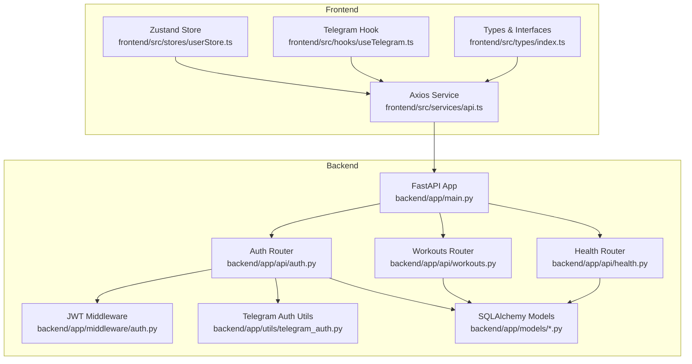
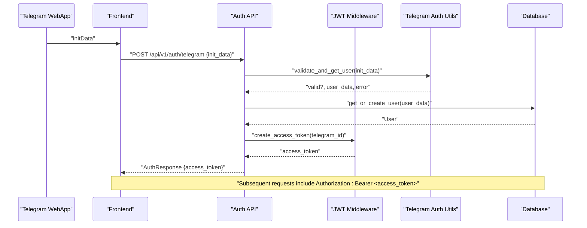
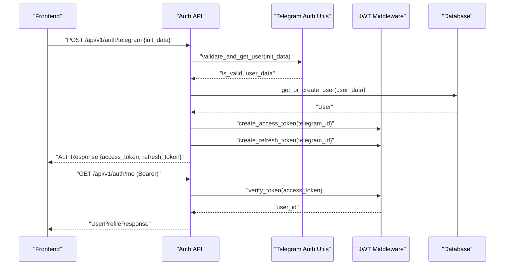
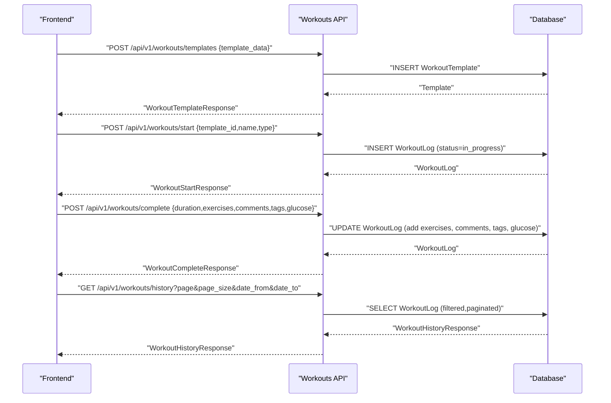
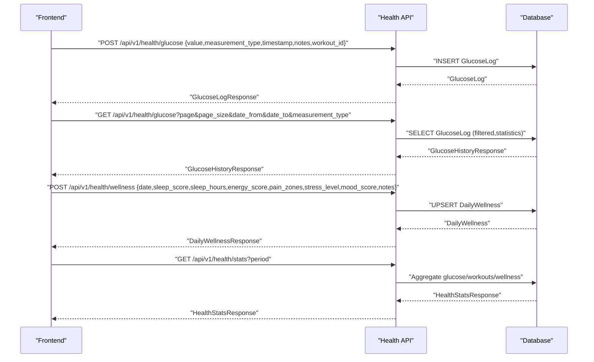
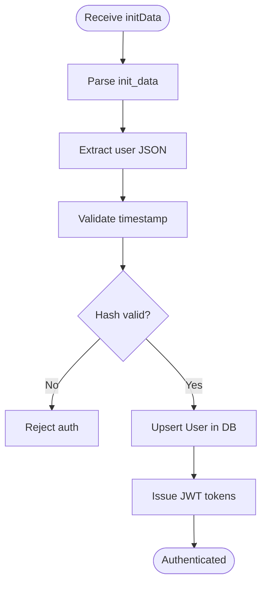
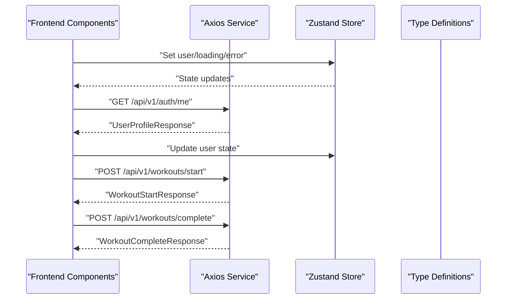
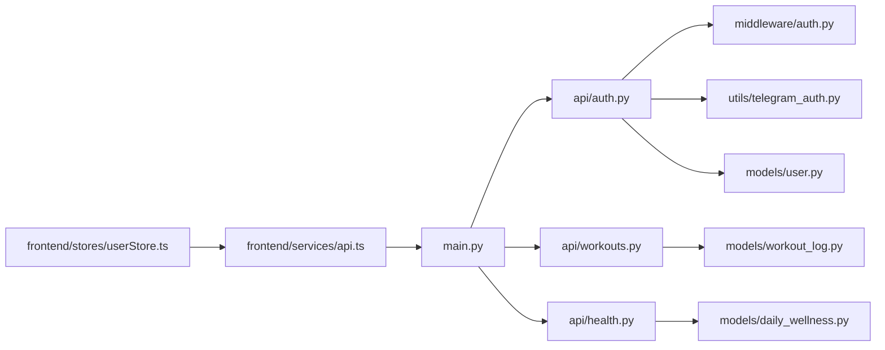
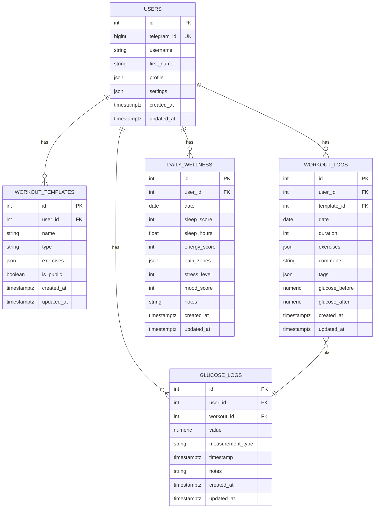

# Data Flow Design

<cite>
**Referenced Files in This Document**
- [backend/app/main.py](file://backend/app/main.py)
- [backend/app/middleware/auth.py](file://backend/app/middleware/auth.py)
- [backend/app/utils/telegram_auth.py](file://backend/app/utils/telegram_auth.py)
- [backend/app/api/auth.py](file://backend/app/api/auth.py)
- [backend/app/models/base.py](file://backend/app/models/base.py)
- [backend/app/models/user.py](file://backend/app/models/user.py)
- [backend/app/models/workout_log.py](file://backend/app/models/workout_log.py)
- [backend/app/models/daily_wellness.py](file://backend/app/models/daily_wellness.py)
- [backend/app/api/workouts.py](file://backend/app/api/workouts.py)
- [backend/app/api/health.py](file://backend/app/api/health.py)
- [backend/app/schemas/auth.py](file://backend/app/schemas/auth.py)
- [frontend/src/services/api.ts](file://frontend/src/services/api.ts)
- [frontend/src/stores/userStore.ts](file://frontend/src/stores/userStore.ts)
- [frontend/src/hooks/useTelegram.ts](file://frontend/src/hooks/useTelegram.ts)
- [frontend/src/types/index.ts](file://frontend/src/types/index.ts)
</cite>

## Table of Contents
1. [Introduction](#introduction)
2. [Project Structure](#project-structure)
3. [Core Components](#core-components)
4. [Architecture Overview](#architecture-overview)
5. [Detailed Component Analysis](#detailed-component-analysis)
6. [Dependency Analysis](#dependency-analysis)
7. [Performance Considerations](#performance-considerations)
8. [Troubleshooting Guide](#troubleshooting-guide)
9. [Conclusion](#conclusion)
10. [Appendices](#appendices)

## Introduction
This document describes the complete data flow of FitTracker Pro from user input through processing, persistence, and retrieval. It explains authentication data flow, workout session processing, health metric tracking, analytics aggregation, and how data moves between frontend state management and backend services. It also covers validation flows, transformation patterns, caching strategies, consistency mechanisms, real-time updates, offline handling, and synchronization patterns.

## Project Structure
FitTracker Pro follows a layered architecture:
- Frontend (React + TypeScript): Handles UI, local state, and API communication.
- Backend (FastAPI + SQLAlchemy): Provides REST APIs, authentication, validation, persistence, and analytics.
- Shared data models and schemas define the canonical shapes for requests/responses and database entities.

**Diagram sources**
- [backend/app/main.py:56-107](file://backend/app/main.py#L56-L107)
- [backend/app/api/auth.py:95-176](file://backend/app/api/auth.py#L95-L176)
- [backend/app/api/workouts.py:337-493](file://backend/app/api/workouts.py#L337-L493)
- [backend/app/api/health.py:29-200](file://backend/app/api/health.py#L29-L200)
- [backend/app/middleware/auth.py:111-172](file://backend/app/middleware/auth.py#L111-L172)
- [backend/app/utils/telegram_auth.py:172-204](file://backend/app/utils/telegram_auth.py#L172-L204)
- [backend/app/models/user.py:23-132](file://backend/app/models/user.py#L23-L132)
- [backend/app/models/workout_log.py:19-112](file://backend/app/models/workout_log.py#L19-L112)
- [backend/app/models/daily_wellness.py:17-118](file://backend/app/models/daily_wellness.py#L17-L118)
- [frontend/src/services/api.ts:1-69](file://frontend/src/services/api.ts#L1-L69)
- [frontend/src/stores/userStore.ts:1-31](file://frontend/src/stores/userStore.ts#L1-L31)
- [frontend/src/hooks/useTelegram.ts:1-108](file://frontend/src/hooks/useTelegram.ts#L1-L108)
- [frontend/src/types/index.ts:1-84](file://frontend/src/types/index.ts#L1-L84)

**Section sources**
- [backend/app/main.py:56-107](file://backend/app/main.py#L56-L107)
- [frontend/src/services/api.ts:1-69](file://frontend/src/services/api.ts#L1-L69)

## Core Components
- Authentication pipeline: Telegram initData validation, user creation/upsert, JWT issuance, and bearer token verification.
- Workout lifecycle: Template management, session start/complete, history retrieval, and glucose linkage.
- Health tracking: Glucose logs, daily wellness entries, and aggregated health statistics.
- Frontend state: Axios service for API calls, Zustand store for user/session state, and Telegram WebApp integration.

Key transformations:
- Telegram initData → validated user payload → normalized user entity → JWT tokens.
- Workout start → persisted in-progress log → completion updates → persisted completion.
- Health metrics → normalized models → computed aggregates.

**Section sources**
- [backend/app/api/auth.py:95-176](file://backend/app/api/auth.py#L95-L176)
- [backend/app/middleware/auth.py:21-77](file://backend/app/middleware/auth.py#L21-L77)
- [backend/app/utils/telegram_auth.py:172-204](file://backend/app/utils/telegram_auth.py#L172-L204)
- [backend/app/api/workouts.py:337-493](file://backend/app/api/workouts.py#L337-L493)
- [backend/app/api/health.py:29-200](file://backend/app/api/health.py#L29-L200)
- [frontend/src/services/api.ts:1-69](file://frontend/src/services/api.ts#L1-L69)
- [frontend/src/stores/userStore.ts:1-31](file://frontend/src/stores/userStore.ts#L1-L31)

## Architecture Overview
The system enforces strict separation of concerns:
- Frontend sends typed requests via Axios to backend routes.
- Backend validates requests, authenticates via JWT, transforms data, persists via SQLAlchemy, and returns standardized responses.
- Models encapsulate persistence and relationships; schemas define serialization boundaries.

**Diagram sources**
- [backend/app/api/auth.py:95-176](file://backend/app/api/auth.py#L95-L176)
- [backend/app/utils/telegram_auth.py:172-204](file://backend/app/utils/telegram_auth.py#L172-L204)
- [backend/app/middleware/auth.py:21-77](file://backend/app/middleware/auth.py#L21-L77)
- [backend/app/models/user.py:23-132](file://backend/app/models/user.py#L23-L132)
- [frontend/src/services/api.ts:21-33](file://frontend/src/services/api.ts#L21-L33)

## Detailed Component Analysis

### Authentication Data Flow
End-to-end authentication from Telegram initData to JWT issuance and verification:
- Frontend collects Telegram initData and posts to the auth endpoint.
- Backend validates initData signature and timestamp, extracts user data, and upserts the user record.
- Backend issues JWT access and refresh tokens; refresh uses refresh token verification.
- Subsequent requests are authenticated via JWT bearer tokens.

**Diagram sources**
- [backend/app/api/auth.py:95-176](file://backend/app/api/auth.py#L95-L176)
- [backend/app/utils/telegram_auth.py:172-204](file://backend/app/utils/telegram_auth.py#L172-L204)
- [backend/app/middleware/auth.py:21-77](file://backend/app/middleware/auth.py#L21-L77)
- [backend/app/middleware/auth.py:133-171](file://backend/app/middleware/auth.py#L133-L171)
- [backend/app/models/user.py:23-132](file://backend/app/models/user.py#L23-L132)

**Section sources**
- [backend/app/api/auth.py:95-176](file://backend/app/api/auth.py#L95-L176)
- [backend/app/utils/telegram_auth.py:172-204](file://backend/app/utils/telegram_auth.py#L172-L204)
- [backend/app/middleware/auth.py:21-77](file://backend/app/middleware/auth.py#L21-L77)
- [backend/app/middleware/auth.py:133-171](file://backend/app/middleware/auth.py#L133-L171)
- [backend/app/models/user.py:23-132](file://backend/app/models/user.py#L23-L132)

### Workout Session Data Processing
Workout lifecycle from template selection to completion and history:
- Templates: CRUD endpoints for user-specific workout templates.
- History: Paginated retrieval with optional date filters.
- Start: Creates an in-progress workout log entry.
- Complete: Updates the workout log with duration, exercises, comments, tags, and glucose values.

**Diagram sources**
- [backend/app/api/workouts.py:108-162](file://backend/app/api/workouts.py#L108-L162)
- [backend/app/api/workouts.py:337-493](file://backend/app/api/workouts.py#L337-L493)
- [backend/app/api/workouts.py:260-334](file://backend/app/api/workouts.py#L260-L334)
- [backend/app/models/workout_log.py:19-112](file://backend/app/models/workout_log.py#L19-L112)

**Section sources**
- [backend/app/api/workouts.py:29-105](file://backend/app/api/workouts.py#L29-L105)
- [backend/app/api/workouts.py:108-162](file://backend/app/api/workouts.py#L108-L162)
- [backend/app/api/workouts.py:260-334](file://backend/app/api/workouts.py#L260-L334)
- [backend/app/api/workouts.py:337-493](file://backend/app/api/workouts.py#L337-L493)
- [backend/app/models/workout_log.py:19-112](file://backend/app/models/workout_log.py#L19-L112)

### Health Metric Tracking Workflows
Glucose tracking and daily wellness:
- Glucose logs: Create with optional workout linkage, paginated history with statistics, and filtering by type and date range.
- Daily wellness: Upsert per-day entries with sleep, energy, pain zones, stress, mood, and notes.
- Health stats: Aggregated summaries over 7d/30d windows for glucose, workouts, and wellness.

**Diagram sources**
- [backend/app/api/health.py:29-200](file://backend/app/api/health.py#L29-L200)
- [backend/app/api/health.py:259-378](file://backend/app/api/health.py#L259-L378)
- [backend/app/api/health.py:409-614](file://backend/app/api/health.py#L409-L614)
- [backend/app/models/daily_wellness.py:17-118](file://backend/app/models/daily_wellness.py#L17-L118)

**Section sources**
- [backend/app/api/health.py:29-200](file://backend/app/api/health.py#L29-L200)
- [backend/app/api/health.py:259-378](file://backend/app/api/health.py#L259-L378)
- [backend/app/api/health.py:409-614](file://backend/app/api/health.py#L409-L614)
- [backend/app/models/daily_wellness.py:17-118](file://backend/app/models/daily_wellness.py#L17-L118)

### Data Transformation Patterns
- Telegram initData parsing and signature validation ensure authenticity before user creation.
- Pydantic schemas enforce request/response shape and validation.
- JSON fields in models support flexible user profile/settings and exercise logs.
- Aggregation queries compute averages, counts, and favorites for analytics.

**Diagram sources**
- [backend/app/utils/telegram_auth.py:172-204](file://backend/app/utils/telegram_auth.py#L172-L204)
- [backend/app/api/auth.py:95-176](file://backend/app/api/auth.py#L95-L176)
- [backend/app/middleware/auth.py:21-77](file://backend/app/middleware/auth.py#L21-L77)

**Section sources**
- [backend/app/utils/telegram_auth.py:14-106](file://backend/app/utils/telegram_auth.py#L14-L106)
- [backend/app/schemas/auth.py:10-90](file://backend/app/schemas/auth.py#L10-L90)
- [backend/app/models/user.py:49-69](file://backend/app/models/user.py#L49-L69)
- [backend/app/models/workout_log.py:49-54](file://backend/app/models/workout_log.py#L49-L54)

### Frontend State Management and Data Movement
- Axios service centralizes HTTP requests, injects auth headers, and handles errors.
- Zustand store manages user state and persistence across sessions.
- Telegram hook provides mockable Telegram WebApp integration for standalone usage.

**Diagram sources**
- [frontend/src/services/api.ts:1-69](file://frontend/src/services/api.ts#L1-L69)
- [frontend/src/stores/userStore.ts:1-31](file://frontend/src/stores/userStore.ts#L1-L31)
- [frontend/src/types/index.ts:1-84](file://frontend/src/types/index.ts#L1-L84)

**Section sources**
- [frontend/src/services/api.ts:1-69](file://frontend/src/services/api.ts#L1-L69)
- [frontend/src/stores/userStore.ts:1-31](file://frontend/src/stores/userStore.ts#L1-L31)
- [frontend/src/hooks/useTelegram.ts:1-108](file://frontend/src/hooks/useTelegram.ts#L1-L108)
- [frontend/src/types/index.ts:1-84](file://frontend/src/types/index.ts#L1-L84)

## Dependency Analysis
- Backend entrypoint wires routers and middleware; authentication middleware depends on JWT utilities and database session.
- Auth router depends on Telegram auth utilities, JWT middleware, and user model.
- Workouts and health routers depend on models and schemas; they rely on authenticated user context.
- Frontend Axios service depends on environment configuration and local storage for tokens.

**Diagram sources**
- [backend/app/main.py:89-106](file://backend/app/main.py#L89-L106)
- [backend/app/api/auth.py:13-34](file://backend/app/api/auth.py#L13-L34)
- [backend/app/middleware/auth.py:1-251](file://backend/app/middleware/auth.py#L1-L251)
- [backend/app/utils/telegram_auth.py:1-225](file://backend/app/utils/telegram_auth.py#L1-L225)
- [backend/app/models/user.py:1-132](file://backend/app/models/user.py#L1-L132)
- [backend/app/models/workout_log.py:1-112](file://backend/app/models/workout_log.py#L1-L112)
- [backend/app/models/daily_wellness.py:1-118](file://backend/app/models/daily_wellness.py#L1-L118)
- [frontend/src/services/api.ts:1-69](file://frontend/src/services/api.ts#L1-L69)
- [frontend/src/stores/userStore.ts:1-31](file://frontend/src/stores/userStore.ts#L1-L31)

**Section sources**
- [backend/app/main.py:89-106](file://backend/app/main.py#L89-L106)
- [backend/app/api/auth.py:13-34](file://backend/app/api/auth.py#L13-L34)
- [backend/app/middleware/auth.py:1-251](file://backend/app/middleware/auth.py#L1-L251)
- [backend/app/utils/telegram_auth.py:1-225](file://backend/app/utils/telegram_auth.py#L1-L225)
- [backend/app/models/user.py:1-132](file://backend/app/models/user.py#L1-L132)
- [backend/app/models/workout_log.py:1-112](file://backend/app/models/workout_log.py#L1-L112)
- [backend/app/models/daily_wellness.py:1-118](file://backend/app/models/daily_wellness.py#L1-L118)
- [frontend/src/services/api.ts:1-69](file://frontend/src/services/api.ts#L1-L69)
- [frontend/src/stores/userStore.ts:1-31](file://frontend/src/stores/userStore.ts#L1-L31)

## Performance Considerations
- Pagination: Workout history and glucose history use offset/limit to constrain result sets.
- Indexing: Models define indexes on frequently filtered columns (e.g., user_id, date, telegram_id).
- Aggregation: Health stats compute averages and counts server-side to reduce frontend load.
- Caching: No explicit cache layer is present; consider Redis for token refresh and analytics caching.

[No sources needed since this section provides general guidance]

## Troubleshooting Guide
Common issues and remedies:
- Authentication failures: Verify initData signature and timestamp; ensure bot token matches backend configuration.
- Missing or invalid JWT: Confirm Authorization header format and token validity; handle token refresh flow.
- Validation errors: Review Pydantic schema constraints and query parameter patterns.
- Database errors: Check unique constraints (e.g., daily wellness uniqueness by date) and foreign keys.

**Section sources**
- [backend/app/utils/telegram_auth.py:108-156](file://backend/app/utils/telegram_auth.py#L108-L156)
- [backend/app/middleware/auth.py:133-171](file://backend/app/middleware/auth.py#L133-L171)
- [backend/app/api/health.py:295-336](file://backend/app/api/health.py#L295-L336)

## Conclusion
FitTracker Pro implements a robust, layered data flow:
- Authentication securely validates Telegram initData and issues JWT tokens.
- Workout and health endpoints transform user input into normalized models and expose paginated, filtered, and aggregated views.
- Frontend integrates Axios, Zustand, and Telegram hooks to manage state and API interactions.
- Persistence relies on SQLAlchemy models with appropriate indexing and relationships.
- Future enhancements can include Redis caching, token blacklisting, and offline sync strategies.

[No sources needed since this section summarizes without analyzing specific files]

## Appendices

### Data Models Overview

**Diagram sources**
- [backend/app/models/user.py:23-132](file://backend/app/models/user.py#L23-L132)
- [backend/app/models/workout_log.py:19-112](file://backend/app/models/workout_log.py#L19-L112)
- [backend/app/models/daily_wellness.py:17-118](file://backend/app/models/daily_wellness.py#L17-L118)