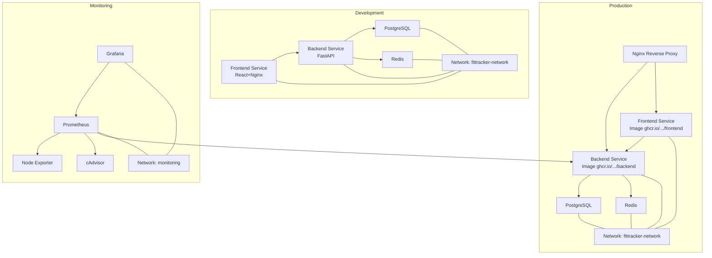
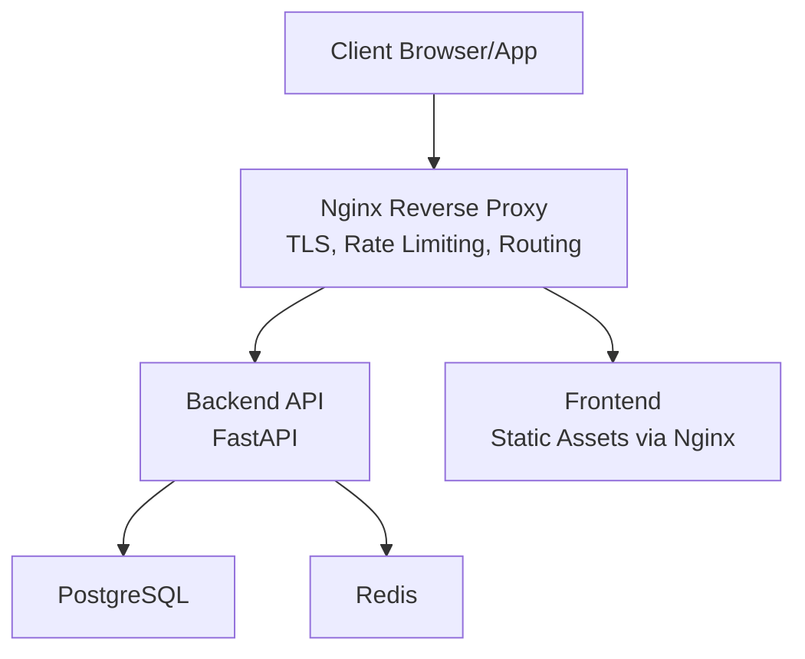
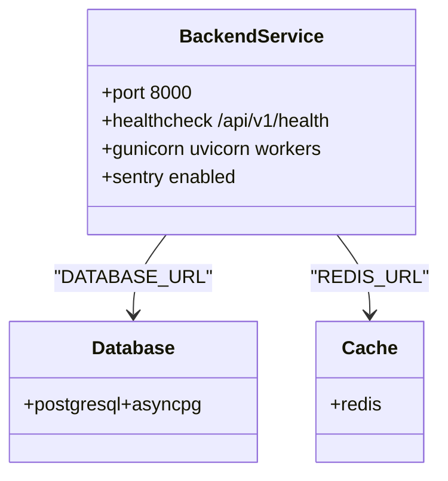
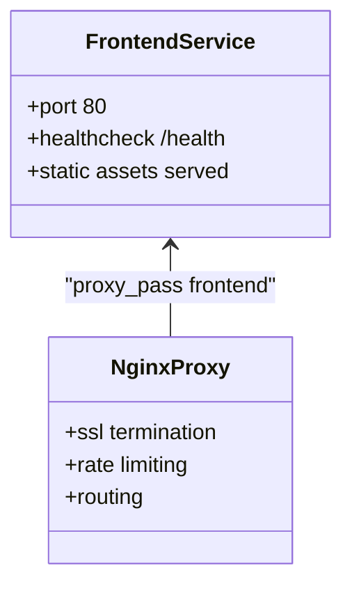
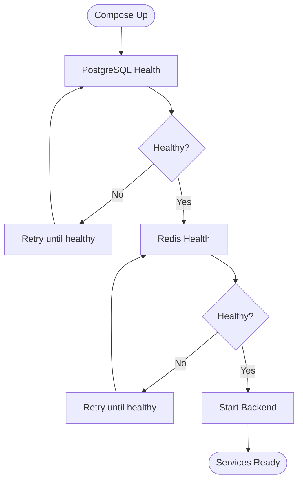
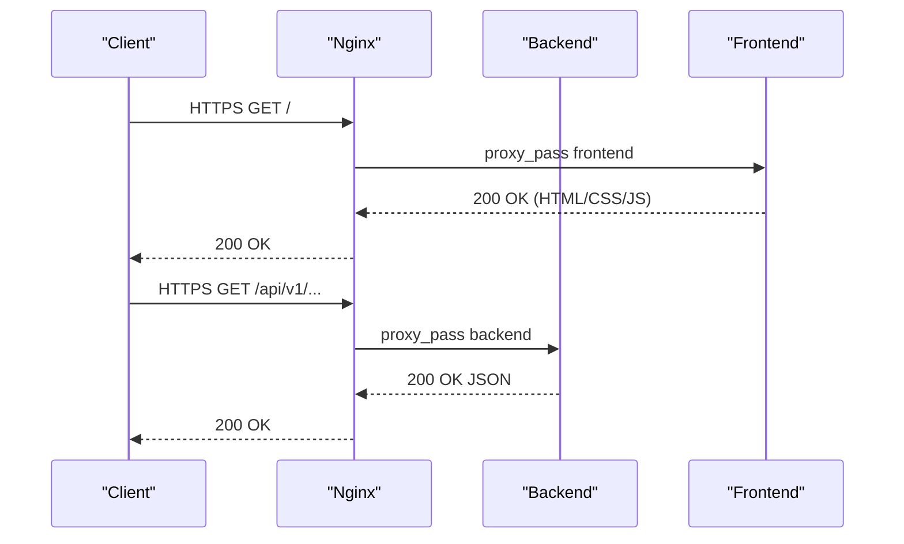
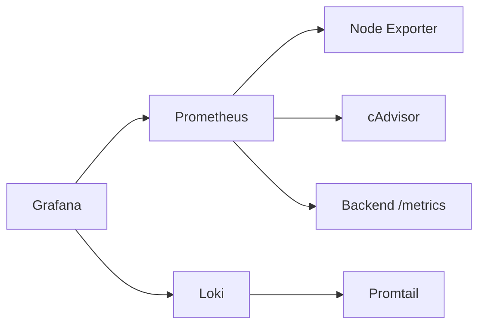
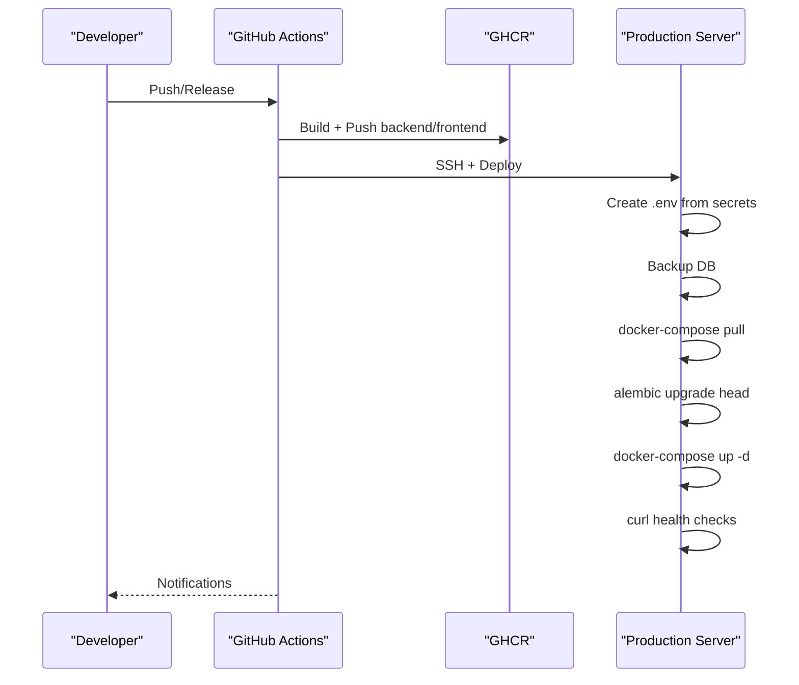
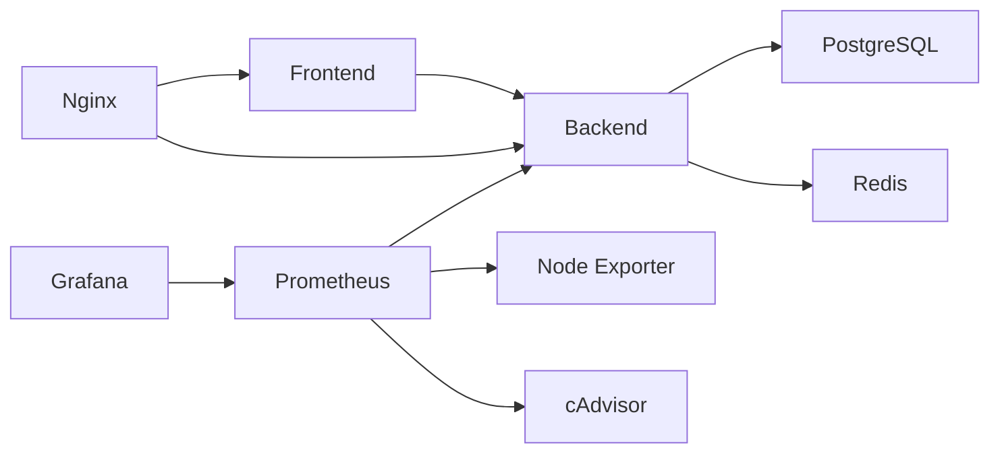

# Deployment Topology

<cite>
**Referenced Files in This Document**
- [docker-compose.yml](file://docker-compose.yml)
- [docker-compose.prod.yml](file://docker-compose.prod.yml)
- [docs/DEPLOYMENT.md](file://docs/DEPLOYMENT.md)
- [docs/DEPLOYMENT.md](file://docs/DEPLOYMENT.md)
- [docs/ENVIRONMENT_SETUP.md](file://docs/ENVIRONMENT_SETUP.md)
- [docs/PRODUCTION_CHECKLIST.md](file://docs/PRODUCTION_CHECKLIST.md)
- [nginx/nginx.conf](file://nginx/nginx.conf)
- [.github/workflows/build.yml](file://.github/workflows/build.yml)
- [.github/workflows/deploy.yml](file://.github/workflows/deploy.yml)
- [backend/Dockerfile](file://backend/Dockerfile)
- [frontend/Dockerfile](file://frontend/Dockerfile)
- [backend/app/main.py](file://backend/app/main.py)
- [monitoring/docker-compose.monitoring.yml](file://monitoring/docker-compose.monitoring.yml)
- [monitoring/prometheus.yml](file://monitoring/prometheus.yml)
- [monitoring/grafana/provisioning/datasources/datasources.yml](file://monitoring/grafana/provisioning/datasources/datasources.yml)
- [monitoring/grafana/provisioning/dashboards/dashboards.yml](file://monitoring/grafana/provisioning/dashboards/dashboards.yml)
- [database/migrations/versions/initial_schema.py](file://database/migrations/versions/initial_schema.py)
</cite>

## Table of Contents
1. [Introduction](#introduction)
2. [Project Structure](#project-structure)
3. [Core Components](#core-components)
4. [Architecture Overview](#architecture-overview)
5. [Detailed Component Analysis](#detailed-component-analysis)
6. [Dependency Analysis](#dependency-analysis)
7. [Performance Considerations](#performance-considerations)
8. [Troubleshooting Guide](#troubleshooting-guide)
9. [Conclusion](#conclusion)
10. [Appendices](#appendices)

## Introduction
This document describes the containerized deployment topology for FitTracker Pro, covering development and production environments. It explains the multi-container setup with backend API, frontend application, database, cache, reverse proxy, and monitoring services. It also documents production deployment topologies, load balancing and reverse proxy configuration, scaling considerations, environment-specific configurations, secrets management, backup and disaster recovery procedures, and CI/CD pipeline integration.

## Project Structure
FitTracker Pro uses Docker Compose for orchestration across development and production. The repository includes:
- Development compose file defining services for backend, frontend, PostgreSQL, and Redis.
- Production compose file with image-based services, reverse proxy, and resource limits.
- Nginx configuration for SSL termination, rate limiting, and routing to backend and frontend.
- Monitoring stack with Prometheus, Grafana, Node Exporter, and cAdvisor.
- CI/CD workflows for building/pushing images and deploying to production.

**Diagram sources**
- [docker-compose.yml:1-99](file://docker-compose.yml#L1-L99)
- [docker-compose.prod.yml:1-132](file://docker-compose.prod.yml#L1-L132)
- [nginx/nginx.conf:1-144](file://nginx/nginx.conf#L1-L144)
- [monitoring/docker-compose.monitoring.yml:1-124](file://monitoring/docker-compose.monitoring.yml#L1-L124)

**Section sources**
- [docker-compose.yml:1-99](file://docker-compose.yml#L1-L99)
- [docker-compose.prod.yml:1-132](file://docker-compose.prod.yml#L1-L132)
- [docs/DEPLOYMENT.md:26-47](file://docs/DEPLOYMENT.md#L26-L47)

## Core Components
- Backend API (FastAPI): Exposes REST endpoints, integrates Sentry for error tracking, and serves metrics for Prometheus.
- Frontend (React + Vite): Built into static assets and served via Nginx inside the frontend container.
- Database (PostgreSQL): Stores user, workout, health, and gamification data with Alembic migrations.
- Cache (Redis): Provides session caching and pub/sub for real-time features.
- Reverse Proxy (Nginx): Handles SSL termination, HTTP/HTTPS redirects, rate limiting, and routing to backend/frontend.
- Monitoring Stack: Prometheus for metrics, Grafana for visualization, Node Exporter and cAdvisor for system/container metrics.

**Section sources**
- [backend/Dockerfile:1-48](file://backend/Dockerfile#L1-L48)
- [frontend/Dockerfile:1-56](file://frontend/Dockerfile#L1-L56)
- [backend/app/main.py:1-126](file://backend/app/main.py#L1-L126)
- [monitoring/docker-compose.monitoring.yml:1-124](file://monitoring/docker-compose.monitoring.yml#L1-L124)

## Architecture Overview
The system consists of two primary topologies:
- Development: Local containers for backend, frontend, PostgreSQL, and Redis on a single bridge network.
- Production: Image-based services behind Nginx with explicit resource limits, SSL termination, and hardened defaults.

**Diagram sources**
- [docker-compose.prod.yml:102-124](file://docker-compose.prod.yml#L102-L124)
- [nginx/nginx.conf:56-144](file://nginx/nginx.conf#L56-L144)
- [backend/app/main.py:90-106](file://backend/app/main.py#L90-L106)

## Detailed Component Analysis

### Backend API Service
- Built with a non-root user and health checks.
- Uses Gunicorn with Uvicorn workers and exposes port 8000.
- Integrates Sentry for error tracking and supports metrics scraping.
- Depends on PostgreSQL and Redis being healthy before starting.

**Diagram sources**
- [backend/Dockerfile:43-47](file://backend/Dockerfile#L43-L47)
- [backend/app/main.py:32-43](file://backend/app/main.py#L32-L43)
- [docker-compose.yml:50-72](file://docker-compose.yml#L50-L72)

**Section sources**
- [backend/Dockerfile:1-48](file://backend/Dockerfile#L1-L48)
- [backend/app/main.py:1-126](file://backend/app/main.py#L1-L126)
- [docker-compose.yml:43-72](file://docker-compose.yml#L43-L72)

### Frontend Service
- Multi-stage build: Node builder stage produces dist assets, then Nginx serves them.
- Includes a health check endpoint for readiness.
- Exposed on port 80 and proxied by Nginx in production.

**Diagram sources**
- [frontend/Dockerfile:20-56](file://frontend/Dockerfile#L20-L56)
- [nginx/nginx.conf:103-120](file://nginx/nginx.conf#L103-L120)

**Section sources**
- [frontend/Dockerfile:1-56](file://frontend/Dockerfile#L1-L56)
- [nginx/nginx.conf:1-144](file://nginx/nginx.conf#L1-L144)

### Database and Cache Services
- PostgreSQL: Persistent volume for data, health checks, and local/production exposure differences.
- Redis: Append-only persistence, optional memory limits, and health checks.

**Diagram sources**
- [docker-compose.yml:17-21](file://docker-compose.yml#L17-L21)
- [docker-compose.yml:35-39](file://docker-compose.yml#L35-L39)
- [docker-compose.yml:66-70](file://docker-compose.yml#L66-L70)

**Section sources**
- [docker-compose.yml:4-23](file://docker-compose.yml#L4-L23)
- [docker-compose.yml:25-41](file://docker-compose.yml#L25-L41)

### Reverse Proxy (Nginx)
- HTTP to HTTPS redirect, SSL certificate mounting, and security headers.
- Rate limiting zones for API and login endpoints.
- Upstreams for backend and frontend; proxies API requests to backend and static assets to frontend.
- Health check endpoint exposed at /health.

**Diagram sources**
- [nginx/nginx.conf:56-144](file://nginx/nginx.conf#L56-L144)
- [docker-compose.prod.yml:102-118](file://docker-compose.prod.yml#L102-L118)

**Section sources**
- [nginx/nginx.conf:1-144](file://nginx/nginx.conf#L1-L144)
- [docs/DEPLOYMENT.md:159-258](file://docs/DEPLOYMENT.md#L159-L258)

### Monitoring Stack
- Prometheus scrapes backend, Node Exporter, and cAdvisor.
- Grafana visualizes metrics and consumes Loki logs (optional).
- Monitoring services on a separate network but can reach app network.

**Diagram sources**
- [monitoring/docker-compose.monitoring.yml:1-124](file://monitoring/docker-compose.monitoring.yml#L1-L124)
- [monitoring/prometheus.yml:15-49](file://monitoring/prometheus.yml#L15-L49)
- [monitoring/grafana/provisioning/datasources/datasources.yml:1-16](file://monitoring/grafana/provisioning/datasources/datasources.yml#L1-L16)
- [monitoring/grafana/provisioning/dashboards/dashboards.yml:1-13](file://monitoring/grafana/provisioning/dashboards/dashboards.yml#L1-L13)

**Section sources**
- [monitoring/docker-compose.monitoring.yml:1-124](file://monitoring/docker-compose.monitoring.yml#L1-L124)
- [monitoring/prometheus.yml:1-49](file://monitoring/prometheus.yml#L1-L49)

### CI/CD Pipeline Integration
- Build workflow: Builds backend and frontend images, pushes to GHCR, runs Trivy scans.
- Deploy workflow: SSH to server, creates .env from GitHub secrets, backs up DB, pulls images, runs migrations, starts services, health checks, and notifies Slack.

**Diagram sources**
- [.github/workflows/build.yml:1-132](file://.github/workflows/build.yml#L1-L132)
- [.github/workflows/deploy.yml:1-156](file://.github/workflows/deploy.yml#L1-L156)

**Section sources**
- [.github/workflows/build.yml:1-132](file://.github/workflows/build.yml#L1-L132)
- [.github/workflows/deploy.yml:1-156](file://.github/workflows/deploy.yml#L1-L156)

## Dependency Analysis
- Backend depends on PostgreSQL and Redis being healthy before starting.
- Frontend depends on backend availability in development; in production, Nginx proxies to both.
- Monitoring stack depends on backend exposing metrics and system metrics exporters.
- CI/CD depends on GitHub secrets for environment variables and SSH keys.

**Diagram sources**
- [docker-compose.yml:66-70](file://docker-compose.yml#L66-L70)
- [docker-compose.prod.yml:102-118](file://docker-compose.prod.yml#L102-L118)
- [monitoring/docker-compose.monitoring.yml:15-49](file://monitoring/docker-compose.monitoring.yml#L15-L49)

**Section sources**
- [docker-compose.yml:43-90](file://docker-compose.yml#L43-L90)
- [docker-compose.prod.yml:54-118](file://docker-compose.prod.yml#L54-L118)

## Performance Considerations
- Resource limits: CPU/memory caps are defined in production compose for predictable scheduling.
- Keep-Alive and buffering: Nginx upstreams enable keepalive and buffer tuning for performance.
- Compression and caching: Nginx gzip and long-lived static asset caching reduce bandwidth and latency.
- Database and cache sizing: Production Redis sets memory limits and policy; PostgreSQL binds to localhost with backups mounted.

[No sources needed since this section provides general guidance]

## Troubleshooting Guide
Common operational issues and remedies:
- Database connection failures: Verify service health, check logs, and restart the database container.
- Frontend not loading: Inspect Nginx logs, rebuild frontend, and confirm proxy upstreams.
- API errors: Review backend logs, test health endpoints, and validate environment variables.
- SSL certificate problems: Renew certificates, copy to mounted path, and restart Nginx.
- Telegram WebApp not loading: Confirm HTTPS, allowed domains, CORS, and WEBAPP_URL alignment.

**Section sources**
- [docs/DEPLOYMENT.md:182-214](file://docs/DEPLOYMENT.md#L182-L214)
- [docs/DEPLOYMENT.md:350-397](file://docs/DEPLOYMENT.md#L350-L397)

## Conclusion
FitTracker Pro’s deployment topology leverages Docker Compose for development and a hardened production setup with Nginx, image-based services, and CI/CD automation. The architecture emphasizes separation of concerns, observability, and operational reliability through health checks, rate limiting, and automated deployments with rollback capabilities.

[No sources needed since this section summarizes without analyzing specific files]

## Appendices

### Environment Variables and Secrets Management
- Backend variables include database URLs, cache URL, secret key, Telegram tokens, allowed origins, and Sentry DSN.
- Frontend variables include API URL and Telegram bot username.
- Production requires GitHub secrets for deployment and runtime configuration.

**Section sources**
- [docker-compose.yml:50-60](file://docker-compose.yml#L50-L60)
- [docker-compose.prod.yml:59-69](file://docker-compose.prod.yml#L59-L69)
- [docs/ENVIRONMENT_SETUP.md:24-111](file://docs/ENVIRONMENT_SETUP.md#L24-L111)
- [docs/PRODUCTION_CHECKLIST.md:163-182](file://docs/PRODUCTION_CHECKLIST.md#L163-L182)

### Database Schema and Migrations
- Initial schema includes users, exercises, workout templates/logs, glucose logs, daily wellness, achievements, user achievements, challenges, and emergency contacts.
- Alembic migrations manage schema evolution.

**Section sources**
- [database/migrations/versions/initial_schema.py:18-460](file://database/migrations/versions/initial_schema.py#L18-L460)

### Backup and Disaster Recovery
- Manual backup and restore commands are provided.
- Automated daily backup via cron is documented.
- Deployment workflow backs up the database before migration and supports rollback with restore.

**Section sources**
- [docs/DEPLOYMENT.md:93-98](file://docs/DEPLOYMENT.md#L93-L98)
- [docs/DEPLOYMENT.md:337-348](file://docs/DEPLOYMENT.md#L337-L348)
- [.github/workflows/deploy.yml:70-80](file://.github/workflows/deploy.yml#L70-L80)
- [.github/workflows/deploy.yml:144-149](file://.github/workflows/deploy.yml#L144-L149)

### Scaling Considerations
- Horizontal scaling: Increase replica counts for backend and frontend services in Swarm/Kubernetes (not shown in current compose).
- Vertical scaling: Adjust CPU/memory limits per service in production compose.
- Load balancing: Nginx upstreams define backend/frontend pools; add additional backend instances behind the same upstream.

**Section sources**
- [docker-compose.prod.yml:25-82](file://docker-compose.prod.yml#L25-L82)
- [nginx/nginx.conf:38-47](file://nginx/nginx.conf#L38-L47)