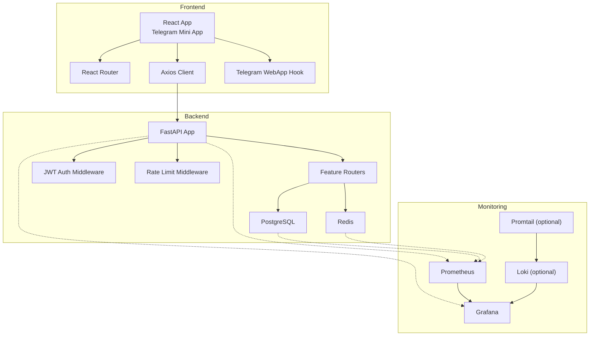
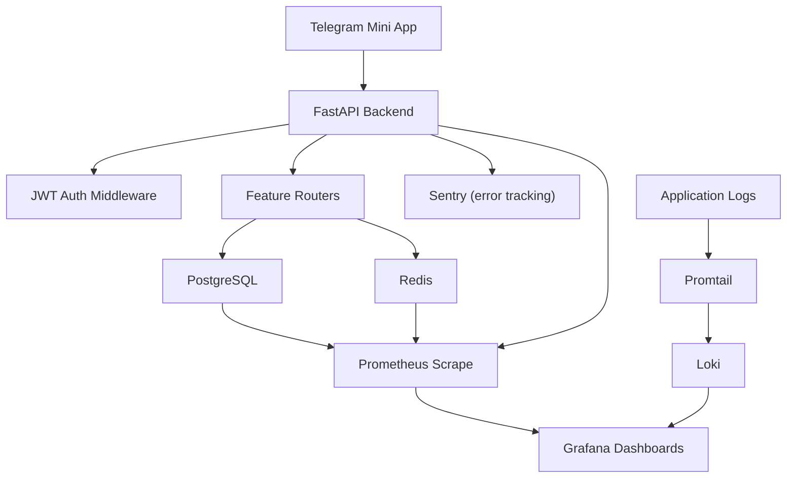
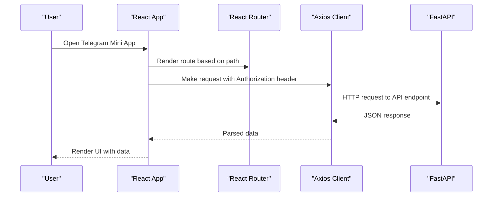
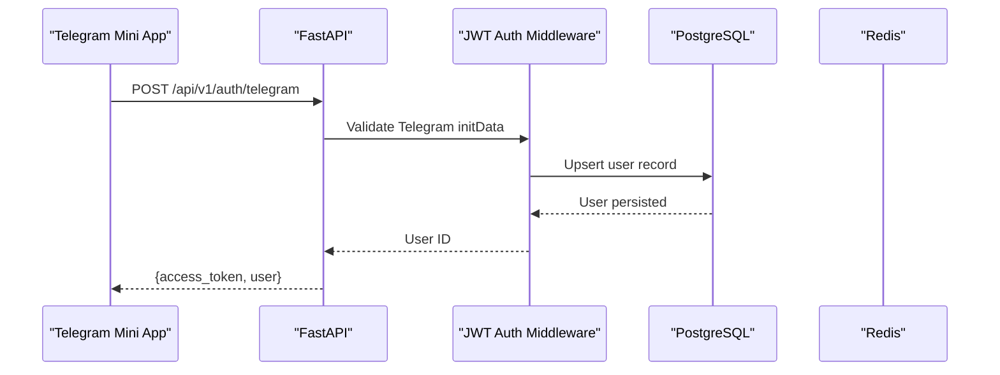
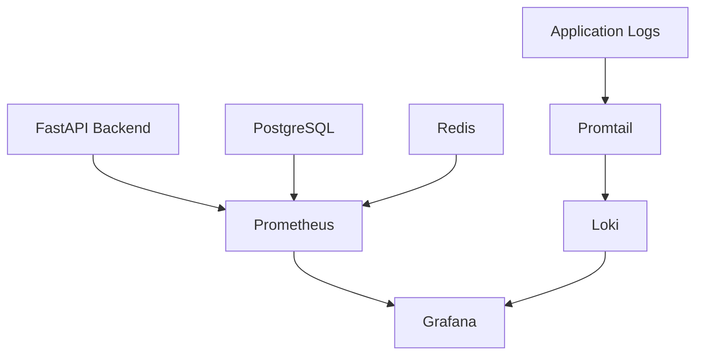
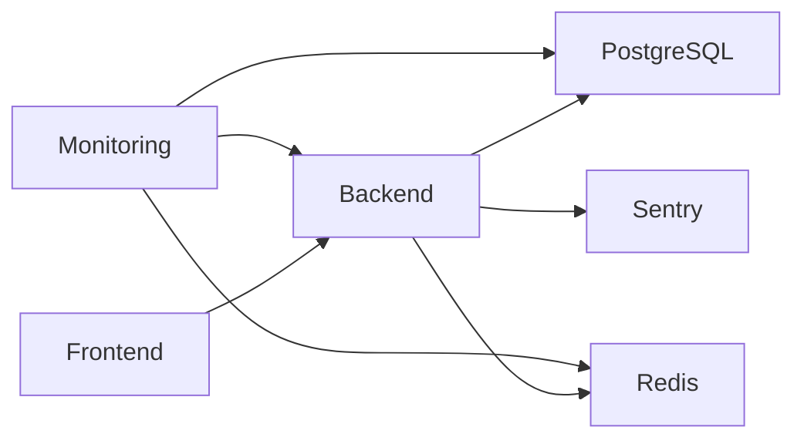

# System Overview

<cite>
**Referenced Files in This Document**
- [README.md](file://README.md)
- [docker-compose.yml](file://docker-compose.yml)
- [backend/app/main.py](file://backend/app/main.py)
- [backend/app/utils/config.py](file://backend/app/utils/config.py)
- [backend/requirements.txt](file://backend/requirements.txt)
- [backend/app/middleware/auth.py](file://backend/app/middleware/auth.py)
- [backend/app/api/auth.py](file://backend/app/api/auth.py)
- [backend/app/models/user.py](file://backend/app/models/user.py)
- [database/migrations/versions/cd723942379e_initial_schema.py](file://database/migrations/versions/cd723942379e_initial_schema.py)
- [frontend/src/App.tsx](file://frontend/src/App.tsx)
- [frontend/src/main.tsx](file://frontend/src/main.tsx)
- [frontend/src/services/api.ts](file://frontend/src/services/api.ts)
- [frontend/src/hooks/useTelegramWebApp.ts](file://frontend/src/hooks/useTelegramWebApp.ts)
- [monitoring/docker-compose.monitoring.yml](file://monitoring/docker-compose.monitoring.yml)
</cite>

## Table of Contents
1. [Introduction](#introduction)
2. [Project Structure](#project-structure)
3. [Core Components](#core-components)
4. [Architecture Overview](#architecture-overview)
5. [Detailed Component Analysis](#detailed-component-analysis)
6. [Dependency Analysis](#dependency-analysis)
7. [Performance Considerations](#performance-considerations)
8. [Troubleshooting Guide](#troubleshooting-guide)
9. [Conclusion](#conclusion)

## Introduction
FitTracker Pro is a Telegram Mini App designed for fitness and health tracking. It integrates a React-based Telegram Mini App front-end, a FastAPI back-end, a PostgreSQL database, and a monitoring stack. The system emphasizes modularity, platform consistency through Telegram WebApp, and robust operational observability.

Key design principles:
- Telegram-centric UX: Authentication and UI are optimized for Telegram Mini App.
- Modular API: Feature-focused routers grouped under a unified FastAPI application.
- JSON-based domain modeling: Flexible user profiles and settings stored as JSONB for extensibility.
- Observability-first: Integrated Prometheus, Grafana, and optional Loki/Promtail for metrics and logs.

## Project Structure
The repository is organized into distinct layers:
- frontend: React + TypeScript + Vite with Telegram Mini Apps SDK integration
- backend: FastAPI application with routers, middleware, models, and services
- database: PostgreSQL schema managed via Alembic migrations
- monitoring: Dockerized Prometheus, Grafana, and optional log aggregation stack
- nginx: Reverse proxy configuration (shared across environments)
- docs: Deployment and operational documentation



**Diagram sources**
- [frontend/src/App.tsx:12-32](file://frontend/src/App.tsx#L12-L32)
- [frontend/src/main.tsx:7-22](file://frontend/src/main.tsx#L7-L22)
- [frontend/src/services/api.ts:4-16](file://frontend/src/services/api.ts#L4-L16)
- [frontend/src/hooks/useTelegramWebApp.ts:120-506](file://frontend/src/hooks/useTelegramWebApp.ts#L120-L506)
- [backend/app/main.py:56-106](file://backend/app/main.py#L56-L106)
- [backend/app/middleware/auth.py:111-131](file://backend/app/middleware/auth.py#L111-L131)
- [monitoring/docker-compose.monitoring.yml:5-46](file://monitoring/docker-compose.monitoring.yml#L5-L46)

**Section sources**
- [README.md:5-16](file://README.md#L5-L16)
- [docker-compose.yml:3-99](file://docker-compose.yml#L3-L99)

## Core Components
- Frontend (Telegram Mini App)
  - React application bootstrapped with Vite and TypeScript.
  - Uses Telegram WebApp SDK for native integration and theming.
  - Axios-based API client with automatic bearer token injection.
  - React Router for navigation; TanStack Query for caching and background refetching.
- Backend (FastAPI)
  - Centralized application with CORS, rate limiting, and Sentry integration.
  - Feature routers for health, auth, users, workouts, exercises, analytics, achievements, challenges, and emergency.
  - JWT-based authentication middleware and user dependency providers.
  - Configuration via Pydantic settings loaded from .env.
- Database (PostgreSQL)
  - Alembic-managed schema with JSONB fields for flexible user profiles and settings.
  - Triggers maintain updated_at timestamps.
- Monitoring Stack
  - Prometheus for metrics scraping, Grafana for visualization.
  - Optional Loki/Promtail for centralized log aggregation.

**Section sources**
- [frontend/src/App.tsx:12-32](file://frontend/src/App.tsx#L12-L32)
- [frontend/src/main.tsx:7-22](file://frontend/src/main.tsx#L7-L22)
- [frontend/src/services/api.ts:4-16](file://frontend/src/services/api.ts#L4-L16)
- [backend/app/main.py:56-106](file://backend/app/main.py#L56-L106)
- [backend/app/middleware/auth.py:111-131](file://backend/app/middleware/auth.py#L111-L131)
- [backend/app/utils/config.py:15-55](file://backend/app/utils/config.py#L15-L55)
- [database/migrations/versions/cd723942379e_initial_schema.py:26-460](file://database/migrations/versions/cd723942379e_initial_schema.py#L26-L460)
- [monitoring/docker-compose.monitoring.yml:5-46](file://monitoring/docker-compose.monitoring.yml#L5-L46)

## Architecture Overview
FitTracker Pro follows a layered architecture:
- Presentation Layer: Telegram Mini App handles UI, routing, and Telegram-specific integrations.
- API Layer: FastAPI routes encapsulate business features and enforce authentication and rate limits.
- Persistence Layer: PostgreSQL stores structured and semi-structured data; Redis supports caching and rate limiting.
- Observability: Prometheus scrapes metrics; Grafana visualizes dashboards; Loki/Promtail optionally aggregates logs.



**Diagram sources**
- [backend/app/main.py:56-106](file://backend/app/main.py#L56-L106)
- [backend/app/middleware/auth.py:111-131](file://backend/app/middleware/auth.py#L111-L131)
- [backend/app/api/auth.py:95-184](file://backend/app/api/auth.py#L95-L184)
- [backend/app/models/user.py:23-132](file://backend/app/models/user.py#L23-L132)
- [monitoring/docker-compose.monitoring.yml:5-46](file://monitoring/docker-compose.monitoring.yml#L5-L46)

## Detailed Component Analysis

### Telegram Mini App Frontend
- Bootstrapping: Initializes TanStack Query with a 5-minute stale time and retry policy.
- Routing: Declares routes for home, workouts, health, analytics, and profile.
- API Client: Creates an Axios instance with base URL from environment and injects Authorization header when present.
- Telegram Integration: useTelegramWebApp hook wraps Telegram WebApp APIs, theme detection, haptic feedback, and cloud storage.



**Diagram sources**
- [frontend/src/App.tsx:12-32](file://frontend/src/App.tsx#L12-L32)
- [frontend/src/main.tsx:7-22](file://frontend/src/main.tsx#L7-L22)
- [frontend/src/services/api.ts:4-16](file://frontend/src/services/api.ts#L4-L16)
- [backend/app/main.py:56-106](file://backend/app/main.py#L56-L106)

**Section sources**
- [frontend/src/App.tsx:12-32](file://frontend/src/App.tsx#L12-L32)
- [frontend/src/main.tsx:7-22](file://frontend/src/main.tsx#L7-L22)
- [frontend/src/services/api.ts:4-16](file://frontend/src/services/api.ts#L4-L16)
- [frontend/src/hooks/useTelegramWebApp.ts:120-506](file://frontend/src/hooks/useTelegramWebApp.ts#L120-L506)

### FastAPI Backend
- Application Lifecycle: Uses lifespan for startup/shutdown logging.
- Middleware: CORS configured from settings; rate limit middleware applied globally.
- Routers: Health, Auth, Users, Workouts, Exercises, Health Metrics, Analytics, Achievements, Challenges, Emergency.
- Authentication: JWT Bearer security with token creation, verification, and user dependency providers.
- Configuration: Settings loaded from .env using Pydantic BaseSettings.



**Diagram sources**
- [backend/app/main.py:56-106](file://backend/app/main.py#L56-L106)
- [backend/app/middleware/auth.py:111-131](file://backend/app/middleware/auth.py#L111-L131)
- [backend/app/api/auth.py:95-184](file://backend/app/api/auth.py#L95-L184)
- [backend/app/models/user.py:23-132](file://backend/app/models/user.py#L23-L132)

**Section sources**
- [backend/app/main.py:56-106](file://backend/app/main.py#L56-L106)
- [backend/app/middleware/auth.py:111-131](file://backend/app/middleware/auth.py#L111-L131)
- [backend/app/api/auth.py:95-184](file://backend/app/api/auth.py#L95-L184)
- [backend/app/utils/config.py:15-55](file://backend/app/utils/config.py#L15-L55)

### Database Schema and Models
- Users: Telegram user identity, profile (JSONB), settings (JSONB), timestamps, and relationships.
- Exercises, Workout Templates, Workout Logs, Glucose Logs, Daily Wellness, Achievements, User Achievements, Challenges, Emergency Contacts: Structured entities with JSONB fields for flexibility and GIN indexes for performance.
- Triggers: Automatic updated_at updates on row modifications.

```mermaid
erDiagram
USERS {
integer id PK
bigint telegram_id UK
string username
string first_name
jsonb profile
jsonb settings
timestamptz created_at
timestamptz updated_at
}
EXERCISES {
integer id PK
string name
text description
string category
jsonb equipment
jsonb muscle_groups
jsonb risk_flags
string media_url
string status
integer author_user_id FK
timestamptz created_at
timestamptz updated_at
}
WORKOUT_TEMPLATES {
integer id PK
integer user_id FK
string name
string type
jsonb exercises
boolean is_public
timestamptz created_at
timestamptz updated_at
}
WORKOUT_LOGS {
integer id PK
integer user_id FK
integer template_id FK
date date
integer duration
jsonb exercises
text comments
jsonb tags
numeric glucose_before
numeric glucose_after
timestamptz created_at
timestamptz updated_at
}
GLUCOSE_LOGS {
integer id PK
integer user_id FK
integer workout_id FK
numeric value
string measurement_type
timestamptz timestamp
text notes
timestamptz created_at
}
DAILY_WELLNESS {
integer id PK
integer user_id FK
date date
integer sleep_score
numeric sleep_hours
integer energy_score
jsonb pain_zones
integer stress_level
integer mood_score
text notes
timestamptz created_at
timestamptz updated_at
unique user_id date
}
ACHIEVEMENTS {
integer id PK
string code UK
string name
text description
string icon_url
jsonb condition
integer points
string category
boolean is_hidden
integer display_order
timestamptz created_at
}
USER_ACHIEVEMENTS {
integer id PK
integer user_id FK
integer achievement_id FK
timestamptz earned_at
integer progress
jsonb progress_data
}
CHALLENGES {
integer id PK
integer creator_id FK
string name
text description
string type
jsonb goal
date start_date
date end_date
boolean is_public
string join_code
integer max_participants
jsonb rules
string banner_url
string status
timestamptz created_at
timestamptz updated_at
unique join_code
}
EMERGENCY_CONTACTS {
integer id PK
integer user_id FK
string contact_name
string contact_username
string phone
string relationship_type
boolean is_active
boolean notify_on_workout_start
boolean notify_on_workout_end
boolean notify_on_emergency
integer priority
timestamptz created_at
timestamptz updated_at
}
USERS ||--o{ WORKOUT_TEMPLATES : "creates"
USERS ||--o{ WORKOUT_LOGS : "logs"
USERS ||--o{ GLUCOSE_LOGS : "records"
USERS ||--o{ DAILY_WELLNESS : "tracks"
USERS ||--o{ USER_ACHIEVEMENTS : "earns"
USERS ||--o{ CHALLENGES : "creates"
USERS ||--o{ EMERGENCY_CONTACTS : "has"
EXERCISES ||--o{ WORKOUT_TEMPLATES : "used_in"
WORKOUT_TEMPLATES ||--o{ WORKOUT_LOGS : "instantiates"
WORKOUT_LOGS ||--o{ GLUCOSE_LOGS : "associated_with"
```

**Diagram sources**
- [database/migrations/versions/cd723942379e_initial_schema.py:26-460](file://database/migrations/versions/cd723942379e_initial_schema.py#L26-L460)
- [backend/app/models/user.py:23-132](file://backend/app/models/user.py#L23-L132)

**Section sources**
- [database/migrations/versions/cd723942379e_initial_schema.py:26-460](file://database/migrations/versions/cd723942379e_initial_schema.py#L26-L460)
- [backend/app/models/user.py:23-132](file://backend/app/models/user.py#L23-L132)

### Monitoring Stack
- Prometheus: Scrapes metrics from backend and infrastructure.
- Grafana: Visualizes metrics dashboards; provisioned with datasources and dashboards.
- Optional Loki/Promtail: Aggregates and queries application logs.



**Diagram sources**
- [monitoring/docker-compose.monitoring.yml:5-46](file://monitoring/docker-compose.monitoring.yml#L5-L46)

**Section sources**
- [monitoring/docker-compose.monitoring.yml:5-46](file://monitoring/docker-compose.monitoring.yml#L5-L46)

## Dependency Analysis
- Frontend-to-Backend
  - API client configured with base URL from environment.
  - Requests automatically include Authorization: Bearer token when present.
- Backend-to-Infrastructure
  - Database connection strings and Redis URL configured via environment.
  - Sentry DSN enables error tracking.
- Docker Orchestration
  - Services: PostgreSQL, Redis, Backend, Frontend.
  - Networks: Shared bridge network for inter-service communication.
  - Health checks ensure dependent services start after DB/Cache readiness.



**Diagram sources**
- [frontend/src/services/api.ts:4-16](file://frontend/src/services/api.ts#L4-L16)
- [backend/app/utils/config.py:15-55](file://backend/app/utils/config.py#L15-L55)
- [docker-compose.yml:43-99](file://docker-compose.yml#L43-L99)
- [monitoring/docker-compose.monitoring.yml:5-46](file://monitoring/docker-compose.monitoring.yml#L5-L46)

**Section sources**
- [frontend/src/services/api.ts:4-16](file://frontend/src/services/api.ts#L4-L16)
- [backend/app/utils/config.py:15-55](file://backend/app/utils/config.py#L15-L55)
- [docker-compose.yml:43-99](file://docker-compose.yml#L43-L99)

## Performance Considerations
- Caching and Rate Limiting: Redis-backed caching and rate limiting middleware reduce load and protect endpoints.
- Asynchronous Operations: SQLAlchemy async sessions and asyncpg improve concurrency.
- TanStack Query: Client-side caching with controlled staleness reduces redundant requests.
- Database Indexes: GIN indexes on JSONB fields and composite indexes optimize filtering and joins.
- Monitoring: Metrics and logs enable proactive capacity planning and bottleneck identification.

[No sources needed since this section provides general guidance]

## Troubleshooting Guide
- Authentication Failures
  - Validate Telegram initData signature and timestamp.
  - Ensure SECRET_KEY matches backend configuration.
  - Confirm JWT token type and expiration.
- Database Connectivity
  - Verify DATABASE_URL and DATABASE_URL_SYNC.
  - Check PostgreSQL health and migrations applied.
- Frontend API Errors
  - Inspect Axios interceptors for Authorization header injection.
  - Review API base URL and endpoint paths.
- Monitoring Issues
  - Confirm Prometheus targets and Grafana datasources.
  - For Loki/Promtail, verify log paths and container permissions.

**Section sources**
- [backend/app/api/auth.py:95-184](file://backend/app/api/auth.py#L95-L184)
- [backend/app/middleware/auth.py:79-131](file://backend/app/middleware/auth.py#L79-L131)
- [backend/app/utils/config.py:15-55](file://backend/app/utils/config.py#L15-L55)
- [frontend/src/services/api.ts:21-44](file://frontend/src/services/api.ts#L21-L44)
- [monitoring/docker-compose.monitoring.yml:5-46](file://monitoring/docker-compose.monitoring.yml#L5-L46)

## Conclusion
FitTracker Pro demonstrates a cohesive, modular system integrating a Telegram Mini App front-end with a FastAPI back-end, PostgreSQL persistence, and a robust monitoring stack. The architecture prioritizes platform consistency, scalability, and observability, enabling reliable operation across development and production environments.

[No sources needed since this section summarizes without analyzing specific files]