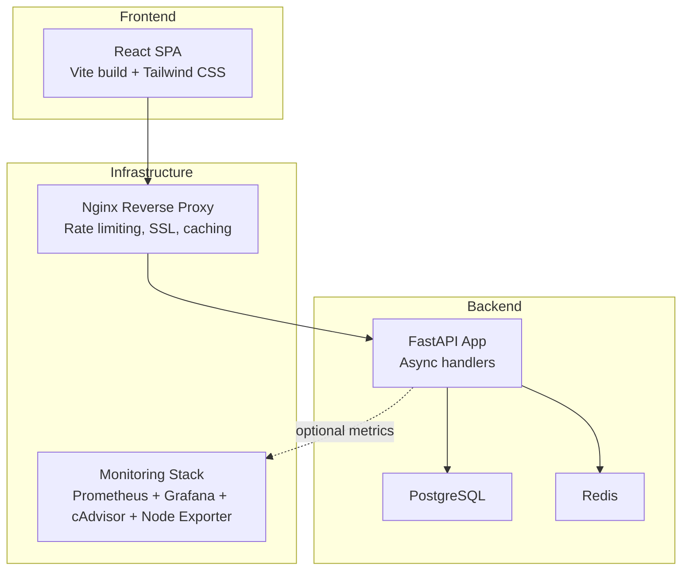
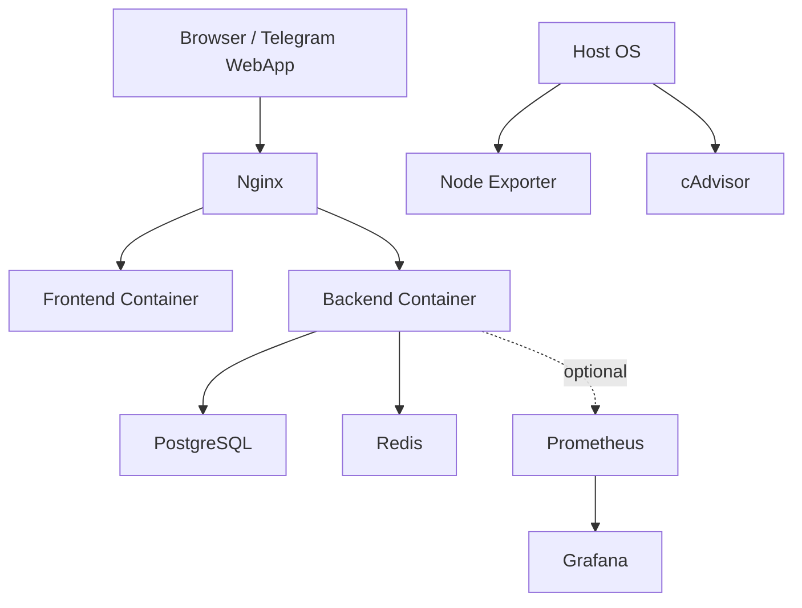
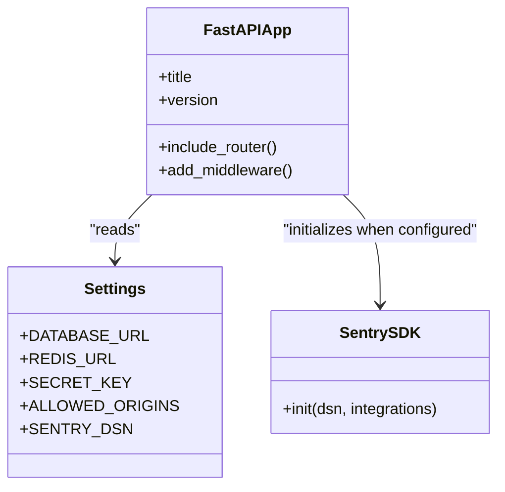
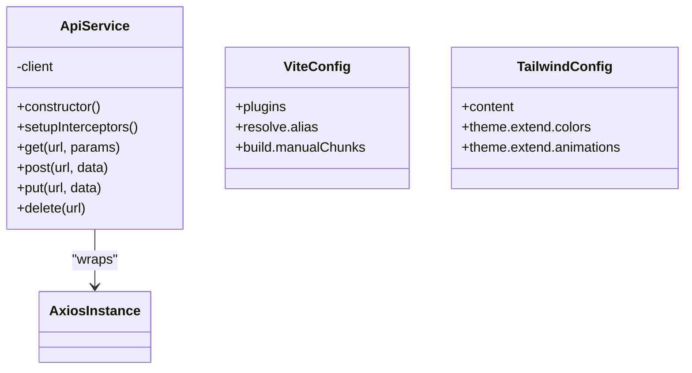
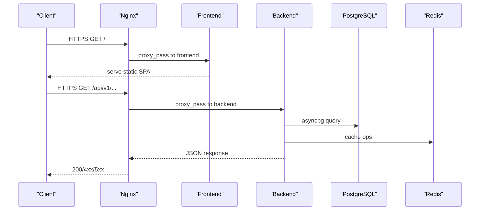
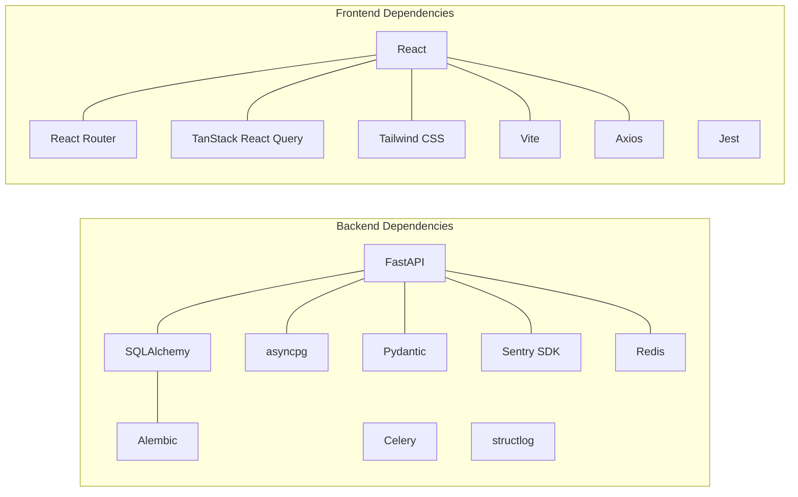

# Technology Stack

<cite>
**Referenced Files in This Document**
- [backend/requirements.txt](file://backend/requirements.txt)
- [backend/Dockerfile](file://backend/Dockerfile)
- [backend/app/main.py](file://backend/app/main.py)
- [backend/app/utils/config.py](file://backend/app/utils/config.py)
- [frontend/package.json](file://frontend/package.json)
- [frontend/Dockerfile](file://frontend/Dockerfile)
- [frontend/src/services/api.ts](file://frontend/src/services/api.ts)
- [frontend/tailwind.config.js](file://frontend/tailwind.config.js)
- [frontend/vite.config.ts](file://frontend/vite.config.ts)
- [docker-compose.yml](file://docker-compose.yml)
- [docker-compose.prod.yml](file://docker-compose.prod.yml)
- [nginx/nginx.conf](file://nginx/nginx.conf)
- [monitoring/docker-compose.monitoring.yml](file://monitoring/docker-compose.monitoring.yml)
- [monitoring/prometheus.yml](file://monitoring/prometheus.yml)
</cite>

## Table of Contents
1. [Introduction](#introduction)
2. [Project Structure](#project-structure)
3. [Core Components](#core-components)
4. [Architecture Overview](#architecture-overview)
5. [Detailed Component Analysis](#detailed-component-analysis)
6. [Dependency Analysis](#dependency-analysis)
7. [Performance Considerations](#performance-considerations)
8. [Security Considerations](#security-considerations)
9. [Maintenance and Upgrade Paths](#maintenance-and-upgrade-paths)
10. [Troubleshooting Guide](#troubleshooting-guide)
11. [Conclusion](#conclusion)

## Introduction
This document provides a comprehensive technology stack overview for FitTracker Pro. It covers backend (Python FastAPI, SQLAlchemy, Pydantic, asyncpg), frontend (React, TypeScript, Vite, Tailwind CSS), infrastructure (Docker, Nginx, monitoring), and operational practices. For each technology, we explain rationale, version requirements, compatibility, performance, security, and maintenance considerations.

## Project Structure
FitTracker Pro is organized into three primary layers:
- Backend: Python FastAPI application with asynchronous database access and middleware.
- Frontend: React TypeScript SPA built with Vite, styled with Tailwind CSS.
- Infrastructure: Dockerized services orchestrated via docker-compose, with optional production Nginx reverse proxy and monitoring stack.

**Diagram sources**
- [docker-compose.yml:1-99](file://docker-compose.yml#L1-L99)
- [docker-compose.prod.yml:1-132](file://docker-compose.prod.yml#L1-L132)
- [nginx/nginx.conf:1-144](file://nginx/nginx.conf#L1-L144)
- [monitoring/docker-compose.monitoring.yml:1-124](file://monitoring/docker-compose.monitoring.yml#L1-L124)

**Section sources**
- [docker-compose.yml:1-99](file://docker-compose.yml#L1-L99)
- [docker-compose.prod.yml:1-132](file://docker-compose.prod.yml#L1-L132)
- [nginx/nginx.conf:1-144](file://nginx/nginx.conf#L1-L144)
- [monitoring/docker-compose.monitoring.yml:1-124](file://monitoring/docker-compose.monitoring.yml#L1-L124)

## Core Components
- Backend framework: FastAPI with asyncpg for PostgreSQL connectivity and SQLAlchemy ORM for migrations and sync operations.
- Data validation: Pydantic models and settings for robust configuration management.
- Frontend framework: React with TypeScript, Vite for development and build, Tailwind CSS for styling.
- DevOps: Docker multi-stage builds, docker-compose orchestration, optional Nginx reverse proxy, and a monitoring stack (Prometheus, Grafana, cAdvisor, Node Exporter).

**Section sources**
- [backend/requirements.txt:1-42](file://backend/requirements.txt#L1-L42)
- [backend/app/main.py:1-126](file://backend/app/main.py#L1-L126)
- [backend/app/utils/config.py:1-55](file://backend/app/utils/config.py#L1-L55)
- [frontend/package.json:1-60](file://frontend/package.json#L1-L60)
- [frontend/tailwind.config.js:1-349](file://frontend/tailwind.config.js#L1-L349)
- [frontend/vite.config.ts:1-40](file://frontend/vite.config.ts#L1-L40)

## Architecture Overview
FitTracker Pro follows a modern microservice-like architecture within containers:
- Frontend served by Nginx in production; development uses Vite’s dev server.
- Backend API exposes REST endpoints under /api/v1 with JWT-based authentication and rate limiting.
- PostgreSQL persists relational data; Redis caches and Celery supports async tasks.
- Monitoring collects metrics and logs for observability.

**Diagram sources**
- [docker-compose.prod.yml:102-124](file://docker-compose.prod.yml#L102-L124)
- [nginx/nginx.conf:56-142](file://nginx/nginx.conf#L56-L142)
- [monitoring/docker-compose.monitoring.yml:4-84](file://monitoring/docker-compose.monitoring.yml#L4-L84)
- [monitoring/prometheus.yml:15-49](file://monitoring/prometheus.yml#L15-L49)

## Detailed Component Analysis

### Backend: FastAPI, SQLAlchemy, Pydantic, asyncpg
- Framework: FastAPI provides automatic OpenAPI docs, dependency injection, and async support. It integrates Sentry for error tracking and SQL tracing.
- Database: asyncpg for async PostgreSQL connectivity; SQLAlchemy used for migrations and sync operations; Alembic manages schema evolution.
- Validation: Pydantic models and pydantic-settings for type-safe configuration and runtime validation.
- Security: JWT bearer tokens for protected endpoints; CORS and rate-limiting middleware; optional Telegram bot integration.
- Observability: Structlog for structured logging; Sentry SDK enabled via environment variable.

**Diagram sources**
- [backend/app/main.py:56-107](file://backend/app/main.py#L56-L107)
- [backend/app/utils/config.py:15-54](file://backend/app/utils/config.py#L15-L54)
- [backend/requirements.txt:1-42](file://backend/requirements.txt#L1-L42)

**Section sources**
- [backend/app/main.py:1-126](file://backend/app/main.py#L1-L126)
- [backend/app/utils/config.py:1-55](file://backend/app/utils/config.py#L1-L55)
- [backend/requirements.txt:1-42](file://backend/requirements.txt#L1-L42)

### Frontend: React, TypeScript, Vite, Tailwind CSS
- Framework: React 18 with TypeScript for type safety; React Router for navigation.
- Build tooling: Vite for fast dev server and optimized production builds; aliases simplify imports.
- Styling: Tailwind CSS with a comprehensive design system supporting semantic colors, animations, and Telegram theme integration.
- HTTP client: Axios-based ApiService with interceptors for auth token injection and error handling.
- Package scripts: Dev, build, lint, test, and preview commands for local development.

**Diagram sources**
- [frontend/src/services/api.ts:6-69](file://frontend/src/services/api.ts#L6-L69)
- [frontend/vite.config.ts:5-39](file://frontend/vite.config.ts#L5-L39)
- [frontend/tailwind.config.js:1-349](file://frontend/tailwind.config.js#L1-L349)

**Section sources**
- [frontend/package.json:1-60](file://frontend/package.json#L1-L60)
- [frontend/src/services/api.ts:1-69](file://frontend/src/services/api.ts#L1-L69)
- [frontend/vite.config.ts:1-40](file://frontend/vite.config.ts#L1-L40)
- [frontend/tailwind.config.js:1-349](file://frontend/tailwind.config.js#L1-L349)

### Infrastructure: Docker, Nginx, Monitoring
- Backend container: Python 3.11 slim; installs system deps (gcc, libpq-dev); runs with Gunicorn + Uvicorn workers; health checks via curl.
- Frontend container: Multi-stage build with Node 20 Alpine; Nginx Alpine serves static assets; health checks included.
- Orchestration: docker-compose defines services for Postgres, Redis, Backend, and Frontend; prod compose adds Nginx and resource limits.
- Nginx: SSL termination, HTTP/2, rate limiting, connection keepalive, cache headers for static assets, and security headers.
- Monitoring: Prometheus scrapes backend metrics, Node Exporter and cAdvisor collect host/container metrics; Grafana visualizes dashboards.

**Diagram sources**
- [docker-compose.yml:43-90](file://docker-compose.yml#L43-L90)
- [docker-compose.prod.yml:54-117](file://docker-compose.prod.yml#L54-L117)
- [nginx/nginx.conf:78-121](file://nginx/nginx.conf#L78-L121)

**Section sources**
- [backend/Dockerfile:1-48](file://backend/Dockerfile#L1-L48)
- [frontend/Dockerfile:1-56](file://frontend/Dockerfile#L1-L56)
- [docker-compose.yml:1-99](file://docker-compose.yml#L1-L99)
- [docker-compose.prod.yml:1-132](file://docker-compose.prod.yml#L1-L132)
- [nginx/nginx.conf:1-144](file://nginx/nginx.conf#L1-L144)
- [monitoring/docker-compose.monitoring.yml:1-124](file://monitoring/docker-compose.monitoring.yml#L1-L124)
- [monitoring/prometheus.yml:15-49](file://monitoring/prometheus.yml#L15-L49)

## Dependency Analysis
- Backend dependencies pinned in requirements.txt include FastAPI, Uvicorn, SQLAlchemy, Alembic, asyncpg, Pydantic, Sentry SDK, structlog, Celery, Redis, and testing libraries.
- Frontend dependencies include React, React Router, TanStack React Query, Tailwind, Vite, Jest, and Telegram SDKs.
- Runtime dependencies are managed via Docker images and multi-stage builds, ensuring minimal production footprints.

**Diagram sources**
- [backend/requirements.txt:1-42](file://backend/requirements.txt#L1-L42)
- [frontend/package.json:16-58](file://frontend/package.json#L16-L58)

**Section sources**
- [backend/requirements.txt:1-42](file://backend/requirements.txt#L1-L42)
- [frontend/package.json:1-60](file://frontend/package.json#L1-L60)

## Performance Considerations
- Backend
  - Async database operations with asyncpg reduce blocking; Gunicorn with Uvicorn workers improves concurrency.
  - Structured logging and Sentry profiling help identify hotspots.
- Frontend
  - Vite’s chunk splitting groups vendor bundles; Tailwind purges unused styles in production builds.
  - Nginx gzip and static asset caching improve load times.
- Infrastructure
  - Resource limits in docker-compose.prod.yml constrain CPU/memory usage; keepalive and HTTP/2 reduce overhead.

**Section sources**
- [backend/Dockerfile:46-47](file://backend/Dockerfile#L46-L47)
- [frontend/vite.config.ts:26-38](file://frontend/vite.config.ts#L26-L38)
- [nginx/nginx.conf:27-31](file://nginx/nginx.conf#L27-L31)
- [docker-compose.prod.yml:25-101](file://docker-compose.prod.yml#L25-L101)

## Security Considerations
- Transport and Edge
  - Nginx enforces TLS 1.2/1.3, HSTS, XSS/Clickjacking protections, and blocks sensitive paths.
  - Rate limiting zones protect against brute force and abuse.
- Application
  - JWT bearer tokens required for most endpoints; CORS configured via environment; Sentry DSN optional for error reporting.
  - Environment-driven configuration prevents secrets in code.
- Secrets and Operations
  - Compose files rely on environment variables for credentials; restrict production ports to localhost where applicable.

**Section sources**
- [nginx/nginx.conf:57-142](file://nginx/nginx.conf#L57-L142)
- [backend/app/main.py:77-87](file://backend/app/main.py#L77-L87)
- [backend/app/utils/config.py:15-54](file://backend/app/utils/config.py#L15-L54)
- [docker-compose.yml:50-60](file://docker-compose.yml#L50-L60)
- [docker-compose.prod.yml:59-69](file://docker-compose.prod.yml#L59-L69)

## Maintenance and Upgrade Paths
- Version Requirements
  - Backend: Python 3.11; FastAPI, Uvicorn, SQLAlchemy, Alembic, asyncpg, Pydantic, Sentry SDK, structlog, Celery, Redis pinned per requirements.txt.
  - Frontend: Node 20; React 18, TypeScript 5.x, Vite 5.x, Tailwind 3.x, Jest 29.x per package.json.
  - Infrastructure: PostgreSQL 15-alpine, Redis 7-alpine; Nginx alpine; Prometheus/Grafana latest official images.
- Dependency Management
  - Pin versions in requirements.txt and package.json; use npm ci for deterministic installs; leverage multi-stage builds to minimize attack surface.
- Update Procedures
  - Test updates in development with docker-compose.yml; promote to staging; validate metrics and logs; apply production changes with rolling updates.
- Upgrade Paths
  - Python: Align minor versions with security support; rebuild images after upgrades.
  - Node: Align with LTS; update Vite/Tailwind together to avoid breaking changes.
  - Databases: Use Alembic migrations for schema changes; back up volumes before major upgrades.
  - Containers: Prefer patch updates for base images; rebuild application images after OS/base image updates.

**Section sources**
- [backend/requirements.txt:1-42](file://backend/requirements.txt#L1-L42)
- [frontend/package.json:1-60](file://frontend/package.json#L1-L60)
- [docker-compose.yml:5-6](file://docker-compose.yml#L5-L6)
- [docker-compose.prod.yml:5-6](file://docker-compose.prod.yml#L5-L6)
- [monitoring/docker-compose.monitoring.yml:6-35](file://monitoring/docker-compose.monitoring.yml#L6-L35)

## Troubleshooting Guide
- Health Checks
  - Backend: Uvicorn health check probes /api/v1/health; Frontend: Nginx health endpoint returns “healthy”; Postgres/Redis expose health checks via compose.
- Logs
  - Backend: Structured logs via structlog; Sentry captures exceptions when configured.
  - Frontend: Console errors captured by response interceptors; review browser network tab.
  - Monitoring: Prometheus scrapes backend metrics; Grafana dashboards visualize system health.
- Common Issues
  - CORS errors: Verify ALLOWED_ORIGINS; ensure environment variables match deployment domains.
  - Rate limiting: Review Nginx zones and backend middleware behavior.
  - Database connectivity: Confirm DATABASE_URL and asyncpg installation; check Postgres readiness.
  - Cache connectivity: Validate REDIS_URL; confirm Redis health checks pass.

**Section sources**
- [backend/Dockerfile:42-44](file://backend/Dockerfile#L42-L44)
- [frontend/Dockerfile:50-52](file://frontend/Dockerfile#L50-L52)
- [docker-compose.yml:17-21](file://docker-compose.yml#L17-L21)
- [docker-compose.yml:35-39](file://docker-compose.yml#L35-L39)
- [nginx/nginx.conf:122-127](file://nginx/nginx.conf#L122-L127)
- [monitoring/prometheus.yml:31-35](file://monitoring/prometheus.yml#L31-L35)

## Conclusion
FitTracker Pro leverages modern, production-ready technologies: FastAPI for a robust async backend, React with TypeScript for a responsive frontend, Docker for containerization, Nginx for edge security and performance, and a comprehensive monitoring stack for observability. Adhering to pinned versions, environment-driven configuration, and disciplined update procedures ensures reliability, scalability, and maintainability across environments.