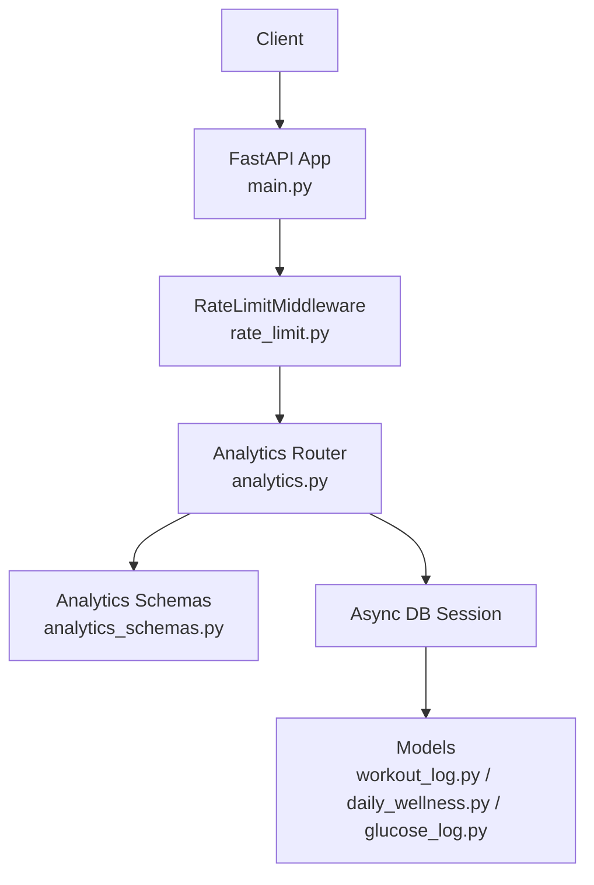
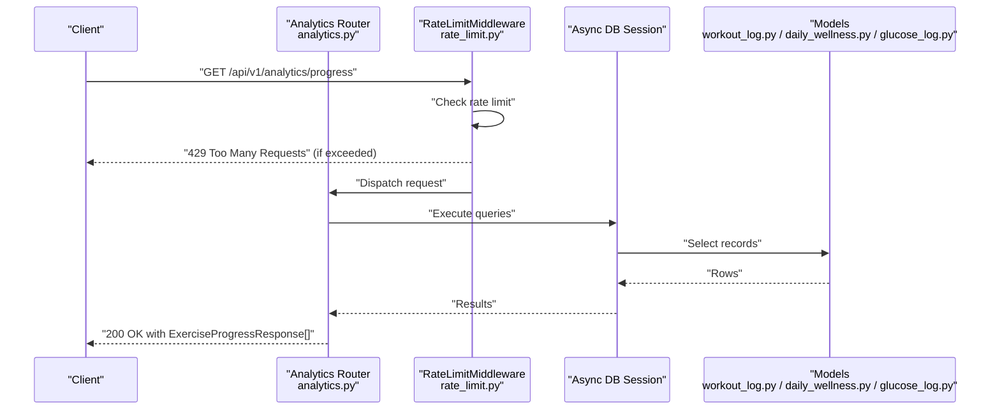
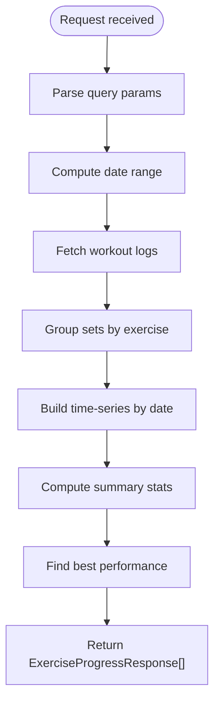
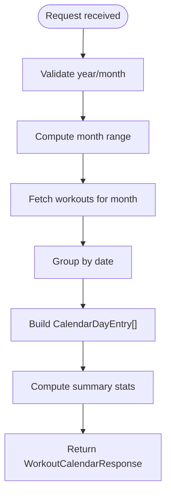
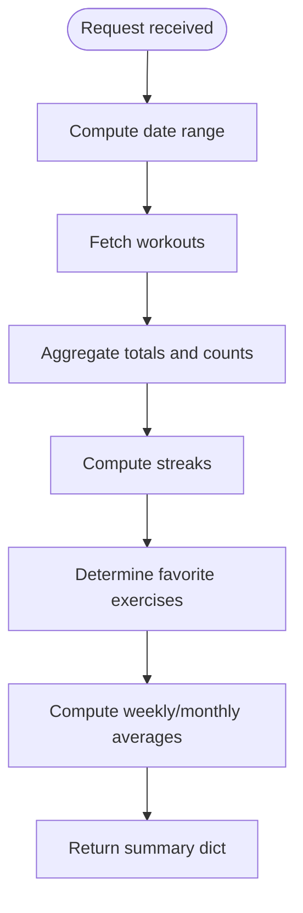
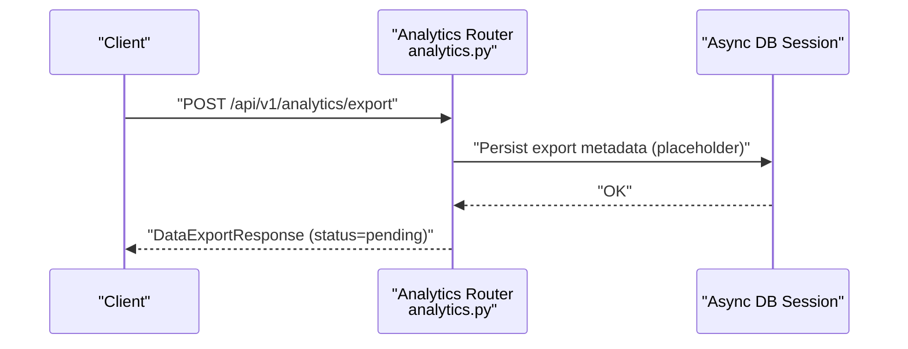
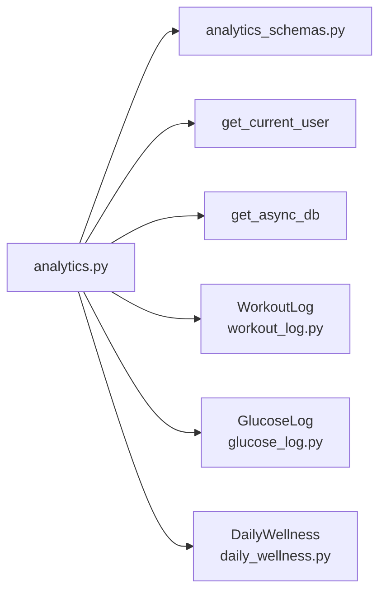

# Analytics & Insights

<cite>
**Referenced Files in This Document**
- [main.py](file://backend/app/main.py)
- [analytics.py](file://backend/app/api/analytics.py)
- [analytics_schemas.py](file://backend/app/schemas/analytics.py)
- [rate_limit.py](file://backend/app/middleware/rate_limit.py)
- [workout_log.py](file://backend/app/models/workout_log.py)
- [daily_wellness.py](file://backend/app/models/daily_wellness.py)
- [glucose_log.py](file://backend/app/models/glucose_log.py)
- [health_api.py](file://backend/app/api/health.py)
- [achievements_api.py](file://backend/app/api/achievements.py)
- [config.py](file://backend/app/utils/config.py)
</cite>

## Table of Contents
1. [Introduction](#introduction)
2. [Project Structure](#project-structure)
3. [Core Components](#core-components)
4. [Architecture Overview](#architecture-overview)
5. [Detailed Component Analysis](#detailed-component-analysis)
6. [Dependency Analysis](#dependency-analysis)
7. [Performance Considerations](#performance-considerations)
8. [Troubleshooting Guide](#troubleshooting-guide)
9. [Conclusion](#conclusion)
10. [Appendices](#appendices)

## Introduction
This document provides comprehensive API documentation for analytics and insights endpoints in the FitTracker Pro backend. It covers:
- Workout trend analysis via aggregated time-series data
- Health metric summaries combining glucose, workouts, and wellness
- Monthly calendar analytics for workout scheduling insights
- Data export initiation and status polling
- Leaderboard ranking for achievements
- Request/response schemas, data processing workflows, caching strategies, performance optimization, rate limiting, and data freshness considerations

## Project Structure
Analytics endpoints are exposed under the /api/v1/analytics namespace and integrated into the main application router. The analytics module depends on shared authentication, database session management, and Pydantic schemas for request/response modeling.

**Diagram sources**
- [main.py:86-106](file://backend/app/main.py#L86-L106)
- [rate_limit.py:37-179](file://backend/app/middleware/rate_limit.py#L37-L179)
- [analytics.py:24-518](file://backend/app/api/analytics.py#L24-L518)
- [analytics_schemas.py:1-111](file://backend/app/schemas/analytics.py#L1-L111)
- [workout_log.py:19-112](file://backend/app/models/workout_log.py#L19-L112)
- [daily_wellness.py:17-118](file://backend/app/models/daily_wellness.py#L17-L118)
- [glucose_log.py:18-80](file://backend/app/models/glucose_log.py#L18-L80)

**Section sources**
- [main.py:86-106](file://backend/app/main.py#L86-L106)
- [analytics.py:24-518](file://backend/app/api/analytics.py#L24-L518)

## Core Components
- Analytics Router: Implements endpoints for workout progress, calendar analytics, summary statistics, and data export initiation.
- Analytics Schemas: Defines Pydantic models for request/response payloads.
- Rate Limiting Middleware: Applies distributed rate limits per endpoint and IP/user.
- Data Models: WorkoutLog, GlucoseLog, DailyWellness provide the underlying data for analytics computations.

Key endpoints:
- GET /api/v1/analytics/progress
- GET /api/v1/analytics/calendar
- GET /api/v1/analytics/summary
- POST /api/v1/analytics/export
- GET /api/v1/analytics/export/{export_id}

Note: The repository does not expose a dedicated GET /api/v1/analytics/health-statistics or GET /api/v1/analytics/leaderboard endpoint. Health statistics are available via the health module, and leaderboard is available via the achievements module.

**Section sources**
- [analytics.py:27-518](file://backend/app/api/analytics.py#L27-L518)
- [analytics_schemas.py:10-111](file://backend/app/schemas/analytics.py#L10-L111)
- [rate_limit.py:23-34](file://backend/app/middleware/rate_limit.py#L23-L34)
- [workout_log.py:19-112](file://backend/app/models/workout_log.py#L19-L112)
- [daily_wellness.py:17-118](file://backend/app/models/daily_wellness.py#L17-L118)
- [glucose_log.py:18-80](file://backend/app/models/glucose_log.py#L18-L80)

## Architecture Overview
The analytics endpoints follow a standard request-response flow:
- Authentication: All endpoints require a Bearer token (except OpenAPI docs).
- Rate Limiting: Enforced per endpoint and IP/user.
- Data Access: Async SQLAlchemy queries against workout, glucose, and wellness tables.
- Response Modeling: Pydantic models define strict schemas for clients.

**Diagram sources**
- [analytics.py:27-197](file://backend/app/api/analytics.py#L27-L197)
- [rate_limit.py:137-179](file://backend/app/middleware/rate_limit.py#L137-L179)
- [workout_log.py:19-112](file://backend/app/models/workout_log.py#L19-L112)
- [daily_wellness.py:17-118](file://backend/app/models/daily_wellness.py#L17-L118)
- [glucose_log.py:18-80](file://backend/app/models/glucose_log.py#L18-L80)

## Detailed Component Analysis

### Analytics Endpoints

#### GET /api/v1/analytics/progress
Purpose: Retrieve exercise progress analytics including time-series data and summary statistics for a selected period and optional exercise filter.

- Query parameters:
  - exercise_id: integer (optional)
  - period: string among 7d, 30d, 90d, 1y, all
- Response: Array of ExerciseProgressResponse with:
  - exercise_id, exercise_name, period
  - data_points: list of {date, max_weight, total_volume or reps}
  - summary: ExerciseProgressData with totals and derived metrics
  - best_performance: {date, weight, reps}

Processing logic:
- Compute date range based on period
- Fetch workout logs for the period
- Aggregate sets by exercise, deduplicate by latest weight per date
- Compute summary metrics (total sets, total reps, max weight, average weight, first/last date, progress percentage)
- Identify best performance

**Diagram sources**
- [analytics.py:27-197](file://backend/app/api/analytics.py#L27-L197)

**Section sources**
- [analytics.py:27-197](file://backend/app/api/analytics.py#L27-L197)
- [analytics_schemas.py:10-34](file://backend/app/schemas/analytics.py#L10-L34)

#### GET /api/v1/analytics/calendar
Purpose: Provide a monthly calendar view of workout activity with summary statistics.

- Query parameters:
  - year: integer (default current year)
  - month: integer (default current month)
- Response: WorkoutCalendarResponse with:
  - year, month
  - days: list of CalendarDayEntry with workout_count, total_duration, workout_types, flags for glucose/wellness entries
  - summary: totals and counts

Processing logic:
- Determine first and last day of the month
- Fetch workouts for the month
- Group by date and compute per-day metrics
- Summarize totals and counts

**Diagram sources**
- [analytics.py:200-307](file://backend/app/api/analytics.py#L200-L307)

**Section sources**
- [analytics.py:200-307](file://backend/app/api/analytics.py#L200-L307)
- [analytics_schemas.py:36-55](file://backend/app/schemas/analytics.py#L36-L55)

#### GET /api/v1/analytics/summary
Purpose: Provide a high-level analytics summary for a given period.

- Query parameters:
  - period: string among 7d, 30d, 90d, 1y, all
- Response: Analytics summary with counts, averages, streaks, and favorites

Processing logic:
- Compute date range
- Fetch workouts
- Calculate totals, durations, unique exercises
- Compute current/longest streaks
- Determine favorite exercises by count
- Compute weekly/monthly averages

**Diagram sources**
- [analytics.py:385-517](file://backend/app/api/analytics.py#L385-L517)

**Section sources**
- [analytics.py:385-517](file://backend/app/api/analytics.py#L385-L517)
- [analytics_schemas.py:100-111](file://backend/app/schemas/analytics.py#L100-L111)

#### POST /api/v1/analytics/export
Purpose: Initiate a data export job for user-selected data types and date range.

- Request: DataExportRequest with format and inclusion flags
- Response: DataExportResponse with export_id and metadata

Notes:
- Current implementation returns a pending status without triggering asynchronous export
- Future implementation should persist export metadata and provide a download URL upon completion

**Diagram sources**
- [analytics.py:310-365](file://backend/app/api/analytics.py#L310-L365)
- [analytics_schemas.py:58-78](file://backend/app/schemas/analytics.py#L58-L78)

**Section sources**
- [analytics.py:310-365](file://backend/app/api/analytics.py#L310-L365)
- [analytics_schemas.py:58-78](file://backend/app/schemas/analytics.py#L58-L78)

#### GET /api/v1/analytics/export/{export_id}
Purpose: Poll for export status.

- Response: DataExportResponse or 404 Not Found if export not found/expired

Current behavior:
- Returns 404 Not Found (placeholder)

Future behavior:
- Query Redis/DB for export status and file metadata

**Section sources**
- [analytics.py:368-382](file://backend/app/api/analytics.py#L368-L382)
- [analytics_schemas.py:69-78](file://backend/app/schemas/analytics.py#L69-L78)

### Health Statistics (Available via Health Module)
While not part of analytics.py, health statistics are essential for holistic insights:
- GET /api/v1/health/stats: Provides glucose, workouts, and wellness averages for 7d/30d windows
- GET /api/v1/health/glucose: Glucose history with filtering and statistics
- GET /api/v1/health/wellness: Wellness entries with filtering and limits

These endpoints complement analytics by providing health context for workout trends.

**Section sources**
- [health_api.py:409-614](file://backend/app/api/health.py#L409-L614)

### Leaderboard (Achievements Module)
Achievement rankings are available via:
- GET /api/v1/achievements/leaderboard: Returns top users by points and user’s rank

This endpoint supports gamification insights aligned with analytics.

**Section sources**
- [achievements_api.py:312-419](file://backend/app/api/achievements.py#L312-L419)

## Dependency Analysis
- Analytics Router depends on:
  - Authentication dependency for current user
  - Async DB session for queries
  - Analytics Pydantic schemas for request/response modeling
- Data models:
  - WorkoutLog: JSON field containing completed exercises with sets, reps, and weight
  - GlucoseLog: Blood glucose measurements linked to workouts
  - DailyWellness: Sleep, energy, pain, and mood metrics

**Diagram sources**
- [analytics.py:13-24](file://backend/app/api/analytics.py#L13-L24)
- [workout_log.py:19-112](file://backend/app/models/workout_log.py#L19-L112)
- [glucose_log.py:18-80](file://backend/app/models/glucose_log.py#L18-L80)
- [daily_wellness.py:17-118](file://backend/app/models/daily_wellness.py#L17-L118)

**Section sources**
- [analytics.py:13-24](file://backend/app/api/analytics.py#L13-L24)
- [workout_log.py:19-112](file://backend/app/models/workout_log.py#L19-L112)
- [glucose_log.py:18-80](file://backend/app/models/glucose_log.py#L18-L80)
- [daily_wellness.py:17-118](file://backend/app/models/daily_wellness.py#L17-L118)

## Performance Considerations
- Database indexing:
  - WorkoutLog: user_id, template_id, date, composite user+date
  - DailyWellness: user_id, date (unique), sleep_score, energy_score
  - GlucoseLog: user_id, workout_id, timestamp, measurement_type
- Query patterns:
  - Use filtered queries with date ranges and user scoping
  - Prefer aggregation queries (sum/count/avg) to minimize payload sizes
- Data structures:
  - Exercise sets are stored as JSON; avoid unnecessary deserialization overhead by processing in Python
- Pagination:
  - Health endpoints demonstrate pagination; consider similar patterns for large datasets
- Caching:
  - No explicit caching is implemented in analytics endpoints; consider caching periodic summaries for high-frequency periods
- Asynchronous operations:
  - Analytics endpoints are synchronous; export generation should be offloaded to background tasks

[No sources needed since this section provides general guidance]

## Troubleshooting Guide
Common issues and resolutions:
- Rate limit exceeded:
  - Check X-RateLimit-* headers; reduce request frequency or adjust client-side retry
  - Export endpoint has stricter hourly limits
- Authentication failures:
  - Ensure Authorization: Bearer <access_token> header is present
- Data not found:
  - Verify date ranges and filters; ensure user has data within the selected period
- Export status:
  - Export status endpoint currently returns 404; implement backend export pipeline to resolve

**Section sources**
- [rate_limit.py:159-169](file://backend/app/middleware/rate_limit.py#L159-L169)
- [analytics.py:368-382](file://backend/app/api/analytics.py#L368-L382)

## Conclusion
The analytics module provides robust endpoints for workout progress, calendar insights, and summary statistics, with clear request/response schemas and strong database indexing. Health statistics and leaderboard are available via separate modules, enabling comprehensive insights. To enhance scalability, consider implementing export background jobs, caching for frequently accessed summaries, and pagination for large datasets.

[No sources needed since this section summarizes without analyzing specific files]

## Appendices

### Request/Response Schemas

- ExerciseProgressResponse
  - Fields: exercise_id, exercise_name, period, data_points[], summary, best_performance
  - Summary: ExerciseProgressData with totals and derived metrics

- WorkoutCalendarResponse
  - Fields: year, month, days[], summary

- DataExportRequest
  - Fields: format, date_from, date_to, include_workouts, include_glucose, include_wellness, include_achievements

- DataExportResponse
  - Fields: export_id, status, format, download_url, expires_at, requested_at, file_size

- AnalyticsSummaryResponse
  - Fields: total_workouts, total_duration, total_exercises, current_streak, longest_streak, personal_records[], favorite_exercises[], weekly_average, monthly_average

**Section sources**
- [analytics_schemas.py:10-111](file://backend/app/schemas/analytics.py#L10-L111)

### Rate Limiting Configuration
- Default: 100 requests per 60 seconds
- Export endpoint: 5 requests per 3600 seconds
- Headers: X-RateLimit-Limit, X-RateLimit-Remaining, X-RateLimit-Reset

**Section sources**
- [rate_limit.py:17-34](file://backend/app/middleware/rate_limit.py#L17-L34)
- [rate_limit.py:159-169](file://backend/app/middleware/rate_limit.py#L159-L169)

### Data Freshness and Background Jobs
- Current analytics endpoints return computed results synchronously
- Export endpoints return pending status; implement Celery/RQ/Redis-backed jobs to generate files asynchronously and update status

**Section sources**
- [analytics.py:354-365](file://backend/app/api/analytics.py#L354-L365)
- [analytics.py:377-382](file://backend/app/api/analytics.py#L377-L382)