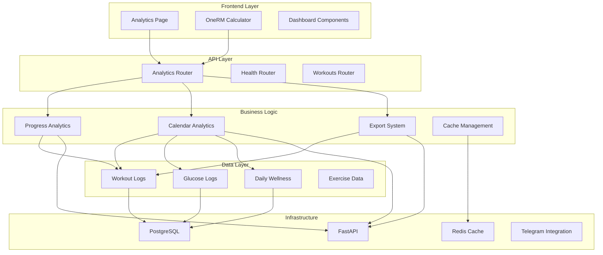
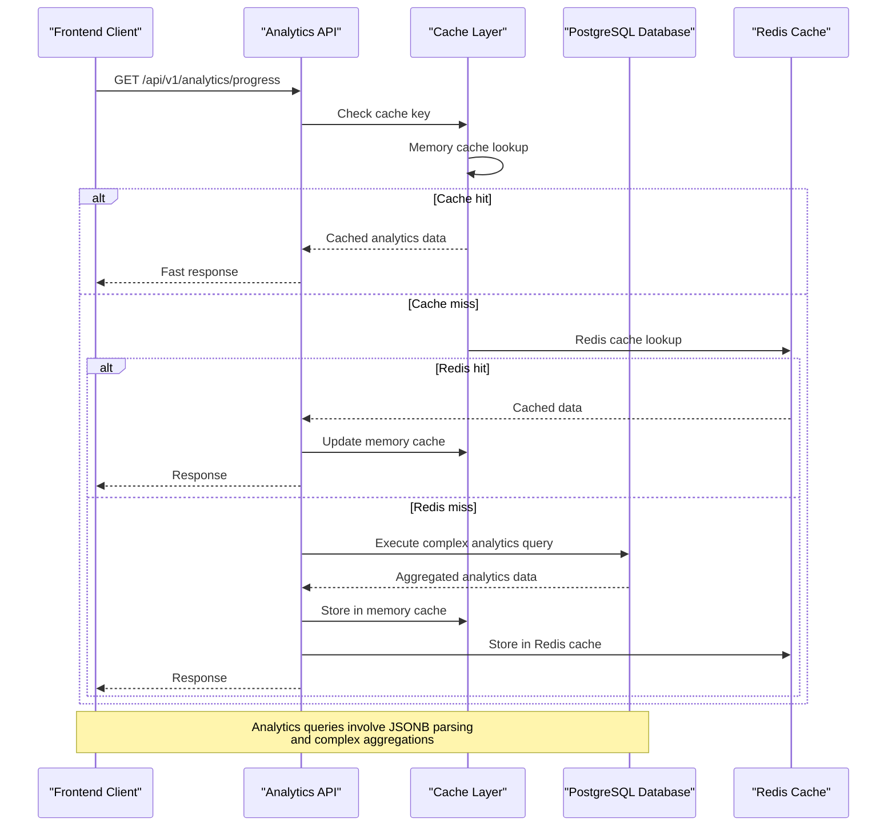
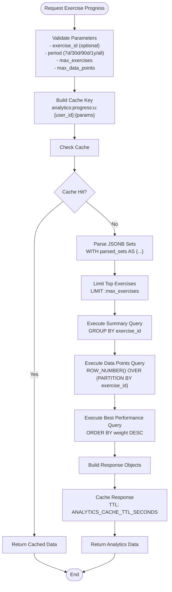
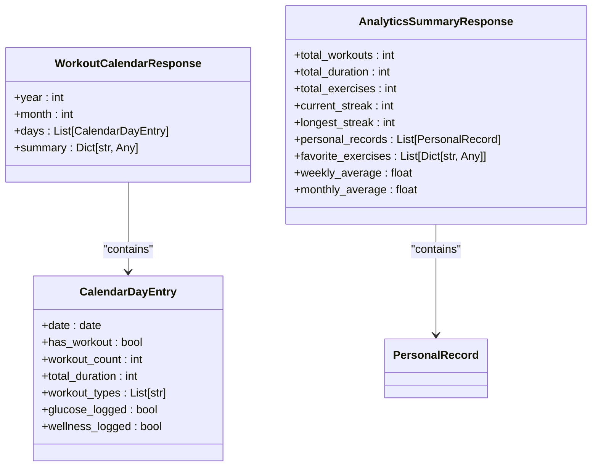
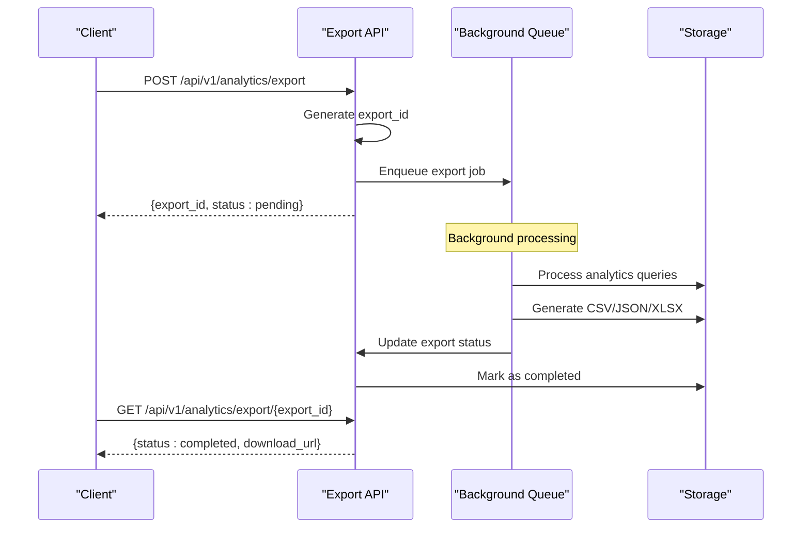
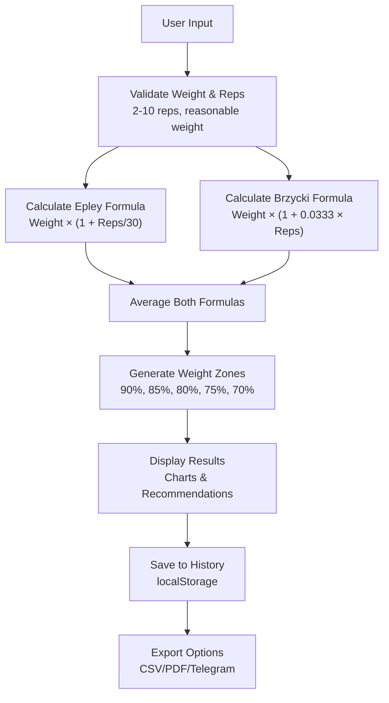
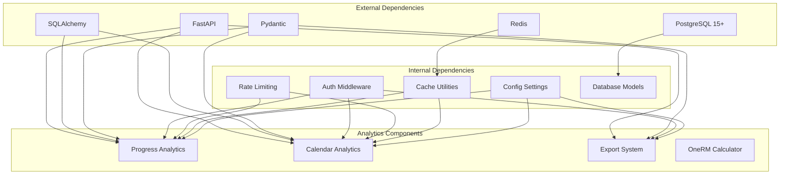

# Advanced Analytics System

<cite>
**Referenced Files in This Document**
- [analytics.py](file://backend/app/api/analytics.py)
- [analytics.py](file://backend/app/schemas/analytics.py)
- [workout_log.py](file://backend/app/models/workout_log.py)
- [glucose_log.py](file://backend/app/models/glucose_log.py)
- [daily_wellness.py](file://backend/app/models/daily_wellness.py)
- [cache.py](file://backend/app/utils/cache.py)
- [config.py](file://backend/app/utils/config.py)
- [9f41b6d2a7c1_add_analytics_indexes.py](file://database/migrations/versions/9f41b6d2a7c1_add_analytics_indexes.py)
- [cd723942379e_initial_schema.py](file://database/migrations/versions/cd723942379e_initial_schema.py)
- [main.py](file://backend/app/main.py)
- [OneRMCalculator.tsx](file://frontend/src/components/analytics/OneRMCalculator.tsx)
- [Analytics.tsx](file://frontend/src/pages/Analytics.tsx)
- [README.md](file://README.md)
</cite>

## Table of Contents
1. [Introduction](#introduction)
2. [Project Structure](#project-structure)
3. [Core Components](#core-components)
4. [Architecture Overview](#architecture-overview)
5. [Detailed Component Analysis](#detailed-component-analysis)
6. [Dependency Analysis](#dependency-analysis)
7. [Performance Considerations](#performance-considerations)
8. [Troubleshooting Guide](#troubleshooting-guide)
9. [Conclusion](#conclusion)

## Introduction

The Advanced Analytics System in FitTracker Pro is a comprehensive data analysis platform designed to provide users with deep insights into their fitness journey. This system processes complex workout data, tracks exercise progression, generates personalized analytics reports, and offers advanced calculation tools like the One Rep Max (1RM) calculator.

The system is built around PostgreSQL's powerful JSONB capabilities, enabling flexible data storage for workout logs while maintaining analytical performance through strategic indexing and caching mechanisms. It serves as the backbone for the application's gamification features, progress tracking, and personalized fitness recommendations.

## Project Structure

The analytics system is organized across multiple layers within the FitTracker Pro architecture:

**Diagram sources**
- [main.py:14-25](file://backend/app/main.py#L14-L25)
- [analytics.py:1-26](file://backend/app/api/analytics.py#L1-L26)

**Section sources**
- [README.md:18-44](file://README.md#L18-L44)
- [main.py:122-139](file://backend/app/main.py#L122-L139)

## Core Components

### Analytics API Router

The Analytics API Router serves as the central hub for all analytical operations, providing three primary endpoints:

- **Exercise Progress Tracking**: Monitors individual exercise performance over time with configurable time periods
- **Workout Calendar Analytics**: Generates monthly workout calendars with detailed activity summaries
- **Data Export System**: Provides structured data export capabilities for external analysis

Each endpoint implements sophisticated caching mechanisms to optimize performance for frequently accessed analytics data.

### Data Models and Storage

The system utilizes PostgreSQL's JSONB columns to store flexible workout data structures:

- **Workout Logs**: Store completed exercises with actual sets, reps, and weight data
- **Glucose Logs**: Track blood glucose levels with timestamps and measurement types
- **Daily Wellness**: Capture sleep scores, energy levels, and pain tracking metrics

These models support complex analytical queries through PostgreSQL's native JSON operators and functions.

### Caching Infrastructure

The analytics system implements a two-tier caching strategy:

1. **Memory Cache**: Fast in-process caching for immediate response optimization
2. **Redis Cache**: Distributed caching for horizontal scalability and persistence

Cache keys follow a standardized format: `analytics:{endpoint}:u:{user_id}:{params}` enabling efficient cache invalidation and user-specific analytics isolation.

**Section sources**
- [analytics.py:36-299](file://backend/app/api/analytics.py#L36-L299)
- [workout_log.py:19-112](file://backend/app/models/workout_log.py#L19-L112)
- [cache.py:18-132](file://backend/app/utils/cache.py#L18-L132)

## Architecture Overview

The Advanced Analytics System follows a layered architecture pattern optimized for analytical workloads:

**Diagram sources**
- [analytics.py:96-111](file://backend/app/api/analytics.py#L96-L111)
- [cache.py:59-103](file://backend/app/utils/cache.py#L59-L103)

The architecture leverages PostgreSQL's JSONB capabilities for flexible data storage while maintaining analytical performance through strategic indexing and query optimization.

## Detailed Component Analysis

### Exercise Progress Analytics

The exercise progress system provides comprehensive tracking of individual exercise performance over customizable time periods:

**Diagram sources**
- [analytics.py:36-299](file://backend/app/api/analytics.py#L36-L299)

The system implements several advanced features:

- **Dynamic Exercise Filtering**: Automatically identifies and limits to the most relevant exercises based on recent activity
- **Progress Calculation**: Calculates percentage improvements using first and last recorded weights
- **Best Performance Tracking**: Identifies personal records and peak performance dates
- **Flexible Time Periods**: Supports 7-day, 30-day, 90-day, 1-year, and all-time analysis windows

### Workout Calendar Analytics

The calendar system provides comprehensive monthly workout visualization:

**Diagram sources**
- [analytics.py:36-56](file://backend/app/api/analytics.py#L36-L56)
- [analytics.py:100-111](file://backend/app/api/analytics.py#L100-L111)

The calendar aggregates data from multiple sources:

- **Workout Statistics**: Counts, durations, and exercise types per day
- **Health Metrics**: Glucose logging indicators and wellness check-in tracking
- **Activity Patterns**: Identifies active vs. rest days for comprehensive analysis

### Data Export System

The export system provides structured data extraction for external analysis:

**Diagram sources**
- [analytics.py:463-535](file://backend/app/api/analytics.py#L463-L535)

**Section sources**
- [analytics.py:302-460](file://backend/app/api/analytics.py#L302-L460)
- [analytics.py:538-722](file://backend/app/api/analytics.py#L538-L722)

### OneRM Calculator Integration

The frontend OneRM calculator provides real-time strength calculation with historical tracking:

**Diagram sources**
- [OneRMCalculator.tsx:62-91](file://frontend/src/components/analytics/OneRMCalculator.tsx#L62-L91)
- [OneRMCalculator.tsx:96-109](file://frontend/src/components/analytics/OneRMCalculator.tsx#L96-L109)

**Section sources**
- [OneRMCalculator.tsx:1-715](file://frontend/src/components/analytics/OneRMCalculator.tsx#L1-L715)

## Dependency Analysis

The analytics system has carefully managed dependencies to ensure optimal performance and maintainability:

**Diagram sources**
- [config.py:15-63](file://backend/app/utils/config.py#L15-L63)
- [cache.py:10-12](file://backend/app/utils/cache.py#L10-L12)

### Database Schema Evolution

The system's database schema has evolved to support advanced analytics:

- **JSONB Columns**: Flexible storage for workout logs and exercise data
- **GIN Indexes**: Optimized JSONB operations for filtering and aggregation
- **Composite Indexes**: Multi-column indexes for common analytics queries
- **Unique Constraints**: Prevent duplicate wellness entries per day

**Section sources**
- [cd723942379e_initial_schema.py:129-165](file://database/migrations/versions/cd723942379e_initial_schema.py#L129-L165)
- [9f41b6d2a7c1_add_analytics_indexes.py:17-28](file://database/migrations/versions/9f41b6d2a7c1_add_analytics_indexes.py#L17-L28)

## Performance Considerations

### Query Optimization Strategies

The analytics system employs several optimization techniques:

1. **JSONB Query Optimization**: Uses PostgreSQL's native JSON operators for efficient parsing
2. **Window Functions**: Leverages ROW_NUMBER() for ranking and limiting analytics data
3. **CTE Optimization**: Complex queries broken into Common Table Expressions for maintainability
4. **Index Utilization**: Strategic indexes on frequently queried columns

### Caching Strategy

The dual-layer caching system provides optimal performance:

- **Memory Cache**: 20-second TTL for immediate response optimization
- **Redis Cache**: 120-second TTL for distributed caching across instances
- **Cache Invalidation**: User-specific invalidation prevents data leakage
- **Cache Keys**: Standardized format enables easy cache management

### Scalability Features

- **Asynchronous Processing**: FastAPI's async/await for concurrent request handling
- **Connection Pooling**: SQLAlchemy connection pooling for database efficiency
- **Pagination Support**: Built-in limits prevent resource exhaustion
- **Query Parameter Validation**: Input sanitization prevents malicious queries

## Troubleshooting Guide

### Common Issues and Solutions

**Analytics Queries Slow**
- Verify JSONB indexes are properly created
- Check Redis connectivity and memory allocation
- Review query parameter limits
- Monitor database query execution plans

**Cache Invalidation Problems**
- Ensure user-specific cache keys are properly invalidated
- Verify Redis cache is reachable
- Check cache TTL settings
- Monitor cache hit ratios

**Data Export Failures**
- Verify background job queue availability
- Check file system permissions for exports
- Monitor Redis queue capacity
- Review export format support

### Monitoring and Debugging

The system includes comprehensive monitoring capabilities:

- **Sentry Integration**: Error tracking and performance monitoring
- **Database Query Logging**: Slow query identification
- **Cache Performance Metrics**: Hit ratio and latency monitoring
- **API Response Time Tracking**: Endpoint performance analysis

**Section sources**
- [cache.py:106-132](file://backend/app/utils/cache.py#L106-L132)
- [config.py:48-50](file://backend/app/utils/config.py#L48-L50)

## Conclusion

The Advanced Analytics System in FitTracker Pro represents a sophisticated approach to fitness data analysis, combining modern web technologies with robust database capabilities. The system successfully balances flexibility in data storage with performance optimization through strategic indexing, caching, and query optimization.

Key strengths of the system include:

- **Flexible Data Storage**: JSONB columns enable adaptation to evolving data requirements
- **High Performance**: Dual-layer caching and optimized database queries ensure responsive analytics
- **Scalable Architecture**: Asynchronous processing and connection pooling support growth
- **Comprehensive Features**: From basic progress tracking to advanced OneRM calculations

The system provides a solid foundation for future enhancements, including machine learning-based recommendations, advanced visualization capabilities, and integration with external fitness devices and applications.