# Authentication System

<cite>
**Referenced Files in This Document**
- [auth.py](file://backend/app/api/auth.py)
- [auth_middleware.py](file://backend/app/middleware/auth.py)
- [telegram_auth.py](file://backend/app/utils/telegram_auth.py)
- [auth_schemas.py](file://backend/app/schemas/auth.py)
- [main.py](file://backend/app/main.py)
- [rate_limit.py](file://backend/app/middleware/rate_limit.py)
- [config.py](file://backend/app/utils/config.py)
- [user_model.py](file://backend/app/models/user.py)
- [TelegramAuthExample.tsx](file://frontend/src/components/auth/TelegramAuthExample.tsx)
- [useTelegramWebApp.ts](file://frontend/src/hooks/useTelegramWebApp.ts)
- [telegram_types.ts](file://frontend/src/types/telegram.ts)
- [test_auth.py](file://backend/app/tests/test_auth.py)
</cite>

## Table of Contents
1. [Introduction](#introduction)
2. [Project Structure](#project-structure)
3. [Core Components](#core-components)
4. [Architecture Overview](#architecture-overview)
5. [Detailed Component Analysis](#detailed-component-analysis)
6. [Dependency Analysis](#dependency-analysis)
7. [Performance Considerations](#performance-considerations)
8. [Troubleshooting Guide](#troubleshooting-guide)
9. [Conclusion](#conclusion)
10. [Appendices](#appendices)

## Introduction
This document provides comprehensive API documentation for the authentication system, focusing on the Telegram WebApp OAuth flow. It covers initData validation, JWT token generation and refresh, logout functionality, request/response schemas, authentication headers, error codes, and security considerations. Practical examples demonstrate the complete authentication flow from Telegram WebApp initiation to JWT token usage, along with middleware integration, rate limiting, and best practices for token storage and validation.

## Project Structure
The authentication system spans backend FastAPI routes, middleware for JWT handling, Telegram-specific validation utilities, Pydantic schemas, and frontend integration hooks. The backend exposes authentication endpoints under /api/v1/auth, integrates JWT bearer authentication for protected routes, and applies rate limiting via a dedicated middleware.

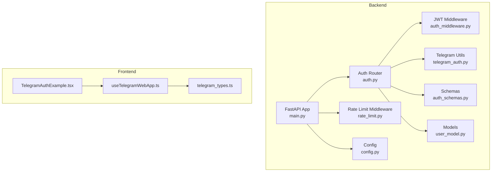

**Diagram sources**
- [main.py:56-107](file://backend/app/main.py#L56-L107)
- [auth.py:36-345](file://backend/app/api/auth.py#L36-L345)
- [auth_middleware.py:17-251](file://backend/app/middleware/auth.py#L17-L251)
- [telegram_auth.py:14-225](file://backend/app/utils/telegram_auth.py#L14-L225)
- [auth_schemas.py:10-90](file://backend/app/schemas/auth.py#L10-L90)
- [rate_limit.py:37-262](file://backend/app/middleware/rate_limit.py#L37-L262)
- [config.py:15-55](file://backend/app/utils/config.py#L15-L55)
- [user_model.py:23-132](file://backend/app/models/user.py#L23-L132)
- [TelegramAuthExample.tsx:17-446](file://frontend/src/components/auth/TelegramAuthExample.tsx#L17-L446)
- [useTelegramWebApp.ts:120-509](file://frontend/src/hooks/useTelegramWebApp.ts#L120-L509)
- [telegram_types.ts:10-390](file://frontend/src/types/telegram.ts#L10-L390)

**Section sources**
- [main.py:56-107](file://backend/app/main.py#L56-L107)
- [auth.py:36-345](file://backend/app/api/auth.py#L36-L345)

## Core Components
- Telegram WebApp OAuth endpoints:
  - POST /api/v1/auth/telegram: Validates initData, extracts user info, creates/updates user, and returns JWT access token.
  - GET /api/v1/auth/me: Retrieves current authenticated user profile (requires Bearer token).
  - PUT /api/v1/auth/me: Updates current user profile (requires Bearer token).
  - POST /api/v1/auth/refresh: Refreshes access token using a refresh token.
  - POST /api/v1/auth/logout: Logs out the current user.
- JWT middleware:
  - Creates access tokens (short-lived) and refresh tokens (longer-lived).
  - Verifies tokens and extracts user identity for protected endpoints.
  - Provides dependencies to inject current user into route handlers.
- Telegram validation utilities:
  - Parses initData, validates HMAC signature, checks timestamp freshness.
  - Extracts user data from initData for user creation/update.
- Rate limiting middleware:
  - Applies endpoint-specific limits for auth endpoints and others.
  - Uses Redis for distributed tracking with in-memory fallback.
- Configuration:
  - Defines SECRET_KEY, ALGORITHM, ACCESS_TOKEN_EXPIRE_MINUTES, TELEGRAM_BOT_TOKEN, and other security-related settings.

**Section sources**
- [auth.py:95-345](file://backend/app/api/auth.py#L95-L345)
- [auth_middleware.py:21-251](file://backend/app/middleware/auth.py#L21-L251)
- [telegram_auth.py:14-225](file://backend/app/utils/telegram_auth.py#L14-L225)
- [rate_limit.py:17-262](file://backend/app/middleware/rate_limit.py#L17-L262)
- [config.py:15-55](file://backend/app/utils/config.py#L15-L55)

## Architecture Overview
The authentication flow integrates Telegram WebApp initData validation with JWT token issuance and refresh. Protected endpoints require a Bearer token. Rate limiting is enforced globally via middleware.

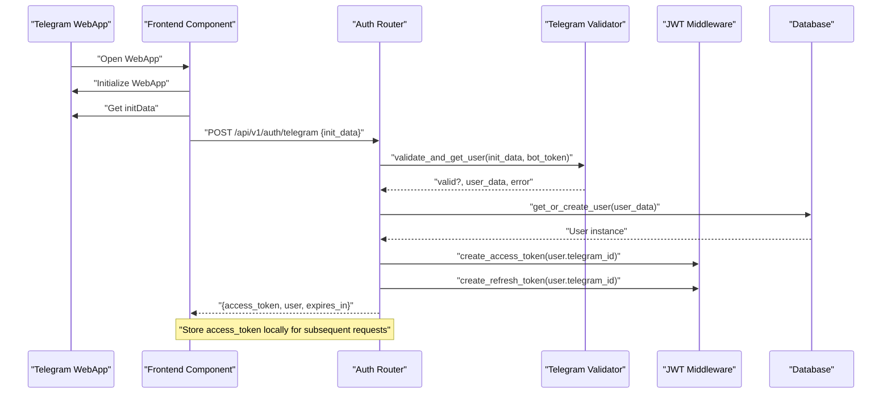

**Diagram sources**
- [auth.py:95-175](file://backend/app/api/auth.py#L95-L175)
- [telegram_auth.py:172-204](file://backend/app/utils/telegram_auth.py#L172-L204)
- [auth_middleware.py:21-76](file://backend/app/middleware/auth.py#L21-L76)
- [user_model.py:30-81](file://backend/app/models/user.py#L30-L81)

## Detailed Component Analysis

### Telegram WebApp OAuth Endpoints
- POST /api/v1/auth/telegram
  - Purpose: Authenticate via Telegram initData and issue JWT access token.
  - Request: { init_data: string }
  - Response: { success: boolean, message: string, user: TelegramUserData, access_token: string, token_type: string, expires_in: number }
  - Validation: initData signature verified against bot token; timestamp checked within allowed age.
  - Behavior: Creates or updates user record; returns access and refresh tokens.
- GET /api/v1/auth/me
  - Purpose: Retrieve current user profile.
  - Headers: Authorization: Bearer <access_token>
  - Response: UserProfileResponse with user data and metadata.
- PUT /api/v1/auth/me
  - Purpose: Update user profile (first_name, profile, settings).
  - Headers: Authorization: Bearer <access_token>
  - Request: Partial updates conforming to UserProfileUpdate.
  - Response: Updated UserProfileResponse.
- POST /api/v1/auth/refresh
  - Purpose: Renew access token using a valid refresh token.
  - Request: { refresh_token: string }
  - Response: { access_token: string, refresh_token: string, token_type: string, expires_in: number }
  - Validation: Verifies refresh token type and expiration.
- POST /api/v1/auth/logout
  - Purpose: Logout current user.
  - Headers: Authorization: Bearer <access_token>
  - Response: { message: string }

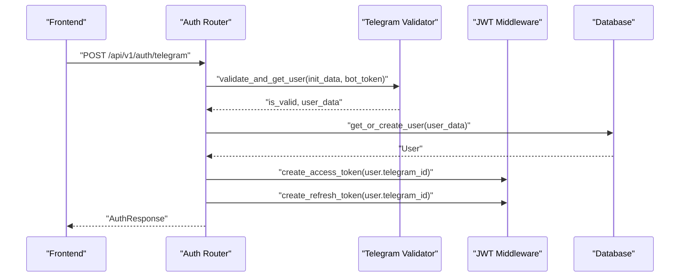

**Diagram sources**
- [auth.py:95-175](file://backend/app/api/auth.py#L95-L175)
- [telegram_auth.py:172-204](file://backend/app/utils/telegram_auth.py#L172-L204)
- [auth_middleware.py:21-76](file://backend/app/middleware/auth.py#L21-L76)

**Section sources**
- [auth.py:95-345](file://backend/app/api/auth.py#L95-L345)
- [auth_schemas.py:10-90](file://backend/app/schemas/auth.py#L10-L90)

### JWT Token Generation and Verification
- Access tokens:
  - Short-lived (default 30 minutes).
  - Encoded payload includes subject (user telegram_id), issued-at, expiration, and type "access".
- Refresh tokens:
  - Longer-lived (7 days).
  - Encoded payload includes subject, issued-at, expiration, and type "refresh".
- Token verification:
  - Decodes JWT using SECRET_KEY and ALGORITHM.
  - Ensures token type matches expected type ("access" or "refresh").
  - Rejects malformed or expired tokens.

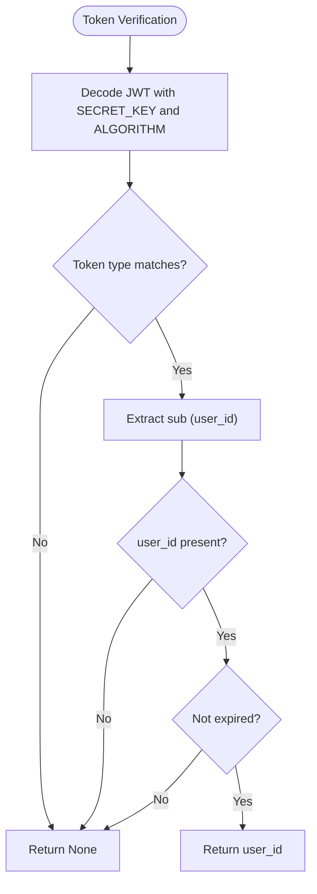

**Diagram sources**
- [auth_middleware.py:79-108](file://backend/app/middleware/auth.py#L79-L108)
- [config.py:33-35](file://backend/app/utils/config.py#L33-L35)

**Section sources**
- [auth_middleware.py:21-108](file://backend/app/middleware/auth.py#L21-L108)
- [config.py:33-35](file://backend/app/utils/config.py#L33-L35)

### Telegram initData Validation
- Parsing:
  - Converts raw initData query string into key-value pairs.
  - Extracts nested user JSON object.
- Signature validation:
  - Computes HMAC-SHA256 using "WebAppData" as key and bot token as message.
  - Compares calculated hash with provided hash using constant-time comparison.
- Timestamp validation:
  - Checks auth_date freshness against current UTC time.
  - Enforces maximum age (default 300 seconds).
- Extraction:
  - Returns user data dictionary suitable for user creation/update.

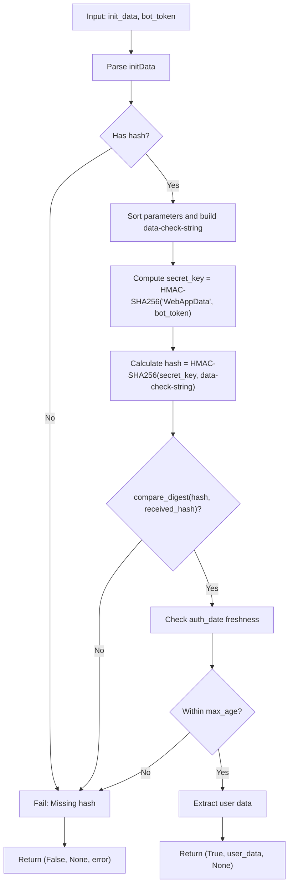

**Diagram sources**
- [telegram_auth.py:54-155](file://backend/app/utils/telegram_auth.py#L54-L155)

**Section sources**
- [telegram_auth.py:14-204](file://backend/app/utils/telegram_auth.py#L14-L204)

### Rate Limiting for Authentication Attempts
- Global middleware applies endpoint-specific limits:
  - /api/v1/auth/telegram: 5 per minute
  - /api/v1/auth/refresh: 10 per minute
  - /api/v1/auth/logout: 10 per minute
- Redis-backed tracking with in-memory fallback when Redis is unavailable.
- Responses include X-RateLimit-* headers and Retry-After on 429.

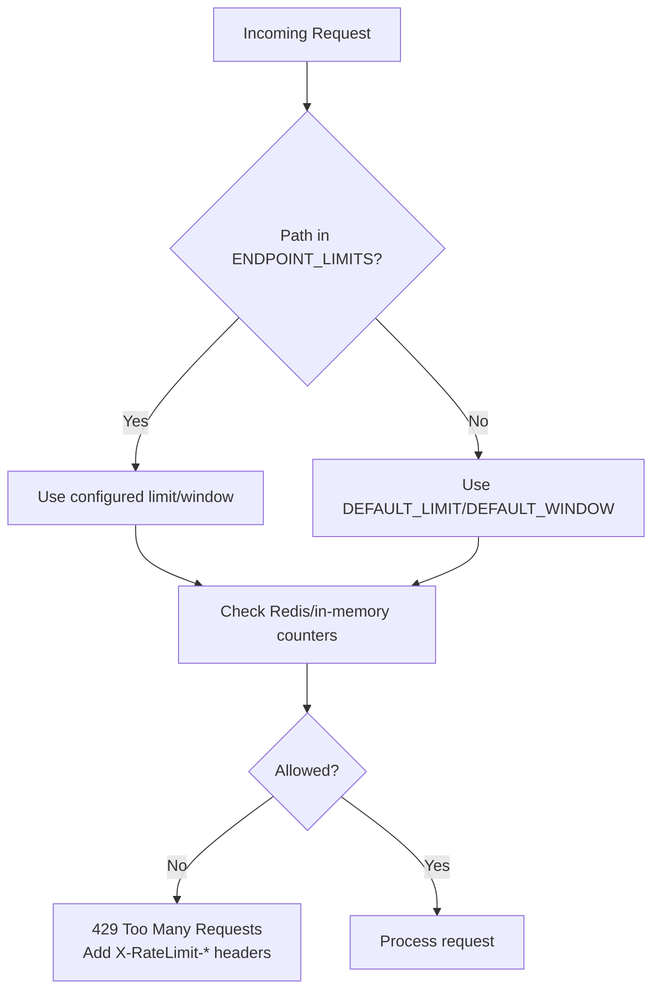

**Diagram sources**
- [rate_limit.py:17-210](file://backend/app/middleware/rate_limit.py#L17-L210)

**Section sources**
- [rate_limit.py:17-210](file://backend/app/middleware/rate_limit.py#L17-L210)

### Protected Endpoints and Middleware Integration
- Protected endpoints require Authorization: Bearer <access_token>.
- get_current_user_id verifies token scheme and decodes payload.
- get_current_user resolves the authenticated user from database.
- get_current_active_user and require_admin provide additional protections.

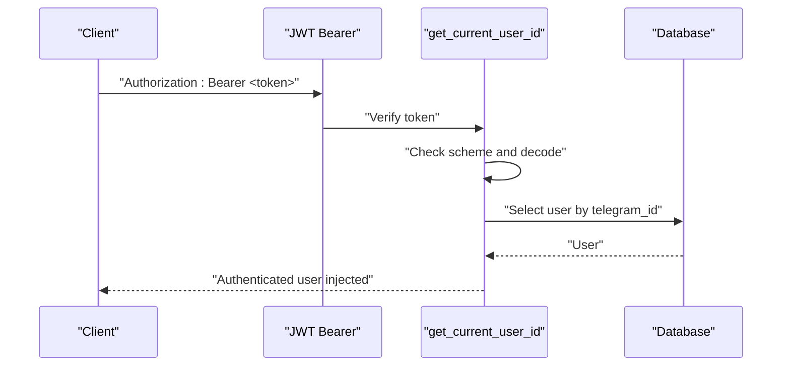

**Diagram sources**
- [auth_middleware.py:133-202](file://backend/app/middleware/auth.py#L133-L202)

**Section sources**
- [auth_middleware.py:133-202](file://backend/app/middleware/auth.py#L133-L202)

### Token Refresh Mechanism
- Validates refresh token type and expiration.
- Issues new access and refresh tokens for the same user.
- Returns token_type and expires_in for client-side token management.

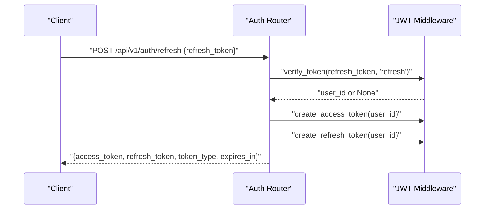

**Diagram sources**
- [auth.py:274-317](file://backend/app/api/auth.py#L274-L317)
- [auth_middleware.py:79-76](file://backend/app/middleware/auth.py#L79-L76)

**Section sources**
- [auth.py:274-317](file://backend/app/api/auth.py#L274-L317)
- [auth_middleware.py:79-76](file://backend/app/middleware/auth.py#L79-L76)

### Logout Functionality
- Currently returns success without invalidating tokens.
- Future enhancement: integrate Redis blacklist to immediately invalidate tokens.

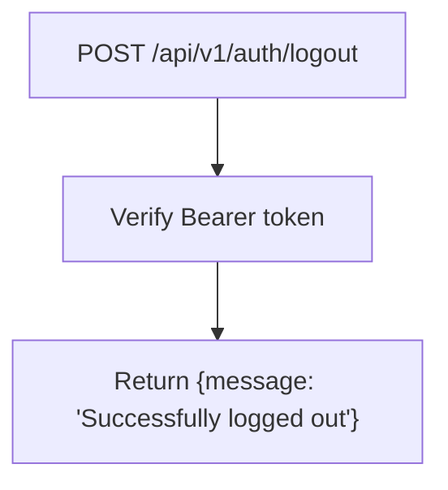

**Diagram sources**
- [auth.py:320-345](file://backend/app/api/auth.py#L320-L345)

**Section sources**
- [auth.py:320-345](file://backend/app/api/auth.py#L320-L345)

### Request/Response Schemas
- TelegramAuthRequest: { init_data: string }
- TelegramUserData: { id, username, first_name, last_name, language_code, is_premium, photo_url, allows_write_to_pm }
- AuthResponse: { success, message, user, access_token, token_type, expires_in }
- UserProfileUpdate: { first_name, last_name, profile, settings }
- UserProfileResponse: { id, telegram_id, username, first_name, profile, settings, created_at, updated_at }
- RefreshTokenRequest: { refresh_token: string }
- LogoutResponse: { message: string }

**Section sources**
- [auth_schemas.py:10-90](file://backend/app/schemas/auth.py#L10-L90)

### Practical Authentication Flow Example
- Frontend initializes Telegram WebApp and retrieves initData.
- Frontend sends POST /api/v1/auth/telegram with { init_data }.
- Backend validates initData, creates/updates user, issues tokens.
- Frontend stores access_token and uses it for protected requests.

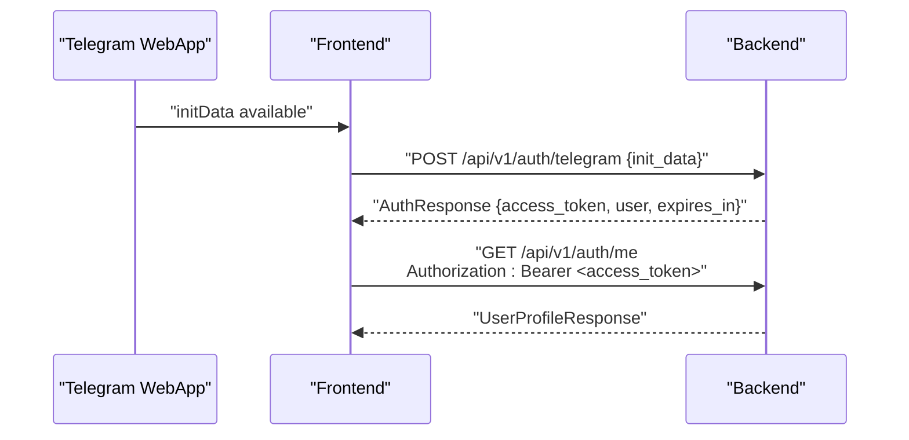

**Diagram sources**
- [TelegramAuthExample.tsx:62-122](file://frontend/src/components/auth/TelegramAuthExample.tsx#L62-L122)
- [auth.py:95-175](file://backend/app/api/auth.py#L95-L175)

**Section sources**
- [TelegramAuthExample.tsx:62-122](file://frontend/src/components/auth/TelegramAuthExample.tsx#L62-L122)
- [auth.py:95-175](file://backend/app/api/auth.py#L95-L175)

## Dependency Analysis
- Router-to-middleware:
  - Auth router depends on JWT middleware for token creation and verification.
  - Auth router depends on Telegram utilities for initData validation.
- Middleware-to-config:
  - JWT middleware and Telegram utilities depend on configuration for SECRET_KEY, ALGORITHM, ACCESS_TOKEN_EXPIRE_MINUTES, and TELEGRAM_BOT_TOKEN.
- Router-to-models:
  - Auth router uses User model for database operations.
- Frontend-to-backend:
  - Frontend components call backend auth endpoints and store tokens.

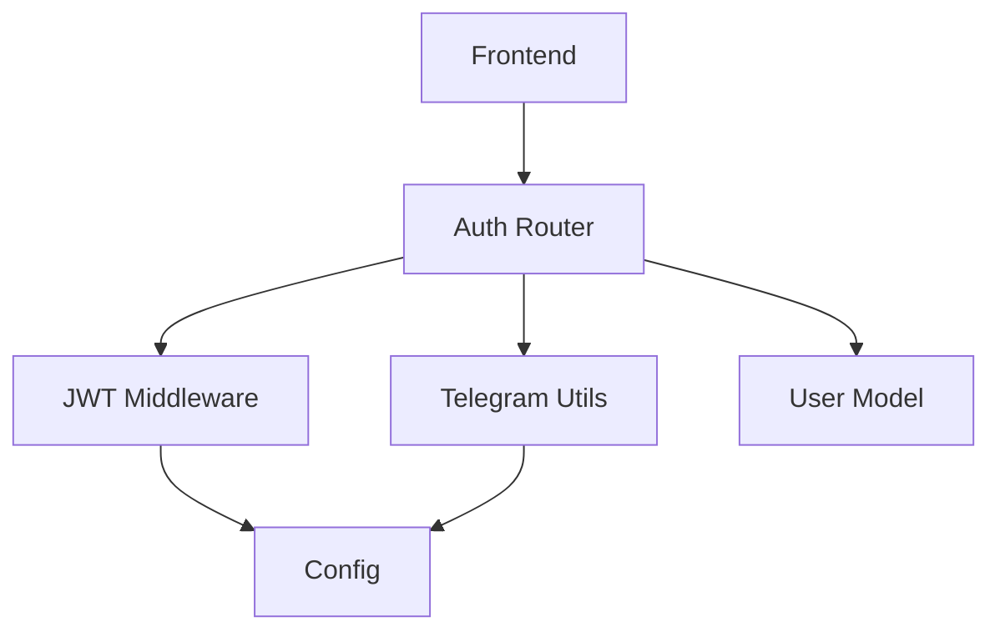

**Diagram sources**
- [auth.py:19-34](file://backend/app/api/auth.py#L19-L34)
- [auth_middleware.py:14-15](file://backend/app/middleware/auth.py#L14-L15)
- [telegram_auth.py:11-11](file://backend/app/utils/telegram_auth.py#L11-L11)
- [config.py:15-55](file://backend/app/utils/config.py#L15-L55)
- [user_model.py:23-132](file://backend/app/models/user.py#L23-L132)
- [TelegramAuthExample.tsx:82-98](file://frontend/src/components/auth/TelegramAuthExample.tsx#L82-L98)

**Section sources**
- [auth.py:19-34](file://backend/app/api/auth.py#L19-L34)
- [auth_middleware.py:14-15](file://backend/app/middleware/auth.py#L14-L15)
- [telegram_auth.py:11-11](file://backend/app/utils/telegram_auth.py#L11-L11)
- [config.py:15-55](file://backend/app/utils/config.py#L15-L55)
- [user_model.py:23-132](file://backend/app/models/user.py#L23-L132)
- [TelegramAuthExample.tsx:82-98](file://frontend/src/components/auth/TelegramAuthExample.tsx#L82-L98)

## Performance Considerations
- Token lifetime:
  - Access tokens are short-lived to minimize exposure; refresh tokens are long-lived but should be securely stored.
- Rate limiting:
  - Auth endpoints have conservative limits to prevent abuse; adjust ENDPOINT_LIMITS as needed.
- Redis fallback:
  - In-memory storage is used when Redis is unavailable; consider deploying Redis for production reliability.
- Database queries:
  - User lookup by telegram_id uses indexed column; ensure proper indexing for performance.

[No sources needed since this section provides general guidance]

## Troubleshooting Guide
- Authentication failures:
  - Missing or invalid hash in initData.
  - Expired or future auth_date.
  - Mismatched bot token or altered initData.
- Token errors:
  - Invalid or expired Bearer token.
  - Wrong token type used for protected endpoint.
- Rate limiting:
  - 429 responses with X-RateLimit-* headers indicate hitting endpoint limits.
- Logout:
  - Immediate token invalidation requires Redis blacklist implementation.

**Section sources**
- [telegram_auth.py:108-155](file://backend/app/utils/telegram_auth.py#L108-L155)
- [auth_middleware.py:148-169](file://backend/app/middleware/auth.py#L148-L169)
- [rate_limit.py:159-169](file://backend/app/middleware/rate_limit.py#L159-L169)
- [auth.py:320-345](file://backend/app/api/auth.py#L320-L345)

## Conclusion
The authentication system provides a secure and efficient Telegram WebApp OAuth flow with robust initData validation, JWT token issuance and refresh, and rate limiting. Protected endpoints enforce Bearer token authentication, while logout remains a candidate for token blacklisting. The frontend components demonstrate practical integration patterns for token storage and protected requests.

[No sources needed since this section summarizes without analyzing specific files]

## Appendices

### API Definitions

- POST /api/v1/auth/telegram
  - Request: { init_data: string }
  - Response: { success: boolean, message: string, user: TelegramUserData, access_token: string, token_type: string, expires_in: number }
  - Errors: 401 Unauthorized (invalid initData), 422 Validation error (missing fields), 500 Internal Server Error
- GET /api/v1/auth/me
  - Headers: Authorization: Bearer <access_token>
  - Response: UserProfileResponse
  - Errors: 401 Unauthorized (missing/invalid/expired token)
- PUT /api/v1/auth/me
  - Headers: Authorization: Bearer <access_token>
  - Request: UserProfileUpdate
  - Response: UserProfileResponse
  - Errors: 401 Unauthorized (missing/invalid/expired token)
- POST /api/v1/auth/refresh
  - Request: { refresh_token: string }
  - Response: { access_token: string, refresh_token: string, token_type: string, expires_in: number }
  - Errors: 401 Unauthorized (invalid or expired refresh token)
- POST /api/v1/auth/logout
  - Headers: Authorization: Bearer <access_token>
  - Response: { message: string }
  - Errors: 401 Unauthorized (missing/invalid/expired token)

**Section sources**
- [auth.py:95-345](file://backend/app/api/auth.py#L95-L345)
- [auth_schemas.py:10-90](file://backend/app/schemas/auth.py#L10-L90)

### Security Best Practices
- Store access tokens securely (e.g., HttpOnly cookies or secure storage) and avoid exposing them in logs.
- Use HTTPS in production to protect tokens in transit.
- Implement token blacklisting with Redis for immediate logout and compromised token handling.
- Regularly rotate SECRET_KEY and ensure ALGORITHM consistency.
- Monitor rate limit headers and adjust limits based on traffic patterns.

[No sources needed since this section provides general guidance]