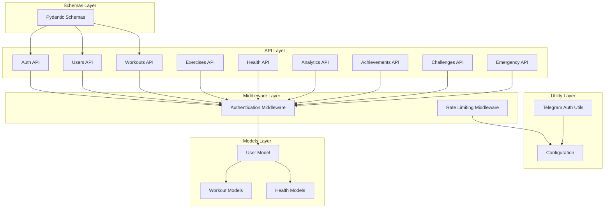
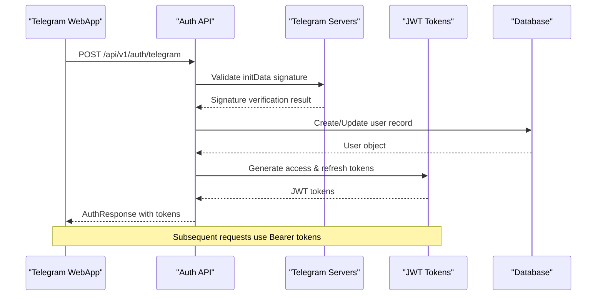
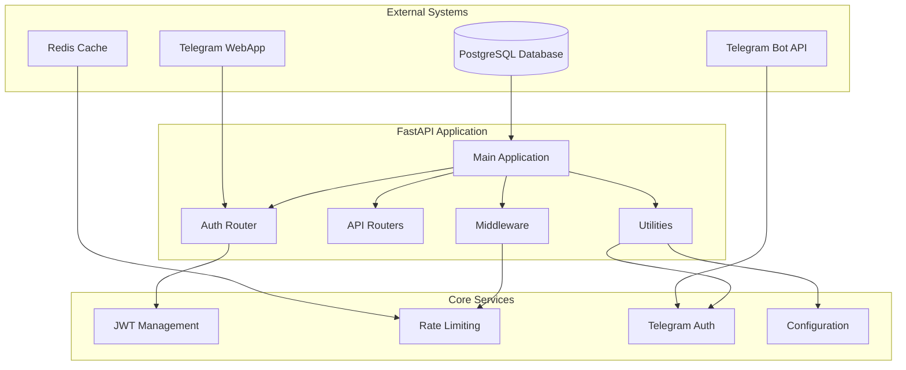
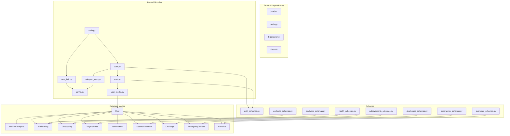

# Backend API Documentation

<cite>
**Referenced Files in This Document**
- [main.py](file://backend/app/main.py)
- [auth.py](file://backend/app/api/auth.py)
- [auth.py](file://backend/app/middleware/auth.py)
- [telegram_auth.py](file://backend/app/utils/telegram_auth.py)
- [auth_schemas.py](file://backend/app/schemas/auth.py)
- [users.py](file://backend/app/api/users.py)
- [workouts.py](file://backend/app/api/workouts.py)
- [exercises.py](file://backend/app/api/exercises.py)
- [health.py](file://backend/app/api/health.py)
- [analytics.py](file://backend/app/api/analytics.py)
- [achievements.py](file://backend/app/api/achievements.py)
- [challenges.py](file://backend/app/api/challenges.py)
- [emergency.py](file://backend/app/api/emergency.py)
- [rate_limit.py](file://backend/app/middleware/rate_limit.py)
- [config.py](file://backend/app/utils/config.py)
- [user_model.py](file://backend/app/models/user.py)
</cite>

## Table of Contents
1. [Introduction](#introduction)
2. [Project Structure](#project-structure)
3. [Core Components](#core-components)
4. [Architecture Overview](#architecture-overview)
5. [Detailed Component Analysis](#detailed-component-analysis)
6. [Dependency Analysis](#dependency-analysis)
7. [Performance Considerations](#performance-considerations)
8. [Troubleshooting Guide](#troubleshooting-guide)
9. [Conclusion](#conclusion)

## Introduction
FitTracker Pro is a Telegram Mini App backend built with FastAPI that provides comprehensive fitness tracking capabilities. The system enables users to authenticate via Telegram WebApp, manage workouts, track health metrics, monitor analytics, earn achievements, participate in challenges, and utilize emergency safety features. The backend follows RESTful principles with structured endpoints organized by functional domains.

## Project Structure
The backend follows a modular FastAPI architecture with clear separation of concerns:



**Diagram sources**
- [main.py:90-106](file://backend/app/main.py#L90-L106)
- [auth.py:36](file://backend/app/api/auth.py#L36)
- [auth.py:21](file://backend/app/middleware/auth.py#L21)

**Section sources**
- [main.py:13-26](file://backend/app/main.py#L13-L26)
- [main.py:89-106](file://backend/app/main.py#L89-L106)

## Core Components

### Authentication System
The authentication system combines Telegram WebApp authentication with JWT token management:



**Diagram sources**
- [auth.py:95-175](file://backend/app/api/auth.py#L95-L175)
- [telegram_auth.py:172-204](file://backend/app/utils/telegram_auth.py#L172-L204)

### Rate Limiting System
The system implements distributed rate limiting using Redis with configurable limits per endpoint:

```mermaid
flowchart TD
A[Incoming Request] --> B{Check Redis Availability}
B --> |Redis Available| C[Use Redis Storage]
B --> |Redis Unavailable| D[Use Memory Storage]
C --> E[Generate Key: ratelimit:{identifier}:{path}]
D --> E
E --> F[Clean Old Entries]
F --> G[Count Current Requests]
G --> H{Within Limit?}
H --> |Yes| I[Allow Request]
H --> |No| J[Raise 429 Too Many Requests]
I --> K[Increment Counter]
K --> L[Set Expiry]
L --> M[Process Request]
M --> N[Add Rate Limit Headers]
N --> O[Return Response]
J --> P[Add Rate Limit Headers]
P --> Q[Return Error Response]
```

**Diagram sources**
- [rate_limit.py:37-179](file://backend/app/middleware/rate_limit.py#L37-L179)

**Section sources**
- [auth.py:95-175](file://backend/app/api/auth.py#L95-L175)
- [auth.py:21-76](file://backend/app/middleware/auth.py#L21-L76)
- [rate_limit.py:17-34](file://backend/app/middleware/rate_limit.py#L17-L34)

## Architecture Overview



**Diagram sources**
- [main.py:56-75](file://backend/app/main.py#L56-L75)
- [rate_limit.py:48-59](file://backend/app/middleware/rate_limit.py#L48-L59)
- [config.py:15-54](file://backend/app/utils/config.py#L15-L54)

## Detailed Component Analysis

### Authentication Endpoints

#### Telegram Authentication
**Endpoint:** `POST /api/v1/auth/telegram`
**Authentication:** None (required for initial auth)
**Purpose:** Validates Telegram initData and authenticates users

**Request Schema:**
- `init_data` (string, required): Raw initData string from Telegram WebApp

**Response Schema:**
- `success` (boolean): Authentication result
- `message` (string): Status message
- `user` (object): Telegram user data
- `access_token` (string): JWT access token
- `token_type` (string): Token type (bearer)
- `expires_in` (integer): Token expiration in seconds

**Validation Rules:**
- initData must be signed by Telegram servers
- Timestamp must be within 5 minutes
- User data must be extractable from initData

**Section sources**
- [auth.py:95-175](file://backend/app/api/auth.py#L95-L175)
- [auth_schemas.py:10-44](file://backend/app/schemas/auth.py#L10-L44)
- [telegram_auth.py:108-156](file://backend/app/utils/telegram_auth.py#L108-L156)

#### User Profile Management
**Endpoint:** `GET /api/v1/auth/me`
**Authentication:** JWT Bearer required
**Purpose:** Retrieve current user's profile

**Response Schema:**
- `id` (integer): Internal user ID
- `telegram_id` (integer): Telegram user ID
- `username` (string): Telegram username
- `first_name` (string): First name
- `profile` (object): User profile data
- `settings` (object): User settings
- `created_at` (datetime): Account creation timestamp
- `updated_at` (datetime): Last update timestamp

**Section sources**
- [auth.py:186-222](file://backend/app/api/auth.py#L186-L222)
- [auth_schemas.py:60-72](file://backend/app/schemas/auth.py#L60-L72)

#### Token Refresh
**Endpoint:** `POST /api/v1/auth/refresh`
**Authentication:** None
**Purpose:** Refresh access token using refresh token

**Request Schema:**
- `refresh_token` (string, required): JWT refresh token

**Response Schema:**
- `access_token` (string): New access token
- `refresh_token` (string): New refresh token
- `token_type` (string): Token type
- `expires_in` (integer): Token expiration in seconds

**Section sources**
- [auth.py:274-317](file://backend/app/api/auth.py#L274-L317)
- [auth_schemas.py:82-84](file://backend/app/schemas/auth.py#L82-L84)

### User Management Endpoints

#### User Creation
**Endpoint:** `POST /api/v1/users/`
**Authentication:** JWT Bearer required
**Purpose:** Create or update user from Telegram data

**Request Schema:**
- `telegram_id` (integer, required): Telegram user ID
- `username` (string): Telegram username
- `first_name` (string): First name
- `last_name` (string): Last name

**Response Schema:**
Same as user profile response

**Section sources**
- [users.py:32-44](file://backend/app/api/users.py#L32-L44)
- [users.py:12-26](file://backend/app/api/users.py#L12-L26)

### Workout Tracking Endpoints

#### Workout Templates
**Endpoint:** `GET /api/v1/workouts/templates`
**Authentication:** JWT Bearer required
**Purpose:** Get user's workout templates with filtering and pagination

**Query Parameters:**
- `page` (integer, default: 1): Page number
- `page_size` (integer, default: 20, max: 100): Items per page
- `template_type` (string): Filter by type (cardio, strength, flexibility, mixed)

**Response Schema:**
- `items` (array): Workout templates
- `total` (integer): Total count
- `page` (integer): Current page
- `page_size` (integer): Items per page

**Section sources**
- [workouts.py:29-105](file://backend/app/api/workouts.py#L29-L105)

#### Workout History
**Endpoint:** `GET /api/v1/workouts/history`
**Authentication:** JWT Bearer required
**Purpose:** Get workout history with date filtering

**Query Parameters:**
- `page` (integer, default: 1): Page number
- `page_size` (integer, default: 20, max: 100): Items per page
- `date_from` (date): Filter from date (YYYY-MM-DD)
- `date_to` (date): Filter to date (YYYY-MM-DD)

**Response Schema:**
- `items` (array): Workout history items
- `total` (integer): Total count
- `page` (integer): Current page
- `page_size` (integer): Items per page
- `date_from` (date): Applied filter
- `date_to` (date): Applied filter

**Section sources**
- [workouts.py:260-334](file://backend/app/api/workouts.py#L260-L334)

#### Start Workout Session
**Endpoint:** `POST /api/v1/workouts/start`
**Authentication:** JWT Bearer required
**Purpose:** Start a new workout session

**Request Schema:**
- `template_id` (integer): Template to use
- `name` (string): Workout name
- `type` (string): Workout type

**Response Schema:**
- `id` (integer): Workout log ID
- `user_id` (integer): User ID
- `template_id` (integer): Template ID
- `date` (date): Workout date
- `start_time` (datetime): Start timestamp
- `status` (string): Session status (in_progress)
- `message` (string): Status message

**Section sources**
- [workouts.py:337-412](file://backend/app/api/workouts.py#L337-L412)

#### Complete Workout Session
**Endpoint:** `POST /api/v1/workouts/complete`
**Authentication:** JWT Bearer required
**Purpose:** Complete a workout session

**Request Schema:**
- `duration` (integer): Workout duration in minutes
- `exercises` (array): Exercise completion data
- `comments` (string): Workout notes
- `tags` (array): Tags for categorization
- `glucose_before` (number): Blood glucose before workout
- `glucose_after` (number): Blood glucose after workout

**Response Schema:**
- All workout log fields plus completion data

**Section sources**
- [workouts.py:415-493](file://backend/app/api/workouts.py#L415-L493)

### Health Monitoring Endpoints

#### Glucose Tracking
**Endpoint:** `POST /api/v1/health/glucose`
**Authentication:** JWT Bearer required
**Purpose:** Record a new glucose measurement

**Request Schema:**
- `value` (number, required): Glucose value
- `measurement_type` (string, required): Measurement timing
- `timestamp` (datetime): Measurement timestamp
- `notes` (string): Additional notes
- `workout_id` (integer): Associated workout

**Response Schema:**
- `id` (integer): Glucose log ID
- `user_id` (integer): User ID
- `workout_id` (integer): Associated workout
- `value` (number): Glucose value
- `measurement_type` (string): Measurement timing
- `timestamp` (datetime): Measurement timestamp
- `notes` (string): Notes

**Section sources**
- [health.py:29-91](file://backend/app/api/health.py#L29-L91)

#### Wellness Tracking
**Endpoint:** `POST /api/v1/health/wellness`
**Authentication:** JWT Bearer required
**Purpose:** Create or update daily wellness entry

**Request Schema:**
- `date` (date, required): Entry date
- `sleep_score` (integer): Sleep quality score
- `sleep_hours` (number): Hours slept
- `energy_score` (integer): Energy level
- `pain_zones` (object): Pain location scores
- `stress_level` (integer): Stress level
- `mood_score` (integer): Mood score
- `notes` (string): Additional notes

**Response Schema:**
- All wellness entry fields

**Section sources**
- [health.py:259-336](file://backend/app/api/health.py#L259-L336)

#### Health Statistics
**Endpoint:** `GET /api/v1/health/stats`
**Authentication:** JWT Bearer required
**Purpose:** Get health statistics summary

**Query Parameters:**
- `period` (string, default: "30d"): Time period (7d, 30d, 90d, 1y)

**Response Schema:**
- `period` (string): Applied period
- `glucose` (object): Glucose statistics
- `workouts` (object): Workout statistics
- `wellness` (object): Wellness statistics
- `generated_at` (datetime): Report generation timestamp

**Section sources**
- [health.py:409-614](file://backend/app/api/health.py#L409-L614)

### Analytics Endpoints

#### Exercise Progress
**Endpoint:** `GET /api/v1/analytics/progress`
**Authentication:** JWT Bearer required
**Purpose:** Get exercise progress analytics

**Query Parameters:**
- `exercise_id` (integer): Specific exercise ID
- `period` (string, default: "30d"): Time period

**Response Schema:**
Array of exercise progress data with:
- `exercise_id` (integer): Exercise ID
- `exercise_name` (string): Exercise name
- `period` (string): Applied period
- `data_points` (array): Chart data points
- `summary` (object): Progress summary
- `best_performance` (object): Best performance record

**Section sources**
- [analytics.py:27-197](file://backend/app/api/analytics.py#L27-L197)

#### Workout Calendar
**Endpoint:** `GET /api/v1/analytics/calendar`
**Authentication:** JWT Bearer required
**Purpose:** Get workout calendar for a specific month

**Query Parameters:**
- `year` (integer, default: current year): Year
- `month` (integer, default: current month): Month

**Response Schema:**
- `year` (integer): Year
- `month` (integer): Month
- `days` (array): Calendar day entries
- `summary` (object): Monthly summary

**Section sources**
- [analytics.py:200-307](file://backend/app/api/analytics.py#L200-L307)

#### Data Export
**Endpoint:** `POST /api/v1/analytics/export`
**Authentication:** JWT Bearer required
**Purpose:** Request data export

**Request Schema:**
- `format` (string, required): Export format
- `date_from` (date, required): Start date
- `date_to` (date, required): End date
- `include_workouts` (boolean): Include workout data
- `include_glucose` (boolean): Include glucose data
- `include_wellness` (boolean): Include wellness data
- `include_achievements` (boolean): Include achievements data

**Response Schema:**
- `export_id` (string): Export job ID
- `status` (string): Export status
- `format` (string): Export format
- `download_url` (string): Download URL
- `expires_at` (datetime): Expiration timestamp
- `requested_at` (datetime): Request timestamp
- `file_size` (integer): File size

**Section sources**
- [analytics.py:310-365](file://backend/app/api/analytics.py#L310-L365)

### Achievements Endpoints

#### Achievement Catalog
**Endpoint:** `GET /api/v1/achievements/`
**Authentication:** JWT Bearer required
**Purpose:** Get list of all available achievements

**Query Parameters:**
- `category` (string): Filter by category

**Response Schema:**
- `items` (array): Achievement objects
- `total` (integer): Total count
- `categories` (array): Available categories

**Section sources**
- [achievements.py:25-88](file://backend/app/api/achievements.py#L25-L88)

#### User Achievements
**Endpoint:** `GET /api/v1/achievements/user`
**Authentication:** JWT Bearer required
**Purpose:** Get current user's achievements

**Response Schema:**
- `items` (array): User achievement objects
- `total` (integer): Total count
- `total_points` (integer): Total points earned
- `completed_count` (integer): Completed achievements
- `in_progress_count` (integer): In-progress achievements
- `recent_achievements` (array): Recently earned achievements

**Section sources**
- [achievements.py:91-171](file://backend/app/api/achievements.py#L91-L171)

#### Claim Achievement
**Endpoint:** `POST /api/v1/achievements/{achievement_id}/claim`
**Authentication:** JWT Bearer required
**Purpose:** Claim an achievement if criteria are met

**Response Schema:**
- `unlocked` (boolean): Whether achievement was unlocked
- `achievement` (object): Achievement details
- `points_earned` (integer): Points earned
- `new_total_points` (integer): Total points after unlock
- `message` (string): Status message

**Section sources**
- [achievements.py:216-309](file://backend/app/api/achievements.py#L216-L309)

### Challenges Endpoints

#### Challenge Catalog
**Endpoint:** `GET /api/v1/challenges/`
**Authentication:** JWT Bearer required
**Purpose:** Get list of challenges with filtering

**Query Parameters:**
- `status` (string): Filter by status
- `challenge_type` (string): Filter by type
- `is_public` (boolean): Filter by visibility
- `page` (integer, default: 1): Page number
- `page_size` (integer, default: 20, max: 100): Items per page

**Response Schema:**
- `items` (array): Challenge objects
- `total` (integer): Total count
- `page` (integer): Current page
- `page_size` (integer): Items per page
- `filters` (object): Applied filters

**Section sources**
- [challenges.py:32-158](file://backend/app/api/challenges.py#L32-L158)

#### Create Challenge
**Endpoint:** `POST /api/v1/challenges/`
**Authentication:** JWT Bearer required
**Purpose:** Create new challenge

**Request Schema:**
- `name` (string, required): Challenge name
- `description` (string, required): Challenge description
- `type` (string, required): Challenge type
- `goal` (object, required): Goal specification
- `start_date` (date, required): Start date
- `end_date` (date, required): End date
- `is_public` (boolean): Public visibility
- `max_participants` (integer): Maximum participants
- `rules` (object): Challenge rules
- `banner_url` (string): Banner image URL

**Response Schema:**
- All challenge fields including status and metadata

**Section sources**
- [challenges.py:215-314](file://backend/app/api/challenges.py#L215-L314)

### Emergency Endpoints

#### Emergency Contacts
**Endpoint:** `GET /api/v1/emergency/contact`
**Authentication:** JWT Bearer required
**Purpose:** Get user's emergency contacts

**Response Schema:**
- `items` (array): Emergency contact objects
- `total` (integer): Total count
- `active_count` (integer): Active contacts count

**Section sources**
- [emergency.py:27-78](file://backend/app/api/emergency.py#L27-L78)

#### Send Emergency Notification
**Endpoint:** `POST /api/v1/emergency/notify`
**Authentication:** JWT Bearer required
**Purpose:** Send emergency notification to all active contacts

**Request Schema:**
- `message` (string): Emergency message
- `location` (string): Location details
- `workout_id` (integer): Associated workout
- `severity` (string): Alert severity level

**Response Schema:**
- `notified_at` (datetime): Notification timestamp
- `severity` (string): Alert severity
- `message_sent` (string): Sent message content
- `results` (array): Notification results
- `successful_count` (integer): Successful notifications
- `failed_count` (integer): Failed notifications

**Section sources**
- [emergency.py:249-359](file://backend/app/api/emergency.py#L249-L359)

## Dependency Analysis



**Diagram sources**
- [main.py:13-26](file://backend/app/main.py#L13-L26)
- [auth.py:34-36](file://backend/app/api/auth.py#L34-L36)
- [auth.py:19-24](file://backend/app/middleware/auth.py#L19-L24)
- [telegram_auth.py:11-12](file://backend/app/utils/telegram_auth.py#L11-L12)
- [rate_limit.py:14-15](file://backend/app/middleware/rate_limit.py#L14-L15)
- [config.py:15-54](file://backend/app/utils/config.py#L15-L54)
- [user_model.py:23-132](file://backend/app/models/user.py#L23-L132)

**Section sources**
- [main.py:13-26](file://backend/app/main.py#L13-L26)
- [auth.py:34-36](file://backend/app/api/auth.py#L34-L36)
- [auth.py:19-24](file://backend/app/middleware/auth.py#L19-L24)

## Performance Considerations

### Rate Limiting Configuration
The system implements tiered rate limiting with Redis-backed counters:

| Endpoint Pattern | Requests | Window (seconds) |
|-----------------|----------|------------------|
| `/api/v1/auth/telegram` | 5 | 60 |
| `/api/v1/auth/refresh` | 10 | 60 |
| `/api/v1/auth/logout` | 10 | 60 |
| `/api/v1/emergency/notify` | 20 | 60 |
| `/api/v1/analytics/export` | 5 | 3600 |
| Default | 100 | 60 |

### Database Optimization
- All user-related queries use indexed Telegram user IDs
- Pagination implemented across list endpoints
- Efficient filtering with SQLAlchemy ORM
- JSONB fields optimized for profile and settings data

### Caching Strategy
- Redis used for rate limiting counters
- In-memory fallback when Redis unavailable
- Configurable cache expiration for dynamic data

## Troubleshooting Guide

### Authentication Issues
**Common Problems:**
- Invalid Telegram initData signature
- Expired authentication timestamps
- Missing or malformed user data

**Diagnostic Steps:**
1. Verify Telegram bot token configuration
2. Check initData timestamp validity (within 5 minutes)
3. Confirm signature verification passes
4. Validate user data extraction succeeds

**Section sources**
- [telegram_auth.py:108-156](file://backend/app/utils/telegram_auth.py#L108-L156)
- [auth.py:135-183](file://backend/app/api/auth.py#L135-L183)

### Rate Limiting Errors
**429 Too Many Requests Response:**
- Check X-RateLimit-* headers for current limits
- Review endpoint-specific configurations
- Monitor Redis connectivity for distributed limits

**Section sources**
- [rate_limit.py:159-169](file://backend/app/middleware/rate_limit.py#L159-L169)

### Database Connection Issues
**Symptoms:**
- Operational errors on database operations
- Connection pool exhaustion
- Transaction failures

**Solutions:**
1. Verify DATABASE_URL configuration
2. Check connection pool settings
3. Implement proper error handling
4. Monitor database performance

**Section sources**
- [config.py:22-23](file://backend/app/utils/config.py#L22-L23)

## Conclusion
The FitTracker Pro backend provides a comprehensive RESTful API for fitness tracking applications with robust authentication, comprehensive workout and health monitoring, advanced analytics, gamification features, social challenges, and emergency safety capabilities. The modular architecture ensures maintainability and scalability, while the Telegram WebApp integration provides seamless user experience. The implementation demonstrates best practices in security, performance, and error handling, making it suitable for production deployment in fitness and health monitoring applications.