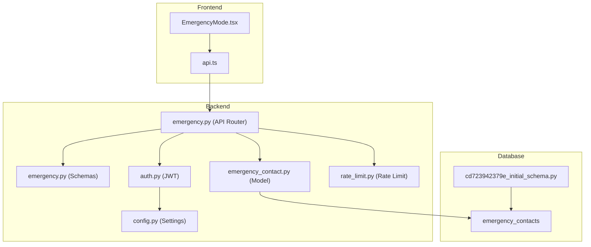
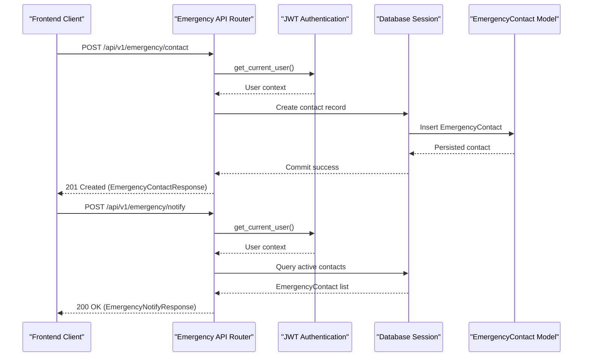
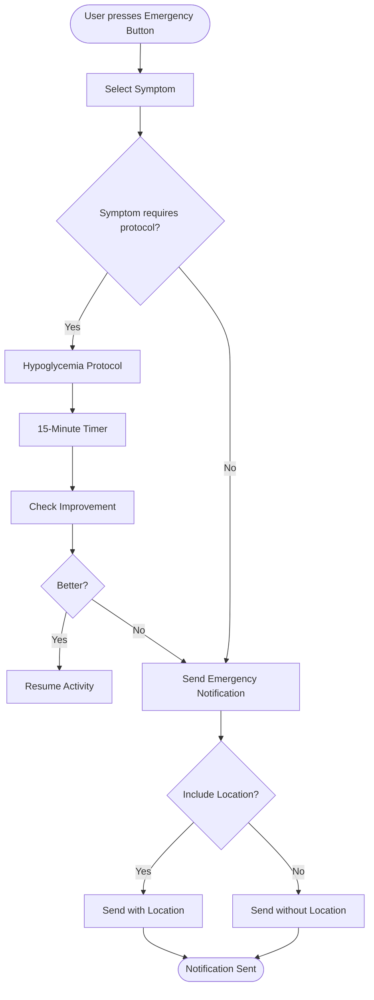
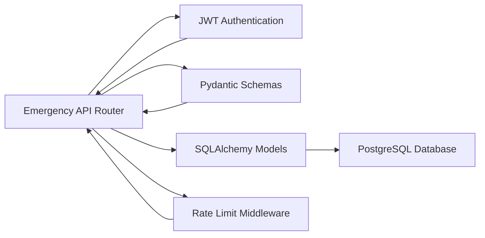

# Emergency Features

<cite>
**Referenced Files in This Document**
- [emergency.py](file://backend/app/api/emergency.py)
- [emergency.py](file://backend/app/schemas/emergency.py)
- [emergency_contact.py](file://backend/app/models/emergency_contact.py)
- [auth.py](file://backend/app/middleware/auth.py)
- [config.py](file://backend/app/utils/config.py)
- [EmergencyMode.tsx](file://frontend/src/components/emergency/EmergencyMode.tsx)
- [api.ts](file://frontend/src/services/api.ts)
- [cd723942379e_initial_schema.py](file://database/migrations/versions/cd723942379e_initial_schema.py)
- [rate_limit.py](file://backend/app/middleware/rate_limit.py)
- [SECURITY_CHECKLIST.md](file://docs/SECURITY_CHECKLIST.md)
</cite>

## Table of Contents
1. [Introduction](#introduction)
2. [Project Structure](#project-structure)
3. [Core Components](#core-components)
4. [Architecture Overview](#architecture-overview)
5. [Detailed Component Analysis](#detailed-component-analysis)
6. [Dependency Analysis](#dependency-analysis)
7. [Performance Considerations](#performance-considerations)
8. [Troubleshooting Guide](#troubleshooting-guide)
9. [Conclusion](#conclusion)

## Introduction
This document provides comprehensive API documentation for the emergency features in FitTracker Pro. It covers emergency contact management endpoints, emergency notification triggers, and the integrated emergency response workflow. The system enables users to manage emergency contacts, trigger emergency alerts, monitor emergency status, and receive notifications through Telegram or SMS channels. The documentation includes request/response schemas, security considerations, and operational guidelines for emergency data handling.

## Project Structure
The emergency system spans backend FastAPI endpoints, SQLAlchemy models, Pydantic schemas, frontend components, and database migrations. The architecture integrates user authentication, contact verification, and notification routing.

**Diagram sources**
- [emergency.py:1-543](file://backend/app/api/emergency.py#L1-L543)
- [emergency.py:1-117](file://backend/app/schemas/emergency.py#L1-L117)
- [emergency_contact.py:1-112](file://backend/app/models/emergency_contact.py#L1-L112)
- [auth.py:1-251](file://backend/app/middleware/auth.py#L1-L251)
- [config.py:1-55](file://backend/app/utils/config.py#L1-L55)
- [EmergencyMode.tsx:1-1079](file://frontend/src/components/emergency/EmergencyMode.tsx#L1-L1079)
- [api.ts:1-69](file://frontend/src/services/api.ts#L1-L69)
- [cd723942379e_initial_schema.py:346-379](file://database/migrations/versions/cd723942379e_initial_schema.py#L346-L379)
- [rate_limit.py:1-129](file://backend/app/middleware/rate_limit.py#L1-L129)

**Section sources**
- [emergency.py:1-543](file://backend/app/api/emergency.py#L1-L543)
- [emergency.py:1-117](file://backend/app/schemas/emergency.py#L1-L117)
- [emergency_contact.py:1-112](file://backend/app/models/emergency_contact.py#L1-L112)
- [EmergencyMode.tsx:1-1079](file://frontend/src/components/emergency/EmergencyMode.tsx#L1-L1079)
- [api.ts:1-69](file://frontend/src/services/api.ts#L1-L69)
- [cd723942379e_initial_schema.py:346-379](file://database/migrations/versions/cd723942379e_initial_schema.py#L346-L379)

## Core Components
- Emergency API Router: Provides endpoints for managing emergency contacts and triggering emergency notifications.
- Emergency Schemas: Define request/response models for contact creation, updates, and notification requests.
- Emergency Contact Model: Represents emergency contacts in the database with relationship to users.
- Authentication Middleware: Validates JWT tokens and resolves the current user context.
- Frontend Emergency Component: Implements the emergency workflow including symptom selection, protocol steps, and contact notification.
- Database Migration: Creates the emergency_contacts table with appropriate indexes and constraints.

**Section sources**
- [emergency.py:1-543](file://backend/app/api/emergency.py#L1-L543)
- [emergency.py:1-117](file://backend/app/schemas/emergency.py#L1-L117)
- [emergency_contact.py:1-112](file://backend/app/models/emergency_contact.py#L1-L112)
- [EmergencyMode.tsx:1-1079](file://frontend/src/components/emergency/EmergencyMode.tsx#L1-L1079)

## Architecture Overview
The emergency system follows a layered architecture:
- Presentation Layer: Frontend components handle user interactions and render emergency workflows.
- API Layer: FastAPI routes expose emergency endpoints with authentication and validation.
- Business Logic: Endpoints orchestrate contact retrieval, creation, updates, deletions, and notification dispatch.
- Data Layer: SQLAlchemy models persist emergency contacts and enforce referential integrity.
- Security Layer: JWT authentication ensures authorized access; rate limiting protects endpoints from abuse.

**Diagram sources**
- [emergency.py:81-136](file://backend/app/api/emergency.py#L81-L136)
- [emergency.py:249-359](file://backend/app/api/emergency.py#L249-L359)
- [auth.py:174-202](file://backend/app/middleware/auth.py#L174-L202)

## Detailed Component Analysis

### Emergency Contact Management Endpoints

#### GET /api/v1/emergency/contact
- Purpose: Retrieve all emergency contacts for the authenticated user.
- Authentication: Requires a valid Bearer token.
- Response: EmergencyContactListResponse containing items, total count, and active_count.
- Access Control: Enforced via get_current_user dependency.

**Section sources**
- [emergency.py:27-78](file://backend/app/api/emergency.py#L27-L78)

#### POST /api/v1/emergency/contact
- Purpose: Add a new emergency contact for the authenticated user.
- Authentication: Requires a valid Bearer token.
- Request: EmergencyContactCreate schema.
- Response: EmergencyContactResponse (201 Created).
- Validation: At least one of contact_username or phone must be provided.

**Section sources**
- [emergency.py:81-136](file://backend/app/api/emergency.py#L81-L136)
- [emergency.py:10-24](file://backend/app/schemas/emergency.py#L10-L24)

#### GET /api/v1/emergency/contact/{contact_id}
- Purpose: Retrieve a specific emergency contact by ID.
- Authentication: Requires a valid Bearer token.
- Response: EmergencyContactResponse.
- Access Control: Ensures the contact belongs to the current user.

**Section sources**
- [emergency.py:139-164](file://backend/app/api/emergency.py#L139-L164)

#### PUT /api/v1/emergency/contact/{contact_id}
- Purpose: Update an existing emergency contact.
- Authentication: Requires a valid Bearer token.
- Request: EmergencyContactUpdate schema.
- Response: EmergencyContactResponse.
- Access Control: Ensures the contact belongs to the current user.

**Section sources**
- [emergency.py:167-217](file://backend/app/api/emergency.py#L167-L217)
- [emergency.py:26-39](file://backend/app/schemas/emergency.py#L26-L39)

#### DELETE /api/v1/emergency/contact/{contact_id}
- Purpose: Remove an emergency contact.
- Authentication: Requires a valid Bearer token.
- Response: 204 No Content.
- Access Control: Ensures the contact belongs to the current user.

**Section sources**
- [emergency.py:220-247](file://backend/app/api/emergency.py#L220-L247)

### Emergency Notification Endpoints

#### POST /api/v1/emergency/notify
- Purpose: Send emergency notifications to all active contacts configured for emergency alerts.
- Authentication: Requires a valid Bearer token.
- Request: EmergencyNotifyRequest (message, location, workout_id, severity).
- Response: EmergencyNotifyResponse (notified_at, severity, message_sent, results, counts).
- Behavior: Builds a standardized emergency message and attempts notifications via Telegram or SMS (placeholders).

**Section sources**
- [emergency.py:249-359](file://backend/app/api/emergency.py#L249-L359)
- [emergency.py:68-98](file://backend/app/schemas/emergency.py#L68-L98)

#### POST /api/v1/emergency/notify/workout-start
- Purpose: Notify emergency contacts that a workout has started.
- Authentication: Requires a valid Bearer token.
- Request: workout_id, estimated_duration (optional).
- Response: JSON with message and contacts_notified count.
- Behavior: Filters contacts who opted-in for workout start notifications.

**Section sources**
- [emergency.py:362-404](file://backend/app/api/emergency.py#L362-L404)

#### POST /api/v1/emergency/notify/workout-end
- Purpose: Notify emergency contacts that a workout has ended.
- Authentication: Requires a valid Bearer token.
- Request: workout_id, duration, completed_successfully (optional).
- Response: JSON with message and contacts_notified count.
- Behavior: Filters contacts who opted-in for workout end notifications.

**Section sources**
- [emergency.py:407-450](file://backend/app/api/emergency.py#L407-L450)

### Emergency Settings and Logging

#### GET /api/v1/emergency/settings
- Purpose: Retrieve emergency notification settings for the user.
- Authentication: Requires a valid Bearer token.
- Response: JSON with auto_notify_on_workout, emergency_timeout_minutes, location_sharing, contacts_count, active_contacts_count.

**Section sources**
- [emergency.py:453-492](file://backend/app/api/emergency.py#L453-L492)

#### POST /api/v1/emergency/log
- Purpose: Log emergency events for analytics and safety tracking.
- Authentication: Requires a valid Bearer token.
- Request: JSON with symptom, timestamp, protocolStarted, contactNotified, location (optional).
- Response: JSON with logged flag and event_id.

**Section sources**
- [emergency.py:495-542](file://backend/app/api/emergency.py#L495-L542)

### Frontend Emergency Workflow
The frontend EmergencyMode component orchestrates the end-to-end emergency experience:
- Symptom Selection: Allows users to choose from predefined symptoms.
- Hypoglycemia Protocol: Guides users through the 15-15-15 rule with timer controls.
- Contact Notification: Displays the selected contact and allows sending notifications with optional location sharing.
- Call Help: Confirms escalation to emergency services.

**Diagram sources**
- [EmergencyMode.tsx:1-1079](file://frontend/src/components/emergency/EmergencyMode.tsx#L1-L1079)

**Section sources**
- [EmergencyMode.tsx:1-1079](file://frontend/src/components/emergency/EmergencyMode.tsx#L1-L1079)
- [api.ts:1-69](file://frontend/src/services/api.ts#L1-L69)

### Data Models and Database Schema
The emergency_contacts table stores user emergency contacts with the following fields:
- id: Primary key
- user_id: Foreign key to users (CASCADE delete)
- contact_name: Contact display name
- contact_username: Telegram username (if contact is a Telegram user)
- phone: Phone number with country code
- relationship_type: Family, friend, doctor, trainer, other
- is_active: Whether contact is active
- notify_on_workout_start: Notify when workout starts
- notify_on_workout_end: Notify when workout ends
- notify_on_emergency: Notify on emergency alert
- priority: Priority order for notifications
- created_at, updated_at: Timestamps with automatic updates

Indexes: user_id, is_active, priority.

**Section sources**
- [emergency_contact.py:1-112](file://backend/app/models/emergency_contact.py#L1-L112)
- [cd723942379e_initial_schema.py:346-379](file://database/migrations/versions/cd723942379e_initial_schema.py#L346-L379)

### Request/Response Schemas
EmergencyContactCreate: Defines fields for creating contacts including contact_name, contact_username, phone, relationship_type, notification preferences, and priority.

EmergencyContactUpdate: Defines updatable fields with optional values.

EmergencyContactResponse: Complete contact representation with timestamps.

EmergencyNotifyRequest: Defines emergency notification payload including message, location, workout_id, and severity.

EmergencyNotifyResponse: Aggregated notification results with individual NotificationResult entries.

**Section sources**
- [emergency.py:10-98](file://backend/app/schemas/emergency.py#L10-L98)

## Dependency Analysis
The emergency system exhibits clear separation of concerns:
- API Router depends on authentication middleware and SQLAlchemy sessions.
- Schemas define strict input/output contracts validated by Pydantic.
- Models encapsulate persistence logic and relationships.
- Frontend components depend on the API service for HTTP communication.
- Rate limiting middleware provides distributed request throttling.

**Diagram sources**
- [emergency.py:1-543](file://backend/app/api/emergency.py#L1-L543)
- [auth.py:1-251](file://backend/app/middleware/auth.py#L1-L251)
- [rate_limit.py:1-129](file://backend/app/middleware/rate_limit.py#L1-L129)

**Section sources**
- [emergency.py:1-543](file://backend/app/api/emergency.py#L1-L543)
- [auth.py:1-251](file://backend/app/middleware/auth.py#L1-L251)
- [rate_limit.py:1-129](file://backend/app/middleware/rate_limit.py#L1-L129)

## Performance Considerations
- Database Queries: Emergency endpoints use indexed fields (user_id, is_active, priority) to minimize query cost.
- Asynchronous Operations: SQLAlchemy async sessions support concurrent operations.
- Notification Dispatch: Current implementation uses placeholders; production should implement asynchronous notification tasks to avoid blocking requests.
- Rate Limiting: Emergency endpoints have higher limits to accommodate urgent scenarios while preventing abuse.

[No sources needed since this section provides general guidance]

## Troubleshooting Guide
Common issues and resolutions:
- Authentication failures: Ensure Authorization header contains a valid Bearer token. Verify token expiration and signing key configuration.
- Contact not found: Confirm the contact_id belongs to the authenticated user; endpoints enforce ownership.
- No active contacts configured: Emergency notification endpoint returns 400 when no active contacts are found.
- Notification failures: Results include individual NotificationResult entries indicating success/failure per contact.

Security and compliance:
- Rate limiting: Emergency endpoints have elevated limits; verify Redis connectivity for distributed tracking.
- Data protection: Emergency data is stored in the emergency_contacts table; ensure database credentials and environment variables are secured.
- Access controls: All endpoints require authenticated users; verify JWT configuration and token validation.

**Section sources**
- [emergency.py:112-117](file://backend/app/api/emergency.py#L112-L117)
- [emergency.py:305-309](file://backend/app/api/emergency.py#L305-L309)
- [rate_limit.py:17-34](file://backend/app/middleware/rate_limit.py#L17-L34)
- [SECURITY_CHECKLIST.md:1-193](file://docs/SECURITY_CHECKLIST.md#L1-L193)

## Conclusion
The emergency features provide a robust framework for managing emergency contacts, triggering notifications, and supporting emergency response workflows. The system integrates frontend UX with backend APIs, authentication, and database persistence. While notification delivery is currently implemented as placeholders, the architecture supports future enhancements for Telegram and SMS integrations. Security measures, including JWT authentication, rate limiting, and database indexing, ensure reliable and secure operation.