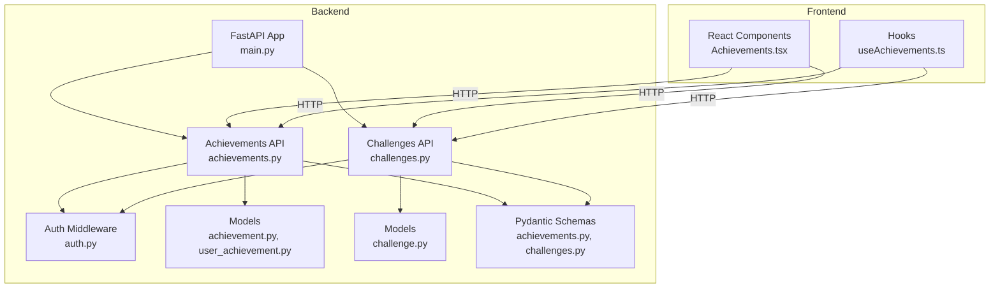
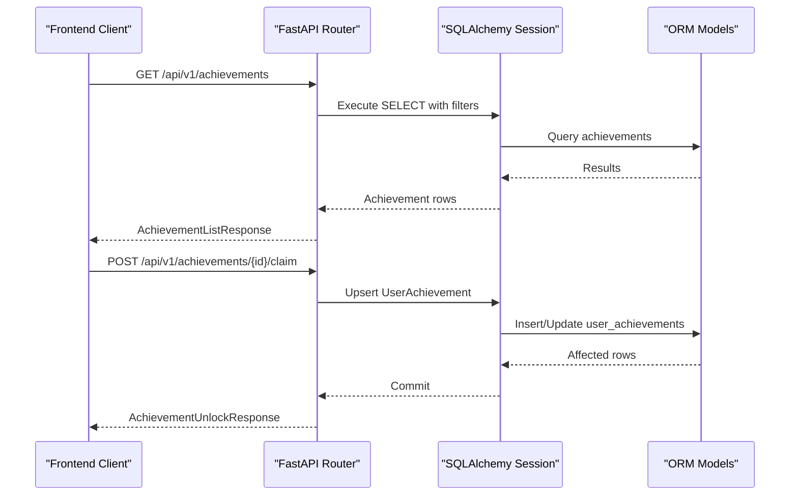
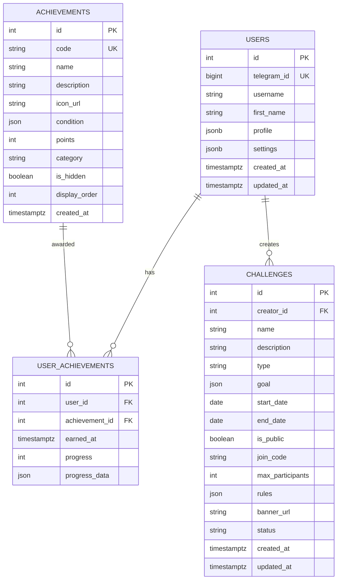
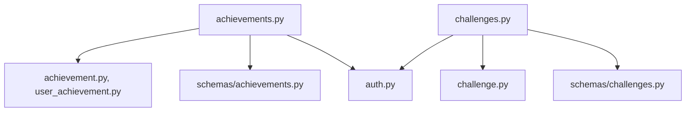

# Gamification System

<cite>
**Referenced Files in This Document**
- [achievements.py](file://backend/app/api/achievements.py)
- [challenges.py](file://backend/app/api/challenges.py)
- [achievements.py](file://backend/app/schemas/achievements.py)
- [challenges.py](file://backend/app/schemas/challenges.py)
- [achievement.py](file://backend/app/models/achievement.py)
- [challenge.py](file://backend/app/models/challenge.py)
- [user_achievement.py](file://backend/app/models/user_achievement.py)
- [main.py](file://backend/app/main.py)
- [auth.py](file://backend/app/middleware/auth.py)
- [Achievements.tsx](file://frontend/src/components/gamification/Achievements.tsx)
- [useAchievements.ts](file://frontend/src/hooks/useAchievements.ts)
- [schema_v2.sql (legacy archive)](file://docs/db/legacy/schema_v2.sql)
</cite>

## Table of Contents
1. [Introduction](#introduction)
2. [Project Structure](#project-structure)
3. [Core Components](#core-components)
4. [Architecture Overview](#architecture-overview)
5. [Detailed Component Analysis](#detailed-component-analysis)
6. [Dependency Analysis](#dependency-analysis)
7. [Performance Considerations](#performance-considerations)
8. [Troubleshooting Guide](#troubleshooting-guide)
9. [Conclusion](#conclusion)

## Introduction
This document provides comprehensive API documentation for the gamification system, covering achievements and challenges. It details endpoint specifications, request/response schemas, gamification mechanics, point systems, unlock conditions, and integration patterns. The system supports achievement tracking, progress monitoring, leaderboard computation, and challenge participation with social features.

## Project Structure
The gamification system is implemented as part of a FastAPI backend with SQLAlchemy ORM models and Pydantic schemas. Frontend components integrate with the backend via HTTP requests to the `/api/v1/achievements` and `/api/v1/challenges` endpoints.

**Diagram sources**
- [main.py:101-106](file://backend/app/main.py#L101-L106)
- [achievements.py:1-22](file://backend/app/api/achievements.py#L1-L22)
- [challenges.py:1-24](file://backend/app/api/challenges.py#L1-L24)
- [achievement.py:17-105](file://backend/app/models/achievement.py#L17-L105)
- [challenge.py:17-138](file://backend/app/models/challenge.py#L17-L138)
- [user_achievement.py:18-71](file://backend/app/models/user_achievement.py#L18-L71)
- [achievements.py:10-81](file://backend/app/schemas/achievements.py#L10-L81)
- [challenges.py:10-134](file://backend/app/schemas/challenges.py#L10-L134)
- [Achievements.tsx:626-800](file://frontend/src/components/gamification/Achievements.tsx#L626-L800)
- [useAchievements.ts:67-278](file://frontend/src/hooks/useAchievements.ts#L67-278)

**Section sources**
- [main.py:101-106](file://backend/app/main.py#L101-L106)
- [auth.py:174-202](file://backend/app/middleware/auth.py#L174-L202)

## Core Components
- Achievements API: Provides endpoints for listing achievements, retrieving user progress, claiming achievements, and computing leaderboards.
- Challenges API: Provides endpoints for listing challenges, creating challenges, joining/leaving challenges, and retrieving challenge leaderboards.
- Models: Define the persistent structure for achievements, user progress, and challenges with JSONB fields for flexible criteria.
- Schemas: Define request/response models validated by Pydantic for API contracts.
- Frontend Integration: React components and hooks consume the APIs to render achievements, track progress, and manage social sharing.

**Section sources**
- [achievements.py:25-420](file://backend/app/api/achievements.py#L25-L420)
- [challenges.py:32-497](file://backend/app/api/challenges.py#L32-L497)
- [achievement.py:17-105](file://backend/app/models/achievement.py#L17-L105)
- [challenge.py:17-138](file://backend/app/models/challenge.py#L17-L138)
- [achievements.py:10-81](file://backend/app/schemas/achievements.py#L10-L81)
- [challenges.py:10-134](file://backend/app/schemas/challenges.py#L10-L134)

## Architecture Overview
The gamification system follows a layered architecture:
- Presentation Layer: FastAPI routers expose REST endpoints under `/api/v1/achievements` and `/api/v1/challenges`.
- Business Logic: Routers depend on SQLAlchemy sessions and apply filtering, pagination, and aggregation.
- Data Access: SQLAlchemy models define tables and relationships; JSONB fields store flexible criteria.
- Authentication: JWT bearer tokens authenticate protected endpoints.
- Frontend Integration: React components and hooks call endpoints and manage UI state.

**Diagram sources**
- [achievements.py:25-310](file://backend/app/api/achievements.py#L25-L310)
- [achievement.py:17-105](file://backend/app/models/achievement.py#L17-L105)
- [user_achievement.py:18-71](file://backend/app/models/user_achievement.py#L18-L71)

## Detailed Component Analysis

### Achievements API

#### Endpoints
- GET /api/v1/achievements
  - Purpose: Retrieve available achievements with optional category filter.
  - Query Parameters:
    - category: workouts, health, streaks, social, general
  - Response: AchievementListResponse with items, total, and categories.

- GET /api/v1/achievements/user
  - Purpose: Retrieve current user's achievements with progress summary.
  - Response: UserAchievementListResponse with items, totals, counts, and recent achievements.

- GET /api/v1/achievements/user/{achievement_id}
  - Purpose: Retrieve specific user achievement details.
  - Response: UserAchievementResponse.

- POST /api/v1/achievements/{achievement_id}/claim
  - Purpose: Attempt to claim an achievement if criteria are met.
  - Response: AchievementUnlockResponse indicating success and points.

- GET /api/v1/achievements/leaderboard
  - Purpose: Retrieve global achievements leaderboard.
  - Query Parameters:
    - limit: 1–100
  - Response: Leaderboard entries with ranks, usernames, points, and counts.

#### Request/Response Schemas
- AchievementCondition: type, value, description
- AchievementResponse: id, code, name, description, icon_url, condition, points, category, is_hidden, display_order, created_at
- AchievementListResponse: items[], total, categories[]
- UserAchievementResponse: id, user_id, achievement_id, achievement (AchievementResponse), earned_at, progress, progress_data, is_completed
- UserAchievementListResponse: items[], total, total_points, completed_count, in_progress_count, recent_achievements[]
- AchievementProgressUpdate: progress (0–100), progress_data
- AchievementUnlockResponse: unlocked, achievement, points_earned, new_total_points, message

#### Gamification Mechanics
- Point System: Each achievement defines points; unlocking grants points and updates totals.
- Unlock Conditions: condition field is JSONB allowing flexible criteria; current implementation auto-unlocks for demonstration.
- Progress Tracking: UserAchievement tracks progress and progress_data for multi-step achievements.
- Categories: Achievements are categorized for UI grouping and filtering.

#### Examples
- Achievement Workflow:
  - Fetch available achievements filtered by category.
  - Monitor user progress and display completion percentage.
  - Claim an achievement when criteria are met; receive points and update totals.
- Progress Monitoring:
  - Periodically poll user achievements to detect new unlocks and update UI.

**Section sources**
- [achievements.py:25-420](file://backend/app/api/achievements.py#L25-L420)
- [achievements.py:10-81](file://backend/app/schemas/achievements.py#L10-L81)
- [achievement.py:17-105](file://backend/app/models/achievement.py#L17-L105)
- [user_achievement.py:18-71](file://backend/app/models/user_achievement.py#L18-L71)
- [Achievements.tsx:655-709](file://frontend/src/components/gamification/Achievements.tsx#L655-L709)
- [useAchievements.ts:129-153](file://frontend/src/hooks/useAchievements.ts#L129-L153)

### Challenges API

#### Endpoints
- GET /api/v1/challenges
  - Purpose: List challenges with filters and pagination.
  - Query Parameters:
    - status: upcoming, active, completed, cancelled
    - type: workout_count, duration, calories, distance, custom
    - is_public: boolean
    - page: default 1
    - page_size: default 20, max 100
  - Response: ChallengeListResponse with items, total, page, page_size, filters.

- GET /api/v1/challenges/{challenge_id}
  - Purpose: Retrieve challenge details including creator info.
  - Response: ChallengeDetailResponse with participants, user_progress, user_rank placeholders.

- POST /api/v1/challenges
  - Purpose: Create a new challenge.
  - Request: ChallengeCreate (name, description, type, goal, start_date, end_date, is_public, max_participants, rules, banner_url).
  - Response: ChallengeResponse.

- POST /api/v1/challenges/{challenge_id}/join
  - Purpose: Join a challenge.
  - Request: Optional join_code for private challenges.
  - Response: ChallengeJoinResponse.

- POST /api/v1/challenges/{challenge_id}/leave
  - Purpose: Leave a challenge.
  - Response: ChallengeLeaveResponse.

- GET /api/v1/challenges/{challenge_id}/leaderboard
  - Purpose: Retrieve challenge-specific leaderboard.
  - Response: ChallengeLeaderboardResponse with entries, user_rank, total_participants.

- GET /api/v1/challenges/my/active
  - Purpose: Retrieve user's active/upcoming challenges (placeholder).

#### Request/Response Schemas
- ChallengeGoal: type, target, unit, description
- ChallengeRules: min_workouts_per_week, max_workouts_per_day, allowed_workout_types, excluded_exercises
- ChallengeCreate: name, description, type, goal (ChallengeGoal), start_date, end_date, is_public, max_participants, rules (ChallengeRules), banner_url
- ChallengeResponse: id, creator_id, creator_name, name, description, type, goal, start_date, end_date, is_public, join_code, max_participants, current_participants, rules, banner_url, status, created_at, updated_at
- ChallengeDetailResponse: extends ChallengeResponse with participants, user_progress, user_rank
- ChallengeListResponse: items[], total, page, page_size, filters
- ChallengeJoinResponse: success, challenge_id, joined_at, message, participant_count
- ChallengeLeaveResponse: success, challenge_id, message
- ChallengeProgressUpdate: progress, workout_id, notes
- ChallengeLeaderboardEntry: rank, user_id, username, first_name, progress, completion_percentage, last_activity
- ChallengeLeaderboardResponse: challenge_id, entries[], user_rank, total_participants

#### Gamification Mechanics
- Challenge Types: workout_count, duration, calories, distance, custom with flexible goals.
- Status Management: Determined by start/end dates; supports upcoming, active, completed, cancelled.
- Privacy Controls: Public vs. private challenges with join codes.
- Leaderboard Computation: Placeholder for future implementation; returns empty structure.

#### Examples
- Challenge Participation:
  - List challenges by status and type.
  - Join a public or private challenge using a join code.
  - Track personal progress and rank against other participants.
- Social Features:
  - Share achievements and challenge progress via Telegram WebApp integration.

**Section sources**
- [challenges.py:32-497](file://backend/app/api/challenges.py#L32-L497)
- [challenges.py:10-134](file://backend/app/schemas/challenges.py#L10-L134)
- [challenge.py:17-138](file://backend/app/models/challenge.py#L17-L138)
- [Achievements.tsx:734-743](file://frontend/src/components/gamification/Achievements.tsx#L734-L743)

### Data Models

**Diagram sources**
- [schema_v2.sql:10-42](file://docs/db/legacy/schema_v2.sql#L10-L42)
- [schema_v2.sql:242-275](file://docs/db/legacy/schema_v2.sql#L242-L275)
- [schema_v2.sql:301-340](file://docs/db/legacy/schema_v2.sql#L301-L340)
- [achievement.py:17-105](file://backend/app/models/achievement.py#L17-L105)
- [user_achievement.py:18-71](file://backend/app/models/user_achievement.py#L18-L71)
- [challenge.py:17-138](file://backend/app/models/challenge.py#L17-L138)

**Section sources**
- [schema_v2.sql:242-340](file://docs/db/legacy/schema_v2.sql#L242-L340)
- [achievement.py:17-105](file://backend/app/models/achievement.py#L17-L105)
- [user_achievement.py:18-71](file://backend/app/models/user_achievement.py#L18-L71)
- [challenge.py:17-138](file://backend/app/models/challenge.py#L17-L138)

### Authentication and Authorization
- JWT Bearer Tokens: All endpoints except authentication require Authorization: Bearer <access_token>.
- User Resolution: Middleware resolves current user from JWT subject and Telegram ID.
- Rate Limiting: Global middleware applies rate limits to protect endpoints.

**Section sources**
- [main.py:56-87](file://backend/app/main.py#L56-L87)
- [auth.py:174-202](file://backend/app/middleware/auth.py#L174-L202)

## Dependency Analysis

**Diagram sources**
- [achievements.py:1-22](file://backend/app/api/achievements.py#L1-L22)
- [challenges.py:1-24](file://backend/app/api/challenges.py#L1-L24)
- [auth.py:174-202](file://backend/app/middleware/auth.py#L174-L202)
- [achievement.py:17-105](file://backend/app/models/achievement.py#L17-L105)
- [challenge.py:17-138](file://backend/app/models/challenge.py#L17-L138)
- [user_achievement.py:18-71](file://backend/app/models/user_achievement.py#L18-L71)
- [achievements.py:10-81](file://backend/app/schemas/achievements.py#L10-L81)
- [challenges.py:10-134](file://backend/app/schemas/challenges.py#L10-L134)

**Section sources**
- [achievements.py:1-22](file://backend/app/api/achievements.py#L1-L22)
- [challenges.py:1-24](file://backend/app/api/challenges.py#L1-L24)

## Performance Considerations
- Pagination: Use page and page_size parameters to limit result sets.
- Filtering: Apply category/status/type filters to reduce dataset size.
- Indexes: Database tables utilize indexes on frequently queried columns (e.g., category, status, dates).
- Asynchronous Operations: API endpoints use async database sessions for concurrent handling.
- Leaderboard Queries: Aggregate queries compute totals and ranks; consider caching or materialized views for high-frequency access.

[No sources needed since this section provides general guidance]

## Troubleshooting Guide
- Authentication Failures:
  - Ensure Authorization header contains a valid Bearer token.
  - Verify token type and expiration.
- Achievement Endpoints:
  - Missing achievement_id or invalid progress values will cause errors.
  - Auto-unlock behavior may differ from intended criteria; adjust backend logic accordingly.
- Challenge Endpoints:
  - Private challenges require correct join_code.
  - Participants count and leaderboard data are placeholders; implement participant tracking.
- Frontend Integration:
  - Polling for new achievements occurs every 30 seconds; adjust intervals as needed.
  - Handle loading and error states gracefully in components.

**Section sources**
- [auth.py:148-171](file://backend/app/middleware/auth.py#L148-L171)
- [achievements.py:241-310](file://backend/app/api/achievements.py#L241-L310)
- [challenges.py:350-394](file://backend/app/api/challenges.py#L350-L394)
- [useAchievements.ts:242-259](file://frontend/src/hooks/useAchievements.ts#L242-L259)

## Conclusion
The gamification system provides a robust foundation for achievements and challenges with flexible criteria, point-based rewards, and social engagement. The API design leverages Pydantic schemas and SQLAlchemy models to ensure type safety and extensibility. Future enhancements should focus on implementing challenge participant tracking, refining achievement unlock logic, and optimizing leaderboard computations.