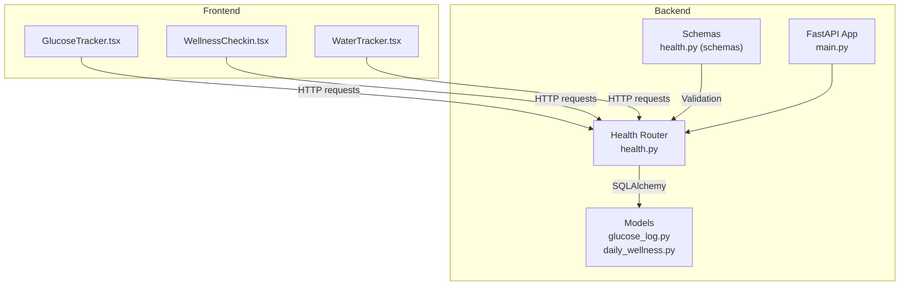
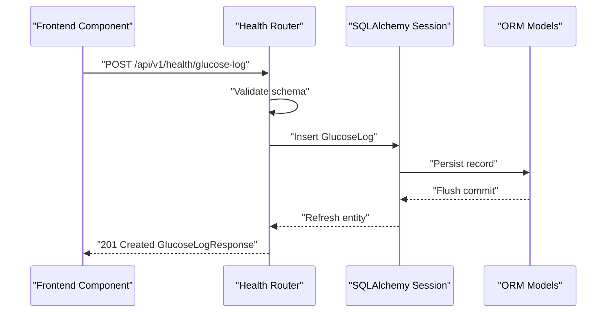
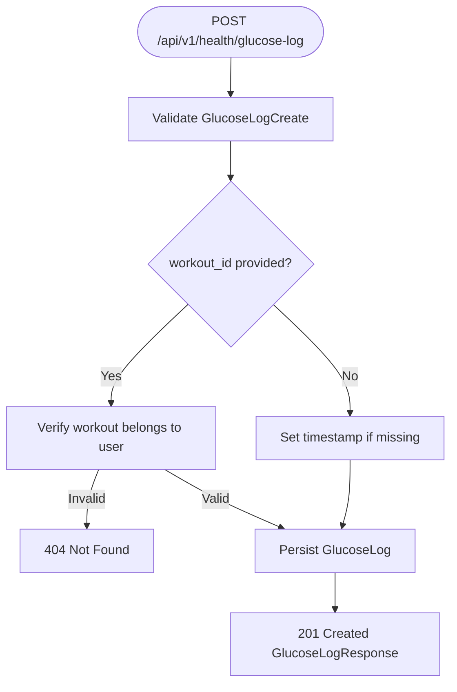
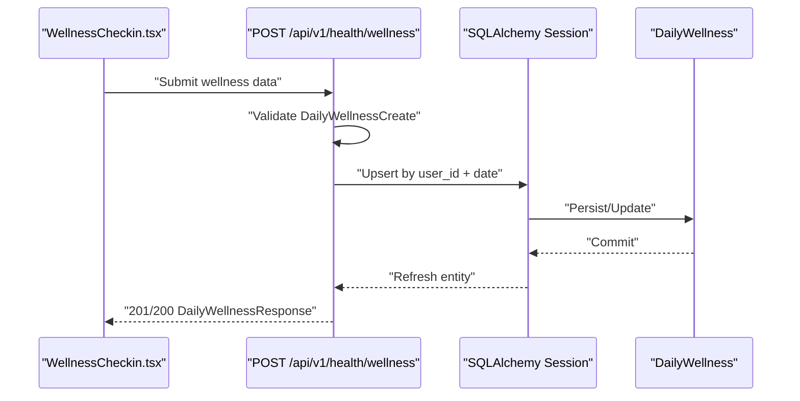
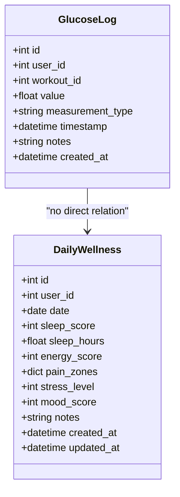
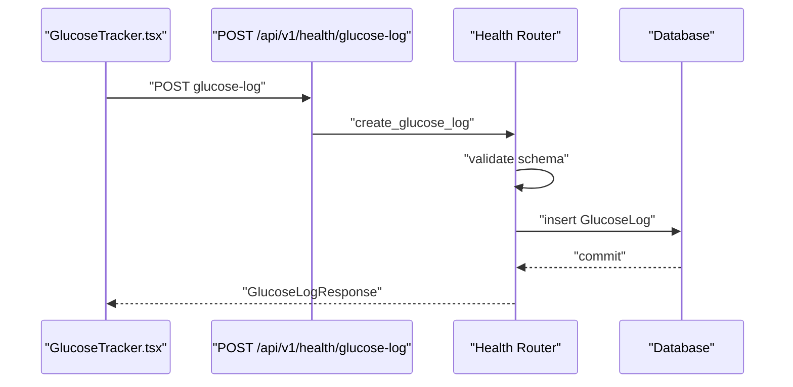
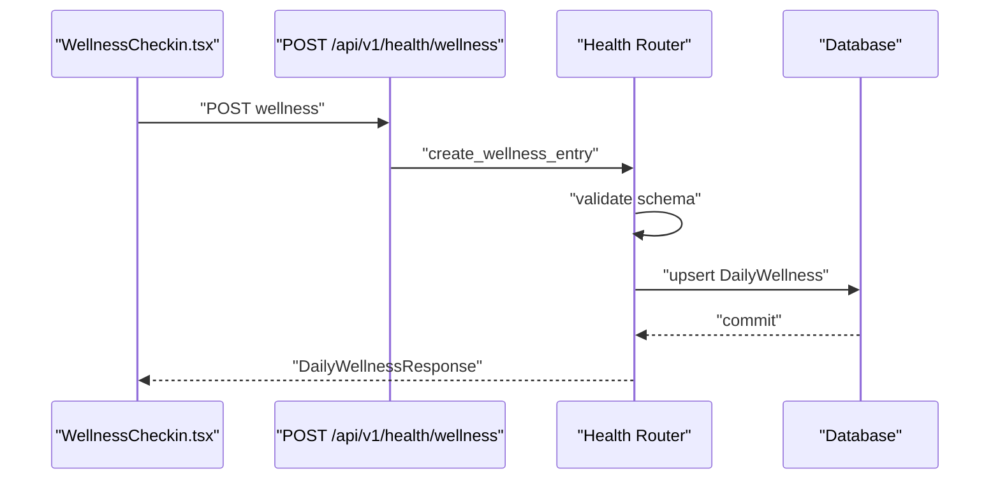
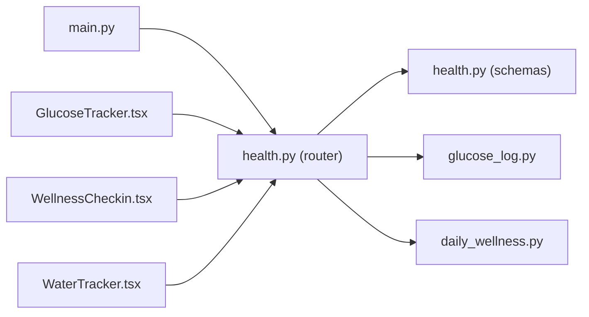

# Health Monitoring

<cite>
**Referenced Files in This Document**
- [health.py](file://backend/app/api/health.py)
- [health.py](file://backend/app/schemas/health.py)
- [glucose_log.py](file://backend/app/models/glucose_log.py)
- [daily_wellness.py](file://backend/app/models/daily_wellness.py)
- [health_metrics.py](file://backend/app/api/health_metrics.py)
- [main.py](file://backend/app/main.py)
- [GlucoseTracker.tsx](file://frontend/src/components/health/GlucoseTracker.tsx)
- [WellnessCheckin.tsx](file://frontend/src/components/health/WellnessCheckin.tsx)
- [WaterTracker.tsx](file://frontend/src/components/health/WaterTracker.tsx)
- [test_health.py](file://backend/app/tests/test_health.py)
</cite>

## Table of Contents
1. [Introduction](#introduction)
2. [Project Structure](#project-structure)
3. [Core Components](#core-components)
4. [Architecture Overview](#architecture-overview)
5. [Detailed Component Analysis](#detailed-component-analysis)
6. [Dependency Analysis](#dependency-analysis)
7. [Performance Considerations](#performance-considerations)
8. [Troubleshooting Guide](#troubleshooting-guide)
9. [Privacy and Retention](#privacy-and-retention)
10. [Conclusion](#conclusion)

## Introduction
This document provides comprehensive API documentation for health monitoring endpoints in the FitTracker Pro application. It covers:
- Blood sugar tracking via POST /api/v1/health/glucose-log and GET /api/v1/health/glucose-history
- Daily wellness assessments via POST /api/v1/health/wellness-checkin and related wellness endpoints
- Hydration tracking via POST /api/v1/health/water-log and supporting water endpoints
- Request/response schemas, validation rules, and statistical aggregation
- Practical workflows for data entry, trend analysis, and wellness reporting
- Privacy considerations for sensitive health data

## Project Structure
The health monitoring feature spans backend FastAPI routes, SQLAlchemy models, Pydantic schemas, and frontend components:
- Backend: API router under /api/v1/health with glucose and wellness endpoints
- Models: GlucoseLog and DailyWellness persisted to PostgreSQL
- Frontend: Components for GlucoseTracker, WellnessCheckin, and WaterTracker integrate with health APIs

**Diagram sources**
- [main.py:90-98](file://backend/app/main.py#L90-L98)
- [health.py:26-26](file://backend/app/api/health.py#L26-L26)
- [glucose_log.py:18-80](file://backend/app/models/glucose_log.py#L18-L80)
- [daily_wellness.py:17-118](file://backend/app/models/daily_wellness.py#L17-L118)
- [health.py:10-24](file://backend/app/schemas/health.py#L10-L24)

**Section sources**
- [main.py:90-98](file://backend/app/main.py#L90-L98)
- [health.py:26-26](file://backend/app/api/health.py#L26-L26)

## Core Components
- Health API Router: Exposes endpoints for glucose, wellness, and statistics under /api/v1/health
- Models: GlucoseLog and DailyWellness define persistence and indexes
- Schemas: Pydantic models validate request/response payloads and enforce constraints
- Frontend Components: Integrate with health endpoints for user-facing workflows

Key endpoints:
- POST /api/v1/health/glucose-log
- GET /api/v1/health/glucose-history
- GET /api/v1/health/glucose/{log_id}
- DELETE /api/v1/health/glucose/{log_id}
- POST /api/v1/health/wellness
- GET /api/v1/health/wellness
- GET /api/v1/health/wellness/{entry_id}
- GET /api/v1/health/stats

**Section sources**
- [health.py:29-200](file://backend/app/api/health.py#L29-L200)
- [health.py:259-406](file://backend/app/api/health.py#L259-L406)
- [health.py:409-615](file://backend/app/api/health.py#L409-L615)

## Architecture Overview
The health module follows a layered architecture:
- API Layer: FastAPI routes handle authentication, request validation, and response serialization
- Service Layer: Business logic executes queries, updates, and computations
- Persistence Layer: SQLAlchemy ORM models map to PostgreSQL tables
- Validation Layer: Pydantic schemas define request/response contracts

**Diagram sources**
- [health.py:29-90](file://backend/app/api/health.py#L29-L90)
- [glucose_log.py:18-80](file://backend/app/models/glucose_log.py#L18-L80)

**Section sources**
- [health.py:29-90](file://backend/app/api/health.py#L29-L90)
- [glucose_log.py:18-80](file://backend/app/models/glucose_log.py#L18-L80)

## Detailed Component Analysis

### Glucose Tracking Endpoints
- POST /api/v1/health/glucose-log
  - Purpose: Record a new glucose measurement
  - Authentication: Bearer token required
  - Request body: GlucoseLogCreate (value, measurement_type, timestamp, notes, workout_id)
  - Validation:
    - value: 2.0 to 30.0
    - measurement_type: fasting, pre_workout, post_workout, random, bedtime
    - workout_id: must belong to current user
  - Response: GlucoseLogResponse (includes created_at)
  - Notes: If timestamp not provided, server uses UTC now

- GET /api/v1/health/glucose-history
  - Purpose: Retrieve paginated glucose history with statistics
  - Query parameters:
    - page: default 1, min 1
    - page_size: default 50, range 1..100
    - date_from/date_to: date filters
    - measurement_type: filter by type
  - Response: GlucoseHistoryResponse (items, total, page, page_size, date_from, date_to, average, min_value, max_value)

- GET /api/v1/health/glucose/{log_id}
  - Purpose: Retrieve a specific glucose log by ID
  - Response: GlucoseLogResponse

- DELETE /api/v1/health/glucose/{log_id}
  - Purpose: Delete a glucose log owned by the current user
  - Response: 204 No Content

**Diagram sources**
- [health.py:29-90](file://backend/app/api/health.py#L29-L90)
- [health.py:14-23](file://backend/app/schemas/health.py#L14-L23)

**Section sources**
- [health.py:29-90](file://backend/app/api/health.py#L29-L90)
- [health.py:93-199](file://backend/app/api/health.py#L93-L199)
- [health.py:202-227](file://backend/app/api/health.py#L202-L227)
- [health.py:230-257](file://backend/app/api/health.py#L230-L257)
- [health.py:14-23](file://backend/app/schemas/health.py#L14-L23)

### Wellness Tracking Endpoints
- POST /api/v1/health/wellness
  - Purpose: Create or update daily wellness entry
  - Request body: DailyWellnessCreate (date, sleep_score, sleep_hours, energy_score, pain_zones, stress_level, mood_score, notes)
  - Validation:
    - sleep_score: 0–100
    - energy_score: 0–100
    - pain_zones: 0–10 per zone (JSON)
    - stress_level: 0–10
    - mood_score: 0–100
  - Behavior: Upsert by user_id + date
  - Response: DailyWellnessResponse (with timestamps)

- GET /api/v1/health/wellness
  - Purpose: Retrieve wellness history
  - Query parameters:
    - date_from/date_to: date filters
    - limit: default 30, max 365
  - Response: Array of DailyWellnessResponse

- GET /api/v1/health/wellness/{entry_id}
  - Purpose: Retrieve a specific wellness entry by ID

- GET /api/v1/health/stats
  - Purpose: Health statistics summary
  - Query parameter: period (7d|30d|90d|1y)
  - Response: HealthStatsResponse (glucose, workouts, wellness, generated_at)

**Diagram sources**
- [health.py:259-336](file://backend/app/api/health.py#L259-L336)
- [daily_wellness.py:17-118](file://backend/app/models/daily_wellness.py#L17-L118)

**Section sources**
- [health.py:259-336](file://backend/app/api/health.py#L259-L336)
- [health.py:339-378](file://backend/app/api/health.py#L339-L378)
- [health.py:381-406](file://backend/app/api/health.py#L381-L406)
- [health.py:409-615](file://backend/app/api/health.py#L409-L615)
- [health.py:66-96](file://backend/app/schemas/health.py#L66-L96)

### Hydration Tracking Endpoints
Note: The backend health router currently exposes wellness and glucose endpoints. Hydration endpoints (e.g., POST /api/v1/health/water-log) are consumed by frontend components but not present in the backend health router. The frontend expects:
- POST /health/water (maps to backend route)
- GET /health/water/goal
- PUT /health/water/goal
- GET /health/water/reminder
- PUT /health/water/reminder
- GET /health/water/today
- GET /health/water/stats

These endpoints are integrated in the frontend components and rely on the backend’s water tracking service implementation.

**Section sources**
- [WaterTracker.tsx:810-842](file://frontend/src/components/health/WaterTracker.tsx#L810-L842)
- [WaterTracker.tsx:844-866](file://frontend/src/components/health/WaterTracker.tsx#L844-L866)
- [WaterTracker.tsx:1093-1115](file://frontend/src/components/health/WaterTracker.tsx#L1093-L1115)

### Data Models and Validation

**Diagram sources**
- [glucose_log.py:18-80](file://backend/app/models/glucose_log.py#L18-L80)
- [daily_wellness.py:17-118](file://backend/app/models/daily_wellness.py#L17-L118)

Validation rules:
- GlucoseLogCreate
  - value: 2.0–30.0
  - measurement_type: enum-like pattern
  - notes: max length 500
- DailyWellnessCreate
  - sleep_score: 0–100
  - energy_score: 0–100
  - pain_zones: each zone 0–10
  - stress_level: 0–10
  - mood_score: 0–100
  - notes: max length 1000

**Section sources**
- [health.py:14-23](file://backend/app/schemas/health.py#L14-L23)
- [health.py:66-78](file://backend/app/schemas/health.py#L66-L78)
- [glucose_log.py:36-40](file://backend/app/models/glucose_log.py#L36-L40)
- [daily_wellness.py:38-84](file://backend/app/models/daily_wellness.py#L38-L84)

### Statistical Aggregations and Trend Calculations
- GET /api/v1/health/stats computes:
  - Glucose: average_7d, average_30d, readings_count_7d/30d, in_range_percentage (4–7 mmol/L)
  - Workouts: total_workouts_7d/30d, total_duration_7d/30d, avg_duration, favorite_type (based on tags)
  - Wellness: avg_sleep_score_7d/30d, avg_energy_score_7d/30d, avg_sleep_hours_7d/30d
- GET /api/v1/health/glucose-history returns:
  - average, min_value, max_value computed over filtered dataset
  - Pagination via page/page_size

**Section sources**
- [health.py:409-615](file://backend/app/api/health.py#L409-L615)
- [health.py:93-199](file://backend/app/api/health.py#L93-L199)

### Example Workflows

#### Glucose Entry Workflow
- User opens GlucoseTracker
- Selects measurement type (before/after/random)
- Enters value and optional notes
- On submit, frontend posts to POST /api/v1/health/glucose-log
- Backend validates, optionally checks workout association, persists, and returns created record

**Diagram sources**
- [GlucoseTracker.tsx:558-577](file://frontend/src/components/health/GlucoseTracker.tsx#L558-L577)
- [health.py:29-90](file://backend/app/api/health.py#L29-L90)

#### Wellness Reporting Workflow
- User completes WellnessCheckin (morning check-in)
- Frontend posts to POST /api/v1/health/wellness
- Backend upserts DailyWellness entry
- Frontend displays recommendation and history

**Diagram sources**
- [WellnessCheckin.tsx:927-976](file://frontend/src/components/health/WellnessCheckin.tsx#L927-L976)
- [health.py:259-336](file://backend/app/api/health.py#L259-L336)

## Dependency Analysis
- Router registration: Health router mounted at /api/v1/health
- Authentication: All health endpoints require Bearer token via middleware
- Dependencies:
  - health.py depends on schemas.health for validation
  - health.py depends on models for persistence
  - Frontend components depend on backend endpoints for data operations

**Diagram sources**
- [main.py:90-98](file://backend/app/main.py#L90-L98)
- [health.py:14-24](file://backend/app/schemas/health.py#L14-L24)
- [glucose_log.py:18-80](file://backend/app/models/glucose_log.py#L18-L80)
- [daily_wellness.py:17-118](file://backend/app/models/daily_wellness.py#L17-L118)

**Section sources**
- [main.py:90-98](file://backend/app/main.py#L90-L98)

## Performance Considerations
- Pagination: glucose-history supports page/page_size to avoid large payloads
- Filtering: date_from/date_to and measurement_type reduce result sets
- Indexes: Models define indexes on user_id, timestamp, measurement_type, date for efficient queries
- Aggregation: Stats endpoints compute aggregates server-side to minimize client work
- Recommendations:
  - Prefer limit parameters for history endpoints
  - Use date windows to constrain queries
  - Cache frequently accessed stats where appropriate

[No sources needed since this section provides general guidance]

## Troubleshooting Guide
Common issues and resolutions:
- 404 Not Found for glucose/wellness resources
  - Cause: Accessing records not belonging to the authenticated user
  - Resolution: Ensure ownership checks pass; verify user context
- 422 Unprocessable Entity
  - Cause: Schema validation failure (invalid value ranges, unsupported measurement_type)
  - Resolution: Align inputs with validation rules (value 2.0–30.0, measurement_type enum-like, pain_zones 0–10)
- 404 Not Found for specific log/entry ID
  - Cause: Non-existent or deleted record
  - Resolution: Fetch latest history and retry with valid IDs

**Section sources**
- [health.py:69-73](file://backend/app/api/health.py#L69-L73)
- [health.py:221-226](file://backend/app/api/health.py#L221-L226)
- [health.py:399-404](file://backend/app/api/health.py#L399-L404)

## Privacy and Retention
- Data sensitivity: Glucose and wellness metrics are personal health data
- Access control: All health endpoints require authenticated Bearer token
- Data minimization: Only necessary fields are returned in responses
- Retention policy: Not defined in the codebase; consult product/security policy for storage duration and deletion procedures

[No sources needed since this section provides general guidance]

## Conclusion
The health monitoring module provides robust APIs for glucose tracking, daily wellness assessments, and statistics aggregation. It enforces strict validation, offers paginated and filtered queries, and integrates seamlessly with frontend components. For hydration tracking, the frontend expects dedicated endpoints that are not currently exposed by the backend health router. Implement hydration endpoints to align with the existing patterns and validation.