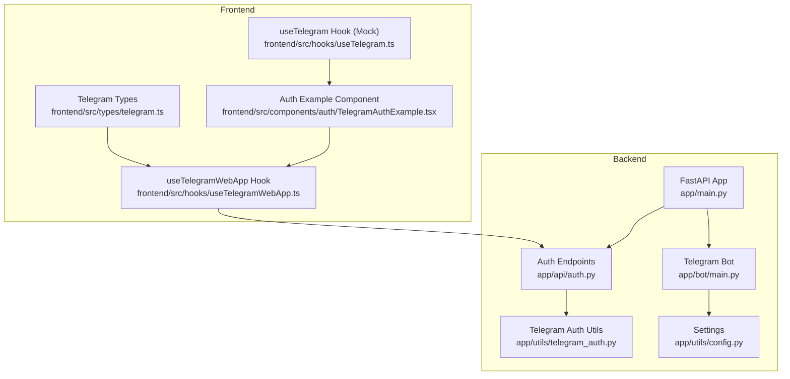
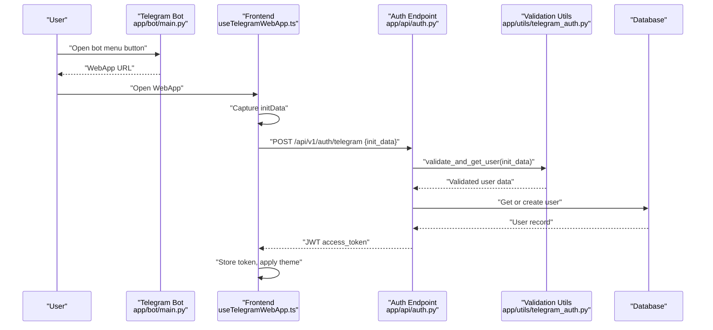
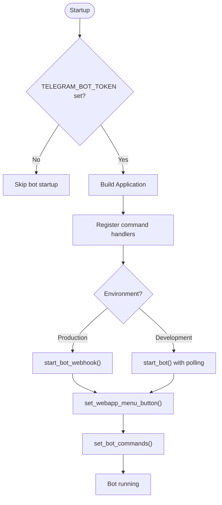
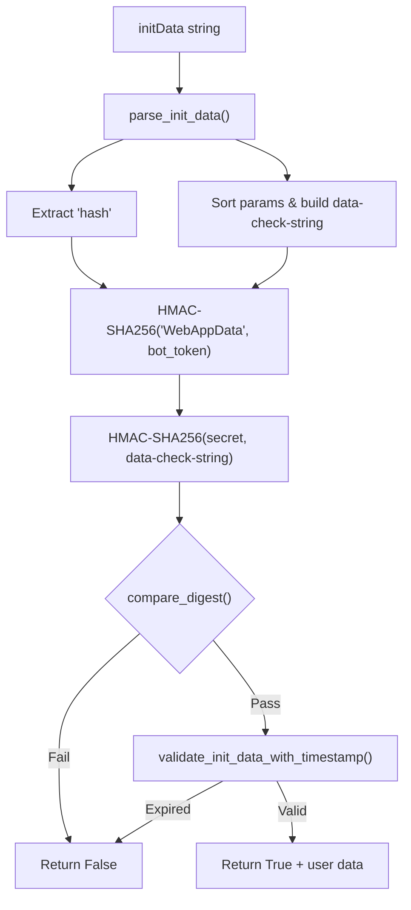
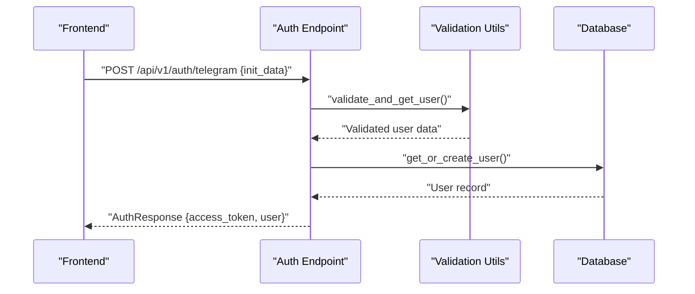
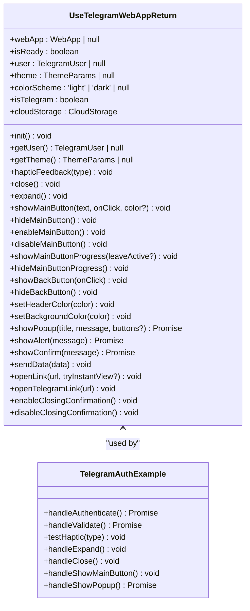
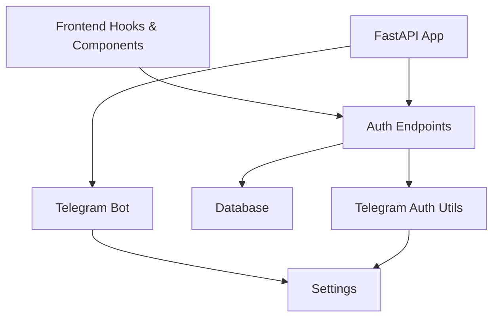

# Telegram Bot Integration

<cite>
**Referenced Files in This Document**
- [backend/app/main.py](file://backend/app/main.py)
- [backend/app/bot/main.py](file://backend/app/bot/main.py)
- [backend/app/bot/__init__.py](file://backend/app/bot/__init__.py)
- [backend/app/utils/telegram_auth.py](file://backend/app/utils/telegram_auth.py)
- [backend/app/api/auth.py](file://backend/app/api/auth.py)
- [backend/app/utils/config.py](file://backend/app/utils/config.py)
- [frontend/src/hooks/useTelegramWebApp.ts](file://frontend/src/hooks/useTelegramWebApp.ts)
- [frontend/src/hooks/useTelegram.ts](file://frontend/src/hooks/useTelegram.ts)
- [frontend/src/components/auth/TelegramAuthExample.tsx](file://frontend/src/components/auth/TelegramAuthExample.tsx)
- [frontend/src/types/telegram.ts](file://frontend/src/types/telegram.ts)
- [TELEGRAM_SETUP.md](file://TELEGRAM_SETUP.md)
- [README.md](file://README.md)
</cite>

## Table of Contents
1. [Introduction](#introduction)
2. [Project Structure](#project-structure)
3. [Core Components](#core-components)
4. [Architecture Overview](#architecture-overview)
5. [Detailed Component Analysis](#detailed-component-analysis)
6. [Dependency Analysis](#dependency-analysis)
7. [Performance Considerations](#performance-considerations)
8. [Troubleshooting Guide](#troubleshooting-guide)
9. [Conclusion](#conclusion)

## Introduction
This document explains the Telegram Bot Integration for FitTracker Pro, covering the Telegram WebApp authentication flow, bot menu button configuration, and seamless frontend-backend communication. It provides a comprehensive understanding of how users authenticate via Telegram WebApp, how the backend validates initData securely, and how the frontend integrates with Telegram Mini Apps APIs.

## Project Structure
The Telegram integration spans three primary areas:
- Backend: FastAPI application with Telegram bot lifecycle management and authentication endpoints
- Frontend: React hooks and components for Telegram WebApp integration and user experience
- Shared: Telegram WebApp types and setup documentation

**Diagram sources**
- [backend/app/main.py:51-87](file://backend/app/main.py#L51-L87)
- [backend/app/bot/main.py:224-364](file://backend/app/bot/main.py#L224-L364)
- [backend/app/api/auth.py:95-184](file://backend/app/api/auth.py#L95-L184)
- [backend/app/utils/telegram_auth.py:54-225](file://backend/app/utils/telegram_auth.py#L54-L225)
- [backend/app/utils/config.py:15-63](file://backend/app/utils/config.py#L15-L63)
- [frontend/src/hooks/useTelegramWebApp.ts:119-508](file://frontend/src/hooks/useTelegramWebApp.ts#L119-L508)
- [frontend/src/hooks/useTelegram.ts:36-117](file://frontend/src/hooks/useTelegram.ts#L36-L117)
- [frontend/src/components/auth/TelegramAuthExample.tsx:17-446](file://frontend/src/components/auth/TelegramAuthExample.tsx#L17-L446)
- [frontend/src/types/telegram.ts:10-390](file://frontend/src/types/telegram.ts#L10-L390)

**Section sources**
- [README.md:106-129](file://README.md#L106-L129)
- [TELEGRAM_SETUP.md:7-17](file://TELEGRAM_SETUP.md#L7-L17)

## Core Components
- Backend Telegram Bot Management: Initializes, starts, and stops the Telegram bot; sets menu button and commands; handles webhook updates
- Telegram Authentication Utilities: Validates Telegram WebApp initData using HMAC-SHA256 and timestamp checks
- Authentication API: Exposes endpoints for Telegram WebApp authentication, user retrieval, profile updates, token refresh, and logout
- Frontend Telegram WebApp Integration: Provides comprehensive hooks and components to integrate with Telegram Mini Apps APIs
- Configuration: Centralized settings for Telegram bot token, WebApp URL, and security parameters

Key responsibilities:
- Secure authentication via Telegram initData validation
- Seamless WebApp launch through bot menu button
- Real-time haptic feedback and UI controls in Telegram Mini Apps
- Token-based session management with refresh capabilities

**Section sources**
- [backend/app/bot/main.py:224-364](file://backend/app/bot/main.py#L224-L364)
- [backend/app/utils/telegram_auth.py:54-225](file://backend/app/utils/telegram_auth.py#L54-L225)
- [backend/app/api/auth.py:95-345](file://backend/app/api/auth.py#L95-L345)
- [frontend/src/hooks/useTelegramWebApp.ts:119-508](file://frontend/src/hooks/useTelegramWebApp.ts#L119-L508)
- [backend/app/utils/config.py:36-44](file://backend/app/utils/config.py#L36-L44)

## Architecture Overview
The Telegram integration follows a secure, layered architecture:
- Frontend captures Telegram WebApp initData and sends it to backend
- Backend validates initData using HMAC-SHA256 and timestamp constraints
- Backend creates or updates user records and issues JWT tokens
- Frontend stores tokens and interacts with WebApp UI controls

**Diagram sources**
- [backend/app/bot/main.py:31-54](file://backend/app/bot/main.py#L31-L54)
- [frontend/src/hooks/useTelegramWebApp.ts:165-174](file://frontend/src/hooks/useTelegramWebApp.ts#L165-L174)
- [backend/app/api/auth.py:95-184](file://backend/app/api/auth.py#L95-L184)
- [backend/app/utils/telegram_auth.py:172-204](file://backend/app/utils/telegram_auth.py#L172-L204)

## Detailed Component Analysis

### Backend Telegram Bot Management
The bot module manages the Telegram bot lifecycle:
- Configuration: Creates Application with token from settings
- Handlers: Registers command handlers for /start, /help, /stats, /settings
- Menu Button: Sets bot menu button to open WebApp URL
- Commands: Sets custom bot commands
- Startup: Supports polling mode (development) and webhook mode (production)
- Shutdown: Gracefully stops the bot

**Diagram sources**
- [backend/app/bot/main.py:224-364](file://backend/app/bot/main.py#L224-L364)
- [backend/app/main.py:57-73](file://backend/app/main.py#L57-L73)

**Section sources**
- [backend/app/bot/main.py:224-364](file://backend/app/bot/main.py#L224-L364)
- [backend/app/bot/__init__.py:5-22](file://backend/app/bot/__init__.py#L5-L22)

### Telegram Authentication Utilities
The validation utilities implement Telegram's recommended security checks:
- Parse initData query string into key-value pairs
- Extract and decode user JSON from initData
- Validate signature using HMAC-SHA256 with "WebAppData" key and bot token
- Enforce timestamp freshness (default 5 minutes)
- Provide combined validation and user extraction

**Diagram sources**
- [backend/app/utils/telegram_auth.py:54-156](file://backend/app/utils/telegram_auth.py#L54-L156)

**Section sources**
- [backend/app/utils/telegram_auth.py:54-225](file://backend/app/utils/telegram_auth.py#L54-L225)

### Authentication API Endpoints
The authentication endpoints provide a complete session lifecycle:
- POST /api/v1/auth/telegram: Validates initData, creates/updates user, returns JWT tokens
- GET /api/v1/auth/me: Returns current user profile (requires JWT)
- PUT /api/v1/auth/me: Updates user profile (requires JWT)
- POST /api/v1/auth/refresh: Issues new access token using refresh token
- POST /api/v1/auth/logout: Logs out user (placeholder for token blacklisting)

**Diagram sources**
- [backend/app/api/auth.py:95-184](file://backend/app/api/auth.py#L95-L184)
- [backend/app/utils/telegram_auth.py:172-204](file://backend/app/utils/telegram_auth.py#L172-L204)

**Section sources**
- [backend/app/api/auth.py:95-345](file://backend/app/api/auth.py#L95-L345)

### Frontend Telegram WebApp Integration
The frontend provides two complementary integration approaches:
- useTelegramWebApp: Full-featured hook for Telegram Mini Apps integration with theme, haptic feedback, UI controls, and cloud storage
- useTelegram: Mock hook for local development outside Telegram environment

Key features:
- Initialization and readiness management
- Theme parameter extraction and CSS variable application
- Haptic feedback for various interaction types
- Main button, back button, and popup controls
- Cloud storage operations for persistent preferences
- Safe fallbacks when not running in Telegram

**Diagram sources**
- [frontend/src/hooks/useTelegramWebApp.ts:25-95](file://frontend/src/hooks/useTelegramWebApp.ts#L25-L95)
- [frontend/src/components/auth/TelegramAuthExample.tsx:17-446](file://frontend/src/components/auth/TelegramAuthExample.tsx#L17-L446)

**Section sources**
- [frontend/src/hooks/useTelegramWebApp.ts:119-508](file://frontend/src/hooks/useTelegramWebApp.ts#L119-L508)
- [frontend/src/hooks/useTelegram.ts:36-117](file://frontend/src/hooks/useTelegram.ts#L36-L117)
- [frontend/src/components/auth/TelegramAuthExample.tsx:17-446](file://frontend/src/components/auth/TelegramAuthExample.tsx#L17-L446)
- [frontend/src/types/telegram.ts:10-390](file://frontend/src/types/telegram.ts#L10-L390)

### Configuration and Environment Setup
Centralized configuration manages Telegram and security settings:
- TELEGRAM_BOT_TOKEN: Bot token from BotFather
- TELEGRAM_WEBAPP_URL: Host URL for the WebApp
- SECRET_KEY and ACCESS_TOKEN_EXPIRE_MINUTES: Security and token lifetime settings
- ALLOWED_ORIGINS: CORS configuration for frontend origins

Environment variables and setup steps are documented in the Telegram setup guide.

**Section sources**
- [backend/app/utils/config.py:36-44](file://backend/app/utils/config.py#L36-L44)
- [TELEGRAM_SETUP.md:34-54](file://TELEGRAM_SETUP.md#L34-L54)

## Dependency Analysis
The integration exhibits clean separation of concerns with minimal coupling:
- Frontend depends on Telegram WebApp APIs and backend auth endpoints
- Backend depends on Telegram Bot SDK for bot management and Telegram Auth Utils for validation
- Configuration centralizes environment-specific settings
- Authentication API orchestrates validation, persistence, and token issuance

**Diagram sources**
- [backend/app/main.py:28-28](file://backend/app/main.py#L28-L28)
- [backend/app/bot/main.py:23-23](file://backend/app/bot/main.py#L23-L23)
- [backend/app/api/auth.py:12-24](file://backend/app/api/auth.py#L12-L24)
- [backend/app/utils/telegram_auth.py:11-11](file://backend/app/utils/telegram_auth.py#L11-L11)

**Section sources**
- [backend/app/main.py:14-28](file://backend/app/main.py#L14-L28)
- [backend/app/bot/main.py:9-23](file://backend/app/bot/main.py#L9-L23)
- [backend/app/api/auth.py:8-34](file://backend/app/api/auth.py#L8-L34)

## Performance Considerations
- Use webhook mode in production for lower latency and reduced resource usage compared to long-polling
- Implement token refresh to minimize repeated authentication requests
- Cache frequently accessed user data and settings where appropriate
- Validate initData timestamp constraints to prevent replay attacks and reduce unnecessary processing
- Apply theme and UI updates efficiently to avoid layout thrashing in Telegram Mini Apps

## Troubleshooting Guide
Common issues and resolutions:
- "Not running in Telegram WebApp": Ensure the app is opened via Telegram and window.Telegram.WebApp is available
- "Invalid hash signature": Verify TELEGRAM_BOT_TOKEN correctness and that initData has not been tampered with; ensure timestamp freshness
- Theme not applying: Call tg.init() before accessing theme parameters; confirm themeParams availability
- Haptic feedback not working: Confirm device supports haptic feedback and HapticFeedback API is accessible
- Bot menu button not set: Verify TELEGRAM_WEBAPP_URL is configured and accessible; check permissions in BotFather
- Webhook endpoint not receiving updates: Confirm webhook URL matches TELEGRAM_WEBAPP_URL plus /telegram/webhook; ensure SSL termination is handled by reverse proxy

**Section sources**
- [TELEGRAM_SETUP.md:257-275](file://TELEGRAM_SETUP.md#L257-L275)
- [backend/app/bot/main.py:38-54](file://backend/app/bot/main.py#L38-L54)
- [backend/app/main.py:151-166](file://backend/app/main.py#L151-L166)

## Conclusion
The Telegram Bot Integration in FitTracker Pro provides a secure, efficient, and user-friendly authentication mechanism leveraging Telegram WebApp APIs. The backend ensures robust initData validation and seamless user session management, while the frontend delivers a rich Telegram Mini Apps experience with theme-aware UI and haptic feedback. Proper configuration and adherence to security best practices guarantee a reliable integration suitable for production deployment.