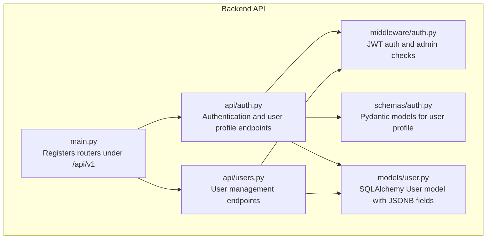
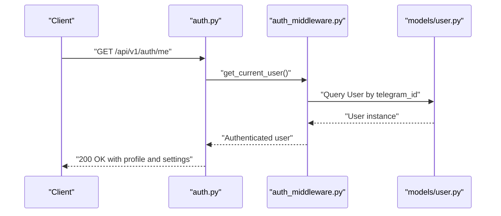
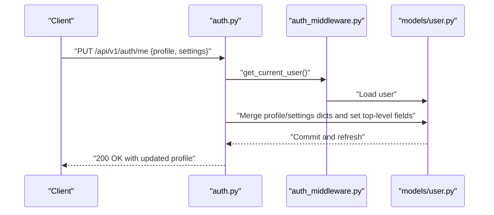
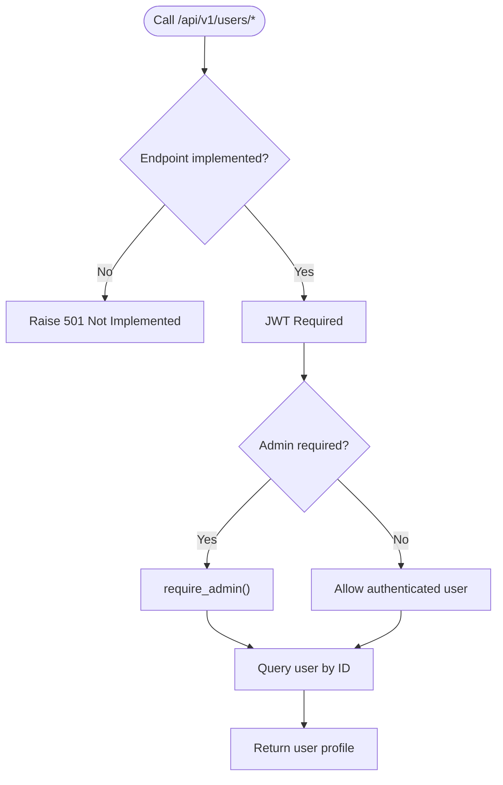
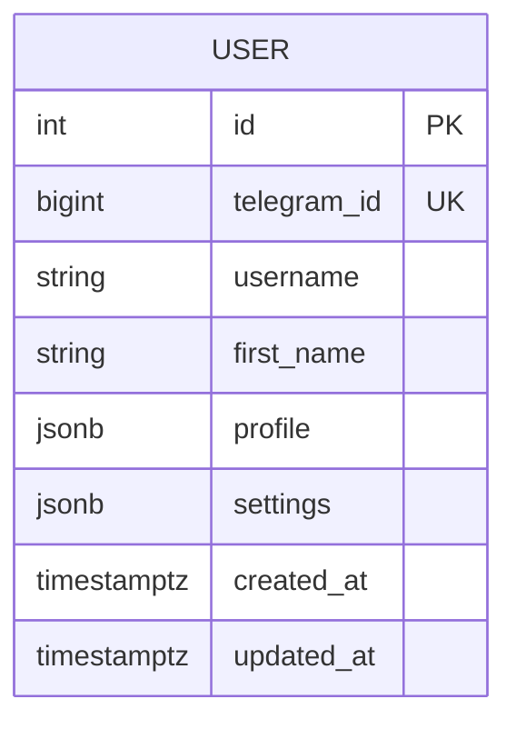
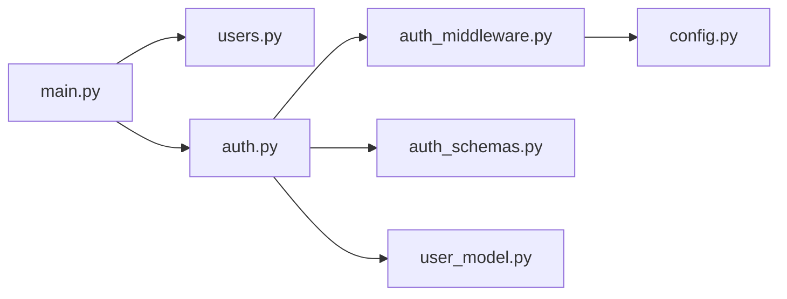

# User Management

<cite>
**Referenced Files in This Document**
- [main.py](file://backend/app/main.py)
- [users.py](file://backend/app/api/users.py)
- [auth.py](file://backend/app/api/auth.py)
- [auth_schemas.py](file://backend/app/schemas/auth.py)
- [user_model.py](file://backend/app/models/user.py)
- [auth_middleware.py](file://backend/app/middleware/auth.py)
- [config.py](file://backend/app/utils/config.py)
- [test_users.py](file://backend/app/tests/test_users.py)
</cite>

## Table of Contents
1. [Introduction](#introduction)
2. [Project Structure](#project-structure)
3. [Core Components](#core-components)
4. [Architecture Overview](#architecture-overview)
5. [Detailed Component Analysis](#detailed-component-analysis)
6. [Dependency Analysis](#dependency-analysis)
7. [Performance Considerations](#performance-considerations)
8. [Troubleshooting Guide](#troubleshooting-guide)
9. [Conclusion](#conclusion)

## Introduction
This document provides comprehensive API documentation for user management endpoints in the FitTracker Pro backend. It focuses on:
- Retrieving user profile data
- Updating user information
- Administrative access to user records
It also documents request/response schemas, validation rules, permissions, error handling, and privacy considerations.

## Project Structure
The user management functionality spans several modules:
- API routers for user and authentication endpoints
- Pydantic schemas for request/response validation
- SQLAlchemy model representing user data, including JSONB fields for profile and settings
- Authentication middleware for JWT-based access control and admin enforcement
- Application entry point wiring routers under the /api/v1 namespace

**Diagram sources**
- [main.py:89-106](file://backend/app/main.py#L89-L106)
- [auth.py:36](file://backend/app/api/auth.py#L36)
- [users.py:9](file://backend/app/api/users.py#L9)
- [auth_middleware.py:133](file://backend/app/middleware/auth.py#L133)
- [auth_schemas.py](file://backend/app/schemas/auth.py)
- [user_model.py:23](file://backend/app/models/user.py#L23)

**Section sources**
- [main.py:89-106](file://backend/app/main.py#L89-L106)

## Core Components
- Authentication and user profile endpoints:
  - GET /api/v1/auth/me retrieves the authenticated user’s profile, including profile and settings JSONB fields.
  - PUT /api/v1/auth/me updates the authenticated user’s profile and settings.
- User management endpoints (as defined in router and tests):
  - GET /api/v1/users/me retrieves the authenticated user’s profile.
  - PUT /api/v1/users/me updates the authenticated user’s profile and settings.
  - GET /api/v1/users/{user_id} is intended for admin access to retrieve another user’s profile.

Notes:
- The current implementation in the users router exposes placeholders for GET /api/v1/users/me and GET /api/v1/users/{user_id}. These endpoints are not implemented and raise “not implemented” errors.
- The tests indicate a PATCH endpoint for updating user profile, but the current implementation uses PUT /api/v1/auth/me for profile updates.

**Section sources**
- [auth.py:186-272](file://backend/app/api/auth.py#L186-L272)
- [users.py:47-64](file://backend/app/api/users.py#L47-L64)
- [test_users.py:6-33](file://backend/app/tests/test_users.py#L6-L33)

## Architecture Overview
The user management flow integrates authentication, authorization, and data persistence.

**Diagram sources**
- [auth.py:186](file://backend/app/api/auth.py#L186)
- [auth_middleware.py:174-202](file://backend/app/middleware/auth.py#L174-L202)
- [user_model.py:23-128](file://backend/app/models/user.py#L23-L128)

## Detailed Component Analysis

### Authentication and User Profile Endpoints
- GET /api/v1/auth/me
  - Purpose: Retrieve the authenticated user’s profile, including profile and settings JSONB fields.
  - Authentication: Requires a valid Bearer token.
  - Response: UserProfileResponse model containing user metadata and JSONB fields.
  - Implementation: Depends on get_current_user to resolve the authenticated user from the JWT subject.
- PUT /api/v1/auth/me
  - Purpose: Update the authenticated user’s profile and settings.
  - Authentication: Requires a valid Bearer token.
  - Request: UserProfileUpdate model supports partial updates (exclude_unset).
  - Behavior: Updates top-level fields and merges nested profile/settings dictionaries.
  - Response: Updated UserProfileResponse.

**Diagram sources**
- [auth.py:225-272](file://backend/app/api/auth.py#L225-L272)
- [auth_middleware.py:174-202](file://backend/app/middleware/auth.py#L174-L202)
- [user_model.py:49-70](file://backend/app/models/user.py#L49-L70)

**Section sources**
- [auth.py:186-272](file://backend/app/api/auth.py#L186-L272)
- [auth_schemas.py](file://backend/app/schemas/auth.py)
- [auth_middleware.py:133-202](file://backend/app/middleware/auth.py#L133-L202)
- [user_model.py:49-70](file://backend/app/models/user.py#L49-L70)

### User Management Endpoints (Current State)
- GET /api/v1/users/me
  - Purpose: Retrieve the authenticated user’s profile.
  - Current Status: Not implemented; raises a “not implemented” error.
- PUT /api/v1/users/me
  - Purpose: Update the authenticated user’s profile and settings.
  - Current Status: Not implemented; placeholder exists.
- GET /api/v1/users/{user_id}
  - Purpose: Admin-only retrieval of another user’s profile.
  - Current Status: Not implemented; placeholder exists.

**Diagram sources**
- [users.py:47-64](file://backend/app/api/users.py#L47-L64)
- [auth_middleware.py:225-250](file://backend/app/middleware/auth.py#L225-L250)

**Section sources**
- [users.py:47-64](file://backend/app/api/users.py#L47-L64)
- [auth_middleware.py:225-250](file://backend/app/middleware/auth.py#L225-L250)

### Data Models and JSONB Fields
The User model defines two JSONB fields:
- profile: Stores equipment, limitations, and goals.
- settings: Stores theme, notifications, and units.

These fields are merged during updates to preserve unspecified keys.

**Diagram sources**
- [user_model.py:30-81](file://backend/app/models/user.py#L30-L81)

**Section sources**
- [user_model.py:49-70](file://backend/app/models/user.py#L49-L70)

### Request/Response Schemas
- UserProfileUpdate (request): Supports partial updates for top-level fields and nested profile/settings dictionaries.
- UserProfileResponse (response): Includes user metadata and JSONB fields.

Validation behavior:
- Partial updates exclude unset fields.
- Nested profile/settings are merged with existing values.

**Section sources**
- [auth_schemas.py](file://backend/app/schemas/auth.py)
- [auth.py:256-271](file://backend/app/api/auth.py#L256-L271)

## Dependency Analysis
- Router registration:
  - Users router is included under /api/v1/users.
- Authentication dependencies:
  - get_current_user_id extracts user_id from Bearer token.
  - get_current_user resolves the User model from the database using telegram_id.
  - require_admin enforces admin privileges using configured admin IDs.
- Configuration:
  - SECRET_KEY, ALGORITHM, ACCESS_TOKEN_EXPIRE_MINUTES define JWT behavior.
  - ADMIN_USER_IDS controls admin enforcement.

**Diagram sources**
- [main.py:89-106](file://backend/app/main.py#L89-L106)
- [auth.py:36](file://backend/app/api/auth.py#L36)
- [users.py:9](file://backend/app/api/users.py#L9)
- [auth_middleware.py:133-250](file://backend/app/middleware/auth.py#L133-L250)
- [config.py:15-55](file://backend/app/utils/config.py#L15-L55)

**Section sources**
- [main.py:89-106](file://backend/app/main.py#L89-L106)
- [auth_middleware.py:133-250](file://backend/app/middleware/auth.py#L133-L250)
- [config.py:15-55](file://backend/app/utils/config.py#L15-L55)

## Performance Considerations
- JSONB updates: Merging nested dictionaries avoids full replacement; ensure minimal write amplification by sending only changed fields.
- JWT verification: Keep token verification lightweight; avoid unnecessary database lookups per request.
- Pagination: If implementing listing endpoints, add pagination to limit response sizes.
- Caching: Consider caching read-only user metadata for frequently accessed endpoints.

## Troubleshooting Guide
Common errors and resolutions:
- 401 Unauthorized
  - Cause: Missing or invalid Bearer token.
  - Resolution: Ensure Authorization header uses Bearer scheme and contains a valid, unexpired token.
- 403 Forbidden
  - Cause: Admin-only endpoint accessed by non-admin user.
  - Resolution: Confirm the user’s telegram_id is included in ADMIN_USER_IDS.
- 404 Not Found
  - Cause: User not found by telegram_id.
  - Resolution: Verify token corresponds to an existing user record.
- 501 Not Implemented
  - Cause: GET /api/v1/users/me and GET /api/v1/users/{user_id} are placeholders.
  - Resolution: Implement endpoints or route clients to /api/v1/auth/me for profile access.

Operational tips:
- Use /api/v1/auth/me for profile retrieval and updates until users endpoints are implemented.
- Validate request payloads against UserProfileUpdate to prevent malformed JSONB structures.

**Section sources**
- [auth_middleware.py:148-202](file://backend/app/middleware/auth.py#L148-L202)
- [auth_middleware.py:242-248](file://backend/app/middleware/auth.py#L242-L248)
- [users.py:51-64](file://backend/app/api/users.py#L51-L64)

## Conclusion
- The authentication and user profile endpoints (GET/PUT /api/v1/auth/me) are fully implemented and support JSONB-based profile and settings management.
- The users endpoints currently serve as placeholders and should be implemented to support administrative access and user management workflows.
- Robust JWT-based authentication and admin enforcement are in place, with clear error responses for unauthorized and forbidden actions.
- Privacy and data protection are addressed by restricting access to authenticated users and enforcing admin-only routes for cross-user operations.