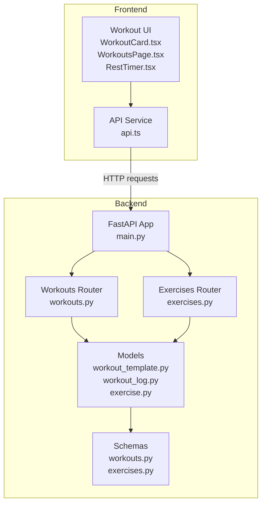
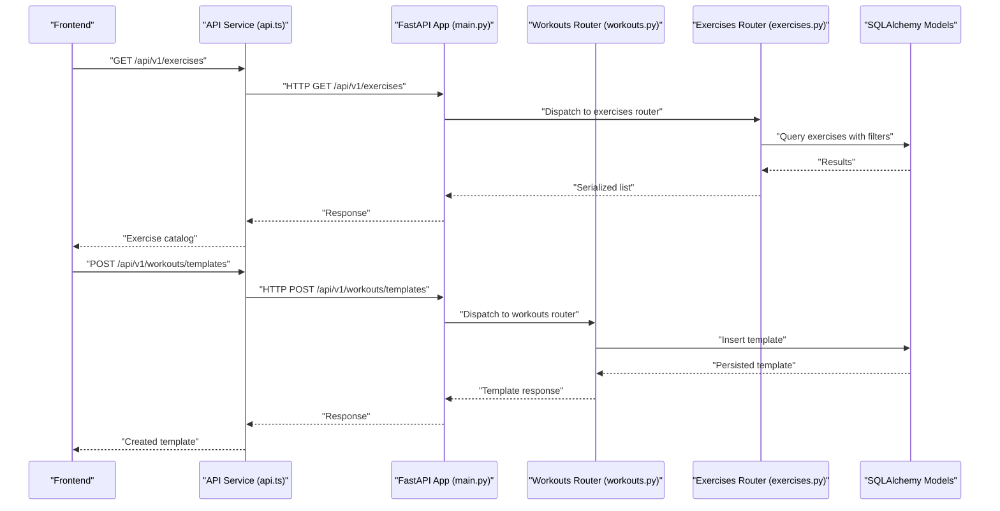
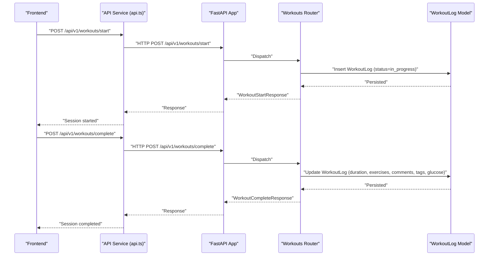
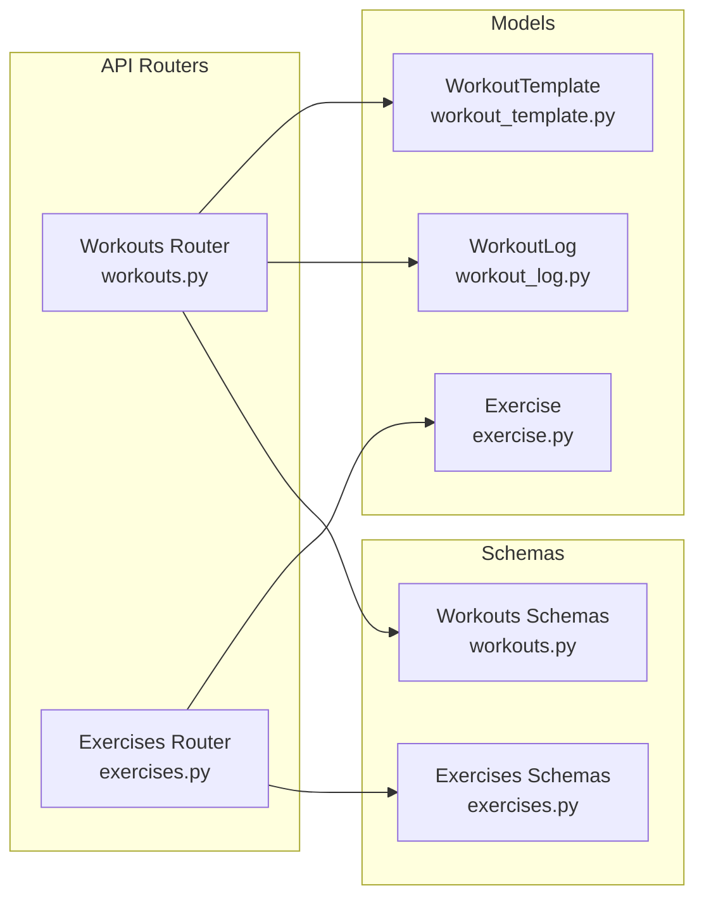
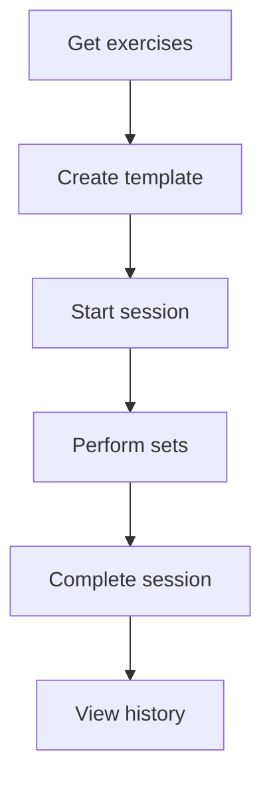

# Workout Tracking

<cite>
**Referenced Files in This Document**
- [workouts.py](file://backend/app/api/workouts.py)
- [workout_template.py](file://backend/app/models/workout_template.py)
- [workout_log.py](file://backend/app/models/workout_log.py)
- [workouts.py](file://backend/app/schemas/workouts.py)
- [exercises.py](file://backend/app/api/exercises.py)
- [exercise.py](file://backend/app/models/exercise.py)
- [exercises.py](file://backend/app/schemas/exercises.py)
- [main.py](file://backend/app/main.py)
- [api.ts](file://frontend/src/services/api.ts)
- [WorkoutCard.tsx](file://frontend/src/components/home/WorkoutCard.tsx)
- [WorkoutsPage.tsx](file://frontend/src/pages/WorkoutsPage.tsx)
- [RestTimer.tsx](file://frontend/src/components/workout/RestTimer.tsx)
</cite>

## Table of Contents
1. [Introduction](#introduction)
2. [Project Structure](#project-structure)
3. [Core Components](#core-components)
4. [Architecture Overview](#architecture-overview)
5. [Detailed Component Analysis](#detailed-component-analysis)
6. [Dependency Analysis](#dependency-analysis)
7. [Performance Considerations](#performance-considerations)
8. [Troubleshooting Guide](#troubleshooting-guide)
9. [Conclusion](#conclusion)
10. [Appendices](#appendices)

## Introduction
This document provides comprehensive API documentation for the workout tracking functionality. It covers:
- Exercise catalog retrieval via GET /api/v1/exercises
- Workout template management via GET /api/v1/workouts/templates, POST /api/v1/workouts/templates, and related CRUD endpoints
- Workout session lifecycle via POST /api/v1/workouts/start and POST /api/v1/workouts/complete
- Workout history retrieval via GET /api/v1/workouts/history
- Supporting schemas for templates, exercises, and completion logs
- Practical workflows from selecting a template to completing a session

The backend is a FastAPI application with SQLAlchemy ORM models and Pydantic schemas. The frontend is a Telegram Mini App built with React and TypeScript, integrating with the backend via an Axios-based API service.

## Project Structure
The workout tracking feature spans backend API routes, models, and schemas, along with frontend components that orchestrate the user experience.

**Diagram sources**
- [main.py:90-106](file://backend/app/main.py#L90-L106)
- [workouts.py:26](file://backend/app/api/workouts.py#L26)
- [exercises.py:21](file://backend/app/api/exercises.py#L21)
- [workout_template.py:18](file://backend/app/models/workout_template.py#L18)
- [workout_log.py:19](file://backend/app/models/workout_log.py#L19)
- [exercise.py:17](file://backend/app/models/exercise.py#L17)
- [workouts.py:14](file://backend/app/schemas/workouts.py#L14)
- [exercises.py:13](file://backend/app/schemas/exercises.py#L13)
- [api.ts:47-65](file://frontend/src/services/api.ts#L47-L65)
- [WorkoutCard.tsx:27](file://frontend/src/components/home/WorkoutCard.tsx#L27)
- [WorkoutsPage.tsx:21](file://frontend/src/pages/WorkoutsPage.tsx#L21)
- [RestTimer.tsx:115](file://frontend/src/components/workout/RestTimer.tsx#L115)

**Section sources**
- [main.py:90-106](file://backend/app/main.py#L90-L106)
- [workouts.py:26](file://backend/app/api/workouts.py#L26)
- [exercises.py:21](file://backend/app/api/exercises.py#L21)

## Core Components
- Workouts Router: Implements template management, session lifecycle, and history endpoints.
- Exercises Router: Provides the exercise catalog with filtering and metadata.
- Models: Define persistent structures for templates, logs, and exercises.
- Schemas: Define request/response shapes validated by Pydantic.
- Frontend API Service: Centralized HTTP client adding auth headers and interceptors.
- Frontend Components: Provide UI for template browsing, starting sessions, and timing rest periods.

Key endpoints:
- GET /api/v1/exercises
- GET /api/v1/workouts/templates
- POST /api/v1/workouts/templates
- GET /api/v1/workouts/templates/{template_id}
- PUT /api/v1/workouts/templates/{template_id}
- DELETE /api/v1/workouts/templates/{template_id}
- POST /api/v1/workouts/start
- POST /api/v1/workouts/complete
- GET /api/v1/workouts/history
- GET /api/v1/workouts/history/{workout_id}

**Section sources**
- [workouts.py:29-105](file://backend/app/api/workouts.py#L29-L105)
- [workouts.py:165-258](file://backend/app/api/workouts.py#L165-L258)
- [workouts.py:337-493](file://backend/app/api/workouts.py#L337-L493)
- [workouts.py:260-334](file://backend/app/api/workouts.py#L260-L334)
- [workouts.py:496-521](file://backend/app/api/workouts.py#L496-L521)
- [exercises.py:24-140](file://backend/app/api/exercises.py#L24-L140)

## Architecture Overview
The backend exposes REST endpoints under /api/v1 prefixed by routers. Authentication requires a Bearer token for most endpoints. The workouts router orchestrates template storage and session logging, while the exercises router supplies the exercise catalog. The frontend consumes these endpoints to drive the user workflow.

**Diagram sources**
- [main.py:90-106](file://backend/app/main.py#L90-L106)
- [exercises.py:24-140](file://backend/app/api/exercises.py#L24-L140)
- [workouts.py:108-162](file://backend/app/api/workouts.py#L108-L162)

## Detailed Component Analysis

### Exercise Catalog API
Purpose: Retrieve the exercise library with filtering and pagination.

- Endpoint: GET /api/v1/exercises
- Query parameters:
  - category: Filter by category (strength, cardio, flexibility, balance, sport)
  - muscle_group: Filter by target muscle group
  - equipment: Filter by required equipment
  - search: Text search across name and description
  - status: Filter by status (active, pending, archived, all)
  - page, page_size: Pagination controls
- Response: ExerciseListResponse with items, total, page, page_size, and applied filters.

Request schema highlights:
- ExerciseFilterParams defines category, muscle_group, equipment, search, status, page, page_size.

Response schema highlights:
- ExerciseResponse includes id, name, description, category, equipment, muscle_groups, risk_flags, media_url, status, author_user_id, created_at, updated_at.
- ExerciseListResponse wraps items and metadata.

Notes:
- Risk flags are embedded as a structured JSON object with boolean fields.
- Filtering supports OR-like search across name/description.

**Section sources**
- [exercises.py:24-140](file://backend/app/api/exercises.py#L24-L140)
- [exercises.py:10-84](file://backend/app/schemas/exercises.py#L10-L84)
- [exercise.py:17-116](file://backend/app/models/exercise.py#L17-L116)

### Workout Template Management API
Purpose: Manage reusable workout templates per user.

Endpoints:
- GET /api/v1/workouts/templates
  - Query: page, page_size, template_type (cardio, strength, flexibility, mixed)
  - Response: WorkoutTemplateList with items, total, page, page_size
- POST /api/v1/workouts/templates
  - Request: WorkoutTemplateCreate (name, type, exercises, is_public)
  - Response: WorkoutTemplateResponse
- GET /api/v1/workouts/templates/{template_id}
- PUT /api/v1/workouts/templates/{template_id}
- DELETE /api/v1/workouts/templates/{template_id}

Request/response schemas:
- WorkoutTemplateCreate: name, type, exercises[], is_public
- WorkoutTemplateResponse: id, user_id, name, type, exercises[], is_public, created_at, updated_at
- WorkoutTemplateList: items[], total, page, page_size

Exercise structure inside templates:
- ExerciseInTemplate: exercise_id, name, sets, reps, duration, rest_seconds, weight, notes

Data model:
- WorkoutTemplate: JSONB exercises array, foreign key to User, indexes on user_id, type, is_public, created_at.

**Section sources**
- [workouts.py:29-105](file://backend/app/api/workouts.py#L29-L105)
- [workouts.py:108-162](file://backend/app/api/workouts.py#L108-L162)
- [workouts.py:165-258](file://backend/app/api/workouts.py#L165-L258)
- [workouts.py:50-70](file://backend/app/schemas/workouts.py#L50-L70)
- [workouts.py:42-48](file://backend/app/schemas/workouts.py#L42-L48)
- [workouts.py:10-22](file://backend/app/schemas/workouts.py#L10-L22)
- [workout_template.py:18-83](file://backend/app/models/workout_template.py#L18-L83)

### Workout Session Lifecycle API
Purpose: Start and complete workout sessions, optionally using a template.

Endpoints:
- POST /api/v1/workouts/start
  - Request: WorkoutStartRequest (template_id?, name?, type?)
  - Response: WorkoutStartResponse (id, user_id, template_id?, date, start_time, status=in_progress, message)
- POST /api/v1/workouts/complete
  - Request: WorkoutCompleteRequest (duration, exercises[], comments?, tags[], glucose_before?, glucose_after?)
  - Response: WorkoutCompleteResponse (id, user_id, template_id?, date, duration, exercises[], comments?, tags[], glucose_before?, glucose_after?, completed_at, message)

Schema details:
- WorkoutStartRequest: template_id optional, name optional, type default custom with allowed values
- WorkoutCompleteRequest: duration minutes, exercises (each CompletedExercise with sets_completed array), optional metadata
- CompletedExercise: exercise_id, name, sets_completed[], notes?
- CompletedSet: set_number, reps, weight, duration, completed
- WorkoutStartResponse: standardized fields with status and message
- WorkoutCompleteResponse: mirrors logged fields plus timestamps

Data model:
- WorkoutLog: JSONB exercises, duration minutes, comments, tags, glucose_before/after, foreign keys to User and optional WorkoutTemplate, indexed fields for efficient queries.

**Diagram sources**
- [workouts.py:337-493](file://backend/app/api/workouts.py#L337-L493)
- [workout_log.py:19-112](file://backend/app/models/workout_log.py#L19-L112)
- [workouts.py:72-121](file://backend/app/schemas/workouts.py#L72-L121)

**Section sources**
- [workouts.py:337-493](file://backend/app/api/workouts.py#L337-L493)
- [workout_log.py:19-112](file://backend/app/models/workout_log.py#L19-L112)
- [workouts.py:72-121](file://backend/app/schemas/workouts.py#L72-L121)

### Workout History API
Purpose: Retrieve historical workout entries with optional date range filtering.

- Endpoint: GET /api/v1/workouts/history
- Query parameters:
  - page, page_size
  - date_from, date_to (YYYY-MM-DD)
- Response: WorkoutHistoryResponse with items[], total, page, page_size, and date range bounds

Each item includes:
- id, date, duration, exercises[], comments?, tags[], glucose_before?, glucose_after?, created_at

Detail endpoint:
- GET /api/v1/workouts/history/{workout_id}: Returns a single workout history item

**Section sources**
- [workouts.py:260-334](file://backend/app/api/workouts.py#L260-L334)
- [workouts.py:496-521](file://backend/app/api/workouts.py#L496-L521)
- [workouts.py:123-146](file://backend/app/schemas/workouts.py#L123-L146)

### Exercise Metadata and Risk Flags
The exercise catalog embeds rich metadata:
- Category, equipment, muscle groups, risk flags, media URL, status, author association
- Risk flags are a structured JSON object with boolean fields for common health considerations

These fields inform safe exercise selection and help tailor templates to user needs.

**Section sources**
- [exercise.py:17-116](file://backend/app/models/exercise.py#L17-L116)
- [exercises.py:25-32](file://backend/app/schemas/exercises.py#L25-L32)

### Performance Metrics Calculation
The backend does not compute derived metrics (e.g., 1RM, TDEE) in the provided code. Any calculations are expected to be handled by the frontend or analytics services. The workout logs capture raw data (sets, reps, weight, duration) that can be used for downstream analytics.

[No sources needed since this section provides general guidance]

## Dependency Analysis
The following diagram shows key dependencies among components involved in workout tracking.

**Diagram sources**
- [workouts.py:26](file://backend/app/api/workouts.py#L26)
- [exercises.py:21](file://backend/app/api/exercises.py#L21)
- [workout_template.py:18](file://backend/app/models/workout_template.py#L18)
- [workout_log.py:19](file://backend/app/models/workout_log.py#L19)
- [exercise.py:17](file://backend/app/models/exercise.py#L17)
- [workouts.py:14](file://backend/app/schemas/workouts.py#L14)
- [exercises.py:13](file://backend/app/schemas/exercises.py#L13)

**Section sources**
- [workouts.py:26](file://backend/app/api/workouts.py#L26)
- [exercises.py:21](file://backend/app/api/exercises.py#L21)
- [workout_template.py:18](file://backend/app/models/workout_template.py#L18)
- [workout_log.py:19](file://backend/app/models/workout_log.py#L19)
- [exercise.py:17](file://backend/app/models/exercise.py#L17)
- [workouts.py:14](file://backend/app/schemas/workouts.py#L14)
- [exercises.py:13](file://backend/app/schemas/exercises.py#L13)

## Performance Considerations
- Pagination: All list endpoints support page/page_size with reasonable upper bounds to prevent heavy queries.
- Indexing: Models define indexes on frequently filtered/sorted fields (user_id, type, status, dates) to optimize queries.
- JSONB storage: Templates and logs store flexible arrays/objects; ensure appropriate indexing and avoid overly large payloads.
- Asynchronous I/O: SQLAlchemy async sessions are used, enabling non-blocking database operations.

[No sources needed since this section provides general guidance]

## Troubleshooting Guide
Common issues and resolutions:
- Authentication failures: Ensure Authorization: Bearer <access_token> is present for protected endpoints.
- Not found errors:
  - Template not found: Verify template_id ownership and existence.
  - Workout not found: Confirm workout_id belongs to the current user.
- Validation errors: Review request schemas for required fields, numeric ranges, and allowed values.
- Rate limiting: Responses may include X-RateLimit-* headers; adjust client retry/backoff accordingly.

**Section sources**
- [workouts.py:184-188](file://backend/app/api/workouts.py#L184-L188)
- [workouts.py:463-467](file://backend/app/api/workouts.py#L463-L467)
- [workouts.py:373-389](file://backend/app/api/workouts.py#L373-L389)

## Conclusion
The workout tracking system provides a robust foundation for managing exercise catalogs, creating and using workout templates, and logging sessions with rich metadata. The modular design separates concerns between templates, logs, and exercises, while the frontend integrates seamlessly with the backend via a typed API service. Extending analytics and metrics computation can be done independently, leveraging the structured data captured in workout logs.

[No sources needed since this section summarizes without analyzing specific files]

## Appendices

### API Reference: Exercise Catalog
- Method: GET
- Path: /api/v1/exercises
- Query parameters:
  - category: strength|cardio|flexibility|balance|sport
  - muscle_group: string
  - equipment: string
  - search: string (max length 100)
  - status: active|pending|archived|all
  - page: integer ≥ 1
  - page_size: integer (1-100)
- Response: ExerciseListResponse

**Section sources**
- [exercises.py:24-140](file://backend/app/api/exercises.py#L24-L140)

### API Reference: Workout Templates
- GET /api/v1/workouts/templates
  - Query: page, page_size, template_type
  - Response: WorkoutTemplateList
- POST /api/v1/workouts/templates
  - Body: WorkoutTemplateCreate
  - Response: WorkoutTemplateResponse

**Section sources**
- [workouts.py:29-105](file://backend/app/api/workouts.py#L29-L105)
- [workouts.py:108-162](file://backend/app/api/workouts.py#L108-L162)

### API Reference: Workout Sessions
- POST /api/v1/workouts/start
  - Body: WorkoutStartRequest
  - Response: WorkoutStartResponse
- POST /api/v1/workouts/complete
  - Body: WorkoutCompleteRequest
  - Response: WorkoutCompleteResponse

**Section sources**
- [workouts.py:337-493](file://backend/app/api/workouts.py#L337-L493)

### API Reference: Workout History
- GET /api/v1/workouts/history
  - Query: page, page_size, date_from, date_to
  - Response: WorkoutHistoryResponse
- GET /api/v1/workouts/history/{workout_id}
  - Response: WorkoutHistoryItem

**Section sources**
- [workouts.py:260-334](file://backend/app/api/workouts.py#L260-L334)
- [workouts.py:496-521](file://backend/app/api/workouts.py#L496-L521)

### Example Workflows

#### Workflow 1: Template-Based Strength Session
1. Fetch exercise catalog to build a template:
   - GET /api/v1/exercises?category=strength&page=1&page_size=20
2. Create a template:
   - POST /api/v1/workouts/templates with exercises[]
3. Start session using the template:
   - POST /api/v1/workouts/start with template_id and optional name/type
4. During workout, use RestTimer for rest intervals (frontend component).
5. Complete session:
   - POST /api/v1/workouts/complete with duration, exercises[], comments, tags, glucose values

[No sources needed since this diagram shows conceptual workflow, not actual code structure]

#### Workflow 2: Custom Cardio Session
1. Start session without template:
   - POST /api/v1/workouts/start with type=cardio and optional name
2. Complete session:
   - POST /api/v1/workouts/complete with duration and exercise details
3. Review history:
   - GET /api/v1/workouts/history?page=1&page_size=20

**Section sources**
- [workouts.py:337-493](file://backend/app/api/workouts.py#L337-L493)
- [workouts.py:260-334](file://backend/app/api/workouts.py#L260-L334)

### Frontend Integration Notes
- Authentication: api.ts adds Authorization header automatically.
- UI components:
  - WorkoutCard.tsx renders templates and triggers start actions.
  - WorkoutsPage.tsx displays recent workouts and summaries.
  - RestTimer.tsx provides precise rest timing during sessions.

**Section sources**
- [api.ts:21-45](file://frontend/src/services/api.ts#L21-L45)
- [WorkoutCard.tsx:27](file://frontend/src/components/home/WorkoutCard.tsx#L27)
- [WorkoutsPage.tsx:21](file://frontend/src/pages/WorkoutsPage.tsx#L21)
- [RestTimer.tsx:115](file://frontend/src/components/workout/RestTimer.tsx#L115)