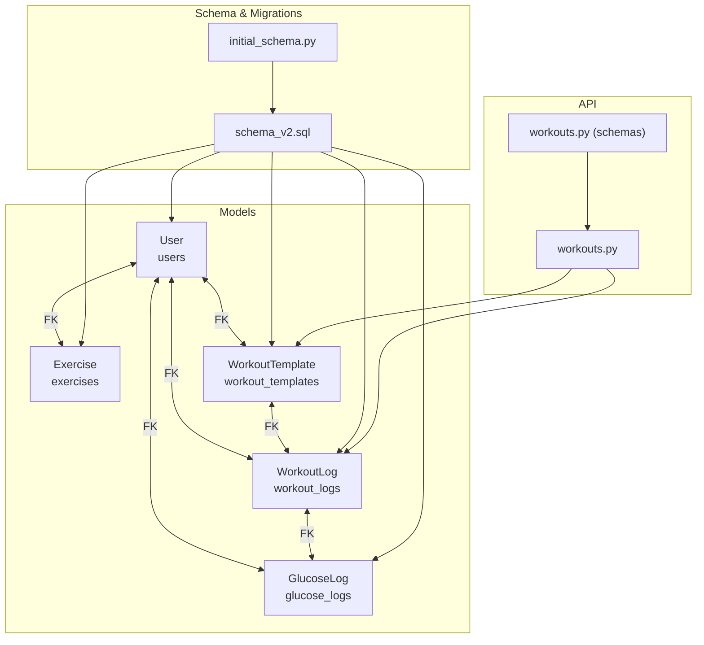
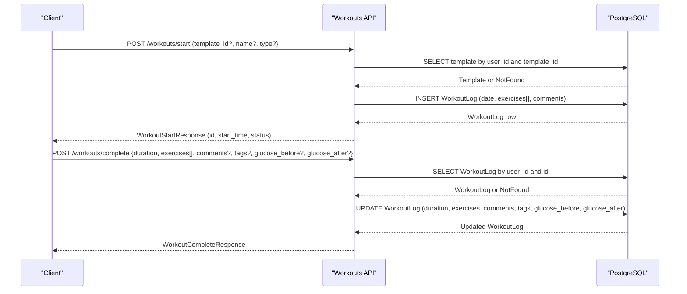
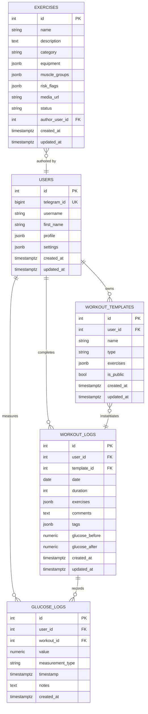

# Core Models

<cite>
**Referenced Files in This Document**
- [user.py](file://backend/app/models/user.py)
- [exercise.py](file://backend/app/models/exercise.py)
- [workout_template.py](file://backend/app/models/workout_template.py)
- [workout_log.py](file://backend/app/models/workout_log.py)
- [glucose_log.py](file://backend/app/models/glucose_log.py)
- [base.py](file://backend/app/models/base.py)
- [schema_v2.sql](file://database/schema_v2.sql)
- [cd723942379e_initial_schema.py](file://database/migrations/versions/ce723942379e_initial_schema.py)
- [workouts.py](file://backend/app/api/workouts.py)
- [workouts.py (schemas)](file://backend/app/schemas/workouts.py)
</cite>

## Table of Contents
1. [Introduction](#introduction)
2. [Project Structure](#project-structure)
3. [Core Components](#core-components)
4. [Architecture Overview](#architecture-overview)
5. [Detailed Component Analysis](#detailed-component-analysis)
6. [Dependency Analysis](#dependency-analysis)
7. [Performance Considerations](#performance-considerations)
8. [Troubleshooting Guide](#troubleshooting-guide)
9. [Conclusion](#conclusion)

## Introduction
This document provides comprehensive data model documentation for FitTracker Pro’s core entities. It focuses on:
- User model with Telegram integration, JSONB profile storage, and settings management
- Exercise model with equipment categorization, muscle groups targeting, risk flags, and author relationships
- WorkoutTemplate structure for exercise catalogs and workout creation workflows
- WorkoutLog model for session tracking, exercise completion data, and glucose monitoring integration

It details field definitions, data types, validation rules, business logic, foreign key relationships, indexing strategies, and performance optimizations. It also includes examples of data structures and common query patterns derived from the API and schema.

## Project Structure
FitTracker Pro organizes models under backend/app/models, with SQLAlchemy declarative base and Postgres-specific JSONB and GIN indexing. Database schema and migrations are defined in database/schema_v2.sql and database/migrations/versions/*. The API layer exposes workout-related endpoints that operate against these models.

**Diagram sources**
- [user.py:23-132](file://backend/app/models/user.py#L23-L132)
- [exercise.py:17-116](file://backend/app/models/exercise.py#L17-L116)
- [workout_template.py:18-83](file://backend/app/models/workout_template.py#L18-L83)
- [workout_log.py:19-112](file://backend/app/models/workout_log.py#L19-L112)
- [glucose_log.py:18-80](file://backend/app/models/glucose_log.py#L18-L80)
- [schema_v2.sql:10-598](file://database/schema_v2.sql#L10-L598)
- [cd723942379e_initial_schema.py:26-460](file://database/migrations/versions/ce723942379e_initial_schema.py#L26-L460)
- [workouts.py:29-522](file://backend/app/api/workouts.py#L29-L522)
- [workouts.py (schemas):10-146](file://backend/app/schemas/workouts.py#L10-L146)

**Section sources**
- [base.py:1-7](file://backend/app/models/base.py#L1-L7)
- [schema_v2.sql:1-598](file://database/schema_v2.sql#L1-L598)
- [cd723942379e_initial_schema.py:1-460](file://database/migrations/versions/ce723942379e_initial_schema.py#L1-L460)

## Core Components
This section summarizes the four core models and their roles.

- User: Telegram user identity, profile JSONB, settings JSONB, timestamps, and relationships to templates, logs, glucose entries, wellness entries, achievements, challenges, and emergency contacts.
- Exercise: Exercise library with category, equipment JSONB, muscle groups JSONB, risk flags JSONB, optional author, status, and timestamps.
- WorkoutTemplate: Reusable workout catalog owned by a user, with exercises JSONB and public flag.
- WorkoutLog: Completed workout record with user and optional template, date, duration, completed exercises JSONB, comments, tags JSONB, and glucose values.
- GlucoseLog: Blood glucose measurements tied to user and optional workout, with measurement type and timestamp.

**Section sources**
- [user.py:23-132](file://backend/app/models/user.py#L23-L132)
- [exercise.py:17-116](file://backend/app/models/exercise.py#L17-L116)
- [workout_template.py:18-83](file://backend/app/models/workout_template.py#L18-L83)
- [workout_log.py:19-112](file://backend/app/models/workout_log.py#L19-L112)
- [glucose_log.py:18-80](file://backend/app/models/glucose_log.py#L18-L80)

## Architecture Overview
The models form a normalized relational schema with JSONB fields for flexible, evolving data. Foreign keys enforce referential integrity, while GIN indexes on JSONB fields enable efficient querying. The API layer orchestrates template and log workflows.

```mermaid
classDiagram
class User {
+int id
+BigInteger telegram_id
+String username
+String first_name
+JSON profile
+JSON settings
+DateTime created_at
+DateTime updated_at
}
class Exercise {
+int id
+String name
+String description
+String category
+JSON equipment
+JSON muscle_groups
+JSON risk_flags
+String media_url
+String status
+int author_user_id
+DateTime created_at
+DateTime updated_at
}
class WorkoutTemplate {
+int id
+int user_id
+String name
+String type
+JSON exercises
+Boolean is_public
+DateTime created_at
+DateTime updated_at
}
class WorkoutLog {
+int id
+int user_id
+int template_id
+Date date
+int duration
+JSON exercises
+String comments
+JSON tags
+Numeric glucose_before
+Numeric glucose_after
+DateTime created_at
+DateTime updated_at
}
class GlucoseLog {
+int id
+int user_id
+int workout_id
+Numeric value
+String measurement_type
+DateTime timestamp
+String notes
+DateTime created_at
}
User "1" --> "many" WorkoutTemplate : "owns"
User "1" --> "many" WorkoutLog : "completes"
User "1" --> "many" GlucoseLog : "measures"
Exercise "0..1" --> "many" WorkoutLog : "referenced by"
WorkoutTemplate "1" --> "many" WorkoutLog : "instantiates"
```

**Diagram sources**
- [user.py:23-132](file://backend/app/models/user.py#L23-L132)
- [exercise.py:17-116](file://backend/app/models/exercise.py#L17-L116)
- [workout_template.py:18-83](file://backend/app/models/workout_template.py#L18-L83)
- [workout_log.py:19-112](file://backend/app/models/workout_log.py#L19-L112)
- [glucose_log.py:18-80](file://backend/app/models/glucose_log.py#L18-L80)

## Detailed Component Analysis

### User Model
- Purpose: Store Telegram user identity, profile, settings, and relationships to related entities.
- Key fields and types:
  - id: integer, primary key
  - telegram_id: bigint, unique, indexed
  - username: string, optional
  - first_name: string, optional
  - profile: JSON (JSONB), default structure includes equipment, limitations, goals
  - settings: JSON (JSONB), default structure includes theme, notifications, units
  - created_at, updated_at: timestamps with timezone
- Relationships:
  - One-to-many to WorkoutTemplate, WorkoutLog, GlucoseLog, DailyWellness, UserAchievement, Challenge, EmergencyContact
  - Many-to-one to Exercise via authored_exercises
- Indexes:
  - Unique telegram_id
  - created_at
  - GIN on profile and settings for JSONB queries
- Business logic:
  - Cascading deletes for child entities via cascade rules
  - Default JSON structures ensure predictable shape for profile and settings

Validation and defaults:
- Profile and settings have default factories ensuring arrays/dicts are initialized.
- created_at and updated_at are server-side defaults; updated_at is updated by triggers.

**Section sources**
- [user.py:23-132](file://backend/app/models/user.py#L23-L132)
- [schema_v2.sql:10-42](file://database/schema_v2.sql#L10-L42)
- [cd723942379e_initial_schema.py:26-50](file://database/migrations/versions/ce723942379e_initial_schema.py#L26-L50)

### Exercise Model
- Purpose: Exercise library supporting system and user-generated exercises with risk-aware metadata.
- Key fields and types:
  - id: integer, primary key
  - name: string, indexed
  - description: text, optional
  - category: string, indexed; values include strength, cardio, flexibility, balance, sport
  - equipment: JSON (JSONB), default empty array
  - muscle_groups: JSON (JSONB), default empty array
  - risk_flags: JSON (JSONB), default boolean flags for health conditions
  - media_url: string, optional
  - status: string, default active; values include active, pending, archived
  - author_user_id: integer, foreign key to users, optional (NULL for system)
  - created_at, updated_at: timestamps with timezone
- Relationships:
  - Many-to-one to User (author)
- Indexes:
  - name, category, status, author_user_id, created_at
  - GIN on equipment, muscle_groups, risk_flags
- Business logic:
  - author_user_id uses SET NULL on user deletion to preserve system exercises
  - Default JSON structures for equipment, muscle_groups, and risk_flags

Validation and defaults:
- Status constrained to predefined values
- JSONB defaults ensure arrays/dicts are initialized

**Section sources**
- [exercise.py:17-116](file://backend/app/models/exercise.py#L17-L116)
- [schema_v2.sql:46-91](file://database/schema_v2.sql#L46-L91)
- [cd723942379e_initial_schema.py:55-93](file://database/migrations/versions/ce723942379e_initial_schema.py#L55-L93)

### WorkoutTemplate Model
- Purpose: Store reusable workout templates owned by a user, with flexible exercise catalogs.
- Key fields and types:
  - id: integer, primary key
  - user_id: integer, foreign key to users, indexed, cascades on delete
  - name: string
  - type: string; values include cardio, strength, flexibility, mixed
  - exercises: JSON (JSONB), default empty array; contains exercise metadata
  - is_public: boolean, default false
  - created_at, updated_at: timestamps with timezone
- Relationships:
  - Many-to-one to User
  - One-to-many to WorkoutLog (via template_id)
- Indexes:
  - user_id, type, is_public, created_at
  - GIN on exercises for JSONB queries
- Business logic:
  - Cascading delete ensures templates are removed when user is deleted
  - Exercises JSONB enables dynamic composition of sets, reps, durations, and notes

Validation and defaults:
- Type constrained to predefined values
- Exercises default to empty array

**Section sources**
- [workout_template.py:18-83](file://backend/app/models/workout_template.py#L18-L83)
- [schema_v2.sql:95-118](file://database/schema_v2.sql#L95-L118)
- [cd723942379e_initial_schema.py:98-124](file://database/migrations/versions/ce723942379e_initial_schema.py#L98-L124)

### WorkoutLog Model
- Purpose: Track completed workouts, including actual exercise results and optional glucose monitoring.
- Key fields and types:
  - id: integer, primary key
  - user_id: integer, foreign key to users, indexed, cascades on delete
  - template_id: integer, foreign key to workout_templates, optional, indexed; SET NULL on delete
  - date: date, indexed
  - duration: integer (minutes), optional
  - exercises: JSON (JSONB), default empty array; contains completed sets and notes
  - comments: text, optional
  - tags: JSON (JSONB), default empty array
  - glucose_before: numeric(5,2), optional (mmol/L)
  - glucose_after: numeric(5,2), optional (mmol/L)
  - created_at, updated_at: timestamps with timezone
- Relationships:
  - Many-to-one to User
  - Many-to-one to WorkoutTemplate
  - One-to-many to GlucoseLog (via workout_id)
- Indexes:
  - user_id, template_id, date, user_id+date composite
  - GIN on exercises and tags
- Business logic:
  - Template linkage allows historical tracking of template usage
  - Glucose values capture pre/post workout levels for diabetic users

Validation and defaults:
- Numeric scales ensure fixed precision for glucose values
- Exercises and tags default to empty arrays

**Section sources**
- [workout_log.py:19-112](file://backend/app/models/workout_log.py#L19-L112)
- [schema_v2.sql:123-155](file://database/schema_v2.sql#L123-L155)
- [cd723942379e_initial_schema.py:129-165](file://database/migrations/versions/ce723942379e_initial_schema.py#L129-L165)

### GlucoseLog Model
- Purpose: Track blood glucose measurements for diabetic users, optionally linked to a workout.
- Key fields and types:
  - id: integer, primary key
  - user_id: integer, foreign key to users, indexed, cascades on delete
  - workout_id: integer, foreign key to workout_logs, optional, indexed; cascades on delete
  - value: numeric(5,2) (mmol/L)
  - measurement_type: string; values include fasting, pre_workout, post_workout, random, bedtime
  - timestamp: timestamp with timezone, indexed
  - notes: text, optional
  - created_at: timestamp with timezone
- Relationships:
  - Many-to-one to User
  - Many-to-one to WorkoutLog
- Indexes:
  - user_id, workout_id, timestamp, user_id+timestamp composite, measurement_type
- Business logic:
  - Optional workout linkage enables trend analysis around exercise sessions

Validation and defaults:
- Measurement type constrained to predefined values
- Numeric scale ensures consistent precision

**Section sources**
- [glucose_log.py:18-80](file://backend/app/models/glucose_log.py#L18-L80)
- [schema_v2.sql:159-179](file://database/schema_v2.sql#L159-L179)
- [cd723942379e_initial_schema.py:170-195](file://database/migrations/versions/ce723942379e_initial_schema.py#L170-L195)

## Architecture Overview
The models implement a layered architecture:
- Data layer: SQLAlchemy ORM models backed by PostgreSQL with JSONB and GIN indexing
- API layer: FastAPI endpoints that create, start, and complete workout sessions, and manage templates and history
- Validation layer: Pydantic schemas define request/response shapes and constraints

**Diagram sources**
- [workouts.py:337-493](file://backend/app/api/workouts.py#L337-L493)
- [workout_log.py:19-112](file://backend/app/models/workout_log.py#L19-L112)
- [workout_template.py:18-83](file://backend/app/models/workout_template.py#L18-L83)

## Detailed Component Analysis

### User Model Details
- Telegram integration:
  - telegram_id is unique and indexed for fast lookup
  - username and first_name are optional; used for display
- JSONB profile and settings:
  - profile default includes equipment, limitations, goals
  - settings default includes theme, notifications, units
  - GIN indexes on profile and settings enable filtering/searching within JSONB
- Relationships:
  - Cascading delete ensures cleanup of dependent entities
- Indexes:
  - ix_users_telegram_id, ix_users_created_at

**Section sources**
- [user.py:23-132](file://backend/app/models/user.py#L23-L132)
- [schema_v2.sql:10-42](file://database/schema_v2.sql#L10-L42)

### Exercise Model Details
- Equipment, muscle groups, and risk flags:
  - Stored as JSONB arrays/objects for flexibility
  - GIN indexes support efficient querying by equipment or risk categories
- Author relationships:
  - author_user_id links user-created exercises; SET NULL preserves system exercises on user deletion
- Status lifecycle:
  - active, pending, archived statuses govern visibility and usage

**Section sources**
- [exercise.py:17-116](file://backend/app/models/exercise.py#L17-L116)
- [schema_v2.sql:46-91](file://database/schema_v2.sql#L46-L91)

### WorkoutTemplate Details
- Template composition:
  - exercises JSONB holds structured exercise metadata (sets, reps, duration, rest, notes)
  - is_public flag enables sharing templates
- Indexing:
  - Composite index on user_id + created_at supports paginated retrieval
  - GIN on exercises accelerates filtering by exercise attributes

**Section sources**
- [workout_template.py:18-83](file://backend/app/models/workout_template.py#L18-L83)
- [schema_v2.sql:95-118](file://database/schema_v2.sql#L95-L118)

### WorkoutLog Details
- Session tracking:
  - date, duration, comments, tags
  - exercises JSONB captures completed sets with reps/weight/duration
- Glucose monitoring:
  - glucose_before and glucose_after recorded for diabetic users
- Indexing:
  - user_id + date composite index optimizes history queries
  - GIN on exercises and tags supports flexible filtering

**Section sources**
- [workout_log.py:19-112](file://backend/app/models/workout_log.py#L19-L112)
- [schema_v2.sql:123-155](file://database/schema_v2.sql#L123-L155)

### GlucoseLog Details
- Measurement types:
  - fasting, pre_workout, post_workout, random, bedtime
- Optional workout linkage:
  - workout_id enables correlation with workout sessions
- Indexing:
  - user_id + timestamp composite index supports temporal queries

**Section sources**
- [glucose_log.py:18-80](file://backend/app/models/glucose_log.py#L18-L80)
- [schema_v2.sql:159-179](file://database/schema_v2.sql#L159-L179)

## Dependency Analysis
Foreign key relationships and referential actions:
- User → WorkoutTemplate: CASCADE on delete
- User → WorkoutLog: CASCADE on delete
- User → GlucoseLog: CASCADE on delete
- User → Exercise.author: SET NULL on delete
- WorkoutTemplate → WorkoutLog: SET NULL on delete
- WorkoutLog → GlucoseLog: CASCADE on delete

**Diagram sources**
- [schema_v2.sql:10-598](file://database/schema_v2.sql#L10-L598)

**Section sources**
- [schema_v2.sql:10-598](file://database/schema_v2.sql#L10-L598)

## Performance Considerations
- JSONB and GIN indexing:
  - GIN indexes on profile, settings, equipment, muscle_groups, risk_flags, exercises, tags, pain_zones, goal, rules, progress_data improve query performance for filtered searches.
- Composite indexes:
  - user_id + date in workout_logs optimizes history pagination and date-range queries.
  - user_id + timestamp in glucose_logs supports temporal filtering.
- Triggers:
  - update_updated_at triggers ensure updated_at remains current without application-level overhead.
- Numeric precision:
  - numeric(5,2) for glucose values ensures consistent precision and range.
- Pagination:
  - API endpoints accept page/page_size parameters to limit result sets.

[No sources needed since this section provides general guidance]

## Troubleshooting Guide
Common issues and resolutions:
- Duplicate telegram_id:
  - Ensure telegram_id uniqueness; conflicts indicate duplicate user registration attempts.
- Missing template when starting workout:
  - Verify template exists and belongs to the current user before starting.
- Workout not found on completion:
  - Confirm user_id matches the workout owner; otherwise, a 404 is returned.
- Excessive memory usage with JSONB queries:
  - Prefer targeted projections and filters; avoid selecting entire JSONB fields when not needed.
- Index-related performance regressions:
  - Confirm GIN indexes exist for frequently queried JSONB fields; rebuild indexes if necessary.

**Section sources**
- [workouts.py:373-390](file://backend/app/api/workouts.py#L373-L390)
- [workouts.py:463-467](file://backend/app/api/workouts.py#L463-L467)

## Conclusion
FitTracker Pro’s core models combine relational integrity with flexible JSONB storage to support dynamic exercise catalogs, personalized user profiles, and robust workout tracking. Carefully designed indexes and foreign keys ensure scalability and maintainability. The API layer provides clear workflows for template management and session lifecycle, while Pydantic schemas enforce validation and constraints.