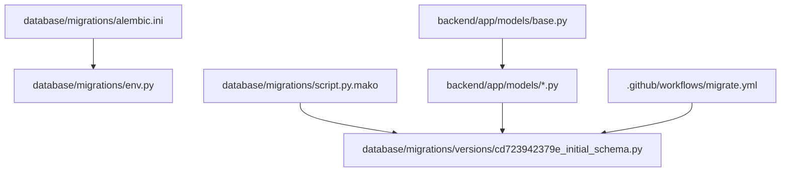
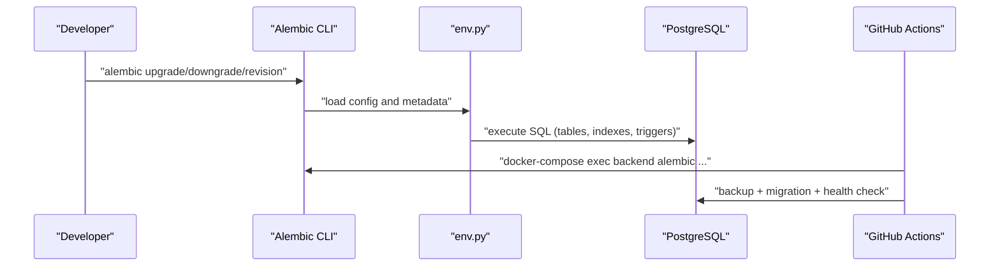
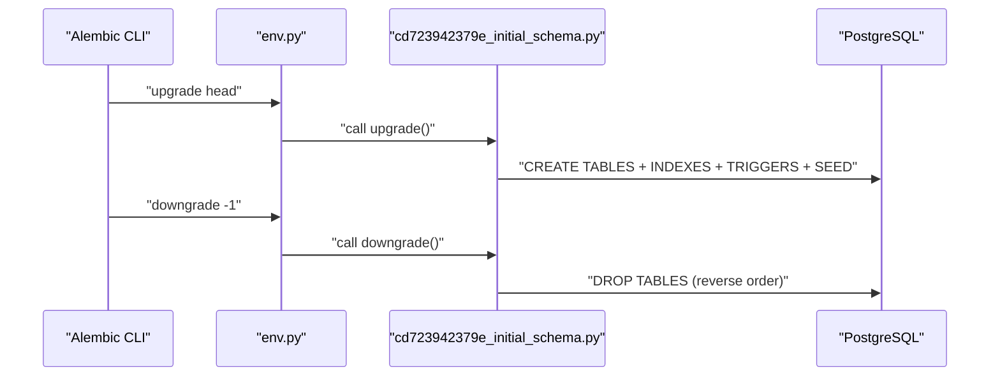
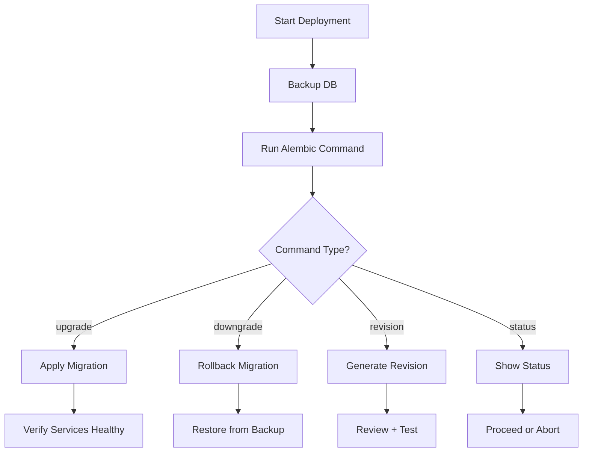
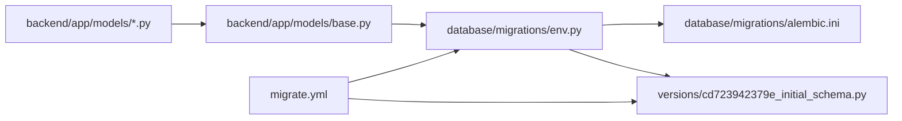

# Database Migrations & Schema Evolution

<cite>
**Referenced Files in This Document**
- [env.py](file://database/migrations/env.py)
- [alembic.ini](file://database/migrations/alembic.ini)
- [script.py.mako](file://database/migrations/script.py.mako)
- [cd723942379e_initial_schema.py](file://database/migrations/versions/cd723942379e_initial_schema.py)
- [base.py](file://backend/app/models/base.py)
- [config.py](file://backend/app/utils/config.py)
- [user.py](file://backend/app/models/user.py)
- [exercise.py](file://backend/app/models/exercise.py)
- [workout_log.py](file://backend/app/models/workout_log.py)
- [daily_wellness.py](file://backend/app/models/daily_wellness.py)
- [achievement.py](file://backend/app/models/achievement.py)
- [challenge.py](file://backend/app/models/challenge.py)
- [workout_template.py](file://backend/app/models/workout_template.py)
- [migrate.yml](file://.github/workflows/migrate.yml)
- [schema_v2.sql](file://database/schema_v2.sql)
- [models.sql](file://database/models.sql)
</cite>

## Table of Contents
1. [Introduction](#introduction)
2. [Project Structure](#project-structure)
3. [Core Components](#core-components)
4. [Architecture Overview](#architecture-overview)
5. [Detailed Component Analysis](#detailed-component-analysis)
6. [Dependency Analysis](#dependency-analysis)
7. [Performance Considerations](#performance-considerations)
8. [Troubleshooting Guide](#troubleshooting-guide)
9. [Conclusion](#conclusion)
10. [Appendices](#appendices)

## Introduction
This document explains FitTracker Pro’s database migration system built on Alembic for PostgreSQL. It covers the migration workflow from initial schema creation through version management, table and index strategies, constraints, triggers, and JSONB handling. It also documents upgrade and downgrade processes, best practices, rollback procedures, and production deployment strategies. Finally, it clarifies the relationship between migration files and SQLAlchemy ORM model definitions, and provides practical examples for evolving the schema safely.

## Project Structure
FitTracker Pro organizes migrations under the database/migrations directory with Alembic configuration, environment setup, and a single initial migration script. The backend models define ORM entities that align with the database schema. CI/CD integrates Alembic commands via a GitHub Actions workflow for safe production deployments.

**Diagram sources**
- [alembic.ini:1-94](file://database/migrations/alembic.ini#L1-L94)
- [env.py:1-81](file://database/migrations/env.py#L1-L81)
- [script.py.mako:1-25](file://database/migrations/script.py.mako#L1-L25)
- [cd723942379e_initial_schema.py:1-460](file://database/migrations/versions/cd723942379e_initial_schema.py#L1-L460)
- [base.py:1-7](file://backend/app/models/base.py#L1-L7)
- [migrate.yml:1-124](file://.github/workflows/migrate.yml#L1-L124)

**Section sources**
- [alembic.ini:1-94](file://database/migrations/alembic.ini#L1-L94)
- [env.py:1-81](file://database/migrations/env.py#L1-L81)
- [script.py.mako:1-25](file://database/migrations/script.py.mako#L1-L25)
- [cd723942379e_initial_schema.py:1-460](file://database/migrations/versions/cd723942379e_initial_schema.py#L1-L460)
- [base.py:1-7](file://backend/app/models/base.py#L1-L7)
- [migrate.yml:1-124](file://.github/workflows/migrate.yml#L1-L124)

## Core Components
- Alembic configuration and environment:
  - alembic.ini sets script_location and logging.
  - env.py configures offline/online modes, loads the SQLAlchemy metadata from models, and injects DATABASE_URL from settings.
- Initial migration script:
  - Creates tables, indexes, constraints, triggers, and seeds default achievements.
- SQLAlchemy models:
  - Define ORM entities aligned with the initial schema, including JSONB fields and indexes.
- CI/CD workflow:
  - Provides controlled upgrade, downgrade, revision generation, and status checks with pre-deployment backups.

**Section sources**
- [alembic.ini:1-94](file://database/migrations/alembic.ini#L1-L94)
- [env.py:1-81](file://database/migrations/env.py#L1-L81)
- [cd723942379e_initial_schema.py:1-460](file://database/migrations/versions/cd723942379e_initial_schema.py#L1-L460)
- [base.py:1-7](file://backend/app/models/base.py#L1-L7)
- [migrate.yml:1-124](file://.github/workflows/migrate.yml#L1-L124)

## Architecture Overview
The migration architecture connects Alembic to the application models and deployment pipeline:

**Diagram sources**
- [env.py:35-81](file://database/migrations/env.py#L35-L81)
- [alembic.ini:1-94](file://database/migrations/alembic.ini#L1-L94)
- [migrate.yml:70-114](file://.github/workflows/migrate.yml#L70-L114)

## Detailed Component Analysis

### Alembic Environment and Configuration
- Offline vs online modes:
  - Offline mode writes SQL to stdout using literal binds.
  - Online mode uses async engine to connect and run migrations.
- Metadata loading:
  - env.py imports models and sets target_metadata to Base.metadata.
- Database URL:
  - alembic.ini sets sqlalchemy.url; env.py overrides it from settings.DATABASE_URL.

**Section sources**
- [env.py:35-81](file://database/migrations/env.py#L35-L81)
- [alembic.ini:46-46](file://database/migrations/alembic.ini#L46-L46)
- [config.py:21-24](file://backend/app/utils/config.py#L21-L24)

### Initial Migration Script (cd723942379e_initial_schema.py)
- Enables uuid-ossp extension.
- Creates all domain tables with primary keys, foreign keys, defaults, and indexes.
- Adds GIN indexes on JSONB columns for flexible querying.
- Implements per-table updated_at triggers via a shared function.
- Seeds default achievements.

```mermaid
flowchart TD
Start(["Upgrade"]) --> Ext["Enable uuid-ossp"]
Ext --> Users["Create users<br/>Indexes: telegram_id, created_at"]
Users --> Exercises["Create exercises<br/>Indexes: name, category, status,<br/>author_user_id, created_at,<br/>JSONB GIN: equipment, muscle_groups, risk_flags"]
Exercises --> Templates["Create workout_templates<br/>Indexes: user_id, type, is_public, created_at,<br/>JSONB GIN: exercises"]
Templates --> Logs["Create workout_logs<br/>Indexes: user_id, template_id, date,<br/>user_date composite,<br/>JSONB GIN: exercises, tags"]
Logs --> Glucose["Create glucose_logs<br/>Indexes: user_id, workout_id, timestamp,<br/>user_timestamp composite,<br/>measurement_type"]
Glucose --> Wellness["Create daily_wellness<br/>Indexes: user_id, date, sleep_score, energy_score,<br/>JSONB GIN: pain_zones<br/>UNIQUE(user_id, date)"]
Wellness --> Achieve["Create achievements<br/>Indexes: code, category, display_order,<br/>JSONB GIN: condition<br/>UNIQUE(code)"]
Achieve --> UA["Create user_achievements<br/>Indexes: user_id, achievement_id, earned_at,<br/>JSONB GIN: progress_data<br/>UNIQUE(user_id, achievement_id)"]
UA --> Challenges["Create challenges<br/>Indexes: creator_id, type, start_date, end_date,<br/>is_public, status, join_code,<br/>JSONB GIN: goal, rules"]
Challenges --> EC["Create emergency_contacts<br/>Indexes: user_id, is_active, priority"]
EC --> Triggers["Create update_updated_at_function<br/>Attach triggers on all tables"]
Triggers --> Seed["Insert default achievements"]
Seed --> End(["Done"])
```

**Diagram sources**
- [cd723942379e_initial_schema.py:19-445](file://database/migrations/versions/cd723942379e_initial_schema.py#L19-L445)

**Section sources**
- [cd723942379e_initial_schema.py:19-445](file://database/migrations/versions/cd723942379e_initial_schema.py#L19-L445)

### Model Definitions and Alignment with Migration
- Base class:
  - Declarative base used by all models.
- Users:
  - Telegram identity, profile/settings JSONB, indexes, timestamps.
- Exercises:
  - Name/category/status, JSONB arrays/objects, author relationship.
- Workout logs:
  - Date/duration, JSONB for exercises/tags, glucose fields, timestamps.
- Daily wellness:
  - Sleep/energy scores, JSONB pain zones, constraints, timestamps.
- Achievements:
  - Code/name/description/icon, JSONB condition, points, category, display order.
- Challenges:
  - Creator/type/goal/rules JSONB, dates, join code, status.
- Workout templates:
  - Owner/type/exercises JSONB, public flag, timestamps.

These models mirror the initial migration schema and define indexes and relationships used by Alembic’s autogenerate.

**Section sources**
- [base.py:1-7](file://backend/app/models/base.py#L1-L7)
- [user.py:23-132](file://backend/app/models/user.py#L23-L132)
- [exercise.py:17-116](file://backend/app/models/exercise.py#L17-L116)
- [workout_log.py:19-112](file://backend/app/models/workout_log.py#L19-L112)
- [daily_wellness.py:17-118](file://backend/app/models/daily_wellness.py#L17-L118)
- [achievement.py:17-105](file://backend/app/models/achievement.py#L17-L105)
- [challenge.py:17-138](file://backend/app/models/challenge.py#L17-L138)
- [workout_template.py:18-83](file://backend/app/models/workout_template.py#L18-L83)

### Upgrade and Downgrade Processes
- Upgrade:
  - Runs the initial migration script to create tables, indexes, triggers, and seed data.
- Downgrade:
  - Drops tables in reverse dependency order to avoid foreign key conflicts.

**Diagram sources**
- [cd723942379e_initial_schema.py:19-445](file://database/migrations/versions/cd723942379e_initial_schema.py#L19-L445)
- [env.py:72-81](file://database/migrations/env.py#L72-L81)

**Section sources**
- [cd723942379e_initial_schema.py:19-445](file://database/migrations/versions/cd723942379e_initial_schema.py#L19-L445)
- [env.py:72-81](file://database/migrations/env.py#L72-L81)

### JSONB Columns, GIN Indexes, and Flexible Data
- JSONB usage:
  - Users: profile, settings.
  - Exercises: equipment, muscle_groups, risk_flags.
  - Workout templates: exercises.
  - Workout logs: exercises, tags.
  - Daily wellness: pain_zones.
  - Achievements: condition.
  - Challenges: goal, rules.
  - User achievements: progress_data.
- GIN indexes:
  - Applied on JSONB columns to enable efficient containment and existence queries.
- Benefits:
  - Evolvable schema without rigid relational joins.
  - Fast filtering and faceting on nested attributes.

**Section sources**
- [cd723942379e_initial_schema.py:32-35](file://database/migrations/versions/cd723942379e_initial_schema.py#L32-L35)
- [cd723942379e_initial_schema.py:61-66](file://database/migrations/versions/cd723942379e_initial_schema.py#L61-L66)
- [cd723942379e_initial_schema.py:104-105](file://database/migrations/versions/cd723942379e_initial_schema.py#L104-L105)
- [cd723942379e_initial_schema.py:136-140](file://database/migrations/versions/cd723942379e_initial_schema.py#L136-L140)
- [cd723942379e_initial_schema.py:209-210](file://database/migrations/versions/cd723942379e_initial_schema.py#L209-L210)
- [cd723942379e_initial_schema.py:243-244](file://database/migrations/versions/cd723942379e_initial_schema.py#L243-L244)
- [cd723942379e_initial_schema.py:305-306](file://database/migrations/versions/cd723942379e_initial_schema.py#L305-L306)
- [cd723942379e_initial_schema.py:378-380](file://database/migrations/versions/cd723942379e_initial_schema.py#L378-L380)

### UUID Extension Usage
- The migration enables the uuid-ossp extension to support generating UUIDs.
- While the initial schema does not introduce UUID primary keys, enabling the extension prepares the database for future optional UUID adoption.

**Section sources**
- [cd723942379e_initial_schema.py:21-21](file://database/migrations/versions/cd723942379e_initial_schema.py#L21-L21)

### Triggers for Updated Timestamps
- A shared function updates the updated_at column on row updates.
- Triggers are attached to all relevant tables to maintain audit freshness.

**Section sources**
- [cd723942379e_initial_schema.py:384-422](file://database/migrations/versions/cd723942379e_initial_schema.py#L384-L422)

### Relationship Between Migrations and Models
- env.py loads Base.metadata from backend models, enabling Alembic to compare the current state with the ORM-defined schema.
- Autogenerate can scaffold changes when model definitions evolve, but manual review and testing remain essential.

**Section sources**
- [env.py:31-32](file://database/migrations/env.py#L31-L32)
- [base.py:1-7](file://backend/app/models/base.py#L1-L7)

### Production Deployment Strategy
- Pre-deployment backup:
  - The workflow creates a database dump before running migrations.
- Controlled commands:
  - Supports upgrade, downgrade, revision generation, and status inspection.
- Health verification:
  - Checks service health after migration.
- Rollback:
  - Use downgrade to a previous revision; restore from the pre-migration backup.

**Diagram sources**
- [migrate.yml:60-114](file://.github/workflows/migrate.yml#L60-L114)

**Section sources**
- [migrate.yml:60-114](file://.github/workflows/migrate.yml#L60-L114)

### Examples: Adding New Tables, Modifying Schemas, Backward Compatibility
- Add a new table:
  - Define the model with indexes and relationships.
  - Generate a revision with autogenerate; review and refine the script.
  - Ensure indexes and constraints match the model’s Index declarations.
- Modify an existing schema:
  - Alter model fields; regenerate migration.
  - Keep backward compatibility by adding columns with defaults and nullable=True initially.
  - Use separate revisions for data migrations if needed.
- Maintain backward compatibility:
  - Avoid dropping columns or tables in the same revision.
  - Provide downgrade steps that preserve data integrity.

[No sources needed since this section provides general guidance]

## Dependency Analysis
- Alembic depends on:
  - env.py for configuration and metadata.
  - alembic.ini for script location and logging.
  - The backend models for autogenerate comparisons.
- Models depend on:
  - Declarative base and SQLAlchemy types.
  - Index declarations align with migration indexes.
- CI/CD depends on:
  - DATABASE_URL and deployment credentials from secrets.

**Diagram sources**
- [base.py:1-7](file://backend/app/models/base.py#L1-L7)
- [env.py:1-81](file://database/migrations/env.py#L1-L81)
- [alembic.ini:1-94](file://database/migrations/alembic.ini#L1-L94)
- [cd723942379e_initial_schema.py:1-460](file://database/migrations/versions/cd723942379e_initial_schema.py#L1-L460)
- [migrate.yml:1-124](file://.github/workflows/migrate.yml#L1-L124)

**Section sources**
- [base.py:1-7](file://backend/app/models/base.py#L1-L7)
- [env.py:1-81](file://database/migrations/env.py#L1-L81)
- [alembic.ini:1-94](file://database/migrations/alembic.ini#L1-L94)
- [cd723942379e_initial_schema.py:1-460](file://database/migrations/versions/cd723942379e_initial_schema.py#L1-L460)
- [migrate.yml:1-124](file://.github/workflows/migrate.yml#L1-L124)

## Performance Considerations
- GIN indexes on JSONB:
  - Improve query performance for containment and key existence checks.
  - Consider selectivity and storage overhead; monitor query plans.
- Composite indexes:
  - Use multi-column indexes for frequent filter combinations (e.g., user_id + date).
- Triggers:
  - Keep updated_at triggers minimal; they run on every UPDATE.
- Data seeding:
  - Insert default achievements in a single transaction to reduce overhead.

[No sources needed since this section provides general guidance]

## Troubleshooting Guide
- Migration fails due to missing database URL:
  - Ensure DATABASE_URL is set in environment/secrets and loaded by settings.
- Foreign key errors on downgrade:
  - Confirm downgrade order follows reverse dependency; the initial script drops tables in reverse order.
- Autogenerate mismatches:
  - Align model Index declarations with migration indexes; rerun autogenerate after model changes.
- CI rollback:
  - Use downgrade to a known good revision; restore from the pre-migration backup created by the workflow.

**Section sources**
- [config.py:21-24](file://backend/app/utils/config.py#L21-L24)
- [cd723942379e_initial_schema.py:448-460](file://database/migrations/versions/cd723942379e_initial_schema.py#L448-L460)
- [migrate.yml:60-114](file://.github/workflows/migrate.yml#L60-L114)

## Conclusion
FitTracker Pro’s Alembic-based migration system establishes a robust foundation for schema evolution. The initial migration script defines a comprehensive domain schema with JSONB flexibility, GIN indexing, and per-table updated_at triggers. The environment and CI/CD pipeline ensure safe, auditable deployments with pre-backup and health checks. By aligning model definitions with migrations and following the outlined best practices, teams can evolve the schema confidently while maintaining backward compatibility and strong performance.

## Appendices

### Appendix A: Historical Schemas
- schema_v2.sql:
  - Demonstrates the same domain tables and indexes using pure SQL.
- models.sql:
  - Older schema layout with normalized user settings and a simpler workouts table.

**Section sources**
- [schema_v2.sql:1-598](file://database/schema_v2.sql#L1-L598)
- [models.sql:1-240](file://database/models.sql#L1-L240)