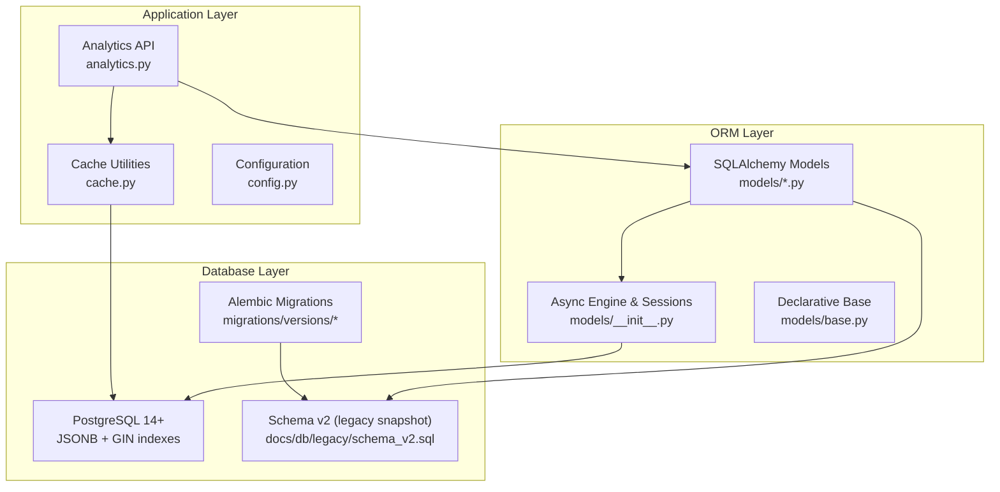
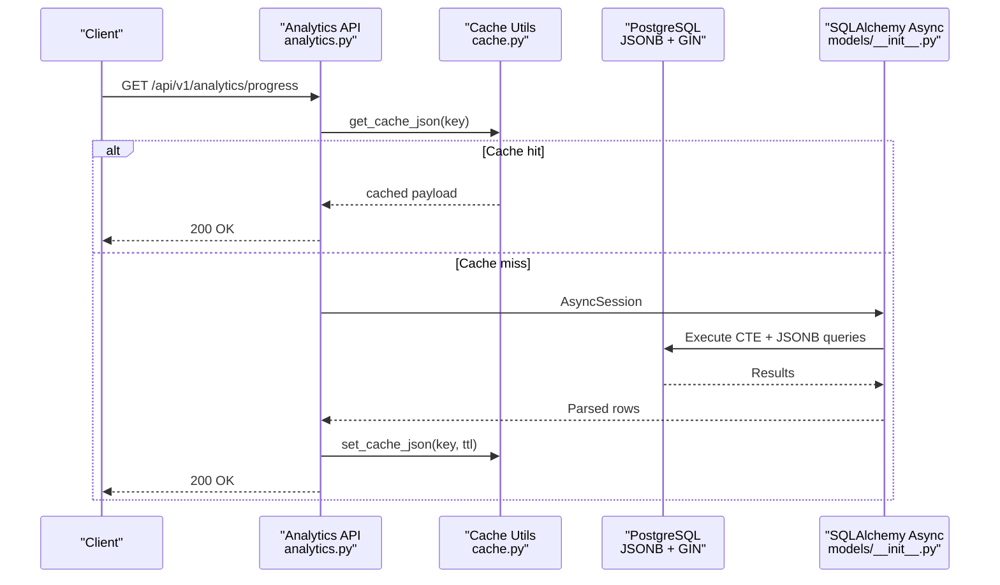
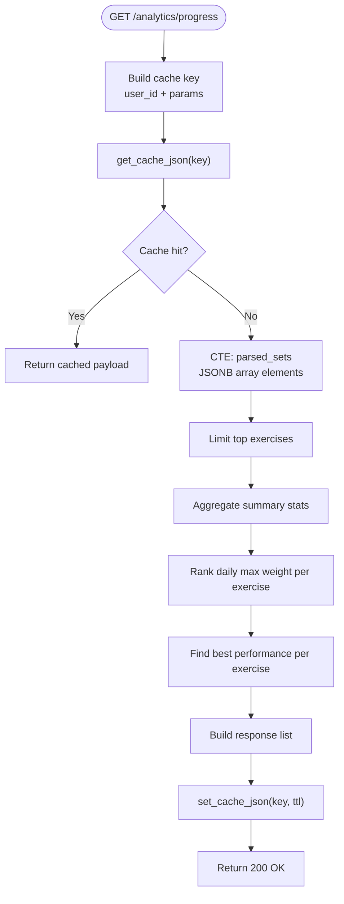
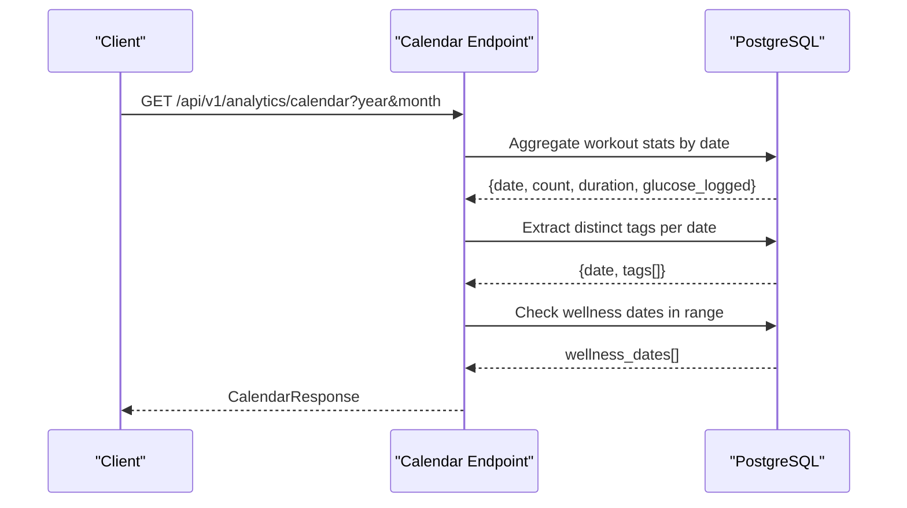
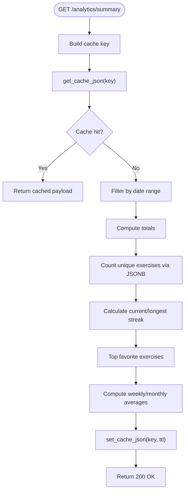
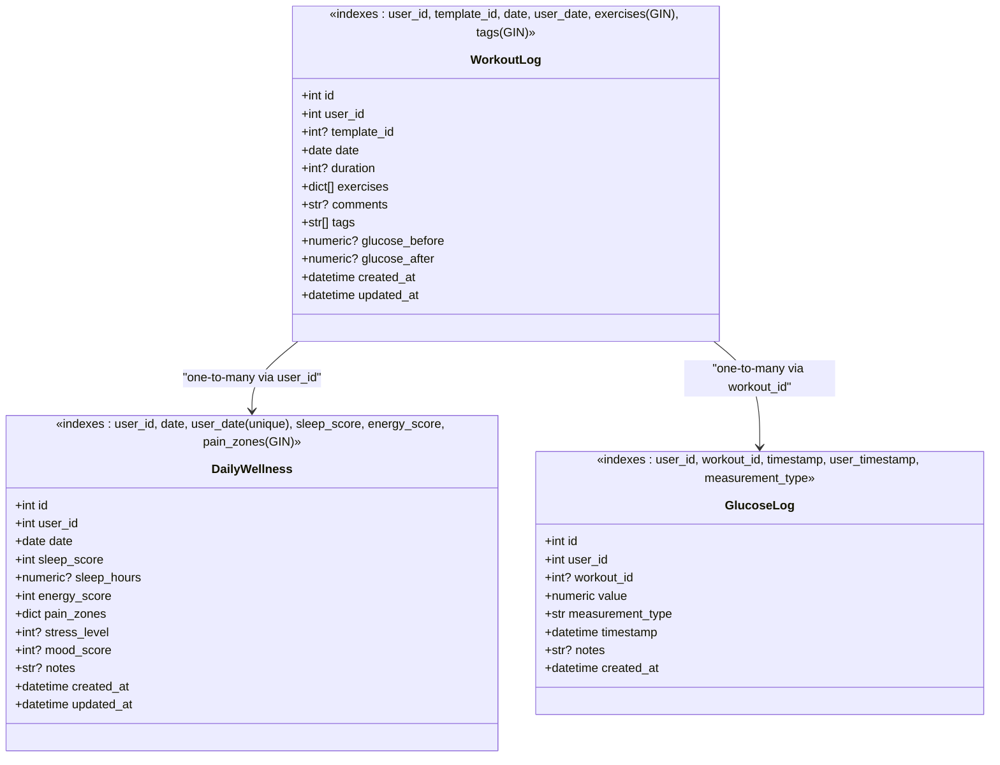
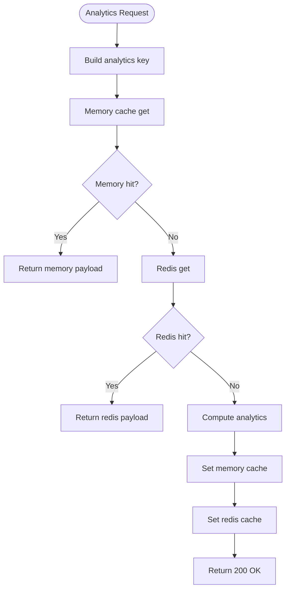
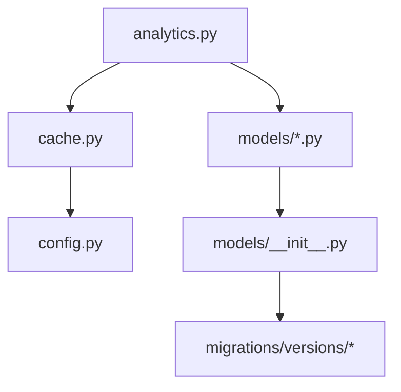

# Database Performance Optimization

<cite>
**Referenced Files in This Document**
- [main.py](file://backend/app/main.py)
- [config.py](file://backend/app/utils/config.py)
- [cache.py](file://backend/app/utils/cache.py)
- [analytics.py](file://backend/app/api/analytics.py)
- [workout_log.py](file://backend/app/models/workout_log.py)
- [daily_wellness.py](file://backend/app/models/daily_wellness.py)
- [glucose_log.py](file://backend/app/models/glucose_log.py)
- [base.py](file://backend/app/models/base.py)
- [__init__.py](file://backend/app/models/__init__.py)
- [cd723942379e_initial_schema.py](file://database/migrations/versions/cd723942379e_initial_schema.py)
- [9f41b6d2a7c1_add_analytics_indexes.py](file://database/migrations/versions/9f41b6d2a7c1_add_analytics_indexes.py)
- [schema_v2.sql (legacy archive)](file://docs/db/legacy/schema_v2.sql)
</cite>

## Table of Contents
1. [Introduction](#introduction)
2. [Project Structure](#project-structure)
3. [Core Components](#core-components)
4. [Architecture Overview](#architecture-overview)
5. [Detailed Component Analysis](#detailed-component-analysis)
6. [Dependency Analysis](#dependency-analysis)
7. [Performance Considerations](#performance-considerations)
8. [Troubleshooting Guide](#troubleshooting-guide)
9. [Conclusion](#conclusion)

## Introduction
This document provides a comprehensive analysis of database performance optimization in the Fit Tracker Pro project. It focuses on the PostgreSQL schema, SQLAlchemy ORM models, Alembic migrations, caching strategy, and analytics endpoints that drive heavy read workloads. The analysis identifies current indexing strategies, JSONB usage patterns, and caching mechanisms, and proposes targeted improvements to enhance query performance, reduce latency, and scale efficiently under increased load.

## Project Structure
The database layer is organized around:
- PostgreSQL schema with JSONB fields for flexible data modeling
- SQLAlchemy async ORM models with explicit indexes
- Alembic migrations for schema evolution
- Analytics API endpoints that perform complex JSONB queries and aggregations
- Multi-level caching (in-memory and Redis) for analytics responses

**Diagram sources**
- [analytics.py:1-723](file://backend/app/api/analytics.py#L1-L723)
- [cache.py:1-132](file://backend/app/utils/cache.py#L1-L132)
- [config.py:1-63](file://backend/app/utils/config.py#L1-L63)
- [workout_log.py:1-112](file://backend/app/models/workout_log.py#L1-L112)
- [daily_wellness.py:1-118](file://backend/app/models/daily_wellness.py#L1-L118)
- [glucose_log.py:1-80](file://backend/app/models/glucose_log.py#L1-L80)
- [base.py:1-7](file://backend/app/models/base.py#L1-L7)
- [__init__.py:1-54](file://backend/app/models/__init__.py#L1-L54)
- [cd723942379e_initial_schema.py:1-460](file://database/migrations/versions/cd723942379e_initial_schema.py#L1-L460)
- [9f41b6d2a7c1_add_analytics_indexes.py:1-29](file://database/migrations/versions/9f41b6d2a7c1_add_analytics_indexes.py#L1-L29)
- [schema_v2.sql:1-598](file://docs/db/legacy/schema_v2.sql#L1-L598)

**Section sources**
- [main.py:1-176](file://backend/app/main.py#L1-L176)
- [config.py:1-63](file://backend/app/utils/config.py#L1-L63)
- [cache.py:1-132](file://backend/app/utils/cache.py#L1-L132)
- [analytics.py:1-723](file://backend/app/api/analytics.py#L1-L723)
- [workout_log.py:1-112](file://backend/app/models/workout_log.py#L1-L112)
- [daily_wellness.py:1-118](file://backend/app/models/daily_wellness.py#L1-L118)
- [glucose_log.py:1-80](file://backend/app/models/glucose_log.py#L1-L80)
- [base.py:1-7](file://backend/app/models/base.py#L1-L7)
- [__init__.py:1-54](file://backend/app/models/__init__.py#L1-L54)
- [cd723942379e_initial_schema.py:1-460](file://database/migrations/versions/cd723942379e_initial_schema.py#L1-L460)
- [9f41b6d2a7c1_add_analytics_indexes.py:1-29](file://database/migrations/versions/9f41b6d2a7c1_add_analytics_indexes.py#L1-L29)
- [schema_v2.sql:1-598](file://docs/db/legacy/schema_v2.sql#L1-L598)

## Core Components
- PostgreSQL schema with JSONB fields for exercises, tags, and wellness pain zones
- SQLAlchemy async ORM models with explicit indexes on frequently queried columns
- Alembic migrations defining initial schema and analytics-specific indexes
- Analytics API endpoints performing CTE-based JSONB parsing and aggregation
- Multi-tier caching (in-memory + Redis) for analytics responses with user-scoped invalidation

Key performance-relevant elements:
- JSONB GIN indexes on profile/settings, equipment/muscle_groups/risk_flags, exercises/tags, pain_zones, conditions, progress_data, goal/rules
- Composite indexes optimized for analytics queries (user_id, date, id)
- Caching TTLs and memory fallback for high-latency analytics endpoints

**Section sources**
- [schema_v2.sql:1-598](file://docs/db/legacy/schema_v2.sql#L1-L598)
- [cd723942379e_initial_schema.py:19-460](file://database/migrations/versions/cd723942379e_initial_schema.py#L19-L460)
- [9f41b6d2a7c1_add_analytics_indexes.py:17-29](file://database/migrations/versions/9f41b6d2a7c1_add_analytics_indexes.py#L17-L29)
- [workout_log.py:103-108](file://backend/app/models/workout_log.py#L103-L108)
- [daily_wellness.py:108-114](file://backend/app/models/daily_wellness.py#L108-L114)
- [glucose_log.py:70-76](file://backend/app/models/glucose_log.py#L70-L76)
- [analytics.py:36-300](file://backend/app/api/analytics.py#L36-L300)
- [cache.py:59-132](file://backend/app/utils/cache.py#L59-L132)
- [config.py:25-35](file://backend/app/utils/config.py#L25-L35)

## Architecture Overview
The analytics pipeline combines SQL queries, JSONB parsing, and caching to serve performance-critical dashboards and reports.

**Diagram sources**
- [analytics.py:36-300](file://backend/app/api/analytics.py#L36-L300)
- [cache.py:59-104](file://backend/app/utils/cache.py#L59-L104)
- [__init__.py:47-54](file://backend/app/models/__init__.py#L47-L54)
- [schema_v2.sql:121-180](file://docs/db/legacy/schema_v2.sql#L121-L180)

## Detailed Component Analysis

### Analytics API: Exercise Progress Endpoint
The `/progress` endpoint performs complex JSONB parsing using CTEs to compute exercise timelines, summaries, and best performances. It leverages:
- JSONB array expansion via lateral joins
- Ranking windows partitioned by exercise and date
- Aggregations grouped by exercise_id and date
- Caching with user-scoped keys and configurable TTLs

**Diagram sources**
- [analytics.py:36-300](file://backend/app/api/analytics.py#L36-L300)

**Section sources**
- [analytics.py:36-300](file://backend/app/api/analytics.py#L36-L300)
- [cache.py:59-104](file://backend/app/utils/cache.py#L59-L104)
- [config.py:25-35](file://backend/app/utils/config.py#L25-L35)

### Analytics API: Calendar Endpoint
The `/calendar` endpoint aggregates workout counts, durations, and tags per day, and checks for glucose and wellness entries within a given month. It uses:
- Grouped aggregations with JSONB array elements for tags
- Existence checks for glucose and wellness dates
- Composite index usage for efficient date-range filtering

**Diagram sources**
- [analytics.py:302-460](file://backend/app/api/analytics.py#L302-L460)
- [workout_log.py:103-108](file://backend/app/models/workout_log.py#L103-L108)
- [daily_wellness.py:108-114](file://backend/app/models/daily_wellness.py#L108-L114)

**Section sources**
- [analytics.py:302-460](file://backend/app/api/analytics.py#L302-L460)
- [workout_log.py:103-108](file://backend/app/models/workout_log.py#L103-L108)
- [daily_wellness.py:108-114](file://backend/app/models/daily_wellness.py#L108-L114)

### Analytics API: Summary Endpoint
The `/summary` endpoint computes totals, averages, and streak metrics over a configurable period. It:
- Uses JSONB extraction to count unique exercises
- Calculates current and longest streaks from grouped workout dates
- Applies composite indexes for efficient date filtering

**Diagram sources**
- [analytics.py:538-723](file://backend/app/api/analytics.py#L538-L723)

**Section sources**
- [analytics.py:538-723](file://backend/app/api/analytics.py#L538-L723)
- [workout_log.py:103-108](file://backend/app/models/workout_log.py#L103-L108)

### Database Models and Indexing Strategy
The ORM models define explicit indexes aligned with analytics queries:
- WorkoutLog: user_id, template_id, date, user_date composite, exercises GIN, tags GIN
- DailyWellness: user_id, date, user_date unique, sleep_score, energy_score
- GlucoseLog: user_id, workout_id, timestamp, user_timestamp, measurement_type
- Additional GIN indexes on JSONB fields for flexible filtering

**Diagram sources**
- [workout_log.py:19-112](file://backend/app/models/workout_log.py#L19-L112)
- [daily_wellness.py:17-118](file://backend/app/models/daily_wellness.py#L17-L118)
- [glucose_log.py:18-80](file://backend/app/models/glucose_log.py#L18-L80)

**Section sources**
- [workout_log.py:103-108](file://backend/app/models/workout_log.py#L103-L108)
- [daily_wellness.py:108-114](file://backend/app/models/daily_wellness.py#L108-L114)
- [glucose_log.py:70-76](file://backend/app/models/glucose_log.py#L70-L76)
- [schema_v2.sql:121-239](file://docs/db/legacy/schema_v2.sql#L121-L239)

### Caching Strategy and Configuration
The caching layer provides:
- In-memory cache with TTL and JSON serialization
- Redis-backed cache with async client initialization
- User-scoped invalidation patterns for analytics keys
- Configurable TTLs and hard limits for analytics parameters

**Diagram sources**
- [cache.py:59-132](file://backend/app/utils/cache.py#L59-L132)
- [config.py:25-35](file://backend/app/utils/config.py#L25-L35)

**Section sources**
- [cache.py:59-132](file://backend/app/utils/cache.py#L59-L132)
- [config.py:25-35](file://backend/app/utils/config.py#L25-L35)

## Dependency Analysis
The analytics endpoints depend on:
- SQLAlchemy async sessions for database access
- JSONB queries and lateral joins for flexible data parsing
- Caching utilities for response memoization
- Alembic migrations ensuring consistent index availability

**Diagram sources**
- [analytics.py:1-723](file://backend/app/api/analytics.py#L1-L723)
- [cache.py:1-132](file://backend/app/utils/cache.py#L1-L132)
- [config.py:1-63](file://backend/app/utils/config.py#L1-L63)
- [__init__.py:1-54](file://backend/app/models/__init__.py#L1-L54)
- [cd723942379e_initial_schema.py:1-460](file://database/migrations/versions/cd723942379e_initial_schema.py#L1-L460)

**Section sources**
- [analytics.py:1-723](file://backend/app/api/analytics.py#L1-L723)
- [cache.py:1-132](file://backend/app/utils/cache.py#L1-L132)
- [config.py:1-63](file://backend/app/utils/config.py#L1-L63)
- [__init__.py:1-54](file://backend/app/models/__init__.py#L1-L54)
- [cd723942379e_initial_schema.py:1-460](file://database/migrations/versions/cd723942379e_initial_schema.py#L1-L460)

## Performance Considerations
- JSONB GIN indexes significantly improve filtering and existence checks for profile/settings, equipment/muscle_groups/risk_flags, exercises/tags, pain_zones, conditions, progress_data, goal/rules.
- Composite indexes (user_id, date, id) optimize analytics queries by avoiding table scans and enabling index-only scans.
- Caching reduces repeated heavy computations for analytics endpoints; tune TTLs and hard limits based on data volatility and user expectations.
- Consider partitioning large tables (e.g., workout_logs) by date for improved maintenance and query performance.
- Monitor slow query logs and analyze execution plans for JSONB queries to identify missing indexes or inefficient patterns.
- Use connection pooling and async sessions effectively to minimize overhead during concurrent analytics requests.

[No sources needed since this section provides general guidance]

## Troubleshooting Guide
Common issues and resolutions:
- Slow analytics responses: Verify that JSONB GIN indexes are present and that queries leverage them. Confirm cache is enabled and TTLs are appropriate.
- Cache misses: Ensure Redis is reachable and properly configured; check memory cache fallback behavior.
- JSONB parsing errors: Validate JSONB structure in exercises/tags fields; confirm array elements exist before aggregation.
- Index invalidation: Use user-scoped invalidation patterns to refresh analytics after data changes.

**Section sources**
- [cache.py:106-132](file://backend/app/utils/cache.py#L106-L132)
- [config.py:25-35](file://backend/app/utils/config.py#L25-L35)
- [analytics.py:36-300](file://backend/app/api/analytics.py#L36-L300)

## Conclusion
The Fit Tracker Pro database layer employs JSONB for flexibility and GIN indexes for efficient querying, complemented by robust caching and async ORM patterns. The analytics endpoints are designed to handle complex JSONB parsing and aggregation while leveraging composite indexes and caching for performance. To further optimize, consider partitioning strategies for large tables, continuous monitoring of query performance, and iterative tuning of cache policies and index coverage.

[No sources needed since this section summarizes without analyzing specific files]