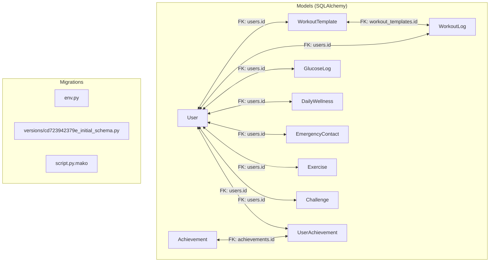
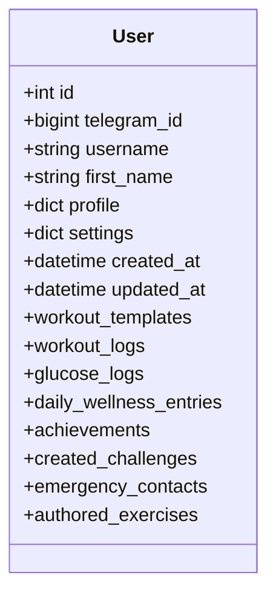
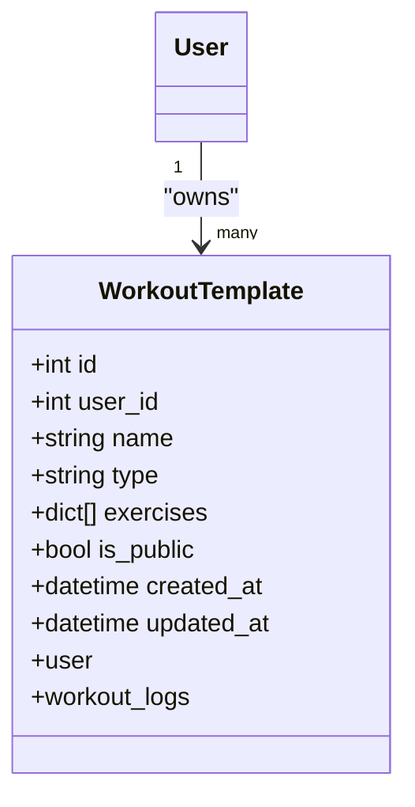
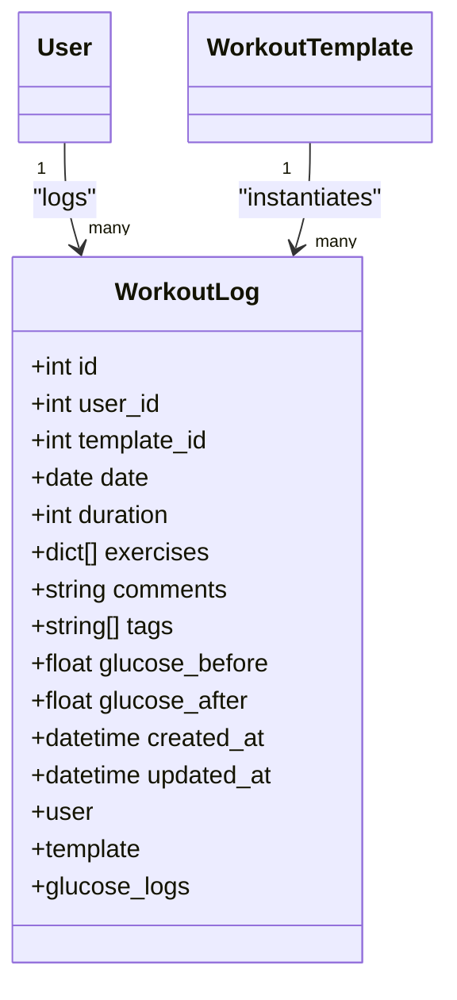
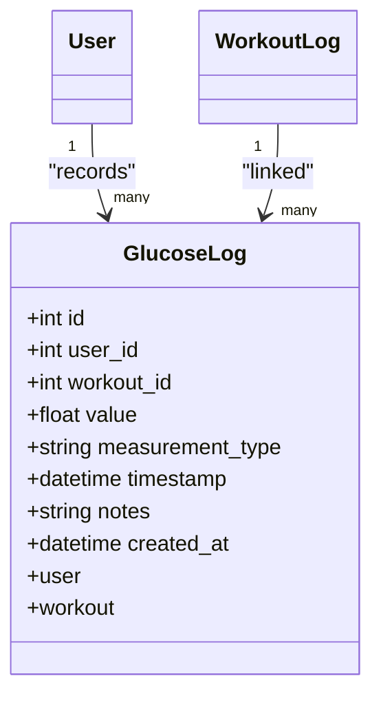
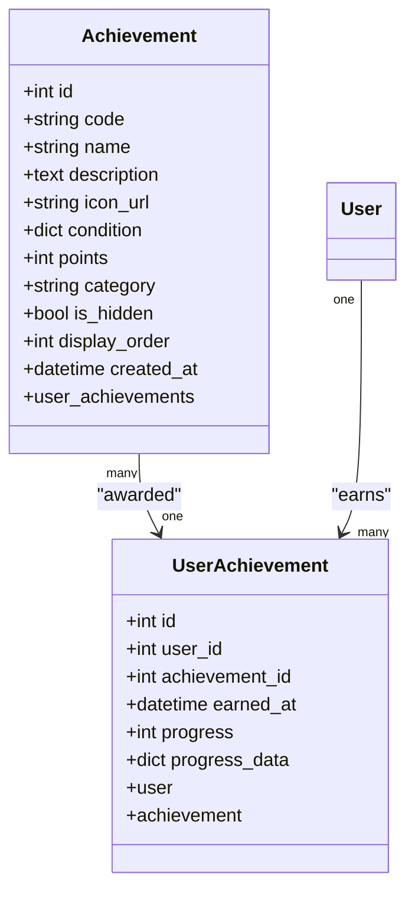
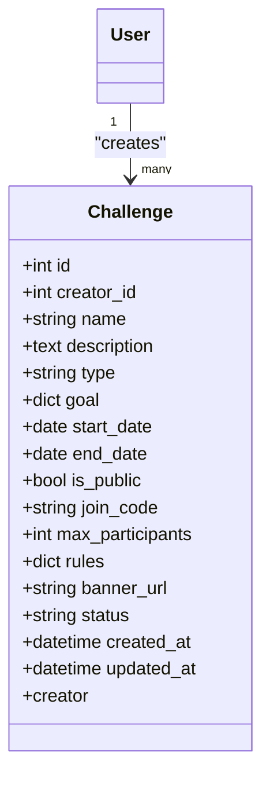
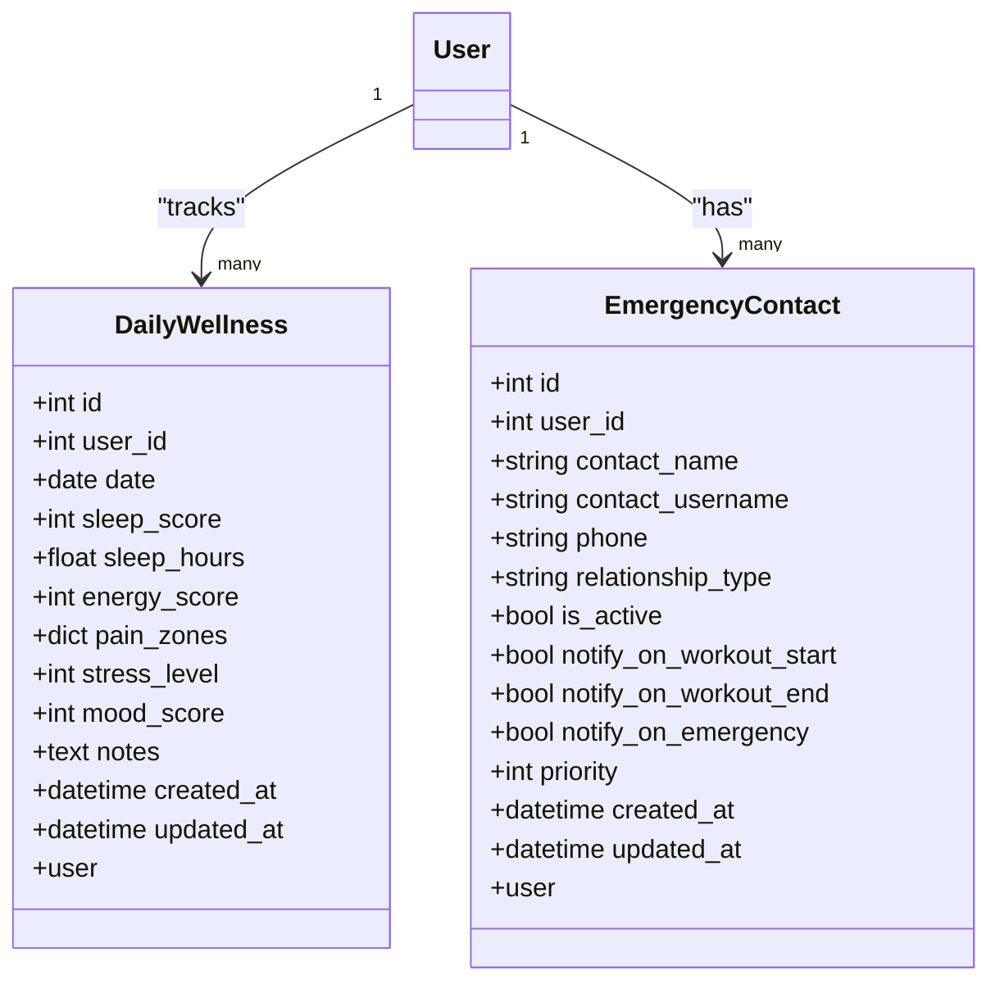
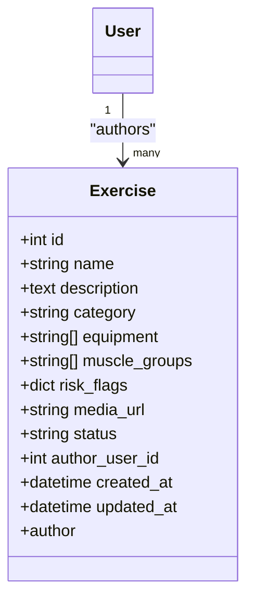
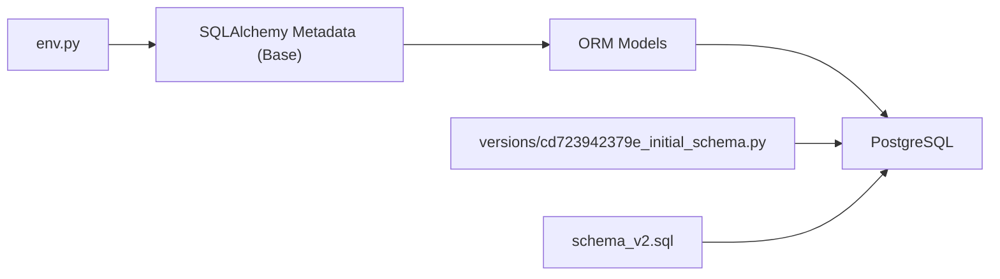

# Database Schema & Models

<cite>
**Referenced Files in This Document**
- [base.py](file://backend/app/models/base.py)
- [user.py](file://backend/app/models/user.py)
- [workout_template.py](file://backend/app/models/workout_template.py)
- [workout_log.py](file://backend/app/models/workout_log.py)
- [glucose_log.py](file://backend/app/models/glucose_log.py)
- [achievement.py](file://backend/app/models/achievement.py)
- [challenge.py](file://backend/app/models/challenge.py)
- [user_achievement.py](file://backend/app/models/user_achievement.py)
- [daily_wellness.py](file://backend/app/models/daily_wellness.py)
- [emergency_contact.py](file://backend/app/models/emergency_contact.py)
- [exercise.py](file://backend/app/models/exercise.py)
- [initial_schema.py](file://database/migrations/versions/cd723942379e_initial_schema.py)
- [env.py](file://database/migrations/env.py)
- [script.py.mako](file://database/migrations/script.py.mako)
- [schema_v2.sql](file://database/schema_v2.sql)
- [models.sql](file://database/models.sql)
</cite>

## Table of Contents
1. [Introduction](#introduction)
2. [Project Structure](#project-structure)
3. [Core Components](#core-components)
4. [Architecture Overview](#architecture-overview)
5. [Detailed Component Analysis](#detailed-component-analysis)
6. [Dependency Analysis](#dependency-analysis)
7. [Performance Considerations](#performance-considerations)
8. [Troubleshooting Guide](#troubleshooting-guide)
9. [Conclusion](#conclusion)
10. [Appendices](#appendices)

## Introduction
This document describes the database schema and data models for FitTracker Pro. It focuses on the core models used by the backend: User, WorkoutTemplate, WorkoutLog, GlucoseLog, Achievement, and Challenge. It documents entity relationships, field definitions, data types, primary/foreign keys, indexes, constraints, validation rules, and business logic embedded in the models. It also covers the migration system using Alembic, data access patterns, performance characteristics, data lifecycle, retention, and security/privacy considerations.

## Project Structure
FitTracker Pro uses SQLAlchemy ORM models backed by PostgreSQL. The models are defined in Python under backend/app/models and are managed via Alembic migrations located under database/migrations. The initial migration mirrors a comprehensive SQL schema described in schema_v2.sql.



**Diagram sources**
- [user.py:23-132](file://backend/app/models/user.py#L23-L132)
- [workout_template.py:18-83](file://backend/app/models/workout_template.py#L18-L83)
- [workout_log.py:19-112](file://backend/app/models/workout_log.py#L19-L112)
- [glucose_log.py:18-80](file://backend/app/models/glucose_log.py#L18-L80)
- [achievement.py:17-105](file://backend/app/models/achievement.py#L17-L105)
- [user_achievement.py:18-71](file://backend/app/models/user_achievement.py#L18-L71)
- [challenge.py:17-138](file://backend/app/models/challenge.py#L17-L138)
- [daily_wellness.py:17-118](file://backend/app/models/daily_wellness.py#L17-L118)
- [emergency_contact.py:17-112](file://backend/app/models/emergency_contact.py#L17-L112)
- [exercise.py:17-116](file://backend/app/models/exercise.py#L17-L116)
- [initial_schema.py:19-460](file://database/migrations/versions/cd723942379e_initial_schema.py#L19-L460)

**Section sources**
- [base.py:1-7](file://backend/app/models/base.py#L1-L7)
- [env.py:1-81](file://database/migrations/env.py#L1-L81)
- [initial_schema.py:19-460](file://database/migrations/versions/cd723942379e_initial_schema.py#L19-L460)

## Core Components
This section defines the core entities and their fields, constraints, and indexes.

- User
  - Primary key: id
  - Unique constraints: telegram_id
  - Fields: telegram_id (BigInt, unique), username (String), first_name (String), profile (JSONB), settings (JSONB), created_at, updated_at
  - Indexes: ix_users_telegram_id, ix_users_created_at, GIN indexes on profile and settings
  - Relationships: one-to-many to WorkoutTemplate, WorkoutLog, GlucoseLog, DailyWellness, UserAchievement, Challenge, EmergencyContact, Exercise
  - Validation: profile/settings defaults defined; updated_at handled by trigger

- WorkoutTemplate
  - Primary key: id
  - Foreign key: user_id → users.id (on delete: CASCADE)
  - Fields: user_id, name (String), type (String), exercises (JSONB), is_public (Boolean), created_at, updated_at
  - Indexes: ix_workout_templates_user_id, ix_workout_templates_type, ix_workout_templates_is_public, ix_workout_templates_created_at, GIN on exercises
  - Relationships: many-to-one to User; one-to-many to WorkoutLog
  - Validation: type constrained by application logic; JSONB exercises

- WorkoutLog
  - Primary key: id
  - Foreign keys: user_id → users.id (on delete: CASCADE), template_id → workout_templates.id (on delete: SET NULL)
  - Fields: user_id, template_id, date (Date), duration (Integer), exercises (JSONB), comments (String), tags (JSONB), glucose_before/suffix (Numeric 5,2), created_at, updated_at
  - Indexes: ix_workout_logs_user_id, ix_workout_logs_template_id, ix_workout_logs_date, ix_workout_logs_user_date, GIN on exercises/tags
  - Relationships: many-to-one to User and WorkoutTemplate; one-to-many to GlucoseLog
  - Validation: glucose values numeric; date indexed; composite index user_id+date

- GlucoseLog
  - Primary key: id
  - Foreign keys: user_id → users.id (on delete: CASCADE), workout_id → workout_logs.id (on delete: CASCADE)
  - Fields: user_id, workout_id, value (Numeric 5,2), measurement_type (String), timestamp (DateTime), notes (String), created_at
  - Indexes: ix_glucose_logs_user_id, ix_glucose_logs_workout_id, ix_glucose_logs_timestamp, ix_glucose_logs_user_timestamp, ix_glucose_logs_measurement_type
  - Relationships: many-to-one to User and WorkoutLog
  - Validation: value constrained to 5,2 scale; measurement_type indicates timing/fasting/post-workout

- Achievement
  - Primary key: id
  - Unique constraint: code
  - Fields: code (String), name (String), description (Text), icon_url (String), condition (JSONB), points (Integer), category (String), is_hidden (Boolean), display_order (Integer), created_at
  - Indexes: ix_achievements_code, ix_achievements_category
  - Relationships: one-to-many to UserAchievement
  - Validation: JSONB condition; category defaults and application logic

- Challenge
  - Primary key: id
  - Foreign key: creator_id → users.id (on delete: CASCADE)
  - Fields: creator_id, name (String), description (Text), type (String), goal (JSONB), start_date/end_date (Date), is_public (Boolean), join_code (unique), max_participants (Integer), rules (JSONB), banner_url (String), status (String), created_at, updated_at
  - Indexes: ix_challenges_creator_id, ix_challenges_type, ix_challenges_start_date, ix_challenges_end_date, ix_challenges_is_public, ix_challenges_status, ix_challenges_join_code
  - Relationships: many-to-one to User
  - Validation: JSONB goal/rules; unique join_code; status defaults

- UserAchievement (association)
  - Primary key: id
  - Unique constraint: (user_id, achievement_id)
  - Foreign keys: user_id → users.id (on delete: CASCADE), achievement_id → achievements.id (on delete: CASCADE)
  - Fields: user_id, achievement_id, earned_at (DateTime), progress (Integer), progress_data (JSONB)
  - Indexes: ix_user_achievements_user_id, ix_user_achievements_achievement_id, unique user_achievement, ix_user_achievements_earned_at
  - Relationships: many-to-one to User and Achievement

- DailyWellness
  - Primary key: id
  - Unique constraint: (user_id, date)
  - Foreign key: user_id → users.id (on delete: CASCADE)
  - Fields: user_id, date (Date), sleep_score (Integer with 0–100 check), sleep_hours (Numeric 4,1), energy_score (Integer with 0–100 check), pain_zones (JSONB), stress_level (0–10), mood_score (0–100), notes (Text), created_at, updated_at
  - Indexes: ix_daily_wellness_user_id, ix_daily_wellness_date, ix_daily_wellness_user_date, ix_daily_wellness_sleep_score, ix_daily_wellness_energy_score
  - Relationships: many-to-one to User
  - Validation: range checks per field; GIN index on pain_zones

- EmergencyContact
  - Primary key: id
  - Foreign key: user_id → users.id (on delete: CASCADE)
  - Fields: user_id, contact_name (String), contact_username (String), phone (String), relationship_type (String), is_active (Boolean), notify_on_workout_start/end/emergency (Booleans), priority (Integer), created_at, updated_at
  - Indexes: ix_emergency_contacts_user_id, ix_emergency_contacts_is_active, ix_emergency_contacts_priority
  - Relationships: many-to-one to User
  - Validation: defaults and booleans for notification preferences

- Exercise
  - Primary key: id
  - Foreign key: author_user_id → users.id (on delete: SET NULL)
  - Fields: name (String), description (Text), category (String), equipment (JSONB), muscle_groups (JSONB), risk_flags (JSONB), media_url (String), status (String), author_user_id, created_at, updated_at
  - Indexes: ix_exercises_name, ix_exercises_category, ix_exercises_status, ix_exercises_author_user_id, ix_exercises_created_at, GIN on equipment/muscle_groups/risk_flags
  - Relationships: many-to-one to User
  - Validation: JSONB arrays/objects; defaults for risk_flags/profile-like structures

**Section sources**
- [user.py:23-132](file://backend/app/models/user.py#L23-L132)
- [workout_template.py:18-83](file://backend/app/models/workout_template.py#L18-L83)
- [workout_log.py:19-112](file://backend/app/models/workout_log.py#L19-L112)
- [glucose_log.py:18-80](file://backend/app/models/glucose_log.py#L18-L80)
- [achievement.py:17-105](file://backend/app/models/achievement.py#L17-L105)
- [challenge.py:17-138](file://backend/app/models/challenge.py#L17-L138)
- [user_achievement.py:18-71](file://backend/app/models/user_achievement.py#L18-L71)
- [daily_wellness.py:17-118](file://backend/app/models/daily_wellness.py#L17-L118)
- [emergency_contact.py:17-112](file://backend/app/models/emergency_contact.py#L17-L112)
- [exercise.py:17-116](file://backend/app/models/exercise.py#L17-L116)

## Architecture Overview
The data model follows a relational design with JSONB fields for flexible, evolving structures (e.g., profile, settings, exercises, goals). Alembic manages schema evolution, and PostgreSQL triggers maintain updated_at timestamps.

```mermaid
erDiagram
USERS {
int id PK
bigint telegram_id UK
varchar username
varchar first_name
jsonb profile
jsonb settings
timestamptz created_at
timestamptz updated_at
}
WORKOUT_TEMPLATES {
int id PK
int user_id FK
varchar name
varchar type
jsonb exercises
boolean is_public
timestamptz created_at
timestamptz updated_at
}
WORKOUT_LOGS {
int id PK
int user_id FK
int template_id FK
date date
int duration
jsonb exercises
varchar comments
jsonb tags
numeric glucose_before
numeric glucose_after
timestamptz created_at
timestamptz updated_at
}
GLUCOSE_LOGS {
int id PK
int user_id FK
int workout_id FK
numeric value
varchar measurement_type
timestamptz timestamp
varchar notes
timestamptz created_at
}
ACHIEVEMENTS {
int id PK
varchar code UK
varchar name
text description
varchar icon_url
jsonb condition
int points
varchar category
boolean is_hidden
int display_order
timestamptz created_at
}
USER_ACHIEVEMENTS {
int id PK
int user_id FK
int achievement_id FK
timestamptz earned_at
int progress
jsonb progress_data
unique user_id, achievement_id
}
CHALLENGES {
int id PK
int creator_id FK
varchar name
text description
varchar type
jsonb goal
date start_date
date end_date
boolean is_public
varchar join_code UK
int max_participants
jsonb rules
varchar banner_url
varchar status
timestamptz created_at
timestamptz updated_at
}
DAILY_WELLNESS {
int id PK
int user_id FK
date date
int sleep_score CK0_100
numeric sleep_hours
int energy_score CK0_100
jsonb pain_zones
int stress_level CK0_10
int mood_score CK0_100
text notes
timestamptz created_at
timestamptz updated_at
unique user_id, date
}
EMERGENCY_CONTACTS {
int id PK
int user_id FK
varchar contact_name
varchar contact_username
varchar phone
varchar relationship_type
boolean is_active
boolean notify_on_workout_start
boolean notify_on_workout_end
boolean notify_on_emergency
int priority
timestamptz created_at
timestamptz updated_at
}
EXERCISES {
int id PK
varchar name
text description
varchar category
jsonb equipment
jsonb muscle_groups
jsonb risk_flags
varchar media_url
varchar status
int author_user_id FK
timestamptz created_at
timestamptz updated_at
}
USERS ||--o{ WORKOUT_TEMPLATES : "creates"
USERS ||--o{ WORKOUT_LOGS : "logs"
USERS ||--o{ GLUCOSE_LOGS : "records"
USERS ||--o{ DAILY_WELLNESS : "tracks"
USERS ||--o{ EMERGENCY_CONTACTS : "has"
USERS ||--o{ EXERCISES : "authors"
WORKOUT_TEMPLATES ||--o{ WORKOUT_LOGS : "instantiates"
ACHIEVEMENTS ||--o{ USER_ACHIEVEMENTS : "awarded"
USERS ||--o{ USER_ACHIEVEMENTS : "earns"
USERS ||--o{ CHALLENGES : "creates"
```

**Diagram sources**
- [user.py:23-132](file://backend/app/models/user.py#L23-L132)
- [workout_template.py:18-83](file://backend/app/models/workout_template.py#L18-L83)
- [workout_log.py:19-112](file://backend/app/models/workout_log.py#L19-L112)
- [glucose_log.py:18-80](file://backend/app/models/glucose_log.py#L18-L80)
- [achievement.py:17-105](file://backend/app/models/achievement.py#L17-L105)
- [user_achievement.py:18-71](file://backend/app/models/user_achievement.py#L18-L71)
- [challenge.py:17-138](file://backend/app/models/challenge.py#L17-L138)
- [daily_wellness.py:17-118](file://backend/app/models/daily_wellness.py#L17-L118)
- [emergency_contact.py:17-112](file://backend/app/models/emergency_contact.py#L17-L112)
- [exercise.py:17-116](file://backend/app/models/exercise.py#L17-L116)

## Detailed Component Analysis

### User Model
- Purpose: Store Telegram user identity, profile, and settings.
- Notable validations: JSONB defaults for profile/settings; unique telegram_id; GIN indexes on JSONB fields.
- Relationships: cascading delete-orphan for related entities.



**Diagram sources**
- [user.py:23-132](file://backend/app/models/user.py#L23-L132)

**Section sources**
- [user.py:23-132](file://backend/app/models/user.py#L23-L132)

### WorkoutTemplate Model
- Purpose: Reusable workout templates owned by a user; exercises stored as JSONB.
- Notable validations: type constrained by application logic; JSONB exercises; GIN index on exercises.



**Diagram sources**
- [workout_template.py:18-83](file://backend/app/models/workout_template.py#L18-L83)
- [user.py:23-132](file://backend/app/models/user.py#L23-L132)

**Section sources**
- [workout_template.py:18-83](file://backend/app/models/workout_template.py#L18-L83)

### WorkoutLog Model
- Purpose: Records completed workouts; optional linkage to a template; supports glucose tracking.
- Notable validations: Numeric glucose fields; date indexing; composite index user_id+date; JSONB for exercises/tags.



**Diagram sources**
- [workout_log.py:19-112](file://backend/app/models/workout_log.py#L19-L112)
- [workout_template.py:18-83](file://backend/app/models/workout_template.py#L18-L83)
- [user.py:23-132](file://backend/app/models/user.py#L23-L132)

**Section sources**
- [workout_log.py:19-112](file://backend/app/models/workout_log.py#L19-L112)

### GlucoseLog Model
- Purpose: Track blood glucose levels with timestamps and optional workout linkage.
- Notable validations: Numeric value precision/scale; measurement_type semantics; GIN index on JSONB fields.



**Diagram sources**
- [glucose_log.py:18-80](file://backend/app/models/glucose_log.py#L18-L80)
- [workout_log.py:19-112](file://backend/app/models/workout_log.py#L19-L112)
- [user.py:23-132](file://backend/app/models/user.py#L23-L132)

**Section sources**
- [glucose_log.py:18-80](file://backend/app/models/glucose_log.py#L18-L80)

### Achievement and UserAchievement Models
- Purpose: Define system achievements and track which users earned them; progress stored as JSONB.
- Notable validations: Unique code; JSONB condition; unique (user_id, achievement_id); GIN index on progress_data.



**Diagram sources**
- [achievement.py:17-105](file://backend/app/models/achievement.py#L17-L105)
- [user_achievement.py:18-71](file://backend/app/models/user_achievement.py#L18-L71)

**Section sources**
- [achievement.py:17-105](file://backend/app/models/achievement.py#L17-L105)
- [user_achievement.py:18-71](file://backend/app/models/user_achievement.py#L18-L71)

### Challenge Model
- Purpose: Fitness challenges with goals, rules, join codes, and status lifecycle.
- Notable validations: JSONB goal/rules; unique join_code; status defaults; date range constraints.



**Diagram sources**
- [challenge.py:17-138](file://backend/app/models/challenge.py#L17-L138)
- [user.py:23-132](file://backend/app/models/user.py#L23-L132)

**Section sources**
- [challenge.py:17-138](file://backend/app/models/challenge.py#L17-L138)

### DailyWellness and EmergencyContact Models
- DailyWellness: Daily self-reported metrics with range checks and JSONB pain zones; unique (user_id, date).
- EmergencyContact: Safety contacts with notification preferences and priority ordering.



**Diagram sources**
- [daily_wellness.py:17-118](file://backend/app/models/daily_wellness.py#L17-L118)
- [emergency_contact.py:17-112](file://backend/app/models/emergency_contact.py#L17-L112)
- [user.py:23-132](file://backend/app/models/user.py#L23-L132)

**Section sources**
- [daily_wellness.py:17-118](file://backend/app/models/daily_wellness.py#L17-L118)
- [emergency_contact.py:17-112](file://backend/app/models/emergency_contact.py#L17-L112)

### Exercise Model
- Purpose: Exercise library with risk flags, equipment, and muscle groups; supports system vs user-authored.
- Notable validations: JSONB arrays/objects; defaults for risk_flags; GIN indexes.



**Diagram sources**
- [exercise.py:17-116](file://backend/app/models/exercise.py#L17-L116)
- [user.py:23-132](file://backend/app/models/user.py#L23-L132)

**Section sources**
- [exercise.py:17-116](file://backend/app/models/exercise.py#L17-L116)

## Dependency Analysis
- Alembic environment loads the SQLAlchemy metadata from the models and runs migrations against the configured database URL.
- The initial migration script creates all tables, indexes, triggers, and inserts default achievements.
- The schema_v2.sql file provides a complete PostgreSQL schema definition aligned with the ORM models.



**Diagram sources**
- [env.py:1-81](file://database/migrations/env.py#L1-L81)
- [initial_schema.py:19-460](file://database/migrations/versions/cd723942379e_initial_schema.py#L19-L460)
- [schema_v2.sql:1-598](file://database/schema_v2.sql#L1-L598)

**Section sources**
- [env.py:1-81](file://database/migrations/env.py#L1-L81)
- [initial_schema.py:19-460](file://database/migrations/versions/cd723942379e_initial_schema.py#L19-L460)
- [schema_v2.sql:1-598](file://database/schema_v2.sql#L1-L598)

## Performance Considerations
- JSONB storage: Flexible but requires GIN indexes for efficient filtering and range scans. The schema includes GIN indexes on profile, settings, exercises, tags, goal, rules, progress_data, and pain_zones.
- Composite indexes: user_id+date on workout_logs and daily_wellness improve time-series queries.
- Numeric precision: glucose and wellness metrics use precise numeric types to avoid rounding errors.
- Triggers: updated_at maintained via triggers to reduce application boilerplate.
- Cascading deletes: Orphan cleanup for child records ensures referential integrity without manual cleanup.

[No sources needed since this section provides general guidance]

## Troubleshooting Guide
- Migration failures: Verify DATABASE_URL in settings and ensure the backend path is added to sys.path in env.py before importing models.
- Missing indexes: If queries are slow, confirm GIN indexes exist for JSONB columns and composite indexes for common filters.
- Data validation errors: Check numeric scales (e.g., glucose 5,2) and range constraints (sleep_score, energy_score, stress_level, mood_score).
- Alembic offline/online mode: Use the appropriate mode depending on deployment environment; online mode uses async engine.

**Section sources**
- [env.py:1-81](file://database/migrations/env.py#L1-L81)
- [initial_schema.py:19-460](file://database/migrations/versions/cd723942379e_initial_schema.py#L19-L460)

## Conclusion
FitTracker Pro’s database schema balances relational integrity with JSONB flexibility to support evolving feature requirements. Alembic migrations and PostgreSQL triggers streamline schema evolution and data maintenance. Carefully designed indexes and constraints ensure query performance and data correctness across core models.

[No sources needed since this section summarizes without analyzing specific files]

## Appendices

### Sample Data Structures
- User
  - profile: {"equipment": [...], "limitations": [...], "goals": [...]}
  - settings: {"theme": "...", "notifications": true, "units": "..."}
- WorkoutTemplate.exercises: [{"name": "...", "sets": 3, "reps": 10, "duration": 60}, ...]
- WorkoutLog.exercises: [{"name": "...", "actual_sets": [...], "weight": 65.5}, ...]
- Achievement.condition: {"type": "...", "target": 10, "count": 5}
- Challenge.goal: {"type": "...", "target": 100, "unit": "minutes"}
- DailyWellness.pain_zones: {"head": 0, "neck": 0, ..., "ankles": 0}

[No sources needed since this section provides general guidance]

### Data Lifecycle, Retention, and Archival Strategies
- Retention: No explicit retention policies are defined in the schema. Consider implementing periodic purging of old workout_logs and glucose_logs based on business needs.
- Archival: Use partitioning or external storage for historical data if growth becomes significant.
- Compliance: For health data, consider anonymization and secure deletion procedures aligned with privacy regulations.

[No sources needed since this section provides general guidance]

### Security and Privacy
- Access control: Enforce row-level security or application-level checks to ensure users can only access their own data.
- Data exposure: Avoid exposing internal JSONB structures in APIs; normalize where feasible and sanitize outputs.
- Transport/security: Use encrypted connections and secrets management for DATABASE_URL.

[No sources needed since this section provides general guidance]