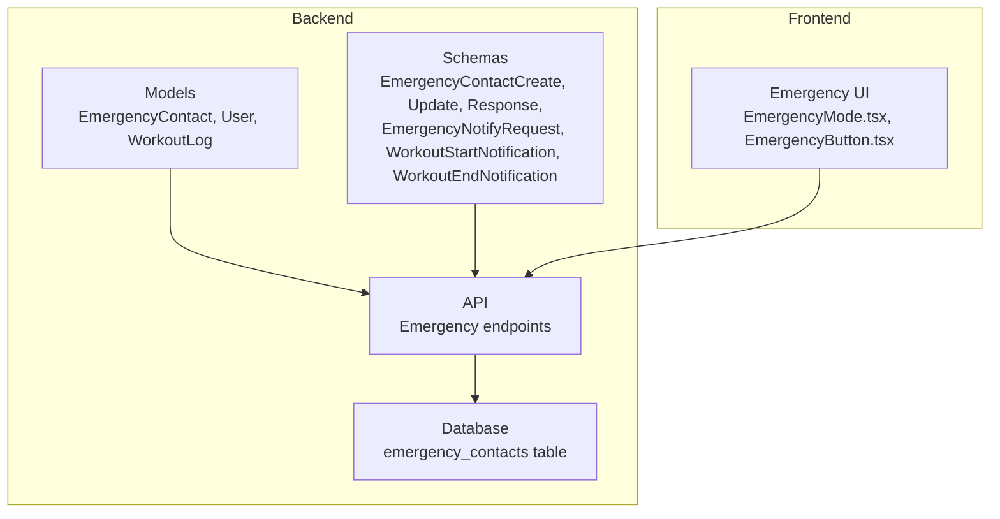
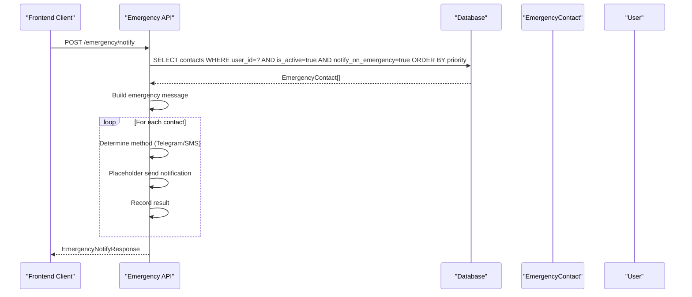
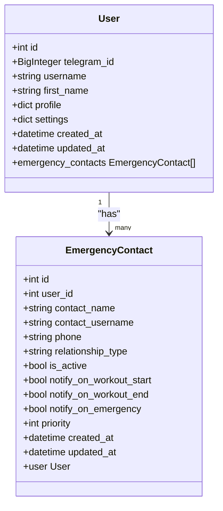
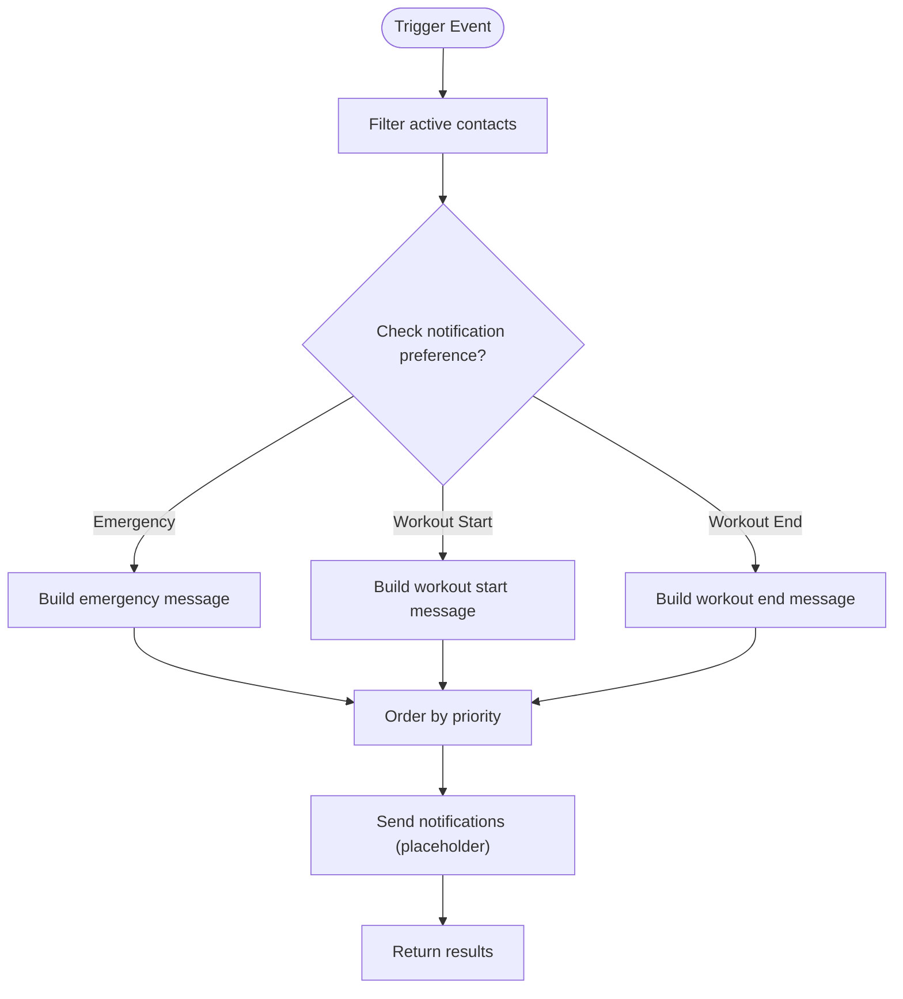
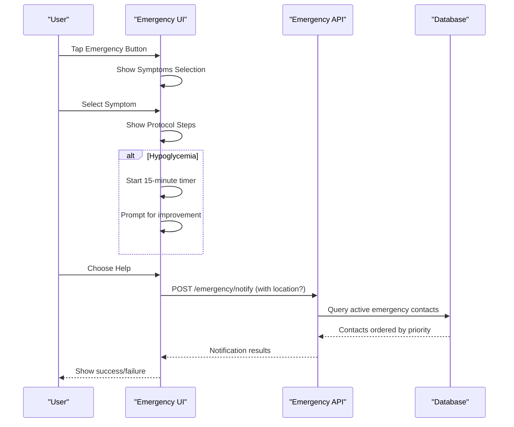
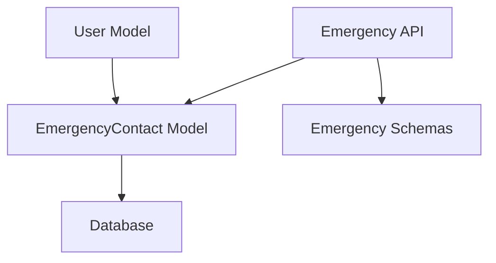

# Emergency & Safety Models

<cite>
**Referenced Files in This Document**
- [emergency_contact.py](file://backend/app/models/emergency_contact.py)
- [emergency.py](file://backend/app/schemas/emergency.py)
- [emergency.py](file://backend/app/api/emergency.py)
- [user.py](file://backend/app/models/user.py)
- [workout_log.py](file://backend/app/models/workout_log.py)
- [cd723942379e_initial_schema.py](file://database/migrations/versions/cd723942379e_initial_schema.py)
- [EmergencyMode.tsx](file://frontend/src/components/emergency/EmergencyMode.tsx)
- [EmergencyButton.tsx](file://frontend/src/components/home/EmergencyButton.tsx)
- [telegram_auth.py](file://backend/app/utils/telegram_auth.py)
</cite>

## Table of Contents
1. [Introduction](#introduction)
2. [Project Structure](#project-structure)
3. [Core Components](#core-components)
4. [Architecture Overview](#architecture-overview)
5. [Detailed Component Analysis](#detailed-component-analysis)
6. [Dependency Analysis](#dependency-analysis)
7. [Performance Considerations](#performance-considerations)
8. [Troubleshooting Guide](#troubleshooting-guide)
9. [Conclusion](#conclusion)

## Introduction
This document provides comprehensive data model documentation for FitTracker Pro's emergency and safety features. It focuses on the EmergencyContact model, contact prioritization, notification preferences, relationship types, and active status management. It also explains notification trigger configurations for workout events and emergency situations, contact hierarchy management, priority ordering, and bulk notification workflows. Validation rules for contact information, relationship categorization, and notification timing are documented, along with integration points for workout sessions and examples of emergency workflow scenarios.

## Project Structure
The emergency and safety features span backend models, schemas, APIs, database migrations, and frontend components:

- Backend models define the EmergencyContact entity and relationships with User and WorkoutLog.
- Schemas define Pydantic models for request/response validation and serialization.
- API endpoints implement emergency contact CRUD, bulk emergency notifications, and workout event notifications.
- Database migrations establish the emergency_contacts table with indexes and constraints.
- Frontend components provide user interfaces for emergency mode, contact selection, and notification sending.

**Diagram sources**
- [emergency_contact.py:17-112](file://backend/app/models/emergency_contact.py#L17-L112)
- [emergency.py:10-117](file://backend/app/schemas/emergency.py#L10-L117)
- [emergency.py:27-543](file://backend/app/api/emergency.py#L27-L543)
- [cd723942379e_initial_schema.py:347-380](file://database/migrations/versions/cd723942379e_initial_schema.py#L347-L380)
- [EmergencyMode.tsx:1-1079](file://frontend/src/components/emergency/EmergencyMode.tsx#L1-L1079)
- [EmergencyButton.tsx:1-109](file://frontend/src/components/home/EmergencyButton.tsx#L1-L109)

**Section sources**
- [emergency_contact.py:17-112](file://backend/app/models/emergency_contact.py#L17-L112)
- [emergency.py:10-117](file://backend/app/schemas/emergency.py#L10-L117)
- [emergency.py:27-543](file://backend/app/api/emergency.py#L27-L543)
- [cd723942379e_initial_schema.py:347-380](file://database/migrations/versions/cd723942379e_initial_schema.py#L347-L380)
- [EmergencyMode.tsx:1-1079](file://frontend/src/components/emergency/EmergencyMode.tsx#L1-L1079)
- [EmergencyButton.tsx:1-109](file://frontend/src/components/home/EmergencyButton.tsx#L1-L109)

## Core Components
This section documents the EmergencyContact model and related components that form the foundation of FitTracker Pro's emergency and safety features.

- EmergencyContact model
  - Fields: id, user_id (foreign key), contact_name, contact_username, phone, relationship_type, is_active, notify_on_workout_start, notify_on_workout_end, notify_on_emergency, priority, created_at, updated_at.
  - Relationships: belongs to User via user_id; back-populated by User.emergency_contacts.
  - Indexes: user_id, is_active, priority for efficient filtering and ordering.
  - Active status management: is_active flag enables/disables contacts without deletion.
  - Priority ordering: integer priority with default 1; lower numbers indicate higher priority.
  - Notification preferences: booleans for workout start/end and emergency alerts.

- User model integration
  - User has a collection of emergency_contacts with cascade deletion.
  - User model includes profile and settings JSONB fields for broader user context.

- WorkoutLog model
  - Tracks completed workouts with exercises, duration, comments, tags, and glucose metrics.
  - Provides context for workout event notifications and potential integration points.

- Database schema
  - emergency_contacts table created with indexes on user_id, is_active, and priority.
  - Triggers update updated_at timestamps automatically.

**Section sources**
- [emergency_contact.py:17-112](file://backend/app/models/emergency_contact.py#L17-L112)
- [user.py:114-118](file://backend/app/models/user.py#L114-L118)
- [workout_log.py:19-112](file://backend/app/models/workout_log.py#L19-L112)
- [cd723942379e_initial_schema.py:347-380](file://database/migrations/versions/cd723942379e_initial_schema.py#L347-L380)

## Architecture Overview
The emergency and safety architecture integrates frontend emergency UI with backend models and APIs. The EmergencyContact model serves as the central data structure for managing contacts, while schemas validate requests and responses. API endpoints orchestrate notification workflows for emergencies and workout events, leveraging contact preferences and priority ordering.

**Diagram sources**
- [emergency.py:249-359](file://backend/app/api/emergency.py#L249-L359)
- [emergency_contact.py:17-112](file://backend/app/models/emergency_contact.py#L17-L112)

**Section sources**
- [emergency.py:249-359](file://backend/app/api/emergency.py#L249-L359)
- [emergency.py:68-98](file://backend/app/schemas/emergency.py#L68-L98)

## Detailed Component Analysis

### EmergencyContact Model
The EmergencyContact model defines the data structure and constraints for emergency contacts. It includes fields for personal identification, contact methods, relationship categorization, active status, and notification preferences. Priority ordering ensures contacts are processed in the desired sequence.

**Diagram sources**
- [emergency_contact.py:17-112](file://backend/app/models/emergency_contact.py#L17-L112)
- [user.py:23-132](file://backend/app/models/user.py#L23-L132)

Key attributes and behaviors:
- Contact identification: contact_name, contact_username, phone.
- Relationship categorization: relationship_type constrained to predefined categories.
- Active status: is_active flag for enabling/disabling contacts.
- Notification preferences: notify_on_workout_start, notify_on_workout_end, notify_on_emergency.
- Priority ordering: priority integer with default 1; lower values indicate higher priority.
- Timestamps: created_at and updated_at managed by SQLAlchemy defaults and triggers.

Validation rules and constraints:
- At least one contact method must be provided (contact_username or phone) when creating a contact.
- Relationship type must match one of the allowed values.
- Priority must be within a defined range.
- Boolean flags control notification preferences.

**Section sources**
- [emergency_contact.py:17-112](file://backend/app/models/emergency_contact.py#L17-L112)
- [emergency.py:10-40](file://backend/app/schemas/emergency.py#L10-L40)

### Notification Trigger Configurations
FitTracker Pro supports multiple notification triggers for workout events and emergency situations:

- Emergency notifications
  - Endpoint: POST /emergency/notify
  - Filters: active contacts who opted into emergency notifications.
  - Ordering: contacts ordered by priority.
  - Message composition: includes user name and optional location.
  - Methods: Telegram (when contact_username present) and SMS (when phone present).

- Workout start notifications
  - Endpoint: POST /emergency/notify/workout-start
  - Filters: active contacts who opted into workout start notifications.
  - Message composition: includes user name and optional estimated duration.

- Workout end notifications
  - Endpoint: POST /emergency/notify/workout-end
  - Filters: active contacts who opted into workout end notifications.
  - Message composition: includes user name, completion status, and duration.

- Settings endpoint
  - Endpoint: GET /emergency/settings
  - Returns counts of contacts and active contacts.

**Diagram sources**
- [emergency.py:249-450](file://backend/app/api/emergency.py#L249-L450)

**Section sources**
- [emergency.py:249-450](file://backend/app/api/emergency.py#L249-L450)
- [emergency.py:68-116](file://backend/app/schemas/emergency.py#L68-L116)

### Contact Hierarchy Management and Priority Ordering
Contact hierarchy is managed through the priority field and active status:

- Priority ordering
  - Contacts are ordered by priority ascending (lower numbers first).
  - Default priority is 1; values typically range from 1 to 10.
  - Ordering ensures critical contacts receive notifications first.

- Active status management
  - is_active flag determines whether a contact participates in notifications.
  - Deactivating a contact removes it from active notification lists without permanent deletion.

- Bulk notification workflows
  - Emergency notifications iterate through active contacts ordered by priority.
  - Workout start/end notifications filter contacts by their respective preferences.

**Section sources**
- [emergency_contact.py:80-86](file://backend/app/models/emergency_contact.py#L80-L86)
- [emergency.py:293-302](file://backend/app/api/emergency.py#L293-L302)

### Validation Rules and Data Integrity
The system enforces validation rules at both the database and application levels:

- Database constraints
  - emergency_contacts table includes indexes on user_id, is_active, and priority for efficient queries.
  - Triggers automatically update updated_at timestamps.

- Application-level validation
  - EmergencyContactCreate requires at least one contact method (contact_username or phone).
  - Relationship type must match predefined categories.
  - Priority must be within a defined range.
  - Severity values for emergency notifications are restricted to specific values.

**Section sources**
- [cd723942379e_initial_schema.py:347-380](file://database/migrations/versions/cd723942379e_initial_schema.py#L347-L380)
- [emergency.py:10-40](file://backend/app/schemas/emergency.py#L10-L40)
- [emergency.py:68-78](file://backend/app/schemas/emergency.py#L68-L78)

### Integration with Workout Sessions
While the current implementation marks notification endpoints as placeholders, the architecture supports integration with workout sessions:

- WorkoutLog context
  - WorkoutLog captures workout metadata, duration, and health metrics.
  - This context could inform workout event notifications.

- Notification triggers
  - Workout start and end endpoints accept workout_id and related parameters.
  - Messages can include workout type, duration, and completion status.

- Future integration opportunities
  - Automatic workout start/end notifications could be triggered by workout lifecycle events.
  - Emergency notifications could leverage workout context (e.g., location sharing).

**Section sources**
- [workout_log.py:19-112](file://backend/app/models/workout_log.py#L19-L112)
- [emergency.py:362-450](file://backend/app/api/emergency.py#L362-L450)

### Frontend Emergency Workflow Scenarios
The frontend provides interactive components for emergency workflows:

- EmergencyMode.tsx
  - Comprehensive emergency response system with symptom selection, hypoglycemia protocol, and contact notification.
  - Supports location sharing toggle and contact selection.
  - Implements haptic feedback and progress indicators.

- EmergencyButton.tsx
  - Sticky emergency button with confirmation modal for triggering emergency actions.
  - Provides immediate access to emergency assistance.

**Diagram sources**
- [EmergencyMode.tsx:1-1079](file://frontend/src/components/emergency/EmergencyMode.tsx#L1-L1079)
- [EmergencyButton.tsx:1-109](file://frontend/src/components/home/EmergencyButton.tsx#L1-L109)
- [emergency.py:249-359](file://backend/app/api/emergency.py#L249-L359)

**Section sources**
- [EmergencyMode.tsx:1-1079](file://frontend/src/components/emergency/EmergencyMode.tsx#L1-L1079)
- [EmergencyButton.tsx:1-109](file://frontend/src/components/home/EmergencyButton.tsx#L1-L109)

## Dependency Analysis
The emergency and safety features depend on several backend components and relationships:

- Model dependencies
  - EmergencyContact depends on User via foreign key and relationship.
  - User has a collection of EmergencyContact instances.

- API dependencies
  - Emergency endpoints depend on SQLAlchemy ORM for database operations.
  - Endpoints use Pydantic schemas for request/response validation.

- Database dependencies
  - emergency_contacts table relies on indexes for efficient filtering and ordering.
  - Triggers ensure updated_at timestamps remain current.

**Diagram sources**
- [emergency_contact.py:17-112](file://backend/app/models/emergency_contact.py#L17-L112)
- [user.py:114-118](file://backend/app/models/user.py#L114-L118)
- [emergency.py:27-543](file://backend/app/api/emergency.py#L27-L543)
- [emergency.py:10-117](file://backend/app/schemas/emergency.py#L10-L117)

**Section sources**
- [emergency_contact.py:17-112](file://backend/app/models/emergency_contact.py#L17-L112)
- [user.py:114-118](file://backend/app/models/user.py#L114-L118)
- [emergency.py:27-543](file://backend/app/api/emergency.py#L27-L543)
- [emergency.py:10-117](file://backend/app/schemas/emergency.py#L10-L117)

## Performance Considerations
- Index utilization
  - Indexes on user_id, is_active, and priority enable efficient filtering and ordering of contacts.
  - Consider adding composite indexes if frequently queried combinations arise.

- Query optimization
  - Emergency notifications filter by is_active and notify_on_emergency, then order by priority.
  - Workout event notifications filter by specific preference flags.

- Notification throughput
  - Current implementation uses placeholder logic; actual implementation should batch and parallelize notifications.
  - Consider rate limiting and retry mechanisms for external services.

- Data consistency
  - Triggers ensure updated_at timestamps are accurate.
  - Cascade deletion maintains referential integrity for emergency contacts.

## Troubleshooting Guide
Common issues and resolutions:

- No active emergency contacts configured
  - Symptom: Emergency notification endpoint returns an error indicating no active contacts.
  - Resolution: Ensure at least one contact is active and has notify_on_emergency enabled.

- Missing contact method
  - Symptom: Creating a contact fails validation.
  - Resolution: Provide either contact_username or phone when creating a contact.

- Incorrect relationship type
  - Symptom: Validation error for relationship_type.
  - Resolution: Use one of the allowed values: family, friend, doctor, trainer, other.

- Priority out of range
  - Symptom: Validation error for priority.
  - Resolution: Ensure priority is between the defined minimum and maximum values.

- Workout event notification not sent
  - Symptom: Workout start/end notifications not reaching contacts.
  - Resolution: Verify contacts have the respective notify_on_workout_start or notify_on_workout_end flags enabled.

**Section sources**
- [emergency.py:112-117](file://backend/app/api/emergency.py#L112-L117)
- [emergency.py:15-18](file://backend/app/schemas/emergency.py#L15-L18)
- [emergency.py:23-39](file://backend/app/schemas/emergency.py#L23-L39)
- [emergency.py:293-309](file://backend/app/api/emergency.py#L293-L309)

## Conclusion
FitTracker Pro's emergency and safety features are built around a robust EmergencyContact model with comprehensive validation, priority-based ordering, and flexible notification preferences. The backend provides well-defined APIs for emergency notifications and workout event triggers, while the frontend offers intuitive user interfaces for emergency workflows. The database schema supports efficient queries through strategic indexing, and the architecture allows for future enhancements such as automatic workout notifications and enhanced integration with external services.