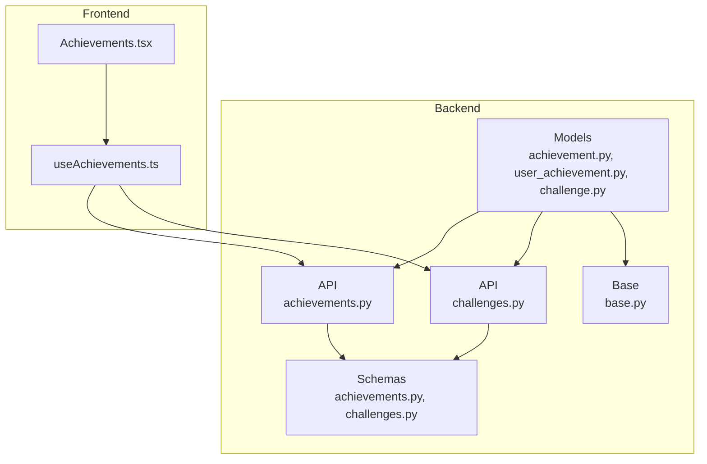
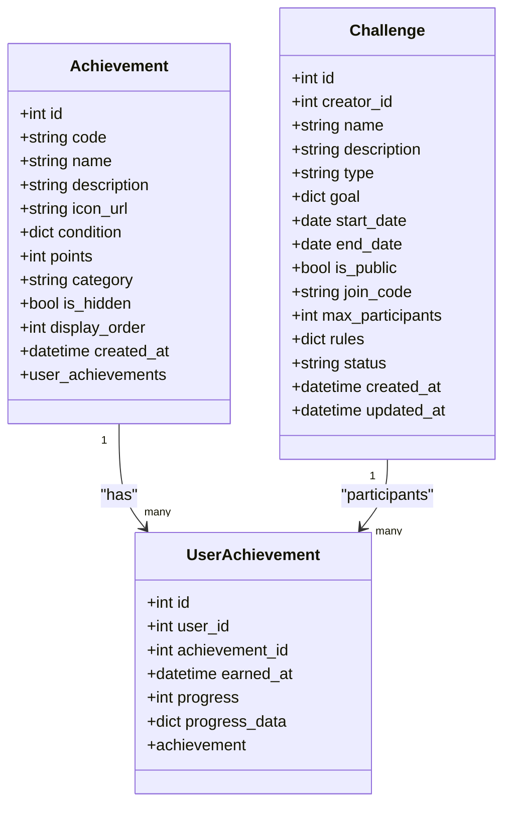
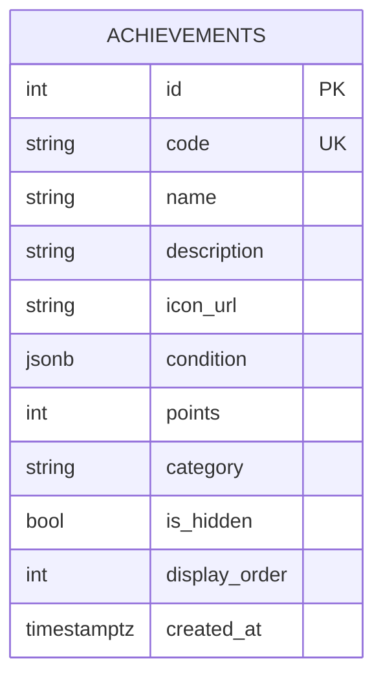
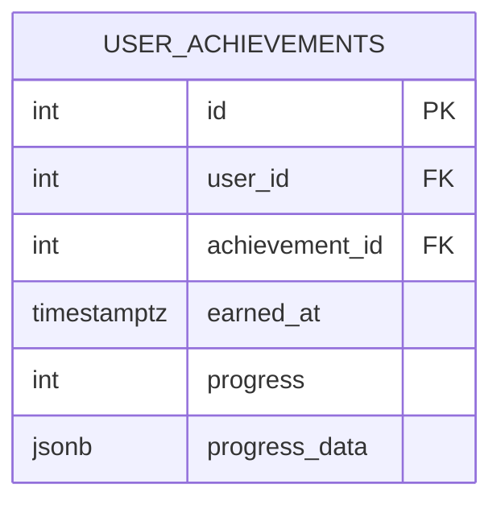
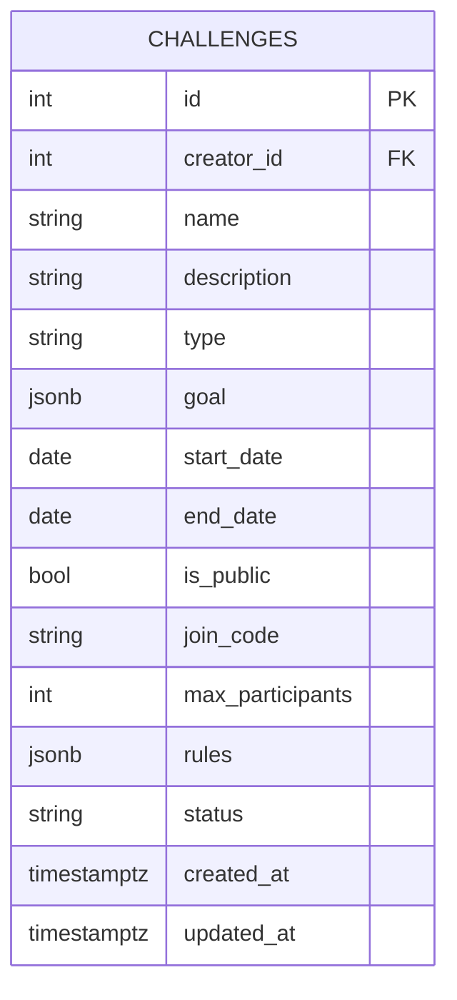
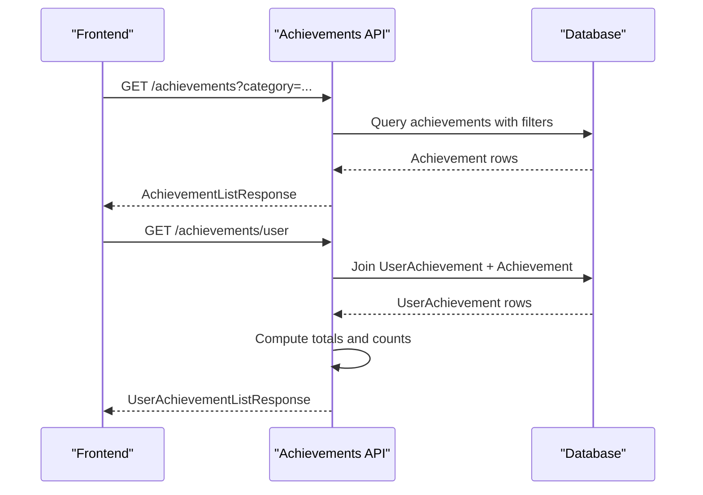
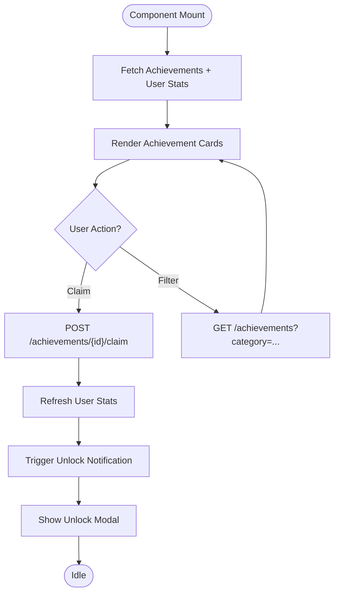
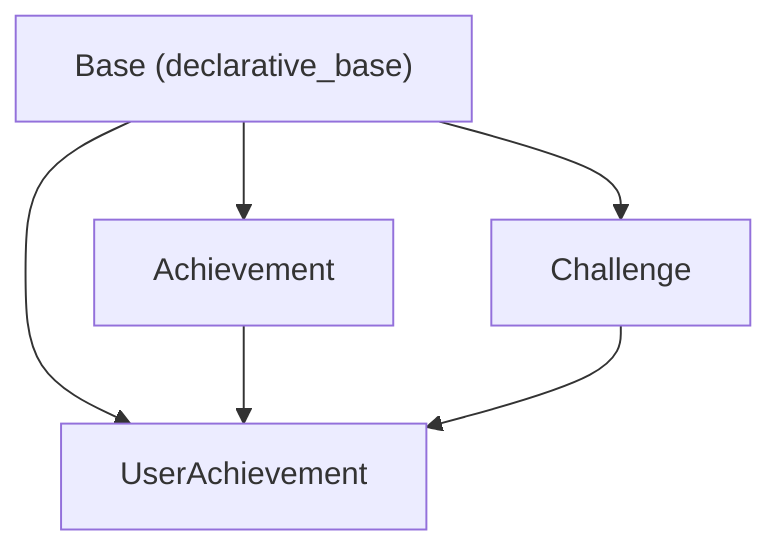

# Gamification System Models

<cite>
**Referenced Files in This Document**
- [achievement.py](file://backend/app/models/achievement.py)
- [user_achievement.py](file://backend/app/models/user_achievement.py)
- [challenge.py](file://backend/app/models/challenge.py)
- [achievements.py](file://backend/app/api/achievements.py)
- [challenges.py](file://backend/app/api/challenges.py)
- [achievements.py](file://backend/app/schemas/achievements.py)
- [challenges.py](file://backend/app/schemas/challenges.py)
- [base.py](file://backend/app/models/base.py)
- [cd723942379e_initial_schema.py](file://database/migrations/versions/cd723942379e_initial_schema.py)
- [Achievements.tsx](file://frontend/src/components/gamification/Achievements.tsx)
- [useAchievements.ts](file://frontend/src/hooks/useAchievements.ts)
</cite>

## Table of Contents
1. [Introduction](#introduction)
2. [Project Structure](#project-structure)
3. [Core Components](#core-components)
4. [Architecture Overview](#architecture-overview)
5. [Detailed Component Analysis](#detailed-component-analysis)
6. [Dependency Analysis](#dependency-analysis)
7. [Performance Considerations](#performance-considerations)
8. [Troubleshooting Guide](#troubleshooting-guide)
9. [Conclusion](#conclusion)

## Introduction
This document provides comprehensive data model documentation for FitTracker Pro's gamification and social features. It covers the Achievement model with condition-based unlocking criteria, point systems, categories, and progress tracking; the UserAchievement model for individual progress tracking, earned timestamps, and progress data persistence; and the Challenge model for community competitions including goals, participant limits, join codes, and rule enforcement. It also documents JSONB structures for complex achievement conditions and challenge requirements, scoring algorithms, progress calculation logic, and leaderboard data structures. Finally, it explains relationships between users, achievements, and challenges, and provides examples of gamification workflows and achievement unlock patterns.

## Project Structure
The gamification system spans backend models, APIs, schemas, and frontend components:
- Backend models define the persistent data structures for achievements, user progress, and challenges.
- Backend APIs expose endpoints for managing and querying achievements and challenges.
- Schemas define request/response data contracts for gamification features.
- Frontend components render achievement lists, progress tracking, unlock modals, and leaderboard views.

**Diagram sources**
- [achievement.py:17-105](file://backend/app/models/achievement.py#L17-L105)
- [user_achievement.py:18-71](file://backend/app/models/user_achievement.py#L18-L71)
- [challenge.py:17-138](file://backend/app/models/challenge.py#L17-L138)
- [achievements.py:25-420](file://backend/app/api/achievements.py#L25-L420)
- [challenges.py:32-497](file://backend/app/api/challenges.py#L32-L497)
- [achievements.py:10-81](file://backend/app/schemas/achievements.py#L10-L81)
- [challenges.py:10-134](file://backend/app/schemas/challenges.py#L10-L134)
- [base.py:1-7](file://backend/app/models/base.py#L1-L7)
- [Achievements.tsx:626-934](file://frontend/src/components/gamification/Achievements.tsx#L626-L934)
- [useAchievements.ts:67-278](file://frontend/src/hooks/useAchievements.ts#L67-L278)

**Section sources**
- [achievement.py:17-105](file://backend/app/models/achievement.py#L17-L105)
- [user_achievement.py:18-71](file://backend/app/models/user_achievement.py#L18-L71)
- [challenge.py:17-138](file://backend/app/models/challenge.py#L17-L138)
- [achievements.py:25-420](file://backend/app/api/achievements.py#L25-L420)
- [challenges.py:32-497](file://backend/app/api/challenges.py#L32-L497)
- [achievements.py:10-81](file://backend/app/schemas/achievements.py#L10-L81)
- [challenges.py:10-134](file://backend/app/schemas/challenges.py#L10-L134)
- [base.py:1-7](file://backend/app/models/base.py#L1-L7)
- [Achievements.tsx:626-934](file://frontend/src/components/gamification/Achievements.tsx#L626-L934)
- [useAchievements.ts:67-278](file://frontend/src/hooks/useAchievements.ts#L67-L278)

## Core Components
This section documents the three core gamification models and their relationships.

### Achievement Model
The Achievement model defines system-wide achievements with unlock conditions, point rewards, categories, and display metadata. Conditions are stored as JSONB to support flexible criteria such as workout counts, streak days, calories burned, and health metrics.

Key attributes:
- Unique code and display name
- Description and optional icon URL
- Condition stored as JSONB with fields like type and target
- Points awarded upon unlock
- Category (workouts, health, streaks, social, general)
- Hidden flag for locked-by-default achievements
- Display order for UI sorting
- Created timestamp

Relationships:
- Has many UserAchievement records via back_populates

Indexes:
- Unique code
- Category
- Display order

**Section sources**
- [achievement.py:17-105](file://backend/app/models/achievement.py#L17-L105)
- [cd723942379e_initial_schema.py:236-265](file://database/migrations/versions/cd723942379e_initial_schema.py#L236-L265)

### UserAchievement Model
The UserAchievement model tracks individual user progress and unlocks for achievements. It persists earned timestamps, progress percentage, and additional progress data.

Key attributes:
- user_id and achievement_id foreign keys
- earned_at timestamp
- progress integer (0–100)
- progress_data JSONB for auxiliary tracking
- Back relationships to User and Achievement

Indexes:
- Composite unique (user_id, achievement_id)
- User and achievement foreign keys
- Earned timestamp

Scoring and progress:
- Progress threshold of 100% indicates completion
- Points are summed from all completed achievements for leaderboard calculations

**Section sources**
- [user_achievement.py:18-71](file://backend/app/models/user_achievement.py#L18-L71)
- [cd723942379e_initial_schema.py:269-294](file://database/migrations/versions/cd723942379e_initial_schema.py#L269-L294)

### Challenge Model
The Challenge model supports community fitness competitions with goals, dates, visibility, join codes, participant limits, and rules.

Key attributes:
- Creator reference
- Name, optional description, and banner URL
- Type (workout_count, duration, calories, distance, custom)
- Goal stored as JSONB with type, target, unit, and optional description
- Start and end dates
- Public/private visibility and join code
- Max participants (0 = unlimited)
- Rules stored as JSONB (e.g., min/max workouts per period)
- Status (upcoming, active, completed, cancelled)
- Created and updated timestamps

Indexes:
- Creator, type, dates, public flag, status, join code

**Section sources**
- [challenge.py:17-138](file://backend/app/models/challenge.py#L17-L138)
- [cd723942379e_initial_schema.py:298-345](file://database/migrations/versions/cd723942379e_initial_schema.py#L298-L345)

## Architecture Overview
The gamification architecture integrates backend models and APIs with frontend components for rendering and user interaction.

**Diagram sources**
- [achievement.py:17-105](file://backend/app/models/achievement.py#L17-L105)
- [user_achievement.py:18-71](file://backend/app/models/user_achievement.py#L18-L71)
- [challenge.py:17-138](file://backend/app/models/challenge.py#L17-L138)

## Detailed Component Analysis

### Achievement Model Details
- Condition JSONB structure supports multiple criteria types:
  - workout_count with target count
  - streak_days with target consecutive days
  - calories_burned with lifetime target
  - wellness_streak with consecutive days
  - sleep_score with threshold and count
  - challenge_created and template_shared for social milestones
- Points determine achievement rarity and leaderboard weighting
- Categories enable filtering and grouping in UI
- Hidden achievements remain locked until criteria are met

**Diagram sources**
- [achievement.py:17-105](file://backend/app/models/achievement.py#L17-L105)
- [cd723942379e_initial_schema.py:236-265](file://database/migrations/versions/cd723942379e_initial_schema.py#L236-L265)

**Section sources**
- [achievement.py:17-105](file://backend/app/models/achievement.py#L17-L105)
- [cd723942379e_initial_schema.py:427-445](file://database/migrations/versions/cd723942379e_initial_schema.py#L427-L445)

### UserAchievement Model Details
- Progress tracking:
  - progress integer from 0 to 100
  - progress_data JSONB for auxiliary metrics (e.g., counts, timestamps)
- Unlocks:
  - earned_at timestamp marks when progress reaches 100%
  - uniqueness constraint ensures single record per user-achievement pair
- Scoring:
  - total_points computed by summing points from all completed achievements
  - used for global leaderboards

**Diagram sources**
- [user_achievement.py:18-71](file://backend/app/models/user_achievement.py#L18-L71)
- [cd723942379e_initial_schema.py:269-294](file://database/migrations/versions/cd723942379e_initial_schema.py#L269-L294)

**Section sources**
- [user_achievement.py:18-71](file://backend/app/models/user_achievement.py#L18-L71)
- [achievements.py:312-420](file://backend/app/api/achievements.py#L312-L420)

### Challenge Model Details
- Goal JSONB:
  - type: count, duration, distance, etc.
  - target: numeric threshold
  - unit: measurement unit
  - description: optional human-readable description
- Rules JSONB:
  - min_workouts_per_week, max_workouts_per_day
  - allowed_workout_types, excluded_exercises
- Visibility and participation:
  - is_public toggles open enrollment
  - join_code enables private challenges
  - max_participants (0 = unlimited)
- Status lifecycle:
  - upcoming, active, completed, cancelled based on dates

**Diagram sources**
- [challenge.py:17-138](file://backend/app/models/challenge.py#L17-L138)
- [cd723942379e_initial_schema.py:298-345](file://database/migrations/versions/cd723942379e_initial_schema.py#L298-L345)

**Section sources**
- [challenge.py:17-138](file://backend/app/models/challenge.py#L17-L138)
- [challenges.py:32-497](file://backend/app/api/challenges.py#L32-L497)

### API Workflows and Leaderboard Logic
- Achievements API:
  - Lists all achievements with optional category filter
  - Returns user-specific progress and completion status
  - Calculates total points, completed/in-progress counts, and recent achievements
  - Provides leaderboard endpoint aggregating points and counts by user
- Challenges API:
  - Creates challenges with automatic status based on dates
  - Generates join codes for private challenges
  - Validates join rules (status, code, participant limits)
  - Placeholder endpoints for participant management and leaderboard

**Diagram sources**
- [achievements.py:25-171](file://backend/app/api/achievements.py#L25-L171)

**Section sources**
- [achievements.py:25-171](file://backend/app/api/achievements.py#L25-L171)
- [achievements.py:312-420](file://backend/app/api/achievements.py#L312-L420)
- [challenges.py:32-497](file://backend/app/api/challenges.py#L32-L497)

### Frontend Integration
- Achievements component renders achievement cards, progress bars, and unlock modals.
- useAchievements hook manages fetching, progress checks, and real-time notifications for new unlocks.
- Automatic polling detects newly completed achievements and triggers haptic feedback and UI updates.

**Diagram sources**
- [Achievements.tsx:626-934](file://frontend/src/components/gamification/Achievements.tsx#L626-L934)
- [useAchievements.ts:67-278](file://frontend/src/hooks/useAchievements.ts#L67-L278)

**Section sources**
- [Achievements.tsx:626-934](file://frontend/src/components/gamification/Achievements.tsx#L626-L934)
- [useAchievements.ts:67-278](file://frontend/src/hooks/useAchievements.ts#L67-L278)

## Dependency Analysis
The gamification models rely on a shared Base class and are indexed for efficient querying. The Achievement and Challenge models store complex criteria in JSONB, enabling flexible rule definitions. The UserAchievement model bridges users and achievements, supporting progress tracking and scoring.

**Diagram sources**
- [base.py:1-7](file://backend/app/models/base.py#L1-L7)
- [achievement.py:17-105](file://backend/app/models/achievement.py#L17-L105)
- [user_achievement.py:18-71](file://backend/app/models/user_achievement.py#L18-L71)
- [challenge.py:17-138](file://backend/app/models/challenge.py#L17-L138)

**Section sources**
- [base.py:1-7](file://backend/app/models/base.py#L1-L7)
- [achievement.py:17-105](file://backend/app/models/achievement.py#L17-L105)
- [user_achievement.py:18-71](file://backend/app/models/user_achievement.py#L18-L71)
- [challenge.py:17-138](file://backend/app/models/challenge.py#L17-L138)

## Performance Considerations
- JSONB indexing:
  - Achievements condition and display_order indexes optimize filtering and ordering.
  - UserAchievement progress_data index supports auxiliary queries.
  - Challenges goal and rules indexes enable complex filtering and rule evaluation.
- Query patterns:
  - Use filtered queries by category, status, and dates to minimize result sets.
  - Aggregate points and counts efficiently with GROUP BY and SUM in leaderboard queries.
- Frontend polling:
  - Periodic checks for new unlocks reduce unnecessary network requests while maintaining responsiveness.

[No sources needed since this section provides general guidance]

## Troubleshooting Guide
Common issues and resolutions:
- Achievement unlock not persisting:
  - Verify progress reaches 100% and earned_at is updated.
  - Confirm unique constraint on user_id + achievement_id prevents duplicates.
- Challenge join failures:
  - Ensure challenge status allows joining and join code matches for private challenges.
  - Check participant limits and date validity.
- Leaderboard discrepancies:
  - Confirm progress threshold of 100% for completed achievements.
  - Validate points aggregation and user ranking logic.

**Section sources**
- [user_achievement.py:18-71](file://backend/app/models/user_achievement.py#L18-L71)
- [achievements.py:312-420](file://backend/app/api/achievements.py#L312-L420)
- [challenges.py:317-394](file://backend/app/api/challenges.py#L317-L394)

## Conclusion
FitTracker Pro’s gamification system leverages flexible JSONB structures for achievement and challenge conditions, robust progress tracking through UserAchievement, and efficient leaderboard computations. The architecture balances extensibility with performance through strategic indexing and clean separation of concerns across models, APIs, schemas, and frontend components. This foundation supports scalable growth of achievements, challenges, and social engagement features.