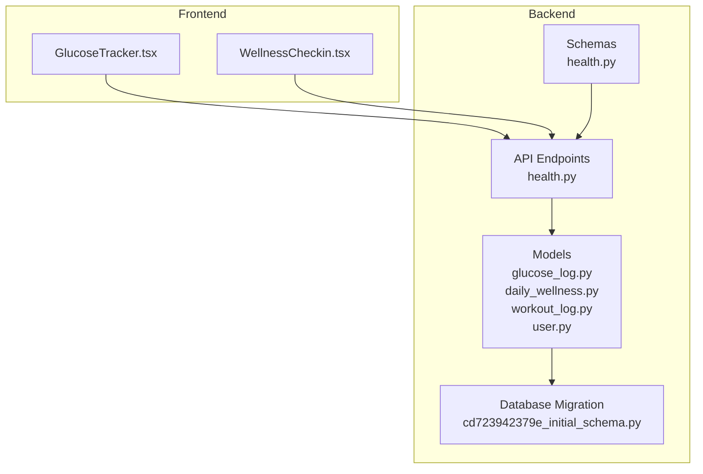
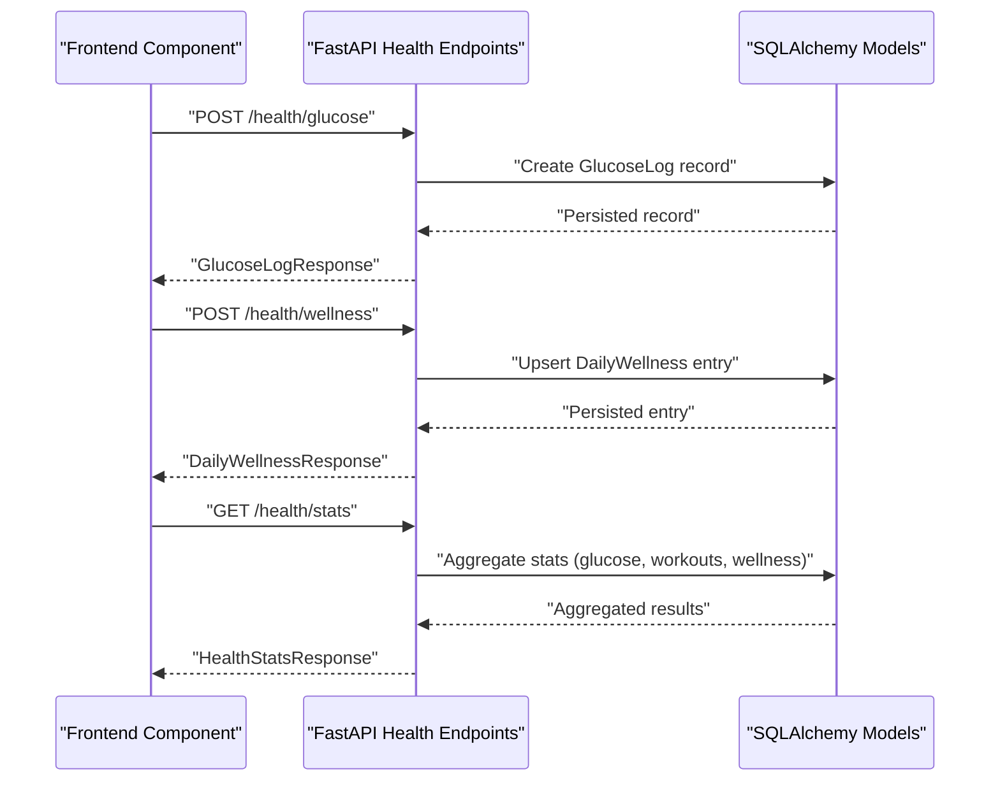
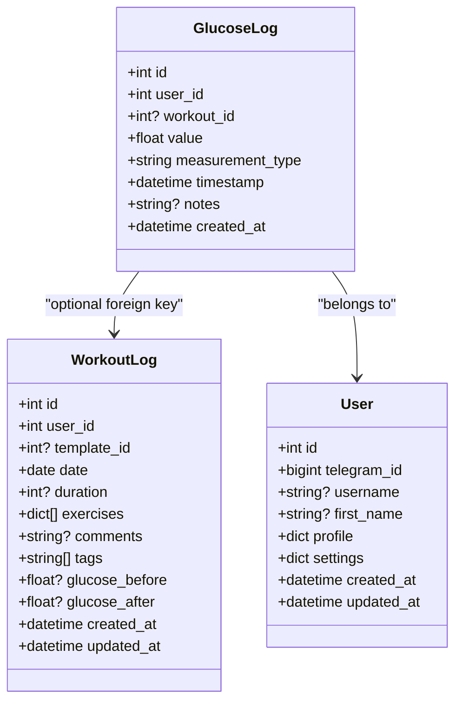
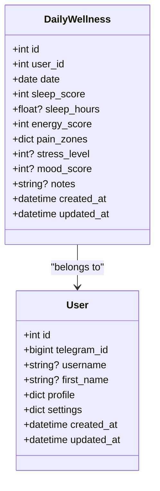
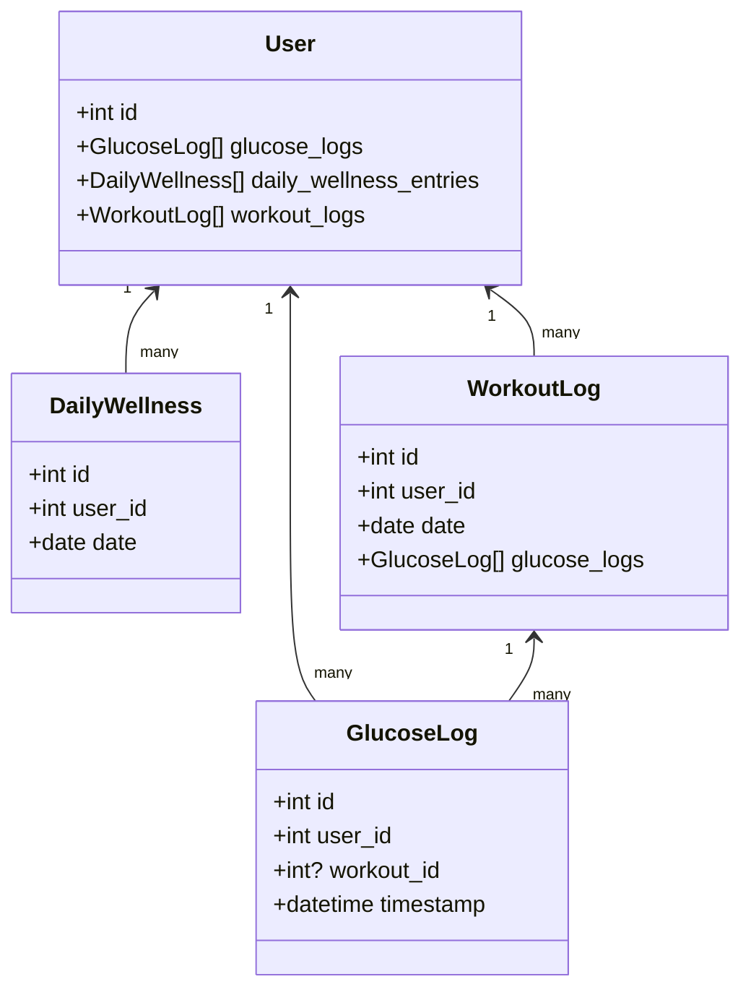

# Health Metrics Models

<cite>
**Referenced Files in This Document**
- [glucose_log.py](file://backend/app/models/glucose_log.py)
- [daily_wellness.py](file://backend/app/models/daily_wellness.py)
- [health.py](file://backend/app/api/health.py)
- [health.py](file://backend/app/schemas/health.py)
- [workout_log.py](file://backend/app/models/workout_log.py)
- [user.py](file://backend/app/models/user.py)
- [cd723942379e_initial_schema.py](file://database/migrations/versions/cd723942379e_initial_schema.py)
- [GlucoseTracker.tsx](file://frontend/src/components/health/GlucoseTracker.tsx)
- [WellnessCheckin.tsx](file://frontend/src/components/health/WellnessCheckin.tsx)
</cite>

## Table of Contents
1. [Introduction](#introduction)
2. [Project Structure](#project-structure)
3. [Core Components](#core-components)
4. [Architecture Overview](#architecture-overview)
5. [Detailed Component Analysis](#detailed-component-analysis)
6. [Dependency Analysis](#dependency-analysis)
7. [Performance Considerations](#performance-considerations)
8. [Troubleshooting Guide](#troubleshooting-guide)
9. [Conclusion](#conclusion)

## Introduction
This document provides comprehensive data model documentation for FitTracker Pro’s health monitoring entities focused on blood sugar tracking and daily wellness assessment. It explains the GlucoseLog model for blood glucose measurements with workout associations, the DailyWellness model for holistic health metrics, JSONB data structures for flexible wellness tracking, scoring algorithms, and trend analysis. It also documents validation rules, indexing strategies for time-series analytics, and practical examples of integrating health data with workout sessions.

## Project Structure
The health metrics are implemented in the backend Python application with SQLAlchemy ORM models, FastAPI endpoints, and Pydantic schemas. The frontend components integrate with these APIs to collect and visualize health data.

**Diagram sources**
- [glucose_log.py:1-80](file://backend/app/models/glucose_log.py#L1-L80)
- [daily_wellness.py:1-118](file://backend/app/models/daily_wellness.py#L1-L118)
- [health.py:1-615](file://backend/app/api/health.py#L1-L615)
- [health.py:1-134](file://backend/app/schemas/health.py#L1-L134)
- [cd723942379e_initial_schema.py:168-232](file://database/migrations/versions/cd723942379e_initial_schema.py#L168-L232)
- [GlucoseTracker.tsx:1-762](file://frontend/src/components/health/GlucoseTracker.tsx#L1-L762)
- [WellnessCheckin.tsx:1-1207](file://frontend/src/components/health/WellnessCheckin.tsx#L1-L1207)

**Section sources**
- [glucose_log.py:1-80](file://backend/app/models/glucose_log.py#L1-L80)
- [daily_wellness.py:1-118](file://backend/app/models/daily_wellness.py#L1-L118)
- [health.py:1-615](file://backend/app/api/health.py#L1-L615)
- [health.py:1-134](file://backend/app/schemas/health.py#L1-L134)
- [cd723942379e_initial_schema.py:168-232](file://database/migrations/versions/cd723942379e_initial_schema.py#L168-L232)
- [GlucoseTracker.tsx:1-762](file://frontend/src/components/health/GlucoseTracker.tsx#L1-L762)
- [WellnessCheckin.tsx:1-1207](file://frontend/src/components/health/WellnessCheckin.tsx#L1-L1207)

## Core Components
- GlucoseLog: Tracks blood glucose measurements with timestamps, measurement types, optional workout association, and notes.
- DailyWellness: Captures daily self-reported wellness metrics including sleep, energy, pain zones, stress, and mood.
- WorkoutLog: Stores completed workout details and optional glucose measurements before/after exercise.
- User: Central entity with relationships to health metrics and workouts.

Key implementation highlights:
- GlucoseLog supports five measurement types: fasting, pre_workout, post_workout, random, bedtime.
- DailyWellness pain_zones uses a JSONB object with predefined body zones and 0–10 severity scales.
- Both models include timezone-aware timestamps and appropriate numeric precision for glucose values.

**Section sources**
- [glucose_log.py:18-80](file://backend/app/models/glucose_log.py#L18-L80)
- [daily_wellness.py:17-118](file://backend/app/models/daily_wellness.py#L17-L118)
- [workout_log.py:19-112](file://backend/app/models/workout_log.py#L19-L112)
- [user.py:23-132](file://backend/app/models/user.py#L23-L132)

## Architecture Overview
The health metrics architecture connects frontend components to backend endpoints, which persist data via SQLAlchemy models and expose analytics through database indexes and queries.

**Diagram sources**
- [health.py:29-200](file://backend/app/api/health.py#L29-L200)
- [health.py:259-378](file://backend/app/api/health.py#L259-L378)
- [health.py:409-615](file://backend/app/api/health.py#L409-L615)
- [glucose_log.py:18-80](file://backend/app/models/glucose_log.py#L18-L80)
- [daily_wellness.py:17-118](file://backend/app/models/daily_wellness.py#L17-L118)

## Detailed Component Analysis

### GlucoseLog Model
Purpose:
- Track blood glucose measurements with timestamps and optional workout association.
- Support five measurement types aligned with workout timing and routine.

Fields and constraints:
- value: Numeric with precision sufficient for mmol/L; validated via schema to 2.0–30.0.
- measurement_type: String constrained to predefined types.
- timestamp: DateTime with timezone; indexed for efficient time-series queries.
- workout_id: Foreign key to workout_logs; enables correlation between glucose and exercise.
- Notes: Optional free-form text up to 500 characters.

Indexing strategy:
- Individual indexes on user_id, workout_id, timestamp, measurement_type.
- Composite index on (user_id, timestamp) to optimize per-user time-series queries.

Integration with workout sessions:
- Frontend GlucoseTracker supports associating a reading with a workout session.
- Backend validates workout ownership before linking.

Validation rules:
- Numeric range: 2.0–30.0 mmol/L.
- Measurement type enumeration: fasting, pre_workout, post_workout, random, bedtime.
- Temporal constraints: timestamp defaults to current time if not provided.

Scoring and trend analysis:
- Average, min, max computed over configurable windows.
- In-range percentage computed against a 4.0–7.0 target range.

**Diagram sources**
- [glucose_log.py:18-80](file://backend/app/models/glucose_log.py#L18-L80)
- [workout_log.py:19-112](file://backend/app/models/workout_log.py#L19-L112)
- [user.py:23-132](file://backend/app/models/user.py#L23-L132)

**Section sources**
- [glucose_log.py:18-80](file://backend/app/models/glucose_log.py#L18-L80)
- [health.py:10-23](file://backend/app/schemas/health.py#L10-L23)
- [health.py:29-200](file://backend/app/api/health.py#L29-L200)
- [cd723942379e_initial_schema.py:168-196](file://database/migrations/versions/cd723942379e_initial_schema.py#L168-L196)
- [GlucoseTracker.tsx:520-692](file://frontend/src/components/health/GlucoseTracker.tsx#L520-L692)

### DailyWellness Model
Purpose:
- Capture daily subjective health metrics for holistic wellness tracking.

Fields and constraints:
- date: Unique per user-date combination to prevent duplicates.
- sleep_score: Integer 0–100; sleep_hours: Numeric with 0.1 precision.
- energy_score: Integer 0–100.
- pain_zones: JSONB object with predefined body zones; each zone is 0–10.
- stress_level: Optional 0–10.
- mood_score: Optional 0–100.
- notes: Optional free-form text up to 1000 characters.

Indexing strategy:
- Individual indexes on user_id, date, sleep_score, energy_score.
- Unique composite index on (user_id, date) to enforce single-entry-per-day.

JSONB data structure for pain_zones:
- Keys: head, neck, shoulders, chest, back, arms, wrists, hips, knees, ankles.
- Values: integers 0–10 representing pain severity.

Scoring and trend analysis:
- Average sleep score, energy score, and sleep hours computed over 7d and 30d windows.
- Frontend converts 1–5 ratings to 0–100 scores and vice versa for display.

**Diagram sources**
- [daily_wellness.py:17-118](file://backend/app/models/daily_wellness.py#L17-L118)
- [user.py:23-132](file://backend/app/models/user.py#L23-L132)

**Section sources**
- [daily_wellness.py:17-118](file://backend/app/models/daily_wellness.py#L17-L118)
- [health.py:66-96](file://backend/app/schemas/health.py#L66-L96)
- [health.py:259-378](file://backend/app/api/health.py#L259-L378)
- [cd723942379e_initial_schema.py:198-232](file://database/migrations/versions/cd723942379e_initial_schema.py#L198-L232)
- [WellnessCheckin.tsx:1-1207](file://frontend/src/components/health/WellnessCheckin.tsx#L1-L1207)

### Validation Rules and Data Integrity
Numeric ranges:
- GlucoseLog.value: 2.0–30.0 mmol/L.
- DailyWellness sleep_score, energy_score: 0–100.
- DailyWellness pain_zones: 0–10 per zone.
- DailyWellness stress_level: 0–10.
- DailyWellness mood_score: 0–100.

Temporal constraints:
- GlucoseLog.timestamp: timezone-aware; defaults to current time if not provided.
- DailyWellness.date: unique per user-date.

Pattern validation:
- GlucoseLog.measurement_type: constrained to predefined enumeration.
- Query filters support measurement_type enumeration.

Data integrity:
- Unique constraint on (user_id, date) for DailyWellness.
- Cascade deletes for related records on user deletion.
- Updated-at triggers maintain audit trails.

**Section sources**
- [health.py:10-23](file://backend/app/schemas/health.py#L10-L23)
- [health.py:66-78](file://backend/app/schemas/health.py#L66-L78)
- [health.py:29-200](file://backend/app/api/health.py#L29-L200)
- [cd723942379e_initial_schema.py:220-221](file://database/migrations/versions/cd723942379e_initial_schema.py#L220-L221)

### Indexing Strategies for Time-Series Queries and Analytics
GlucoseLogs:
- Single-column indexes: user_id, workout_id, timestamp, measurement_type.
- Composite index: (user_id, timestamp) to accelerate per-user time-series retrieval.

DailyWellness:
- Single-column indexes: user_id, date, sleep_score, energy_score.
- Unique composite index: (user_id, date) to enforce daily uniqueness.

WorkoutLogs:
- Single-column indexes: user_id, template_id, date, user_date (composite).
- JSONB indexes: exercises, tags for flexible filtering.

Users:
- Single-column indexes: telegram_id, created_at.
- JSONB indexes: profile, settings for flexible user preferences.

These indexes enable efficient analytics such as:
- Average glucose over 7d/30d windows.
- Sleep and energy trends.
- Favorite workout types via tag aggregation.

**Section sources**
- [glucose_log.py:70-76](file://backend/app/models/glucose_log.py#L70-L76)
- [daily_wellness.py:108-114](file://backend/app/models/daily_wellness.py#L108-L114)
- [cd723942379e_initial_schema.py:186-196](file://database/migrations/versions/cd723942379e_initial_schema.py#L186-L196)
- [cd723942379e_initial_schema.py:222-232](file://database/migrations/versions/cd723942379e_initial_schema.py#L222-L232)
- [cd723942379e_initial_schema.py:154-166](file://database/migrations/versions/cd723942379e_initial_schema.py#L154-L166)

### Examples of Health Data Entry Patterns and Integration with Workouts
- Blood sugar entry during a workout:
  - Frontend: GlucoseTracker modal captures value, unit, measurement type, notes, and optional workout_id.
  - Backend: Validates workout ownership and persists GlucoseLog with timestamp.
  - Analytics: Stats endpoint computes average and in-range percentages over 7d/30d windows.

- Daily wellness check-in:
  - Frontend: WellnessCheckin collects sleep, energy, pain zones, stress, and mood.
  - Backend: Upserts DailyWellness entry; converts 1–5 ratings to 0–100 scores.
  - Recommendations: Frontend derives workout recommendations based on wellness inputs.

- Integration with workout sessions:
  - WorkoutLog stores glucose_before and glucose_after for diabetic users.
  - GlucoseLog workout_id links measurements to specific workout instances.

**Section sources**
- [GlucoseTracker.tsx:520-692](file://frontend/src/components/health/GlucoseTracker.tsx#L520-L692)
- [WellnessCheckin.tsx:420-628](file://frontend/src/components/health/WellnessCheckin.tsx#L420-L628)
- [health.py:29-200](file://backend/app/api/health.py#L29-L200)
- [health.py:259-378](file://backend/app/api/health.py#L259-L378)
- [workout_log.py:67-77](file://backend/app/models/workout_log.py#L67-L77)

## Dependency Analysis
Relationships among models:
- User has many GlucoseLog, DailyWellness, WorkoutLog entries.
- WorkoutLog has many GlucoseLog entries (via workout_id).
- GlucoseLog optionally belongs to a WorkoutLog.

**Diagram sources**
- [user.py:83-124](file://backend/app/models/user.py#L83-L124)
- [glucose_log.py:63-68](file://backend/app/models/glucose_log.py#L63-L68)
- [daily_wellness.py:104-106](file://backend/app/models/daily_wellness.py#L104-L106)
- [workout_log.py:91-101](file://backend/app/models/workout_log.py#L91-L101)

**Section sources**
- [user.py:83-124](file://backend/app/models/user.py#L83-L124)
- [glucose_log.py:63-68](file://backend/app/models/glucose_log.py#L63-L68)
- [daily_wellness.py:104-106](file://backend/app/models/daily_wellness.py#L104-L106)
- [workout_log.py:91-101](file://backend/app/models/workout_log.py#L91-L101)

## Performance Considerations
- Use composite indexes on (user_id, timestamp) for time-series queries to avoid full scans.
- Prefer pagination and date-range filters for historical retrieval.
- Aggregate analytics (averages, counts, percentages) in SQL to minimize payload sizes.
- Store frequently queried JSONB fields in normalized columns if query patterns become complex.

## Troubleshooting Guide
Common issues and resolutions:
- Duplicate DailyWellness entries:
  - Cause: Attempting to create another entry for the same user-date.
  - Resolution: Update existing entry or change the date.

- Invalid glucose value:
  - Cause: Value outside 2.0–30.0 mmol/L.
  - Resolution: Adjust input to meet validation bounds.

- Invalid measurement type:
  - Cause: Using unsupported value for measurement_type.
  - Resolution: Use one of: fasting, pre_workout, post_workout, random, bedtime.

- Workout association errors:
  - Cause: Non-existent or unauthorized workout_id.
  - Resolution: Verify workout ownership and existence before linking.

**Section sources**
- [health.py:56-73](file://backend/app/api/health.py#L56-L73)
- [health.py:10-23](file://backend/app/schemas/health.py#L10-L23)
- [health.py:29-200](file://backend/app/api/health.py#L29-L200)

## Conclusion
FitTracker Pro’s health metrics models provide robust, extensible foundations for blood sugar and wellness tracking. The GlucoseLog and DailyWellness entities, supported by JSONB flexibility and targeted indexing, enable accurate analytics and actionable insights. Validation rules and foreign key relationships ensure data integrity, while frontend integrations streamline user workflows and promote consistent health logging.