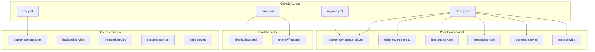
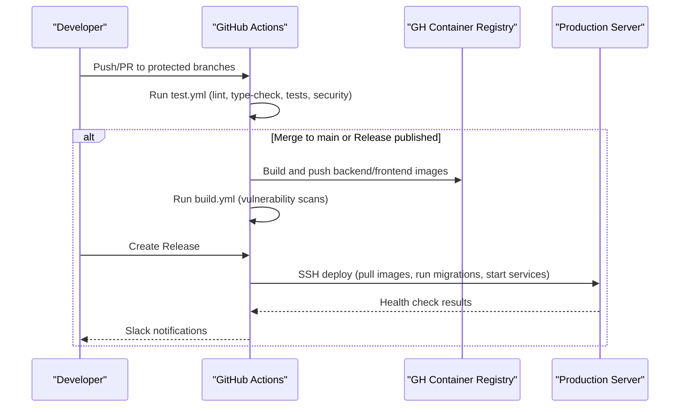
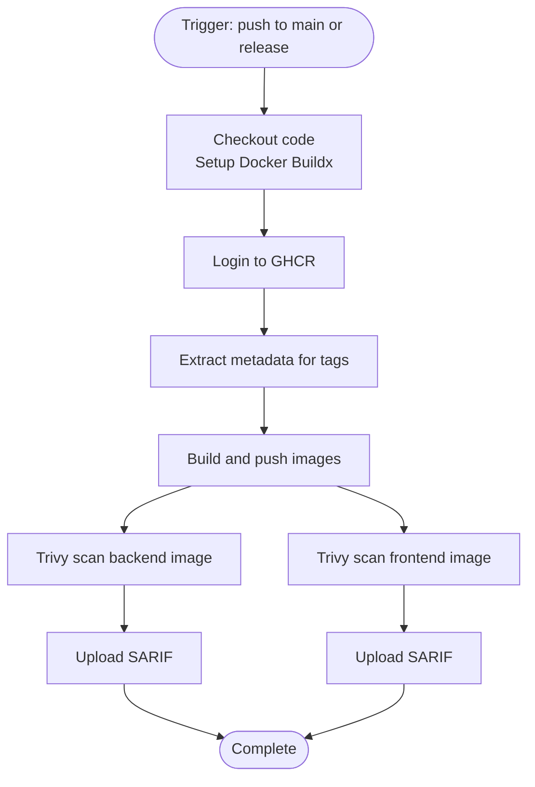
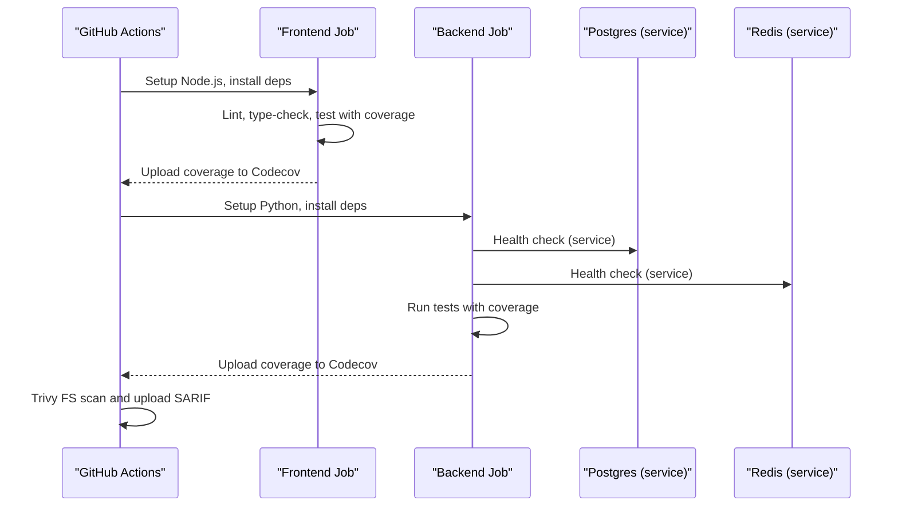
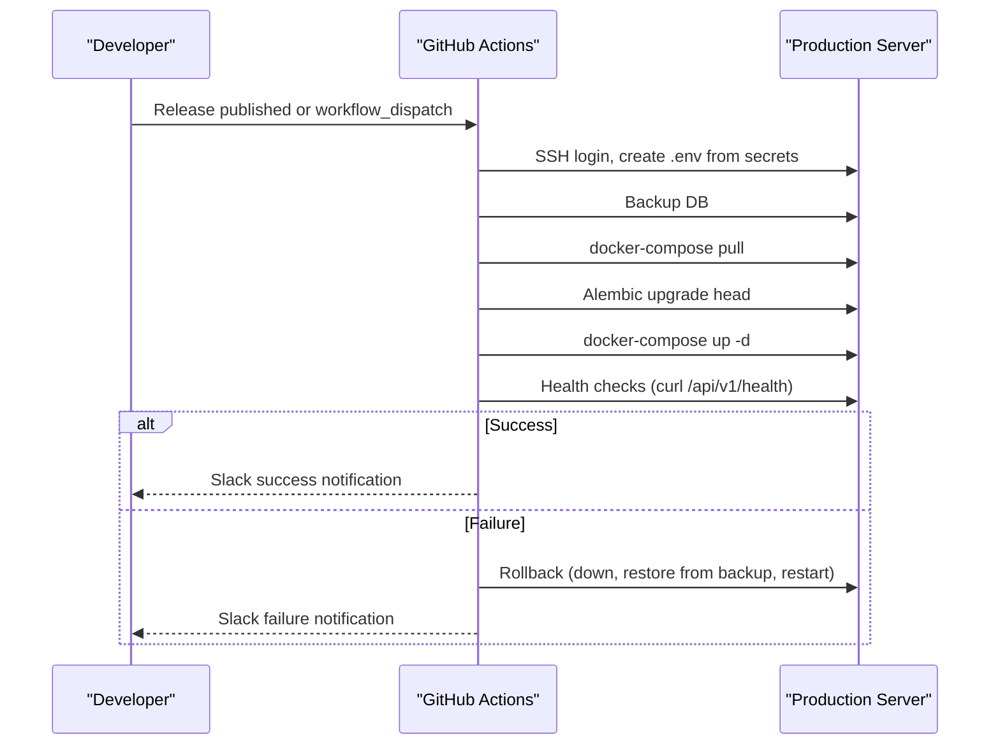
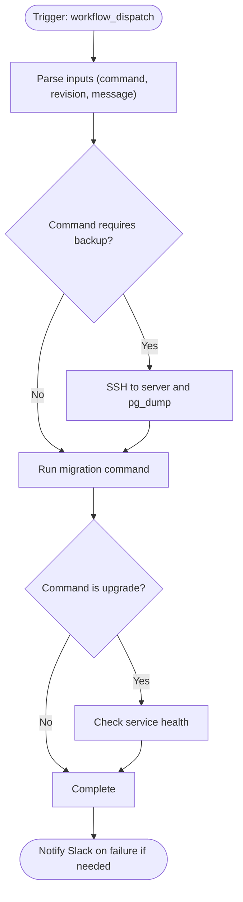
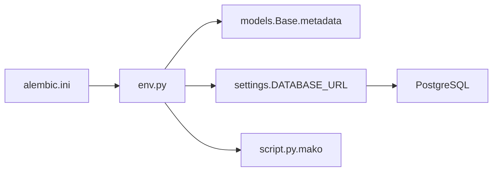
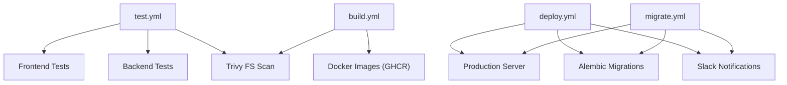

# CI/CD Pipeline

<cite>
**Referenced Files in This Document**
- [build.yml](file://.github/workflows/build.yml)
- [test.yml](file://.github/workflows/test.yml)
- [deploy.yml](file://.github/workflows/deploy.yml)
- [migrate.yml](file://.github/workflows/migrate.yml)
- [Dockerfile.backend](file://backend/Dockerfile)
- [Dockerfile.frontend](file://frontend/Dockerfile)
- [docker-compose.yml](file://docker-compose.yml)
- [docker-compose.prod.yml](file://docker-compose.prod.yml)
- [alembic.ini](file://database/migrations/alembic.ini)
- [env.py](file://database/migrations/env.py)
- [script.py.mako](file://database/migrations/script.py.mako)
- [config.py](file://backend/app/utils/config.py)
- [pytest.ini](file://backend/pytest.ini)
- [jest.config.js](file://frontend/jest.config.js)
- [README-DEPLOYMENT.md](file://README-DEPLOYMENT.md)
- [DEPLOYMENT.md](file://docs/DEPLOYMENT.md)
- [ENVIRONMENT_SETUP.md](file://docs/ENVIRONMENT_SETUP.md)
- [docker-compose.monitoring.yml](file://monitoring/docker-compose.monitoring.yml)
</cite>

## Table of Contents
1. [Introduction](#introduction)
2. [Project Structure](#project-structure)
3. [Core Components](#core-components)
4. [Architecture Overview](#architecture-overview)
5. [Detailed Component Analysis](#detailed-component-analysis)
6. [Dependency Analysis](#dependency-analysis)
7. [Performance Considerations](#performance-considerations)
8. [Troubleshooting Guide](#troubleshooting-guide)
9. [Conclusion](#conclusion)
10. [Appendices](#appendices)

## Introduction
This document describes the CI/CD pipeline for FitTracker Pro, focusing on GitHub Actions workflows for automated testing, building, and deployment. It explains the build workflow (code quality checks, unit tests, and artifact generation), the test workflow (backend API tests and frontend component tests), and the deployment workflow (environment-specific deployments, rollback procedures, and release management). It also covers database migration automation and schema versioning, branch protection rules, pull request requirements, deployment triggers, secrets management, environment variables, and integrations with external services. Finally, it provides troubleshooting guidance and optimization strategies.

## Project Structure
FitTracker Pro uses a multi-service architecture with separate backend and frontend services, orchestrated via Docker Compose. The CI/CD pipeline is implemented using GitHub Actions workflows under .github/workflows. The backend is a FastAPI application with asynchronous database connectivity and Alembic-based migrations. The frontend is a React/Vite application served by Nginx in production. Monitoring is supported via Prometheus, Grafana, Loki, and cAdvisor.

**Diagram sources**
- [build.yml:1-132](file://.github/workflows/build.yml#L1-L132)
- [test.yml:1-138](file://.github/workflows/test.yml#L1-L138)
- [deploy.yml:1-156](file://.github/workflows/deploy.yml#L1-L156)
- [migrate.yml:1-124](file://.github/workflows/migrate.yml#L1-L124)
- [docker-compose.yml:1-99](file://docker-compose.yml#L1-L99)
- [docker-compose.prod.yml:1-132](file://docker-compose.prod.yml#L1-L132)

**Section sources**
- [.github/workflows/build.yml:1-132](file://.github/workflows/build.yml#L1-L132)
- [.github/workflows/test.yml:1-138](file://.github/workflows/test.yml#L1-L138)
- [.github/workflows/deploy.yml:1-156](file://.github/workflows/deploy.yml#L1-L156)
- [.github/workflows/migrate.yml:1-124](file://.github/workflows/migrate.yml#L1-L124)
- [docker-compose.yml:1-99](file://docker-compose.yml#L1-L99)
- [docker-compose.prod.yml:1-132](file://docker-compose.prod.yml#L1-L132)

## Core Components
- Build workflow: Builds backend and frontend Docker images, pushes them to the GitHub Container Registry, and performs vulnerability scans.
- Test workflow: Runs frontend linting/type checking/tests and backend tests with coverage, plus a repository-wide security scan.
- Deploy workflow: Deploys to production via SSH, creates a temporary .env from GitHub secrets, backs up the database, runs Alembic migrations, starts services, performs health checks, and notifies Slack.
- Migration workflow: Manually triggered to run upgrade/downgrade/revisions/status commands against the production database with optional backups and verification.

**Section sources**
- [.github/workflows/build.yml:1-132](file://.github/workflows/build.yml#L1-L132)
- [.github/workflows/test.yml:1-138](file://.github/workflows/test.yml#L1-L138)
- [.github/workflows/deploy.yml:1-156](file://.github/workflows/deploy.yml#L1-L156)
- [.github/workflows/migrate.yml:1-124](file://.github/workflows/migrate.yml#L1-L124)

## Architecture Overview
The CI/CD pipeline integrates GitHub Actions with Docker images stored in the GitHub Container Registry and a production server provisioned with Docker Compose. The backend uses Alembic for schema migrations, and the frontend is built with Vite and served by Nginx. Monitoring is optional but supported via Prometheus, Grafana, Loki, and cAdvisor.

**Diagram sources**
- [test.yml:1-138](file://.github/workflows/test.yml#L1-L138)
- [build.yml:1-132](file://.github/workflows/build.yml#L1-L132)
- [deploy.yml:1-156](file://.github/workflows/deploy.yml#L1-L156)

## Detailed Component Analysis

### Build Workflow
Purpose: Build backend and frontend Docker images, tag them with semantic versions and SHA, push to the GitHub Container Registry, and scan for vulnerabilities.

Key behaviors:
- Triggers on push to main and release publish events.
- Uses Docker Buildx with platform targeting for amd64 and arm64.
- Generates tags for branch, PR, semver, and SHA, plus latest.
- Runs Trivy vulnerability scans and uploads SARIF results to GitHub Code Scanning.

**Diagram sources**
- [build.yml:1-132](file://.github/workflows/build.yml#L1-L132)

**Section sources**
- [.github/workflows/build.yml:1-132](file://.github/workflows/build.yml#L1-L132)
- [backend/Dockerfile:1-48](file://backend/Dockerfile#L1-L48)
- [frontend/Dockerfile:1-56](file://frontend/Dockerfile#L1-L56)

### Test Workflow
Purpose: Validate code quality and correctness across frontend and backend, and scan for repository-level vulnerabilities.

Key behaviors:
- Triggers on push to main, develop, feature/* and pull_request to main and develop.
- Frontend job:
  - Sets up Node.js, installs dependencies, runs lint, type-check, and tests with coverage.
  - Uploads coverage to Codecov.
- Backend job:
  - Sets up Python, installs dependencies, runs tests against ephemeral Postgres and Redis containers.
  - Uploads coverage to Codecov.
- Security scan:
  - Runs Trivy filesystem scan and uploads SARIF.

**Diagram sources**
- [test.yml:1-138](file://.github/workflows/test.yml#L1-L138)

**Section sources**
- [.github/workflows/test.yml:1-138](file://.github/workflows/test.yml#L1-L138)
- [backend/pytest.ini:1-25](file://backend/pytest.ini#L1-L25)
- [frontend/jest.config.js:1-44](file://frontend/jest.config.js#L1-L44)

### Deployment Workflow
Purpose: Deploy the application to production, manage environment variables via a generated .env, run database migrations, perform health checks, and notify Slack on success/failure.

Key behaviors:
- Triggered by release publish or manual workflow_dispatch with environment selection.
- Uses SSH agent to connect to the production server.
- Creates a .env from GitHub secrets.
- Backs up the database before migration.
- Pulls latest images, runs Alembic migrations, starts services, prunes old images, and performs health checks.
- Provides a rollback job that restores from the latest backup and restarts services if the deploy fails.

**Diagram sources**
- [deploy.yml:1-156](file://.github/workflows/deploy.yml#L1-L156)

**Section sources**
- [.github/workflows/deploy.yml:1-156](file://.github/workflows/deploy.yml#L1-L156)
- [docker-compose.prod.yml:1-132](file://docker-compose.prod.yml#L1-L132)

### Database Migration Workflow
Purpose: Provide manual control over database migrations with backup, verification, and Slack notifications.

Key behaviors:
- Triggered via workflow_dispatch with command choices: upgrade, downgrade, revision, status.
- Creates a backup before upgrade/downgrade.
- Executes Alembic commands inside the production backend container.
- Verifies service health after migration.
- Notifies Slack on failure.

**Diagram sources**
- [migrate.yml:1-124](file://.github/workflows/migrate.yml#L1-L124)

**Section sources**
- [.github/workflows/migrate.yml:1-124](file://.github/workflows/migrate.yml#L1-L124)

### Database Migration Automation and Schema Versioning
The backend uses Alembic for schema migrations. The migration environment reads settings from the backend configuration and connects to the configured database URL.

Key behaviors:
- Alembic configuration sets the script location and logging.
- The migration environment injects the backend path and loads settings to configure the database URL.
- Revision templates define upgrade and downgrade functions.

**Diagram sources**
- [alembic.ini:1-94](file://database/migrations/alembic.ini#L1-L94)
- [env.py:1-81](file://database/migrations/env.py#L1-L81)
- [script.py.mako:1-25](file://database/migrations/script.py.mako#L1-L25)
- [config.py:1-55](file://backend/app/utils/config.py#L1-L55)

**Section sources**
- [database/migrations/alembic.ini:1-94](file://database/migrations/alembic.ini#L1-L94)
- [database/migrations/env.py:1-81](file://database/migrations/env.py#L1-L81)
- [database/migrations/script.py.mako:1-25](file://database/migrations/script.py.mako#L1-L25)
- [backend/app/utils/config.py:1-55](file://backend/app/utils/config.py#L1-L55)

### Secrets Management and Environment Variables
Secrets are managed in GitHub Actions and injected into the production environment via a generated .env file. Required secrets include deployment host, user, SSH private key, and application credentials. Environment variables are defined per service in docker-compose and overridden in production.

Key behaviors:
- GitHub Actions injects secrets into the deploy workflow and migration workflow.
- The deploy workflow writes a .env file on the production server containing database credentials, tokens, origins, Sentry DSN, and API URLs.
- docker-compose.prod.yml defines environment variables for backend, frontend, and Nginx, including resource limits.

**Section sources**
- [.github/workflows/deploy.yml:17-122](file://.github/workflows/deploy.yml#L17-L122)
- [.github/workflows/migrate.yml:26-98](file://.github/workflows/migrate.yml#L26-L98)
- [docker-compose.prod.yml:55-123](file://docker-compose.prod.yml#L55-L123)
- [docs/DEPLOYMENT.md:103-123](file://docs/DEPLOYMENT.md#L103-L123)

### Branch Protection Rules and Pull Request Requirements
- Branch protection rules should require:
  - At least one approving review.
  - Status checks: test.yml (frontend lint/type-check/tests), test.yml (backend tests), optional build.yml for image builds.
  - Require branches to be up-to-date before merging.
  - Dismiss stale reviews if policy requires.
- Pull requests should target main or develop, and feature/* branches are tested by test.yml.

**Section sources**
- [.github/workflows/test.yml:3-7](file://.github/workflows/test.yml#L3-L7)

### Deployment Triggers
- Automated deployment:
  - Release published event triggers the deploy workflow.
  - Manual deployment:
  - workflow_dispatch with environment selection (production or staging).
- Build artifacts:
  - Images are tagged with branch, PR, semver, SHA, and latest.

**Section sources**
- [.github/workflows/deploy.yml:3-16](file://.github/workflows/deploy.yml#L3-L16)
- [.github/workflows/build.yml:3-8](file://.github/workflows/build.yml#L3-L8)

## Dependency Analysis
The CI/CD pipeline depends on:
- GitHub Actions runners and the GitHub Container Registry for image storage.
- Production server with Docker and Docker Compose for orchestration.
- External services: Slack for notifications, Trivy for vulnerability scanning, Codecov for coverage reporting.

**Diagram sources**
- [test.yml:1-138](file://.github/workflows/test.yml#L1-L138)
- [build.yml:1-132](file://.github/workflows/build.yml#L1-L132)
- [deploy.yml:1-156](file://.github/workflows/deploy.yml#L1-L156)
- [migrate.yml:1-124](file://.github/workflows/migrate.yml#L1-L124)

**Section sources**
- [.github/workflows/test.yml:1-138](file://.github/workflows/test.yml#L1-L138)
- [.github/workflows/build.yml:1-132](file://.github/workflows/build.yml#L1-L132)
- [.github/workflows/deploy.yml:1-156](file://.github/workflows/deploy.yml#L1-L156)
- [.github/workflows/migrate.yml:1-124](file://.github/workflows/migrate.yml#L1-L124)

## Performance Considerations
- Build performance:
  - Use Docker Buildx with multi-platform builds and GitHub Actions cache for build layers.
  - Parallelize frontend and backend builds.
- Test performance:
  - Keep ephemeral Postgres and Redis containers minimal and healthy-checked.
  - Use coverage thresholds to prevent regressions without slowing tests.
- Deployment performance:
  - Use docker-compose pull to fetch prebuilt images.
  - Prune unused images after deployment to save space.
- Monitoring:
  - Enable Prometheus and Grafana for runtime metrics and alerting.

[No sources needed since this section provides general guidance]

## Troubleshooting Guide
Common issues and resolutions:
- Database connection failures:
  - Verify Postgres and Redis are healthy in development and production.
  - Check credentials and network connectivity.
- Frontend not loading:
  - Inspect Nginx logs and rebuild the frontend.
- API errors:
  - Check backend logs and health endpoint.
- Migration failures:
  - Use the migration workflow to inspect status and create backups before attempting upgrade/downgrade.
- Slack notifications not sent:
  - Verify SLACK_WEBHOOK_URL secret is configured.

**Section sources**
- [README-DEPLOYMENT.md:182-214](file://README-DEPLOYMENT.md#L182-L214)
- [docs/DEPLOYMENT.md:350-397](file://docs/DEPLOYMENT.md#L350-L397)
- [docker-compose.yml:17-21](file://docker-compose.yml#L17-L21)
- [docker-compose.prod.yml:18-22](file://docker-compose.prod.yml#L18-L22)

## Conclusion
The CI/CD pipeline for FitTracker Pro automates testing, building, and deployment with robust security scanning and rollback capabilities. Alembic manages database migrations with backups and verification. Secrets are handled securely via GitHub Actions, and the production deployment is orchestrated through Docker Compose. Adhering to branch protection rules and pull request requirements ensures reliable releases.

[No sources needed since this section summarizes without analyzing specific files]

## Appendices

### Environment Variables Reference
- Backend:
  - DATABASE_URL, DATABASE_URL_SYNC, SECRET_KEY, TELEGRAM_BOT_TOKEN, TELEGRAM_WEBAPP_URL, ALLOWED_ORIGINS, SENTRY_DSN, ENVIRONMENT, DEBUG
- Frontend:
  - VITE_API_URL, VITE_TELEGRAM_BOT_USERNAME, VITE_ENVIRONMENT
- Production server:
  - POSTGRES_USER, POSTGRES_PASSWORD, POSTGRES_DB, SECRET_KEY, TELEGRAM_BOT_TOKEN, TELEGRAM_WEBAPP_URL, ALLOWED_ORIGINS, SENTRY_DSN, VITE_API_URL, VITE_TELEGRAM_BOT_USERNAME, GITHUB_REPOSITORY

**Section sources**
- [docker-compose.prod.yml:59-91](file://docker-compose.prod.yml#L59-L91)
- [docs/ENVIRONMENT_SETUP.md:90-110](file://docs/ENVIRONMENT_SETUP.md#L90-L110)
- [docs/DEPLOYMENT.md:103-123](file://docs/DEPLOYMENT.md#L103-L123)

### Monitoring Stack
- Prometheus, Grafana, Loki, and cAdvisor are supported via docker-compose.monitoring.yml for metrics and log aggregation.

**Section sources**
- [docker-compose.monitoring.yml:1-124](file://monitoring/docker-compose.monitoring.yml#L1-L124)