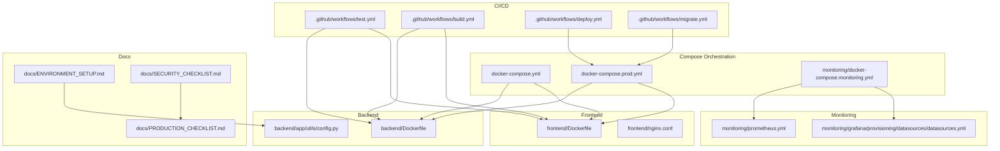
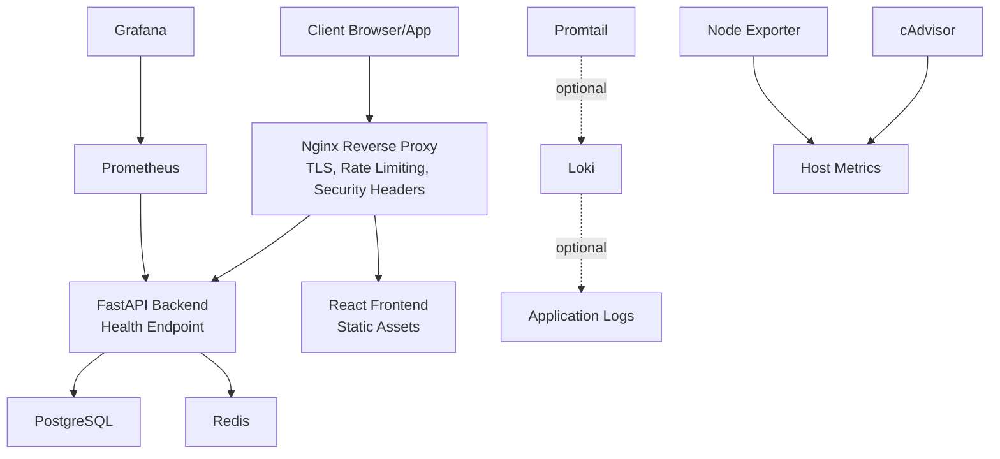
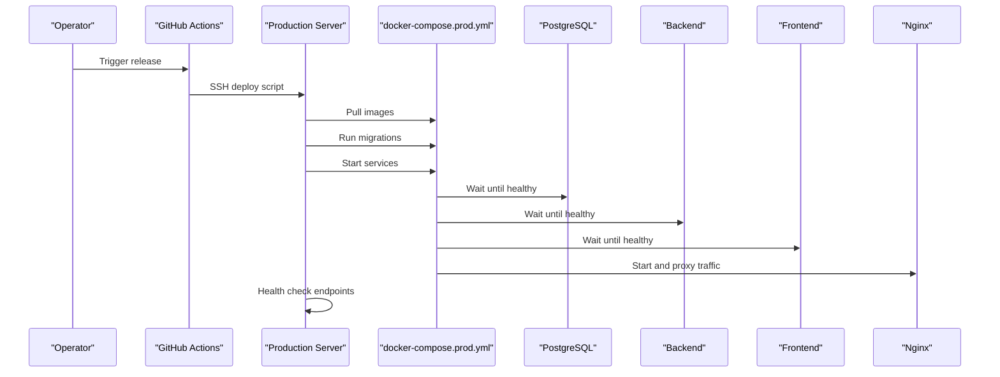
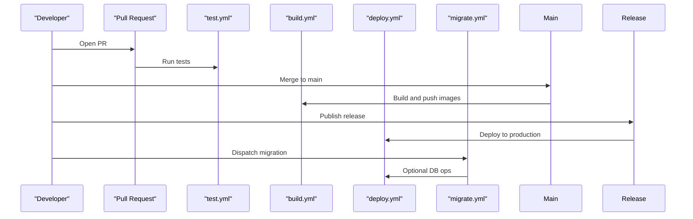
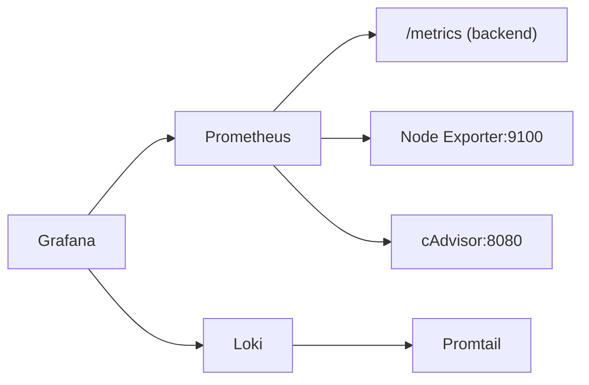
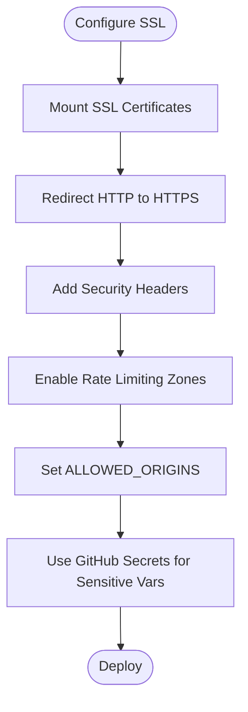
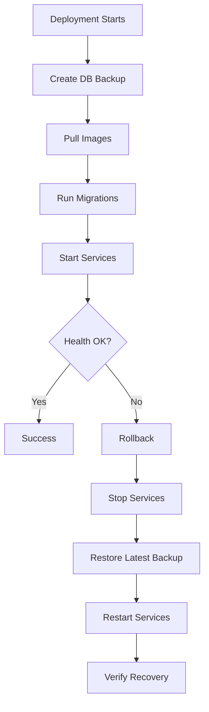
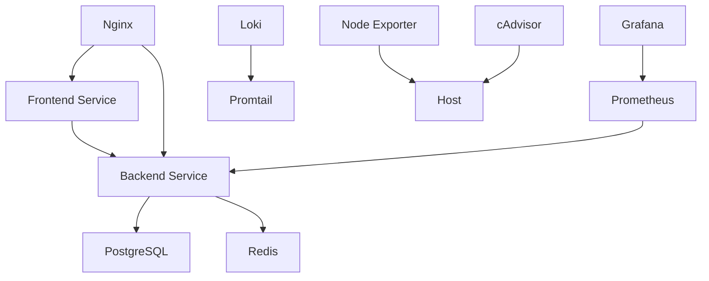

# Deployment & Monitoring

<cite>
**Referenced Files in This Document**
- [README-DEPLOYMENT.md](file://README-DEPLOYMENT.md)
- [docker-compose.yml](file://docker-compose.yml)
- [docker-compose.prod.yml](file://docker-compose.prod.yml)
- [backend/Dockerfile](file://backend/Dockerfile)
- [frontend/Dockerfile](file://frontend/Dockerfile)
- [.github/workflows/test.yml](file://.github/workflows/test.yml)
- [.github/workflows/build.yml](file://.github/workflows/build.yml)
- [.github/workflows/deploy.yml](file://.github/workflows/deploy.yml)
- [.github/workflows/migrate.yml](file://.github/workflows/migrate.yml)
- [monitoring/docker-compose.monitoring.yml](file://monitoring/docker-compose.monitoring.yml)
- [monitoring/prometheus.yml](file://monitoring/prometheus.yml)
- [monitoring/grafana/provisioning/datasources/datasources.yml](file://monitoring/grafana/provisioning/datasources/datasources.yml)
- [docs/ENVIRONMENT_SETUP.md](file://docs/ENVIRONMENT_SETUP.md)
- [docs/SECURITY_CHECKLIST.md](file://docs/SECURITY_CHECKLIST.md)
- [docs/PRODUCTION_CHECKLIST.md](file://docs/PRODUCTION_CHECKLIST.md)
- [backend/app/utils/config.py](file://backend/app/utils/config.py)
- [nginx/nginx.conf](file://nginx/nginx.conf)
- [frontend/nginx.conf](file://frontend/nginx.conf)
</cite>

## Table of Contents
1. [Introduction](#introduction)
2. [Project Structure](#project-structure)
3. [Core Components](#core-components)
4. [Architecture Overview](#architecture-overview)
5. [Detailed Component Analysis](#detailed-component-analysis)
6. [Dependency Analysis](#dependency-analysis)
7. [Performance Considerations](#performance-considerations)
8. [Troubleshooting Guide](#troubleshooting-guide)
9. [Conclusion](#conclusion)
10. [Appendices](#appendices)

## Introduction
This document provides comprehensive deployment and monitoring guidance for FitTracker Pro. It covers production deployment with Docker Compose, CI/CD pipelines using GitHub Actions, monitoring with Prometheus and Grafana, Sentry error tracking, security hardening, SSL/TLS configuration, backup strategies, rollback procedures, scaling considerations, and operational troubleshooting.

## Project Structure
FitTracker Pro is organized into:
- backend: FastAPI application with Dockerfile and Docker Compose service
- frontend: React + Vite application with multi-stage Dockerfile and Nginx configuration
- monitoring: Prometheus, Grafana, Loki, and cAdvisor stack with Docker Compose
- database: Alembic migrations and schema definitions
- docs: Environment setup, security, and production checklists
- .github/workflows: CI/CD pipelines for testing, building, deploying, and migrations
- Root compose files: development and production orchestration

**Diagram sources**
- [docker-compose.yml:1-99](file://docker-compose.yml#L1-L99)
- [docker-compose.prod.yml:1-132](file://docker-compose.prod.yml#L1-L132)
- [monitoring/docker-compose.monitoring.yml:1-124](file://monitoring/docker-compose.monitoring.yml#L1-L124)
- [backend/Dockerfile:1-48](file://backend/Dockerfile#L1-L48)
- [frontend/Dockerfile:1-56](file://frontend/Dockerfile#L1-L56)
- [monitoring/prometheus.yml:1-49](file://monitoring/prometheus.yml#L1-L49)
- [monitoring/grafana/provisioning/datasources/datasources.yml:1-16](file://monitoring/grafana/provisioning/datasources/datasources.yml#L1-L16)
- [docs/ENVIRONMENT_SETUP.md:1-141](file://docs/ENVIRONMENT_SETUP.md#L1-L141)
- [docs/SECURITY_CHECKLIST.md:1-193](file://docs/SECURITY_CHECKLIST.md#L1-L193)
- [docs/PRODUCTION_CHECKLIST.md:1-245](file://docs/PRODUCTION_CHECKLIST.md#L1-L245)
- [.github/workflows/test.yml:1-138](file://.github/workflows/test.yml#L1-L138)
- [.github/workflows/build.yml:1-132](file://.github/workflows/build.yml#L1-L132)
- [.github/workflows/deploy.yml:1-156](file://.github/workflows/deploy.yml#L1-L156)
- [.github/workflows/migrate.yml:1-124](file://.github/workflows/migrate.yml#L1-L124)

**Section sources**
- [README-DEPLOYMENT.md:26-47](file://README-DEPLOYMENT.md#L26-L47)
- [docker-compose.yml:1-99](file://docker-compose.yml#L1-L99)
- [docker-compose.prod.yml:1-132](file://docker-compose.prod.yml#L1-L132)
- [monitoring/docker-compose.monitoring.yml:1-124](file://monitoring/docker-compose.monitoring.yml#L1-L124)

## Core Components
- Backend service: FastAPI application packaged with Gunicorn and Uvicorn workers, health-checked via HTTP GET to the health endpoint.
- Frontend service: Nginx serving a static React build with health-checked endpoint.
- Nginx reverse proxy: Handles SSL termination, HTTP to HTTPS redirect, rate limiting, security headers, and routing to backend/frontend.
- Database: PostgreSQL with persistent volumes and health checks.
- Redis: Caching layer with persistence and resource limits.
- Monitoring stack: Prometheus, Grafana, optional Loki and Promtail, plus cAdvisor and Node Exporter.
- CI/CD: GitHub Actions workflows for testing, building/pushing images, and deploying to production with rollback.

**Section sources**
- [backend/Dockerfile:42-47](file://backend/Dockerfile#L42-L47)
- [frontend/Dockerfile:50-55](file://frontend/Dockerfile#L50-L55)
- [nginx/nginx.conf:56-142](file://nginx/nginx.conf#L56-L142)
- [docker-compose.prod.yml:54-124](file://docker-compose.prod.yml#L54-L124)
- [monitoring/docker-compose.monitoring.yml:3-124](file://monitoring/docker-compose.monitoring.yml#L3-L124)

## Architecture Overview
FitTracker Pro follows a reverse-proxy fronted microservice architecture:
- Nginx terminates TLS and proxies requests to backend and frontend services.
- Backend exposes health and metrics endpoints and integrates with Sentry.
- Frontend serves static assets and proxies API calls during development.
- Monitoring stack scrapes Prometheus, visualizes with Grafana, and optionally aggregates logs with Loki.

**Diagram sources**
- [nginx/nginx.conf:56-142](file://nginx/nginx.conf#L56-L142)
- [docker-compose.prod.yml:54-124](file://docker-compose.prod.yml#L54-L124)
- [monitoring/docker-compose.monitoring.yml:3-124](file://monitoring/docker-compose.monitoring.yml#L3-L124)
- [monitoring/prometheus.yml:15-49](file://monitoring/prometheus.yml#L15-L49)

## Detailed Component Analysis

### Production Deployment with Docker Compose
- Services: postgres, redis, backend, frontend, nginx.
- Networking: dedicated bridge network for application services; monitoring network separate but can reach app network.
- Health checks: PostgreSQL, Redis, backend, and frontend include health checks.
- Resource limits: CPU/memory caps defined per service.
- SSL/TLS: Nginx mounts SSL certificates and enforces HTTPS.
- Secrets: environment variables injected via .env and GitHub Secrets for production.

**Diagram sources**
- [.github/workflows/deploy.yml:42-103](file://.github/workflows/deploy.yml#L42-L103)
- [docker-compose.prod.yml:70-124](file://docker-compose.prod.yml#L70-L124)

**Section sources**
- [docker-compose.prod.yml:1-132](file://docker-compose.prod.yml#L1-L132)
- [README-DEPLOYMENT.md:100-114](file://README-DEPLOYMENT.md#L100-L114)
- [docs/PRODUCTION_CHECKLIST.md:34-64](file://docs/PRODUCTION_CHECKLIST.md#L34-L64)

### CI/CD Pipeline with GitHub Actions
- test.yml: Runs frontend lint/type-check/tests and backend lint/type-check/tests with a local Postgres/Redis service; uploads coverage; performs Trivy vulnerability scan.
- build.yml: Builds and pushes backend and frontend images to GHCR with metadata tags and platform targeting; scans images with Trivy.
- deploy.yml: Deploys to production via SSH, creates .env from secrets, backs up DB, pulls images, runs migrations, starts services, health checks, and notifies Slack.
- migrate.yml: Manual-triggered workflow to run Alembic commands (upgrade/downgrade/revision/status) with pre-migration backups and verification.

**Diagram sources**
- [.github/workflows/test.yml:1-138](file://.github/workflows/test.yml#L1-L138)
- [.github/workflows/build.yml:1-132](file://.github/workflows/build.yml#L1-L132)
- [.github/workflows/deploy.yml:1-156](file://.github/workflows/deploy.yml#L1-L156)
- [.github/workflows/migrate.yml:1-124](file://.github/workflows/migrate.yml#L1-L124)

**Section sources**
- [.github/workflows/test.yml:132-138](file://.github/workflows/test.yml#L132-L138)
- [.github/workflows/build.yml:131-132](file://.github/workflows/build.yml#L131-L132)
- [.github/workflows/deploy.yml:123-156](file://.github/workflows/deploy.yml#L123-L156)
- [.github/workflows/migrate.yml:1-124](file://.github/workflows/migrate.yml#L1-124)

### Monitoring Stack: Prometheus, Grafana, Loki, cAdvisor, Node Exporter
- Prometheus: Scrapes backend metrics endpoint, Node Exporter, cAdvisor, and optional PostgreSQL/Redis exporters.
- Grafana: Visualizes Prometheus data; configured datasources include Prometheus and Loki.
- Loki + Promtail: Optional log aggregation; Promtail reads container logs and forwards to Loki.
- Node Exporter and cAdvisor: Provide host/container metrics for system-level monitoring.

**Diagram sources**
- [monitoring/prometheus.yml:15-49](file://monitoring/prometheus.yml#L15-L49)
- [monitoring/docker-compose.monitoring.yml:3-124](file://monitoring/docker-compose.monitoring.yml#L3-L124)
- [monitoring/grafana/provisioning/datasources/datasources.yml:1-16](file://monitoring/grafana/provisioning/datasources/datasources.yml#L1-L16)

**Section sources**
- [monitoring/docker-compose.monitoring.yml:1-124](file://monitoring/docker-compose.monitoring.yml#L1-L124)
- [monitoring/prometheus.yml:1-49](file://monitoring/prometheus.yml#L1-L49)
- [monitoring/grafana/provisioning/datasources/datasources.yml:1-16](file://monitoring/grafana/provisioning/datasources/datasources.yml#L1-L16)
- [README-DEPLOYMENT.md:155-174](file://README-DEPLOYMENT.md#L155-L174)

### Security Hardening and SSL/TLS
- SSL/TLS: Nginx handles HTTPS with certificate/key mounting, enforces TLS 1.2/1.3, and redirects HTTP to HTTPS.
- Security headers: X-Frame-Options, X-Content-Type-Options, X-XSS-Protection, Strict-Transport-Security, Referrer-Policy, Permissions-Policy.
- Rate limiting: Nginx zones for API and login endpoints; connection limits.
- Secrets management: Environment variables via .env and GitHub Secrets; non-root users in containers; read-only filesystems recommended.
- Allowed origins: Backend parses ALLOWED_ORIGINS; configure for production domains.

**Diagram sources**
- [nginx/nginx.conf:56-142](file://nginx/nginx.conf#L56-L142)
- [backend/app/utils/config.py:38-47](file://backend/app/utils/config.py#L38-L47)
- [docs/SECURITY_CHECKLIST.md:7-20](file://docs/SECURITY_CHECKLIST.md#L7-L20)

**Section sources**
- [nginx/nginx.conf:56-142](file://nginx/nginx.conf#L56-L142)
- [frontend/nginx.conf:13-17](file://frontend/nginx.conf#L13-L17)
- [backend/app/utils/config.py:38-47](file://backend/app/utils/config.py#L38-L47)
- [docs/SECURITY_CHECKLIST.md:112-135](file://docs/SECURITY_CHECKLIST.md#L112-L135)

### Backup Strategies and Rollback Procedures
- Backups: Automated database dump before migration and deployment; backups stored under ./backups.
- Restore: Rollback workflow stops services, restores from latest backup, and restarts.
- Maintenance: Scheduled daily backups, SSL renewal automation, and periodic disaster recovery tests.

**Diagram sources**
- [.github/workflows/deploy.yml:70-103](file://.github/workflows/deploy.yml#L70-L103)
- [.github/workflows/migrate.yml:60-98](file://.github/workflows/migrate.yml#L60-L98)
- [docs/PRODUCTION_CHECKLIST.md:184-209](file://docs/PRODUCTION_CHECKLIST.md#L184-L209)

**Section sources**
- [.github/workflows/deploy.yml:70-103](file://.github/workflows/deploy.yml#L70-L103)
- [.github/workflows/migrate.yml:60-98](file://.github/workflows/migrate.yml#L60-L98)
- [docs/PRODUCTION_CHECKLIST.md:184-209](file://docs/PRODUCTION_CHECKLIST.md#L184-L209)

### Scaling Considerations
- Horizontal scaling: Increase replicas for backend/frontend behind Nginx; ensure stateless backend and shared Redis/PostgreSQL.
- Resource limits: CPU/memory caps defined in compose; adjust based on load testing.
- Caching: Redis for session/state; consider CDN for static assets.
- Observability: Enable Prometheus scraping and Grafana dashboards; add alerting rules for latency and error rates.

**Section sources**
- [docker-compose.prod.yml:77-101](file://docker-compose.prod.yml#L77-L101)
- [monitoring/prometheus.yml:31-42](file://monitoring/prometheus.yml#L31-L42)
- [docs/PRODUCTION_CHECKLIST.md:148-161](file://docs/PRODUCTION_CHECKLIST.md#L148-L161)

### Operational Troubleshooting Procedures
- Database connectivity: Verify service health, check logs, and restart if needed.
- Frontend not loading: Inspect Nginx logs and rebuild frontend.
- API errors: Check backend logs and health endpoint.
- SSL/TLS verification: Use OpenSSL client and SSL Labs test.
- CORS and allowed origins: Confirm backend ALLOWED_ORIGINS configuration.

**Section sources**
- [README-DEPLOYMENT.md:182-228](file://README-DEPLOYMENT.md#L182-L228)
- [docs/ENVIRONMENT_SETUP.md:122-141](file://docs/ENVIRONMENT_SETUP.md#L122-L141)
- [docs/SECURITY_CHECKLIST.md:112-135](file://docs/SECURITY_CHECKLIST.md#L112-L135)

## Dependency Analysis
- Backend depends on PostgreSQL and Redis; health checks enforce startup order.
- Frontend depends on backend for API; served by Nginx.
- Monitoring stack depends on Prometheus and Grafana; optional Loki/Promtail depend on each other.
- CI/CD depends on GitHub-hosted runners and GHCR for image storage.

**Diagram sources**
- [docker-compose.prod.yml:54-124](file://docker-compose.prod.yml#L54-L124)
- [monitoring/docker-compose.monitoring.yml:3-124](file://monitoring/docker-compose.monitoring.yml#L3-L124)

**Section sources**
- [docker-compose.prod.yml:70-95](file://docker-compose.prod.yml#L70-L95)
- [monitoring/docker-compose.monitoring.yml:47-113](file://monitoring/docker-compose.monitoring.yml#L47-L113)

## Performance Considerations
- Use Nginx compression and static asset caching.
- Enable rate limiting to protect backend under load.
- Monitor backend latency and throughput via Prometheus/Grafana.
- Optimize database queries and consider read replicas for scale.
- Use CDN for static assets and enable browser caching headers.

[No sources needed since this section provides general guidance]

## Troubleshooting Guide
- Database connection failed: Check service status, logs, and credentials.
- Frontend not loading: Review Nginx logs and rebuild frontend.
- API errors: Validate backend health endpoint and inspect logs.
- SSL/TLS issues: Verify certificate chain and cipher suite configuration.
- CORS errors: Ensure ALLOWED_ORIGINS includes the requesting origin.

**Section sources**
- [README-DEPLOYMENT.md:182-228](file://README-DEPLOYMENT.md#L182-L228)
- [docs/ENVIRONMENT_SETUP.md:122-141](file://docs/ENVIRONMENT_SETUP.md#L122-L141)

## Conclusion
FitTracker Pro’s deployment and monitoring stack leverages Docker Compose for orchestration, GitHub Actions for CI/CD, and a robust monitoring toolkit for observability. By following the documented environment setup, security hardening, backup, and rollback procedures, teams can operate FitTracker Pro reliably in production while maintaining performance and resilience.

[No sources needed since this section summarizes without analyzing specific files]

## Appendices

### Environment Variables Reference
- Backend: DATABASE_URL, DATABASE_URL_SYNC, SECRET_KEY, TELEGRAM_BOT_TOKEN, TELEGRAM_WEBAPP_URL, ALLOWED_ORIGINS, SENTRY_DSN, ENVIRONMENT, DEBUG.
- Frontend: VITE_API_URL, VITE_TELEGRAM_BOT_USERNAME, VITE_ENVIRONMENT.
- Monitoring: GRAFANA_ADMIN_USER, GRAFANA_ADMIN_PASSWORD.

**Section sources**
- [docs/ENVIRONMENT_SETUP.md:26-110](file://docs/ENVIRONMENT_SETUP.md#L26-L110)
- [docker-compose.prod.yml:59-92](file://docker-compose.prod.yml#L59-L92)
- [monitoring/docker-compose.monitoring.yml:29-35](file://monitoring/docker-compose.monitoring.yml#L29-L35)

### Health Checks and Endpoints
- Backend: GET /api/v1/health
- Frontend: GET /health
- Nginx: GET /health

**Section sources**
- [backend/Dockerfile:42-44](file://backend/Dockerfile#L42-L44)
- [frontend/Dockerfile:50-52](file://frontend/Dockerfile#L50-L52)
- [nginx/nginx.conf:122-127](file://nginx/nginx.conf#L122-L127)