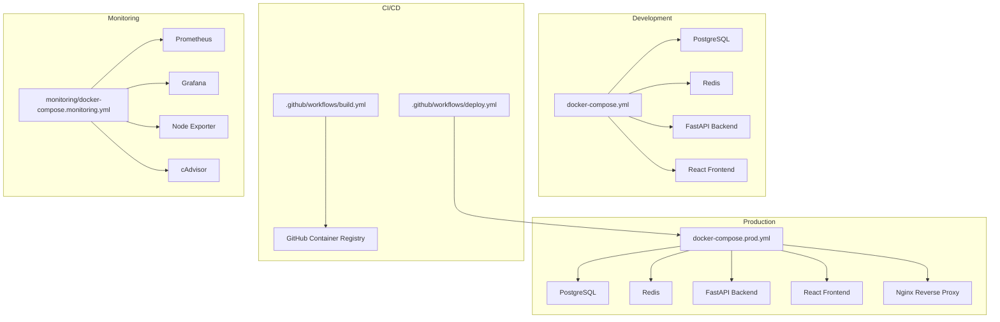
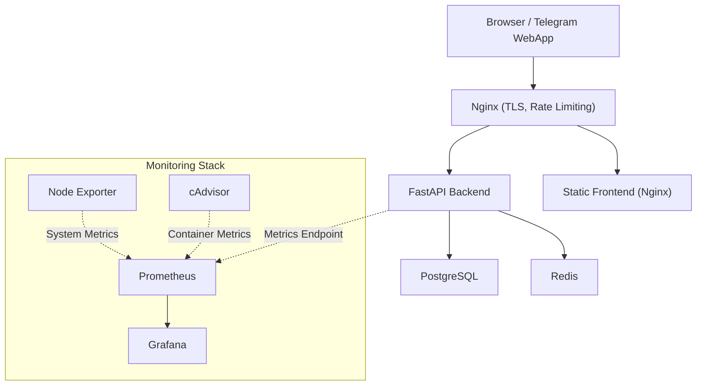
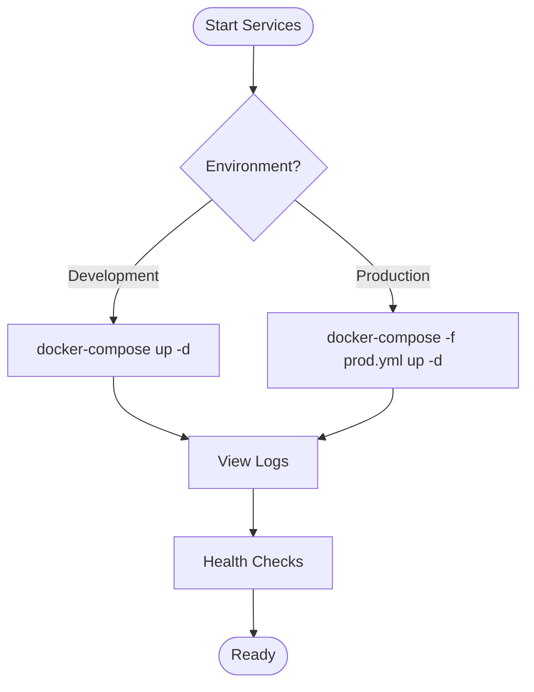
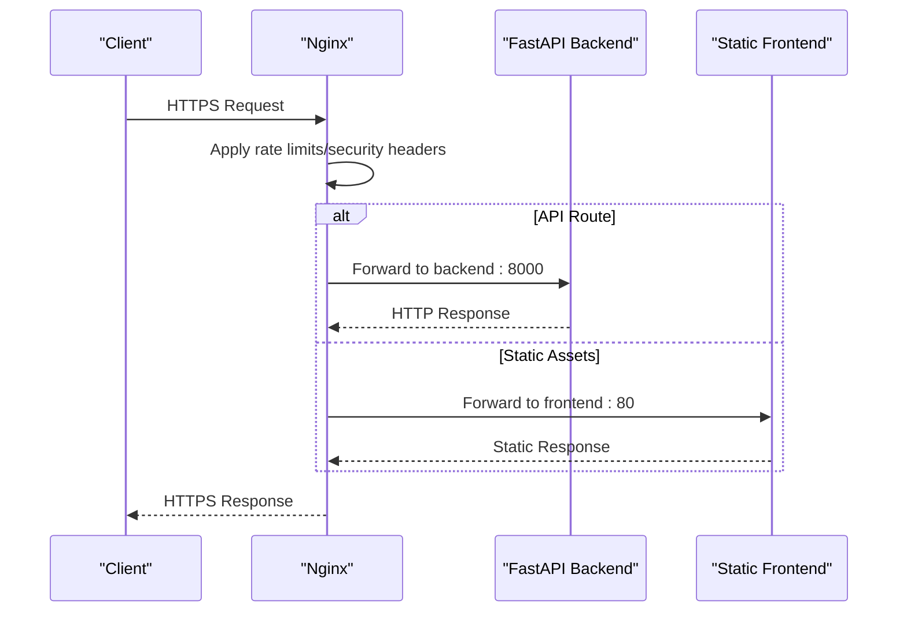
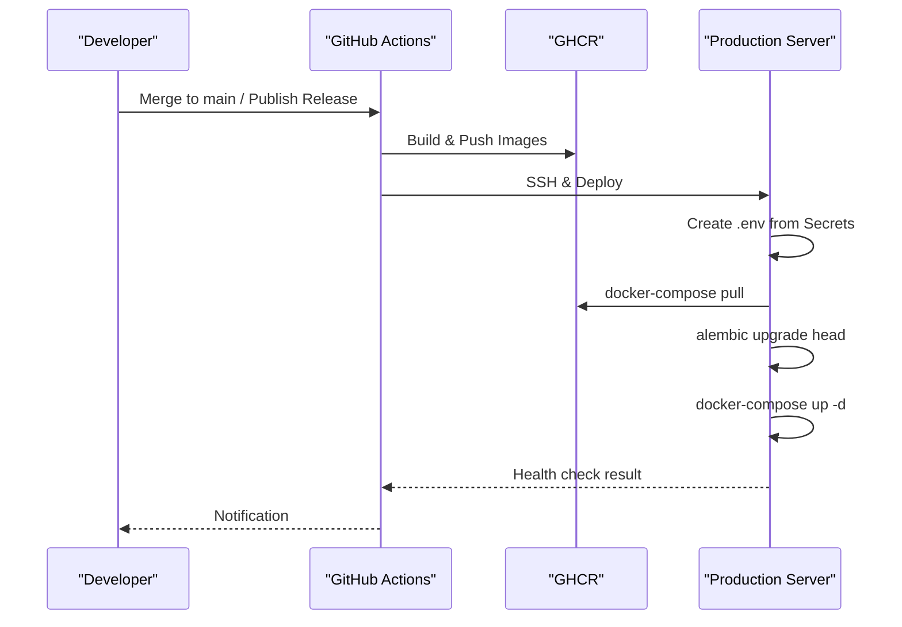
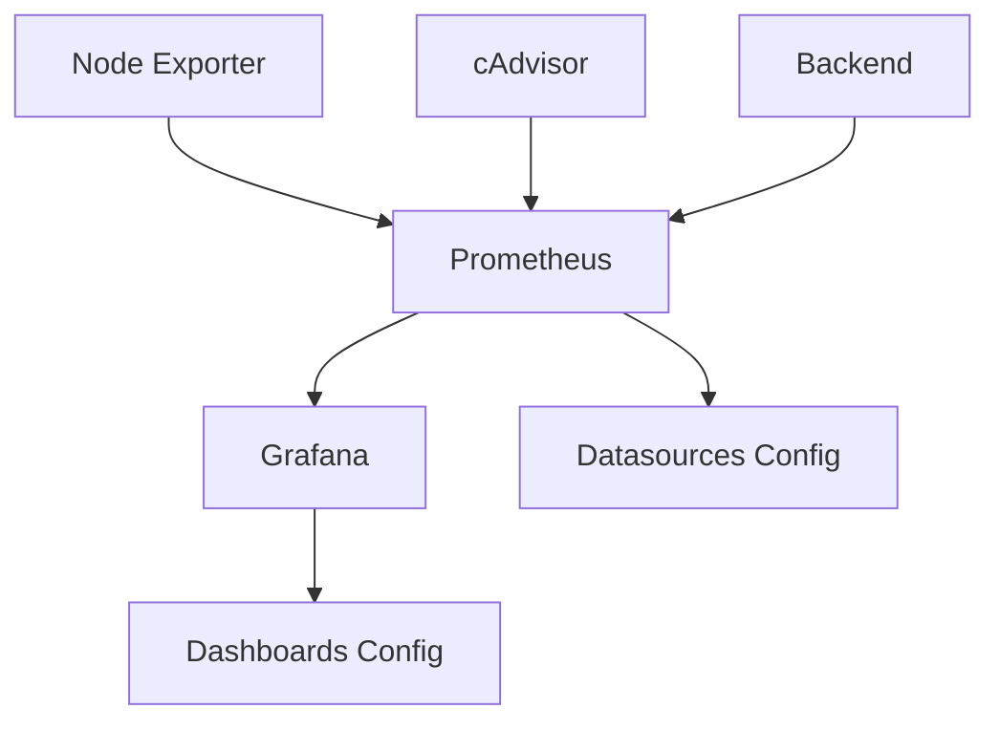
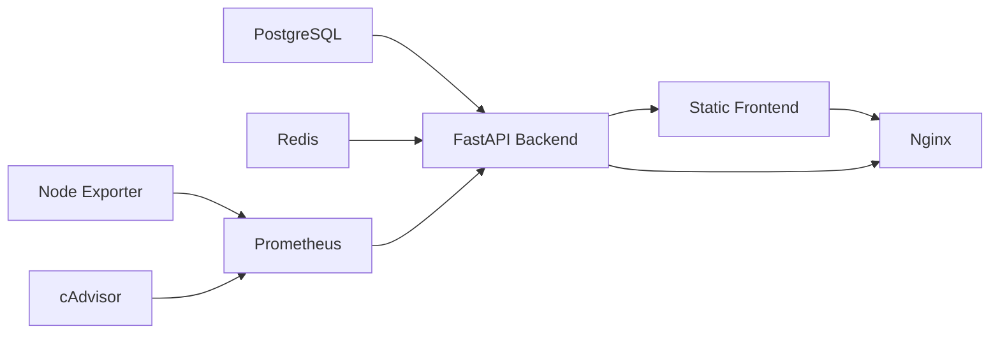

# Deployment Infrastructure

<cite>
**Referenced Files in This Document**
- [README-DEPLOYMENT.md](file://README-DEPLOYMENT.md)
- [deploy.sh](file://deploy.sh)
- [docker-compose.prod.yml](file://docker-compose.prod.yml)
- [docker-compose.yml](file://docker-compose.yml)
- [backend/Dockerfile](file://backend/Dockerfile)
- [frontend/Dockerfile](file://frontend/Dockerfile)
- [.github/workflows/build.yml](file://.github/workflows/build.yml)
- [.github/workflows/deploy.yml](file://.github/workflows/deploy.yml)
- [nginx/nginx.conf](file://nginx/nginx.conf)
- [monitoring/docker-compose.monitoring.yml](file://monitoring/docker-compose.monitoring.yml)
- [monitoring/prometheus.yml](file://monitoring/prometheus.yml)
- [monitoring/grafana/provisioning/datasources/datasources.yml](file://monitoring/grafana/provisioning/datasources/datasources.yml)
- [monitoring/grafana/provisioning/dashboards/dashboards.yml](file://monitoring/grafana/provisioning/dashboards/dashboards.yml)
- [docs/ENVIRONMENT_SETUP.md](file://docs/ENVIRONMENT_SETUP.md)
- [docs/PRODUCTION_CHECKLIST.md](file://docs/PRODUCTION_CHECKLIST.md)
</cite>

## Table of Contents
1. [Introduction](#introduction)
2. [Project Structure](#project-structure)
3. [Core Components](#core-components)
4. [Architecture Overview](#architecture-overview)
5. [Detailed Component Analysis](#detailed-component-analysis)
6. [Dependency Analysis](#dependency-analysis)
7. [Performance Considerations](#performance-considerations)
8. [Troubleshooting Guide](#troubleshooting-guide)
9. [Conclusion](#conclusion)

## Introduction
This document describes the deployment infrastructure for FitTracker Pro, covering container orchestration, CI/CD pipelines, reverse proxy configuration, monitoring stack, and operational procedures. It consolidates the development and production deployment workflows, environment variable management, and security hardening practices.

## Project Structure
The deployment infrastructure spans multiple layers:
- Containerization: Dockerfiles for backend and frontend, orchestrated by Docker Compose
- Orchestration: Development and production compose files define services, networks, and volumes
- CI/CD: GitHub Actions workflows for building, pushing, and deploying images
- Reverse Proxy: Nginx configuration for SSL termination, rate limiting, and routing
- Monitoring: Prometheus, Grafana, cAdvisor, and optional Loki/Promtail stack
- Documentation: Environment setup and production checklist guides

**Diagram sources**
- [docker-compose.yml:1-99](file://docker-compose.yml#L1-L99)
- [docker-compose.prod.yml:1-132](file://docker-compose.prod.yml#L1-L132)
- [.github/workflows/build.yml:1-132](file://.github/workflows/build.yml#L1-L132)
- [.github/workflows/deploy.yml:1-156](file://.github/workflows/deploy.yml#L1-L156)
- [monitoring/docker-compose.monitoring.yml:1-124](file://monitoring/docker-compose.monitoring.yml#L1-L124)

**Section sources**
- [README-DEPLOYMENT.md:26-47](file://README-DEPLOYMENT.md#L26-L47)
- [docker-compose.yml:1-99](file://docker-compose.yml#L1-L99)
- [docker-compose.prod.yml:1-132](file://docker-compose.prod.yml#L1-L132)

## Core Components
- Backend service: Python FastAPI application with Gunicorn and Uvicorn workers, health-checked via HTTP
- Frontend service: Multi-stage React build with Nginx serving static assets, health-checked via HTTP
- Database: PostgreSQL with persistent volume and health checks
- Cache: Redis with persistence and resource limits
- Reverse Proxy: Nginx terminating TLS, enforcing security headers, rate limiting, and routing
- Monitoring: Prometheus scraping backend/system/container metrics; Grafana for visualization; optional Loki/Promtail for logs
- CI/CD: Automated image builds and pushes; production deployments via GitHub Actions with rollback capability

**Section sources**
- [backend/Dockerfile:1-60](file://backend/Dockerfile#L1-L60)
- [frontend/Dockerfile:1-65](file://frontend/Dockerfile#L1-L65)
- [docker-compose.prod.yml:5-132](file://docker-compose.prod.yml#L5-L132)
- [nginx/nginx.conf:1-159](file://nginx/nginx.conf#L1-L159)
- [monitoring/docker-compose.monitoring.yml:1-124](file://monitoring/docker-compose.monitoring.yml#L1-L124)

## Architecture Overview
The system operates with two primary environments:
- Development: Local containers for backend, frontend, PostgreSQL, and Redis, with hot reload and simplified networking
- Production: Containerized services behind Nginx with SSL/TLS, rate limiting, and centralized logging/metrics

**Diagram sources**
- [docker-compose.prod.yml:54-124](file://docker-compose.prod.yml#L54-L124)
- [nginx/nginx.conf:56-159](file://nginx/nginx.conf#L56-L159)
- [monitoring/docker-compose.monitoring.yml:1-124](file://monitoring/docker-compose.monitoring.yml#L1-L124)

**Section sources**
- [README-DEPLOYMENT.md:100-113](file://README-DEPLOYMENT.md#L100-L113)
- [docker-compose.prod.yml:1-132](file://docker-compose.prod.yml#L1-L132)

## Detailed Component Analysis

### Container Orchestration
- Development compose defines local ports, bind mounts for backend code, and default environment variables for local testing.
- Production compose uses pre-built images from the container registry, enforces resource limits, and exposes only necessary ports internally or via Nginx.

**Diagram sources**
- [docker-compose.yml:1-99](file://docker-compose.yml#L1-L99)
- [docker-compose.prod.yml:1-132](file://docker-compose.prod.yml#L1-L132)

**Section sources**
- [docker-compose.yml:1-99](file://docker-compose.yml#L1-L99)
- [docker-compose.prod.yml:1-132](file://docker-compose.prod.yml#L1-L132)

### Reverse Proxy (Nginx)
Key responsibilities:
- SSL termination with modern protocols and ciphers
- Security headers (HSTS, XSS protection, frame options, referrer policy)
- Rate limiting for API and login endpoints
- Routing to backend (FastAPI) and frontend (static)
- Health check endpoint for load balancers/monitoring
- Static asset caching and safe file blocking

**Diagram sources**
- [nginx/nginx.conf:56-159](file://nginx/nginx.conf#L56-L159)

**Section sources**
- [nginx/nginx.conf:56-159](file://nginx/nginx.conf#L56-L159)

### CI/CD Pipeline
- Build workflow: Builds backend and frontend images for multiple platforms, pushes to registry, and scans for vulnerabilities
- Deploy workflow: SSH into production, pulls images, creates environment file from secrets, runs migrations, deploys services, performs health checks, and supports rollback with database backup/restore

**Diagram sources**
- [.github/workflows/build.yml:1-132](file://.github/workflows/build.yml#L1-L132)
- [.github/workflows/deploy.yml:1-156](file://.github/workflows/deploy.yml#L1-L156)

**Section sources**
- [.github/workflows/build.yml:1-132](file://.github/workflows/build.yml#L1-L132)
- [.github/workflows/deploy.yml:1-156](file://.github/workflows/deploy.yml#L1-L156)

### Monitoring Stack
- Prometheus scrapes backend metrics endpoint, system metrics (Node Exporter), and container metrics (cAdvisor)
- Grafana visualizes metrics with provisioned datasources and dashboard provider
- Optional Loki/Promtail for centralized log aggregation

**Diagram sources**
- [monitoring/docker-compose.monitoring.yml:1-124](file://monitoring/docker-compose.monitoring.yml#L1-L124)
- [monitoring/prometheus.yml:1-49](file://monitoring/prometheus.yml#L1-L49)
- [monitoring/grafana/provisioning/datasources/datasources.yml:1-16](file://monitoring/grafana/provisioning/datasources/datasources.yml#L1-L16)
- [monitoring/grafana/provisioning/dashboards/dashboards.yml:1-13](file://monitoring/grafana/provisioning/dashboards/dashboards.yml#L1-L13)

**Section sources**
- [monitoring/docker-compose.monitoring.yml:1-124](file://monitoring/docker-compose.monitoring.yml#L1-L124)
- [monitoring/prometheus.yml:1-49](file://monitoring/prometheus.yml#L1-L49)
- [monitoring/grafana/provisioning/datasources/datasources.yml:1-16](file://monitoring/grafana/provisioning/datasources/datasources.yml#L1-L16)
- [monitoring/grafana/provisioning/dashboards/dashboards.yml:1-13](file://monitoring/grafana/provisioning/dashboards/dashboards.yml#L1-L13)

### Environment Management
- Backend requires database URLs, secret key, Telegram bot token, WebApp URL, and Sentry DSN
- Frontend requires API URL and Telegram bot username
- Production environment variables are managed via secrets and copied to .env during deployment

**Section sources**
- [docs/ENVIRONMENT_SETUP.md:24-110](file://docs/ENVIRONMENT_SETUP.md#L24-L110)
- [.github/workflows/deploy.yml:55-68](file://.github/workflows/deploy.yml#L55-L68)

### Deployment Scripts
- Production deployment script automates Docker installation, SSL certificate acquisition, environment setup, image build/start, database migrations, and SSL renewal scheduling

**Section sources**
- [deploy.sh:1-90](file://deploy.sh#L1-L90)

## Dependency Analysis
The deployment relies on the following inter-service dependencies:
- Backend depends on PostgreSQL and Redis being healthy before starting
- Frontend depends on backend availability
- Nginx depends on both backend and frontend services
- Monitoring stack is isolated but consumes metrics from backend and system services

**Diagram sources**
- [docker-compose.prod.yml:54-124](file://docker-compose.prod.yml#L54-L124)
- [monitoring/docker-compose.monitoring.yml:1-124](file://monitoring/docker-compose.monitoring.yml#L1-L124)

**Section sources**
- [docker-compose.prod.yml:70-116](file://docker-compose.prod.yml#L70-L116)
- [monitoring/docker-compose.monitoring.yml:1-124](file://monitoring/docker-compose.monitoring.yml#L1-L124)

## Performance Considerations
- Resource limits: CPU/memory caps are defined per service in production compose for predictable performance
- Health checks: Built-in HTTP health checks for backend and frontend enable fast failure detection
- Reverse proxy tuning: Keep-alive connections, gzip compression, and static asset caching improve latency and throughput
- Monitoring: Metrics collection helps identify bottlenecks and capacity planning opportunities

[No sources needed since this section provides general guidance]

## Troubleshooting Guide
Common operational issues and resolutions:
- Database connection failures: Verify service health, credentials, and network connectivity
- Frontend not loading: Inspect Nginx logs, confirm build artifacts, and validate reverse proxy routing
- API errors: Check backend logs, test health endpoints, and validate environment variables
- SSL/TLS problems: Confirm certificate presence, permissions, and Nginx configuration

**Section sources**
- [README-DEPLOYMENT.md:182-214](file://README-DEPLOYMENT.md#L182-L214)

## Conclusion
FitTracker Pro’s deployment infrastructure combines robust containerization, automated CI/CD, hardened reverse proxy configuration, and comprehensive monitoring. The development and production setups share consistent patterns while emphasizing security, observability, and operational reliability.