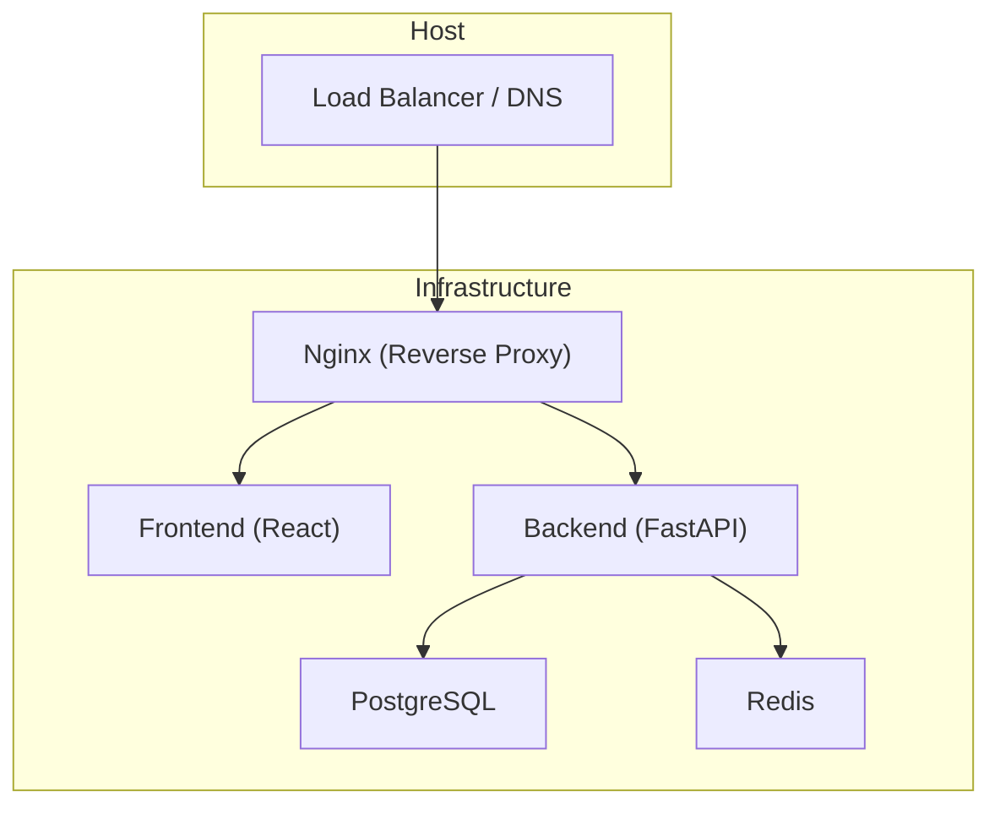
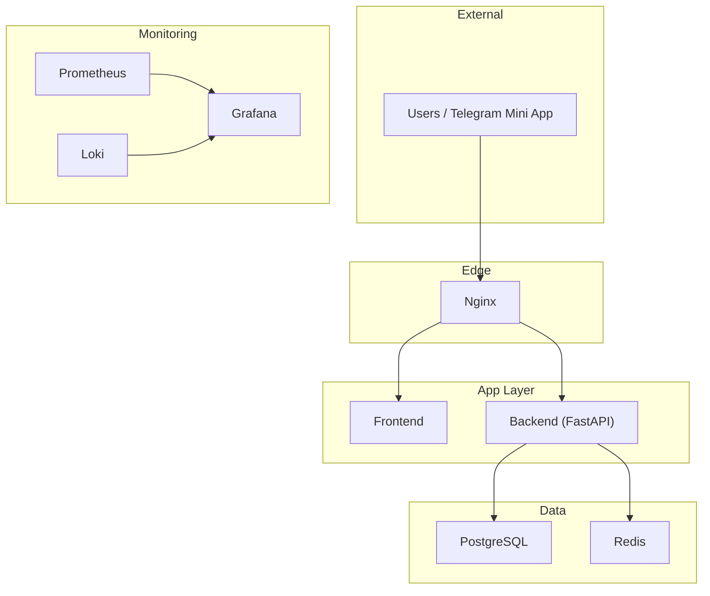
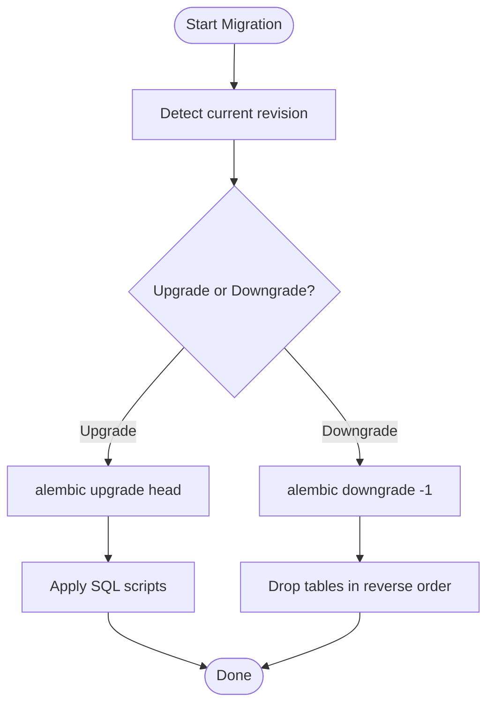
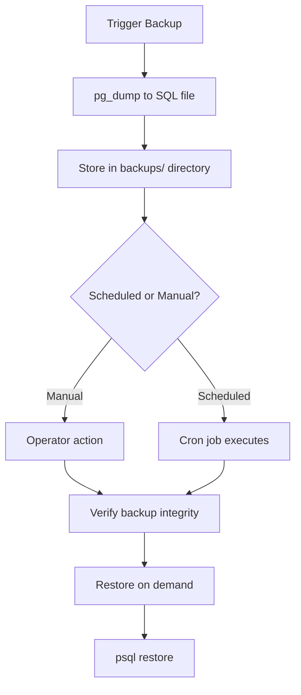
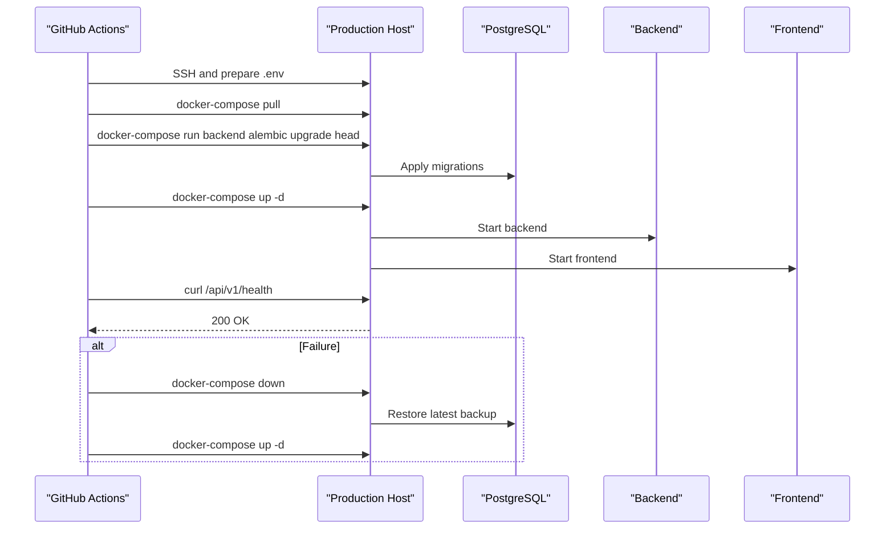
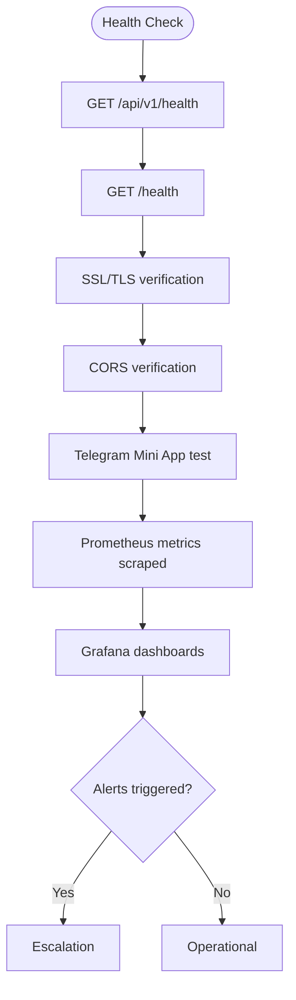
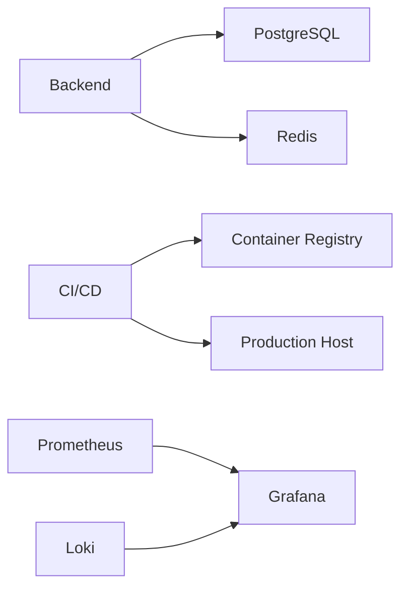

# Maintenance & Operations

<cite>
**Referenced Files in This Document**
- [README.md](file://README.md)
- [docs/DEPLOYMENT.md](file://docs/DEPLOYMENT.md)
- [docs/DEPLOYMENT.md](file://docs/DEPLOYMENT.md)
- [docs/ENVIRONMENT_SETUP.md](file://docs/ENVIRONMENT_SETUP.md)
- [docs/PRODUCTION_CHECKLIST.md](file://docs/PRODUCTION_CHECKLIST.md)
- [docs/SECURITY_CHECKLIST.md](file://docs/SECURITY_CHECKLIST.md)
- [database/migrations/versions/cd723942379e_initial_schema.py](file://database/migrations/versions/cd723942379e_initial_schema.py)
- [database/migrations/env.py](file://database/migrations/env.py)
- [docker-compose.prod.yml](file://docker-compose.prod.yml)
- [.github/workflows/deploy.yml](file://.github/workflows/deploy.yml)
- [monitoring/prometheus.yml](file://monitoring/prometheus.yml)
- [monitoring/grafana/provisioning/datasources/datasources.yml](file://monitoring/grafana/provisioning/datasources/datasources.yml)
- [backend/app/main.py](file://backend/app/main.py)
- [backend/app/utils/config.py](file://backend/app/utils/config.py)
</cite>

## Table of Contents
1. [Introduction](#introduction)
2. [Project Structure](#project-structure)
3. [Core Components](#core-components)
4. [Architecture Overview](#architecture-overview)
5. [Detailed Component Analysis](#detailed-component-analysis)
6. [Dependency Analysis](#dependency-analysis)
7. [Performance Considerations](#performance-considerations)
8. [Troubleshooting Guide](#troubleshooting-guide)
9. [Conclusion](#conclusion)
10. [Appendices](#appendices)

## Introduction
This document provides comprehensive maintenance and operations guidance for FitTracker Pro. It covers routine maintenance tasks (database backups, log rotation, system cleanup), database migration management (schema updates and rollbacks), application updates and zero-downtime deployment strategies, performance monitoring and capacity planning, operational checklists, health monitoring, troubleshooting procedures, disaster recovery planning, maintenance schedules, operational runbooks, escalation procedures, and cost optimization strategies.

## Project Structure
FitTracker Pro is a containerized application composed of:
- Frontend (React + Vite)
- Backend (FastAPI)
- Database (PostgreSQL)
- Caching (Redis)
- Reverse Proxy (Nginx)
- Monitoring (Prometheus + Grafana + Loki)
- CI/CD (GitHub Actions)

**Diagram sources**
- [docker-compose.prod.yml:1-132](file://docker-compose.prod.yml#L1-L132)
- [backend/app/main.py:56-106](file://backend/app/main.py#L56-L106)

**Section sources**
- [README.md:18-43](file://README.md#L18-L43)
- [docs/DEPLOYMENT.md:26-47](file://docs/DEPLOYMENT.md#L26-L47)
- [docker-compose.prod.yml:1-132](file://docker-compose.prod.yml#L1-L132)

## Core Components
- Backend API: FastAPI application with Sentry integration, CORS, rate limiting, and modular routers.
- Database: PostgreSQL with Alembic migrations and JSONB/GIN indexes for analytical fields.
- Caching: Redis for session/cache with memory limits and persistence.
- Reverse Proxy: Nginx with SSL/TLS, security headers, rate limiting, and health checks.
- Monitoring: Prometheus scraping backend and infrastructure metrics; Grafana for dashboards; Loki for logs.
- CI/CD: GitHub Actions workflows for testing, building, migrating, and deploying to production.

**Section sources**
- [backend/app/main.py:13-24](file://backend/app/main.py#L13-L24)
- [backend/app/main.py:77-87](file://backend/app/main.py#L77-L87)
- [backend/app/utils/config.py:15-54](file://backend/app/utils/config.py#L15-L54)
- [database/migrations/versions/cd723942379e_initial_schema.py:19-460](file://database/migrations/versions/cd723942379e_initial_schema.py#L19-L460)
- [docker-compose.prod.yml:5-123](file://docker-compose.prod.yml#L5-L123)
- [monitoring/prometheus.yml:15-48](file://monitoring/prometheus.yml#L15-L48)
- [monitoring/grafana/provisioning/datasources/datasources.yml:1-16](file://monitoring/grafana/provisioning/datasources/datasources.yml#L1-L16)
- [.github/workflows/deploy.yml:1-156](file://.github/workflows/deploy.yml#L1-L156)

## Architecture Overview
The production stack uses Docker Compose to orchestrate services behind Nginx. GitHub Actions automates deployment and migration. Monitoring stacks Prometheus and Grafana collect metrics; Loki aggregates logs.

**Diagram sources**
- [docker-compose.prod.yml:3-123](file://docker-compose.prod.yml#L3-L123)
- [monitoring/prometheus.yml:15-48](file://monitoring/prometheus.yml#L15-L48)
- [monitoring/grafana/provisioning/datasources/datasources.yml:3-15](file://monitoring/grafana/provisioning/datasources/datasources.yml#L3-L15)

## Detailed Component Analysis

### Database Migration Management
- Migration tooling: Alembic with async engine configuration and offline/online modes.
- Initial schema includes users, exercises, workout templates/logs, glucose logs, daily wellness, achievements, user achievements, challenges, and emergency contacts with GIN indexes and triggers for updated_at.
- Rollback supported to drop tables in reverse order.

**Diagram sources**
- [database/migrations/env.py:56-80](file://database/migrations/env.py#L56-L80)
- [database/migrations/versions/cd723942379e_initial_schema.py:19-460](file://database/migrations/versions/cd723942379e_initial_schema.py#L19-L460)

**Section sources**
- [database/migrations/env.py:1-81](file://database/migrations/env.py#L1-L81)
- [database/migrations/versions/cd723942379e_initial_schema.py:1-460](file://database/migrations/versions/cd723942379e_initial_schema.py#L1-L460)
- [docs/DEPLOYMENT.md:81-98](file://docs/DEPLOYMENT.md#L81-L98)

### Database Backups and Restoration
- Manual backup and restore commands are provided.
- Automated daily backup via cron is documented.
- CI/CD pipeline creates a database backup before running migrations during production deployments.

**Diagram sources**
- [docs/DEPLOYMENT.md:337-348](file://docs/DEPLOYMENT.md#L337-L348)
- [.github/workflows/deploy.yml:70-72](file://.github/workflows/deploy.yml#L70-L72)

**Section sources**
- [docs/DEPLOYMENT.md:337-348](file://docs/DEPLOYMENT.md#L337-L348)
- [docs/DEPLOYMENT.md:337-348](file://docs/DEPLOYMENT.md#L337-L348)
- [.github/workflows/deploy.yml:70-72](file://.github/workflows/deploy.yml#L70-L72)

### Application Updates and Zero-Downtime Deployment
- Production deployment uses GitHub Actions to pull images, run migrations, deploy services, and perform health checks.
- The pipeline supports rollback on failure by restoring from the latest backup and restarting services.
- Frontend and backend are containerized and deployed independently behind Nginx.

**Diagram sources**
- [.github/workflows/deploy.yml:28-103](file://.github/workflows/deploy.yml#L28-L103)
- [.github/workflows/deploy.yml:123-155](file://.github/workflows/deploy.yml#L123-L155)

**Section sources**
- [.github/workflows/deploy.yml:1-156](file://.github/workflows/deploy.yml#L1-L156)
- [docs/DEPLOYMENT.md:100-112](file://docs/DEPLOYMENT.md#L100-L112)
- [docker-compose.prod.yml:54-101](file://docker-compose.prod.yml#L54-L101)

### Health Monitoring and Operational Checklists
- Health endpoints:
  - Backend: GET /api/v1/health
  - Frontend: GET /health
- Monitoring stack includes Prometheus, Grafana, and Loki.
- Production checklist includes environment variables, SSL/TLS, Telegram integration, and performance verification.

**Diagram sources**
- [docs/DEPLOYMENT.md:171-173](file://docs/DEPLOYMENT.md#L171-L173)
- [docs/DEPLOYMENT.md:250-256](file://docs/DEPLOYMENT.md#L250-L256)
- [monitoring/prometheus.yml:31-35](file://monitoring/prometheus.yml#L31-L35)
- [monitoring/grafana/provisioning/datasources/datasources.yml:3-15](file://monitoring/grafana/provisioning/datasources/datasources.yml#L3-L15)

**Section sources**
- [docs/DEPLOYMENT.md:171-173](file://docs/DEPLOYMENT.md#L171-L173)
- [docs/DEPLOYMENT.md:250-256](file://docs/DEPLOYMENT.md#L250-L256)
- [docs/PRODUCTION_CHECKLIST.md:66-116](file://docs/PRODUCTION_CHECKLIST.md#L66-L116)
- [monitoring/prometheus.yml:1-49](file://monitoring/prometheus.yml#L1-L49)
- [monitoring/grafana/provisioning/datasources/datasources.yml:1-16](file://monitoring/grafana/provisioning/datasources/datasources.yml#L1-L16)

### Security and Compliance Considerations
- HTTPS enforced, security headers configured in Nginx, and rate limiting applied.
- Secrets managed via environment variables and GitHub Secrets.
- Dependency scanning and audit integrated into CI/CD.
- Security checklist includes firewall, SSH hardening, Docker security, and audit logging.

**Section sources**
- [docs/SECURITY_CHECKLIST.md:1-193](file://docs/SECURITY_CHECKLIST.md#L1-L193)
- [docs/ENVIRONMENT_SETUP.md:112-141](file://docs/ENVIRONMENT_SETUP.md#L112-L141)
- [.github/workflows/deploy.yml:15-16](file://.github/workflows/deploy.yml#L15-L16)

### Capacity Planning and Scaling Considerations
- Resource limits are defined per service in docker-compose.prod.yml.
- Horizontal scaling can be achieved by adding replicas behind Nginx and ensuring stateless backend behavior.
- Consider read replicas for PostgreSQL and Redis clustering for caching.

**Section sources**
- [docker-compose.prod.yml:25-81](file://docker-compose.prod.yml#L25-L81)

## Dependency Analysis
The backend depends on PostgreSQL and Redis. CI/CD depends on GitHub Secrets and container registry. Monitoring depends on Prometheus and Grafana provisioning.

**Diagram sources**
- [docker-compose.prod.yml:54-101](file://docker-compose.prod.yml#L54-L101)
- [.github/workflows/deploy.yml:17-21](file://.github/workflows/deploy.yml#L17-L21)
- [monitoring/prometheus.yml:1-49](file://monitoring/prometheus.yml#L1-L49)
- [monitoring/grafana/provisioning/datasources/datasources.yml:1-16](file://monitoring/grafana/provisioning/datasources/datasources.yml#L1-L16)

**Section sources**
- [docker-compose.prod.yml:1-132](file://docker-compose.prod.yml#L1-L132)
- [.github/workflows/deploy.yml:1-156](file://.github/workflows/deploy.yml#L1-L156)

## Performance Considerations
- Use GIN indexes on JSONB fields for efficient querying.
- Optimize queries and avoid N+1 problems; leverage connection pooling.
- Monitor latency and throughput via Prometheus and Grafana dashboards.
- Tune Redis memory policy and PostgreSQL work_mem/shared_buffers based on workload.
- Implement CDN for static assets and enable gzip in Nginx.

[No sources needed since this section provides general guidance]

## Troubleshooting Guide
Common issues and resolutions:
- Database connection failures: verify service health, logs, and credentials.
- Frontend not loading: check Nginx logs and build artifacts.
- API errors: inspect backend logs and health endpoint.
- SSL certificate issues: renew and copy certificates, then restart Nginx.
- Telegram WebApp not loading: ensure HTTPS, correct domain, and allowed origins.

**Section sources**
- [docs/DEPLOYMENT.md:182-214](file://docs/DEPLOYMENT.md#L182-L214)
- [docs/DEPLOYMENT.md:350-396](file://docs/DEPLOYMENT.md#L350-L396)

## Conclusion
FitTracker Pro’s operations model emphasizes automation, observability, and safety. The CI/CD pipeline ensures controlled deployments with pre-migration backups and rollback procedures. Monitoring and security practices provide visibility and resilience. Following the runbooks and checklists outlined here will maintain reliability and minimize downtime.

[No sources needed since this section summarizes without analyzing specific files]

## Appendices

### Routine Maintenance Tasks
- Database backups: manual and automated daily backups via cron.
- Log rotation: configure logrotate for Nginx and container logs.
- System cleanup: prune unused Docker images and volumes periodically.

**Section sources**
- [docs/DEPLOYMENT.md:337-348](file://docs/DEPLOYMENT.md#L337-L348)
- [docs/DEPLOYMENT.md:337-348](file://docs/DEPLOYMENT.md#L337-L348)
- [docs/PRODUCTION_CHECKLIST.md:211-223](file://docs/PRODUCTION_CHECKLIST.md#L211-L223)

### Operational Runbooks
- Production deployment: pull images, run migrations, deploy, health check.
- Rollback: stop services, restore latest backup, redeploy previous images.
- Health verification: backend health endpoint, frontend health path, SSL/TLS, CORS, Telegram integration.

**Section sources**
- [.github/workflows/deploy.yml:70-103](file://.github/workflows/deploy.yml#L70-L103)
- [docs/PRODUCTION_CHECKLIST.md:184-209](file://docs/PRODUCTION_CHECKLIST.md#L184-L209)
- [docs/PRODUCTION_CHECKLIST.md:66-116](file://docs/PRODUCTION_CHECKLIST.md#L66-L116)

### Disaster Recovery Planning
- Maintain recent backups in secure storage.
- Test restoration procedures monthly.
- Document contact lists and escalation paths.

**Section sources**
- [docs/PRODUCTION_CHECKLIST.md:184-209](file://docs/PRODUCTION_CHECKLIST.md#L184-L209)
- [docs/PRODUCTION_CHECKLIST.md:225-231](file://docs/PRODUCTION_CHECKLIST.md#L225-L231)

### Cost Optimization Strategies
- Right-size containers and set CPU/memory limits.
- Use managed databases and caching where appropriate.
- Monitor resource utilization via Prometheus and Grafana.
- Consolidate services and reuse infrastructure across environments.

**Section sources**
- [docker-compose.prod.yml:25-81](file://docker-compose.prod.yml#L25-L81)
- [monitoring/prometheus.yml:1-49](file://monitoring/prometheus.yml#L1-L49)