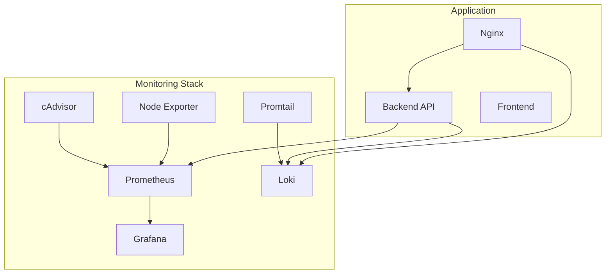
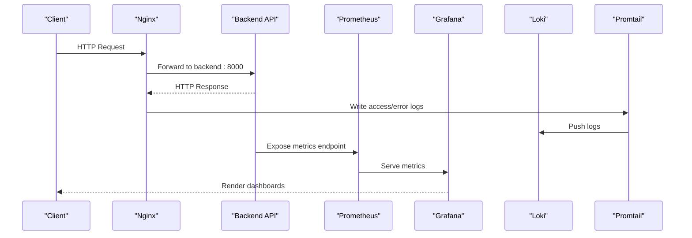
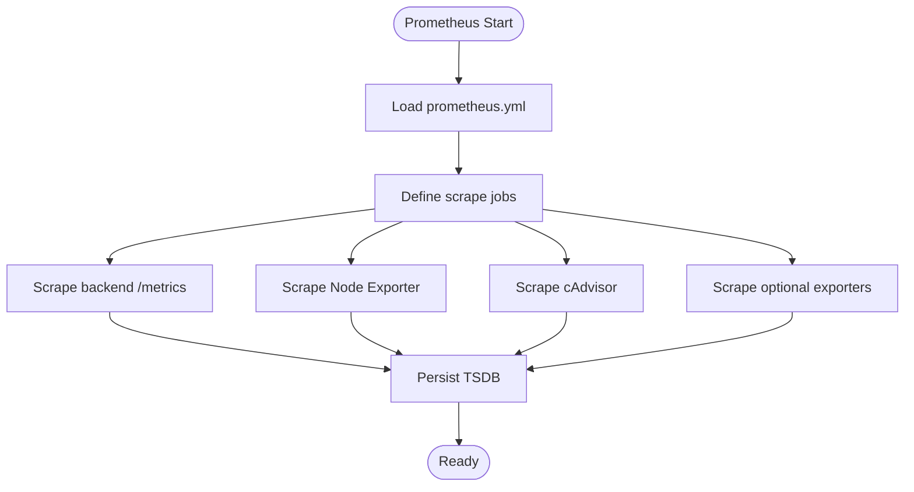
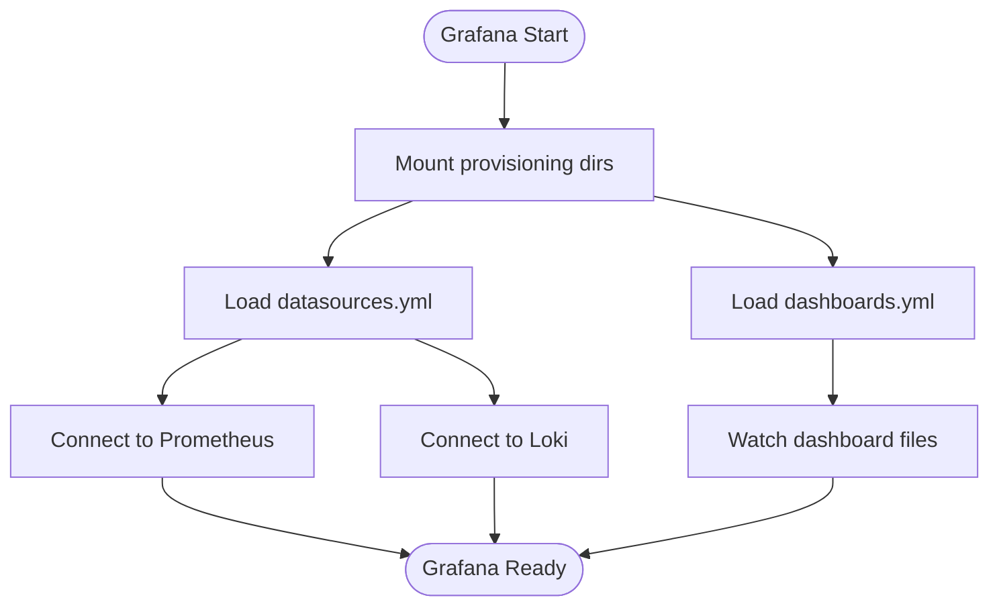
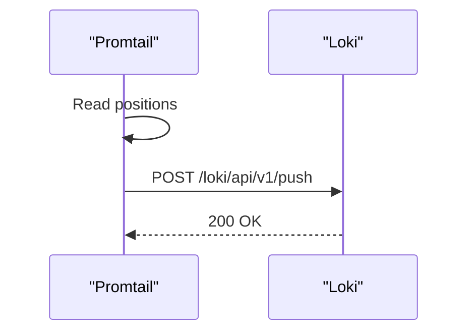
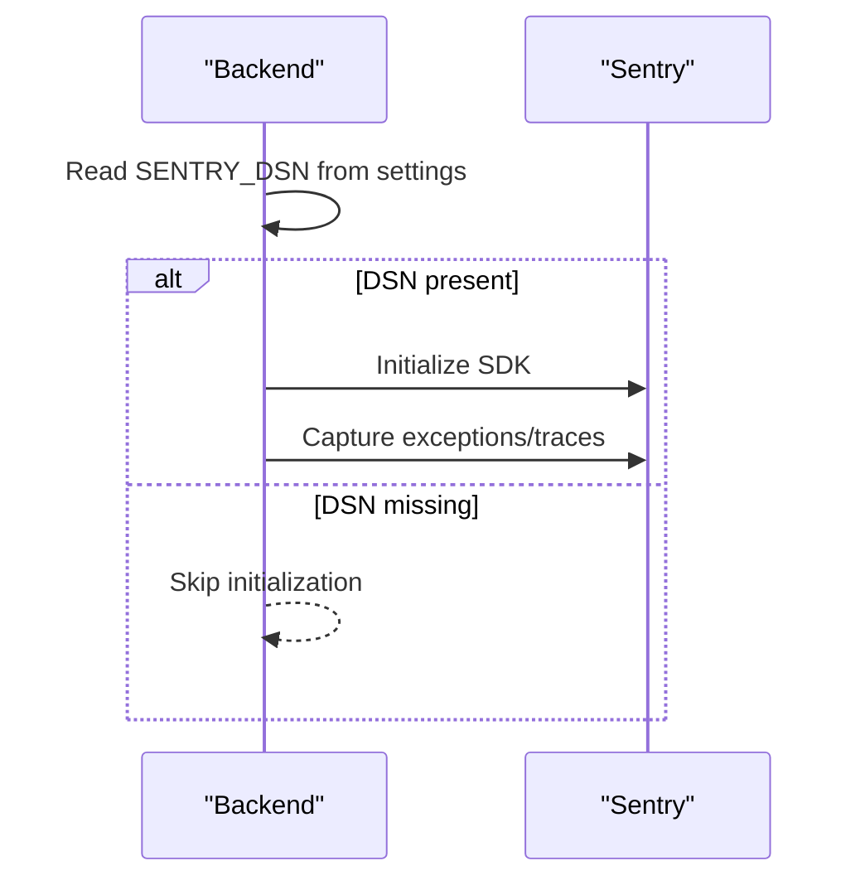
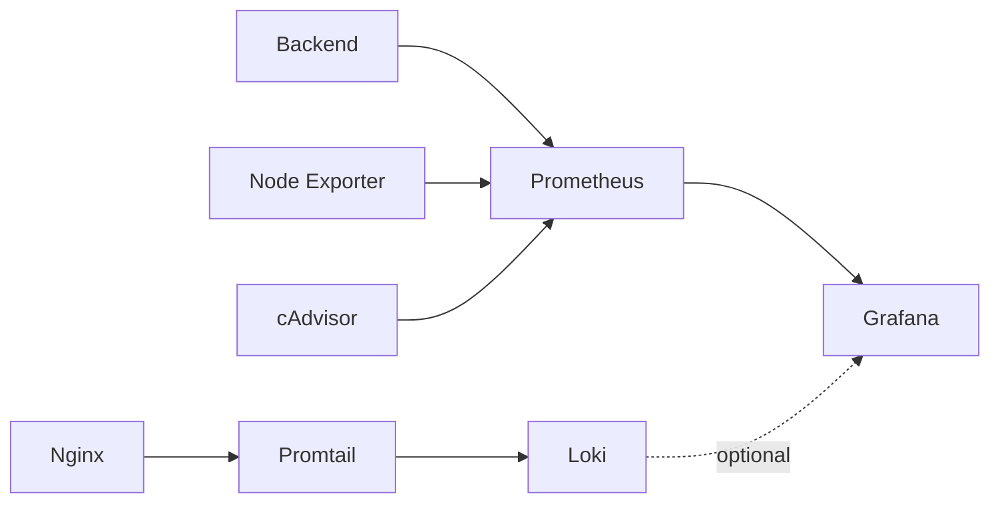

# Monitoring Stack

<cite>
**Referenced Files in This Document**
- [docker-compose.monitoring.yml](file://monitoring/docker-compose.monitoring.yml)
- [prometheus.yml](file://monitoring/prometheus.yml)
- [datasources.yml](file://monitoring/grafana/provisioning/datasources/datasources.yml)
- [dashboards.yml](file://monitoring/grafana/provisioning/dashboards/dashboards.yml)
- [loki-config.yml](file://monitoring/loki-config.yml)
- [promtail-config.yml](file://monitoring/promtail-config.yml)
- [main.py](file://backend/app/main.py)
- [config.py](file://backend/app/utils/config.py)
- [nginx.conf](file://nginx/nginx.conf)
- [docker-compose.yml](file://docker-compose.yml)
- [docker-compose.prod.yml](file://docker-compose.prod.yml)
- [docs/DEPLOYMENT.md](file://docs/DEPLOYMENT.md)
</cite>

## Table of Contents
1. [Introduction](#introduction)
2. [Project Structure](#project-structure)
3. [Core Components](#core-components)
4. [Architecture Overview](#architecture-overview)
5. [Detailed Component Analysis](#detailed-component-analysis)
6. [Dependency Analysis](#dependency-analysis)
7. [Performance Considerations](#performance-considerations)
8. [Troubleshooting Guide](#troubleshooting-guide)
9. [Conclusion](#conclusion)
10. [Appendices](#appendices)

## Introduction
This document describes the complete observability stack for FitTracker Pro, covering Prometheus metrics collection, Grafana visualization, Loki log aggregation, and Sentry error tracking. It explains how the monitoring services are configured, how to provision Grafana dashboards, how to collect and ship logs via Promtail, and how to integrate Sentry for error tracking. It also outlines alerting strategies, notification channels, and incident response procedures, along with practical guidance for interpreting metrics and troubleshooting common issues.

## Project Structure
The monitoring stack is organized under the monitoring directory and integrates with the application’s Docker Compose setup. The stack includes:
- Prometheus for metrics collection and alerting
- Grafana for visualization and dashboard provisioning
- Node Exporter and cAdvisor for host/container metrics
- Loki for log aggregation
- Promtail for log shipping

**Diagram sources**
- [docker-compose.monitoring.yml:3-124](file://monitoring/docker-compose.monitoring.yml#L3-L124)
- [docker-compose.yml:43-90](file://docker-compose.yml#L43-L90)
- [docker-compose.prod.yml:102-124](file://docker-compose.prod.yml#L102-L124)

**Section sources**
- [docker-compose.monitoring.yml:1-124](file://monitoring/docker-compose.monitoring.yml#L1-L124)
- [docker-compose.yml:1-99](file://docker-compose.yml#L1-L99)
- [docker-compose.prod.yml:1-132](file://docker-compose.prod.yml#L1-L132)

## Core Components
- Prometheus: Scrapes metrics from the backend, Node Exporter, cAdvisor, and optionally PostgreSQL and Redis exporters. It exposes a web UI and supports alerting configuration.
- Grafana: Visualizes Prometheus and Loki data. Dashboards are provisioned from files and data sources are auto-provisioned.
- Loki: Centralized log aggregation service.
- Promtail: Collects and forwards logs to Loki with label-based routing.
- Sentry: Error tracking integrated in the backend via environment configuration.

Key configuration touchpoints:
- Prometheus configuration defines jobs for backend, Node Exporter, cAdvisor, and optional exporters.
- Grafana provisioning configures Prometheus and Loki as data sources and enables dashboard file provisioning.
- Loki and Promtail configurations define ingestion endpoints and log paths.
- Backend initializes Sentry when a DSN is present.

**Section sources**
- [prometheus.yml:1-49](file://monitoring/prometheus.yml#L1-L49)
- [datasources.yml:1-16](file://monitoring/grafana/provisioning/datasources/datasources.yml#L1-L16)
- [dashboards.yml:1-13](file://monitoring/grafana/provisioning/dashboards/dashboards.yml#L1-L13)
- [loki-config.yml:1-43](file://monitoring/loki-config.yml#L1-L43)
- [promtail-config.yml:1-35](file://monitoring/promtail-config.yml#L1-L35)
- [main.py:31-43](file://backend/app/main.py#L31-L43)
- [config.py:40-42](file://backend/app/utils/config.py#L40-L42)

## Architecture Overview
The monitoring architecture connects the application stack to Prometheus and Grafana for metrics, and to Loki and Promtail for logs. Nginx routes traffic to the backend and also forwards logs to Loki for centralized aggregation.

**Diagram sources**
- [docker-compose.monitoring.yml:85-113](file://monitoring/docker-compose.monitoring.yml#L85-L113)
- [docker-compose.yml:38-90](file://docker-compose.yml#L38-L90)
- [nginx.conf:1-45](file://nginx/nginx.conf#L1-L45)
- [prometheus.yml:31-48](file://monitoring/prometheus.yml#L31-L48)

## Detailed Component Analysis

### Prometheus Configuration
Prometheus is configured to scrape:
- Prometheus itself
- Node Exporter for system metrics
- cAdvisor for container metrics
- FitTracker Backend on port 8000 at the /metrics path
- Optional exporters for PostgreSQL and Redis

Scrape intervals and retention are set, and alerting is configured but currently empty (placeholder for future rules).

**Diagram sources**
- [prometheus.yml:15-48](file://monitoring/prometheus.yml#L15-L48)

**Section sources**
- [prometheus.yml:1-49](file://monitoring/prometheus.yml#L1-L49)

### Grafana Setup and Provisioning
Grafana is configured with:
- Auto-provisioned data sources for Prometheus and Loki
- Dashboard provisioning from the dashboards directory
- Environment variables for admin credentials and plugin installation

Access is exposed locally on port 3001, and Grafana depends on Prometheus being available.

**Diagram sources**
- [docker-compose.monitoring.yml:25-46](file://monitoring/docker-compose.monitoring.yml#L25-L46)
- [datasources.yml:1-16](file://monitoring/grafana/provisioning/datasources/datasources.yml#L1-L16)
- [dashboards.yml:1-13](file://monitoring/grafana/provisioning/dashboards/dashboards.yml#L1-L13)

**Section sources**
- [docker-compose.monitoring.yml:25-46](file://monitoring/docker-compose.monitoring.yml#L25-L46)
- [datasources.yml:1-16](file://monitoring/grafana/provisioning/datasources/datasources.yml#L1-L16)
- [dashboards.yml:1-13](file://monitoring/grafana/provisioning/dashboards/dashboards.yml#L1-L13)

### Loki and Promtail Configuration
Loki runs as a single-node instance with local filesystem storage and shipsper-based schema. Promtail is configured to:
- Listen on an HTTP port
- Push to Loki’s ingest endpoint
- Tail system logs, Docker container logs, and application-specific logs

**Diagram sources**
- [loki-config.yml:1-43](file://monitoring/loki-config.yml#L1-L43)
- [promtail-config.yml:1-35](file://monitoring/promtail-config.yml#L1-L35)

**Section sources**
- [loki-config.yml:1-43](file://monitoring/loki-config.yml#L1-L43)
- [promtail-config.yml:1-35](file://monitoring/promtail-config.yml#L1-L35)

### Sentry Error Tracking Integration
Sentry is integrated in the backend:
- Initialized when SENTRY_DSN is present in environment
- Integrations include FastAPI and SQLAlchemy
- Sampling rates differ between environments

Environment variables are passed from Docker Compose, enabling Sentry in development and production.

**Diagram sources**
- [main.py:31-43](file://backend/app/main.py#L31-L43)
- [config.py:40-42](file://backend/app/utils/config.py#L40-L42)
- [docker-compose.yml:50-60](file://docker-compose.yml#L50-L60)
- [docker-compose.prod.yml:59-69](file://docker-compose.prod.yml#L59-L69)

**Section sources**
- [main.py:31-43](file://backend/app/main.py#L31-L43)
- [config.py:40-42](file://backend/app/utils/config.py#L40-L42)
- [docker-compose.yml:50-60](file://docker-compose.yml#L50-L60)
- [docker-compose.prod.yml:59-69](file://docker-compose.prod.yml#L59-L69)

### Nginx Logging and Metrics
Nginx is configured with:
- Structured log format capturing request timing and upstream metrics
- Separate access and error logs
- Rate limiting zones for API and login endpoints
- Upstreams to backend and frontend

These logs are forwarded to Loki via Promtail for centralized log aggregation.

**Section sources**
- [nginx.conf:9-45](file://nginx/nginx.conf#L9-L45)
- [docker-compose.prod.yml:102-124](file://docker-compose.prod.yml#L102-L124)

## Dependency Analysis
The monitoring stack depends on:
- Prometheus for metrics scraping and alerting
- Grafana for visualization and dashboard provisioning
- Loki and Promtail for log aggregation and collection
- Backend for exposing metrics and emitting logs
- Nginx for routing and log generation

**Diagram sources**
- [docker-compose.monitoring.yml:3-124](file://monitoring/docker-compose.monitoring.yml#L3-L124)
- [prometheus.yml:15-48](file://monitoring/prometheus.yml#L15-L48)
- [nginx.conf:38-45](file://nginx/nginx.conf#L38-L45)

**Section sources**
- [docker-compose.monitoring.yml:3-124](file://monitoring/docker-compose.monitoring.yml#L3-L124)
- [prometheus.yml:15-48](file://monitoring/prometheus.yml#L15-L48)
- [nginx.conf:38-45](file://nginx/nginx.conf#L38-L45)

## Performance Considerations
- Adjust scrape intervals and retention in Prometheus to balance data fidelity and storage costs.
- Use Grafana dashboard caching and efficient queries to reduce load.
- Ensure Loki and Promtail resource limits are appropriate for log volume.
- Monitor backend and Nginx performance via Node Exporter and cAdvisor.
- Keep Prometheus and Grafana versions aligned with the latest stable releases.

## Troubleshooting Guide
Common issues and resolutions:
- Prometheus cannot reach backend metrics:
  - Verify backend is healthy and exposes /metrics.
  - Confirm Prometheus scrape job target and path.
- Grafana cannot connect to Prometheus/Loki:
  - Check datasource URLs and network connectivity.
  - Ensure provisioning files are mounted and readable.
- Logs not appearing in Loki:
  - Confirm Promtail is running and pointing to correct Loki URL.
  - Verify log paths match actual container log locations.
- Sentry not capturing errors:
  - Ensure SENTRY_DSN is set in environment.
  - Check backend logs for initialization messages.

Operational commands:
- Start monitoring stack:
  - Change to monitoring directory and run compose up with the monitoring compose file.
- Access Grafana:
  - Open the local port and use configured admin credentials.

**Section sources**
- [docs/DEPLOYMENT.md:155-169](file://docs/DEPLOYMENT.md#L155-L169)
- [docker-compose.monitoring.yml:25-46](file://monitoring/docker-compose.monitoring.yml#L25-L46)
- [promtail-config.yml:8-10](file://monitoring/promtail-config.yml#L8-L10)
- [main.py:31-43](file://backend/app/main.py#L31-L43)

## Conclusion
The FitTracker Pro monitoring stack provides a robust foundation for metrics, logs, and error tracking. Prometheus collects application and infrastructure metrics, Grafana visualizes them, Loki aggregates logs shipped by Promtail, and Sentry captures application errors. With proper alerting rules, dashboard provisioning, and operational procedures, the team can maintain high visibility into system health and performance.

## Appendices

### Alerting Strategies and Notification Channels
- Define alerting rules in Prometheus and wire them to an Alertmanager instance.
- Configure notification channels (email, Slack, PagerDuty) in Alertmanager.
- Use Grafana annotations to correlate incidents with dashboards.
- Establish escalation policies and on-call rotations.

### Incident Response Procedures
- Define runbooks for common failure modes (database outages, backend latency spikes, log ingestion failures).
- Automate remediation steps where possible.
- Conduct post-mortems and update monitoring coverage accordingly.

### Dashboard Examples and Metric Interpretation
- System health: CPU, memory, disk, and network utilization from Node Exporter.
- Container metrics: Resource usage per service from cAdvisor.
- Application metrics: Backend request rates, durations, and error rates.
- Logs: Nginx access and error logs, backend application logs.
- Error tracking: Sentry events and performance traces.

[No sources needed since this section provides general guidance]