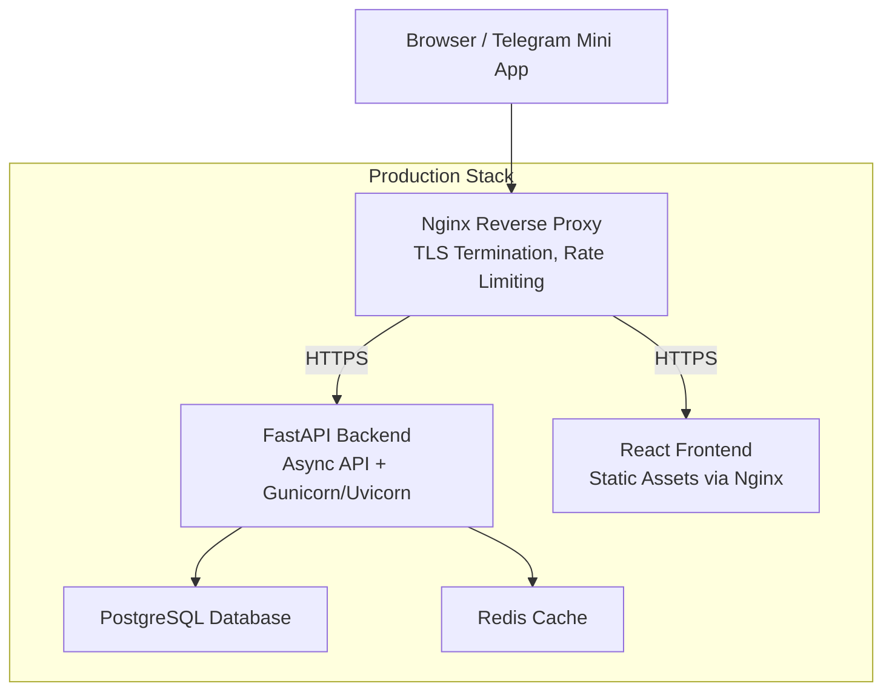
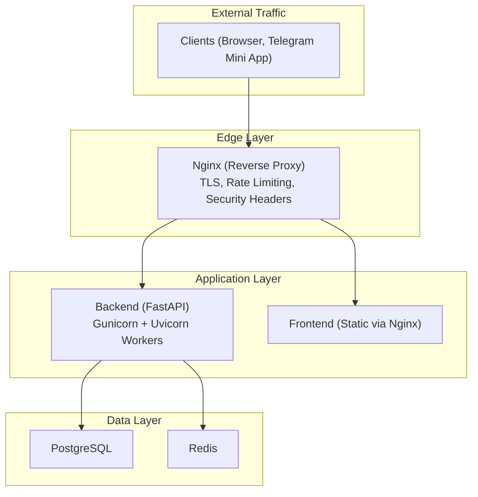
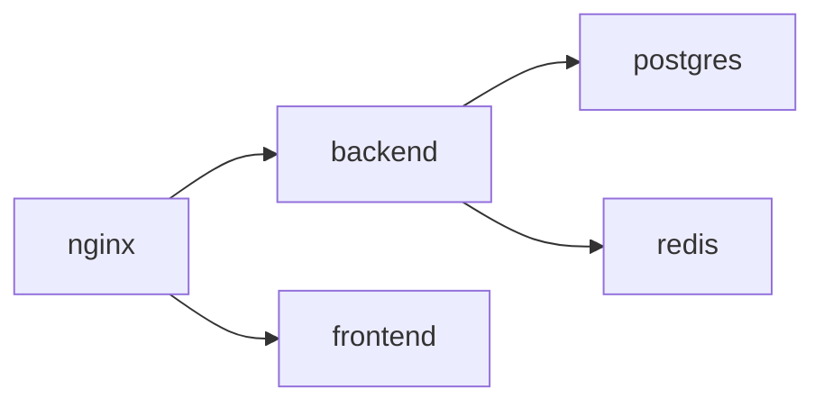

# Production Deployment

<cite>
**Referenced Files in This Document**
- [docker-compose.prod.yml](file://docker-compose.prod.yml)
- [nginx.conf](file://nginx/nginx.conf)
- [Dockerfile.backend](file://backend/Dockerfile)
- [Dockerfile.frontend](file://frontend/Dockerfile)
- [README-DEPLOYMENT.md](file://README-DEPLOYMENT.md)
- [docs/DEPLOYMENT.md](file://docs/DEPLOYMENT.md)
- [docs/ENVIRONMENT_SETUP.md](file://docs/ENVIRONMENT_SETUP.md)
- [backend/app/utils/config.py](file://backend/app/utils/config.py)
- [backend/app/main.py](file://backend/app/main.py)
- [backend/requirements.txt](file://backend/requirements.txt)
- [frontend/package.json](file://frontend/package.json)
- [monitoring/docker-compose.monitoring.yml](file://monitoring/docker-compose.monitoring.yml)
- [.github/workflows/deploy.yml](file://.github/workflows/deploy.yml)
</cite>

## Table of Contents
1. [Introduction](#introduction)
2. [Project Structure](#project-structure)
3. [Core Components](#core-components)
4. [Architecture Overview](#architecture-overview)
5. [Detailed Component Analysis](#detailed-component-analysis)
6. [Dependency Analysis](#dependency-analysis)
7. [Performance Considerations](#performance-considerations)
8. [Troubleshooting Guide](#troubleshooting-guide)
9. [Conclusion](#conclusion)
10. [Appendices](#appendices)

## Introduction
This document provides comprehensive production deployment guidance for FitTracker Pro. It covers the Docker Compose production configuration, Nginx reverse proxy setup with SSL/TLS termination and rate limiting, multi-stage Docker builds for backend and frontend, environment configuration and secrets handling, database connectivity, deployment prerequisites, network configuration, step-by-step deployment instructions, post-deployment verification, container health checks, resource limits, and logging configuration.

## Project Structure
FitTracker Pro is organized into modular components:
- backend: FastAPI application with asynchronous database connectivity and middleware
- frontend: React + Vite application packaged with Nginx for production
- database: Alembic migrations and schema definitions
- nginx: Reverse proxy configuration for SSL/TLS, rate limiting, and static asset serving
- monitoring: Optional Prometheus, Grafana, Loki, and cAdvisor stack
- GitHub Actions: CI/CD workflows for building, pushing, and deploying images

**Diagram sources**
- [docker-compose.prod.yml](file://docker-compose.prod.yml#L3)
- [nginx/nginx.conf](file://nginx/nginx.conf#L56)
- [backend/Dockerfile](file://backend/Dockerfile#L46)
- [frontend/Dockerfile](file://frontend/Dockerfile#L20)

**Section sources**
- [docker-compose.prod.yml:1-132](file://docker-compose.prod.yml#L1-L132)
- [nginx/nginx.conf:1-144](file://nginx/nginx.conf#L1-L144)
- [backend/Dockerfile:1-48](file://backend/Dockerfile#L1-L48)
- [frontend/Dockerfile:1-56](file://frontend/Dockerfile#L1-L56)

## Core Components
- PostgreSQL service with persistent volumes, local backups mount, health checks, and resource limits
- Redis cache with persistence and memory limits
- Backend service using Gunicorn with Uvicorn workers, async database connectivity, and Sentry integration
- Frontend service built in a multi-stage Dockerfile and served via Nginx
- Nginx reverse proxy handling TLS, rate limiting, security headers, and static asset caching

Key production configuration highlights:
- Environment variables injected via Docker Compose environment block and referenced by services
- Health checks defined at container level for readiness and liveness
- Resource limits enforced via deploy.resources for CPU and memory
- Network isolation using a dedicated bridge network

**Section sources**
- [docker-compose.prod.yml:5-124](file://docker-compose.prod.yml#L5-L124)
- [backend/app/utils/config.py:15-54](file://backend/app/utils/config.py#L15-L54)
- [backend/app/main.py:31-43](file://backend/app/main.py#L31-L43)

## Architecture Overview
The production architecture uses a reverse proxy to terminate TLS and route traffic to backend and frontend services. The backend exposes REST endpoints and integrates with PostgreSQL and Redis. The frontend serves static assets and proxies API requests to the backend.

**Diagram sources**
- [nginx/nginx.conf:56-127](file://nginx/nginx.conf#L56-L127)
- [docker-compose.prod.yml:54-101](file://docker-compose.prod.yml#L54-L101)

## Detailed Component Analysis

### Docker Compose Production Services
- postgres: Managed PostgreSQL with health checks, persistent storage, and backups mount
- redis: Redis with persistence and memory constraints
- backend: FastAPI with Gunicorn workers, async database URL, Redis URL, environment flags, and Sentry
- frontend: Built React app served by Nginx with health endpoint
- nginx: Reverse proxy with TLS, rate limiting, security headers, and static asset caching

Environment variables and mounts:
- Backend environment variables include database URLs, Redis URL, secrets, Telegram settings, allowed origins, and Sentry DSN
- Nginx mounts include configuration, SSL certificates, and logs
- Persistent volumes for PostgreSQL and Redis data

Health checks:
- postgres: Uses pg_isready to verify database availability
- redis: Uses redis-cli ping
- backend: HTTP GET /api/v1/health
- frontend: HTTP GET /health

Resource limits:
- CPU and memory caps applied to each service via deploy.resources

Networking:
- All services on a single bridge network named fittracker-network

**Section sources**
- [docker-compose.prod.yml:5-124](file://docker-compose.prod.yml#L5-L124)

### Nginx Reverse Proxy Configuration
Nginx terminates TLS, enforces security headers, applies rate limiting, and serves static assets with long cache headers. It defines upstreams for backend and frontend and forwards API requests to the backend while serving static content from the frontend.

Key features:
- HTTP to HTTPS redirect
- TLS 1.2/1.3 with modern cipher suites
- Security headers (X-Frame-Options, X-Content-Type-Options, X-XSS-Protection, HSTS, Referrer-Policy, Permissions-Policy)
- Rate limiting zones for API and login endpoints
- Keepalive connections to upstreams
- Static asset caching with immutable cache-control
- Health check endpoint returning plaintext “healthy”
- Blocking access to hidden files and backup file extensions

Logging:
- Access and error logs with structured format
- Separate logs directory mounted for persistence

**Section sources**
- [nginx/nginx.conf:56-142](file://nginx/nginx.conf#L56-L142)

### Backend Multi-stage Docker Build
The backend Dockerfile:
- Uses Python slim base with system dependencies for compilation and runtime
- Installs Python dependencies from requirements.txt
- Copies application code and sets up non-root user
- Exposes port 8000
- Defines health check against /api/v1/health
- Runs with Gunicorn using Uvicorn workers

Runtime configuration:
- Async database connectivity via DATABASE_URL
- Synchronous database connectivity via DATABASE_URL_SYNC
- Redis URL for caching and Celery
- Sentry SDK initialization when DSN is present

**Section sources**
- [backend/Dockerfile:1-48](file://backend/Dockerfile#L1-L48)
- [backend/app/main.py:31-43](file://backend/app/main.py#L31-L43)
- [backend/requirements.txt:1-42](file://backend/requirements.txt#L1-L42)

### Frontend Multi-stage Docker Build
The frontend Dockerfile:
- Stage 1: Node Alpine with production dependencies and build step
- Stage 2: Nginx Alpine with custom configuration and built assets copied from stage 1
- Non-root user setup and permission hardening
- Health check endpoint exposed at /health
- Exposes port 80

Build and runtime:
- VITE_API_URL and VITE_TELEGRAM_BOT_USERNAME passed as environment variables
- Static assets cached aggressively by Nginx

**Section sources**
- [frontend/Dockerfile:1-56](file://frontend/Dockerfile#L1-L56)
- [frontend/package.json:1-60](file://frontend/package.json#L1-L60)

### Environment Configuration and Secrets Management
Environment variables are managed via Docker Compose environment blocks and referenced by services. The backend reads from a .env file using Pydantic Settings, while the frontend reads Vite-time variables.

Required backend variables:
- DATABASE_URL and DATABASE_URL_SYNC
- SECRET_KEY
- TELEGRAM_BOT_TOKEN and TELEGRAM_WEBAPP_URL
- ALLOWED_ORIGINS
- SENTRY_DSN (optional)

Required frontend variables:
- VITE_API_URL
- VITE_TELEGRAM_BOT_USERNAME

Production environment file creation and permissions are documented in deployment guides.

**Section sources**
- [docker-compose.prod.yml:59-91](file://docker-compose.prod.yml#L59-L91)
- [backend/app/utils/config.py:15-54](file://backend/app/utils/config.py#L15-L54)
- [docs/ENVIRONMENT_SETUP.md:90-110](file://docs/ENVIRONMENT_SETUP.md#L90-L110)

### Database Connectivity Setup
The backend connects to PostgreSQL using asyncpg for async operations and a synchronous URL for Alembic migrations. The compose file defines the connection strings using environment variables resolved from the root .env file.

Connection details:
- DATABASE_URL: async PostgreSQL connection string
- DATABASE_URL_SYNC: synchronous PostgreSQL connection string
- Redis URL: redis://redis:6379/0

**Section sources**
- [docker-compose.prod.yml:60-62](file://docker-compose.prod.yml#L60-L62)
- [backend/app/utils/config.py:21-26](file://backend/app/utils/config.py#L21-L26)

### Deployment Prerequisites and Server Requirements
Server requirements:
- Ubuntu 22.04 LTS or compatible
- Docker Engine and Docker Compose installed
- Open ports 80 and 443
- Domain pointing to server IP

Prerequisites:
- SSL certificates (Let’s Encrypt recommended)
- DNS A records for domain(s)
- GitHub repository with secrets configured for automated deployments

**Section sources**
- [docs/DEPLOYMENT.md:34-62](file://docs/DEPLOYMENT.md#L34-L62)
- [docs/DEPLOYMENT.md:124-157](file://docs/DEPLOYMENT.md#L124-L157)

### Step-by-Step Deployment Instructions
Automated deployment (recommended):
- Create a GitHub release to trigger the deploy workflow
- The workflow pulls images, runs migrations, deploys services, prunes images, and performs health checks

Manual deployment:
- SSH to server and navigate to project directory
- Create .env from secrets
- Pull latest images
- Run database migrations
- Start services
- Verify status and review logs

Post-deployment verification:
- Check service status and logs
- Validate health endpoints
- Confirm TLS termination and static asset delivery

**Section sources**
- [.github/workflows/deploy.yml:28-103](file://.github/workflows/deploy.yml#L28-L103)
- [docs/DEPLOYMENT.md:305-335](file://docs/DEPLOYMENT.md#L305-L335)

### Post-deployment Verification and Initial Configuration
Verification steps:
- Backend: curl GET /api/v1/health
- Frontend: curl GET /health
- Nginx: curl -I https://yourdomain.com/health
- Database: connect to postgres and verify schema

Initial configuration:
- Configure Telegram Mini App URL and allowed origins
- Set up Sentry DSN for error tracking
- Configure domain and SSL certificates

**Section sources**
- [README-DEPLOYMENT.md:171-174](file://README-DEPLOYMENT.md#L171-L174)
- [docs/DEPLOYMENT.md:391-396](file://docs/DEPLOYMENT.md#L391-L396)

### Container Health Checks and Logging
Health checks:
- postgres: pg_isready
- redis: redis-cli ping
- backend: HTTP GET /api/v1/health
- frontend: HTTP GET /health

Logging:
- Nginx access and error logs with structured format
- Backend uses structlog and optional Sentry SDK
- Monitoring stack (Prometheus, Grafana, Loki, cAdvisor) available for production observability

**Section sources**
- [docker-compose.prod.yml:18-52](file://docker-compose.prod.yml#L18-L52)
- [backend/Dockerfile:42-44](file://backend/Dockerfile#L42-L44)
- [frontend/Dockerfile:50-52](file://frontend/Dockerfile#L50-L52)
- [nginx/nginx.conf:9-17](file://nginx/nginx.conf#L9-L17)
- [monitoring/docker-compose.monitoring.yml:1-124](file://monitoring/docker-compose.monitoring.yml#L1-L124)

## Dependency Analysis
The application stack has clear boundaries:
- Nginx depends on backend and frontend services
- Backend depends on PostgreSQL and Redis
- Frontend is served by Nginx

**Diagram sources**
- [docker-compose.prod.yml:70-116](file://docker-compose.prod.yml#L70-L116)

**Section sources**
- [docker-compose.prod.yml:54-124](file://docker-compose.prod.yml#L54-L124)

## Performance Considerations
- Use Nginx gzip and static asset caching to reduce bandwidth and latency
- Apply rate limiting zones to protect backend APIs
- Set appropriate resource limits to prevent noisy-neighbor issues
- Use async database drivers and keepalive upstream connections
- Monitor system and container metrics with the included monitoring stack

[No sources needed since this section provides general guidance]

## Troubleshooting Guide
Common issues and resolutions:
- Database connection failures: verify credentials, network connectivity, and service health
- Frontend not loading: inspect Nginx logs and confirm static build
- API errors: check backend logs and health endpoint
- SSL certificate problems: renew certificates and restart Nginx
- Telegram WebApp not loading: ensure HTTPS and correct allowed domains

**Section sources**
- [README-DEPLOYMENT.md:182-214](file://README-DEPLOYMENT.md#L182-L214)
- [docs/DEPLOYMENT.md:350-396](file://docs/DEPLOYMENT.md#L350-L396)

## Conclusion
FitTracker Pro’s production deployment leverages Docker Compose for orchestration, Nginx for reverse proxying and TLS termination, and multi-stage Docker builds for efficient and secure containers. With environment-driven configuration, health checks, resource limits, and optional monitoring, the stack is ready for production use. Follow the documented steps to provision infrastructure, configure secrets, deploy images, and verify services.

[No sources needed since this section summarizes without analyzing specific files]

## Appendices

### A. Production Environment Variables Reference
Backend variables:
- DATABASE_URL: async PostgreSQL connection string
- DATABASE_URL_SYNC: synchronous PostgreSQL connection string
- SECRET_KEY: JWT signing key
- TELEGRAM_BOT_TOKEN: Telegram Bot token
- TELEGRAM_WEBAPP_URL: Mini App URL
- ALLOWED_ORIGINS: Comma-separated list of allowed origins
- SENTRY_DSN: Sentry DSN for error tracking

Frontend variables:
- VITE_API_URL: Backend API URL
- VITE_TELEGRAM_BOT_USERNAME: Telegram bot username (without @)

**Section sources**
- [docker-compose.prod.yml:59-91](file://docker-compose.prod.yml#L59-L91)
- [docs/ENVIRONMENT_SETUP.md:90-110](file://docs/ENVIRONMENT_SETUP.md#L90-L110)

### B. CI/CD Workflow Overview
GitHub Actions workflow:
- Automated build and push of container images
- Production deployment triggered by release
- Database migrations executed before deployment
- Health checks performed after deployment
- Optional Slack notifications and rollback on failure

**Section sources**
- [.github/workflows/deploy.yml:1-156](file://.github/workflows/deploy.yml#L1-L156)

### C. Monitoring Stack (Optional)
The monitoring stack includes:
- Prometheus for metrics scraping
- Grafana for dashboards
- Loki and Promtail for log aggregation
- cAdvisor for container metrics
- Node Exporter for system metrics

**Section sources**
- [monitoring/docker-compose.monitoring.yml:1-124](file://monitoring/docker-compose.monitoring.yml#L1-L124)