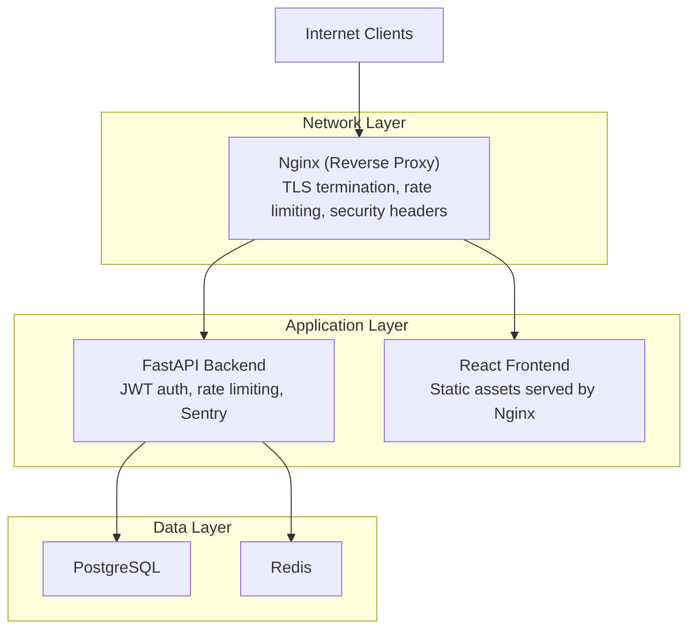
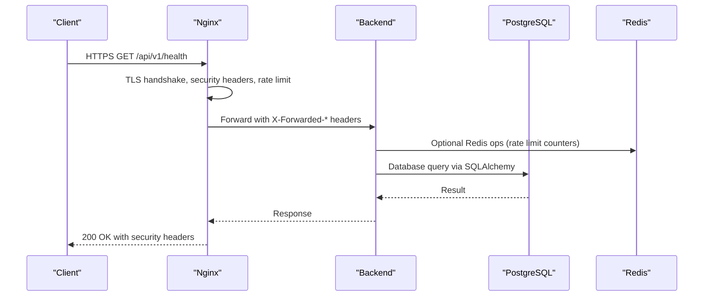
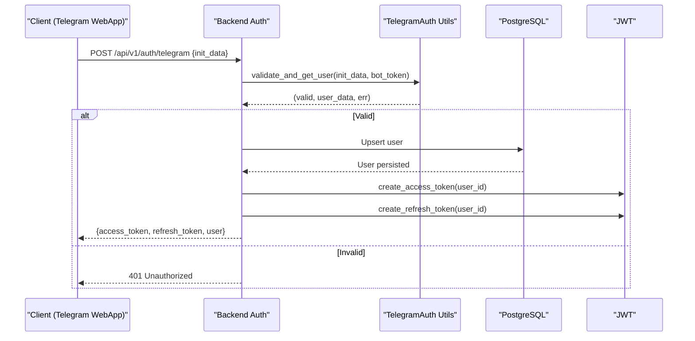
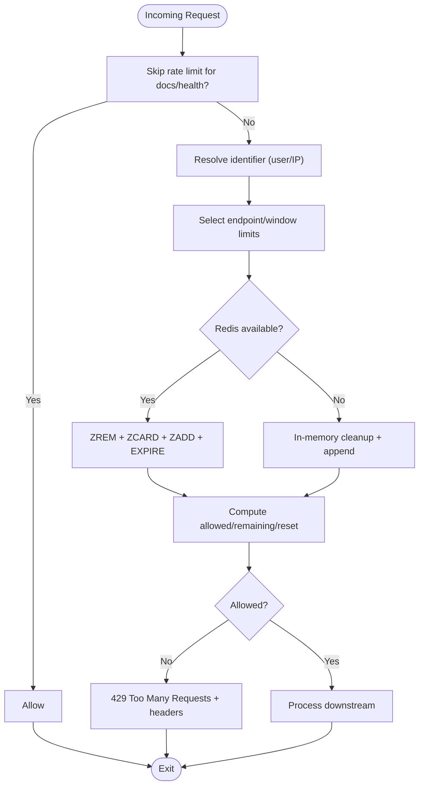
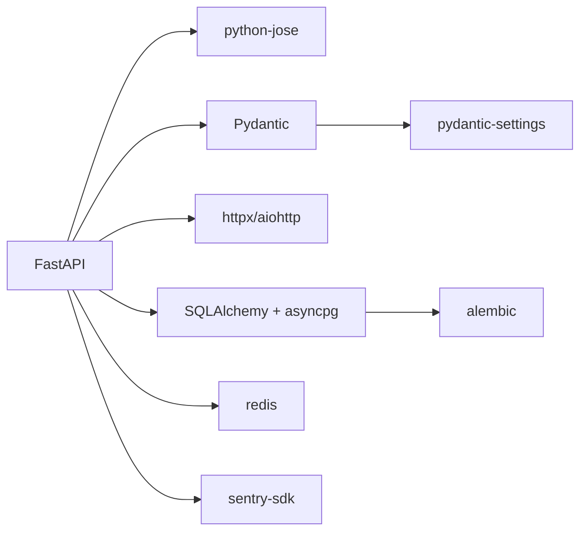

# Security Hardening

<cite>
**Referenced Files in This Document**
- [backend/app/utils/config.py](file://backend/app/utils/config.py)
- [backend/app/main.py](file://backend/app/main.py)
- [backend/app/middleware/auth.py](file://backend/app/middleware/auth.py)
- [backend/app/middleware/rate_limit.py](file://backend/app/middleware/rate_limit.py)
- [backend/app/api/auth.py](file://backend/app/api/auth.py)
- [backend/app/utils/telegram_auth.py](file://backend/app/utils/telegram_auth.py)
- [backend/app/models/user.py](file://backend/app/models/user.py)
- [backend/Dockerfile](file://backend/Dockerfile)
- [frontend/Dockerfile](file://frontend/Dockerfile)
- [docker-compose.prod.yml](file://docker-compose.prod.yml)
- [nginx/nginx.conf](file://nginx/nginx.conf)
- [docs/SECURITY_CHECKLIST.md](file://docs/SECURITY_CHECKLIST.md)
- [docs/PRODUCTION_CHECKLIST.md](file://docs/PRODUCTION_CHECKLIST.md)
- [.github/workflows/deploy.yml](file://.github/workflows/deploy.yml)
- [.github/workflows/test.yml](file://.github/workflows/test.yml)
- [backend/requirements.txt](file://backend/requirements.txt)
</cite>

## Table of Contents
1. [Introduction](#introduction)
2. [Project Structure](#project-structure)
3. [Core Components](#core-components)
4. [Architecture Overview](#architecture-overview)
5. [Detailed Component Analysis](#detailed-component-analysis)
6. [Dependency Analysis](#dependency-analysis)
7. [Performance Considerations](#performance-considerations)
8. [Troubleshooting Guide](#troubleshooting-guide)
9. [Conclusion](#conclusion)
10. [Appendices](#appendices)

## Introduction
This document provides comprehensive security hardening guidance for FitTracker Pro, focusing on production-grade deployment. It consolidates and expands upon the repository’s existing security-related files and configurations to deliver actionable best practices across SSL/TLS, firewall/network security, environment variable and secret management, encryption at rest, authentication and authorization, rate limiting, API protection, database security, container hardening, vulnerability scanning, dependency updates, access control, audit logging, compliance, and operational security (penetration testing, incident response, monitoring, and remediation).

## Project Structure
FitTracker Pro follows a clear separation of concerns:
- Backend: FastAPI application with middleware for authentication and rate limiting, API routers for authentication and business domains, SQLAlchemy models, and configuration management.
- Frontend: React application packaged behind Nginx with a dedicated Dockerfile.
- Infrastructure: Docker Compose orchestrates PostgreSQL, Redis, Backend, Frontend, and Nginx; Nginx handles SSL/TLS termination and reverse proxying.
- CI/CD: GitHub Actions workflows for testing, security scanning, and production deployment.

**Diagram sources**
- [docker-compose.prod.yml:1-132](file://docker-compose.prod.yml#L1-L132)
- [nginx/nginx.conf:1-144](file://nginx/nginx.conf#L1-L144)
- [backend/app/main.py:1-126](file://backend/app/main.py#L1-L126)

**Section sources**
- [docker-compose.prod.yml:1-132](file://docker-compose.prod.yml#L1-L132)
- [nginx/nginx.conf:1-144](file://nginx/nginx.conf#L1-L144)
- [backend/app/main.py:1-126](file://backend/app/main.py#L1-L126)

## Core Components
- Configuration and secrets management: Centralized via Pydantic settings loaded from a .env file and injected into services.
- Authentication: Telegram WebApp-initiated authentication with server-side validation and JWT issuance for subsequent API access.
- Authorization: JWT bearer token verification and optional admin privilege enforcement.
- Rate limiting: Distributed tracking using Redis with graceful degradation to in-memory storage.
- Transport security: Nginx terminates TLS, enforces redirects, and applies security headers.
- Container hardening: Non-root users, minimal base images, health checks, and read-only filesystems where appropriate.
- Observability: Sentry integration for error tracking and performance profiling.

**Section sources**
- [backend/app/utils/config.py:1-55](file://backend/app/utils/config.py#L1-L55)
- [backend/app/api/auth.py:1-345](file://backend/app/api/auth.py#L1-L345)
- [backend/app/middleware/auth.py:1-251](file://backend/app/middleware/auth.py#L1-L251)
- [backend/app/middleware/rate_limit.py:1-262](file://backend/app/middleware/rate_limit.py#L1-L262)
- [nginx/nginx.conf:56-142](file://nginx/nginx.conf#L56-L142)
- [backend/Dockerfile:1-48](file://backend/Dockerfile#L1-L48)
- [frontend/Dockerfile:1-56](file://frontend/Dockerfile#L1-L56)
- [backend/app/main.py:31-43](file://backend/app/main.py#L31-L43)

## Architecture Overview
The production architecture enforces security at every layer:
- Nginx terminates TLS, enforces HTTPS, applies security headers, rate limits, and forwards to backend and frontend.
- Backend enforces JWT-based authentication, includes rate limiting middleware, and integrates Sentry.
- Frontend is served statically via Nginx with caching and security headers.
- Data plane uses PostgreSQL and Redis, both bound to internal networks and exposed only on loopback in compose.

**Diagram sources**
- [nginx/nginx.conf:78-101](file://nginx/nginx.conf#L78-L101)
- [backend/app/middleware/rate_limit.py:37-179](file://backend/app/middleware/rate_limit.py#L37-L179)
- [backend/app/main.py:86-87](file://backend/app/main.py#L86-L87)

**Section sources**
- [nginx/nginx.conf:56-142](file://nginx/nginx.conf#L56-L142)
- [backend/app/main.py:86-87](file://backend/app/main.py#L86-L87)
- [backend/app/middleware/rate_limit.py:37-179](file://backend/app/middleware/rate_limit.py#L37-L179)

## Detailed Component Analysis

### SSL/TLS Certificate Management and Transport Security
- TLS termination at Nginx with strong protocols and ciphers, HSTS, and security headers.
- HTTP-to-HTTPS redirect ensures all traffic is encrypted.
- Certificates are mounted into Nginx and referenced by path.

Recommended enhancements:
- Enforce TLS 1.3 where supported by clients.
- Rotate certificates proactively; automate renewal via ACME clients.
- Pin OCSP stapling if required by compliance.
- Validate certificate chain and intermediate trust.

**Section sources**
- [nginx/nginx.conf:56-77](file://nginx/nginx.conf#L56-L77)
- [nginx/nginx.conf:49-54](file://nginx/nginx.conf#L49-L54)
- [docker-compose.prod.yml:110-114](file://docker-compose.prod.yml#L110-L114)

### Firewall and Network Security
- Internal-only exposure of database and cache services on loopback interfaces.
- Nginx exposes only ports 80 and 443 to the internet.
- Isolated bridge network for internal service communication.

Recommended enhancements:
- Restrict SSH to bastion/jump host and/or VPN.
- Enable OS-level firewall (ufw/iptables) allowing only 22, 80, 443.
- Segment environments (staging vs prod) with separate networks/VPCs.
- Use private subnets and route tables to minimize exposure.

**Section sources**
- [docker-compose.prod.yml:17-17](file://docker-compose.prod.yml#L17-L17)
- [docker-compose.prod.yml:40-40](file://docker-compose.prod.yml#L40-L40)
- [docker-compose.prod.yml:130-131](file://docker-compose.prod.yml#L130-L131)

### Environment Variables, Secrets, and Encryption at Rest
- Centralized settings loaded from .env and injected into containers.
- Sensitive values are provided via GitHub Actions secrets during deployment.
- Database credentials and tokens are passed as environment variables.

Recommended enhancements:
- Store secrets in a vault (HashiCorp Vault, AWS Secrets Manager, Azure Key Vault) with least-privilege access.
- Encrypt .env files at rest and restrict file permissions to 600.
- Use rotating secrets and automated rotation schedules.
- Avoid logging secrets; sanitize logs and disable debug output in production.

**Section sources**
- [backend/app/utils/config.py:49-51](file://backend/app/utils/config.py#L49-L51)
- [.github/workflows/deploy.yml:55-68](file://.github/workflows/deploy.yml#L55-L68)
- [docker-compose.prod.yml:59-69](file://docker-compose.prod.yml#L59-L69)

### Authentication Security Measures
- Telegram WebApp authentication validates initData signatures and timestamps.
- Backend issues JWT access/refresh tokens with configurable expiration.
- JWT verification enforces token type and decodes user identity.
- Admin privilege enforcement via configurable admin IDs.

Recommended enhancements:
- Implement token blacklisting in Redis for logout and compromised sessions.
- Use short-lived access tokens with robust refresh token rotation.
- Add device-bound or proof-of-possession tokens for high-value operations.
- Enforce MFA for administrative actions.

**Diagram sources**
- [backend/app/api/auth.py:95-184](file://backend/app/api/auth.py#L95-L184)
- [backend/app/utils/telegram_auth.py:172-204](file://backend/app/utils/telegram_auth.py#L172-L204)
- [backend/app/middleware/auth.py:21-76](file://backend/app/middleware/auth.py#L21-L76)

**Section sources**
- [backend/app/api/auth.py:95-184](file://backend/app/api/auth.py#L95-L184)
- [backend/app/utils/telegram_auth.py:54-156](file://backend/app/utils/telegram_auth.py#L54-L156)
- [backend/app/middleware/auth.py:111-171](file://backend/app/middleware/auth.py#L111-L171)

### Rate Limiting Implementation and API Protection
- Global rate limiting via Nginx zones for API and login paths.
- Application-level rate limiting middleware using Redis with in-memory fallback.
- Endpoint-specific limits for auth and export endpoints.

Recommended enhancements:
- Use user-scoped identifiers for rate limiting when JWT is available.
- Implement sliding window with leaky bucket for fairness.
- Add anomaly detection for suspicious bursts.
- Apply destination-based limits for sensitive endpoints.

**Diagram sources**
- [backend/app/middleware/rate_limit.py:137-179](file://backend/app/middleware/rate_limit.py#L137-L179)
- [nginx/nginx.conf:33-81](file://nginx/nginx.conf#L33-L81)

**Section sources**
- [backend/app/middleware/rate_limit.py:17-210](file://backend/app/middleware/rate_limit.py#L17-L210)
- [nginx/nginx.conf:33-81](file://nginx/nginx.conf#L33-L81)

### Database Security (Connection Pooling, Query Security, Backups)
- PostgreSQL configured with loopback-only exposure and health checks.
- SQLAlchemy ORM used across APIs; ensure parameterized queries and avoid dynamic SQL.
- Alembic migrations manage schema changes; backups are volume-mounted for persistence.

Recommended enhancements:
- Use connection pooling with enforced timeouts and limits.
- Enable row-level security and schema-level privileges.
- Encrypt backups at rest and in transit; rotate backup keys.
- Implement database auditing for privileged operations.

**Section sources**
- [docker-compose.prod.yml:5-24](file://docker-compose.prod.yml#L5-L24)
- [backend/app/api/auth.py:41-91](file://backend/app/api/auth.py#L41-L91)

### Container Security Hardening and Vulnerability Scanning
- Backend and frontend Dockerfiles define non-root users, health checks, and layered builds.
- GitHub Actions security scan with Trivy integrated into CI.
- Images pulled from trusted registries; secrets injected via environment variables.

Recommended enhancements:
- Enable read-only root filesystems and drop unnecessary capabilities.
- Scan images continuously in CI/CD; fail builds on high/critical findings.
- Use SBOM generation and dependency pinning.
- Employ Kubernetes PodSecurity or container runtime policies if applicable.

**Section sources**
- [backend/Dockerfile:20-44](file://backend/Dockerfile#L20-L44)
- [frontend/Dockerfile:32-55](file://frontend/Dockerfile#L32-L55)
- [.github/workflows/test.yml:118-138](file://.github/workflows/test.yml#L118-L138)
- [.github/workflows/deploy.yml:74-84](file://.github/workflows/deploy.yml#L74-L84)

### Access Control, Audit Logging, and Compliance
- JWT-based access control with optional admin enforcement.
- Sentry configured for error tracking and performance profiling.
- Security and production checklists outline audit logging expectations.

Recommended enhancements:
- Define RBAC roles and scopes; enforce least privilege.
- Log authentication, authorization, and sensitive operation events with immutable logs.
- Align with GDPR: data minimization, user consent, right to erasure, data portability.

**Section sources**
- [backend/app/middleware/auth.py:225-250](file://backend/app/middleware/auth.py#L225-L250)
- [backend/app/main.py:31-43](file://backend/app/main.py#L31-L43)
- [docs/SECURITY_CHECKLIST.md:60-72](file://docs/SECURITY_CHECKLIST.md#L60-L72)
- [docs/SECURITY_CHECKLIST.md:157-170](file://docs/SECURITY_CHECKLIST.md#L157-L170)

### Operational Security: Penetration Testing, Incident Response, Monitoring
- Pre-deployment verification includes SSL labs checks, header validation, and rate-limit testing.
- CI/CD includes automated security scanning and Slack notifications.
- Production checklist documents rollback procedures and maintenance schedules.

Recommended enhancements:
- Conduct quarterly external penetration tests and annual internal audits.
- Establish SLOs for MTTR/MTTF; automate incident playbooks.
- Integrate SIEM and log aggregation; enable alerting on anomalies.

**Section sources**
- [docs/PRODUCTION_CHECKLIST.md:95-116](file://docs/PRODUCTION_CHECKLIST.md#L95-L116)
- [.github/workflows/deploy.yml:105-121](file://.github/workflows/deploy.yml#L105-L121)
- [docs/SECURITY_CHECKLIST.md:137-156](file://docs/SECURITY_CHECKLIST.md#L137-L156)

## Dependency Analysis
The backend stack includes FastAPI, SQLAlchemy, Pydantic, JWT libraries, Redis, and Sentry. These dependencies underpin authentication, validation, rate limiting, and observability.

**Diagram sources**
- [backend/requirements.txt:1-42](file://backend/requirements.txt#L1-L42)

**Section sources**
- [backend/requirements.txt:1-42](file://backend/requirements.txt#L1-L42)

## Performance Considerations
- Nginx keepalive and buffer tuning improve throughput under load.
- Redis used for rate limiting; configure memory limits and eviction policies.
- Backend uses asynchronous database drivers; ensure pool sizing matches workload.

[No sources needed since this section provides general guidance]

## Troubleshooting Guide
Common issues and mitigations:
- Rate limit exceeded: Inspect X-RateLimit-* headers and adjust Redis availability or thresholds.
- JWT validation failures: Confirm SECRET_KEY consistency and token type.
- Telegram auth failures: Validate bot token, hash signature, and timestamp freshness.
- Sentry errors: Verify DSN and environment; exclude PII from reports.

**Section sources**
- [backend/app/middleware/rate_limit.py:159-169](file://backend/app/middleware/rate_limit.py#L159-L169)
- [backend/app/middleware/auth.py:162-169](file://backend/app/middleware/auth.py#L162-L169)
- [backend/app/utils/telegram_auth.py:108-156](file://backend/app/utils/telegram_auth.py#L108-L156)
- [backend/app/main.py:31-43](file://backend/app/main.py#L31-L43)

## Conclusion
FitTracker Pro’s repository already implements several strong security foundations: Nginx TLS termination, JWT-based authentication, rate limiting, Sentry integration, and container hardening. To achieve production-grade security, complement these with token blacklisting, secret vaulting, stricter firewall rules, database encryption, continuous vulnerability scanning, and formal incident response procedures.

[No sources needed since this section summarizes without analyzing specific files]

## Appendices

### Security Hardening Checklist (Production)
- Network
  - Enforce HTTPS and redirect HTTP to HTTPS.
  - Configure firewall to allow only 22, 80, 443; disable password auth for SSH.
  - Use fail2ban and restrict DB/Redis to loopback.
- Application
  - Validate Telegram initData with timestamp checks.
  - Enforce JWT expiration and implement refresh token rotation.
  - Apply endpoint-specific rate limits and anomaly detection.
- Data
  - Store secrets in a vault; encrypt .env at rest.
  - Use parameterized queries and connection pooling.
  - Encrypt backups and enforce retention policies.
- Containers
  - Non-root users, read-only filesystems, and health checks.
  - Scan images in CI/CD; pin base images.
- Operations
  - Automate dependency updates and vulnerability scans.
  - Document incident response and rollback procedures.
  - Align with compliance requirements (e.g., GDPR).

**Section sources**
- [nginx/nginx.conf:49-77](file://nginx/nginx.conf#L49-L77)
- [docs/SECURITY_CHECKLIST.md:5-85](file://docs/SECURITY_CHECKLIST.md#L5-L85)
- [docs/PRODUCTION_CHECKLIST.md:163-224](file://docs/PRODUCTION_CHECKLIST.md#L163-L224)