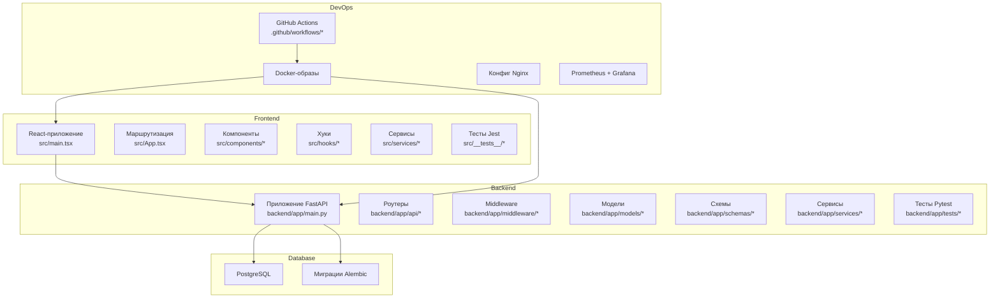
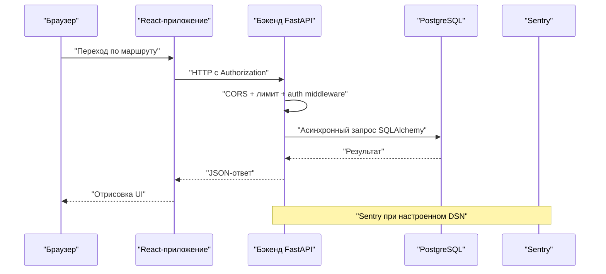
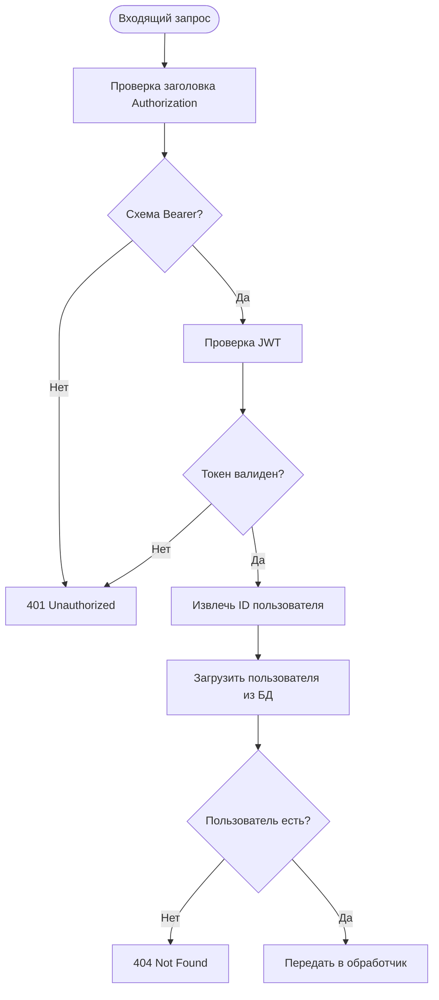
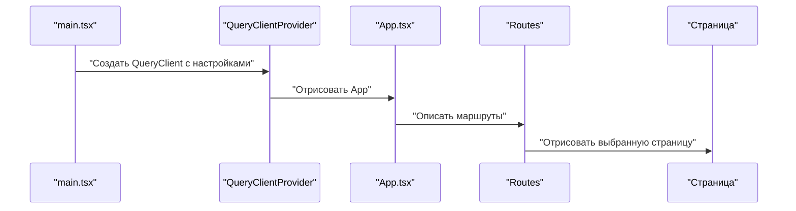
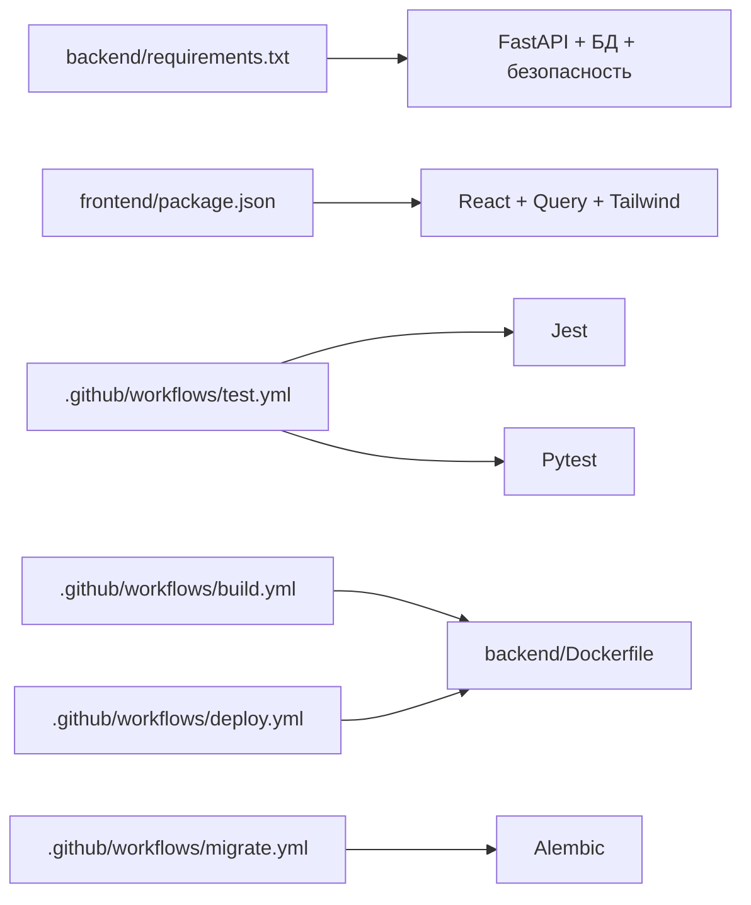

# Руководство по разработке и участию в проекте

<cite>
**Файлы, на которые ссылается документ**
- [README.md](file://README.md)
- [ENVIRONMENT_SETUP.md](file://docs/ENVIRONMENT_SETUP.md)
- [backend/app/main.py](file://backend/app/main.py)
- [backend/app/middleware/auth.py](file://backend/app/middleware/auth.py)
- [backend/app/models/base.py](file://backend/app/models/base.py)
- [backend/requirements.txt](file://backend/requirements.txt)
- [backend/Dockerfile](file://backend/Dockerfile)
- [backend/pytest.ini](file://backend/pytest.ini)
- [frontend/package.json](file://frontend/package.json)
- [frontend/tsconfig.json](file://frontend/tsconfig.json)
- [frontend/jest.config.js](file://frontend/jest.config.js)
- [frontend/tailwind.config.js](file://frontend/tailwind.config.js)
- [frontend/postcss.config.js](file://frontend/postcss.config.js)
- [frontend/src/App.tsx](file://frontend/src/App.tsx)
- [frontend/src/main.tsx](file://frontend/src/main.tsx)
- [.github/workflows/test.yml](file://.github/workflows/test.yml)
- [.github/workflows/build.yml](file://.github/workflows/build.yml)
- [.github/workflows/deploy.yml](file://.github/workflows/deploy.yml)
- [.github/workflows/migrate.yml](file://.github/workflows/migrate.yml)
</cite>

## Содержание
1. [Введение](#introduction)
2. [Структура проекта](#project-structure)
3. [Основные компоненты](#core-components)
4. [Обзор архитектуры](#architecture-overview)
5. [Детальный разбор компонентов](#detailed-component-analysis)
6. [Анализ зависимостей](#dependency-analysis)
7. [Производительность](#performance-considerations)
8. [Устранение неполадок](#troubleshooting-guide)
9. [Настройка среды разработки](#development-environment-setup)
10. [Стандарты кода и соглашения об именовании](#coding-standards-and-naming-conventions)
11. [Форматирование кода и линтинг](#code-formatting-and-linting)
12. [Требования к тестированию](#testing-requirements)
13. [Добавление функций и изменение поведения](#adding-new-features-and-modifying-functionality)
14. [Обратная совместимость](#backward-compatibility-guidelines)
15. [Pull request и код-ревью](#pull-request-process-and-code-review-standards)
16. [Стандарты документации](#documentation-standards)
17. [Сообщения коммитов](#commit-message-conventions)
18. [Выпуск релизов](#release-procedures)
19. [Отладка, профилирование и оптимизация](#debugging-profiling-and-performance-optimization)
20. [Заключение](#conclusion)

## Введение
Этот документ описывает правила разработки для участников FitTracker Pro: стандарты кода, архитектурные паттерны, рабочие процессы, настройку окружения, тестирование, pull request’ы, документацию, релизы и эксплуатацию. Цель — обеспечить единообразие, сопровождаемость и качество изменений во фронтенде (React + TypeScript + Vite), бэкенде (FastAPI), базе данных (PostgreSQL и Alembic) и инструментах DevOps.

## Структура проекта
FitTracker Pro организован как несколько сервисов:
- **frontend**: React + TypeScript + Vite, маршрутизация, состояние и UI-компоненты
- **backend**: приложение FastAPI с роутерами, middleware, моделями, схемами и сервисами
- **database**: PostgreSQL и миграции Alembic
- **monitoring**: стек Prometheus + Grafana
- **nginx**: конфигурация обратного прокси
- **docs**: развёртывание и настройка окружения
- **.github/workflows**: CI/CD — тесты, сборка, миграции, деплой

**Источники диаграммы**
- [backend/app/main.py:1-126](file://backend/app/main.py#L1-L126)
- [frontend/src/main.tsx:1-23](file://frontend/src/main.tsx#L1-L23)
- [frontend/src/App.tsx:1-35](file://frontend/src/App.tsx#L1-L35)
- [.github/workflows/test.yml](file://.github/workflows/test.yml)
- [.github/workflows/build.yml](file://.github/workflows/build.yml)
- [.github/workflows/deploy.yml](file://.github/workflows/deploy.yml)
- [.github/workflows/migrate.yml](file://.github/workflows/migrate.yml)

**Источники раздела**
- [README.md:5-16](file://README.md#L5-L16)

## Основные компоненты
- **Backend (FastAPI)**: инициализация Sentry, CORS и rate limiting, монтирование роутеров под общим префиксом; health и документация API в зависимости от окружения.
- **Frontend (React)**: TanStack Query с разумными значениями по умолчанию, маршруты, общая дизайн-система на Tailwind CSS.
- **База данных**: декларативная база SQLAlchemy и миграции Alembic.
- **CI/CD**: автоматизация тестов, сборки образов, миграций и деплоев.

Ключевые места в коде:
- Инициализация приложения и подключение роутеров: [backend/app/main.py:56-107](file://backend/app/main.py#L56-L107)
- Аутентификация и JWT: [backend/app/middleware/auth.py:21-251](file://backend/app/middleware/auth.py#L21-L251)
- Базовая ORM-модель: [backend/app/models/base.py:1-7](file://backend/app/models/base.py#L1-L7)
- Точка входа фронтенда и Query Client: [frontend/src/main.tsx:7-14](file://frontend/src/main.tsx#L7-L14)
- Маршрутизация: [frontend/src/App.tsx:12-29](file://frontend/src/App.tsx#L12-L29)

**Источники раздела**
- [backend/app/main.py:56-107](file://backend/app/main.py#L56-L107)
- [backend/app/middleware/auth.py:21-251](file://backend/app/middleware/auth.py#L21-L251)
- [backend/app/models/base.py:1-7](file://backend/app/models/base.py#L1-L7)
- [frontend/src/main.tsx:7-14](file://frontend/src/main.tsx#L7-L14)
- [frontend/src/App.tsx:12-29](file://frontend/src/App.tsx#L12-L29)

## Обзор архитектуры
Разделение ответственности:
- **Frontend**: интерфейс, маршруты, состояние, вызовы API
- **Backend**: REST API, аутентификация, лимиты запросов, middleware
- **База данных**: хранение данных и миграции схемы
- **DevOps**: воспроизводимые сборки, мониторинг, деплой

**Источники диаграммы**
- [backend/app/main.py:77-87](file://backend/app/main.py#L77-L87)
- [backend/app/middleware/auth.py:111-131](file://backend/app/middleware/auth.py#L111-L131)
- [backend/app/main.py:32-43](file://backend/app/main.py#L32-L43)

**Источники раздела**
- [backend/app/main.py:77-87](file://backend/app/main.py#L77-L87)
- [backend/app/middleware/auth.py:111-131](file://backend/app/middleware/auth.py#L111-L131)

## Детальный разбор компонентов

### Middleware аутентификации (backend)
Слой аутентификации отвечает за выпуск и проверку JWT, внедрение зависимостей для текущего пользователя, обязательную схему Bearer и типы access/refresh.

**Источники диаграммы**
- [backend/app/middleware/auth.py:117-172](file://backend/app/middleware/auth.py#L117-L172)
- [backend/app/middleware/auth.py:174-203](file://backend/app/middleware/auth.py#L174-L203)

**Источники раздела**
- [backend/app/middleware/auth.py:21-251](file://backend/app/middleware/auth.py#L21-L251)

### Состояние и загрузка данных (frontend)
TanStack Query инициализируется с политикой устаревания и повторов по умолчанию; приложение оборачивается в провайдер. Маршруты сосредоточены в одном компоненте.

**Источники диаграммы**
- [frontend/src/main.tsx:7-14](file://frontend/src/main.tsx#L7-L14)
- [frontend/src/App.tsx:12-29](file://frontend/src/App.tsx#L12-L29)

**Источники раздела**
- [frontend/src/main.tsx:7-14](file://frontend/src/main.tsx#L7-L14)
- [frontend/src/App.tsx:12-29](file://frontend/src/App.tsx#L12-L29)

### Базовая модель БД
Декларативная база SQLAlchemy — основа всех ORM-моделей.

**Источники раздела**
- [backend/app/models/base.py:1-7](file://backend/app/models/base.py#L1-L7)

## Анализ зависимостей
- **Backend**: `requirements.txt` — FastAPI, SQLAlchemy, Alembic, Pydantic, безопасность, Celery/Redis, тесты и логирование.
- **Frontend**: React, TanStack Query, Tailwind, тестовые фреймворки.
- **CI/CD**: workflow’ы связывают тесты, сборку, миграции и деплой.

**Источники диаграммы**
- [backend/requirements.txt:1-42](file://backend/requirements.txt#L1-L42)
- [frontend/package.json:1-60](file://frontend/package.json#L1-L60)
- [.github/workflows/test.yml](file://.github/workflows/test.yml)
- [.github/workflows/build.yml](file://.github/workflows/build.yml)
- [.github/workflows/deploy.yml](file://.github/workflows/deploy.yml)
- [.github/workflows/migrate.yml](file://.github/workflows/migrate.yml)
- [backend/Dockerfile:1-48](file://backend/Dockerfile#L1-L48)

**Источники раздела**
- [backend/requirements.txt:1-42](file://backend/requirements.txt#L1-L42)
- [frontend/package.json:1-60](file://frontend/package.json#L1-L60)

## Производительность
- **Backend**
  - Асинхронные сессии SQLAlchemy, чтобы не блокировать I/O.
  - Настройка выборки (sampling) Sentry под окружение.
  - Rate limiting для защиты эндпоинтов.
  - В продакшене — Gunicorn с воркерами Uvicorn.
- **Frontend**
  - Кэш и `staleTime` в TanStack Query, меньше лишних запросов.
  - Эффективный рендер компонентов, без лишних перерисовок.
  - Умеренное использование утилит Tailwind для размера бандла.
- **База данных**
  - Индексы под частые фильтры и соединения.
  - Эволюция схемы через миграции Alembic.

*Для этого раздела отдельные ссылки на файлы не требуются — общие рекомендации.*

## Устранение неполадок
Типичные проблемы:
- **Нет подключения к БД**: проверить учётные данные, доступность сервиса и существование базы.
- **Ошибки загрузки Telegram WebApp**: HTTPS, корректный `WEBAPP_URL`, настройки CORS.
- **CORS**: правильно задать `ALLOWED_ORIGINS` (протоколы, несколько origin через запятую).
- **Sentry не ловит ошибки**: DSN и переменные окружения.

**Источники раздела**
- [docs/ENVIRONMENT_SETUP.md:122-141](file://docs/ENVIRONMENT_SETUP.md#L122-L141)

## Настройка среды разработки
Следуйте руководству по окружению: переменные бэкенда и фронтенда, секреты, базы и боты.

Кратко:
- Скопировать примеры `.env`, сгенерировать надёжный `SECRET_KEY`.
- PostgreSQL локально или управляемый сервис в продакшене.
- Настроить Telegram-бота и URL мини-приложения.
- Локально — Docker Compose и применение миграций Alembic.

**Источники раздела**
- [docs/ENVIRONMENT_SETUP.md:7-23](file://docs/ENVIRONMENT_SETUP.md#L7-L23)
- [docs/ENVIRONMENT_SETUP.md:36-52](file://docs/ENVIRONMENT_SETUP.md#L36-L52)
- [docs/ENVIRONMENT_SETUP.md:53-63](file://docs/ENVIRONMENT_SETUP.md#L53-L63)
- [README.md:47-64](file://README.md#L47-L64)

## Стандарты кода и соглашения об именовании
- **Backend**
  - Модули: `api`, `middleware`, `models`, `schemas`, `services`, `tests`, `utils`.
  - Роутеры: множественное число (`users`, `workouts`).
  - Модели: PascalCase (`User`, `WorkoutLog`).
  - Pydantic-схемы: PascalCase и суффикс «Schema» (`UserCreateSchema`).
  - Функции: `snake_case`; константы: `UPPER_CASE`.
- **Frontend**
  - Компоненты: PascalCase; хуки: `useXxx`.
  - Расширения: `.tsx` для компонентов, `.ts` для хуков/сервисов/утилит.
  - Алиасы путей: `@/*`, `@components/*`, `@pages/*`, `@hooks/*`, `@stores/*`, `@services/*`, `@types/*`, `@utils/*`, `@styles/*`.
- **База данных**
  - Таблицы: существительные во множественном числе; колонки: `snake_case`; внешние ключи: `{дочерняя_сущность}_id`.

**Источники раздела**
- [frontend/tsconfig.json:23-51](file://frontend/tsconfig.json#L23-L51)
- [backend/app/models/base.py:1-7](file://backend/app/models/base.py#L1-L7)

## Форматирование кода и линтинг
- **Backend**
  - Настройки pytest: пороги покрытия и ветвей.
  - Асинхронные тесты и корректные фикстуры.
- **Frontend**
  - ESLint с парсером TypeScript и плагином React.
  - Jest с ts-jest и DOM-окружением.
  - Tailwind и PostCSS в цепочке стилей.

**Источники раздела**
- [backend/pytest.ini:11-16](file://backend/pytest.ini#L11-L16)
- [frontend/package.json:9-9](file://frontend/package.json#L9-L9)
- [frontend/jest.config.js:1-44](file://frontend/jest.config.js#L1-L44)
- [frontend/tailwind.config.js:1-349](file://frontend/tailwind.config.js#L1-L349)
- [frontend/postcss.config.js:1-7](file://frontend/postcss.config.js#L1-L7)

## Требования к тестированию
- **Покрытие (backend)**: порог задан в `pytest.ini` (`--cov-fail-under`, сейчас 51%); учитываются ветки (`--cov-branch`). Для фронтенда — см. `jest.config.js`.
- **Категории**: unit, integration, auth, slow.
- **Frontend**: Jest, DOM, пороги покрытия.
- **Backend**: Pytest в режиме asyncio, отчёты покрытия.

**Источники раздела**
- [backend/pytest.ini:17-22](file://backend/pytest.ini#L17-L22)
- [backend/pytest.ini:30-36](file://backend/pytest.ini#L30-L36)
- [frontend/jest.config.js:30-37](file://frontend/jest.config.js#L30-L37)

## Добавление функций и изменение поведения
- **Backend**
  - Новый роутер в `app/api`, подключение в `main.py`.
  - Схемы Pydantic в `app/schemas`.
  - Модели в `app/models` и миграции.
  - Тесты в `app/tests`.
- **Frontend**
  - Страницы и компоненты в `src/pages` и `src/components`.
  - Данные через TanStack Query.
  - Маршруты в `src/App.tsx`.
  - Юнит-тесты в `src/__tests__`.
- **База данных**
  - После изменения схемы — сгенерировать и применить миграции Alembic.

**Источники раздела**
- [backend/app/main.py:89-107](file://backend/app/main.py#L89-L107)
- [frontend/src/App.tsx:12-29](file://frontend/src/App.tsx#L12-L29)

## Обратная совместимость
- **Версии API**: базовый путь `/api/v1`; ломающие изменения — новая версия API.
- **Устаревание**: помечать устаревшие эндпоинты и обновлять документацию.
- **Схема БД**: менять через Alembic без потери данных где возможно.
- **Frontend**: не удалять публичные API компонентов/функций без предупреждения об устаревании.

**Источники раздела**
- [backend/app/main.py:56-75](file://backend/app/main.py#L56-L75)

## Pull request и код-ревью
- **Ветки**: `feature/краткое-описание`, `fix/номер-issue`.
- **Чек-лист PR**:
  - Тесты проходят, покрытие не ниже порогов.
  - Линтинг фронтенда и бэкенда без ошибок.
  - Нет отладочных `console.log` и флагов в продакшен-коде.
  - Изменения отражены в документации или комментариях.
  - Проверка безопасности: аутентификация и секреты.
- **Ревью**:
  - Ясная формулировка задачи и решения.
  - Тесты на новую логику.
  - Оценка влияния на производительность.
  - Доступность (a11y) и интернационализация при необходимости.

*Отдельные ссылки на файлы не требуются — общие правила.*

## Стандарты документации
- Комментарии в коде: объяснять **зачем**, а не **что**.
- README: новые возможности, эндпоинты, переменные окружения.
- API: OpenAPI от FastAPI — актуальные примеры.
- Архитектурные решения: заметки в `docs/` в духе ADR.

**Источники раздела**
- [README.md:130-177](file://README.md#L130-L177)

## Сообщения коммитов
- Префиксы: `feat:`, `fix:`, `chore:`, `docs:`, `refactor:`, `perf:`, `test:`, `build:`, `ci:`, `revert:`.
- Тема: кратко, повелительное наклонение, до ~50 символов.
- Тело: мотивация и суть изменений; ссылки на issue.

*Отдельные ссылки на файлы не требуются.*

## Выпуск релизов
- **CI/CD**
  - `test.yml`: тесты и покрытие.
  - `build.yml`: сборка Docker-образов.
  - `migrate.yml`: миграции Alembic.
  - `deploy.yml`: продакшен через `docker-compose.prod.yml`.
- **Перед релизом**
  - Проверить переменные окружения и секреты.
  - Убедиться, что миграции применены.
  - Проверить документацию API и health-эндпоинты.
- **После релиза**
  - Мониторинг ошибок в Sentry.
  - Дашборды Prometheus/Grafana.

**Источники раздела**
- [.github/workflows/test.yml](file://.github/workflows/test.yml)
- [.github/workflows/build.yml](file://.github/workflows/build.yml)
- [.github/workflows/migrate.yml](file://.github/workflows/migrate.yml)
- [.github/workflows/deploy.yml](file://.github/workflows/deploy.yml)
- [README.md:178-202](file://README.md#L178-L202)

## Отладка, профилирование и оптимизация
- **Backend**
  - `DEBUG` в разработке; отключить в продакшене.
  - Sentry для ошибок и профилирования.
  - Rate limiting против злоупотреблений.
  - Оптимизация запросов и индексов.
- **Frontend**
  - React DevTools и React Query Devtools.
  - Размер бандла (анализатор сборки Vite).
  - Тяжёлые вычисления вне горячего пути рендера.
- **Мониторинг**
  - Метрики Prometheus и дашборды Grafana.

**Источники раздела**
- [backend/app/main.py:28-43](file://backend/app/main.py#L28-L43)
- [backend/Dockerfile:43-47](file://backend/Dockerfile#L43-L47)
- [docs/ENVIRONMENT_SETUP.md:112-121](file://docs/ENVIRONMENT_SETUP.md#L112-L121)

## Заключение
Эти правила помогают выстроить единый процесс разработки, поддерживать качество кода и стабильную эксплуатацию. Участникам стоит придерживаться принятых паттернов, сохранять обратную совместимость и следовать описанным шагам для окружения, тестов, ревью и релизов.

*Итог без привязки к конкретным файлам — отдельные источники не указаны.*
