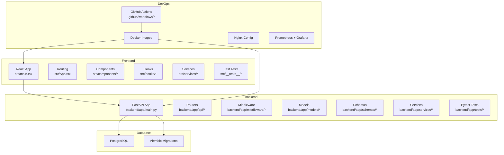
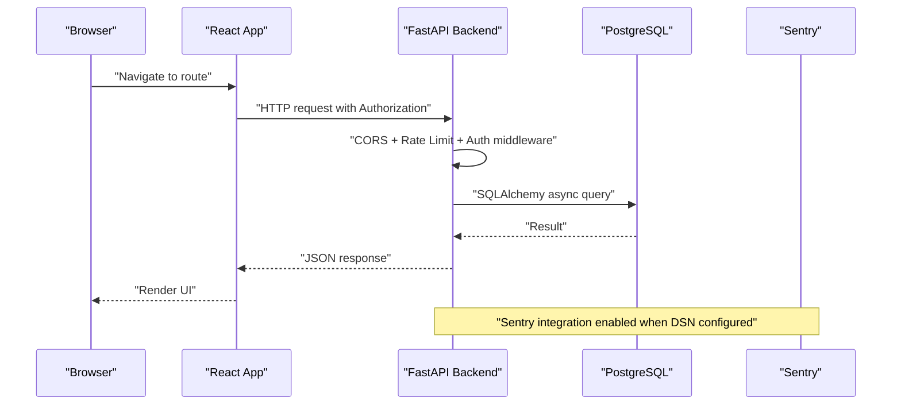
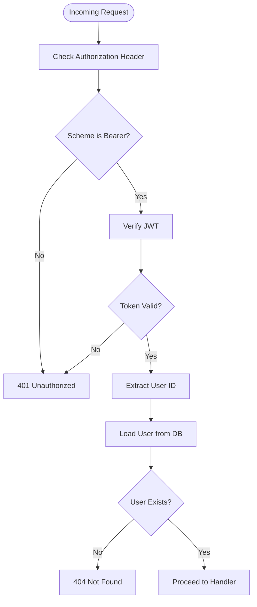
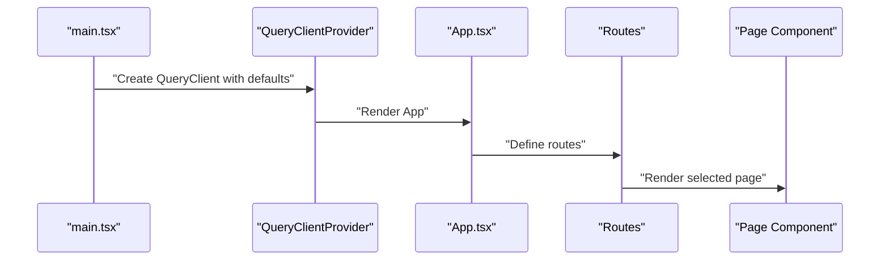
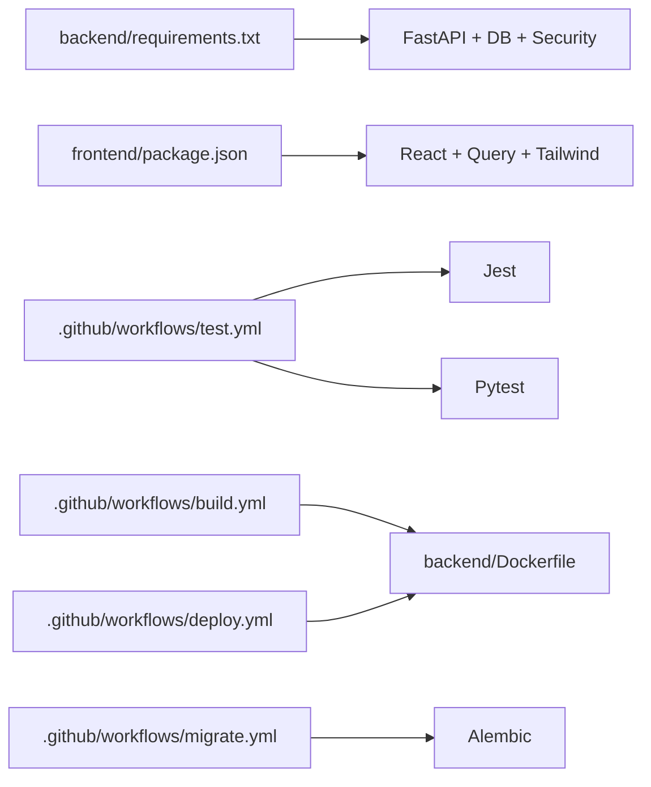

# Development Guidelines & Contributing

<cite>
**Referenced Files in This Document**
- [README.md](file://README.md)
- [ENVIRONMENT_SETUP.md](file://docs/ENVIRONMENT_SETUP.md)
- [backend/app/main.py](file://backend/app/main.py)
- [backend/app/middleware/auth.py](file://backend/app/middleware/auth.py)
- [backend/app/models/base.py](file://backend/app/models/base.py)
- [backend/requirements.txt](file://backend/requirements.txt)
- [backend/Dockerfile](file://backend/Dockerfile)
- [backend/pytest.ini](file://backend/pytest.ini)
- [frontend/package.json](file://frontend/package.json)
- [frontend/tsconfig.json](file://frontend/tsconfig.json)
- [frontend/jest.config.js](file://frontend/jest.config.js)
- [frontend/tailwind.config.js](file://frontend/tailwind.config.js)
- [frontend/postcss.config.js](file://frontend/postcss.config.js)
- [frontend/src/App.tsx](file://frontend/src/App.tsx)
- [frontend/src/main.tsx](file://frontend/src/main.tsx)
- [.github/workflows/test.yml](file://.github/workflows/test.yml)
- [.github/workflows/build.yml](file://.github/workflows/build.yml)
- [.github/workflows/deploy.yml](file://.github/workflows/deploy.yml)
- [.github/workflows/migrate.yml](file://.github/workflows/migrate.yml)
</cite>

## Table of Contents
1. [Introduction](#introduction)
2. [Project Structure](#project-structure)
3. [Core Components](#core-components)
4. [Architecture Overview](#architecture-overview)
5. [Detailed Component Analysis](#detailed-component-analysis)
6. [Dependency Analysis](#dependency-analysis)
7. [Performance Considerations](#performance-considerations)
8. [Troubleshooting Guide](#troubleshooting-guide)
9. [Development Environment Setup](#development-environment-setup)
10. [Coding Standards and Naming Conventions](#coding-standards-and-naming-conventions)
11. [Code Formatting and Linting](#code-formatting-and-linting)
12. [Testing Requirements](#testing-requirements)
13. [Adding New Features and Modifying Functionality](#adding-new-features-and-modifying-functionality)
14. [Backward Compatibility Guidelines](#backward-compatibility-guidelines)
15. [Pull Request Process and Code Review Standards](#pull-request-process-and-code-review-standards)
16. [Documentation Standards](#documentation-standards)
17. [Commit Message Conventions](#commit-message-conventions)
18. [Release Procedures](#release-procedures)
19. [Debugging, Profiling, and Performance Optimization](#debugging-profiling-and-performance-optimization)
20. [Conclusion](#conclusion)

## Introduction
This document provides comprehensive development guidelines for contributors to FitTracker Pro. It covers coding standards, architectural patterns, development workflows, environment setup, testing, pull requests, documentation, releases, and operational practices. The goal is to ensure consistent, maintainable, and high-quality contributions across the frontend (React + TypeScript + Vite), backend (FastAPI), database (PostgreSQL with Alembic), and DevOps tooling.

## Project Structure
FitTracker Pro follows a multi-service layout:
- frontend: React + TypeScript + Vite with routing, state management, and UI components
- backend: FastAPI application with modular routers, middleware, models, schemas, and services
- database: PostgreSQL with Alembic migrations
- monitoring: Prometheus + Grafana stack
- nginx: Reverse proxy configuration
- docs: Deployment and environment setup guides
- .github/workflows: CI/CD pipelines for testing, building, migration, and deployment

**Diagram sources**
- [backend/app/main.py:1-126](file://backend/app/main.py#L1-L126)
- [frontend/src/main.tsx:1-23](file://frontend/src/main.tsx#L1-L23)
- [frontend/src/App.tsx:1-35](file://frontend/src/App.tsx#L1-L35)
- [.github/workflows/test.yml](file://.github/workflows/test.yml)
- [.github/workflows/build.yml](file://.github/workflows/build.yml)
- [.github/workflows/deploy.yml](file://.github/workflows/deploy.yml)
- [.github/workflows/migrate.yml](file://.github/workflows/migrate.yml)

**Section sources**
- [README.md:5-16](file://README.md#L5-L16)

## Core Components
- Backend FastAPI application initializes Sentry, configures CORS and rate-limiting middleware, and mounts routers under a common prefix. It exposes health and API docs conditionally based on environment.
- Frontend React application sets up TanStack Query with sensible defaults, routes, and a shared design system via Tailwind CSS.
- Database layer uses SQLAlchemy declarative base with Alembic for migrations.
- CI/CD pipelines automate testing, image builds, migrations, and deployments.

Key implementation references:
- Backend app initialization and router mounting: [backend/app/main.py:56-107](file://backend/app/main.py#L56-L107)
- Authentication middleware and JWT utilities: [backend/app/middleware/auth.py:21-251](file://backend/app/middleware/auth.py#L21-L251)
- Base ORM model: [backend/app/models/base.py:1-7](file://backend/app/models/base.py#L1-L7)
- Frontend entry and query client setup: [frontend/src/main.tsx:7-14](file://frontend/src/main.tsx#L7-L14)
- Frontend routing: [frontend/src/App.tsx:12-29](file://frontend/src/App.tsx#L12-L29)

**Section sources**
- [backend/app/main.py:56-107](file://backend/app/main.py#L56-L107)
- [backend/app/middleware/auth.py:21-251](file://backend/app/middleware/auth.py#L21-L251)
- [backend/app/models/base.py:1-7](file://backend/app/models/base.py#L1-L7)
- [frontend/src/main.tsx:7-14](file://frontend/src/main.tsx#L7-L14)
- [frontend/src/App.tsx:12-29](file://frontend/src/App.tsx#L12-L29)

## Architecture Overview
FitTracker Pro uses a clean separation of concerns:
- Frontend handles UI, routing, state, and API integration
- Backend provides RESTful APIs with authentication, rate limiting, and middleware
- Database persists structured data with migrations
- DevOps ensures reproducible builds, monitoring, and deployments

**Diagram sources**
- [backend/app/main.py:77-87](file://backend/app/main.py#L77-L87)
- [backend/app/middleware/auth.py:111-131](file://backend/app/middleware/auth.py#L111-L131)
- [backend/app/main.py:32-43](file://backend/app/main.py#L32-L43)

**Section sources**
- [backend/app/main.py:77-87](file://backend/app/main.py#L77-L87)
- [backend/app/middleware/auth.py:111-131](file://backend/app/middleware/auth.py#L111-L131)

## Detailed Component Analysis

### Backend Authentication Middleware
The authentication layer manages JWT creation, verification, and dependency injection for current user retrieval. It enforces bearer token usage and supports access/refresh token types.

**Diagram sources**
- [backend/app/middleware/auth.py:117-172](file://backend/app/middleware/auth.py#L117-L172)
- [backend/app/middleware/auth.py:174-203](file://backend/app/middleware/auth.py#L174-L203)

**Section sources**
- [backend/app/middleware/auth.py:21-251](file://backend/app/middleware/auth.py#L21-L251)

### Frontend State and Data Fetching
The frontend initializes TanStack Query with a default stale/retry policy and wraps the app in a provider. Routing is centralized in a single component.

**Diagram sources**
- [frontend/src/main.tsx:7-14](file://frontend/src/main.tsx#L7-L14)
- [frontend/src/App.tsx:12-29](file://frontend/src/App.tsx#L12-L29)

**Section sources**
- [frontend/src/main.tsx:7-14](file://frontend/src/main.tsx#L7-L14)
- [frontend/src/App.tsx:12-29](file://frontend/src/App.tsx#L12-L29)

### Database Model Base
The SQLAlchemy declarative base is the foundation for all ORM models.

**Section sources**
- [backend/app/models/base.py:1-7](file://backend/app/models/base.py#L1-L7)

## Dependency Analysis
- Backend dependencies are declared in requirements.txt and include FastAPI, SQLAlchemy, Alembic, Pydantic, security libraries, Redis, and testing/logging packages.
- Frontend dependencies include React, TanStack Query, Tailwind, and testing frameworks.
- CI/CD workflows orchestrate tests, builds, migrations, and deployments.

**Diagram sources**
- [backend/requirements.txt:1-42](file://backend/requirements.txt#L1-L42)
- [frontend/package.json:1-60](file://frontend/package.json#L1-L60)
- [.github/workflows/test.yml](file://.github/workflows/test.yml)
- [.github/workflows/build.yml](file://.github/workflows/build.yml)
- [.github/workflows/deploy.yml](file://.github/workflows/deploy.yml)
- [.github/workflows/migrate.yml](file://.github/workflows/migrate.yml)
- [backend/Dockerfile:1-48](file://backend/Dockerfile#L1-L48)

**Section sources**
- [backend/requirements.txt:1-42](file://backend/requirements.txt#L1-L42)
- [frontend/package.json:1-60](file://frontend/package.json#L1-L60)

## Performance Considerations
- Backend
  - Use async SQLAlchemy sessions to avoid blocking I/O.
  - Enable Sentry sampling rates appropriate to environment.
  - Apply rate limiting middleware to protect endpoints.
  - Use Gunicorn with Uvicorn workers for production concurrency.
- Frontend
  - Leverage TanStack Query caching and staleTime to minimize redundant network calls.
  - Keep component rendering efficient; avoid unnecessary re-renders.
  - Use Tailwind utilities sparingly to reduce bundle size.
- Database
  - Define proper indexes for frequent filters and joins.
  - Use Alembic migrations to evolve schema safely.

[No sources needed since this section provides general guidance]

## Troubleshooting Guide
Common issues and resolutions:
- Database connection failures: verify credentials, service availability, and database existence.
- Telegram WebApp loading errors: ensure HTTPS and correct WEBAPP_URL; check CORS settings.
- CORS errors: configure ALLOWED_ORIGINS correctly with protocols and multiple origins separated by commas.
- Sentry not capturing errors: confirm DSN configuration and environment settings.

**Section sources**
- [docs/ENVIRONMENT_SETUP.md:122-141](file://docs/ENVIRONMENT_SETUP.md#L122-L141)

## Development Environment Setup
Follow the environment setup guide to configure backend and frontend variables, generate secrets, and prepare databases and bots.

Quick steps:
- Copy example environment files and generate a secure SECRET_KEY.
- Configure PostgreSQL locally or use managed service for production.
- Set up Telegram Bot and Mini App URL.
- Use Docker Compose for local development and apply Alembic migrations.

**Section sources**
- [docs/ENVIRONMENT_SETUP.md:7-23](file://docs/ENVIRONMENT_SETUP.md#L7-L23)
- [docs/ENVIRONMENT_SETUP.md:36-52](file://docs/ENVIRONMENT_SETUP.md#L36-L52)
- [docs/ENVIRONMENT_SETUP.md:53-63](file://docs/ENVIRONMENT_SETUP.md#L53-L63)
- [README.md:47-64](file://README.md#L47-L64)

## Coding Standards and Naming Conventions
- Backend
  - Module organization: api, middleware, models, schemas, services, tests, utils.
  - Router naming: plural nouns (e.g., users, workouts).
  - Model naming: PascalCase (e.g., User, WorkoutLog).
  - Schema naming: PascalCase suffixed with “Schema” (e.g., UserCreateSchema).
  - Function naming: snake_case; constants: UPPER_CASE.
- Frontend
  - Component naming: PascalCase; hook naming: useXxx.
  - File extensions: .tsx for components, .ts for hooks/services/utils.
  - Path aliases: @/*, @components/*, @pages/*, @hooks/*, @stores/*, @services/*, @types/*, @utils/*, @styles/*.
- Database
  - Table names: plural nouns; column names: snake_case; foreign keys: {child}_id.

**Section sources**
- [frontend/tsconfig.json:23-51](file://frontend/tsconfig.json#L23-L51)
- [backend/app/models/base.py:1-7](file://backend/app/models/base.py#L1-L7)

## Code Formatting and Linting
- Backend
  - Use pytest configuration for coverage thresholds and branch coverage.
  - Keep async tests and proper fixtures.
- Frontend
  - ESLint configured with TypeScript parser and React plugin.
  - Jest configured with ts-jest and DOM environment.
  - Tailwind and PostCSS configured for styling pipeline.

**Section sources**
- [backend/pytest.ini:11-16](file://backend/pytest.ini#L11-L16)
- [frontend/package.json:9-9](file://frontend/package.json#L9-L9)
- [frontend/jest.config.js:1-44](file://frontend/jest.config.js#L1-L44)
- [frontend/tailwind.config.js:1-349](file://frontend/tailwind.config.js#L1-L349)
- [frontend/postcss.config.js:1-7](file://frontend/postcss.config.js#L1-L7)

## Testing Requirements
- Coverage targets: minimum 80% across branches, functions, lines, and statements.
- Test categories: unit, integration, auth, slow.
- Frontend: Jest with DOM environment and coverage thresholds.
- Backend: Pytest with asyncio mode and coverage reports.

**Section sources**
- [backend/pytest.ini:17-22](file://backend/pytest.ini#L17-L22)
- [backend/pytest.ini:30-36](file://backend/pytest.ini#L30-L36)
- [frontend/jest.config.js:30-37](file://frontend/jest.config.js#L30-L37)

## Adding New Features and Modifying Functionality
- Backend
  - Create a new router under app/api and mount it in main.py.
  - Add Pydantic schemas under app/schemas.
  - Implement models under app/models and ensure migrations.
  - Write tests under app/tests.
- Frontend
  - Add pages/components under src/pages and src/components.
  - Integrate with TanStack Query for data fetching.
  - Add routes in src/App.tsx.
  - Write unit tests under src/__tests__.
- Database
  - Use Alembic to generate and apply migrations after schema changes.

**Section sources**
- [backend/app/main.py:89-107](file://backend/app/main.py#L89-L107)
- [frontend/src/App.tsx:12-29](file://frontend/src/App.tsx#L12-L29)

## Backward Compatibility Guidelines
- API versioning: keep base path under /api/v1 and introduce new versions for breaking changes.
- Deprecation: mark deprecated endpoints with appropriate status and documentation updates.
- Schema evolution: use Alembic migrations to alter tables without dropping data.
- Frontend: avoid removing exported components/functions without deprecation notices.

**Section sources**
- [backend/app/main.py:56-75](file://backend/app/main.py#L56-L75)

## Pull Request Process and Code Review Standards
- Branch naming: feature/short-description, fix/issue-number.
- PR checklist:
  - All tests pass and coverage meets thresholds.
  - Linting passes for both frontend and backend.
  - No console logs or debug flags in production code.
  - Changes documented in docs or inline comments.
  - Security review for authentication and environment variables.
- Review standards:
  - Clear problem statement and solution.
  - Test coverage for new logic.
  - Performance impact assessment.
  - Accessibility and internationalization considerations.

[No sources needed since this section provides general guidance]

## Documentation Standards
- Inline code comments: explain “why,” not “what.”
- README updates: reflect new features, endpoints, and environment changes.
- API documentation: OpenAPI docs exposed by FastAPI; keep examples accurate.
- Architecture decisions: document in docs/ as ADR-style notes.

**Section sources**
- [README.md:130-177](file://README.md#L130-L177)

## Commit Message Conventions
- Type prefixes: feat:, fix:, chore:, docs:, refactor:, perf:, test:, build:, ci:, revert:
- Subject line: concise, imperative, under 50 characters.
- Body: explain motivation and changes; reference issues.

[No sources needed since this section provides general guidance]

## Release Procedures
- CI/CD
  - test.yml: runs tests and coverage checks.
  - build.yml: builds Docker images.
  - migrate.yml: applies Alembic migrations.
  - deploy.yml: deploys to production using docker-compose.prod.yml.
- Pre-release
  - Verify environment variables and secrets.
  - Confirm migrations applied.
  - Validate API docs and health endpoints.
- Post-release
  - Monitor Sentry for errors.
  - Review Prometheus/Grafana dashboards.

**Section sources**
- [.github/workflows/test.yml](file://.github/workflows/test.yml)
- [.github/workflows/build.yml](file://.github/workflows/build.yml)
- [.github/workflows/migrate.yml](file://.github/workflows/migrate.yml)
- [.github/workflows/deploy.yml](file://.github/workflows/deploy.yml)
- [README.md:178-202](file://README.md#L178-L202)

## Debugging, Profiling, and Performance Optimization
- Backend
  - Enable DEBUG for development; disable in production.
  - Use Sentry for error tracking and performance profiling.
  - Apply rate limiting middleware to prevent abuse.
  - Optimize database queries and add indexes as needed.
- Frontend
  - Use React DevTools and React Query Devtools.
  - Measure bundle size with Vite build analyzer.
  - Minimize heavy computations in render paths.
- Monitoring
  - Prometheus metrics and Grafana dashboards for runtime insights.

**Section sources**
- [backend/app/main.py:28-43](file://backend/app/main.py#L28-L43)
- [backend/Dockerfile:43-47](file://backend/Dockerfile#L43-L47)
- [docs/ENVIRONMENT_SETUP.md:112-121](file://docs/ENVIRONMENT_SETUP.md#L112-L121)

## Conclusion
These guidelines aim to streamline development, ensure code quality, and support reliable operations. Contributors should align with the established patterns, maintain backward compatibility, and follow the documented workflows for environment setup, testing, reviews, and releases.

[No sources needed since this section summarizes without analyzing specific files]