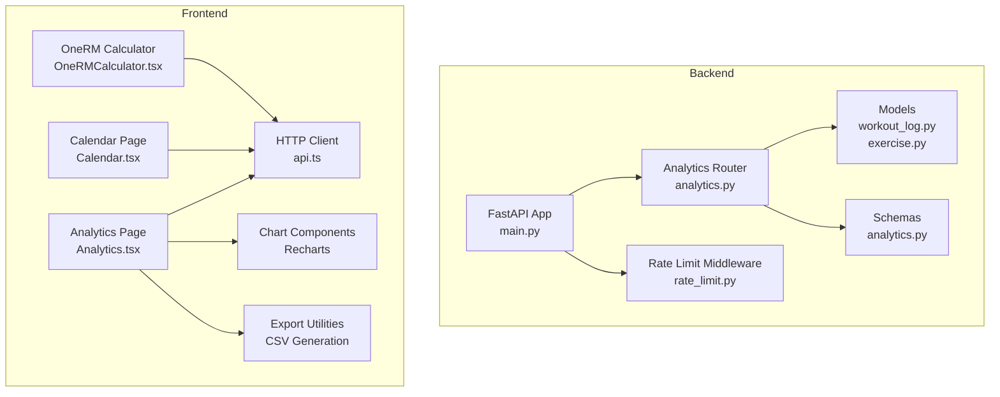
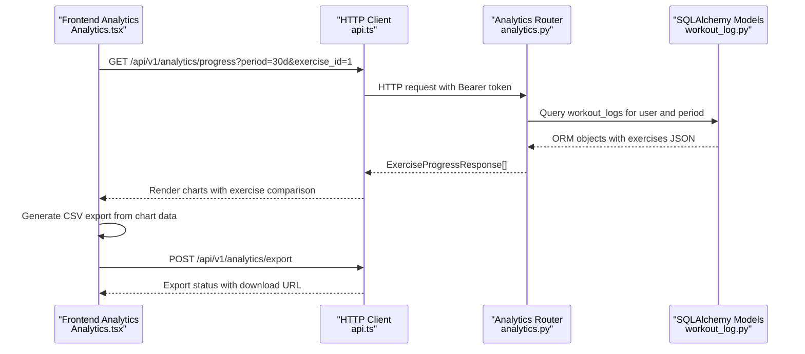
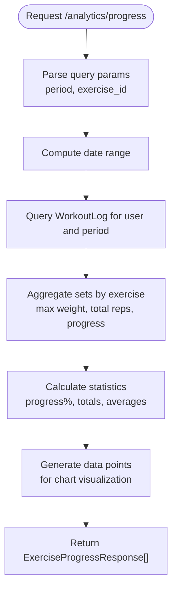
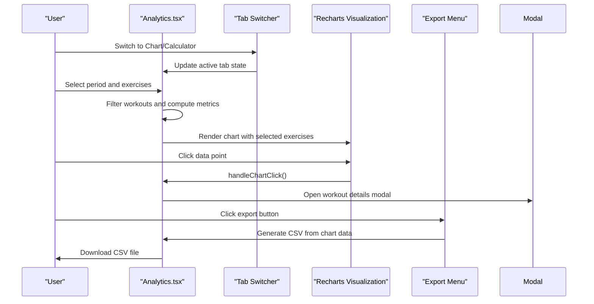
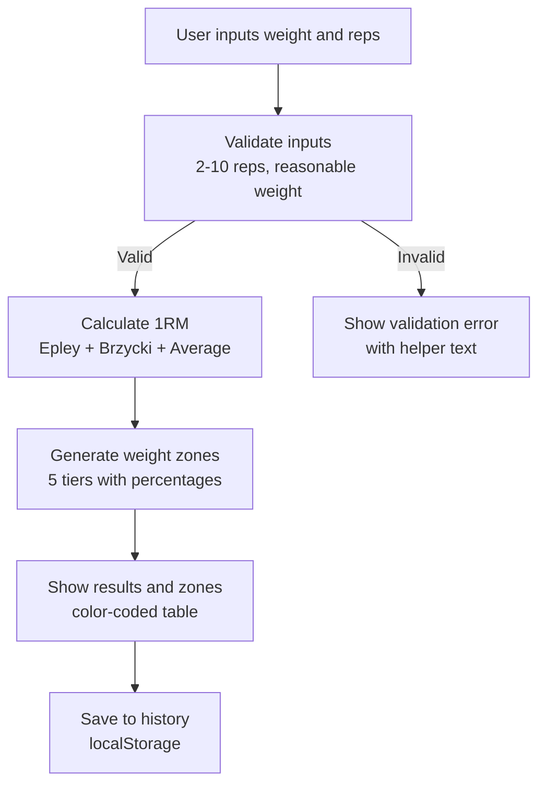
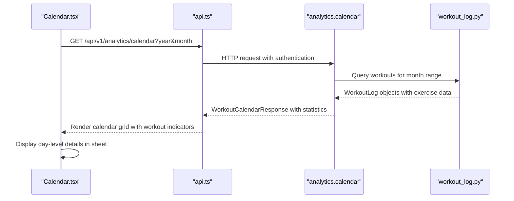
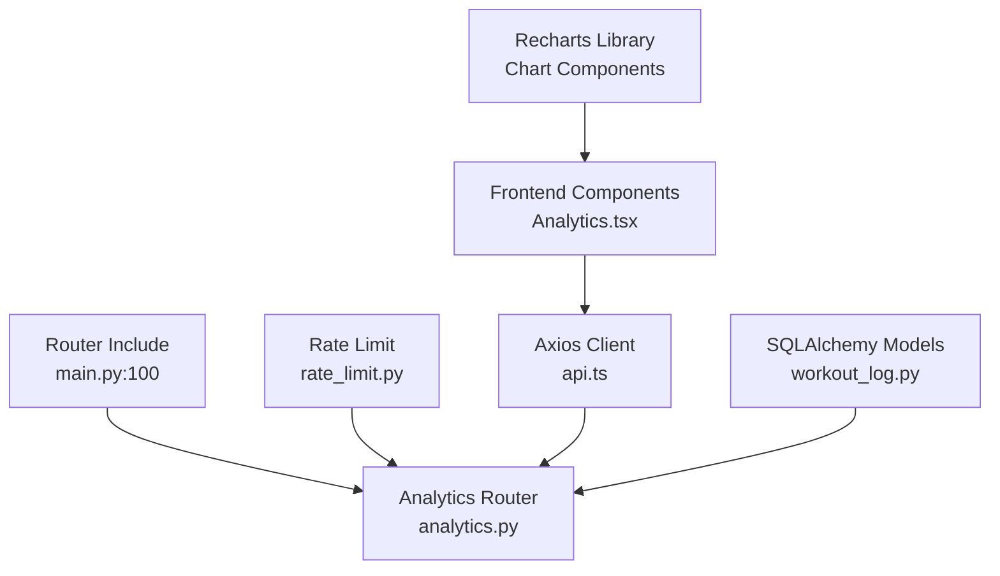

# Analytics & Insights Dashboard

<cite>
**Referenced Files in This Document**
- [analytics.py](file://backend/app/api/analytics.py)
- [analytics.py](file://backend/app/schemas/analytics.py)
- [workout_log.py](file://backend/app/models/workout_log.py)
- [exercise.py](file://backend/app/models/exercise.py)
- [main.py](file://backend/app/main.py)
- [rate_limit.py](file://backend/app/middleware/rate_limit.py)
- [Analytics.tsx](file://frontend/src/pages/Analytics.tsx)
- [Calendar.tsx](file://frontend/src/pages/Calendar.tsx)
- [OneRMCalculator.tsx](file://frontend/src/components/analytics/OneRMCalculator.tsx)
- [api.ts](file://frontend/src/services/api.ts)
- [requirements.txt](file://backend/requirements.txt)
</cite>

## Update Summary
**Changes Made**
- Enhanced Analytics page with comprehensive workout tracking visualization
- Added interactive charts with exercise comparison capabilities
- Implemented detailed CSV export functionality
- Expanded OneRM calculator with advanced features
- Added comprehensive performance metrics calculation
- Integrated tabbed interface for chart and calculator views
- Enhanced exercise selection with search and filtering

## Table of Contents
1. [Introduction](#introduction)
2. [Project Structure](#project-structure)
3. [Core Components](#core-components)
4. [Architecture Overview](#architecture-overview)
5. [Detailed Component Analysis](#detailed-component-analysis)
6. [Dependency Analysis](#dependency-analysis)
7. [Performance Considerations](#performance-considerations)
8. [Troubleshooting Guide](#troubleshooting-guide)
9. [Conclusion](#conclusion)

## Introduction
This document describes the analytics and insights dashboard implementation for the FitTracker Pro application. The analytics system has been significantly expanded to provide comprehensive workout tracking visualization, interactive charts, exercise comparison capabilities, CSV export functionality, and detailed performance metrics calculation. The system features both backend analytics API endpoints for workout statistics, progress tracking, calendar integration, and data export, alongside a sophisticated frontend analytics interface with charts, graphs, interactive dashboards, and specialized calculators.

## Project Structure
The analytics implementation spans backend FastAPI routes and SQLAlchemy models, and frontend React components with charting libraries. The system now includes advanced visualization capabilities, comprehensive export functionality, and specialized performance analysis tools.

Key areas:
- Backend analytics router exposes endpoints for progress, calendar, summary, and export with enhanced data processing
- Frontend Analytics page features tabbed interface with chart visualization and OneRM calculator
- Comprehensive exercise selection with search, filtering, and multi-exercise comparison
- Advanced CSV export functionality with chart data export
- Detailed performance metrics calculation and visualization
- Calendar page integrates backend calendar data with workout status display

**Diagram sources**
- [main.py:100](file://backend/app/main.py#L100)
- [analytics.py:27](file://backend/app/api/analytics.py#L27)
- [workout_log.py:49](file://backend/app/models/workout_log.py#L49)
- [exercise.py:24](file://backend/app/models/exercise.py#L24)
- [Analytics.tsx:641](file://frontend/src/pages/Analytics.tsx#L641)
- [Calendar.tsx:446](file://frontend/src/pages/Calendar.tsx#L446)
- [OneRMCalculator.tsx:397](file://frontend/src/components/analytics/OneRMCalculator.tsx#L397)
- [api.ts:6](file://frontend/src/services/api.ts#L6)

**Section sources**
- [main.py:100](file://backend/app/main.py#L100)
- [analytics.py:27](file://backend/app/api/analytics.py#L27)
- [Analytics.tsx:641](file://frontend/src/pages/Analytics.tsx#L641)
- [Calendar.tsx:446](file://frontend/src/pages/Calendar.tsx#L446)
- [OneRMCalculator.tsx:397](file://frontend/src/components/analytics/OneRMCalculator.tsx#L397)

## Core Components
- **Backend analytics API**:
  - Progress endpoint with enhanced exercise aggregation and progress percentage calculation
  - Calendar endpoint with comprehensive workout statistics and summary calculations
  - Summary endpoint with detailed analytics including streaks, favorites, and averages
  - Export endpoint with placeholder for async export processing
- **Frontend analytics interface**:
  - Tabbed interface with chart visualization and OneRM calculator
  - Interactive charts powered by Recharts with exercise comparison capabilities
  - Advanced exercise selection with search, filtering, and multi-exercise support (up to 5)
  - Comprehensive CSV export functionality with chart data export
  - Detailed performance metrics cards with strength growth, rest time, and personal records
  - Interactive modal for workout details with set breakdown
- **OneRM calculator**:
  - Advanced calculator with Epley and Brzycki formulas
  - Weight zone recommendations with color-coded zones
  - Local storage-backed history with clear and share functionality
  - Exercise selector with search and quick-rep buttons

**Section sources**
- [analytics.py:27](file://backend/app/api/analytics.py#L27)
- [analytics.py:200](file://backend/app/api/analytics.py#L200)
- [analytics.py:385](file://backend/app/api/analytics.py#L385)
- [analytics.py:310](file://backend/app/api/analytics.py#L310)
- [workout_log.py:49](file://backend/app/models/workout_log.py#L49)
- [exercise.py:24](file://backend/app/models/exercise.py#L24)
- [Analytics.tsx:641](file://frontend/src/pages/Analytics.tsx#L641)
- [OneRMCalculator.tsx:397](file://frontend/src/components/analytics/OneRMCalculator.tsx#L397)

## Architecture Overview
The analytics pipeline connects frontend dashboards to backend endpoints via an HTTP client with comprehensive authentication and rate limiting. The system processes workout data through SQLAlchemy ORM queries to FastAPI route handlers, returning structured responses consumed by React components with advanced visualization capabilities.

**Diagram sources**
- [Analytics.tsx:641](file://frontend/src/pages/Analytics.tsx#L641)
- [api.ts:47](file://frontend/src/services/api.ts#L47)
- [analytics.py:27](file://backend/app/api/analytics.py#L27)
- [workout_log.py:49](file://backend/app/models/workout_log.py#L49)

## Detailed Component Analysis

### Backend Analytics API
- **Progress endpoint**:
  - Enhanced exercise aggregation with comprehensive statistics calculation
  - Progress percentage calculation based on first and last workout weights
  - Multi-exercise support with individual exercise processing
  - Detailed data point generation for chart visualization
- **Calendar endpoint**:
  - Comprehensive monthly workout statistics with workout types and duration tracking
  - Active/rest day calculation with summary statistics
  - Glucose and wellness tracking integration
- **Summary endpoint**:
  - Advanced analytics including current and longest streak calculation
  - Favorite exercise identification with count-based ranking
  - Weekly and monthly average workout calculation
  - Personal records tracking placeholder for future implementation
- **Export endpoint**:
  - Export identifier generation with UUID-based system
  - Placeholder for async export processing with status tracking
  - Comprehensive export request handling with format and inclusion options

**Diagram sources**
- [analytics.py:27](file://backend/app/api/analytics.py#L27)
- [analytics.py:77](file://backend/app/api/analytics.py#L77)
- [analytics.py:94](file://backend/app/api/analytics.py#L94)
- [analytics.py:133](file://backend/app/api/analytics.py#L133)
- [analytics.py:150](file://backend/app/api/analytics.py#L150)

**Section sources**
- [analytics.py:27](file://backend/app/api/analytics.py#L27)
- [analytics.py:200](file://backend/app/api/analytics.py#L200)
- [analytics.py:310](file://backend/app/api/analytics.py#L310)
- [analytics.py:385](file://backend/app/api/analytics.py#L385)

### Frontend Analytics Dashboard
- **Tabbed Interface**:
  - Chart visualization tab with interactive workout tracking
  - OneRM calculator tab with advanced strength analysis
  - Seamless navigation between visualization and calculation tools
- **Advanced Chart Visualization**:
  - Interactive Recharts implementation with exercise comparison
  - Period selection with 7d/30d/90d/all/custom options
  - Multi-exercise support with up to 5 simultaneous comparisons
  - Clickable data points with detailed workout modal
  - Responsive design with theme-aware styling
- **Exercise Selection System**:
  - Advanced search and filtering with real-time results
  - Multi-select capability with visual indicators
  - Exercise color coding for chart differentiation
  - Quick selection with predefined rep ranges
- **Performance Metrics**:
  - Key metrics cards with total workouts, average rest time, strength growth, and personal records
  - Detailed exercise statistics with max/min/average and growth percentage
  - Real-time metric calculation from filtered workout data
- **Export Capabilities**:
  - CSV export functionality with chart data formatting
  - PDF export via browser print-to-PDF conversion
  - Telegram sharing using WebApp data channel
  - Export menu with dropdown interface and status indicators

**Diagram sources**
- [Analytics.tsx:641](file://frontend/src/pages/Analytics.tsx#L641)
- [Analytics.tsx:732](file://frontend/src/pages/Analytics.tsx#L732)
- [Analytics.tsx:853](file://frontend/src/pages/Analytics.tsx#L853)
- [Analytics.tsx:980](file://frontend/src/pages/Analytics.tsx#L980)

**Section sources**
- [Analytics.tsx:641](file://frontend/src/pages/Analytics.tsx#L641)
- [Analytics.tsx:801](file://frontend/src/pages/Analytics.tsx#L801)
- [Analytics.tsx:836](file://frontend/src/pages/Analytics.tsx#L836)
- [Analytics.tsx:913](file://frontend/src/pages/Analytics.tsx#L913)

### OneRM Calculator
- **Advanced Calculation Formulas**:
  - Epley formula: 1RM = weight × (1 + reps/30) for conservative estimates
  - Brzycki formula: 1RM = weight × (1 + 0.0333 × reps) for experienced athletes
  - Average calculation combining both formulas for balanced results
- **Weight Zone Recommendations**:
  - Five-tier weight zone system with percentage-based targets
  - Color-coded zones for different training goals (strength, mass, endurance)
  - Repetition range recommendations for each training objective
  - Automatic weight calculation based on 1RM results
- **User Interface Enhancements**:
  - Exercise selector with comprehensive search and filtering
  - Quick-rep buttons for common repetition ranges (3, 5, 8, 10)
  - Formula information modal with scientific explanations
  - History management with local storage persistence
  - Success feedback with haptic notifications

**Diagram sources**
- [OneRMCalculator.tsx:62](file://frontend/src/components/analytics/OneRMCalculator.tsx#L62)
- [OneRMCalculator.tsx:81](file://frontend/src/components/analytics/OneRMCalculator.tsx#L81)
- [OneRMCalculator.tsx:96](file://frontend/src/components/analytics/OneRMCalculator.tsx#L96)
- [OneRMCalculator.tsx:456](file://frontend/src/components/analytics/OneRMCalculator.tsx#L456)

**Section sources**
- [OneRMCalculator.tsx:397](file://frontend/src/components/analytics/OneRMCalculator.tsx#L397)
- [OneRMCalculator.tsx:62](file://frontend/src/components/analytics/OneRMCalculator.tsx#L62)
- [OneRMCalculator.tsx:456](file://frontend/src/components/analytics/OneRMCalculator.tsx#L456)

### Calendar Integration
- **Backend calendar endpoint**:
  - Comprehensive monthly calendar generation with workout statistics
  - Workout type categorization with tags and duration tracking
  - Glucose and wellness logging integration
  - Summary statistics including total workouts, duration, and active/rest days
- **Frontend calendar page**:
  - Interactive month grid with visual status indicators
  - Day-level workout details with completion status
  - Integration with backend calendar endpoint for real-time data
  - Sheet-based detail display for workout information

**Diagram sources**
- [Calendar.tsx:111](file://frontend/src/pages/Calendar.tsx#L111)
- [api.ts:47](file://frontend/src/services/api.ts#L47)
- [analytics.py:200](file://backend/app/api/analytics.py#L200)
- [workout_log.py:49](file://backend/app/models/workout_log.py#L49)

**Section sources**
- [analytics.py:200](file://backend/app/api/analytics.py#L200)
- [Calendar.tsx:111](file://frontend/src/pages/Calendar.tsx#L111)

## Dependency Analysis
- **Backend routing**:
  - Analytics router integrated under /api/v1/analytics prefix with comprehensive tagging
  - Rate limiting middleware applied to export endpoint for abuse prevention
  - Authentication middleware ensures secure access to analytics data
- **Frontend HTTP client**:
  - Axios instance with request/response interceptors and automatic bearer token injection
  - Environment-based API URL configuration for development and production
  - Comprehensive error handling and logging
- **External Dependencies**:
  - Recharts for advanced chart visualization and interactive graphics
  - date-fns for comprehensive date manipulation and formatting
  - Lucide icons for consistent iconography across components
  - Tailwind CSS for responsive design and theming

**Diagram sources**
- [main.py:100](file://backend/app/main.py#L100)
- [rate_limit.py:32](file://backend/app/middleware/rate_limit.py#L32)
- [api.ts:6](file://frontend/src/services/api.ts#L6)
- [workout_log.py:19](file://backend/app/models/workout_log.py#L19)

**Section sources**
- [main.py:100](file://backend/app/main.py#L100)
- [rate_limit.py:32](file://backend/app/middleware/rate_limit.py#L32)
- [api.ts:6](file://frontend/src/services/api.ts#L6)
- [requirements.txt:2](file://backend/requirements.txt#L2)

## Performance Considerations
- **Backend Optimization**:
  - Database indexing strategy with composite indexes on user_id, date, and user-date combinations
  - Pagination and chunked processing for long time ranges to prevent memory pressure
  - Asynchronous export processing with Redis status tracking for large datasets
  - Query optimization for exercise aggregation and progress calculation
- **Frontend Performance**:
  - React.memo and useMemo for expensive computations and data processing
  - Virtualized lists for large exercise selections and history management
  - Debounced input handling for search and filtering operations
  - Lazy loading of chart libraries and calculator components
  - Efficient CSV generation with streaming for large datasets
- **Memory Management**:
  - Proper cleanup of event listeners and modal components
  - URL object revocation for file downloads
  - Local storage management with size limits and cleanup

## Troubleshooting Guide
- **Authentication Issues**:
  - Verify Authorization header with Bearer token for analytics endpoints
  - Check token expiration and refresh mechanisms
  - Ensure proper CORS configuration for frontend-backend communication
- **Rate Limit Exceeded**:
  - Export endpoint has rate limiting; implement exponential backoff for retries
  - Monitor X-RateLimit-* headers for current limits and resets
  - Consider bulk operations for large data exports
- **Missing or Expired Export**:
  - Export status retrieval is currently a placeholder; implement Redis/DB lookup
  - Check export_id format and expiration timestamps
  - Implement fallback mechanisms for failed exports
- **Data Visualization Issues**:
  - Verify exercise selection criteria and data availability
  - Check chart dimensions and responsive container sizing
  - Ensure proper data formatting for Recharts components
- **Performance Problems**:
  - Monitor memory usage during CSV generation
  - Implement lazy loading for large datasets
  - Optimize database queries with proper indexing

**Section sources**
- [rate_limit.py:32](file://backend/app/middleware/rate_limit.py#L32)
- [analytics.py:368](file://backend/app/api/analytics.py#L368)

## Conclusion
The enhanced analytics and insights dashboard provides a comprehensive fitness tracking solution with advanced visualization capabilities, interactive charting, and detailed performance analysis. The system successfully combines robust backend analytics endpoints with a sophisticated frontend interface featuring tabbed navigation, exercise comparison, CSV export functionality, and specialized tools like the OneRM calculator. With proper indexing, asynchronous processing, and optimized frontend rendering, the system scales effectively to support diverse user needs while maintaining excellent performance and user experience.