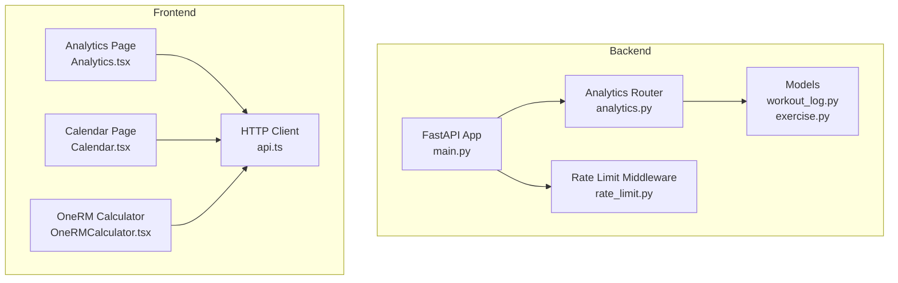
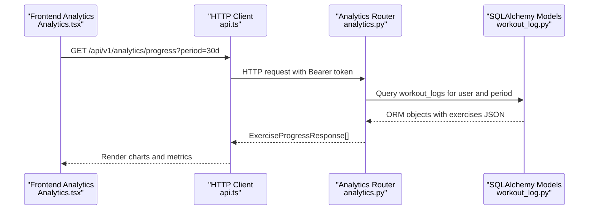
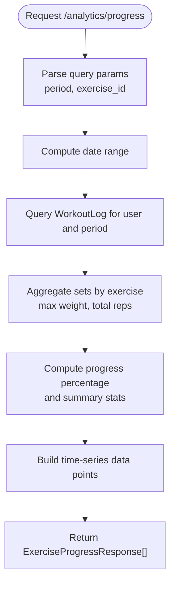
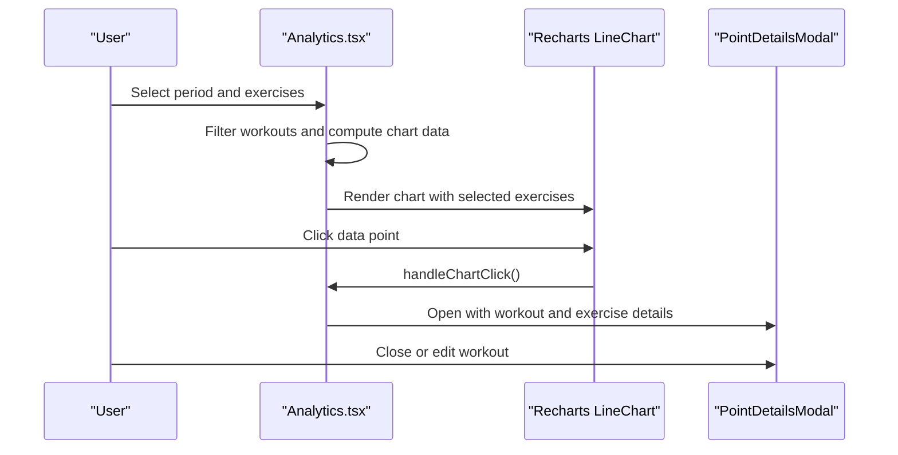
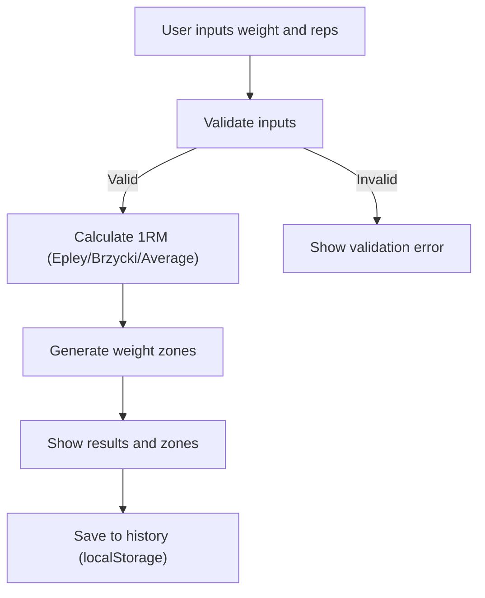
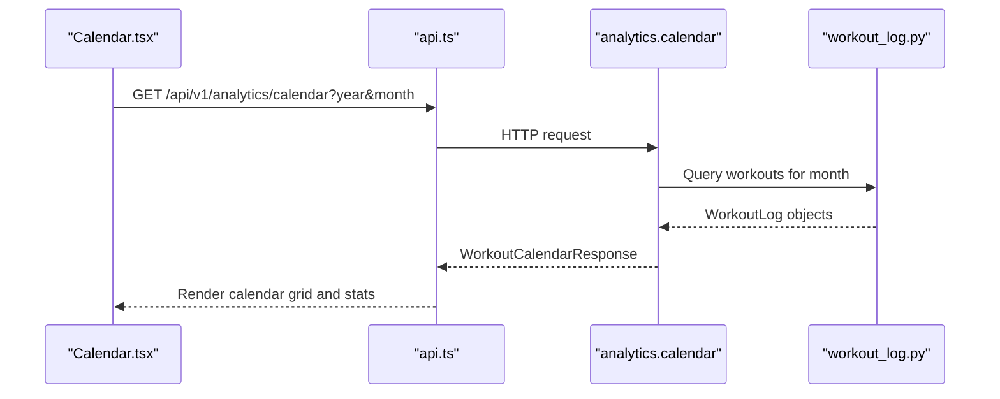
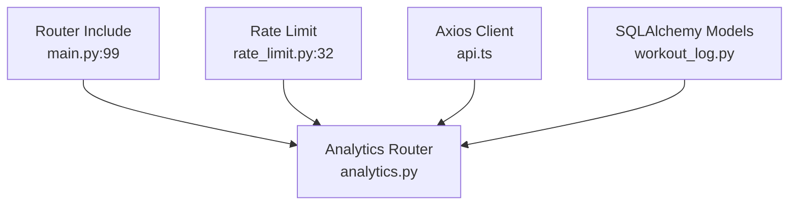

# Analytics & Insights Dashboard

<cite>
**Referenced Files in This Document**
- [analytics.py](file://backend/app/api/analytics.py)
- [analytics.py](file://backend/app/schemas/analytics.py)
- [workout_log.py](file://backend/app/models/workout_log.py)
- [exercise.py](file://backend/app/models/exercise.py)
- [main.py](file://backend/app/main.py)
- [rate_limit.py](file://backend/app/middleware/rate_limit.py)
- [Analytics.tsx](file://frontend/src/pages/Analytics.tsx)
- [Calendar.tsx](file://frontend/src/pages/Calendar.tsx)
- [OneRMCalculator.tsx](file://frontend/src/components/analytics/OneRMCalculator.tsx)
- [api.ts](file://frontend/src/services/api.ts)
- [requirements.txt](file://backend/requirements.txt)
</cite>

## Table of Contents
1. [Introduction](#introduction)
2. [Project Structure](#project-structure)
3. [Core Components](#core-components)
4. [Architecture Overview](#architecture-overview)
5. [Detailed Component Analysis](#detailed-component-analysis)
6. [Dependency Analysis](#dependency-analysis)
7. [Performance Considerations](#performance-considerations)
8. [Troubleshooting Guide](#troubleshooting-guide)
9. [Conclusion](#conclusion)

## Introduction
This document describes the analytics and insights dashboard implementation for the FitTracker Pro application. It covers the backend analytics API endpoints for workout statistics, progress tracking, calendar integration, and data export, alongside the frontend analytics interface featuring charts, graphs, interactive dashboards, and specialized calculators. The documentation explains the analytics calculation engine, data aggregation algorithms, and performance metrics computation, and provides examples of analytics data processing, chart rendering, progress reporting, and custom report generation.

## Project Structure
The analytics implementation spans backend FastAPI routes and SQLAlchemy models, and frontend React components with charting libraries. Key areas:
- Backend analytics router exposes endpoints for progress, calendar, summary, and export.
- Frontend Analytics page renders interactive charts, metrics cards, and export controls.
- Calendar page integrates backend calendar data and displays workout status per day.
- OneRM calculator provides performance analysis tools for strength training.

**Diagram sources**
- [main.py:99](file://backend/app/main.py#L99)
- [analytics.py:27](file://backend/app/api/analytics.py#L27)
- [workout_log.py:19](file://backend/app/models/workout_log.py#L19)
- [exercise.py:17](file://backend/app/models/exercise.py#L17)
- [rate_limit.py:32](file://backend/app/middleware/rate_limit.py#L32)
- [Analytics.tsx:641](file://frontend/src/pages/Analytics.tsx#L641)
- [Calendar.tsx:446](file://frontend/src/pages/Calendar.tsx#L446)
- [OneRMCalculator.tsx:397](file://frontend/src/components/analytics/OneRMCalculator.tsx#L397)
- [api.ts:6](file://frontend/src/services/api.ts#L6)

**Section sources**
- [main.py:99](file://backend/app/main.py#L99)
- [analytics.py:27](file://backend/app/api/analytics.py#L27)
- [Analytics.tsx:641](file://frontend/src/pages/Analytics.tsx#L641)
- [Calendar.tsx:446](file://frontend/src/pages/Calendar.tsx#L446)
- [OneRMCalculator.tsx:397](file://frontend/src/components/analytics/OneRMCalculator.tsx#L397)

## Core Components
- Backend analytics API:
  - Progress endpoint aggregates exercise performance over configurable periods.
  - Calendar endpoint returns monthly workout summaries and day-level metadata.
  - Summary endpoint computes totals, averages, streaks, and favorites.
  - Export endpoint initiates data export requests with status tracking placeholders.
- Frontend analytics interface:
  - Interactive charts powered by Recharts for exercise progression.
  - Metrics cards for quick insights.
  - Export menu supporting CSV/PDF/Telegram sharing.
  - OneRM calculator with formulas, weight zones, and history.
- Data models:
  - WorkoutLog stores completed exercises with sets, reps, and optional glucose/wellness markers.
  - Exercise model supports exercise library and categorization.

**Section sources**
- [analytics.py:27](file://backend/app/api/analytics.py#L27)
- [analytics.py:200](file://backend/app/api/analytics.py#L200)
- [analytics.py:385](file://backend/app/api/analytics.py#L385)
- [analytics.py:310](file://backend/app/api/analytics.py#L310)
- [workout_log.py:49](file://backend/app/models/workout_log.py#L49)
- [exercise.py:24](file://backend/app/models/exercise.py#L24)
- [Analytics.tsx:641](file://frontend/src/pages/Analytics.tsx#L641)
- [OneRMCalculator.tsx:397](file://frontend/src/components/analytics/OneRMCalculator.tsx#L397)

## Architecture Overview
The analytics pipeline connects frontend dashboards to backend endpoints via an HTTP client, with rate limiting and authentication enforced at the API gateway. Data flows from the database through SQLAlchemy ORM queries to FastAPI route handlers, returning structured responses consumed by React components.

**Diagram sources**
- [Analytics.tsx:641](file://frontend/src/pages/Analytics.tsx#L641)
- [api.ts:47](file://frontend/src/services/api.ts#L47)
- [analytics.py:27](file://backend/app/api/analytics.py#L27)
- [workout_log.py:49](file://backend/app/models/workout_log.py#L49)

## Detailed Component Analysis

### Backend Analytics API
- Progress endpoint:
  - Filters workouts by user and date range.
  - Aggregates sets by exercise, computing max weight, total reps, and progress percentage.
  - Builds time-series data points for charting and returns summary statistics.
- Calendar endpoint:
  - Returns monthly calendar entries with workout counts, durations, and tags.
  - Computes summary statistics such as total workouts, duration, and active/rest days.
- Summary endpoint:
  - Calculates totals, averages, current/longest streaks, and favorite exercises.
- Export endpoint:
  - Generates export identifiers and returns pending status; status retrieval is a placeholder.

**Diagram sources**
- [analytics.py:27](file://backend/app/api/analytics.py#L27)
- [analytics.py:77](file://backend/app/api/analytics.py#L77)
- [analytics.py:94](file://backend/app/api/analytics.py#L94)
- [analytics.py:133](file://backend/app/api/analytics.py#L133)
- [analytics.py:150](file://backend/app/api/analytics.py#L150)

**Section sources**
- [analytics.py:27](file://backend/app/api/analytics.py#L27)
- [analytics.py:200](file://backend/app/api/analytics.py#L200)
- [analytics.py:310](file://backend/app/api/analytics.py#L310)
- [analytics.py:385](file://backend/app/api/analytics.py#L385)

### Frontend Analytics Dashboard
- Charts and graphs:
  - Uses Recharts to render interactive line charts for exercise max weights over time.
  - Supports period selection (7d/30d/90d/all/custom) and exercise filtering (up to five).
  - Clicking a data point opens a modal with workout details and set breakdown.
- Metrics and statistics:
  - Displays key metrics such as total workouts, average rest time, strength growth, and personal records.
  - Provides per-exercise statistics including max/min/average and growth percentage.
- Export capabilities:
  - CSV export of chart data.
  - PDF export via browser print-to-PDF.
  - Telegram sharing using WebApp data channel.

**Diagram sources**
- [Analytics.tsx:641](file://frontend/src/pages/Analytics.tsx#L641)
- [Analytics.tsx:732](file://frontend/src/pages/Analytics.tsx#L732)
- [Analytics.tsx:853](file://frontend/src/pages/Analytics.tsx#L853)
- [Analytics.tsx:980](file://frontend/src/pages/Analytics.tsx#L980)

**Section sources**
- [Analytics.tsx:641](file://frontend/src/pages/Analytics.tsx#L641)
- [Analytics.tsx:801](file://frontend/src/pages/Analytics.tsx#L801)
- [Analytics.tsx:836](file://frontend/src/pages/Analytics.tsx#L836)
- [Analytics.tsx:913](file://frontend/src/pages/Analytics.tsx#L913)

### OneRM Calculator
- Formulas:
  - Implements Epley and Brzycki equations to estimate 1 repetition maximum (1RM).
  - Computes average 1RM and generates recommended weight zones for training targets.
- UI and UX:
  - Exercise selector with search and quick-rep buttons.
  - Results display with weighted zones and save-to-history capability.
  - Local storage-backed history with clear and share actions.

**Diagram sources**
- [OneRMCalculator.tsx:62](file://frontend/src/components/analytics/OneRMCalculator.tsx#L62)
- [OneRMCalculator.tsx:81](file://frontend/src/components/analytics/OneRMCalculator.tsx#L81)
- [OneRMCalculator.tsx:96](file://frontend/src/components/analytics/OneRMCalculator.tsx#L96)
- [OneRMCalculator.tsx:456](file://frontend/src/components/analytics/OneRMCalculator.tsx#L456)

**Section sources**
- [OneRMCalculator.tsx:397](file://frontend/src/components/analytics/OneRMCalculator.tsx#L397)
- [OneRMCalculator.tsx:62](file://frontend/src/components/analytics/OneRMCalculator.tsx#L62)
- [OneRMCalculator.tsx:456](file://frontend/src/components/analytics/OneRMCalculator.tsx#L456)

### Calendar Integration
- Backend calendar endpoint:
  - Returns monthly calendar entries with workout counts, durations, and tags.
  - Includes summary statistics such as total workouts, duration, active/rest days.
- Frontend calendar page:
  - Renders a month grid with status indicators for completed/partial/missed/planned workouts.
  - Integrates with the backend calendar endpoint and displays day-level details in a sheet.

**Diagram sources**
- [Calendar.tsx:111](file://frontend/src/pages/Calendar.tsx#L111)
- [api.ts:47](file://frontend/src/services/api.ts#L47)
- [analytics.py:200](file://backend/app/api/analytics.py#L200)
- [workout_log.py:49](file://backend/app/models/workout_log.py#L49)

**Section sources**
- [analytics.py:200](file://backend/app/api/analytics.py#L200)
- [Calendar.tsx:111](file://frontend/src/pages/Calendar.tsx#L111)

## Dependency Analysis
- Backend routing:
  - Analytics router is included under the /api/v1/analytics prefix and tagged for documentation.
- Rate limiting:
  - Export endpoint is rate-limited to prevent abuse.
- Frontend HTTP client:
  - Axios instance configured with request/response interceptors and bearer token injection.
- Backend dependencies:
  - FastAPI, SQLAlchemy, Celery, Redis, and monitoring libraries support the analytics pipeline.

**Diagram sources**
- [main.py:99](file://backend/app/main.py#L99)
- [rate_limit.py:32](file://backend/app/middleware/rate_limit.py#L32)
- [api.ts:6](file://frontend/src/services/api.ts#L6)
- [workout_log.py:19](file://backend/app/models/workout_log.py#L19)

**Section sources**
- [main.py:99](file://backend/app/main.py#L99)
- [rate_limit.py:32](file://backend/app/middleware/rate_limit.py#L32)
- [api.ts:6](file://frontend/src/services/api.ts#L6)
- [requirements.txt:2](file://backend/requirements.txt#L2)

## Performance Considerations
- Backend:
  - Use database indexes on user_id, date, and composite indexes to optimize analytics queries.
  - Consider pagination or chunked processing for long time ranges to avoid memory pressure.
  - Offload heavy export tasks to asynchronous workers (Celery) with Redis for status tracking.
- Frontend:
  - Virtualize large datasets and defer expensive computations with memoization.
  - Debounce period and exercise filters to reduce re-renders.
  - Lazy-load chart libraries and calculator components to minimize initial bundle size.

## Troubleshooting Guide
- Authentication failures:
  - Ensure Authorization header with Bearer token is present for analytics endpoints.
- Rate limit exceeded:
  - Export endpoint is rate-limited; retry after the reset window.
- Missing or expired export:
  - Export status retrieval is a placeholder; implement Redis/DB lookup to resolve.
- Data not appearing:
  - Verify user-specific data exists for the selected period and that exercises have sets recorded.

**Section sources**
- [rate_limit.py:32](file://backend/app/middleware/rate_limit.py#L32)
- [analytics.py:368](file://backend/app/api/analytics.py#L368)

## Conclusion
The analytics and insights dashboard combines robust backend endpoints with a responsive frontend interface to deliver actionable fitness insights. The backend provides structured progress, calendar, summary, and export capabilities, while the frontend offers interactive charts, metrics, and specialized tools like the OneRM calculator. With proper indexing, asynchronous exports, and optimized frontend rendering, the system scales effectively to support diverse user needs.