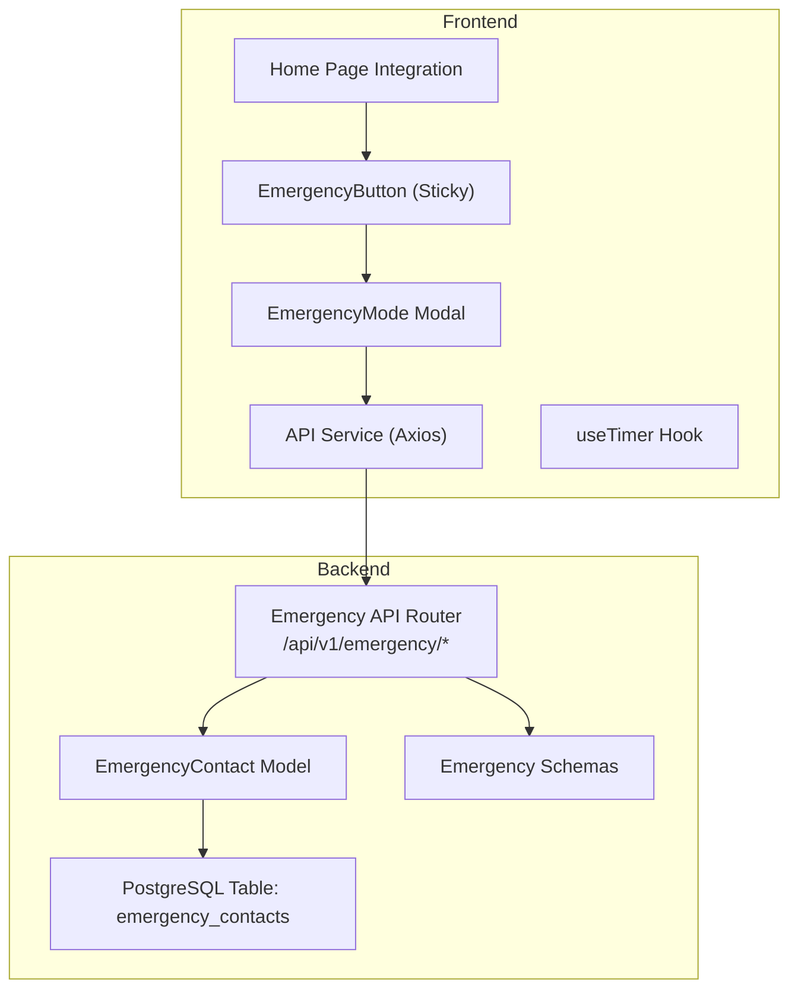
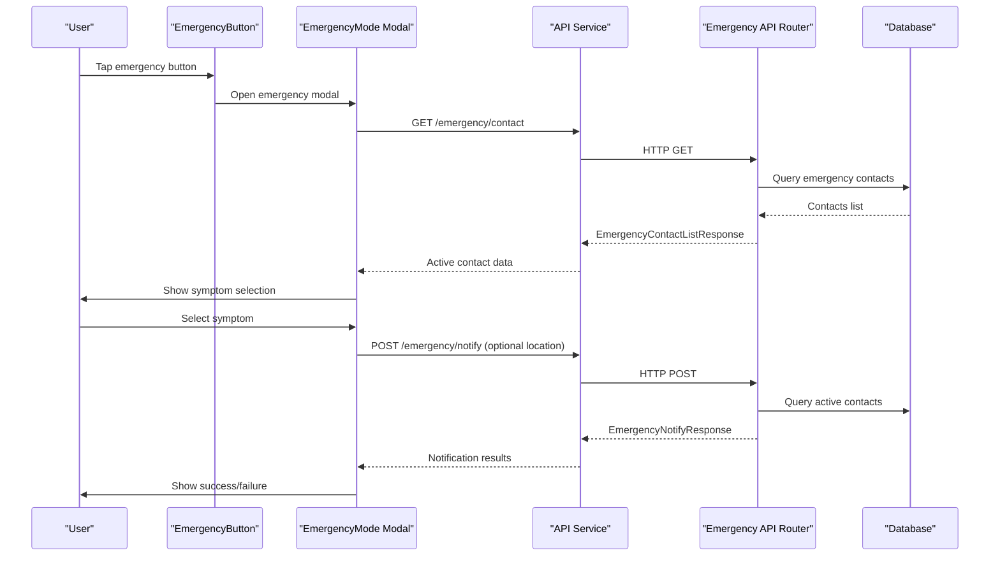
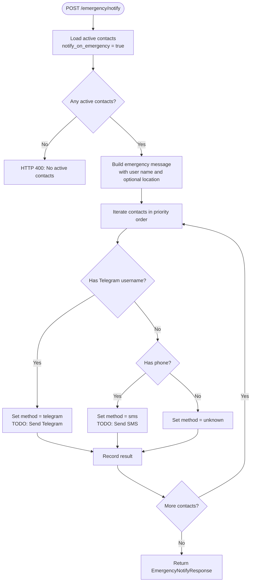
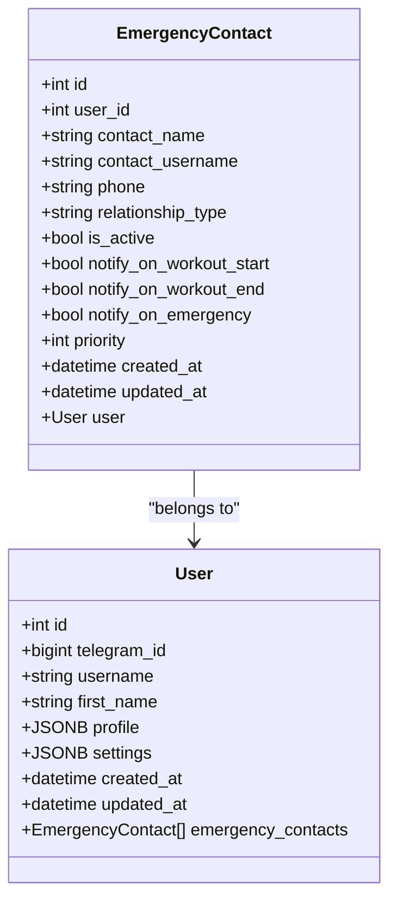
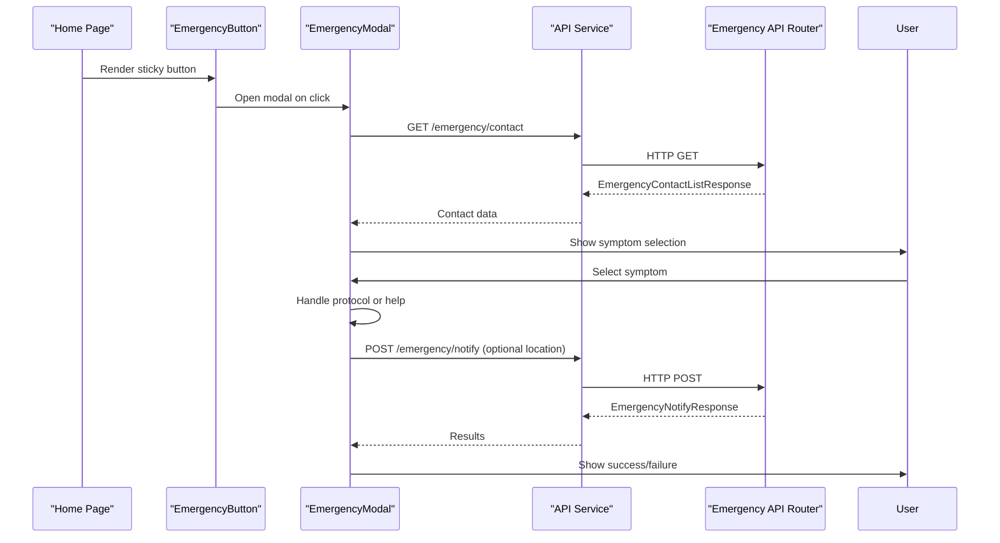
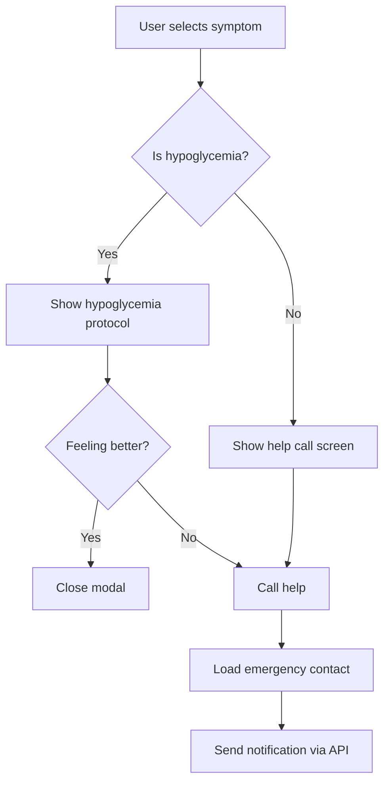
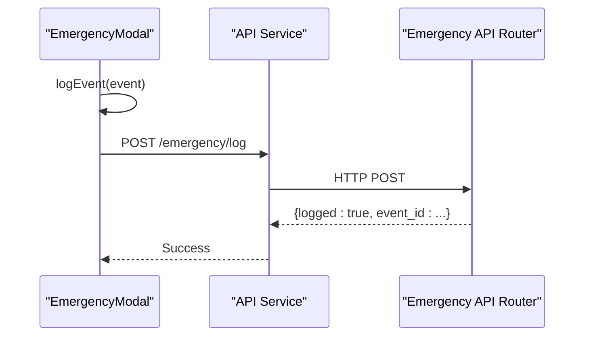
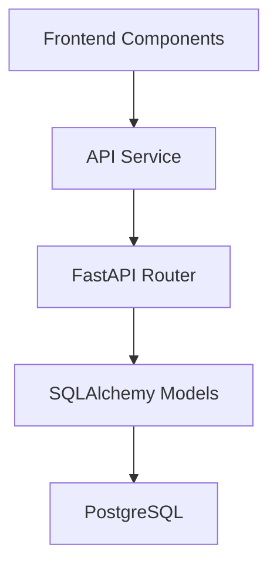

# Emergency Mode & Safety Features

<cite>
**Referenced Files in This Document**
- [emergency.py](file://backend/app/api/emergency.py)
- [emergency_contact.py](file://backend/app/models/emergency_contact.py)
- [emergency.py](file://backend/app/schemas/emergency.py)
- [EmergencyMode.tsx](file://frontend/src/components/emergency/EmergencyMode.tsx)
- [EmergencyButton.tsx](file://frontend/src/components/home/EmergencyButton.tsx)
- [api.ts](file://frontend/src/services/api.ts)
- [useTimer.ts](file://frontend/src/hooks/useTimer.ts)
- [main.py](file://backend/app/main.py)
- [cd723942379e_initial_schema.py](file://database/migrations/versions/cd723942379e_initial_schema.py)
- [Home.tsx](file://frontend/src/pages/Home.tsx)
</cite>

## Table of Contents
1. [Introduction](#introduction)
2. [Project Structure](#project-structure)
3. [Core Components](#core-components)
4. [Architecture Overview](#architecture-overview)
5. [Detailed Component Analysis](#detailed-component-analysis)
6. [Dependency Analysis](#dependency-analysis)
7. [Performance Considerations](#performance-considerations)
8. [Troubleshooting Guide](#troubleshooting-guide)
9. [Conclusion](#conclusion)

## Introduction
This document provides comprehensive documentation for the emergency mode and safety features implementation in FitTracker Pro. It covers the emergency contact management system, quick access functionality, critical information display, backend emergency API endpoints, and frontend emergency interface components. The implementation includes emergency protocol triggers, contact prioritization, and safety notification systems, with practical examples for configuration, quick emergency access, safety data management, and emergency response workflows.

## Project Structure
The emergency system spans both backend and frontend components:
- Backend: FastAPI router exposing emergency endpoints, SQLAlchemy model for emergency contacts, Pydantic schemas for request/response validation, and database migration defining the emergency contacts table.
- Frontend: Emergency modal with symptom selection, hypoglycemia protocol, contact display, and help call flow; sticky emergency button; API service for backend communication; and a high-precision timer hook.

**Diagram sources**
- [main.py:105-106](file://backend/app/main.py#L105-L106)
- [EmergencyMode.tsx:1064-1079](file://frontend/src/components/emergency/EmergencyMode.tsx#L1064-L1079)
- [EmergencyButton.tsx:10-109](file://frontend/src/components/home/EmergencyButton.tsx#L10-L109)
- [api.ts:1-69](file://frontend/src/services/api.ts#L1-L69)
- [useTimer.ts:1-293](file://frontend/src/hooks/useTimer.ts#L1-L293)
- [cd723942379e_initial_schema.py:349-373](file://database/migrations/versions/cd723942379e_initial_schema.py#L349-L373)

**Section sources**
- [main.py:105-106](file://backend/app/main.py#L105-L106)
- [EmergencyMode.tsx:1064-1079](file://frontend/src/components/emergency/EmergencyMode.tsx#L1064-L1079)
- [EmergencyButton.tsx:10-109](file://frontend/src/components/home/EmergencyButton.tsx#L10-L109)
- [api.ts:1-69](file://frontend/src/services/api.ts#L1-L69)
- [useTimer.ts:1-293](file://frontend/src/hooks/useTimer.ts#L1-L293)
- [cd723942379e_initial_schema.py:349-373](file://database/migrations/versions/cd723942379e_initial_schema.py#L349-L373)

## Core Components
- Backend Emergency API: Provides endpoints for managing emergency contacts, sending emergency notifications, notifying on workout start/end, retrieving emergency settings, and logging emergency events.
- Emergency Contact Model: Defines the database schema for emergency contacts with fields for contact details, notification preferences, and priority ordering.
- Frontend Emergency Modal: Implements the user-facing emergency workflow including symptom selection, hypoglycemia protocol with timer, contact notification, and help call confirmation.
- Quick Access Emergency Button: A sticky, haptic-enabled button on the home page that opens the emergency modal.
- API Service: Centralized Axios client with authentication token injection and error handling.
- Timer Hook: High-precision timer using requestAnimationFrame for accurate countdowns and background operation support.

**Section sources**
- [emergency.py:27-78](file://backend/app/api/emergency.py#L27-L78)
- [emergency_contact.py:17-112](file://backend/app/models/emergency_contact.py#L17-L112)
- [EmergencyMode.tsx:116-149](file://frontend/src/components/emergency/EmergencyMode.tsx#L116-L149)
- [EmergencyButton.tsx:10-109](file://frontend/src/components/home/EmergencyButton.tsx#L10-L109)
- [api.ts:6-69](file://frontend/src/services/api.ts#L6-L69)
- [useTimer.ts:57-293](file://frontend/src/hooks/useTimer.ts#L57-L293)

## Architecture Overview
The emergency system follows a layered architecture:
- Frontend components render the emergency UI and collect user actions.
- API service handles HTTP requests and authentication.
- Backend FastAPI router validates requests, interacts with the database, and prepares responses.
- SQLAlchemy model persists emergency contacts and related metadata.
- PostgreSQL migration defines the emergency_contacts table with appropriate indices.

**Diagram sources**
- [EmergencyButton.tsx:10-109](file://frontend/src/components/home/EmergencyButton.tsx#L10-L109)
- [EmergencyMode.tsx:869-943](file://frontend/src/components/emergency/EmergencyMode.tsx#L869-L943)
- [api.ts:47-55](file://frontend/src/services/api.ts#L47-L55)
- [emergency.py:27-78](file://backend/app/api/emergency.py#L27-L78)
- [emergency.py:249-359](file://backend/app/api/emergency.py#L249-L359)

**Section sources**
- [EmergencyButton.tsx:10-109](file://frontend/src/components/home/EmergencyButton.tsx#L10-L109)
- [EmergencyMode.tsx:869-943](file://frontend/src/components/emergency/EmergencyMode.tsx#L869-L943)
- [api.ts:47-55](file://frontend/src/services/api.ts#L47-L55)
- [emergency.py:27-78](file://backend/app/api/emergency.py#L27-L78)
- [emergency.py:249-359](file://backend/app/api/emergency.py#L249-L359)

## Detailed Component Analysis

### Backend Emergency API Endpoints
The backend exposes the following emergency endpoints:
- GET /emergency/contact: Retrieve all emergency contacts for the authenticated user, ordered by priority and creation date.
- POST /emergency/contact: Create a new emergency contact with validation ensuring at least one contact method is provided.
- GET /emergency/contact/{contact_id}: Fetch a specific emergency contact owned by the user.
- PUT /emergency/contact/{contact_id}: Update an existing emergency contact with partial updates.
- DELETE /emergency/contact/{contact_id}: Remove an emergency contact.
- POST /emergency/notify: Send emergency notifications to all active contacts configured to receive emergency alerts; builds messages and logs results.
- POST /emergency/notify/workout-start: Notify active contacts configured for workout start alerts.
- POST /emergency/notify/workout-end: Notify active contacts configured for workout end alerts.
- GET /emergency/settings: Retrieve emergency notification settings summary.
- POST /emergency/log: Log emergency events for analytics and safety tracking.

Key implementation details:
- Authentication: All endpoints except authentication require a Bearer token via Authorization header.
- Validation: Requests use Pydantic models to validate payload fields and enforce constraints (e.g., priority range, relationship types).
- Ordering: Contacts are ordered by priority and creation date for deterministic notification sequences.
- Placeholder Notifications: Actual Telegram/SMS delivery is marked as TODO and currently returns success placeholders.

**Diagram sources**
- [emergency.py:249-359](file://backend/app/api/emergency.py#L249-L359)

**Section sources**
- [emergency.py:27-78](file://backend/app/api/emergency.py#L27-L78)
- [emergency.py:81-137](file://backend/app/api/emergency.py#L81-L137)
- [emergency.py:139-218](file://backend/app/api/emergency.py#L139-L218)
- [emergency.py:249-359](file://backend/app/api/emergency.py#L249-L359)
- [emergency.py:362-451](file://backend/app/api/emergency.py#L362-L451)
- [emergency.py:453-492](file://backend/app/api/emergency.py#L453-L492)
- [emergency.py:495-543](file://backend/app/api/emergency.py#L495-L543)

### Emergency Contact Management Model
The EmergencyContact model defines the database schema and relationships:
- Fields: contact_name, contact_username (Telegram), phone, relationship_type, is_active, notify preferences, priority, timestamps.
- Indices: user_id, is_active, priority for efficient queries.
- Relationships: back-populates to User model via user_id foreign key with cascade deletion.

**Diagram sources**
- [emergency_contact.py:17-112](file://backend/app/models/emergency_contact.py#L17-L112)

**Section sources**
- [emergency_contact.py:17-112](file://backend/app/models/emergency_contact.py#L17-L112)
- [cd723942379e_initial_schema.py:349-373](file://database/migrations/versions/cd723942379e_initial_schema.py#L349-L373)

### Frontend Emergency Interface Components
The frontend implements a comprehensive emergency workflow:
- Sticky Emergency Button: Large, haptic-enabled button on the home page that opens the emergency modal.
- Emergency Modal: Multi-step process including symptom selection, hypoglycemia protocol with timer, contact notification, and help call confirmation.
- Contact Display: Shows active emergency contact, allows attaching location, and sends notifications via API.
- Hold-to-Close: 3-second hold with haptic feedback to close the modal safely.
- Logging: Records emergency events and sends them to the backend for analytics.

**Diagram sources**
- [Home.tsx:272-274](file://frontend/src/pages/Home.tsx#L272-L274)
- [EmergencyButton.tsx:10-109](file://frontend/src/components/home/EmergencyButton.tsx#L10-L109)
- [EmergencyMode.tsx:869-943](file://frontend/src/components/emergency/EmergencyMode.tsx#L869-L943)
- [api.ts:47-55](file://frontend/src/services/api.ts#L47-L55)
- [emergency.py:27-78](file://backend/app/api/emergency.py#L27-L78)
- [emergency.py:249-359](file://backend/app/api/emergency.py#L249-L359)

**Section sources**
- [Home.tsx:272-274](file://frontend/src/pages/Home.tsx#L272-L274)
- [EmergencyButton.tsx:10-109](file://frontend/src/components/home/EmergencyButton.tsx#L10-L109)
- [EmergencyMode.tsx:116-149](file://frontend/src/components/emergency/EmergencyMode.tsx#L116-L149)
- [EmergencyMode.tsx:869-943](file://frontend/src/components/emergency/EmergencyMode.tsx#L869-L943)
- [EmergencyMode.tsx:1021-1058](file://frontend/src/components/emergency/EmergencyMode.tsx#L1021-L1058)

### Emergency Protocol Triggers and Contact Prioritization
- Protocol Triggers: Symptom selection determines whether to initiate the hypoglycemia protocol or proceed to help call.
- Contact Prioritization: Contacts are ordered by priority (ascending) and creation date to ensure the most important contacts are notified first.
- Safety Notifications: Workout start/end notifications can be configured per contact preference.

**Diagram sources**
- [EmergencyMode.tsx:897-906](file://frontend/src/components/emergency/EmergencyMode.tsx#L897-L906)
- [EmergencyMode.tsx:1021-1034](file://frontend/src/components/emergency/EmergencyMode.tsx#L1021-L1034)
- [EmergencyMode.tsx:1036-1044](file://frontend/src/components/emergency/EmergencyMode.tsx#L1036-L1044)
- [emergency.py:293-303](file://backend/app/api/emergency.py#L293-L303)

**Section sources**
- [EmergencyMode.tsx:897-906](file://frontend/src/components/emergency/EmergencyMode.tsx#L897-L906)
- [EmergencyMode.tsx:1021-1034](file://frontend/src/components/emergency/EmergencyMode.tsx#L1021-L1034)
- [EmergencyMode.tsx:1036-1044](file://frontend/src/components/emergency/EmergencyMode.tsx#L1036-L1044)
- [emergency.py:293-303](file://backend/app/api/emergency.py#L293-L303)

### Safety Data Management and Logging
- Event Logging: The frontend logs emergency events locally and asynchronously sends them to the backend via POST /emergency/log.
- Backend Logging: The backend receives event data and logs it for analytics and safety tracking.

**Diagram sources**
- [EmergencyMode.tsx:883-895](file://frontend/src/components/emergency/EmergencyMode.tsx#L883-L895)
- [emergency.py:495-543](file://backend/app/api/emergency.py#L495-L543)

**Section sources**
- [EmergencyMode.tsx:883-895](file://frontend/src/components/emergency/EmergencyMode.tsx#L883-L895)
- [emergency.py:495-543](file://backend/app/api/emergency.py#L495-L543)

## Dependency Analysis
The emergency system exhibits clear separation of concerns:
- Frontend depends on the API service for backend communication and on shared hooks for timers.
- Backend depends on SQLAlchemy for ORM and FastAPI for routing and validation.
- Database migration defines the emergency_contacts table with appropriate constraints and indices.

**Diagram sources**
- [api.ts:6-69](file://frontend/src/services/api.ts#L6-L69)
- [main.py:105-106](file://backend/app/main.py#L105-L106)
- [emergency_contact.py:17-112](file://backend/app/models/emergency_contact.py#L17-L112)
- [cd723942379e_initial_schema.py:349-373](file://database/migrations/versions/cd723942379e_initial_schema.py#L349-L373)

**Section sources**
- [api.ts:6-69](file://frontend/src/services/api.ts#L6-L69)
- [main.py:105-106](file://backend/app/main.py#L105-L106)
- [emergency_contact.py:17-112](file://backend/app/models/emergency_contact.py#L17-L112)
- [cd723942379e_initial_schema.py:349-373](file://database/migrations/versions/cd723942379e_initial_schema.py#L349-L373)

## Performance Considerations
- Database Queries: The emergency contact retrieval orders by priority and creation date; ensure proper indexing on user_id, is_active, and priority for optimal performance.
- Notification Processing: The notification endpoint iterates through contacts; consider batching or asynchronous processing for large contact lists.
- Frontend Rendering: The emergency modal uses portals and multiple components; keep re-renders minimal by leveraging memoization and controlled updates.
- Timer Accuracy: The useTimer hook uses requestAnimationFrame for precise timing and background operation support, reducing CPU overhead compared to setInterval.

## Troubleshooting Guide
Common issues and resolutions:
- Authentication Failures: Ensure the Authorization header contains a valid Bearer token. Verify token presence in local storage and interceptor configuration.
- No Active Contacts: The emergency notification endpoint requires at least one active contact configured to receive emergency alerts; verify contact settings.
- Location Sharing: Geolocation requests may fail due to permissions or timeouts; handle errors gracefully and continue without location data.
- Notification Delivery: Actual Telegram/SMS delivery is not implemented; confirm placeholder success responses and implement provider-specific APIs.

**Section sources**
- [api.ts:21-45](file://frontend/src/services/api.ts#L21-L45)
- [emergency.py:305-309](file://backend/app/api/emergency.py#L305-L309)
- [EmergencyMode.tsx:916-928](file://frontend/src/components/emergency/EmergencyMode.tsx#L916-L928)
- [emergency.py:325-351](file://backend/app/api/emergency.py#L325-L351)

## Conclusion
The emergency mode and safety features implementation provides a robust foundation for user safety during workouts. The backend offers comprehensive emergency contact management and notification capabilities, while the frontend delivers an intuitive, haptic-enhanced emergency workflow. Future enhancements should focus on implementing actual notification delivery mechanisms, optimizing database queries, and expanding safety analytics features.