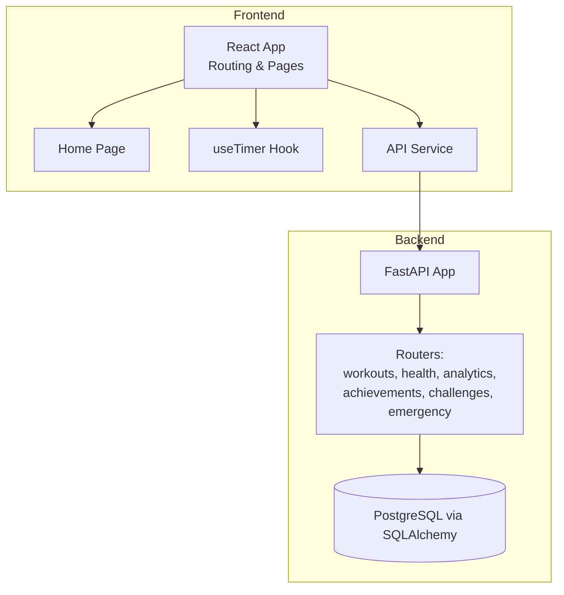
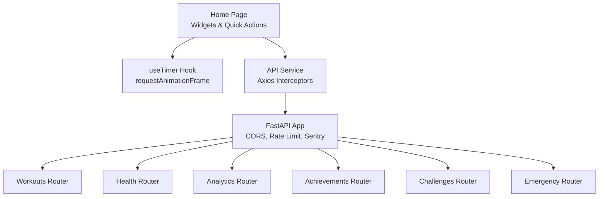
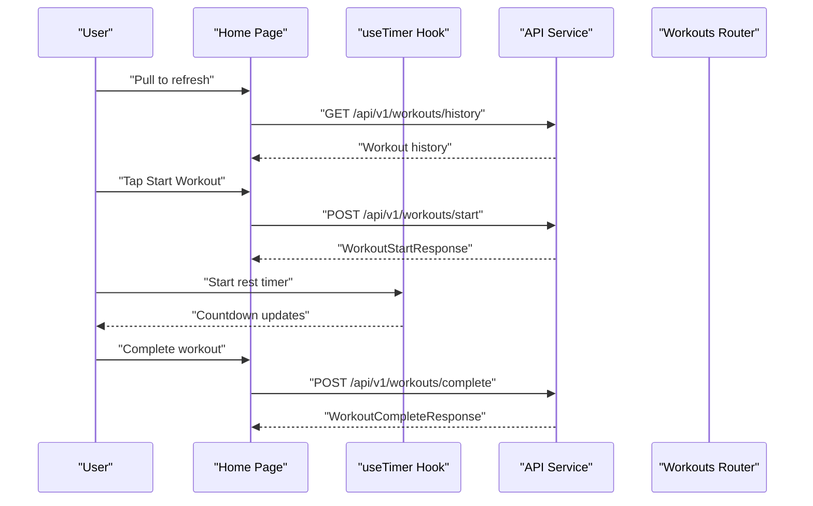
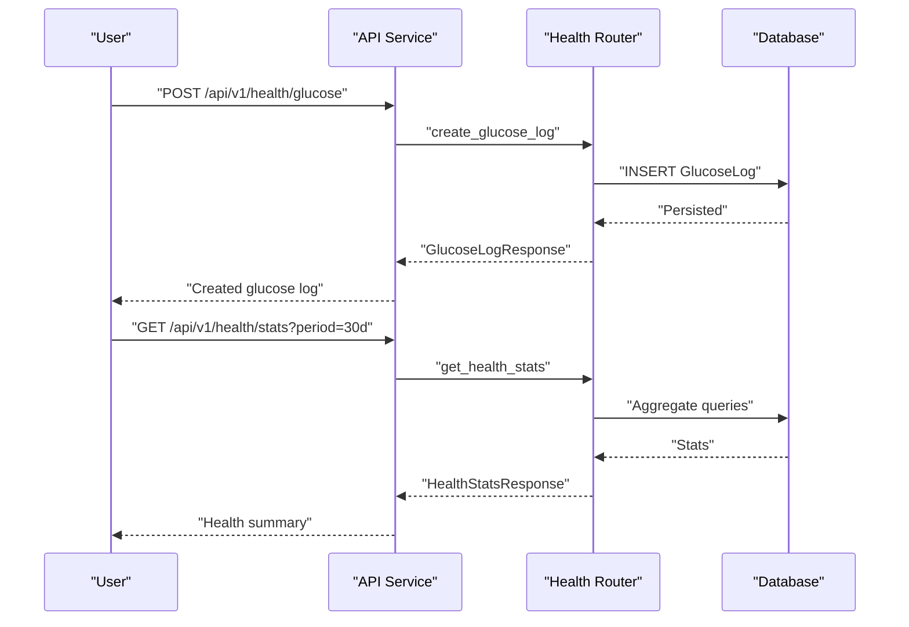
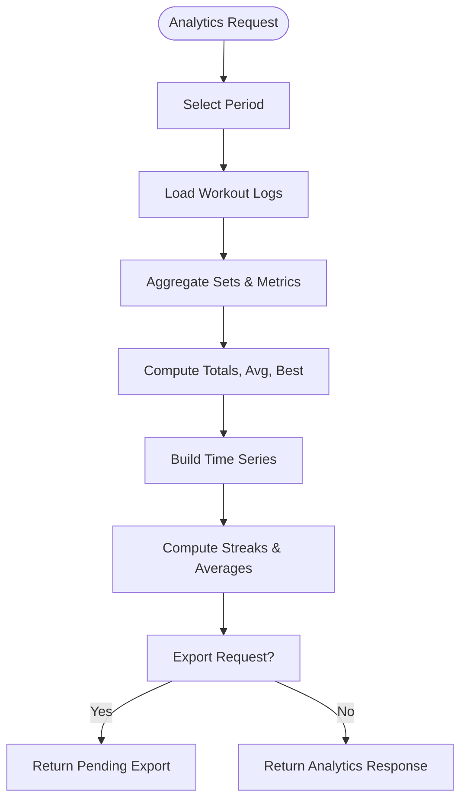
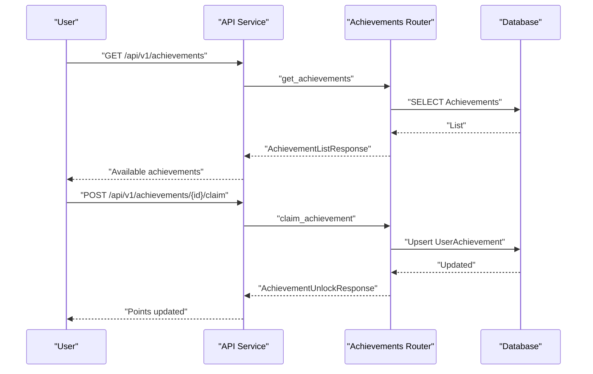
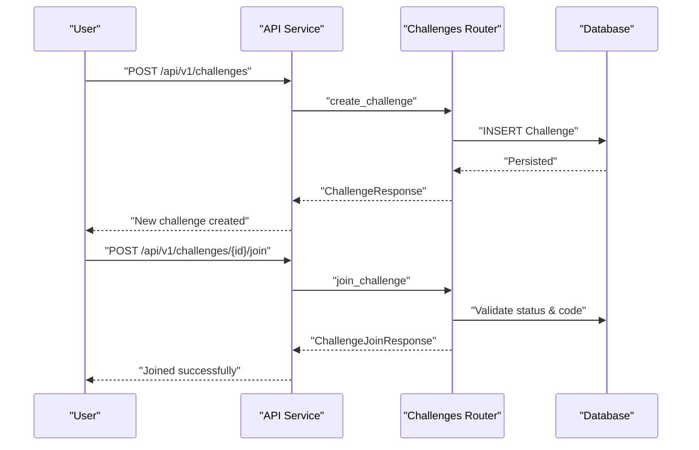
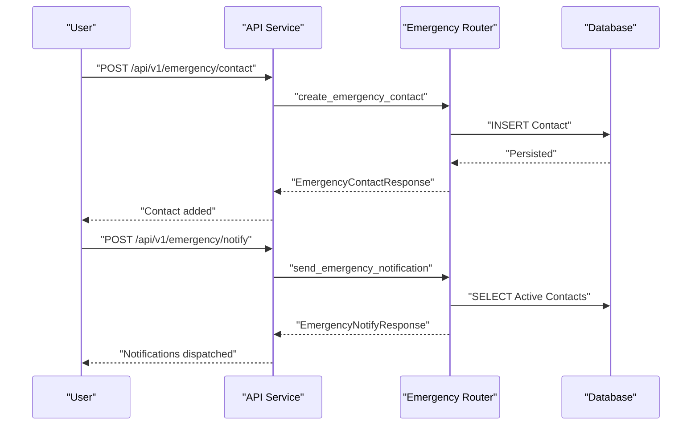
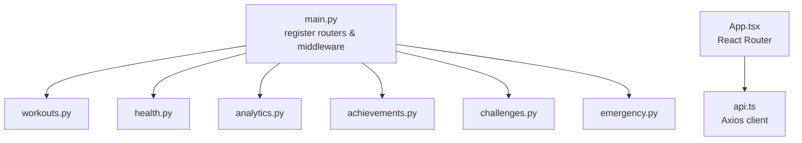

# Feature Implementation

<cite>
**Referenced Files in This Document**
- [backend/app/main.py](file://backend/app/main.py)
- [backend/app/api/workouts.py](file://backend/app/api/workouts.py)
- [backend/app/api/health.py](file://backend/app/api/health.py)
- [backend/app/api/analytics.py](file://backend/app/api/analytics.py)
- [backend/app/api/achievements.py](file://backend/app/api/achievements.py)
- [backend/app/api/challenges.py](file://backend/app/api/challenges.py)
- [backend/app/api/emergency.py](file://backend/app/api/emergency.py)
- [backend/app/models/workout_log.py](file://backend/app/models/workout_log.py)
- [backend/app/models/achievement.py](file://backend/app/models/achievement.py)
- [backend/app/schemas/workouts.py](file://backend/app/schemas/workouts.py)
- [backend/app/schemas/health.py](file://backend/app/schemas/health.py)
- [backend/app/schemas/analytics.py](file://backend/app/schemas/analytics.py)
- [frontend/src/pages/Home.tsx](file://frontend/src/pages/Home.tsx)
- [frontend/src/hooks/useTimer.ts](file://frontend/src/hooks/useTimer.ts)
- [frontend/src/services/api.ts](file://frontend/src/services/api.ts)
- [frontend/src/App.tsx](file://frontend/src/App.tsx)
</cite>

## Table of Contents
1. [Introduction](#introduction)
2. [Project Structure](#project-structure)
3. [Core Components](#core-components)
4. [Architecture Overview](#architecture-overview)
5. [Detailed Component Analysis](#detailed-component-analysis)
6. [Dependency Analysis](#dependency-analysis)
7. [Performance Considerations](#performance-considerations)
8. [Troubleshooting Guide](#troubleshooting-guide)
9. [Conclusion](#conclusion)

## Introduction
This document details the feature implementation for FitTracker Pro’s core capabilities: workout tracking, health monitoring, analytics dashboard, achievement system, challenge platform, and emergency mode. It explains backend API design, data models, frontend integration patterns, and end-to-end workflows. It also covers performance characteristics, error handling, and edge-case management to guide both development and maintenance.

## Project Structure
FitTracker Pro follows a clear separation of concerns:
- Backend: FastAPI application exposing REST endpoints grouped by feature areas (workouts, health, analytics, achievements, challenges, emergency).
- Frontend: React-based Telegram Mini App with routing, hooks for timers, and service layer for API communication.
- Data models: SQLAlchemy ORM models define persistence for workout logs, achievements, and related entities.
- Schemas: Pydantic models validate request/response payloads across endpoints.

**Diagram sources**
- [backend/app/main.py:56-106](file://backend/app/main.py#L56-L106)
- [frontend/src/App.tsx:12-32](file://frontend/src/App.tsx#L12-L32)

**Section sources**
- [backend/app/main.py:13-106](file://backend/app/main.py#L13-L106)
- [frontend/src/App.tsx:12-32](file://frontend/src/App.tsx#L12-L32)

## Core Components
This section outlines the principal features and their implementation pillars.

- Workout Tracking
  - Templates and history management with pagination and filtering.
  - Session lifecycle: start and complete workflows with exercise sets and glucose tracking.
  - Data model persists completed exercises and associated metadata.

- Health Monitoring
  - Glucose measurements with type-based filtering and statistics.
  - Daily wellness entries with pain zones, sleep, and energy metrics.
  - Health statistics aggregation across configurable periods.

- Analytics Dashboard
  - Exercise progress tracking with time-series data and summaries.
  - Monthly workout calendar with activity indicators.
  - Export requests and summary statistics (streaks, averages).

- Achievement System
  - Achievement catalog with categories and conditions.
  - User progress tracking and leaderboard computation.
  - Claiming mechanism with points accumulation.

- Challenge Platform
  - Challenge creation with goals and visibility controls.
  - Join/leave workflows and leaderboard placeholders.
  - Active challenges listing for users.

- Emergency Mode
  - Emergency contacts management with notification preferences.
  - Workout start/end notifications and emergency alerts.
  - Event logging for safety analytics.

**Section sources**
- [backend/app/api/workouts.py:29-522](file://backend/app/api/workouts.py#L29-L522)
- [backend/app/api/health.py:29-615](file://backend/app/api/health.py#L29-L615)
- [backend/app/api/analytics.py:27-518](file://backend/app/api/analytics.py#L27-L518)
- [backend/app/api/achievements.py:25-420](file://backend/app/api/achievements.py#L25-L420)
- [backend/app/api/challenges.py:32-497](file://backend/app/api/challenges.py#L32-L497)
- [backend/app/api/emergency.py:27-543](file://backend/app/api/emergency.py#L27-L543)
- [backend/app/models/workout_log.py:19-112](file://backend/app/models/workout_log.py#L19-L112)
- [backend/app/models/achievement.py:17-105](file://backend/app/models/achievement.py#L17-L105)

## Architecture Overview
The backend initializes middleware, registers routers, and exposes endpoints under a unified prefix. The frontend integrates with the backend via an Axios-based service, adding JWT tokens automatically. The frontend pages orchestrate user actions (e.g., pull-to-refresh, timer controls) and delegate data operations to services.

**Diagram sources**
- [backend/app/main.py:56-106](file://backend/app/main.py#L56-L106)
- [frontend/src/pages/Home.tsx:22-277](file://frontend/src/pages/Home.tsx#L22-L277)
- [frontend/src/hooks/useTimer.ts:57-290](file://frontend/src/hooks/useTimer.ts#L57-L290)
- [frontend/src/services/api.ts:6-69](file://frontend/src/services/api.ts#L6-L69)

## Detailed Component Analysis

### Workout Tracking
Workout tracking centers around templates, history, and session lifecycle. The backend enforces ownership checks and supports pagination and filtering. The frontend composes widgets and quick actions on the home page and uses a high-precision timer hook for rest intervals.

**Diagram sources**
- [frontend/src/pages/Home.tsx:56-90](file://frontend/src/pages/Home.tsx#L56-L90)
- [frontend/src/hooks/useTimer.ts:106-149](file://frontend/src/hooks/useTimer.ts#L106-L149)
- [frontend/src/services/api.ts:47-65](file://frontend/src/services/api.ts#L47-L65)
- [backend/app/api/workouts.py:337-493](file://backend/app/api/workouts.py#L337-L493)

Key implementation patterns:
- Ownership validation ensures only the authenticated user can access or modify their data.
- Pagination and filtering reduce payload sizes and improve responsiveness.
- Exercise sets are modeled as structured JSON to support varied exercise types and metrics.

Data model highlights:
- WorkoutLog captures completed exercises, tags, comments, and optional glucose values.

**Section sources**
- [backend/app/api/workouts.py:29-522](file://backend/app/api/workouts.py#L29-L522)
- [backend/app/schemas/workouts.py:10-146](file://backend/app/schemas/workouts.py#L10-L146)
- [backend/app/models/workout_log.py:19-112](file://backend/app/models/workout_log.py#L19-L112)
- [frontend/src/pages/Home.tsx:22-277](file://frontend/src/pages/Home.tsx#L22-L277)
- [frontend/src/hooks/useTimer.ts:57-290](file://frontend/src/hooks/useTimer.ts#L57-L290)

### Health Monitoring
Health monitoring includes glucose tracking and daily wellness entries. The backend aggregates statistics over configurable periods and supports filtering by type and date ranges.

**Diagram sources**
- [frontend/src/services/api.ts:47-65](file://frontend/src/services/api.ts#L47-L65)
- [backend/app/api/health.py:29-615](file://backend/app/api/health.py#L29-L615)
- [backend/app/schemas/health.py:10-134](file://backend/app/schemas/health.py#L10-L134)

Implementation highlights:
- Measurement types constrain input to predefined categories (fasting, pre_workout, post_workout, random, bedtime).
- Statistics queries compute averages, min/max values, and in-range percentages for glucose trends.
- Wellness entries support pain zones and daily scores for holistic health insights.

**Section sources**
- [backend/app/api/health.py:29-615](file://backend/app/api/health.py#L29-L615)
- [backend/app/schemas/health.py:10-134](file://backend/app/schemas/health.py#L10-L134)

### Analytics Dashboard
The analytics module computes exercise progress, generates workout calendars, and provides summary statistics. Export requests are accepted with placeholder status handling.

**Diagram sources**
- [backend/app/api/analytics.py:27-518](file://backend/app/api/analytics.py#L27-L518)
- [backend/app/schemas/analytics.py:10-111](file://backend/app/schemas/analytics.py#L10-L111)

Key features:
- Exercise progress tracks max weight and total volume over time with best performance identification.
- Monthly calendar displays workout counts, durations, and presence of health metrics.
- Summary statistics include streaks, averages, and favorite exercises.

**Section sources**
- [backend/app/api/analytics.py:27-518](file://backend/app/api/analytics.py#L27-L518)
- [backend/app/schemas/analytics.py:10-111](file://backend/app/schemas/analytics.py#L10-L111)

### Achievement System
Achievements define unlockable badges with conditions and point values. Users can claim achievements and view progress, with leaderboard computation across users.

**Diagram sources**
- [frontend/src/services/api.ts:47-65](file://frontend/src/services/api.ts#L47-L65)
- [backend/app/api/achievements.py:25-420](file://backend/app/api/achievements.py#L25-L420)
- [backend/app/models/achievement.py:17-105](file://backend/app/models/achievement.py#L17-L105)

Implementation highlights:
- Categories organize achievements (workouts, health, streaks, social, general).
- Leaderboard aggregates points per user and ranks them.
- Conditions are stored as JSON for flexible criteria definition.

**Section sources**
- [backend/app/api/achievements.py:25-420](file://backend/app/api/achievements.py#L25-L420)
- [backend/app/models/achievement.py:17-105](file://backend/app/models/achievement.py#L17-L105)

### Challenge Platform
The challenge platform enables creating, joining, and tracking participation in fitness challenges. Public/private visibility and join codes are supported.

**Diagram sources**
- [frontend/src/services/api.ts:47-65](file://frontend/src/services/api.ts#L47-L65)
- [backend/app/api/challenges.py:32-497](file://backend/app/api/challenges.py#L32-L497)

Notes:
- Private challenges require a join code.
- Leaderboard and participant counting are placeholders for future implementation.

**Section sources**
- [backend/app/api/challenges.py:32-497](file://backend/app/api/challenges.py#L32-L497)

### Emergency Mode
Emergency mode manages contacts and sends notifications for workout events and emergencies. It logs events for safety analytics.

**Diagram sources**
- [frontend/src/services/api.ts:47-65](file://frontend/src/services/api.ts#L47-L65)
- [backend/app/api/emergency.py:27-543](file://backend/app/api/emergency.py#L27-L543)

Implementation highlights:
- Contacts support Telegram username or phone with priority ordering.
- Workout start/end notifications are prepared for dispatch.
- Event logging records symptoms and actions taken.

**Section sources**
- [backend/app/api/emergency.py:27-543](file://backend/app/api/emergency.py#L27-L543)

## Dependency Analysis
The backend registers routers centrally and applies global middleware for CORS, rate limiting, and error reporting. The frontend routes map to pages and uses a shared API service.

**Diagram sources**
- [backend/app/main.py:89-106](file://backend/app/main.py#L89-L106)
- [frontend/src/App.tsx:12-32](file://frontend/src/App.tsx#L12-L32)
- [frontend/src/services/api.ts:6-69](file://frontend/src/services/api.ts#L6-L69)

**Section sources**
- [backend/app/main.py:89-106](file://backend/app/main.py#L89-L106)
- [frontend/src/App.tsx:12-32](file://frontend/src/App.tsx#L12-L32)
- [frontend/src/services/api.ts:6-69](file://frontend/src/services/api.ts#L6-L69)

## Performance Considerations
- Pagination and limits: All list endpoints enforce page_size bounds and apply pagination to reduce memory pressure and network overhead.
- Filtering: Query parameters filter data early (e.g., date ranges, measurement types) to minimize result sets.
- Indexes: Database models define composite indexes on frequently queried columns (user/date, template_id) to speed up lookups.
- Asynchronous I/O: SQLAlchemy async sessions and FastAPI async route handlers support concurrent requests.
- Client-side timers: The timer hook uses requestAnimationFrame for smooth UI updates and accounts for background tab transitions to maintain accurate timing.

[No sources needed since this section provides general guidance]

## Troubleshooting Guide
Common issues and resolutions:
- Authentication failures: Ensure Authorization header includes a valid JWT bearer token. The API expects this on protected endpoints.
- Rate limiting: Responses include rate limit headers; excessive requests may be throttled.
- Validation errors: Requests must conform to Pydantic schemas (e.g., glucose values, date ranges). Review error messages for invalid fields.
- Ownership errors: Many endpoints validate that resources belong to the authenticated user; verify current user context.
- Export status: Export endpoints currently return pending placeholders; check backend logs for asynchronous processing status.

**Section sources**
- [backend/app/main.py:56-106](file://backend/app/main.py#L56-L106)
- [backend/app/api/workouts.py:337-493](file://backend/app/api/workouts.py#L337-L493)
- [backend/app/api/health.py:29-615](file://backend/app/api/health.py#L29-L615)
- [backend/app/api/analytics.py:310-383](file://backend/app/api/analytics.py#L310-L383)
- [backend/app/api/achievements.py:216-309](file://backend/app/api/achievements.py#L216-L309)
- [backend/app/api/challenges.py:317-394](file://backend/app/api/challenges.py#L317-L394)
- [backend/app/api/emergency.py:249-359](file://backend/app/api/emergency.py#L249-L359)

## Conclusion
FitTracker Pro’s feature implementation leverages a modular backend with explicit schemas and robust data models, paired with a responsive frontend that integrates tightly with the API. Workout tracking, health monitoring, analytics, achievements, challenges, and emergency mode are designed for scalability, maintainability, and user-centric UX. The documented workflows, patterns, and troubleshooting steps provide a solid foundation for extending functionality and ensuring reliable operation.