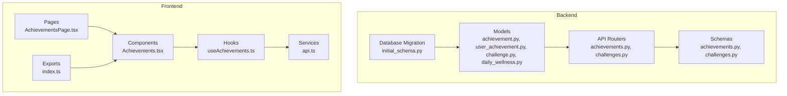
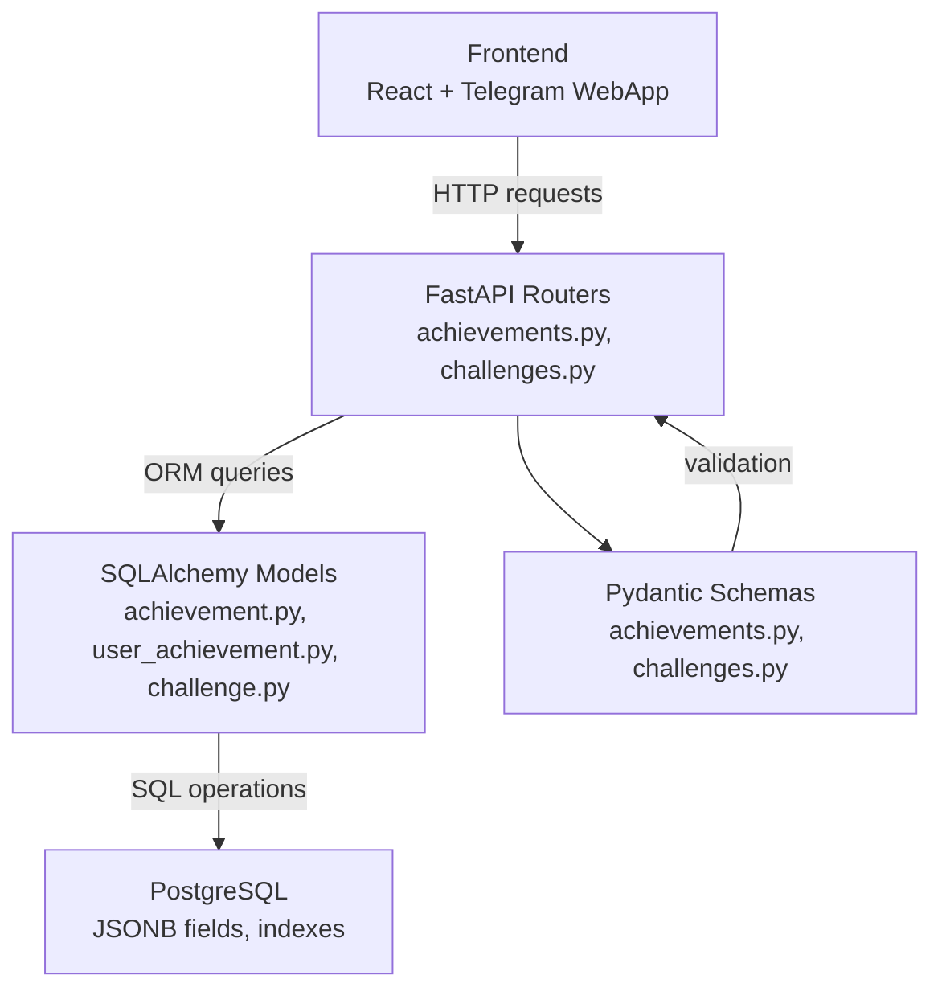
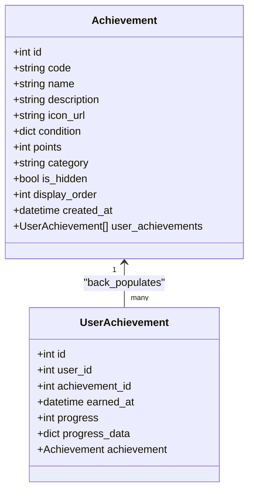
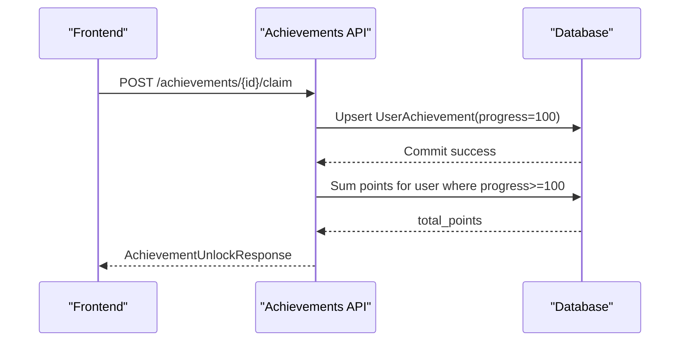
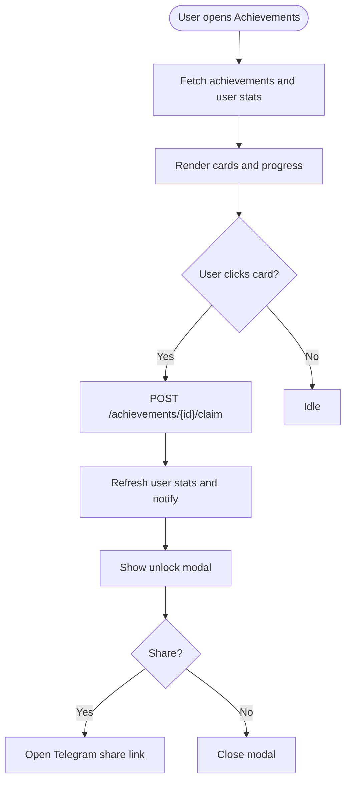
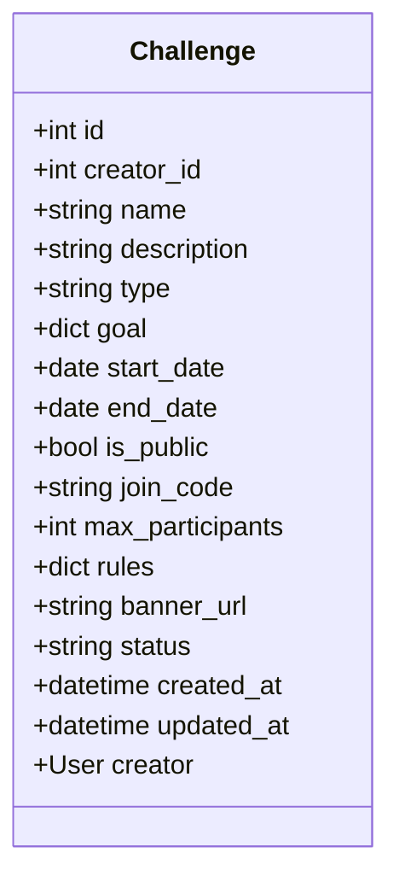
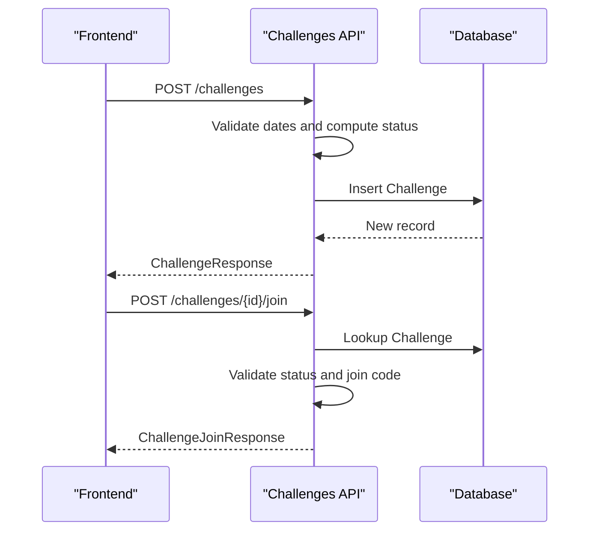
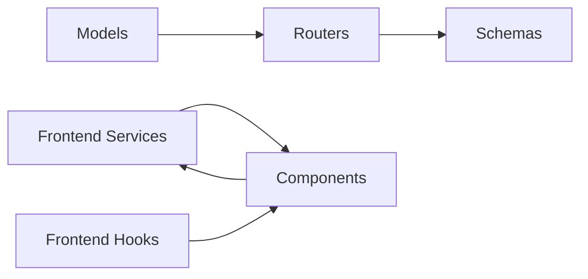

# Gamification & Achievement System

<cite>
**Referenced Files in This Document**
- [achievement.py](file://backend/app/models/achievement.py)
- [user_achievement.py](file://backend/app/models/user_achievement.py)
- [challenge.py](file://backend/app/models/challenge.py)
- [achievements.py](file://backend/app/api/achievements.py)
- [challenges.py](file://backend/app/api/challenges.py)
- [achievements.py](file://backend/app/schemas/achievements.py)
- [challenges.py](file://backend/app/schemas/challenges.py)
- [Achievements.tsx](file://frontend/src/components/gamification/Achievements.tsx)
- [useAchievements.ts](file://frontend/src/hooks/useAchievements.ts)
- [index.ts](file://frontend/src/components/gamification/index.ts)
- [AchievementsPage.tsx](file://frontend/src/pages/AchievementsPage.tsx)
- [api.ts](file://frontend/src/services/api.ts)
- [cd723942379e_initial_schema.py](file://database/migrations/versions/19cd723942379e_initial_schema.py)
- [daily_wellness.py](file://backend/app/models/daily_wellness.py)
</cite>

## Table of Contents
1. [Introduction](#introduction)
2. [Project Structure](#project-structure)
3. [Core Components](#core-components)
4. [Architecture Overview](#architecture-overview)
5. [Detailed Component Analysis](#detailed-component-analysis)
6. [Dependency Analysis](#dependency-analysis)
7. [Performance Considerations](#performance-considerations)
8. [Troubleshooting Guide](#troubleshooting-guide)
9. [Conclusion](#conclusion)
10. [Appendices](#appendices)

## Introduction
This document explains the gamification and achievement system implemented in Fit Tracker Pro. It covers the achievement creation workflow, criteria definition, progress tracking, and the challenge platform including creation, participation tracking, and leaderboards. It also documents the backend API endpoints for achievement management, user progress updates, and challenge administration, along with frontend gamification components for achievement display, progress visualization, and challenge participation. Implementation specifics include achievement unlocking conditions, point systems, streak tracking, and social features. Examples demonstrate achievement configuration, user progress monitoring, challenge participation, and gamification integration patterns.

## Project Structure
The gamification system spans backend models and APIs, frontend components and hooks, and database migrations/schema definitions. The backend uses FastAPI with SQLAlchemy ORM, while the frontend is a React application using TypeScript and Telegram WebApp integration.

**Diagram sources**
- [achievement.py:17-105](file://backend/app/models/achievement.py#L17-L105)
- [user_achievement.py:18-71](file://backend/app/models/user_achievement.py#L18-L71)
- [challenge.py:17-138](file://backend/app/models/challenge.py#L17-L138)
- [daily_wellness.py:17-118](file://backend/app/models/daily_wellness.py#L17-L118)
- [achievements.py:25-420](file://backend/app/api/achievements.py#L25-L420)
- [challenges.py:32-497](file://backend/app/api/challenges.py#L32-L497)
- [achievements.py:10-81](file://backend/app/schemas/achievements.py#L10-L81)
- [challenges.py:10-134](file://backend/app/schemas/challenges.py#L10-L134)
- [Achievements.tsx:626-800](file://frontend/src/components/gamification/Achievements.tsx#L626-L800)
- [useAchievements.ts:67-278](file://frontend/src/hooks/useAchievements.ts#L67-L278)
- [AchievementsPage.tsx:11-28](file://frontend/src/pages/AchievementsPage.tsx#L11-L28)
- [api.ts:1-69](file://frontend/src/services/api.ts#L1-L69)
- [cd723942379e_initial_schema.py:234-345](file://database/migrations/versions/19cd723942379e_initial_schema.py#L234-L345)

**Section sources**
- [achievement.py:17-105](file://backend/app/models/achievement.py#L17-L105)
- [challenge.py:17-138](file://backend/app/models/challenge.py#L17-L138)
- [Achievements.tsx:626-800](file://frontend/src/components/gamification/Achievements.tsx#L626-L800)
- [useAchievements.ts:67-278](file://frontend/src/hooks/useAchievements.ts#L67-L278)
- [cd723942379e_initial_schema.py:234-345](file://database/migrations/versions/19cd723942379e_initial_schema.py#L234-L345)

## Core Components
- Backend Achievement Model: Defines achievement metadata, unlock conditions, points, category, and hidden status.
- Backend User Achievement Association: Tracks user-specific progress and completion timestamps.
- Backend Challenge Model: Supports challenge creation, goals, rules, join codes, and status lifecycle.
- Frontend Achievements Component: Renders achievement cards, progress bars, unlock modals, and profile showcases.
- Frontend useAchievements Hook: Centralizes fetching, progress checking, claiming, and notifications.
- Database Schema: Provides indexes and default achievements for immediate functionality.

Key implementation highlights:
- Flexible achievement conditions stored as JSONB for extensibility.
- User progress tracked per achievement with percentage and optional structured progress data.
- Challenges support public/private join codes, participant limits, and rule sets.
- Frontend integrates Telegram WebApp haptic feedback and sharing.

**Section sources**
- [achievement.py:17-105](file://backend/app/models/achievement.py#L17-L105)
- [user_achievement.py:18-71](file://backend/app/models/user_achievement.py#L18-L71)
- [challenge.py:17-138](file://backend/app/models/challenge.py#L17-L138)
- [Achievements.tsx:26-71](file://frontend/src/components/gamification/Achievements.tsx#L26-L71)
- [useAchievements.ts:67-278](file://frontend/src/hooks/useAchievements.ts#L67-L278)
- [cd723942379e_initial_schema.py:425-445](file://database/migrations/versions/19cd723942379e_initial_schema.py#L425-L445)

## Architecture Overview
The gamification system follows a layered architecture:
- Data Access Layer: SQLAlchemy models define entities and relationships.
- Business Logic Layer: FastAPI routers expose endpoints for achievements and challenges.
- Presentation Layer: React components render UI and manage user interactions.
- Persistence Layer: PostgreSQL with JSONB fields for flexible criteria and progress data.

**Diagram sources**
- [achievements.py:25-420](file://backend/app/api/achievements.py#L25-L420)
- [challenges.py:32-497](file://backend/app/api/challenges.py#L32-L497)
- [achievement.py:17-105](file://backend/app/models/achievement.py#L17-L105)
- [user_achievement.py:18-71](file://backend/app/models/user_achievement.py#L18-L71)
- [challenge.py:17-138](file://backend/app/models/challenge.py#L17-L138)
- [achievements.py:10-81](file://backend/app/schemas/achievements.py#L10-L81)
- [challenges.py:10-134](file://backend/app/schemas/challenges.py#L10-L134)

## Detailed Component Analysis

### Achievement System

#### Backend Models and API
- Achievement model fields include code, name, description, icon URL, condition (JSONB), points, category, hidden flag, display order, and timestamps.
- UserAchievement tracks user_id, achievement_id, earned_at, progress (0–100), and progress_data (JSONB).
- Achievement endpoints:
  - GET /achievements: List available achievements with optional category filter.
  - GET /achievements/user: Retrieve current user’s achievements with totals and recent unlocks.
  - GET /achievements/user/{achievement_id}: Get specific user achievement details.
  - POST /achievements/{achievement_id}/claim: Claim an achievement (placeholder logic currently auto-unlocks).
  - GET /achievements/leaderboard: Top users by points and user rank.

**Diagram sources**
- [achievement.py:17-105](file://backend/app/models/achievement.py#L17-L105)
- [user_achievement.py:18-71](file://backend/app/models/user_achievement.py#L18-L71)

**Diagram sources**
- [achievements.py:216-310](file://backend/app/api/achievements.py#L216-L310)

Implementation specifics:
- Unlock logic currently auto-completes achievements for demonstration; future versions should evaluate condition criteria against user data.
- Leaderboard aggregates points per user and computes rank by sum of achievement points.
- Categories supported include workouts, health, streaks, social, and general.

**Section sources**
- [achievement.py:17-105](file://backend/app/models/achievement.py#L17-L105)
- [user_achievement.py:18-71](file://backend/app/models/user_achievement.py#L18-L71)
- [achievements.py:25-420](file://backend/app/api/achievements.py#L25-L420)
- [achievements.py:10-81](file://backend/app/schemas/achievements.py#L10-L81)

#### Frontend Achievement Components
- Achievements component renders:
  - Achievement cards with icons, progress bars, and unlock badges.
  - Category filtering and compact profile showcase.
  - Achievement unlock modal with animations and Telegram sharing.
- useAchievements hook manages:
  - Fetching achievements and user stats.
  - Claiming achievements and notifying subscribers.
  - Polling for new unlocks and maintaining state.

**Diagram sources**
- [Achievements.tsx:655-744](file://frontend/src/components/gamification/Achievements.tsx#L655-L744)
- [useAchievements.ts:129-153](file://frontend/src/hooks/useAchievements.ts#L129-L153)

**Section sources**
- [Achievements.tsx:626-800](file://frontend/src/components/gamification/Achievements.tsx#L626-L800)
- [useAchievements.ts:67-278](file://frontend/src/hooks/useAchievements.ts#L67-L278)
- [AchievementsPage.tsx:11-28](file://frontend/src/pages/AchievementsPage.tsx#L11-L28)
- [api.ts:1-69](file://frontend/src/services/api.ts#L1-L69)

### Challenge Platform

#### Backend Models and API
- Challenge model supports:
  - Creator relationship, name, description, type (workout_count, duration, calories, distance, custom), goal (JSONB), dates, visibility, join code, max participants, rules (JSONB), banner, and status.
  - Indexes for efficient querying by status, type, dates, and join code.
- Challenge endpoints:
  - GET /challenges: Filterable list with pagination and enrichment with creator names.
  - GET /challenges/{id}: Detailed view with placeholders for participants and user progress.
  - POST /challenges: Create challenge with automatic status determination and join code generation for private challenges.
  - POST /challenges/{id}/join: Join challenge with code validation for private challenges.
  - POST /challenges/{id}/leave: Leave challenge (placeholder).
  - GET /challenges/{id}/leaderboard: Leaderboard endpoint (placeholder).
  - GET /challenges/my/active: Active challenges for current user (placeholder).

**Diagram sources**
- [challenge.py:17-138](file://backend/app/models/challenge.py#L17-L138)

**Diagram sources**
- [challenges.py:215-314](file://backend/app/api/challenges.py#L215-L314)
- [challenges.py:317-394](file://backend/app/api/challenges.py#L317-L394)

Implementation specifics:
- Status is derived from start/end dates; join code is generated for private challenges.
- Leaderboard and participant tracking are placeholders awaiting participant table integration.
- Pagination and filtering are supported for challenge listings.

**Section sources**
- [challenge.py:17-138](file://backend/app/models/challenge.py#L17-L138)
- [challenges.py:32-497](file://backend/app/api/challenges.py#L32-L497)
- [challenges.py:10-134](file://backend/app/schemas/challenges.py#L10-L134)

#### Frontend Challenge Integration
- Achievements component integrates with challenge data via API service and schemas.
- Pages and exports provide navigation and component exposure for gamification features.

**Section sources**
- [Achievements.tsx:626-800](file://frontend/src/components/gamification/Achievements.tsx#L626-L800)
- [index.ts:5-18](file://frontend/src/components/gamification/index.ts#L5-L18)
- [api.ts:1-69](file://frontend/src/services/api.ts#L1-L69)

### Streak Tracking and Wellness
- DailyWellness model captures sleep scores, energy levels, pain zones, stress, mood, and notes, enabling health-based achievements and streaks.
- Achievement defaults include wellness logging and sleep mastery criteria.

**Section sources**
- [daily_wellness.py:17-118](file://backend/app/models/daily_wellness.py#L17-L118)
- [cd723942379e_initial_schema.py:425-445](file://database/migrations/versions/19cd723942379e_initial_schema.py#L425-L445)

## Dependency Analysis
- Backend:
  - Models depend on SQLAlchemy declarative base and define foreign keys and indexes.
  - Routers depend on middleware for authentication and on schemas for request/response validation.
  - Schemas define Pydantic models for JSON serialization and validation.
- Frontend:
  - Components depend on hooks and services for API communication.
  - Hooks encapsulate state and side effects, exposing typed interfaces.

**Diagram sources**
- [achievement.py:17-105](file://backend/app/models/achievement.py#L17-L105)
- [user_achievement.py:18-71](file://backend/app/models/user_achievement.py#L18-L71)
- [challenge.py:17-138](file://backend/app/models/challenge.py#L17-L138)
- [achievements.py:25-420](file://backend/app/api/achievements.py#L25-L420)
- [challenges.py:32-497](file://backend/app/api/challenges.py#L32-L497)
- [Achievements.tsx:626-800](file://frontend/src/components/gamification/Achievements.tsx#L626-L800)
- [useAchievements.ts:67-278](file://frontend/src/hooks/useAchievements.ts#L67-L278)
- [api.ts:1-69](file://frontend/src/services/api.ts#L1-L69)

**Section sources**
- [achievements.py:25-420](file://backend/app/api/achievements.py#L25-L420)
- [challenges.py:32-497](file://backend/app/api/challenges.py#L32-L497)
- [Achievements.tsx:626-800](file://frontend/src/components/gamification/Achievements.tsx#L626-L800)
- [useAchievements.ts:67-278](file://frontend/src/hooks/useAchievements.ts#L67-L278)

## Performance Considerations
- Database indexing:
  - Achievements: code, category, condition (GIN), display_order.
  - UserAchievements: user_id, achievement_id, earned_at, progress_data (GIN).
  - Challenges: creator_id, type, start_date, end_date, is_public, status, join_code.
  - DailyWellness: user_id, date, user_date unique, sleep_score, energy_score.
- Query optimization:
  - Use filtered indexes and appropriate WHERE clauses for leaderboard and challenge queries.
  - Paginate challenge lists and limit leaderboard sizes.
- Frontend:
  - Debounce and throttle API calls; cache user stats and achievements.
  - Use background polling intervals judiciously to avoid excessive network usage.

[No sources needed since this section provides general guidance]

## Troubleshooting Guide
Common issues and resolutions:
- Achievement not found:
  - Verify achievement_id exists and belongs to the current user for user-specific endpoints.
- Join code invalid:
  - Ensure private challenges require correct join code; confirm challenge status allows joining.
- Leaderboard returns empty:
  - Confirm participant tracking is implemented and user progress is recorded.
- Frontend not rendering unlocks:
  - Check API token presence and ensure unlock modal receives achievement data.

**Section sources**
- [achievements.py:174-214](file://backend/app/api/achievements.py#L174-L214)
- [challenges.py:317-394](file://backend/app/api/challenges.py#L317-L394)
- [useAchievements.ts:129-153](file://frontend/src/hooks/useAchievements.ts#L129-L153)

## Conclusion
The gamification and achievement system provides a robust foundation for engagement through achievements, points, and streaks, alongside a flexible challenge platform. The backend offers scalable models and endpoints, while the frontend delivers interactive UI with real-time notifications and social sharing. Future enhancements should focus on implementing dynamic achievement criteria evaluation, participant tracking for challenges, and richer leaderboard analytics.

[No sources needed since this section summarizes without analyzing specific files]

## Appendices

### API Endpoints Summary
- Achievements:
  - GET /achievements
  - GET /achievements/user
  - GET /achievements/user/{achievement_id}
  - POST /achievements/{achievement_id}/claim
  - GET /achievements/leaderboard
- Challenges:
  - GET /challenges
  - GET /challenges/{id}
  - POST /challenges
  - POST /challenges/{id}/join
  - POST /challenges/{id}/leave
  - GET /challenges/{id}/leaderboard
  - GET /challenges/my/active

**Section sources**
- [achievements.py:25-420](file://backend/app/api/achievements.py#L25-L420)
- [challenges.py:32-497](file://backend/app/api/challenges.py#L32-L497)

### Achievement Configuration Examples
- Example condition types:
  - workout_count: target number of workouts.
  - streak_days: consecutive days.
  - calories_burned: total calories burned.
  - glucose_logs: number of glucose measurements.
  - wellness_streak: consecutive days of wellness logging.
  - sleep_score: achieving high sleep scores multiple times.
- Point values and categories:
  - Lower-tier achievements award fewer points; legendary achievements award significant points.
  - Categories: workouts, health, streaks, social, general.

**Section sources**
- [cd723942379e_initial_schema.py:425-445](file://database/migrations/versions/19cd723942379e_initial_schema.py#L425-L445)
- [achievement.py:48-69](file://backend/app/models/achievement.py#L48-L69)

### User Progress Monitoring Patterns
- Frontend:
  - useAchievements hook periodically checks for new unlocks and updates local state.
  - Achievement cards display progress bars and completion badges.
- Backend:
  - UserAchievement progress is stored as percentage with optional structured data.
  - Leaderboard aggregates points per user and ranks by total points.

**Section sources**
- [useAchievements.ts:200-240](file://frontend/src/hooks/useAchievements.ts#L200-L240)
- [Achievements.tsx:342-358](file://frontend/src/components/gamification/Achievements.tsx#L342-L358)
- [achievements.py:312-420](file://backend/app/api/achievements.py#L312-L420)

### Challenge Participation Patterns
- Creation:
  - Define goal, type, dates, visibility, and rules; join code auto-generated for private challenges.
- Participation:
  - Public challenges are joinable without code; private challenges require join code.
  - Participants and progress tracking are placeholders awaiting participant table integration.
- Leaderboard:
  - Placeholder endpoint returns empty entries; future implementation will compute rankings.

**Section sources**
- [challenges.py:215-314](file://backend/app/api/challenges.py#L215-L314)
- [challenges.py:317-394](file://backend/app/api/challenges.py#L317-L394)
- [challenges.py:426-480](file://backend/app/api/challenges.py#L426-L480)