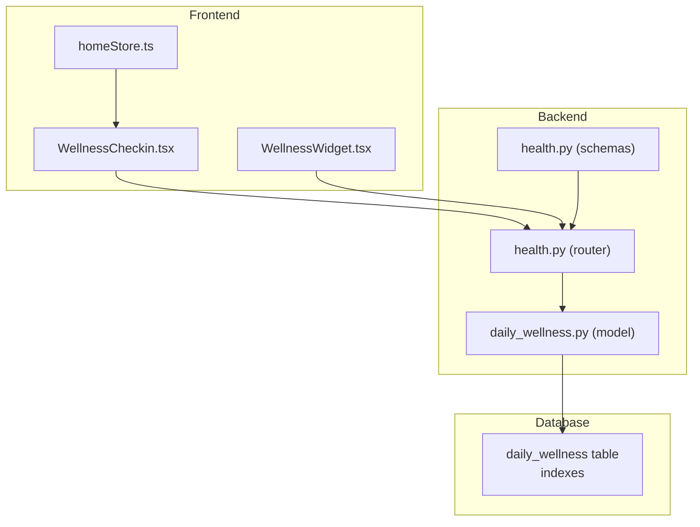
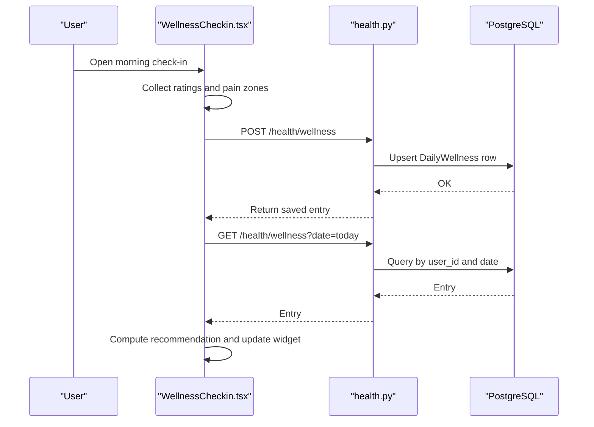
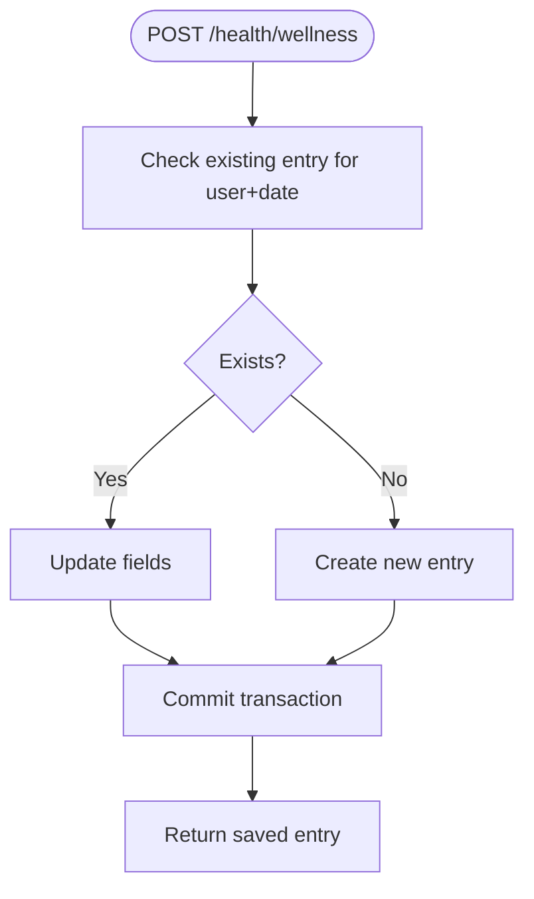
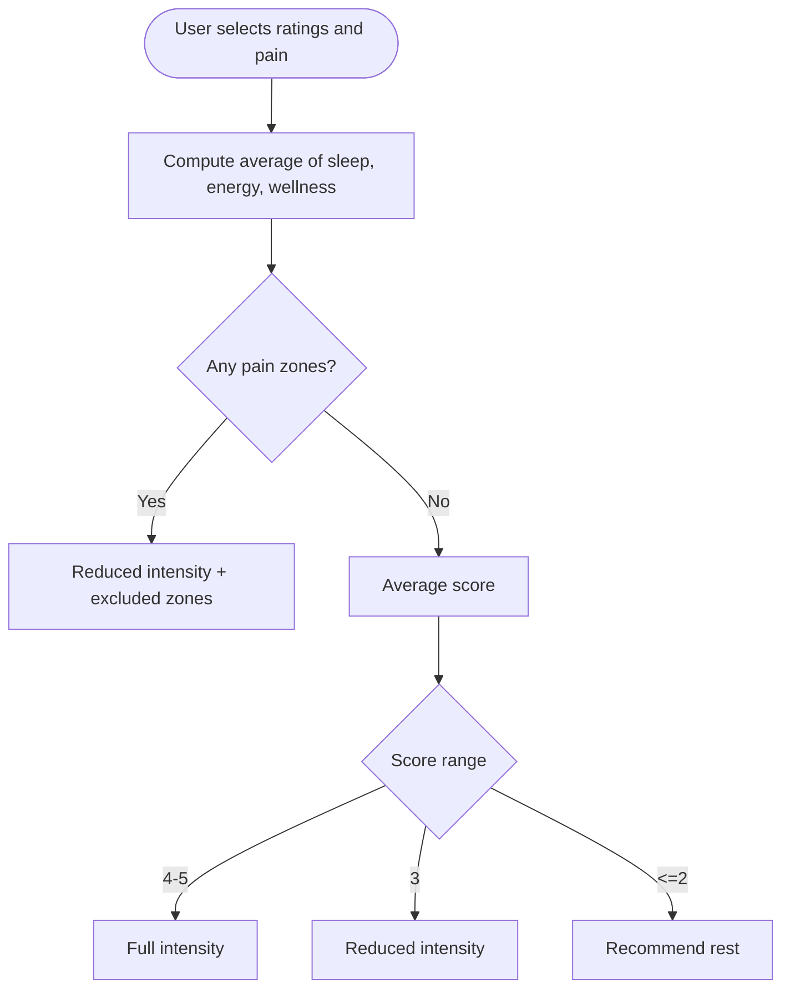
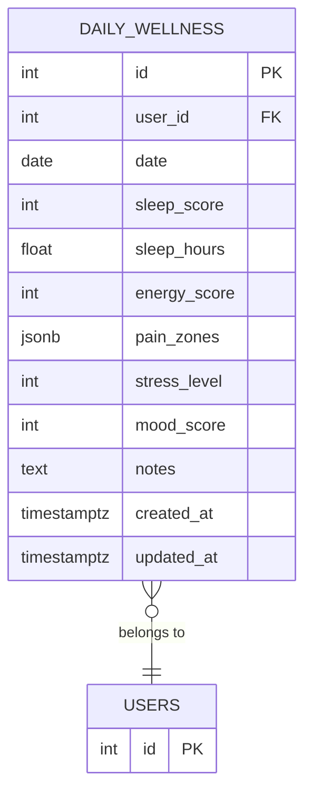
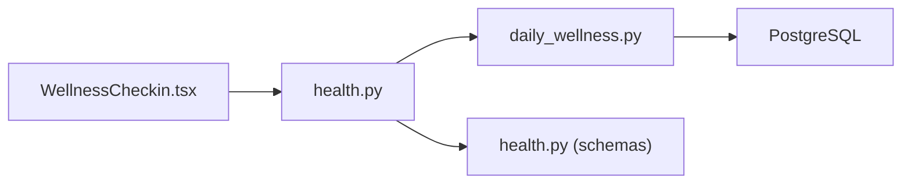

# Daily Wellness Check-ins

<cite>
**Referenced Files in This Document**
- [README.md](file://README.md)
- [daily_wellness.py](file://backend/app/models/daily_wellness.py)
- [health.py](file://backend/app/api/health.py)
- [health.py](file://backend/app/schemas/health.py)
- [WellnessCheckin.tsx](file://frontend/src/components/health/WellnessCheckin.tsx)
- [WellnessWidget.tsx](file://frontend/src/components/home/WellnessWidget.tsx)
- [homeStore.ts](file://frontend/src/stores/homeStore.ts)
- [cd723942379e_initial_schema.py](file://database/migrations/versions/cd723942379e_initial_schema.py)
</cite>

## Table of Contents
1. [Introduction](#introduction)
2. [Project Structure](#project-structure)
3. [Core Components](#core-components)
4. [Architecture Overview](#architecture-overview)
5. [Detailed Component Analysis](#detailed-component-analysis)
6. [Dependency Analysis](#dependency-analysis)
7. [Performance Considerations](#performance-considerations)
8. [Troubleshooting Guide](#troubleshooting-guide)
9. [Conclusion](#conclusion)
10. [Appendices](#appendices)

## Introduction
This document describes the daily wellness check-in system that powers self-reported health tracking and workout readiness recommendations. It covers the wellness assessment workflow (mood tracking, energy levels, sleep quality, and pain tracking), backend API endpoints for capturing and analyzing wellness data, and the frontend component that provides an interactive rating system, pain selection, and progress visualization. It also documents the wellness scoring algorithms, weekly/monthly trend computation, and integration with workout recommendations. Finally, it outlines data retention considerations, privacy options, and health dashboard integration.

## Project Structure
The wellness system spans three layers:
- Backend: FastAPI routes and SQLAlchemy models for storing and retrieving wellness entries and computing health statistics.
- Database: PostgreSQL schema with indexes optimized for wellness queries.
- Frontend: React components for the morning check-in modal, history view, widget, and integration with workout recommendations.

**Diagram sources**
- [WellnessCheckin.tsx:871-1136](file://frontend/src/components/health/WellnessCheckin.tsx#L871-L1136)
- [WellnessWidget.tsx:43-82](file://frontend/src/components/home/WellnessWidget.tsx#L43-L82)
- [homeStore.ts:147-205](file://frontend/src/stores/homeStore.ts#L147-L205)
- [health.py:259-407](file://backend/app/api/health.py#L259-L407)
- [health.py:66-96](file://backend/app/schemas/health.py#L66-L96)
- [daily_wellness.py:17-118](file://backend/app/models/daily_wellness.py#L17-L118)
- [cd723942379e_initial_schema.py:198-232](file://database/migrations/versions/cd723942379e_initial_schema.py#L198-L232)

**Section sources**
- [README.md:1-237](file://README.md#L1-L237)

## Core Components
- Backend wellness API:
  - Create/update wellness entry (/health/wellness)
  - Retrieve wellness history (/health/wellness with filters)
  - Retrieve single entry (/health/wellness/{entry_id})
  - Compute health statistics including wellness averages (/health/stats)
- Frontend wellness component:
  - Interactive sliders for sleep, energy, and overall wellness
  - Pain zones selector with haptic feedback
  - Recommendation engine based on ratings and pain
  - History view with weekly/monthly filtering
  - Widget summarizing current day’s wellness
- Data model:
  - DailyWellness table with scores, pain zones, and timestamps
  - Pydantic schemas for request/response validation

**Section sources**
- [health.py:259-407](file://backend/app/api/health.py#L259-L407)
- [health.py:66-96](file://backend/app/schemas/health.py#L66-L96)
- [daily_wellness.py:17-118](file://backend/app/models/daily_wellness.py#L17-L118)
- [WellnessCheckin.tsx:215-223](file://frontend/src/components/health/WellnessCheckin.tsx#L215-L223)
- [WellnessCheckin.tsx:871-1136](file://frontend/src/components/health/WellnessCheckin.tsx#L871-L1136)
- [WellnessWidget.tsx:43-82](file://frontend/src/components/home/WellnessWidget.tsx#L43-L82)

## Architecture Overview
The wellness workflow connects frontend interactions to backend persistence and analytics.

**Diagram sources**
- [WellnessCheckin.tsx:927-976](file://frontend/src/components/health/WellnessCheckin.tsx#L927-L976)
- [health.py:259-337](file://backend/app/api/health.py#L259-L337)
- [daily_wellness.py:17-118](file://backend/app/models/daily_wellness.py#L17-L118)

## Detailed Component Analysis

### Backend Wellness API
- Endpoint: POST /health/wellness
  - Accepts wellness data including date, sleep_score, sleep_hours, energy_score, pain_zones, stress_level, mood_score, notes
  - Validates existence for the user/date and updates or creates accordingly
- Endpoint: GET /health/wellness
  - Returns paginated history with optional date_from/date_to and limit
- Endpoint: GET /health/wellness/{entry_id}
  - Retrieves a specific entry by ID with ownership check
- Endpoint: GET /health/stats
  - Computes wellness averages for 7-day and 30-day windows (avg_sleep_score, avg_energy_score, avg_sleep_hours)

**Diagram sources**
- [health.py:295-337](file://backend/app/api/health.py#L295-L337)

**Section sources**
- [health.py:259-407](file://backend/app/api/health.py#L259-L407)
- [health.py:66-96](file://backend/app/schemas/health.py#L66-L96)

### Frontend Wellness Component
- Interactive rating system:
  - Sliders for sleep, energy, and overall wellness with emoji/rating labels
  - Real-time conversion between 1–5 ratings and 0–100 scores
- Pain zones selector:
  - Grid of body zones; toggles presence of pain
- Recommendation engine:
  - Computes average of three scores; applies rules for rest/reduced/full activity
  - Excludes exercises overlapping with painful zones
- History view:
  - Filters by week/month; shows averaged sleep and energy ratings
- Widget:
  - Summarizes today’s energy rating and status (ready/rest/pain)

**Diagram sources**
- [WellnessCheckin.tsx:164-192](file://frontend/src/components/health/WellnessCheckin.tsx#L164-L192)

**Section sources**
- [WellnessCheckin.tsx:215-223](file://frontend/src/components/health/WellnessCheckin.tsx#L215-L223)
- [WellnessCheckin.tsx:871-1136](file://frontend/src/components/health/WellnessCheckin.tsx#L871-L1136)
- [WellnessWidget.tsx:43-82](file://frontend/src/components/home/WellnessWidget.tsx#L43-L82)

### Data Model and Schema
- DailyWellness model fields:
  - user_id, date, sleep_score (0–100), sleep_hours (optional), energy_score (0–100), pain_zones (JSON), stress_level (0–10), mood_score (0–100), notes, timestamps
- Indexes:
  - user_id, date, sleep_score, energy_score, unique(user_id, date)
- Pydantic schemas:
  - DailyWellnessCreate and DailyWellnessResponse define request/response shapes and validations

**Diagram sources**
- [daily_wellness.py:17-118](file://backend/app/models/daily_wellness.py#L17-L118)
- [cd723942379e_initial_schema.py:198-232](file://database/migrations/versions/cd723942379e_initial_schema.py#L198-L232)

**Section sources**
- [daily_wellness.py:17-118](file://backend/app/models/daily_wellness.py#L17-L118)
- [health.py:66-96](file://backend/app/schemas/health.py#L66-L96)
- [cd723942379e_initial_schema.py:198-232](file://database/migrations/versions/cd723942379e_initial_schema.py#L198-L232)

### Wellness Scoring and Trends
- Scoring conversions:
  - convertRatingToScore: 1–5 → 0–100
  - convertScoreToRating: 0–100 → 1–5
- Weekly/monthly trends:
  - Frontend computes averages for sleep and energy over filtered periods
  - Backend aggregates wellness averages for 7d/30d windows via /health/stats
- Recommendations:
  - Average of three scores determines intensity modifier and excluded zones
  - Pain zones override intensity rules

**Section sources**
- [WellnessCheckin.tsx:654-664](file://frontend/src/components/health/WellnessCheckin.tsx#L654-L664)
- [WellnessCheckin.tsx:1094-1112](file://frontend/src/components/health/WellnessCheckin.tsx#L1094-L1112)
- [health.py:570-606](file://backend/app/api/health.py#L570-L606)

### Health Pattern Recognition and Insights
- Backend health statistics endpoint consolidates:
  - Glucose averages and in-range percentage
  - Workout counts, durations, and favorites
  - Wellness averages (sleep, energy, sleep hours)
- Frontend can present:
  - Averages for sleep and energy over 7-day window
  - Trend indicators in the widget/history view

**Section sources**
- [health.py:409-614](file://backend/app/api/health.py#L409-L614)
- [WellnessCheckin.tsx:1088-1113](file://frontend/src/components/health/WellnessCheckin.tsx#L1088-L1113)

### Integration with Workout Recommendations
- Hook useWellnessForWorkout:
  - Fetches today’s wellness entry
  - Derives recommendation (full/reduced/rest) and intensity modifier
  - Provides shouldExcludeExercise to filter risky exercises based on pain zones
- Frontend WellnessCheckin:
  - Presents recommendation card with intensity and excluded zones
  - Updates widget status based on today’s entry

**Section sources**
- [WellnessCheckin.tsx:1142-1204](file://frontend/src/components/health/WellnessCheckin.tsx#L1142-L1204)
- [WellnessCheckin.tsx:368-418](file://frontend/src/components/health/WellnessCheckin.tsx#L368-L418)

### Data Retention and Privacy
- Data retention:
  - No explicit retention policy is implemented in the referenced files; historical wellness data is returned via GET /health/wellness with limit and date filters
- Anonymous reporting:
  - No anonymous mode is implemented; endpoints require authentication and associate data with the current user
- Health dashboard integration:
  - Stats endpoint (/health/stats) exposes wellness averages suitable for dashboard widgets

**Section sources**
- [health.py:339-378](file://backend/app/api/health.py#L339-L378)
- [health.py:409-614](file://backend/app/api/health.py#L409-L614)

## Dependency Analysis
- Frontend depends on:
  - API endpoints for wellness creation, retrieval, and stats
  - Utility functions for score conversion and recommendation logic
- Backend depends on:
  - DailyWellness model and SQLAlchemy ORM
  - Pydantic schemas for validation
- Database depends on:
  - Well-defined indexes for user_id, date, and scores to support efficient queries

**Diagram sources**
- [WellnessCheckin.tsx:871-1136](file://frontend/src/components/health/WellnessCheckin.tsx#L871-L1136)
- [health.py:259-407](file://backend/app/api/health.py#L259-L407)
- [daily_wellness.py:17-118](file://backend/app/models/daily_wellness.py#L17-L118)
- [health.py:66-96](file://backend/app/schemas/health.py#L66-L96)

**Section sources**
- [WellnessCheckin.tsx:871-1136](file://frontend/src/components/health/WellnessCheckin.tsx#L871-L1136)
- [health.py:259-407](file://backend/app/api/health.py#L259-L407)
- [daily_wellness.py:17-118](file://backend/app/models/daily_wellness.py#L17-L118)

## Performance Considerations
- Backend:
  - Indexes on user_id, date, sleep_score, energy_score reduce query cost for history and stats
  - Aggregation queries compute averages efficiently using SQL functions
- Frontend:
  - Memoization of recommendation and averages prevents unnecessary re-computation
  - Pagination via limit reduces payload sizes for history endpoints

[No sources needed since this section provides general guidance]

## Troubleshooting Guide
- Common issues:
  - Unauthorized access: Ensure authentication header is included for protected endpoints
  - Validation errors: Verify score ranges and required fields match schema constraints
  - Missing data: Confirm date filters and user association when querying history
- Debugging tips:
  - Use API docs to test endpoints and inspect request/response shapes
  - Inspect recommendation logic and score conversions in the frontend component
  - Check database indexes if queries appear slow

**Section sources**
- [health.py:259-407](file://backend/app/api/health.py#L259-L407)
- [health.py:66-96](file://backend/app/schemas/health.py#L66-L96)
- [WellnessCheckin.tsx:215-223](file://frontend/src/components/health/WellnessCheckin.tsx#L215-L223)

## Conclusion
The wellness check-in system integrates a robust backend API with a responsive frontend component to collect daily self-reports, derive actionable recommendations, and visualize trends. The modular design supports future enhancements such as extended metrics, advanced analytics, and deeper workout integration.

[No sources needed since this section summarizes without analyzing specific files]

## Appendices

### API Reference: Wellness Endpoints
- POST /api/v1/health/wellness
  - Description: Create or update a daily wellness entry
  - Request fields: date, sleep_score, sleep_hours, energy_score, pain_zones, stress_level, mood_score, notes
  - Response: Saved entry
- GET /api/v1/health/wellness
  - Description: Retrieve wellness history
  - Query params: date_from, date_to, limit
  - Response: Array of entries
- GET /api/v1/health/wellness/{entry_id}
  - Description: Retrieve a specific entry by ID
  - Response: Entry
- GET /api/v1/health/stats
  - Description: Get health statistics summary including wellness averages
  - Query params: period (7d|30d|90d|1y)
  - Response: Stats object with wellness averages

**Section sources**
- [health.py:259-407](file://backend/app/api/health.py#L259-L407)
- [health.py:409-614](file://backend/app/api/health.py#L409-L614)

### Wellness Scoring and Conversion Functions
- convertRatingToScore(rating): 1–5 → 0–100
- convertScoreToRating(score): 0–100 → 1–5

**Section sources**
- [WellnessCheckin.tsx:215-223](file://frontend/src/components/health/WellnessCheckin.tsx#L215-L223)

### Example Workflows
- Wellness data entry:
  - User opens morning check-in modal, selects ratings and pain zones, submits
  - Backend upserts entry; frontend updates widget and recommendation
- Automated insights:
  - Frontend computes weekly averages; backend aggregates 7d/30d wellness averages
- Integration with workout recommendations:
  - Hook derives recommendation and intensity modifier; frontend shows recommendation card and excludes risky exercises

**Section sources**
- [WellnessCheckin.tsx:927-976](file://frontend/src/components/health/WellnessCheckin.tsx#L927-L976)
- [WellnessCheckin.tsx:1094-1112](file://frontend/src/components/health/WellnessCheckin.tsx#L1094-L1112)
- [WellnessCheckin.tsx:1142-1204](file://frontend/src/components/health/WellnessCheckin.tsx#L1142-L1204)