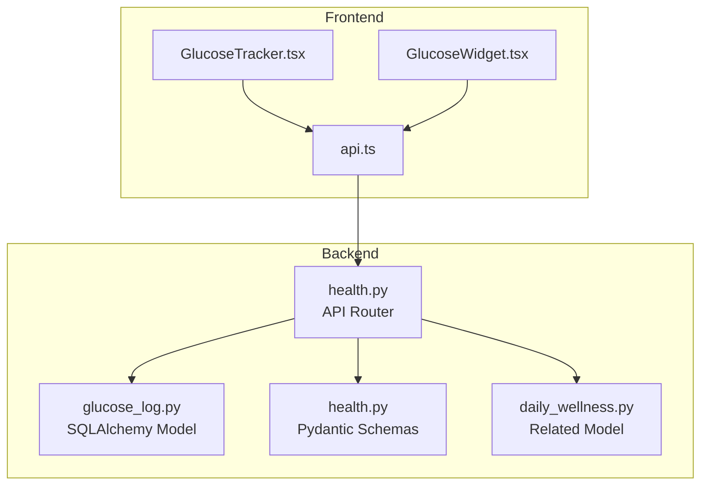
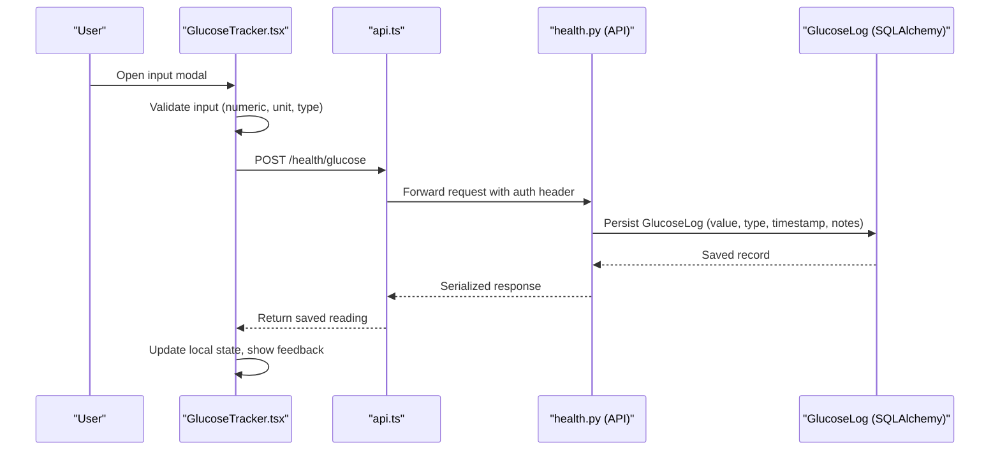
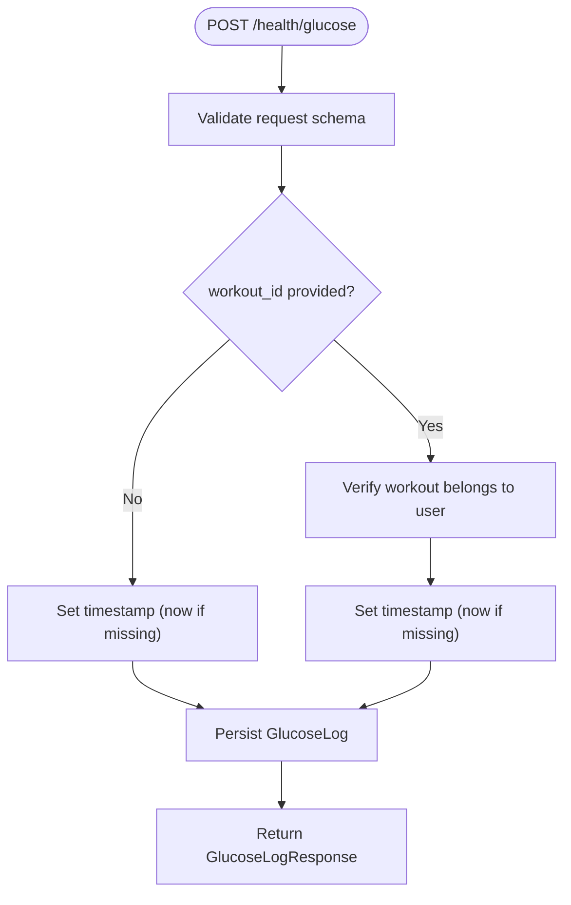
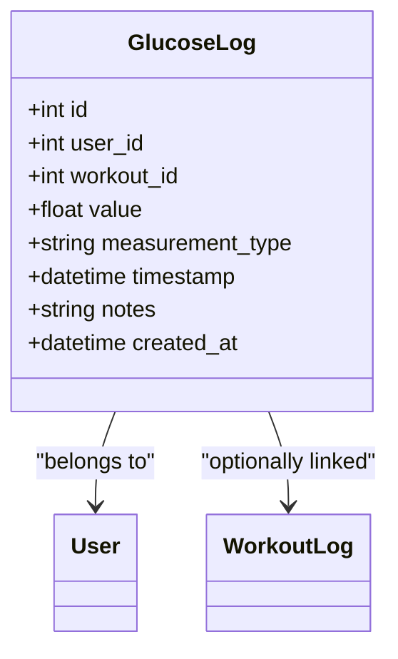
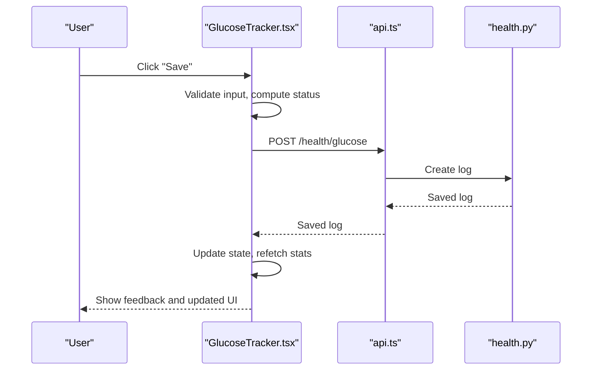
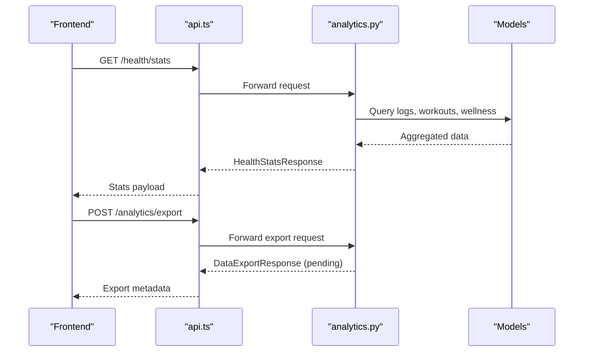
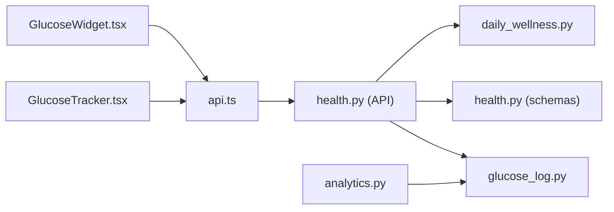

# Glucose Tracking

<cite>
**Referenced Files in This Document**
- [glucose_log.py](file://backend/app/models/glucose_log.py)
- [health.py](file://backend/app/api/health.py)
- [health.py](file://backend/app/schemas/health.py)
- [GlucoseTracker.tsx](file://frontend/src/components/health/GlucoseTracker.tsx)
- [GlucoseWidget.tsx](file://frontend/src/components/home/GlucoseWidget.tsx)
- [api.ts](file://frontend/src/services/api.ts)
- [analytics.py](file://backend/app/api/analytics.py)
- [daily_wellness.py](file://backend/app/models/daily_wellness.py)
</cite>

## Table of Contents
1. [Introduction](#introduction)
2. [Project Structure](#project-structure)
3. [Core Components](#core-components)
4. [Architecture Overview](#architecture-overview)
5. [Detailed Component Analysis](#detailed-component-analysis)
6. [Dependency Analysis](#dependency-analysis)
7. [Performance Considerations](#performance-considerations)
8. [Troubleshooting Guide](#troubleshooting-guide)
9. [Conclusion](#conclusion)
10. [Appendices](#appendices)

## Introduction
This document describes the glucose tracking system in FitTracker Pro. It covers how users log glucose levels via a mobile-first UI, how the backend validates and persists measurements, and how analytics and integrations surface insights. It also documents the frontend component’s input validation, real-time feedback, visual indicators, and integration with health analytics and export capabilities.

## Project Structure
The glucose tracking spans frontend and backend components:
- Frontend: A dedicated Glucose Tracker widget and modal for data entry, plus a compact home widget for quick access.
- Backend: An API router for glucose logs, supporting creation, retrieval, filtering, and statistics; SQLAlchemy models for persistence; Pydantic schemas for validation and serialization.

**Diagram sources**
- [GlucoseTracker.tsx:520-692](file://frontend/src/components/health/GlucoseTracker.tsx#L520-L692)
- [GlucoseWidget.tsx:41-84](file://frontend/src/components/home/GlucoseWidget.tsx#L41-L84)
- [api.ts:1-69](file://frontend/src/services/api.ts#L1-L69)
- [health.py:29-91](file://backend/app/api/health.py#L29-L91)
- [glucose_log.py:18-80](file://backend/app/models/glucose_log.py#L18-L80)
- [health.py:10-50](file://backend/app/schemas/health.py#L10-L50)
- [daily_wellness.py:17-118](file://backend/app/models/daily_wellness.py#L17-L118)

**Section sources**
- [GlucoseTracker.tsx:1-762](file://frontend/src/components/health/GlucoseTracker.tsx#L1-L762)
- [GlucoseWidget.tsx:1-85](file://frontend/src/components/home/GlucoseWidget.tsx#L1-L85)
- [api.ts:1-69](file://frontend/src/services/api.ts#L1-L69)
- [health.py:1-615](file://backend/app/api/health.py#L1-L615)
- [glucose_log.py:1-80](file://backend/app/models/glucose_log.py#L1-L80)
- [health.py:1-134](file://backend/app/schemas/health.py#L1-L134)
- [daily_wellness.py:1-118](file://backend/app/models/daily_wellness.py#L1-L118)

## Core Components
- GlucoseLog model defines the persisted structure for glucose measurements, including user association, optional workout linkage, value, type, timestamp, notes, and audit fields.
- Health API router exposes endpoints to create, retrieve, filter, and delete glucose logs, and to compute health statistics including glucose averages and in-range percentages.
- Frontend GlucoseTracker component provides a guided input modal, real-time status feedback, visual scale, and quick stats for recent readings.
- Frontend GlucoseWidget offers a compact, status-highlighted card for quick access to the latest reading.

Key responsibilities:
- Data entry: validated numeric input, unit toggle, measurement type selection, and notes.
- Validation: numeric constraints, unit conversion, and measurement type enumeration.
- Timestamp management: defaults to current time if none provided.
- Real-time feedback: status color, icon, and recommendation cards.
- Analytics integration: weekly stats and recent readings retrieval.

**Section sources**
- [glucose_log.py:18-80](file://backend/app/models/glucose_log.py#L18-L80)
- [health.py:29-91](file://backend/app/api/health.py#L29-L91)
- [health.py:93-199](file://backend/app/api/health.py#L93-L199)
- [health.py:409-615](file://backend/app/api/health.py#L409-L615)
- [GlucoseTracker.tsx:120-170](file://frontend/src/components/health/GlucoseTracker.tsx#L120-L170)
- [GlucoseTracker.tsx:320-514](file://frontend/src/components/health/GlucoseTracker.tsx#L320-L514)
- [GlucoseWidget.tsx:41-84](file://frontend/src/components/home/GlucoseWidget.tsx#L41-L84)

## Architecture Overview
The system follows a clean separation of concerns:
- Frontend components render UI, collect input, and call the backend API.
- Backend API validates requests, enforces authorization, and interacts with the database via SQLAlchemy.
- Responses are serialized using Pydantic models.

**Diagram sources**
- [GlucoseTracker.tsx:558-577](file://frontend/src/components/health/GlucoseTracker.tsx#L558-L577)
- [api.ts:52-54](file://frontend/src/services/api.ts#L52-L54)
- [health.py:29-91](file://backend/app/api/health.py#L29-L91)
- [glucose_log.py:18-80](file://backend/app/models/glucose_log.py#L18-L80)

## Detailed Component Analysis

### Backend API: Glucose Logs
Endpoints:
- POST /health/glucose: Creates a new glucose log with validation and optional workout linkage.
- GET /health/glucose: Retrieves paginated history with optional date filters and measurement type filter.
- GET /health/glucose/{log_id}: Retrieves a single log by ID.
- DELETE /health/glucose/{log_id}: Deletes a log by ID.
- GET /health/stats: Computes health statistics including glucose averages and in-range percentage.

Validation and constraints:
- Request schema enforces value bounds, measurement type enumeration, optional timestamp, and notes length.
- Workout ID is validated against the current user’s workouts.
- Timestamp defaults to current UTC time if not provided.

Analytics:
- Health stats endpoint computes average glucose over 7 and 30 days, counts, and in-range percentage (target range configurable).

**Diagram sources**
- [health.py:29-91](file://backend/app/api/health.py#L29-L91)
- [health.py:10-23](file://backend/app/schemas/health.py#L10-L23)

**Section sources**
- [health.py:29-91](file://backend/app/api/health.py#L29-L91)
- [health.py:93-199](file://backend/app/api/health.py#L93-L199)
- [health.py:202-257](file://backend/app/api/health.py#L202-L257)
- [health.py:409-615](file://backend/app/api/health.py#L409-L615)
- [health.py:10-50](file://backend/app/schemas/health.py#L10-L50)

### Backend Model: GlucoseLog
Fields and relationships:
- Identifiers, user foreign key, optional workout foreign key.
- Value stored as numeric with precision suitable for mmol/L.
- Measurement type enumeration.
- Timestamp with timezone support.
- Notes and audit timestamps.
- Composite indexes for efficient queries by user, workout, timestamp, and measurement type.

**Diagram sources**
- [glucose_log.py:18-80](file://backend/app/models/glucose_log.py#L18-L80)

**Section sources**
- [glucose_log.py:18-80](file://backend/app/models/glucose_log.py#L18-L80)

### Frontend Component: GlucoseTracker
Responsibilities:
- Input modal with numeric-only validation, unit toggle (mmol/L ↔ mg/dL), measurement type selection, and notes.
- Real-time status feedback using visual scale and recommendation cards.
- Fetch and display weekly stats and recent readings.
- Integration with workout context via optional workout_id prop.

Key UI behaviors:
- Input validation prevents invalid characters and enforces positive numeric values.
- Unit conversion updates the numeric field during toggle.
- Status classification drives color, icon, and recommendation messaging.
- Visual scale highlights current value against predefined ranges.

**Diagram sources**
- [GlucoseTracker.tsx:320-514](file://frontend/src/components/health/GlucoseTracker.tsx#L320-L514)
- [GlucoseTracker.tsx:558-577](file://frontend/src/components/health/GlucoseTracker.tsx#L558-L577)
- [api.ts:52-54](file://frontend/src/services/api.ts#L52-L54)
- [health.py:29-91](file://backend/app/api/health.py#L29-L91)

**Section sources**
- [GlucoseTracker.tsx:120-170](file://frontend/src/components/health/GlucoseTracker.tsx#L120-L170)
- [GlucoseTracker.tsx:320-514](file://frontend/src/components/health/GlucoseTracker.tsx#L320-L514)
- [GlucoseTracker.tsx:520-692](file://frontend/src/components/health/GlucoseTracker.tsx#L520-L692)

### Frontend Widget: GlucoseWidget
Purpose:
- Compact, status-highlighted card showing the latest glucose reading on the home screen.
- Provides quick access to the full tracker.

Behavior:
- Displays value, unit, and status label with appropriate colors and icons.
- Falls back to a neutral state when no data is present.

**Section sources**
- [GlucoseWidget.tsx:41-84](file://frontend/src/components/home/GlucoseWidget.tsx#L41-L84)

### Analytics and Export Integration
- Health statistics endpoint aggregates glucose metrics including averages and in-range percentage over configurable periods.
- Analytics export endpoint supports requesting data exports with various inclusion flags; current implementation returns a pending status and placeholder fields.

**Diagram sources**
- [health.py:409-615](file://backend/app/api/health.py#L409-L615)
- [analytics.py:310-365](file://backend/app/api/analytics.py#L310-L365)

**Section sources**
- [health.py:409-615](file://backend/app/api/health.py#L409-L615)
- [analytics.py:310-365](file://backend/app/api/analytics.py#L310-L365)

## Dependency Analysis
- Frontend depends on a shared API service for HTTP communication and authentication headers.
- Backend API depends on SQLAlchemy models and Pydantic schemas for persistence and validation.
- Health statistics rely on joined queries across glucose logs, workouts, and wellness entries.

**Diagram sources**
- [GlucoseTracker.tsx:520-692](file://frontend/src/components/health/GlucoseTracker.tsx#L520-L692)
- [GlucoseWidget.tsx:41-84](file://frontend/src/components/home/GlucoseWidget.tsx#L41-L84)
- [api.ts:1-69](file://frontend/src/services/api.ts#L1-L69)
- [health.py:29-91](file://backend/app/api/health.py#L29-L91)
- [glucose_log.py:18-80](file://backend/app/models/glucose_log.py#L18-L80)
- [health.py:10-50](file://backend/app/schemas/health.py#L10-L50)
- [daily_wellness.py:17-118](file://backend/app/models/daily_wellness.py#L17-L118)
- [analytics.py:310-365](file://backend/app/api/analytics.py#L310-L365)

**Section sources**
- [GlucoseTracker.tsx:520-692](file://frontend/src/components/health/GlucoseTracker.tsx#L520-L692)
- [api.ts:1-69](file://frontend/src/services/api.ts#L1-L69)
- [health.py:29-91](file://backend/app/api/health.py#L29-L91)
- [glucose_log.py:18-80](file://backend/app/models/glucose_log.py#L18-L80)
- [health.py:10-50](file://backend/app/schemas/health.py#L10-L50)
- [daily_wellness.py:17-118](file://backend/app/models/daily_wellness.py#L17-L118)
- [analytics.py:310-365](file://backend/app/api/analytics.py#L310-L365)

## Performance Considerations
- Database indexing: composite indexes on user_id, timestamp, and measurement_type improve query performance for history retrieval and filtering.
- Pagination: history endpoints support page and page_size parameters to limit result sets.
- Statistics queries: aggregation queries are scoped to date ranges and filtered by measurement type to reduce scan volume.
- Frontend caching: recent readings and stats are cached locally to minimize network requests and improve responsiveness.

[No sources needed since this section provides general guidance]

## Troubleshooting Guide
Common issues and resolutions:
- Authentication failures: Ensure the Authorization header is present and valid; the API service attaches the bearer token automatically.
- Invalid input errors: Verify numeric input, unit selection, and measurement type match allowed values.
- Workout linkage errors: Confirm the provided workout_id belongs to the current user.
- Missing data: The widgets gracefully handle empty states; confirm recent readings exist and the correct period is selected.

**Section sources**
- [api.ts:21-45](file://frontend/src/services/api.ts#L21-L45)
- [health.py:10-23](file://backend/app/schemas/health.py#L10-L23)
- [health.py:56-72](file://backend/app/api/health.py#L56-L72)

## Conclusion
The glucose tracking system combines a robust backend with a user-friendly frontend to enable accurate logging, real-time feedback, and insightful analytics. The design emphasizes validation, privacy (per-user isolation), and extensibility for future enhancements such as export workflows and advanced trend analysis.

[No sources needed since this section summarizes without analyzing specific files]

## Appendices

### API Definitions: Glucose Endpoints
- POST /health/glucose
  - Headers: Authorization: Bearer <access_token>
  - Body: value (float), measurement_type (enum), timestamp (datetime, optional), notes (string, optional), workout_id (integer, optional)
  - Response: GlucoseLogResponse

- GET /health/glucose
  - Headers: Authorization: Bearer <access_token>
  - Query: page (integer, default 1), page_size (integer, 1-100), date_from (date), date_to (date), measurement_type (enum)
  - Response: GlucoseHistoryResponse

- GET /health/glucose/{log_id}
  - Headers: Authorization: Bearer <access_token>
  - Response: GlucoseLogResponse

- DELETE /health/glucose/{log_id}
  - Headers: Authorization: Bearer <access_token>
  - Response: 204 No Content

- GET /health/stats
  - Headers: Authorization: Bearer <access_token>
  - Query: period (enum: 7d|30d|90d|1y)
  - Response: HealthStatsResponse

**Section sources**
- [health.py:29-91](file://backend/app/api/health.py#L29-L91)
- [health.py:93-199](file://backend/app/api/health.py#L93-L199)
- [health.py:202-257](file://backend/app/api/health.py#L202-L257)
- [health.py:409-615](file://backend/app/api/health.py#L409-L615)

### Data Privacy Considerations
- Per-user isolation: All endpoints require authentication and filter data by user_id.
- Minimal PII: The system does not collect personal identifiers beyond user association.
- Secure transport: API calls are made over HTTPS; tokens are stored in memory and attached via headers.

**Section sources**
- [health.py:12-13](file://backend/app/api/health.py#L12-L13)
- [api.ts:25-29](file://frontend/src/services/api.ts#L25-L29)

### Historical Tracking Patterns and Export Capabilities
- Historical tracking: Paginated retrieval with date and type filters enables flexible historical analysis.
- Export capability: Export endpoint supports requesting data exports; current implementation returns pending status and placeholders for download metadata.

**Section sources**
- [health.py:93-199](file://backend/app/api/health.py#L93-L199)
- [analytics.py:310-365](file://backend/app/api/analytics.py#L310-L365)