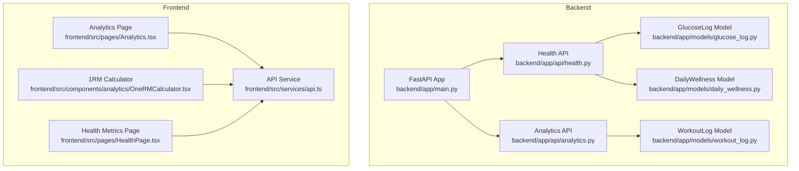
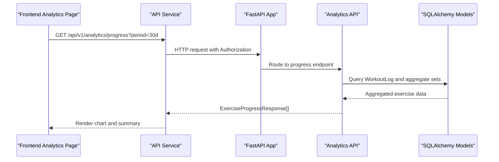
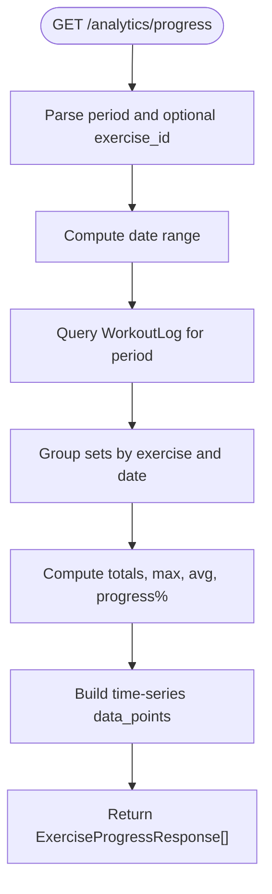
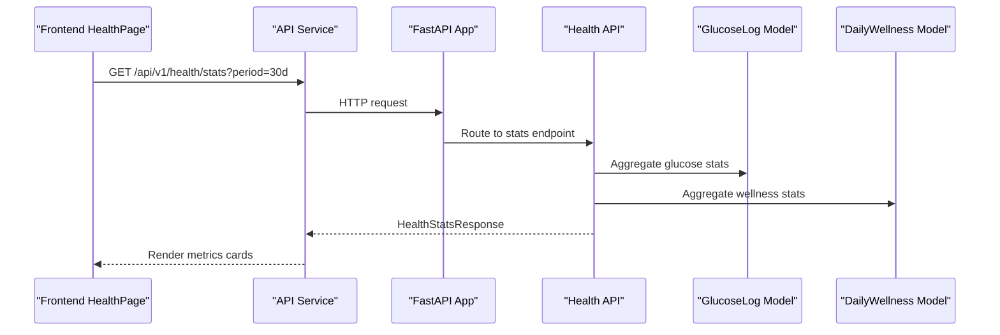
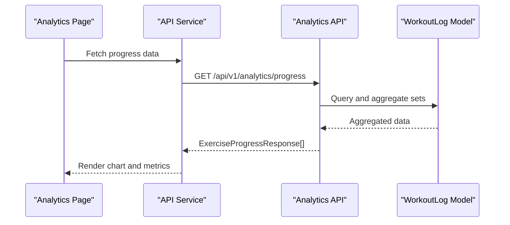
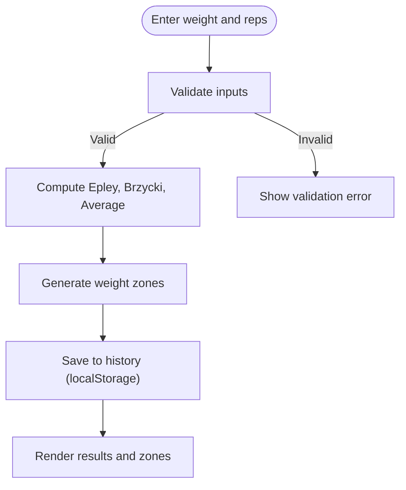
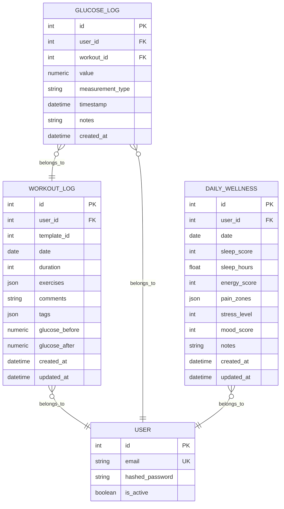
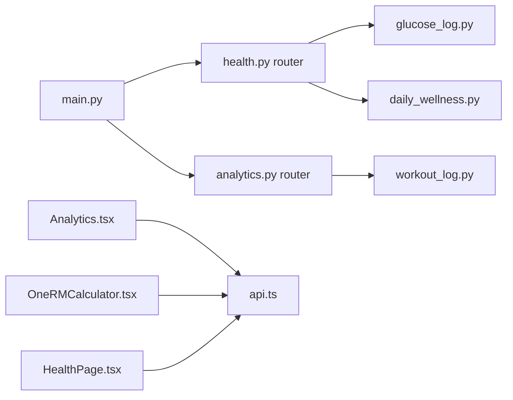

# Health Analytics & Dashboard

<cite>
**Referenced Files in This Document**
- [backend/app/main.py](file://backend/app/main.py)
- [backend/app/api/analytics.py](file://backend/app/api/analytics.py)
- [backend/app/schemas/analytics.py](file://backend/app/schemas/analytics.py)
- [backend/app/api/health.py](file://backend/app/api/health.py)
- [backend/app/schemas/health.py](file://backend/app/schemas/health.py)
- [backend/app/models/daily_wellness.py](file://backend/app/models/daily_wellness.py)
- [backend/app/models/glucose_log.py](file://backend/app/models/glucose_log.py)
- [backend/app/models/workout_log.py](file://backend/app/models/workout_log.py)
- [backend/app/api/health_metrics.py](file://backend/app/api/health_metrics.py)
- [frontend/src/pages/Analytics.tsx](file://frontend/src/pages/Analytics.tsx)
- [frontend/src/components/analytics/OneRMCalculator.tsx](file://frontend/src/components/analytics/OneRMCalculator.tsx)
- [frontend/src/services/api.ts](file://frontend/src/services/api.ts)
- [frontend/src/pages/HealthPage.tsx](file://frontend/src/pages/HealthPage.tsx)
</cite>

## Table of Contents
1. [Introduction](#introduction)
2. [Project Structure](#project-structure)
3. [Core Components](#core-components)
4. [Architecture Overview](#architecture-overview)
5. [Detailed Component Analysis](#detailed-component-analysis)
6. [Dependency Analysis](#dependency-analysis)
7. [Performance Considerations](#performance-considerations)
8. [Troubleshooting Guide](#troubleshooting-guide)
9. [Conclusion](#conclusion)
10. [Appendices](#appendices)

## Introduction
This document describes the health analytics and dashboard system for FitTracker Pro. It covers backend analytics APIs for workout progress, calendar summaries, export requests, and health statistics; frontend dashboards for interactive trend visualization, correlation analysis, and export; and implementation specifics for correlation analysis, predictive insights, and personalized recommendations. It also documents data aggregation algorithms, real-time update strategies, and integration pathways with external health devices.

## Project Structure
The system comprises:
- Backend FastAPI application exposing analytics and health endpoints, with SQLAlchemy models for workout logs, glucose logs, and daily wellness.
- Frontend React application with TypeScript, using Recharts for visualization and a dedicated analytics page and calculator component.
- Shared API service for HTTP communication with the backend.

**Diagram sources**
- [backend/app/main.py:89-106](file://backend/app/main.py#L89-L106)
- [backend/app/api/health.py:26](file://backend/app/api/health.py#L26)
- [backend/app/api/analytics.py:24](file://backend/app/api/analytics.py#L24)
- [backend/app/models/workout_log.py:19-112](file://backend/app/models/workout_log.py#L19-L112)
- [backend/app/models/glucose_log.py:18-80](file://backend/app/models/glucose_log.py#L18-L80)
- [backend/app/models/daily_wellness.py:17-118](file://backend/app/models/daily_wellness.py#L17-L118)
- [frontend/src/pages/Analytics.tsx:641-996](file://frontend/src/pages/Analytics.tsx#L641-L996)
- [frontend/src/components/analytics/OneRMCalculator.tsx:397-730](file://frontend/src/components/analytics/OneRMCalculator.tsx#L397-L730)
- [frontend/src/pages/HealthPage.tsx:24-124](file://frontend/src/pages/HealthPage.tsx#L24-L124)
- [frontend/src/services/api.ts:6-69](file://frontend/src/services/api.ts#L6-L69)

**Section sources**
- [backend/app/main.py:89-106](file://backend/app/main.py#L89-L106)
- [frontend/src/pages/Analytics.tsx:641-996](file://frontend/src/pages/Analytics.tsx#L641-L996)

## Core Components
- Analytics API: Provides exercise progress, calendar summaries, export requests, and summary statistics.
- Health API: Manages glucose measurements and daily wellness entries, plus aggregated health statistics.
- Frontend Analytics Page: Interactive charts, period selection, exercise selector, export menu, and modal details.
- 1RM Calculator: Computes strength estimates and recommended training zones.
- Health Metrics Page: Displays basic health metrics with trend indicators.
- API Service: Centralized HTTP client with auth token injection and error handling.

**Section sources**
- [backend/app/api/analytics.py:27-517](file://backend/app/api/analytics.py#L27-L517)
- [backend/app/api/health.py:29-614](file://backend/app/api/health.py#L29-L614)
- [frontend/src/pages/Analytics.tsx:641-996](file://frontend/src/pages/Analytics.tsx#L641-L996)
- [frontend/src/components/analytics/OneRMCalculator.tsx:397-730](file://frontend/src/components/analytics/OneRMCalculator.tsx#L397-L730)
- [frontend/src/pages/HealthPage.tsx:24-124](file://frontend/src/pages/HealthPage.tsx#L24-L124)
- [frontend/src/services/api.ts:6-69](file://frontend/src/services/api.ts#L6-L69)

## Architecture Overview
The backend exposes REST endpoints under /api/v1 with JWT authentication and rate limiting. The frontend consumes these endpoints to render interactive dashboards and calculators. Data models support workout logs, glucose measurements, and daily wellness entries.

**Diagram sources**
- [backend/app/api/analytics.py:27-197](file://backend/app/api/analytics.py#L27-L197)
- [backend/app/models/workout_log.py:19-112](file://backend/app/models/workout_log.py#L19-L112)
- [frontend/src/pages/Analytics.tsx:641-996](file://frontend/src/pages/Analytics.tsx#L641-L996)
- [frontend/src/services/api.ts:47-49](file://frontend/src/services/api.ts#L47-L49)

## Detailed Component Analysis

### Backend Analytics API
- Exercise Progress: Aggregates sets by date, computes max weight per date, and calculates summary statistics including progress percentage.
- Calendar: Builds a month view with workout counts, durations, and markers for glucose/wellness entries.
- Export: Generates export IDs and returns pending status; async export and status retrieval are placeholders.
- Summary: Computes totals, streaks, favorites, and averages over configurable periods.

**Diagram sources**
- [backend/app/api/analytics.py:27-197](file://backend/app/api/analytics.py#L27-L197)

**Section sources**
- [backend/app/api/analytics.py:27-197](file://backend/app/api/analytics.py#L27-L197)
- [backend/app/schemas/analytics.py:10-34](file://backend/app/schemas/analytics.py#L10-L34)

### Backend Health API
- Glucose Tracking: Create, list, paginate, filter, and delete glucose logs; compute average/min/max over filtered windows.
- Daily Wellness: Upsert wellness entries by date; list recent entries with limits.
- Health Statistics: Compute glucose averages, counts, in-range percentages; workout totals and durations; wellness scores and hours.

**Diagram sources**
- [backend/app/api/health.py:409-614](file://backend/app/api/health.py#L409-L614)
- [backend/app/models/glucose_log.py:18-80](file://backend/app/models/glucose_log.py#L18-L80)
- [backend/app/models/daily_wellness.py:17-118](file://backend/app/models/daily_wellness.py#L17-L118)

**Section sources**
- [backend/app/api/health.py:29-227](file://backend/app/api/health.py#L29-L227)
- [backend/app/api/health.py:259-406](file://backend/app/api/health.py#L259-L406)
- [backend/app/api/health.py:409-614](file://backend/app/api/health.py#L409-L614)
- [backend/app/schemas/health.py:10-134](file://backend/app/schemas/health.py#L10-L134)

### Frontend Analytics Dashboard
- Interactive Charts: Uses Recharts to render line charts of max weights per exercise over time; tooltips and legends for clarity.
- Customizable Views: Period selector (7d/30d/90d/all/custom), exercise selector with search and multi-select, and tab switching between chart and calculator.
- Export Capabilities: CSV/PDF/Telegram sharing via a dropdown menu; CSV generation utility and print-to-PDF fallback.
- Data Flow: Mock data generation for demonstration; replace with API calls to analytics endpoints.

**Diagram sources**
- [frontend/src/pages/Analytics.tsx:641-996](file://frontend/src/pages/Analytics.tsx#L641-L996)
- [frontend/src/services/api.ts:47-49](file://frontend/src/services/api.ts#L47-L49)
- [backend/app/api/analytics.py:27-197](file://backend/app/api/analytics.py#L27-L197)
- [backend/app/models/workout_log.py:19-112](file://backend/app/models/workout_log.py#L19-L112)

**Section sources**
- [frontend/src/pages/Analytics.tsx:641-996](file://frontend/src/pages/Analytics.tsx#L641-L996)
- [frontend/src/services/api.ts:6-69](file://frontend/src/services/api.ts#L6-L69)

### 1RM Calculator
- Formulas: Implements Epley and Brzycki equations and averaged result; generates recommended weight zones for training goals.
- UI: Exercise selector, numeric inputs for weight and reps, quick-rep chips, save to local history, and info modal with warnings.
- Integration: Designed to complement analytics by providing strength benchmarks for visualization and recommendations.

**Diagram sources**
- [frontend/src/components/analytics/OneRMCalculator.tsx:66-91](file://frontend/src/components/analytics/OneRMCalculator.tsx#L66-L91)
- [frontend/src/components/analytics/OneRMCalculator.tsx:96-109](file://frontend/src/components/analytics/OneRMCalculator.tsx#L96-L109)
- [frontend/src/components/analytics/OneRMCalculator.tsx:456-489](file://frontend/src/components/analytics/OneRMCalculator.tsx#L456-L489)

**Section sources**
- [frontend/src/components/analytics/OneRMCalculator.tsx:397-730](file://frontend/src/components/analytics/OneRMCalculator.tsx#L397-L730)

### Health Metrics Page
- Displays basic metrics (weight, steps, heart rate, sleep, water, calories) with trend icons and percentage changes.
- Mock data and chart placeholders; intended to evolve into live data and deeper analytics.

**Section sources**
- [frontend/src/pages/HealthPage.tsx:24-124](file://frontend/src/pages/HealthPage.tsx#L24-L124)

### Data Models Overview

**Diagram sources**
- [backend/app/models/workout_log.py:19-112](file://backend/app/models/workout_log.py#L19-L112)
- [backend/app/models/glucose_log.py:18-80](file://backend/app/models/glucose_log.py#L18-L80)
- [backend/app/models/daily_wellness.py:17-118](file://backend/app/models/daily_wellness.py#L17-L118)

## Dependency Analysis
- Backend routes are registered in the main application with CORS and rate limiting middleware.
- Analytics API depends on WorkoutLog for exercise progress and calendar; Health API depends on GlucoseLog and DailyWellness for statistics.
- Frontend components depend on the shared API service for HTTP communication.

**Diagram sources**
- [backend/app/main.py:89-106](file://backend/app/main.py#L89-L106)
- [backend/app/api/analytics.py:24](file://backend/app/api/analytics.py#L24)
- [backend/app/api/health.py:26](file://backend/app/api/health.py#L26)
- [backend/app/models/workout_log.py:19-112](file://backend/app/models/workout_log.py#L19-L112)
- [backend/app/models/glucose_log.py:18-80](file://backend/app/models/glucose_log.py#L18-L80)
- [backend/app/models/daily_wellness.py:17-118](file://backend/app/models/daily_wellness.py#L17-L118)
- [frontend/src/pages/Analytics.tsx:641-996](file://frontend/src/pages/Analytics.tsx#L641-L996)
- [frontend/src/components/analytics/OneRMCalculator.tsx:397-730](file://frontend/src/components/analytics/OneRMCalculator.tsx#L397-L730)
- [frontend/src/pages/HealthPage.tsx:24-124](file://frontend/src/pages/HealthPage.tsx#L24-L124)
- [frontend/src/services/api.ts:6-69](file://frontend/src/services/api.ts#L6-L69)

**Section sources**
- [backend/app/main.py:89-106](file://backend/app/main.py#L89-L106)
- [frontend/src/services/api.ts:6-69](file://frontend/src/services/api.ts#L6-L69)

## Performance Considerations
- Backend
  - Use indexed columns for user_id, date, and timestamps to optimize analytics queries.
  - Paginate health history endpoints to avoid large result sets.
  - Consider materialized aggregates or scheduled jobs for heavy computations like export generation.
- Frontend
  - Memoize chart data preparation and calculations to minimize re-renders.
  - Lazy-load heavy components and use virtualized lists for long histories.
  - Debounce search inputs in selectors to reduce unnecessary recomputations.

## Troubleshooting Guide
- Authentication
  - Ensure Authorization: Bearer <token> is present in request headers for protected endpoints.
- Rate Limiting
  - Observe X-RateLimit-* headers; analytics export is rate-limited.
- Export Status
  - Export status checks are currently stubbed; expect 404 until async export is implemented.
- Data Validation
  - Verify input ranges for glucose values, wellness scores, and rep counts to prevent backend errors.

**Section sources**
- [backend/app/main.py:67-70](file://backend/app/main.py#L67-L70)
- [backend/app/api/analytics.py:368-382](file://backend/app/api/analytics.py#L368-L382)
- [backend/app/schemas/health.py:10-23](file://backend/app/schemas/health.py#L10-L23)
- [backend/app/schemas/analytics.py:58-67](file://backend/app/schemas/analytics.py#L58-L67)

## Conclusion
The health analytics and dashboard system integrates backend analytics and health endpoints with a responsive frontend. It supports trend visualization, comparative analysis, export, and calculators like 1RM estimation. Future enhancements include full export pipeline, correlation analysis, predictive insights, and device integrations.

## Appendices

### Backend Analytics Endpoints
- GET /api/v1/analytics/progress
  - Query: exercise_id (optional), period ("7d","30d","90d","1y","all")
  - Response: List of ExerciseProgressResponse with data_points and summary
- GET /api/v1/analytics/calendar
  - Query: year, month
  - Response: WorkoutCalendarResponse with days and summary
- POST /api/v1/analytics/export
  - Body: DataExportRequest
  - Response: DataExportResponse (pending)
- GET /api/v1/analytics/export/{export_id}
  - Response: DataExportResponse (placeholder)
- GET /api/v1/analytics/summary
  - Query: period
  - Response: Analytics summary metrics

**Section sources**
- [backend/app/api/analytics.py:27-517](file://backend/app/api/analytics.py#L27-L517)
- [backend/app/schemas/analytics.py:23-111](file://backend/app/schemas/analytics.py#L23-L111)

### Backend Health Endpoints
- POST /api/v1/health/glucose
  - Body: GlucoseLogCreate
  - Response: GlucoseLogResponse
- GET /api/v1/health/glucose
  - Query: page, page_size, date_from, date_to, measurement_type
  - Response: GlucoseHistoryResponse
- GET /api/v1/health/glucose/{log_id}
  - Response: GlucoseLogResponse
- DELETE /api/v1/health/glucose/{log_id}
- POST /api/v1/health/wellness
  - Body: DailyWellnessCreate
  - Response: DailyWellnessResponse
- GET /api/v1/health/wellness
  - Query: date_from, date_to, limit
  - Response: List[DailyWellnessResponse]
- GET /api/v1/health/wellness/{entry_id}
  - Response: DailyWellnessResponse
- GET /api/v1/health/stats
  - Query: period ("7d","30d","90d","1y")
  - Response: HealthStatsResponse

**Section sources**
- [backend/app/api/health.py:29-614](file://backend/app/api/health.py#L29-L614)
- [backend/app/schemas/health.py:10-134](file://backend/app/schemas/health.py#L10-L134)

### Frontend Analytics Features
- Period selection, exercise selector, tooltip, export menu (CSV/PDF/Telegram), and point detail modal.
- Key metrics card for quick insights.

**Section sources**
- [frontend/src/pages/Analytics.tsx:641-996](file://frontend/src/pages/Analytics.tsx#L641-L996)

### Health Metrics Page Features
- Metric grid with trend indicators and quick log actions.

**Section sources**
- [frontend/src/pages/HealthPage.tsx:24-124](file://frontend/src/pages/HealthPage.tsx#L24-L124)

### 1RM Calculator Features
- Epley/Brzycki/Average formulas, weight zones, history, and validation.

**Section sources**
- [frontend/src/components/analytics/OneRMCalculator.tsx:397-730](file://frontend/src/components/analytics/OneRMCalculator.tsx#L397-L730)