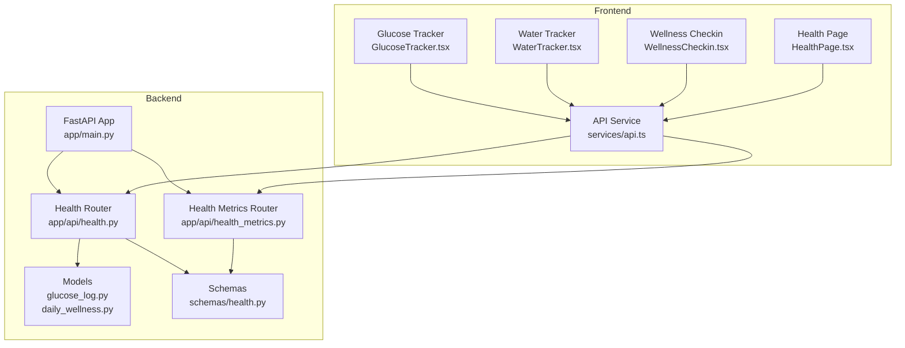
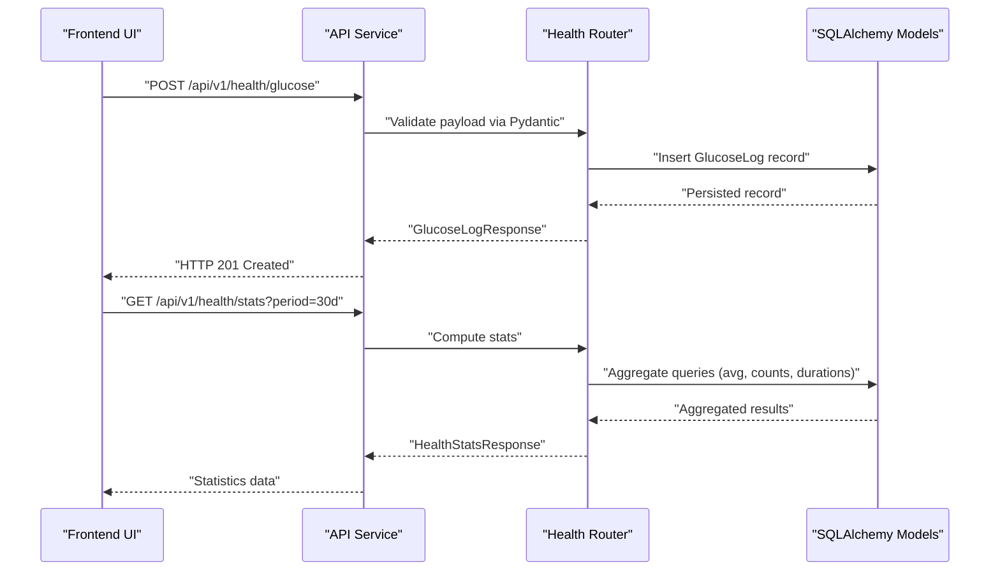
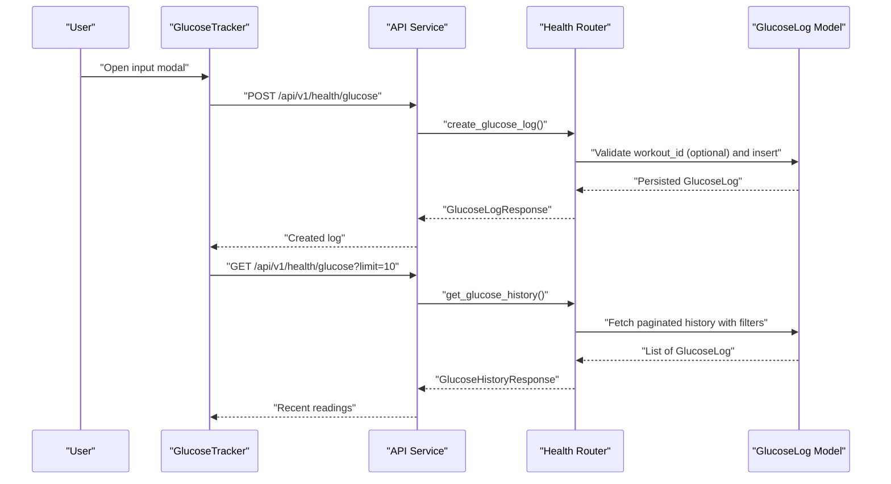
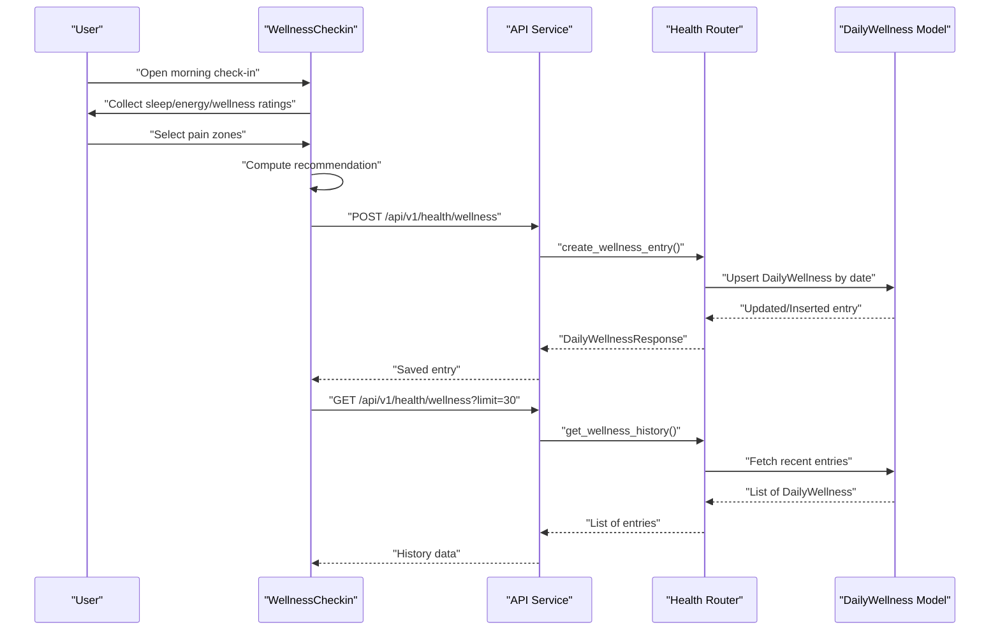
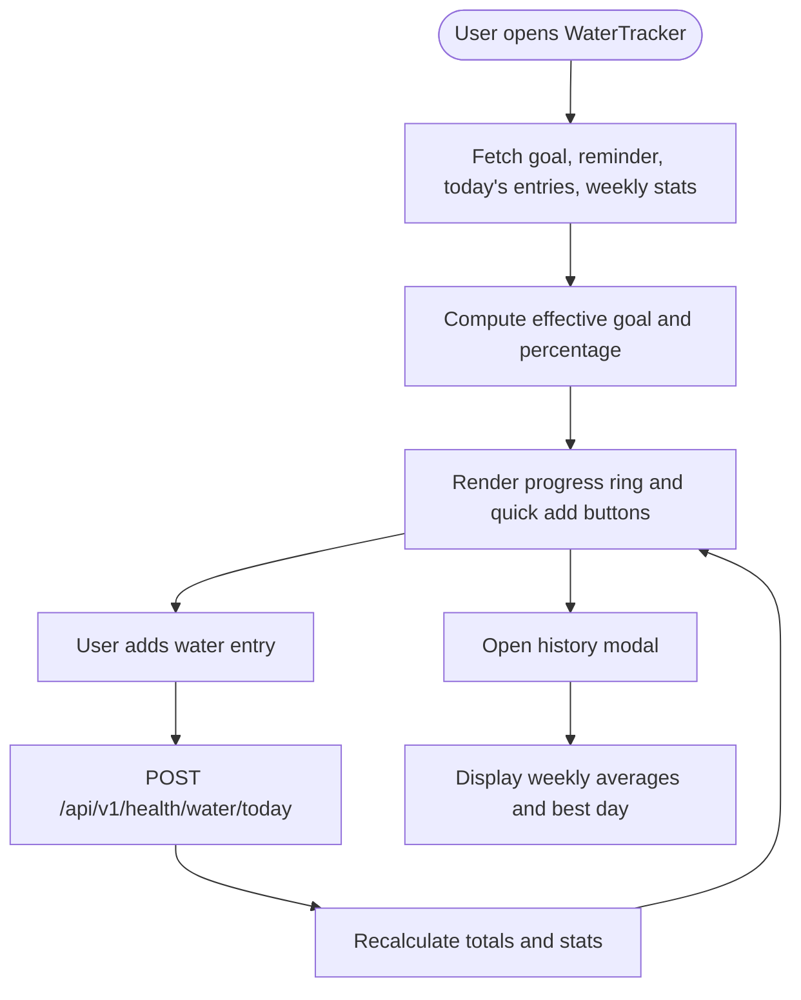
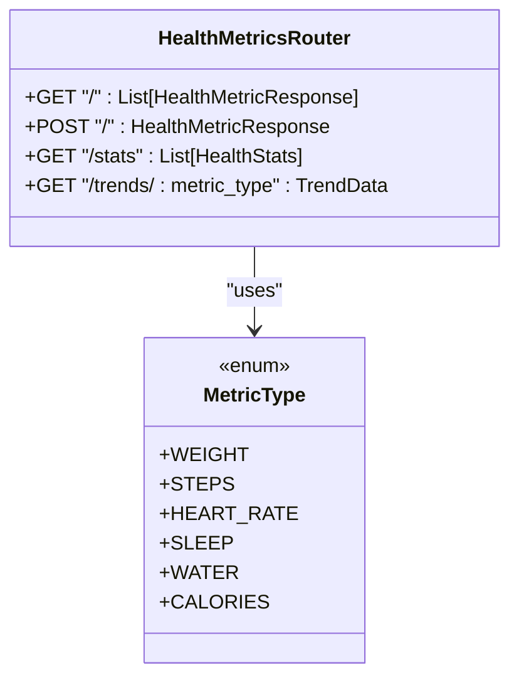
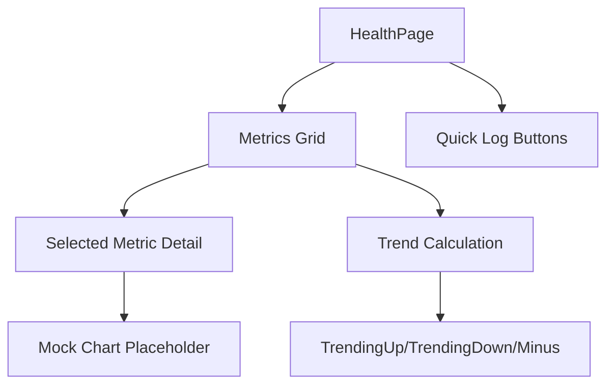
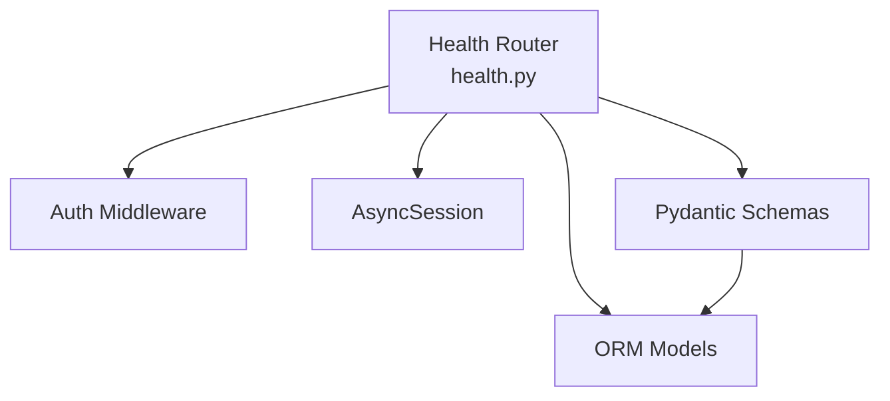

# Health Monitoring System

<cite>
**Referenced Files in This Document**
- [backend/app/api/health.py](file://backend/app/api/health.py)
- [backend/app/models/glucose_log.py](file://backend/app/models/glucose_log.py)
- [backend/app/models/daily_wellness.py](file://backend/app/models/daily_wellness.py)
- [backend/app/schemas/health.py](file://backend/app/schemas/health.py)
- [backend/app/api/health_metrics.py](file://backend/app/api/health_metrics.py)
- [backend/app/main.py](file://backend/app/main.py)
- [frontend/src/components/health/GlucoseTracker.tsx](file://frontend/src/components/health/GlucoseTracker.tsx)
- [frontend/src/components/health/WaterTracker.tsx](file://frontend/src/components/health/WaterTracker.tsx)
- [frontend/src/components/health/WellnessCheckin.tsx](file://frontend/src/components/health/WellnessCheckin.tsx)
- [frontend/src/pages/HealthPage.tsx](file://frontend/src/pages/HealthPage.tsx)
- [frontend/src/services/api.ts](file://frontend/src/services/api.ts)
</cite>

## Table of Contents
1. [Introduction](#introduction)
2. [Project Structure](#project-structure)
3. [Core Components](#core-components)
4. [Architecture Overview](#architecture-overview)
5. [Detailed Component Analysis](#detailed-component-analysis)
6. [Dependency Analysis](#dependency-analysis)
7. [Performance Considerations](#performance-considerations)
8. [Troubleshooting Guide](#troubleshooting-guide)
9. [Conclusion](#conclusion)

## Introduction
This document describes the health monitoring system implementation, covering the backend API for glucose tracking, daily wellness check-ins, and health statistics computation, alongside the frontend components for user input, visualization, and trend analysis. It explains the complete workflow from data ingestion and validation to aggregation and presentation, including hydration tracking capabilities and health insights generation.

## Project Structure
The health monitoring system spans two primary areas:
- Backend: FastAPI application exposing health endpoints, backed by SQLAlchemy ORM models and Pydantic schemas for validation and serialization.
- Frontend: React components integrated with a shared API service for data fetching and submission, providing interactive widgets and modals for health data entry and visualization.

**Diagram sources**
- [backend/app/main.py:90-106](file://backend/app/main.py#L90-L106)
- [backend/app/api/health.py:26](file://backend/app/api/health.py#L26)
- [backend/app/api/health_metrics.py:10](file://backend/app/api/health_metrics.py#L10)
- [backend/app/models/glucose_log.py:18](file://backend/app/models/glucose_log.py#L18)
- [backend/app/models/daily_wellness.py:17](file://backend/app/models/daily_wellness.py#L17)
- [backend/app/schemas/health.py:10](file://backend/app/schemas/health.py#L10)
- [frontend/src/services/api.ts:6](file://frontend/src/services/api.ts#L6)
- [frontend/src/components/health/GlucoseTracker.tsx:520](file://frontend/src/components/health/GlucoseTracker.tsx#L520)
- [frontend/src/components/health/WaterTracker.tsx:746](file://frontend/src/components/health/WaterTracker.tsx#L746)
- [frontend/src/components/health/WellnessCheckin.tsx:63](file://frontend/src/components/health/WellnessCheckin.tsx#L63)
- [frontend/src/pages/HealthPage.tsx:24](file://frontend/src/pages/HealthPage.tsx#L24)

**Section sources**
- [backend/app/main.py:90-106](file://backend/app/main.py#L90-L106)
- [frontend/src/services/api.ts:6](file://frontend/src/services/api.ts#L6)

## Core Components
- Backend health API: Provides endpoints for glucose logging, wellness entries, and aggregated health statistics.
- Data models: SQLAlchemy models for glucose measurements and daily wellness entries with appropriate indices and relationships.
- Pydantic schemas: Validation and serialization models for request/response payloads.
- Frontend health components: Interactive widgets and modals for glucose tracking, water hydration, and wellness check-in with real-time insights and recommendations.
- API service: Shared Axios-based service handling authentication and request/response interception.

Key backend endpoints include:
- POST /api/v1/health/glucose: Create a glucose log entry
- GET /api/v1/health/glucose: Retrieve glucose history with pagination and filters
- GET /api/v1/health/glucose/{id}: Retrieve a specific glucose log
- DELETE /api/v1/health/glucose/{id}: Delete a glucose log
- POST /api/v1/health/wellness: Create or update a daily wellness entry
- GET /api/v1/health/wellness: Retrieve wellness history with date range and limit
- GET /api/v1/health/wellness/{id}: Retrieve a specific wellness entry
- GET /api/v1/health/stats: Compute health statistics for a given period

Key frontend components include:
- GlucoseTracker: Input modal, quick stats, and integration with workout context
- WaterTracker: Goal settings, reminders, progress visualization, and weekly history
- WellnessCheckin: Multi-step check-in with pain zones and workout recommendations
- HealthPage: Mock dashboard for general health metrics

**Section sources**
- [backend/app/api/health.py:29-615](file://backend/app/api/health.py#L29-L615)
- [backend/app/models/glucose_log.py:18-80](file://backend/app/models/glucose_log.py#L18-L80)
- [backend/app/models/daily_wellness.py:17-118](file://backend/app/models/daily_wellness.py#L17-L118)
- [backend/app/schemas/health.py:10-134](file://backend/app/schemas/health.py#L10-L134)
- [frontend/src/components/health/GlucoseTracker.tsx:520-762](file://frontend/src/components/health/GlucoseTracker.tsx#L520-L762)
- [frontend/src/components/health/WaterTracker.tsx:746-1171](file://frontend/src/components/health/WaterTracker.tsx#L746-L1171)
- [frontend/src/components/health/WellnessCheckin.tsx:63-1207](file://frontend/src/components/health/WellnessCheckin.tsx#L63-L1207)
- [frontend/src/pages/HealthPage.tsx:24-124](file://frontend/src/pages/HealthPage.tsx#L24-L124)

## Architecture Overview
The system follows a layered architecture:
- Presentation Layer: React components in the frontend handle user interactions and present data.
- API Layer: FastAPI routes expose health endpoints with authentication and validation.
- Domain Layer: Pydantic schemas define request/response contracts.
- Persistence Layer: SQLAlchemy models map to PostgreSQL tables with optimized indexes.

**Diagram sources**
- [backend/app/api/health.py:29-615](file://backend/app/api/health.py#L29-L615)
- [backend/app/schemas/health.py:10-134](file://backend/app/schemas/health.py#L10-L134)
- [frontend/src/services/api.ts:47-65](file://frontend/src/services/api.ts#L47-L65)

## Detailed Component Analysis

### Glucose Tracking Workflow
The glucose tracking workflow supports recording measurements, retrieving history, and computing statistics.

**Diagram sources**
- [frontend/src/components/health/GlucoseTracker.tsx:558-577](file://frontend/src/components/health/GlucoseTracker.tsx#L558-L577)
- [backend/app/api/health.py:29-200](file://backend/app/api/health.py#L29-L200)
- [backend/app/models/glucose_log.py:18-80](file://backend/app/models/glucose_log.py#L18-L80)

Implementation specifics:
- Validation: Values constrained to safe ranges; measurement types validated against predefined set; optional workout association verified.
- Historical data management: Pagination with page/page_size; date range filters; measurement type filter; computed statistics (average, min, max).
- Automatic calculations: Average glucose, min/max values, and counts derived from aggregated queries.
- Insights generation: Status classification (hypoglycemia, low, optimal, high, dangerous) with recommendations; visual scale for immediate feedback.

**Section sources**
- [backend/app/api/health.py:29-200](file://backend/app/api/health.py#L29-L200)
- [backend/app/schemas/health.py:10-50](file://backend/app/schemas/health.py#L10-L50)
- [backend/app/models/glucose_log.py:18-80](file://backend/app/models/glucose_log.py#L18-L80)
- [frontend/src/components/health/GlucoseTracker.tsx:532-577](file://frontend/src/components/health/GlucoseTracker.tsx#L532-L577)

### Wellness Check-in and Recommendations
The wellness check-in process captures daily scores, pain zones, and generates workout recommendations.

**Diagram sources**
- [frontend/src/components/health/WellnessCheckin.tsx:424-628](file://frontend/src/components/health/WellnessCheckin.tsx#L424-L628)
- [backend/app/api/health.py:259-378](file://backend/app/api/health.py#L259-L378)
- [backend/app/models/daily_wellness.py:17-118](file://backend/app/models/daily_wellness.py#L17-L118)

Implementation specifics:
- Data capture: Sleep score, energy score, optional sleep hours, pain zones JSON, stress level, mood score, and notes.
- Upsert logic: Existing entries for the same date are updated; otherwise created.
- Recommendations: Derived from averaged scores and presence of pain zones; provides intensity modifier and excluded zones.
- Visualization: Slider-based rating inputs with emoji/rating labels; pain zone selector with exclusion hints.

**Section sources**
- [backend/app/api/health.py:259-378](file://backend/app/api/health.py#L259-L378)
- [backend/app/schemas/health.py:66-96](file://backend/app/schemas/health.py#L66-L96)
- [backend/app/models/daily_wellness.py:17-118](file://backend/app/models/daily_wellness.py#L17-L118)
- [frontend/src/components/health/WellnessCheckin.tsx:164-192](file://frontend/src/components/health/WellnessCheckin.tsx#L164-L192)

### Hydration Tracking and Health Statistics
Hydration tracking includes goal setting, reminders, progress visualization, and weekly history. Health statistics combine glucose, workouts, and wellness metrics.

**Diagram sources**
- [frontend/src/components/health/WaterTracker.tsx:777-800](file://frontend/src/components/health/WaterTracker.tsx#L777-L800)
- [backend/app/api/health.py:409-615](file://backend/app/api/health.py#L409-L615)

Implementation specifics:
- Goals and reminders: Separate endpoints for goal settings and reminder preferences; effective goal adjusts for workout days.
- Progress visualization: SVG progress ring with animated transitions and trophy badge on goal completion.
- Weekly insights: Average consumption, best day, and daily completion rates.
- Health statistics: Aggregated views combining glucose averages, workout counts/durations, and wellness scores across periods.

**Section sources**
- [frontend/src/components/health/WaterTracker.tsx:746-1171](file://frontend/src/components/health/WaterTracker.tsx#L746-L1171)
- [backend/app/api/health.py:409-615](file://backend/app/api/health.py#L409-L615)

### Health Metrics API (Planned)
The health metrics router defines the contract for general health metrics collection, trends, and statistics, with placeholders for implementation.

**Diagram sources**
- [backend/app/api/health_metrics.py:13-98](file://backend/app/api/health_metrics.py#L13-L98)

**Section sources**
- [backend/app/api/health_metrics.py:54-98](file://backend/app/api/health_metrics.py#L54-L98)

### Frontend Dashboard Integration
The HealthPage demonstrates a dashboard-style view for general metrics with trend indicators and quick logging actions.

**Diagram sources**
- [frontend/src/pages/HealthPage.tsx:24-124](file://frontend/src/pages/HealthPage.tsx#L24-L124)

**Section sources**
- [frontend/src/pages/HealthPage.tsx:24-124](file://frontend/src/pages/HealthPage.tsx#L24-L124)

## Dependency Analysis
The backend health router depends on:
- Authentication middleware for protected endpoints
- SQLAlchemy session for database operations
- Pydantic schemas for validation and serialization
- Models for glucose logs and daily wellness entries

**Diagram sources**
- [backend/app/api/health.py:8-26](file://backend/app/api/health.py#L8-L26)
- [backend/app/schemas/health.py:10-134](file://backend/app/schemas/health.py#L10-L134)
- [backend/app/models/glucose_log.py:18](file://backend/app/models/glucose_log.py#L18)
- [backend/app/models/daily_wellness.py:17](file://backend/app/models/daily_wellness.py#L17)

Frontend components depend on:
- API service for HTTP requests
- Shared UI components (Button, Modal, etc.)
- Telegram Web App integration for haptic feedback and theming

**Section sources**
- [backend/app/api/health.py:8-26](file://backend/app/api/health.py#L8-L26)
- [frontend/src/services/api.ts:6](file://frontend/src/services/api.ts#L6)
- [frontend/src/components/health/GlucoseTracker.tsx:1-22](file://frontend/src/components/health/GlucoseTracker.tsx#L1-L22)

## Performance Considerations
- Database indexing: Glucose logs and daily wellness entries include composite and single-column indexes to optimize frequent queries by user_id, timestamp, date, and measurement type.
- Pagination: Health history endpoints support pagination to avoid large result sets.
- Aggregation queries: Statistics endpoints compute averages and counts efficiently using SQL aggregate functions.
- Frontend caching: Components fetch data on mount and recalculate locally to minimize redundant network calls.

## Troubleshooting Guide
Common issues and resolutions:
- Authentication failures: Ensure Authorization header with Bearer token is present for protected endpoints.
- Validation errors: Verify payload conforms to Pydantic constraints (value ranges, measurement types, date formats).
- Workout association errors: Confirm workout_id belongs to the current user when linking glucose logs to workouts.
- CORS issues: Verify ALLOWED_ORIGINS configuration includes the frontend origin.
- Network errors: Inspect API service interceptors for error logging and response handling.

**Section sources**
- [backend/app/api/health.py:29-200](file://backend/app/api/health.py#L29-L200)
- [backend/app/schemas/health.py:10-50](file://backend/app/schemas/health.py#L10-L50)
- [frontend/src/services/api.ts:21-45](file://frontend/src/services/api.ts#L21-L45)

## Conclusion
The health monitoring system integrates robust backend APIs with intuitive frontend components to support glucose tracking, daily wellness check-ins, hydration management, and comprehensive health statistics. The modular design enables future expansion for additional metrics while maintaining strong validation, efficient data access, and a user-friendly interface for insights and recommendations.