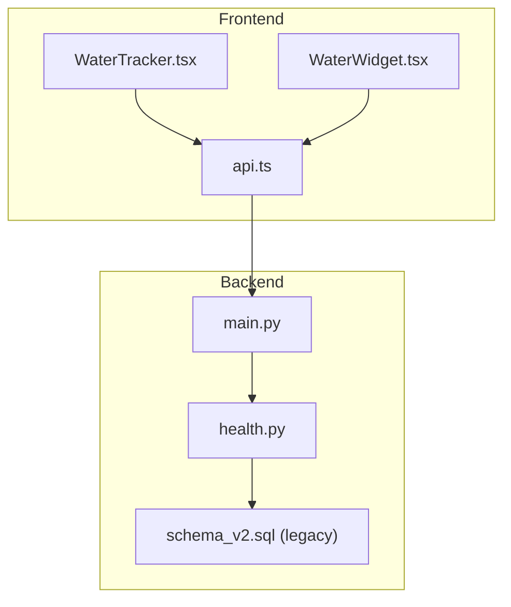
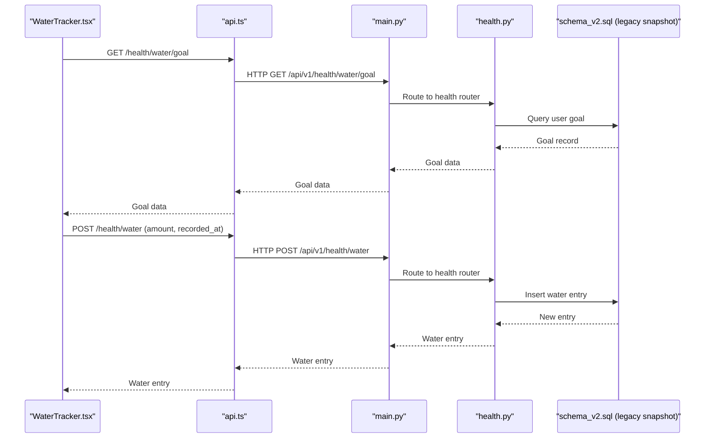
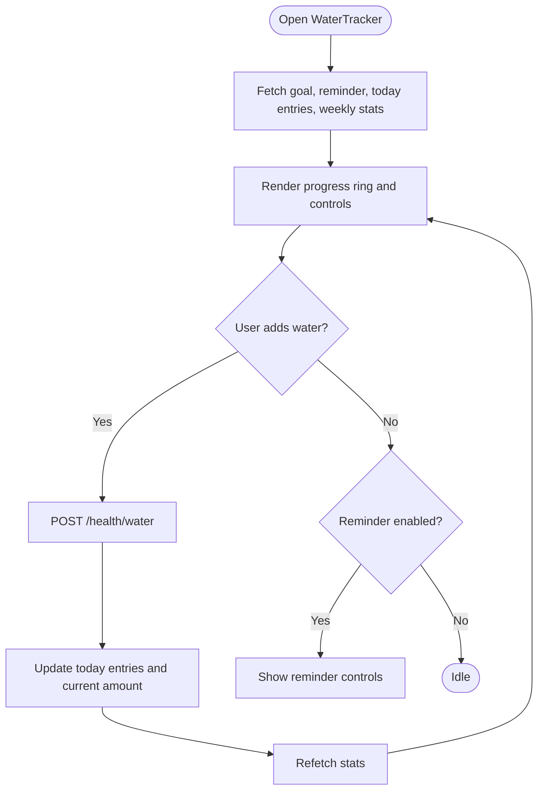
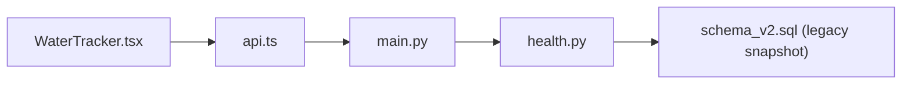

# Hydration Tracking

<cite>
**Referenced Files in This Document**
- [WaterTracker.tsx](file://frontend/src/components/health/WaterTracker.tsx)
- [WaterWidget.tsx](file://frontend/src/components/home/WaterWidget.tsx)
- [index.ts](file://frontend/src/components/health/index.ts)
- [api.ts](file://frontend/src/services/api.ts)
- [main.py](file://backend/app/main.py)
- [health.py](file://backend/app/api/health.py)
- [schema_v2.sql (legacy archive)](file://docs/db/legacy/schema_v2.sql)
</cite>

## Table of Contents
1. [Introduction](#introduction)
2. [Project Structure](#project-structure)
3. [Core Components](#core-components)
4. [Architecture Overview](#architecture-overview)
5. [Detailed Component Analysis](#detailed-component-analysis)
6. [Dependency Analysis](#dependency-analysis)
7. [Performance Considerations](#performance-considerations)
8. [Troubleshooting Guide](#troubleshooting-guide)
9. [Conclusion](#conclusion)

## Introduction
This document describes the hydration tracking system in FitTracker Pro, covering water intake logging, daily goals management, reminder systems, and progress visualization. It documents the frontend components and their integration with backend APIs, including endpoints for submitting water entries, managing goals and reminders, and retrieving weekly statistics. The system supports personalized hydration targets, workout-day adjustments, quick-add logging, and visual progress displays.

## Project Structure
The hydration tracking spans frontend and backend components:
- Frontend: A dedicated WaterTracker component with modals for goal settings, reminders, and history, plus a compact WaterWidget for home screen integration.
- Backend: Health router exposing endpoints for water tracking, with data persisted in the database schema.

**Diagram sources**
- [WaterTracker.tsx:746-1082](file://frontend/src/components/health/WaterTracker.tsx#L746-L1082)
- [WaterWidget.tsx:1-72](file://frontend/src/components/home/WaterWidget.tsx#L1-L72)
- [api.ts](file://frontend/src/services/api.ts)
- [main.py:89-106](file://backend/app/main.py#L89-L106)
- [health.py:1-615](file://backend/app/api/health.py#L1-L615)
- [schema_v2.sql:1-598](file://docs/db/legacy/schema_v2.sql#L1-L598)

**Section sources**
- [WaterTracker.tsx:1-1171](file://frontend/src/components/health/WaterTracker.tsx#L1-L1171)
- [WaterWidget.tsx:1-72](file://frontend/src/components/home/WaterWidget.tsx#L1-L72)
- [index.ts:14-21](file://frontend/src/components/health/index.ts#L14-L21)
- [api.ts](file://frontend/src/services/api.ts)
- [main.py:89-106](file://backend/app/main.py#L89-L106)
- [health.py:1-615](file://backend/app/api/health.py#L1-L615)
- [schema_v2.sql:1-598](file://docs/db/legacy/schema_v2.sql#L1-L598)

## Core Components
- WaterTracker (frontend): Full-featured hydration tracker with progress ring, quick-add buttons, custom amount input, goal settings modal, reminder settings modal, and history modal.
- WaterWidget (frontend): Compact widget for home screen showing current intake vs goal with progress bar.
- Health API (backend): Exposes endpoints for water entries, goals, reminders, and weekly statistics.
- Database schema: Defines storage for user hydration data and related settings.

Key capabilities:
- Drink volume tracking with timestamps
- Daily goals with optional workout-day increase
- Reminder configuration with intervals and quiet hours
- Weekly progress visualization and best-day tracking
- Integration with Telegram Mini App via API

**Section sources**
- [WaterTracker.tsx:29-80](file://frontend/src/components/health/WaterTracker.tsx#L29-L80)
- [WaterWidget.tsx:5-13](file://frontend/src/components/home/WaterWidget.tsx#L5-L13)
- [health.py:1-615](file://backend/app/api/health.py#L1-L615)
- [schema_v2.sql:1-598](file://docs/db/legacy/schema_v2.sql#L1-L598)

## Architecture Overview
The frontend components communicate with backend endpoints under the /api/v1/health prefix. The WaterTracker component orchestrates fetching and updating hydration data, while the backend validates requests, persists data, and computes statistics.

**Diagram sources**
- [WaterTracker.tsx:783-842](file://frontend/src/components/health/WaterTracker.tsx#L783-L842)
- [api.ts](file://frontend/src/services/api.ts)
- [main.py:89-106](file://backend/app/main.py#L89-L106)
- [health.py:1-615](file://backend/app/api/health.py#L1-L615)
- [schema_v2.sql:1-598](file://docs/db/legacy/schema_v2.sql#L1-L598)

## Detailed Component Analysis

### Frontend: WaterTracker Component
Responsibilities:
- Fetch and display current day’s water entries and total intake
- Manage daily hydration goal and workout-day adjustment
- Provide quick-add and custom amount logging
- Configure reminders with intervals and quiet hours
- Show weekly statistics and best day
- Visualize progress with a circular progress ring and percentage badge

Key UI elements:
- ProgressRing: SVG-based ring showing current intake vs effective goal
- QuickAddButtons: Predefined increments (250, 500, 750 ml)
- CustomAmountInput: Numeric input with validation
- GoalSettingsModal: Adjust daily goal and workout increase
- ReminderSettingsModal: Enable/disable reminders, set intervals, active/quiet hours
- HistoryModal: Weekly average, goal-reached days, best day, today’s entries

Data flow:
- Fetch goal, reminder, today’s entries, and weekly stats on mount
- On water addition, update local state and refresh data
- Save goal and reminder updates via PUT endpoints

**Diagram sources**
- [WaterTracker.tsx:778-842](file://frontend/src/components/health/WaterTracker.tsx#L778-L842)

**Section sources**
- [WaterTracker.tsx:109-189](file://frontend/src/components/health/WaterTracker.tsx#L109-L189)
- [WaterTracker.tsx:195-230](file://frontend/src/components/health/WaterTracker.tsx#L195-L230)
- [WaterTracker.tsx:241-291](file://frontend/src/components/health/WaterTracker.tsx#L241-L291)
- [WaterTracker.tsx:297-416](file://frontend/src/components/health/WaterTracker.tsx#L297-L416)
- [WaterTracker.tsx:422-621](file://frontend/src/components/health/WaterTracker.tsx#L422-L621)
- [WaterTracker.tsx:627-740](file://frontend/src/components/health/WaterTracker.tsx#L627-L740)
- [WaterTracker.tsx:778-842](file://frontend/src/components/health/WaterTracker.tsx#L778-L842)

### Frontend: WaterWidget Component
Responsibilities:
- Compact display of current intake vs goal on the home screen
- Quick-add button for immediate logging
- Progress bar visualization

Behavior:
- Calculates percentage and determines color based on goal reach
- Calls parent callback to add water when quick-add is used

**Section sources**
- [WaterWidget.tsx:1-72](file://frontend/src/components/home/WaterWidget.tsx#L1-L72)

### Backend: Health API Endpoints
Current health endpoints (hydration-related):
- GET /api/v1/health/water/goal → Returns user’s hydration goal
- GET /api/v1/health/water/reminder → Returns reminder settings
- GET /api/v1/health/water/today → Returns today’s water entries
- GET /api/v1/health/water/stats?period=7d → Returns weekly statistics
- POST /api/v1/health/water → Creates a new water entry

Notes:
- The backend health router currently focuses on glucose and wellness metrics. Hydration endpoints are referenced by the frontend but may require backend implementation to fully support all features described in the frontend.

**Section sources**
- [health.py:1-615](file://backend/app/api/health.py#L1-L615)
- [WaterTracker.tsx:783-797](file://frontend/src/components/health/WaterTracker.tsx#L783-L797)

### Database Schema
The schema defines tables and indexes supporting user data, workouts, glucose logs, and daily wellness. While hydration-specific tables are not present in the provided schema, the system is designed to persist user hydration data with JSONB fields and appropriate indexing for performance.

Highlights:
- Users table with JSONB profile and settings
- Workout logs with JSONB exercises and tags
- Glucose logs with indexed timestamps and measurement types
- Daily wellness with JSONB pain zones and scores
- Triggers for automatic updated_at timestamps

**Section sources**
- [schema_v2.sql:1-598](file://docs/db/legacy/schema_v2.sql#L1-L598)

## Dependency Analysis
Frontend-to-backend dependencies:
- WaterTracker depends on api.ts for HTTP communication
- api.ts routes calls to backend endpoints under /api/v1
- Backend main.py registers routers and exposes /api/v1/health endpoints
- Health router handles hydration-related requests and interacts with the database

**Diagram sources**
- [WaterTracker.tsx:1-10](file://frontend/src/components/health/WaterTracker.tsx#L1-L10)
- [api.ts](file://frontend/src/services/api.ts)
- [main.py:89-106](file://backend/app/main.py#L89-L106)
- [health.py:1-615](file://backend/app/api/health.py#L1-L615)
- [schema_v2.sql:1-598](file://docs/db/legacy/schema_v2.sql#L1-L598)

**Section sources**
- [WaterTracker.tsx:1-10](file://frontend/src/components/health/WaterTracker.tsx#L1-L10)
- [api.ts](file://frontend/src/services/api.ts)
- [main.py:89-106](file://backend/app/main.py#L89-L106)
- [health.py:1-615](file://backend/app/api/health.py#L1-L615)
- [schema_v2.sql:1-598](file://docs/db/legacy/schema_v2.sql#L1-L598)

## Performance Considerations
- Frontend:
  - Use memoization for derived values (effective goal, percentage) to avoid unnecessary re-renders
  - Debounce or batch API calls during frequent quick-add actions
  - Lazy load modals to reduce initial bundle size
- Backend:
  - Index hydration-related fields (user_id, date) to optimize queries
  - Paginate weekly statistics to limit payload size
  - Use connection pooling and async I/O for high concurrency

## Troubleshooting Guide
Common issues and resolutions:
- API errors when adding water:
  - Verify authentication token and endpoint URL
  - Check network connectivity and CORS configuration
- Goal or reminder not updating:
  - Confirm PUT requests are sent to correct endpoints
  - Inspect response status and error messages
- Progress not reflecting:
  - Ensure today’s entries are fetched after adding a new entry
  - Validate timezone handling for recorded_at timestamps

**Section sources**
- [WaterTracker.tsx:810-842](file://frontend/src/components/health/WaterTracker.tsx#L810-L842)
- [WaterTracker.tsx:845-866](file://frontend/src/components/health/WaterTracker.tsx#L845-L866)

## Conclusion
The hydration tracking system combines a rich frontend component with a modular backend architecture. The WaterTracker provides intuitive logging, goal management, reminders, and progress visualization, while the backend health router offers a foundation for hydration endpoints. Future enhancements should include implementing the missing hydration endpoints in the backend and ensuring robust persistence and analytics.