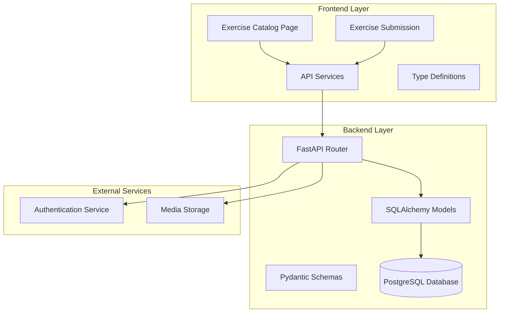
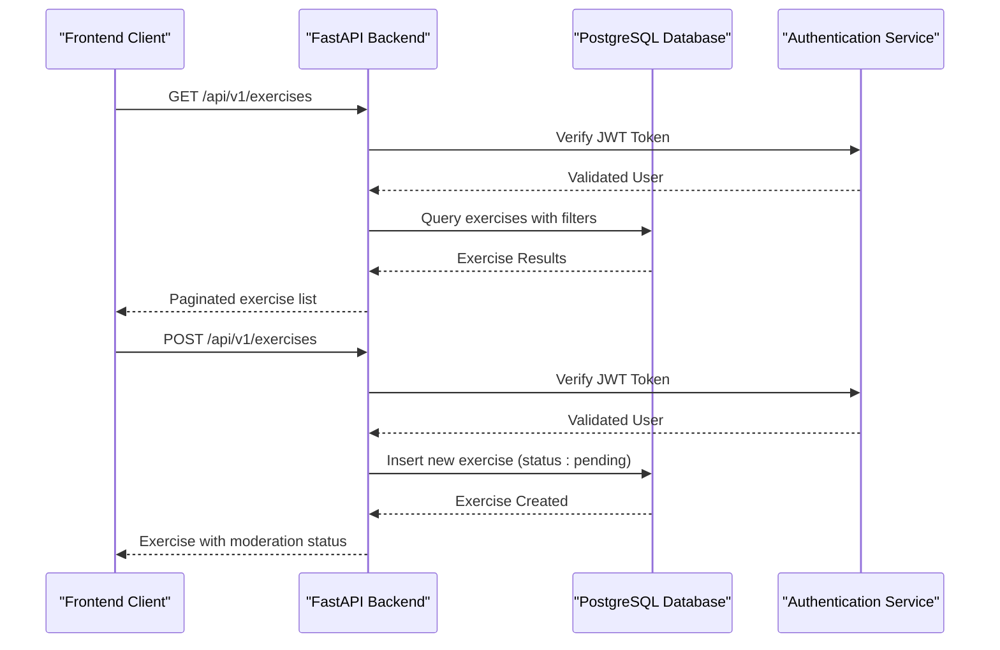
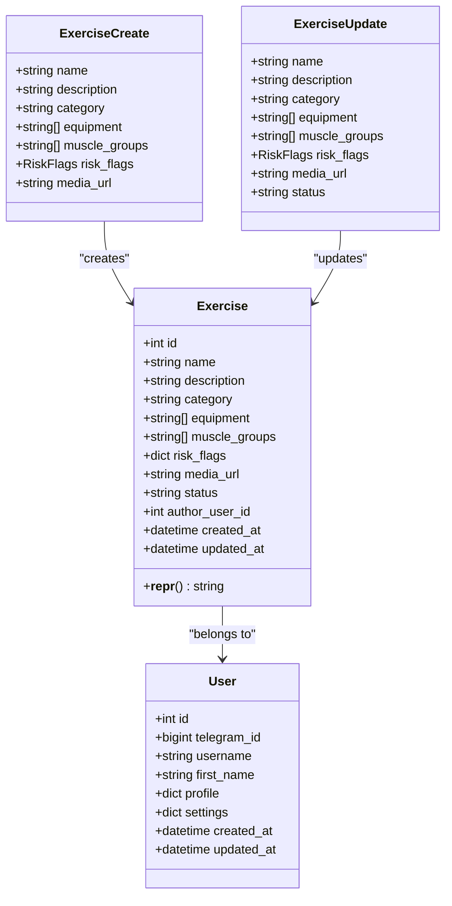
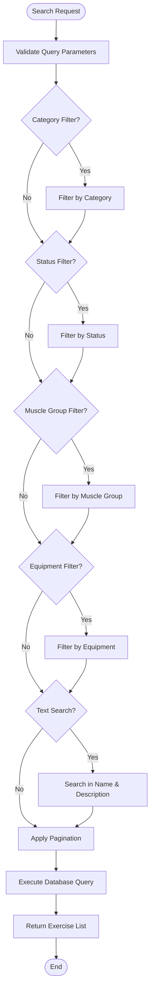
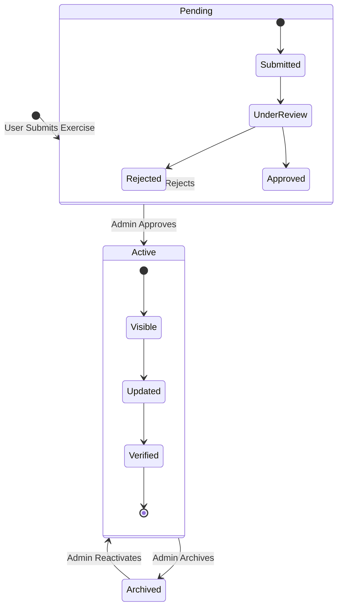
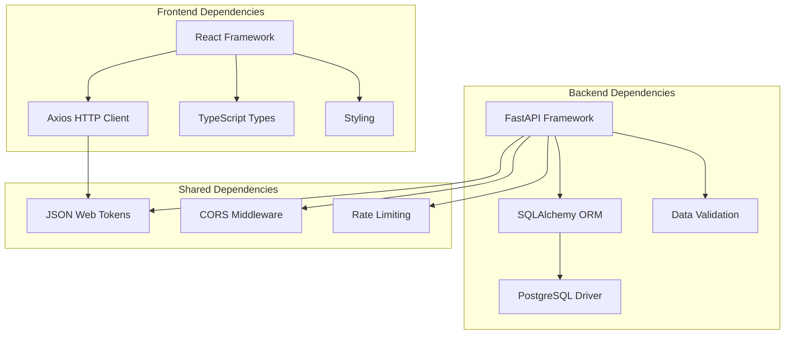

# Exercise Catalog System

<cite>
**Referenced Files in This Document**
- [exercise.py](file://backend/app/models/exercise.py)
- [exercises.py](file://backend/app/api/exercises.py)
- [exercises.py](file://backend/app/schemas/exercises.py)
- [initial_schema.py](file://database/migrations/versions/cd723942379e_initial_schema.py)
- [schema_v2.sql](file://database/schema_v2.sql)
- [main.py](file://backend/app/main.py)
- [Catalog.tsx](file://frontend/src/pages/Catalog.tsx)
- [AddExercise.tsx](file://frontend/src/pages/AddExercise.tsx)
- [api.ts](file://frontend/src/services/api.ts)
- [index.ts](file://frontend/src/types/index.ts)
</cite>

## Table of Contents
1. [Introduction](#introduction)
2. [Project Structure](#project-structure)
3. [Core Components](#core-components)
4. [Architecture Overview](#architecture-overview)
5. [Detailed Component Analysis](#detailed-component-analysis)
6. [Dependency Analysis](#dependency-analysis)
7. [Performance Considerations](#performance-considerations)
8. [Troubleshooting Guide](#troubleshooting-guide)
9. [Conclusion](#conclusion)

## Introduction

The Exercise Catalog System is a comprehensive fitness application component that manages exercise databases, metadata, and user interactions. This system provides a complete solution for exercise discovery, management, and community contribution while maintaining robust backend APIs and intuitive frontend interfaces.

The system supports both system-generated exercises and user-submitted content through a moderation workflow, enabling community-driven fitness content while ensuring quality and safety standards. It features advanced filtering capabilities, equipment and muscle group categorization, and comprehensive exercise metadata management.

## Project Structure

The Exercise Catalog System follows a modular architecture with clear separation between backend API services, database models, and frontend components:

**Diagram sources**
- [main.py:90-106](file://backend/app/main.py#L90-L106)
- [exercises.py:1-21](file://backend/app/api/exercises.py#L1-L21)

**Section sources**
- [main.py:13-24](file://backend/app/main.py#L13-L24)
- [main.py:89-106](file://backend/app/main.py#L89-L106)

## Core Components

### Database Schema and Models

The exercise system utilizes a PostgreSQL database with JSONB fields for flexible data storage and efficient querying capabilities.

**Exercise Database Structure:**
- **Primary Fields**: ID, name, description, category, status
- **Metadata Fields**: equipment (JSONB array), muscle_groups (JSONB array), risk_flags (JSONB object)
- **Media Management**: media_url field for video/image references
- **Authorship Tracking**: author_user_id foreign key relationship
- **Timestamp Management**: created_at and updated_at with automatic triggers

**Section sources**
- [exercise.py:17-116](file://backend/app/models/exercise.py#L17-L116)
- [initial_schema.py:55-93](file://database/migrations/versions/cd723942379e_initial_schema.py#L55-L93)
- [schema_v2.sql:46-85](file://database/schema_v2.sql#L46-L85)

### Backend API Endpoints

The system provides comprehensive CRUD operations with advanced filtering and search capabilities:

**Core Endpoints:**
- `GET /exercises` - Exercise catalog with filtering and pagination
- `GET /exercises/{id}` - Individual exercise details
- `POST /exercises` - Create new exercise (moderation required)
- `PUT /exercises/{id}` - Update exercise (admin only)
- `DELETE /exercises/{id}` - Delete exercise (admin only)
- `POST /exercises/{id}/approve` - Approve pending exercises (admin only)

**Section sources**
- [exercises.py:24-165](file://backend/app/api/exercises.py#L24-L165)
- [exercises.py:222-296](file://backend/app/api/exercises.py#L222-L296)

### Frontend Components

The frontend provides two primary interfaces for exercise management:

**Catalog Interface:**
- Advanced filtering by category, equipment, difficulty, and risk factors
- Real-time search functionality
- Exercise cards with visual indicators
- Detailed exercise modals with multimedia support

**Exercise Submission Interface:**
- Comprehensive form for exercise creation
- Equipment selection with icons
- Muscle group targeting
- Risk assessment tools
- Media upload capabilities

**Section sources**
- [Catalog.tsx:835-1283](file://frontend/src/pages/Catalog.tsx#L835-L1283)
- [AddExercise.tsx:124-845](file://frontend/src/pages/AddExercise.tsx#L124-L845)

## Architecture Overview

The Exercise Catalog System implements a modern microservice architecture with clear separation of concerns:

**Diagram sources**
- [exercises.py:24-140](file://backend/app/api/exercises.py#L24-L140)
- [api.ts:21-45](file://frontend/src/services/api.ts#L21-L45)

**Section sources**
- [main.py:89-106](file://backend/app/main.py#L89-L106)
- [api.ts:6-69](file://frontend/src/services/api.ts#L6-L69)

## Detailed Component Analysis

### Exercise Model Implementation

The Exercise model serves as the foundation for all exercise-related operations, implementing flexible data structures for modern fitness applications.

**Diagram sources**
- [exercise.py:17-116](file://backend/app/models/exercise.py#L17-L116)
- [exercises.py:34-56](file://backend/app/schemas/exercises.py#L34-L56)

**Section sources**
- [exercise.py:17-116](file://backend/app/models/exercise.py#L17-L116)
- [exercises.py:25-56](file://backend/app/schemas/exercises.py#L25-L56)

### Exercise Search and Filtering System

The search functionality implements sophisticated filtering mechanisms for enhanced user experience:

**Diagram sources**
- [exercises.py:25-140](file://backend/app/api/exercises.py#L25-L140)

**Section sources**
- [exercises.py:25-140](file://backend/app/api/exercises.py#L25-L140)

### Exercise Creation and Moderation Workflow

The system implements a comprehensive moderation workflow for user-submitted exercises:

**Diagram sources**
- [exercises.py:169-219](file://backend/app/api/exercises.py#L169-L219)
- [exercises.py:299-329](file://backend/app/api/exercises.py#L299-L329)

**Section sources**
- [exercises.py:169-219](file://backend/app/api/exercises.py#L169-L219)
- [exercises.py:299-329](file://backend/app/api/exercises.py#L299-L329)

### Frontend Exercise Catalog Interface

The frontend provides an intuitive interface for exercise discovery and management:

**Key Features:**
- Real-time filtering with category chips
- Equipment-based filtering system
- Risk assessment visualization
- Difficulty level indicators
- Media-rich exercise cards
- Detailed exercise modals

**Section sources**
- [Catalog.tsx:835-1283](file://frontend/src/pages/Catalog.tsx#L835-L1283)
- [Catalog.tsx:470-571](file://frontend/src/pages/Catalog.tsx#L470-L571)

### Exercise Submission Interface

The submission interface enables users to contribute new exercises with comprehensive metadata:

**Submission Features:**
- Multi-step form validation
- Equipment selection with visual icons
- Muscle group targeting system
- Risk factor assessment
- Media upload with compression
- Progress tracking during submission

**Section sources**
- [AddExercise.tsx:124-845](file://frontend/src/pages/AddExercise.tsx#L124-L845)
- [AddExercise.tsx:302-365](file://frontend/src/pages/AddExercise.tsx#L302-L365)

## Dependency Analysis

The Exercise Catalog System maintains clean dependency relationships with clear interfaces:

**Diagram sources**
- [main.py:89-106](file://backend/app/main.py#L89-L106)
- [api.ts:1-69](file://frontend/src/services/api.ts#L1-L69)

**Section sources**
- [main.py:89-106](file://backend/app/main.py#L89-L106)
- [api.ts:1-69](file://frontend/src/services/api.ts#L1-L69)

## Performance Considerations

The system implements several performance optimization strategies:

**Database Optimization:**
- JSONB indexing for equipment, muscle_groups, and risk_flags
- GIN indexes for efficient array queries
- Proper indexing on frequently queried fields (name, category, status)
- Connection pooling for database operations

**API Performance:**
- Pagination with configurable page sizes
- Efficient query construction with proper filtering
- Response caching for static lookup data
- Asynchronous database operations

**Frontend Performance:**
- Virtualized lists for large exercise catalogs
- Lazy loading for images and videos
- Debounced search functionality
- Client-side filtering for small datasets

## Troubleshooting Guide

### Common Issues and Solutions

**Database Connection Issues:**
- Verify PostgreSQL service is running
- Check connection string configuration
- Ensure proper indexing exists

**Authentication Problems:**
- Verify JWT token validity
- Check token expiration
- Confirm user permissions

**API Endpoint Errors:**
- Validate request payload structure
- Check query parameter constraints
- Review response status codes

**Frontend Loading Issues:**
- Verify API base URL configuration
- Check network connectivity
- Monitor browser console for errors

**Section sources**
- [exercises.py:159-163](file://backend/app/api/exercises.py#L159-L163)
- [api.ts:35-44](file://frontend/src/services/api.ts#L35-L44)

## Conclusion

The Exercise Catalog System provides a robust, scalable solution for fitness exercise management with comprehensive features for both administrators and end users. The system successfully balances flexibility with performance, offering advanced filtering capabilities, community-driven content moderation, and intuitive user interfaces.

Key strengths include the flexible JSONB-based data model supporting diverse exercise metadata, comprehensive moderation workflows, and well-structured API endpoints. The frontend components provide excellent user experience with real-time filtering and responsive design.

The system's architecture supports future enhancements including advanced analytics, social features, and expanded exercise categorization systems while maintaining backward compatibility and performance standards.