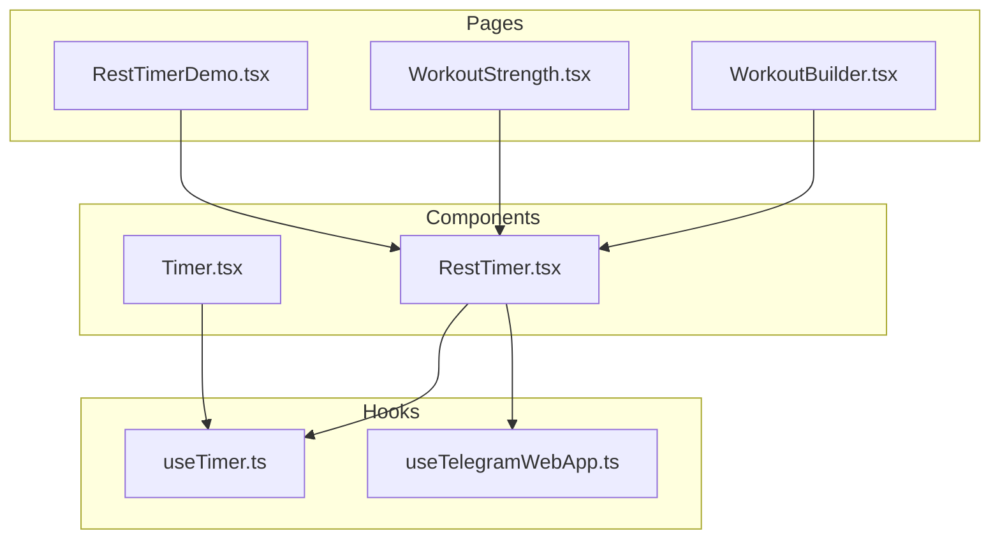
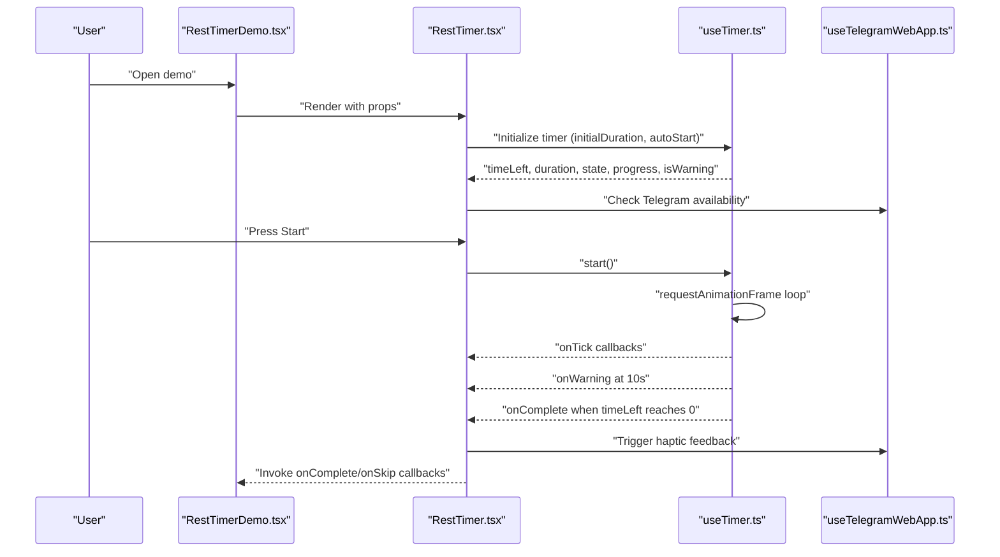
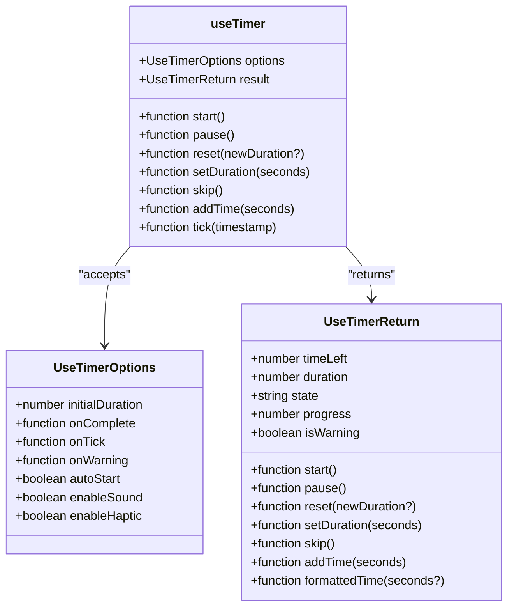
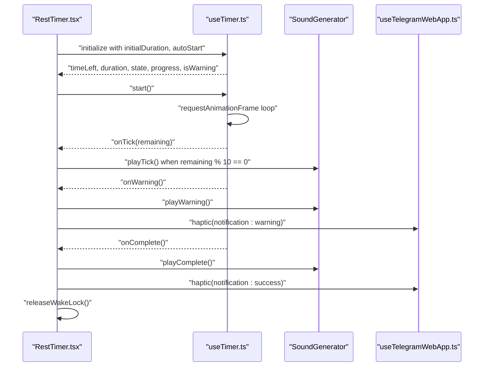
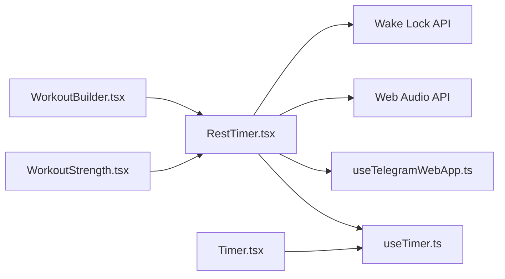

# Timer & Rest Management

<cite>
**Referenced Files in This Document**
- [useTimer.ts](file://frontend/src/hooks/useTimer.ts)
- [RestTimer.tsx](file://frontend/src/components/workout/RestTimer.tsx)
- [Timer.tsx](file://frontend/src/components/ui/Timer.tsx)
- [RestTimerDemo.tsx](file://frontend/src/pages/RestTimerDemo.tsx)
- [useTelegramWebApp.ts](file://frontend/src/hooks/useTelegramWebApp.ts)
- [WorkoutStrength.tsx](file://frontend/src/pages/WorkoutStrength.tsx)
- [WorkoutBuilder.tsx](file://frontend/src/pages/WorkoutBuilder.tsx)
- [useTimer.test.ts](file://frontend/src/__tests__/hooks/useTimer.test.ts)
</cite>

## Table of Contents
1. [Introduction](#introduction)
2. [Project Structure](#project-structure)
3. [Core Components](#core-components)
4. [Architecture Overview](#architecture-overview)
5. [Detailed Component Analysis](#detailed-component-analysis)
6. [Dependency Analysis](#dependency-analysis)
7. [Performance Considerations](#performance-considerations)
8. [Troubleshooting Guide](#troubleshooting-guide)
9. [Conclusion](#conclusion)
10. [Appendices](#appendices)

## Introduction
This document explains the timer and rest management system used in the fitness application. It covers the timer component architecture, countdown precision, rest period handling, state management, pause/resume, progress visualization, and cross-component synchronization. It also documents sound and haptic feedback, background operation, Wake Lock usage, and accessibility features. Examples are provided via file references to demonstrate initialization, display, rest handling, and cleanup.

## Project Structure
The timer system is composed of:
- A reusable, high-precision timer hook implementing requestAnimationFrame-based timing
- A presentation component for general-purpose timers
- A specialized rest timer component tailored for workout intervals with sound, haptics, and Wake Lock
- A demo page showcasing the rest timer’s capabilities
- A Telegram WebApp integration hook enabling haptic feedback and platform-specific behavior
- Workout session pages integrating timers into strength and builder experiences

**Diagram sources**
- [useTimer.ts:1-293](file://frontend/src/hooks/useTimer.ts#L1-L293)
- [RestTimer.tsx:1-550](file://frontend/src/components/workout/RestTimer.tsx#L1-L550)
- [Timer.tsx:1-345](file://frontend/src/components/ui/Timer.tsx#L1-L345)
- [RestTimerDemo.tsx:1-163](file://frontend/src/pages/RestTimerDemo.tsx#L1-L163)
- [useTelegramWebApp.ts:1-508](file://frontend/src/hooks/useTelegramWebApp.ts#L1-L508)
- [WorkoutStrength.tsx:1-200](file://frontend/src/pages/WorkoutStrength.tsx#L1-L200)
- [WorkoutBuilder.tsx:1-400](file://frontend/src/pages/WorkoutBuilder.tsx#L1-L400)

**Section sources**
- [useTimer.ts:1-293](file://frontend/src/hooks/useTimer.ts#L1-L293)
- [RestTimer.tsx:1-550](file://frontend/src/components/workout/RestTimer.tsx#L1-L550)
- [Timer.tsx:1-345](file://frontend/src/components/ui/Timer.tsx#L1-L345)
- [RestTimerDemo.tsx:1-163](file://frontend/src/pages/RestTimerDemo.tsx#L1-L163)
- [useTelegramWebApp.ts:1-508](file://frontend/src/hooks/useTelegramWebApp.ts#L1-L508)
- [WorkoutStrength.tsx:1-200](file://frontend/src/pages/WorkoutStrength.tsx#L1-L200)
- [WorkoutBuilder.tsx:1-400](file://frontend/src/pages/WorkoutBuilder.tsx#L1-L400)

## Core Components
- useTimer: A high-precision timer hook leveraging requestAnimationFrame for accurate countdowns, background operation support, and callbacks for completion, ticks, and warnings.
- RestTimer: A specialized timer for workout rest periods with sound generation (Web Audio API), haptic feedback (Telegram), Wake Lock to keep the screen on, quick presets, and dynamic progress visualization.
- Timer (UI): A general-purpose timer component with circular and digital variants, optional controls, and progress bars.
- useTelegramWebApp: A hook providing Telegram WebApp integration, including haptic feedback and platform checks.

Key capabilities:
- Precision: requestAnimationFrame-based tick with millisecond accumulation and second rounding for UI updates
- Background operation: visibility change handling to resume timing after app switching
- Notifications: warning at 10 seconds and completion sounds
- Haptics: Telegram WebApp haptic feedback integration
- Wake Lock: Prevent screen dimming during rest intervals
- Controls: Start, pause, reset, skip, add/subtract time, quick presets

**Section sources**
- [useTimer.ts:57-293](file://frontend/src/hooks/useTimer.ts#L57-L293)
- [RestTimer.tsx:115-550](file://frontend/src/components/workout/RestTimer.tsx#L115-L550)
- [Timer.tsx:61-345](file://frontend/src/components/ui/Timer.tsx#L61-L345)
- [useTelegramWebApp.ts:119-508](file://frontend/src/hooks/useTelegramWebApp.ts#L119-L508)

## Architecture Overview
The timer subsystem centers around the useTimer hook, which RestTimer composes to provide workout-specific behavior. RestTimer adds sound generation, haptic feedback, and Wake Lock. The demo page integrates RestTimer to showcase features. The Telegram WebApp hook enables haptic feedback and platform detection.

**Diagram sources**
- [RestTimerDemo.tsx:48-57](file://frontend/src/pages/RestTimerDemo.tsx#L48-L57)
- [RestTimer.tsx:132-189](file://frontend/src/components/workout/RestTimer.tsx#L132-L189)
- [useTimer.ts:106-149](file://frontend/src/hooks/useTimer.ts#L106-L149)
- [useTelegramWebApp.ts:199-215](file://frontend/src/hooks/useTelegramWebApp.ts#L199-L215)

## Detailed Component Analysis

### useTimer Hook
Responsibilities:
- Manage timeLeft, duration, state, progress, and warning flags
- Provide start/pause/reset/skip/addTime/setDuration/skip APIs
- Implement requestAnimationFrame-based tick with delta-time accumulation
- Handle visibility change to maintain accuracy when the app goes to background
- Expose formattedTime and progress percentage

Precision and background behavior:
- Tracks last frame timestamp and accumulates milliseconds
- Updates time every ~100 ms for smooth UI while maintaining second-level accuracy
- On visibility change, recalculates elapsed time and resumes animation

Callbacks:
- onComplete: invoked when countdown reaches zero
- onTick: invoked when rounded seconds change
- onWarning: invoked once when reaching the 10-second threshold

Cleanup:
- Cancels animation frames on unmount and state transitions

Accessibility and UX:
- Supports skip to complete immediately
- Allows adding/subtracting time during runs
- Warning state toggles color for visual emphasis

**Section sources**
- [useTimer.ts:57-293](file://frontend/src/hooks/useTimer.ts#L57-L293)

#### Class Diagram: useTimer Internal State

**Diagram sources**
- [useTimer.ts:9-51](file://frontend/src/hooks/useTimer.ts#L9-L51)
- [useTimer.ts:57-293](file://frontend/src/hooks/useTimer.ts#L57-L293)

### RestTimer Component
Responsibilities:
- Specialized workout rest timer with circular progress and digital display
- Sound generation via Web Audio API (beeps, warning, completion)
- Haptic feedback through Telegram WebApp
- Wake Lock to keep the screen awake during rest
- Quick preset selection and +/- 10-second adjustments
- Completion, skip, and duration-change callbacks

Sound generation:
- SoundGenerator class creates oscillators with envelopes for smooth beeps
- Warning at 10 seconds, completion with double-beep pattern, periodic ticks at 10-second marks

Haptic feedback:
- Uses useTelegramWebApp.hapticFeedback for impact/notification/selection styles

Wake Lock:
- Requests screen wake lock on start and releases on completion or pause
- Reacquires lock when the document becomes visible again

Integration with useTimer:
- Delegates timing to useTimer and maps callbacks to sound/haptic actions

**Section sources**
- [RestTimer.tsx:115-550](file://frontend/src/components/workout/RestTimer.tsx#L115-L550)
- [useTelegramWebApp.ts:199-215](file://frontend/src/hooks/useTelegramWebApp.ts#L199-L215)

#### Sequence Diagram: RestTimer Lifecycle

**Diagram sources**
- [RestTimer.tsx:132-189](file://frontend/src/components/workout/RestTimer.tsx#L132-L189)
- [useTimer.ts:106-149](file://frontend/src/hooks/useTimer.ts#L106-L149)

### Timer (UI Component)
Responsibilities:
- General-purpose timer with circular and digital variants
- Optional control buttons (start/pause/reset)
- Progress visualization using SVG stroke-dashoffset and HTML progress bar
- Haptic feedback integration via Telegram WebApp when available

Notes:
- Uses setInterval for tick updates (less precise than requestAnimationFrame)
- Suitable for UI-only scenarios where high-precision timing is not required

**Section sources**
- [Timer.tsx:61-345](file://frontend/src/components/ui/Timer.tsx#L61-L345)

### Demo Page: RestTimerDemo
Demonstrates:
- Rendering RestTimer with initialDuration and callback wiring
- Toggling sound and haptic feedback
- Resetting the timer and logging events

**Section sources**
- [RestTimerDemo.tsx:10-163](file://frontend/src/pages/RestTimerDemo.tsx#L10-L163)

### Integration in Workout Sessions
- WorkoutStrength: Implements a modal-based rest timer for strength training with haptic completion feedback.
- WorkoutBuilder: Supports “timer” blocks in workout templates, allowing rest durations to be configured per block.

**Section sources**
- [WorkoutStrength.tsx:118-200](file://frontend/src/pages/WorkoutStrength.tsx#L118-L200)
- [WorkoutBuilder.tsx:57-74](file://frontend/src/pages/WorkoutBuilder.tsx#L57-L74)

## Dependency Analysis
- RestTimer depends on:
  - useTimer for timing logic
  - useTelegramWebApp for haptic feedback and Telegram detection
  - Web Audio API for sound generation
  - Wake Lock API for screen-on behavior
- useTimer depends on:
  - React hooks (useState, useEffect, useCallback, useRef)
  - requestAnimationFrame for precise timing
  - Visibility change events for background operation
- Timer (UI) depends on:
  - React hooks and setInterval
  - Telegram WebApp for haptic feedback when present

**Diagram sources**
- [RestTimer.tsx:1-550](file://frontend/src/components/workout/RestTimer.tsx#L1-L550)
- [useTimer.ts:1-293](file://frontend/src/hooks/useTimer.ts#L1-L293)
- [useTelegramWebApp.ts:1-508](file://frontend/src/hooks/useTelegramWebApp.ts#L1-L508)
- [Timer.tsx:1-345](file://frontend/src/components/ui/Timer.tsx#L1-L345)
- [WorkoutStrength.tsx:1-200](file://frontend/src/pages/WorkoutStrength.tsx#L1-L200)
- [WorkoutBuilder.tsx:1-400](file://frontend/src/pages/WorkoutBuilder.tsx#L1-L400)

**Section sources**
- [RestTimer.tsx:1-550](file://frontend/src/components/workout/RestTimer.tsx#L1-L550)
- [useTimer.ts:1-293](file://frontend/src/hooks/useTimer.ts#L1-L293)
- [useTelegramWebApp.ts:1-508](file://frontend/src/hooks/useTelegramWebApp.ts#L1-L508)
- [Timer.tsx:1-345](file://frontend/src/components/ui/Timer.tsx#L1-L345)
- [WorkoutStrength.tsx:1-200](file://frontend/src/pages/WorkoutStrength.tsx#L1-L200)
- [WorkoutBuilder.tsx:1-400](file://frontend/src/pages/WorkoutBuilder.tsx#L1-L400)

## Performance Considerations
- useTimer leverages requestAnimationFrame for smooth UI updates while maintaining second-level accuracy via accumulated deltas. This reduces jitter and avoids excessive re-renders compared to setInterval.
- Background operation: On visibility change, the hook recalculates elapsed time and resumes the animation loop, ensuring continuity without manual user intervention.
- RestTimer uses Wake Lock to prevent the device from dimming the screen during rest intervals, improving user experience during workouts.
- Sound generation uses Web Audio API oscillators with minimal overhead; tick sounds are short and triggered at 10-second intervals to reduce CPU usage.

[No sources needed since this section provides general guidance]

## Troubleshooting Guide
Common issues and resolutions:
- Timer does not resume after switching apps:
  - Ensure visibility change handler is active and animation frame is restarted when the document becomes visible again.
  - Verify that the timer state is running before attempting to resume.
- Sound does not play:
  - Confirm the browser allows autoplay policies and resume the AudioContext if suspended.
  - Check that enableSound is true and the component is mounted.
- Haptic feedback not triggering:
  - Ensure Telegram WebApp is available and haptic feedback is enabled.
  - Verify the correct haptic type is being requested.
- Screen turns off during rest:
  - Confirm Wake Lock is requested on start and released on completion or pause.
  - Reacquire lock when the document becomes visible again.

**Section sources**
- [useTimer.ts:244-274](file://frontend/src/hooks/useTimer.ts#L244-L274)
- [RestTimer.tsx:191-238](file://frontend/src/components/workout/RestTimer.tsx#L191-L238)
- [useTelegramWebApp.ts:199-215](file://frontend/src/hooks/useTelegramWebApp.ts#L199-L215)

## Conclusion
The timer and rest management system combines a high-precision hook with a feature-rich rest timer component. It delivers accurate countdowns, robust background operation, audible and haptic notifications, and Wake Lock support. The UI Timer component offers a simpler, interval-based solution. Integration points in workout pages enable seamless rest scheduling and progress tracking.

[No sources needed since this section summarizes without analyzing specific files]

## Appendices

### Examples and How-To

- Timer initialization
  - Initialize useTimer with desired initialDuration and optional autoStart.
  - Reference: [useTimer.ts:57-64](file://frontend/src/hooks/useTimer.ts#L57-L64)

- Countdown display
  - Use formattedTime to render MM:SS and progress to visualize completion.
  - Reference: [useTimer.ts:88-92](file://frontend/src/hooks/useTimer.ts#L88-L92), [useTimer.ts:84-85](file://frontend/src/hooks/useTimer.ts#L84-L85)

- Rest period management
  - Compose RestTimer with onComplete, onSkip, and onDurationChange handlers.
  - Reference: [RestTimer.tsx:115-189](file://frontend/src/components/workout/RestTimer.tsx#L115-L189)

- Timer state management
  - Control state transitions via start, pause, reset, skip, addTime, setDuration.
  - Reference: [useTimer.ts:152-225](file://frontend/src/hooks/useTimer.ts#L152-L225)

- Timer cleanup
  - Cancel animation frames on unmount and release Wake Lock.
  - Reference: [useTimer.ts:235-241](file://frontend/src/hooks/useTimer.ts#L235-L241), [RestTimer.tsx:234-238](file://frontend/src/components/workout/RestTimer.tsx#L234-L238)

- Accessibility and controls
  - Provide aria-labels on control buttons and ensure keyboard operability.
  - Reference: [Timer.tsx:255-331](file://frontend/src/components/ui/Timer.tsx#L255-L331), [RestTimer.tsx:425-529](file://frontend/src/components/workout/RestTimer.tsx#L425-L529)

- Mobile responsiveness
  - Use responsive sizing and touch-friendly controls; leverage Telegram WebApp haptic feedback for tactile feedback.
  - Reference: [RestTimer.tsx:292-365](file://frontend/src/components/workout/RestTimer.tsx#L292-L365), [useTelegramWebApp.ts:199-215](file://frontend/src/hooks/useTelegramWebApp.ts#L199-L215)

- Testing
  - Unit tests validate timer behavior, callbacks, and state transitions.
  - Reference: [useTimer.test.ts](file://frontend/src/__tests__/hooks/useTimer.test.ts)