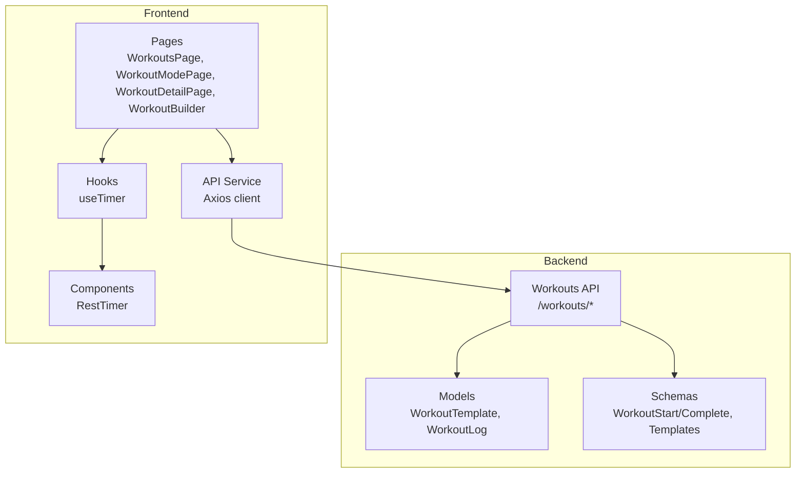
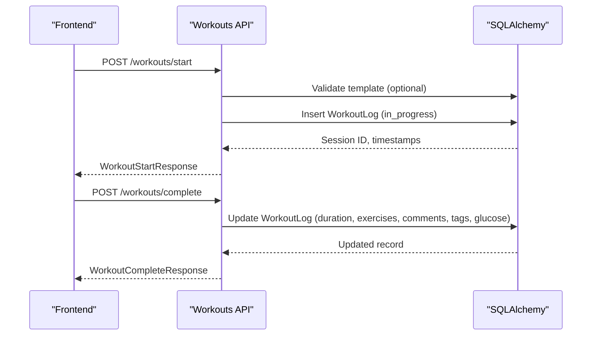
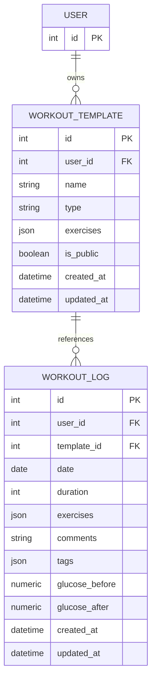
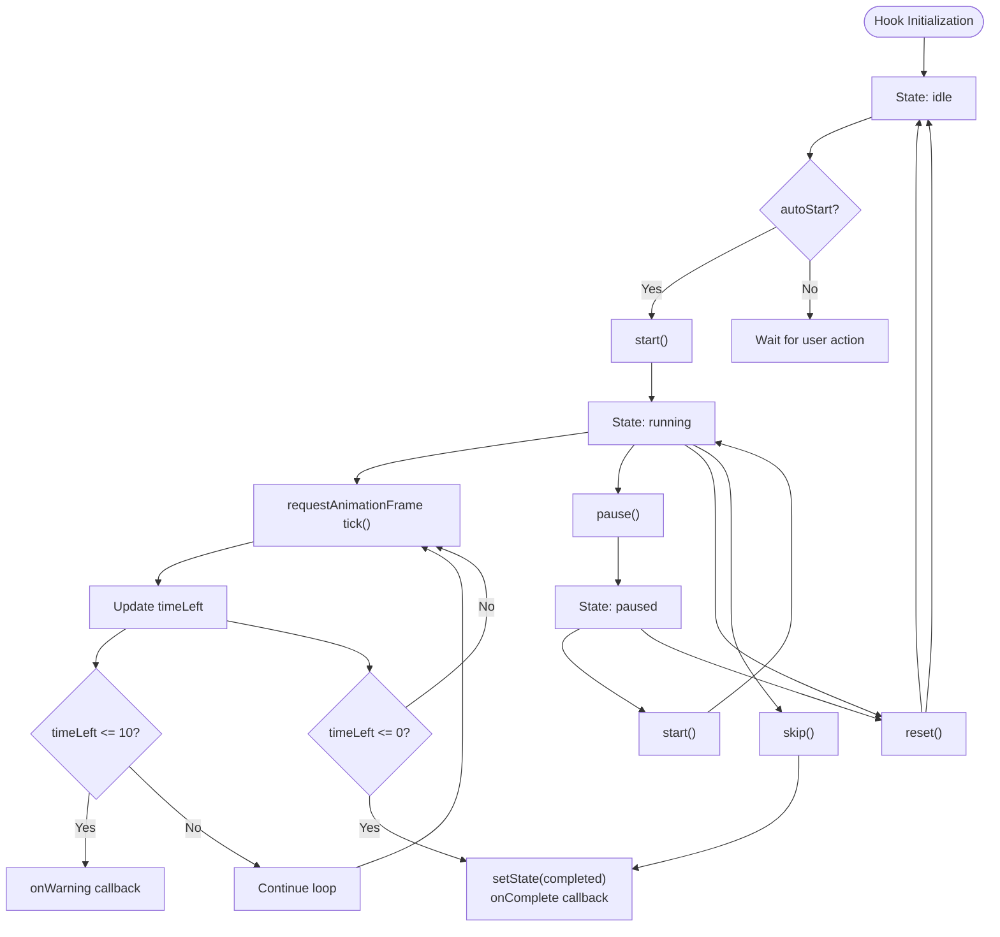
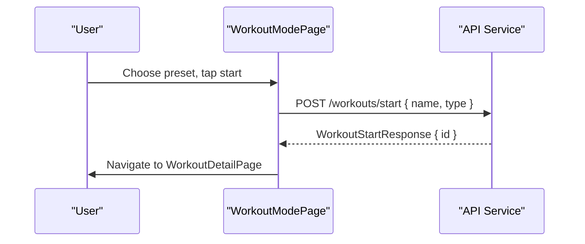
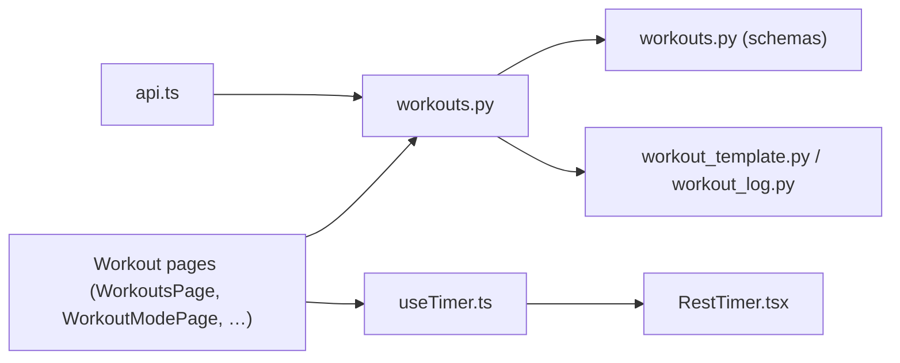

# Workout Session Tracking

<cite>
**Referenced Files in This Document**
- [workouts.py](file://backend/app/api/workouts.py)
- [workout_log.py](file://backend/app/models/workout_log.py)
- [workout_template.py](file://backend/app/models/workout_template.py)
- [workouts.py](file://backend/app/schemas/workouts.py)
- [exercises.py](file://backend/app/schemas/exercises.py)
- [api.ts](file://frontend/src/services/api.ts)
- [useTimer.ts](file://frontend/src/hooks/useTimer.ts)
- [RestTimer.tsx](file://frontend/src/components/workout/RestTimer.tsx)
- [WorkoutBuilder.tsx](file://frontend/src/pages/WorkoutBuilder.tsx)
- [WorkoutModePage.tsx](file://frontend/src/pages/WorkoutModePage.tsx)
- [WorkoutDetailPage.tsx](file://frontend/src/pages/WorkoutDetailPage.tsx)
- [workoutTypeConfigs.ts](file://frontend/src/features/workouts/config/workoutTypeConfigs.ts)
</cite>

## Table of Contents
1. [Introduction](#introduction)
2. [Project Structure](#project-structure)
3. [Core Components](#core-components)
4. [Architecture Overview](#architecture-overview)
5. [Detailed Component Analysis](#detailed-component-analysis)
6. [Dependency Analysis](#dependency-analysis)
7. [Performance Considerations](#performance-considerations)
8. [Troubleshooting Guide](#troubleshooting-guide)
9. [Conclusion](#conclusion)

## Introduction
This document describes the workout session tracking system covering the complete workflow from workout initiation to completion. It explains backend API endpoints for session creation, exercise logging, and session completion, alongside frontend components for workout execution, progress visualization, and session controls. Implementation details include timer management, rest period handling, exercise completion verification, and session statistics collection. Examples demonstrate session initiation, exercise execution, pause/resume functionality, and session termination with data persistence.

## Project Structure
The system consists of:
- Backend FastAPI application with SQLAlchemy models and Pydantic schemas for workout templates, logs, and session management
- Frontend React application with TypeScript, featuring workout screens, timers, and progress tracking
- Shared API service for HTTP communication with the backend



**Diagram sources**
- [workouts.py:1-522](file://backend/app/api/workouts.py#L1-L522)
- [workout_template.py:1-83](file://backend/app/models/workout_template.py#L1-L83)
- [workout_log.py:1-112](file://backend/app/models/workout_log.py#L1-L112)
- [workouts.py:1-146](file://backend/app/schemas/workouts.py#L1-L146)
- [api.ts:1-69](file://frontend/src/services/api.ts#L1-L69)
- [useTimer.ts:1-293](file://frontend/src/hooks/useTimer.ts#L1-L293)
- [RestTimer.tsx:1-550](file://frontend/src/components/workout/RestTimer.tsx#L1-L550)
- [WorkoutBuilder.tsx:1-1048](file://frontend/src/pages/WorkoutBuilder.tsx#L1-L1048)
- [WorkoutModePage.tsx](file://frontend/src/pages/WorkoutModePage.tsx)

**Section sources**
- [workouts.py:1-522](file://backend/app/api/workouts.py#L1-L522)
- [workout_template.py:1-83](file://backend/app/models/workout_template.py#L1-L83)
- [workout_log.py:1-112](file://backend/app/models/workout_log.py#L1-L112)
- [workouts.py:1-146](file://backend/app/schemas/workouts.py#L1-L146)
- [api.ts:1-69](file://frontend/src/services/api.ts#L1-L69)
- [useTimer.ts:1-293](file://frontend/src/hooks/useTimer.ts#L1-L293)
- [RestTimer.tsx:1-550](file://frontend/src/components/workout/RestTimer.tsx#L1-L550)
- [WorkoutBuilder.tsx:1-1048](file://frontend/src/pages/WorkoutBuilder.tsx#L1-L1048)
- [WorkoutModePage.tsx](file://frontend/src/pages/WorkoutModePage.tsx)

## Core Components
- Backend API router for workout templates, history, and session lifecycle
- SQLAlchemy models for workout templates and logs with JSON fields for exercises
- Pydantic schemas for request/response validation
- Frontend API service for authenticated HTTP requests
- Timer hooks and components for precise rest and interval timing
- Unified **mode** entry (`WorkoutModePage` + `workoutTypeConfigs.ts`) instead of a separate page per modality

Key responsibilities:
- Session state management: start, progress tracking, and completion
- Exercise progression: set logging, rest periods, and transitions
- Real-time data capture: timers, stats, and offline synchronization
- Data persistence: local storage and backend API

**Section sources**
- [workouts.py:337-493](file://backend/app/api/workouts.py#L337-L493)
- [workout_template.py:18-83](file://backend/app/models/workout_template.py#L18-L83)
- [workout_log.py:19-112](file://backend/app/models/workout_log.py#L19-L112)
- [workouts.py:72-121](file://backend/app/schemas/workouts.py#L72-L121)
- [api.ts:1-69](file://frontend/src/services/api.ts#L1-L69)
- [useTimer.ts:57-290](file://frontend/src/hooks/useTimer.ts#L57-L290)
- [RestTimer.tsx:115-550](file://frontend/src/components/workout/RestTimer.tsx#L115-L550)

## Architecture Overview
The system follows a layered architecture:
- Presentation layer: React pages and components
- Service layer: API service encapsulating HTTP client and interceptors
- Domain layer: Backend routers, schemas, and models
- Persistence layer: SQLAlchemy ORM with JSON fields for flexible exercise data

```mermaid
sequenceDiagram
participant User as "User"
participant Frontend as "Workout Page"
participant API as "Backend API"
participant DB as "Database"
User->>Frontend : Start workout
Frontend->>API : POST /workouts/start
API->>DB : Insert WorkoutLog (status=in_progress)
DB-->>API : New session record
API-->>Frontend : WorkoutStartResponse
loop During workout
Frontend->>Frontend : Timers / UI (useTimer, RestTimer where used)
Frontend->>Frontend : Session UX (evolving; detail view in WorkoutDetailPage)
end
User->>Frontend : Complete workout
Frontend->>API : POST /workouts/complete
API->>DB : Update WorkoutLog (duration, exercises, tags, glucose)
DB-->>API : Updated session
API-->>Frontend : WorkoutCompleteResponse
```

**Diagram sources**
- [workouts.py:337-493](file://backend/app/api/workouts.py#L337-L493)
- [workout_log.py:19-112](file://backend/app/models/workout_log.py#L19-L112)
- [useTimer.ts:106-149](file://frontend/src/hooks/useTimer.ts#L106-L149)
- [RestTimer.tsx:145-189](file://frontend/src/components/workout/RestTimer.tsx#L145-L189)
- [WorkoutModePage.tsx](file://frontend/src/pages/WorkoutModePage.tsx)

## Detailed Component Analysis

### Backend API: Workouts Lifecycle
The backend exposes endpoints for:
- Listing and managing workout templates
- Starting a workout session
- Completing a workout session
- Retrieving workout history



**Diagram sources**
- [workouts.py:337-493](file://backend/app/api/workouts.py#L337-L493)
- [workout_log.py:19-112](file://backend/app/models/workout_log.py#L19-L112)

Implementation highlights:
- Authentication via dependency injection and bearer token
- Validation of template ownership and existence
- JSON field for exercises allowing flexible set/reps/weights/durations
- Pagination and filtering for history queries

**Section sources**
- [workouts.py:29-105](file://backend/app/api/workouts.py#L29-L105)
- [workouts.py:260-334](file://backend/app/api/workouts.py#L260-L334)
- [workouts.py:337-493](file://backend/app/api/workouts.py#L337-L493)
- [workouts.py:72-121](file://backend/app/schemas/workouts.py#L72-L121)

### Backend Models: Workout Templates and Logs
The models define the data structure for templates and logs:
- WorkoutTemplate: JSON exercises array, type classification, public flag
- WorkoutLog: date, duration, exercises JSON, comments/tags, glucose metrics



**Diagram sources**
- [workout_template.py:18-83](file://backend/app/models/workout_template.py#L18-L83)
- [workout_log.py:19-112](file://backend/app/models/workout_log.py#L19-L112)

**Section sources**
- [workout_template.py:18-83](file://backend/app/models/workout_template.py#L18-L83)
- [workout_log.py:19-112](file://backend/app/models/workout_log.py#L19-L112)

### Frontend API Service
The API service centralizes HTTP communication:
- Base URL configurable via environment variable
- Interceptors for adding Authorization header and error handling
- Generic GET/POST/PUT/DELETE helpers

**Section sources**
- [api.ts:1-69](file://frontend/src/services/api.ts#L1-L69)

### Timer Management: useTimer Hook
The hook provides high-precision timing using requestAnimationFrame:
- State machine: idle, running, paused, completed
- Progress calculation and formatted time display
- Warning mode below 10 seconds
- Background operation support via visibility change
- Methods: start, pause, reset, setDuration, skip, addTime



**Diagram sources**
- [useTimer.ts:106-149](file://frontend/src/hooks/useTimer.ts#L106-L149)
- [useTimer.ts:151-190](file://frontend/src/hooks/useTimer.ts#L151-L190)
- [useTimer.ts:244-274](file://frontend/src/hooks/useTimer.ts#L244-L274)

**Section sources**
- [useTimer.ts:57-290](file://frontend/src/hooks/useTimer.ts#L57-L290)

### Rest Timer Component
The RestTimer component wraps the timer hook with UI:
- Circular progress visualization
- Sound notifications (Web Audio API)
- Haptic feedback integration
- Wake Lock API to keep screen awake
- Quick presets and manual adjustments

**Section sources**
- [RestTimer.tsx:115-550](file://frontend/src/components/workout/RestTimer.tsx#L115-L550)

### Mode-based session start (current UI)
All modalities (strength, cardio, yoga, functional) use the same React page with different config:
- User picks a mode on `WorkoutsPage` → `WorkoutModePage` loads `WORKOUT_TYPE_CONFIGS[mode]` (copy, presets, backend `type`).
- Starting a workout calls `POST /workouts/start`, then navigates to `WorkoutDetailPage` for the returned id.
- Rich per-type live tracking (set logging, HIIT phases, cardio metrics, yoga timers) is not split across separate page files; shared components such as `RestTimer` / `useTimer` remain available for future or demo flows (`RestTimerDemo`).



**Diagram sources**
- [WorkoutModePage.tsx](file://frontend/src/pages/WorkoutModePage.tsx)
- [WorkoutDetailPage.tsx](file://frontend/src/pages/WorkoutDetailPage.tsx)
- [workoutTypeConfigs.ts](file://frontend/src/features/workouts/config/workoutTypeConfigs.ts)

**Section sources**
- [WorkoutModePage.tsx](file://frontend/src/pages/WorkoutModePage.tsx)
- [WorkoutDetailPage.tsx](file://frontend/src/pages/WorkoutDetailPage.tsx)

### Workout Builder
The builder enables creating custom workout plans:
- Drag-and-drop exercise blocks (strength, cardio, timer, note)
- Exercise configuration modals
- Template saving with visibility and tags
- Auto-save to localStorage

**Section sources**
- [WorkoutBuilder.tsx:267-1048](file://frontend/src/pages/WorkoutBuilder.tsx#L267-L1048)

## Dependency Analysis
Backend dependencies:
- FastAPI router depends on SQLAlchemy async session and Pydantic schemas
- Models depend on SQLAlchemy ORM and JSON fields
- Middleware provides authentication and rate limiting

Frontend dependencies:
- Pages depend on API service and shared hooks/components
- Timer components depend on useTimer hook
- All components rely on design system primitives



**Diagram sources**
- [workouts.py:1-522](file://backend/app/api/workouts.py#L1-L522)
- [workouts.py:1-146](file://backend/app/schemas/workouts.py#L1-L146)
- [workout_template.py:1-83](file://backend/app/models/workout_template.py#L1-L83)
- [workout_log.py:1-112](file://backend/app/models/workout_log.py#L1-L112)
- [api.ts:1-69](file://frontend/src/services/api.ts#L1-L69)
- [useTimer.ts:1-293](file://frontend/src/hooks/useTimer.ts#L1-L293)
- [RestTimer.tsx:1-550](file://frontend/src/components/workout/RestTimer.tsx#L1-L550)
- [WorkoutModePage.tsx](file://frontend/src/pages/WorkoutModePage.tsx)

**Section sources**
- [workouts.py:1-522](file://backend/app/api/workouts.py#L1-L522)
- [workout_template.py:1-83](file://backend/app/models/workout_template.py#L1-L83)
- [workout_log.py:1-112](file://backend/app/models/workout_log.py#L1-L112)
- [workouts.py:1-146](file://backend/app/schemas/workouts.py#L1-L146)
- [api.ts:1-69](file://frontend/src/services/api.ts#L1-L69)
- [useTimer.ts:1-293](file://frontend/src/hooks/useTimer.ts#L1-L293)
- [RestTimer.tsx:1-550](file://frontend/src/components/workout/RestTimer.tsx#L1-L550)
- [WorkoutModePage.tsx](file://frontend/src/pages/WorkoutModePage.tsx)

## Performance Considerations
- Timer precision: requestAnimationFrame ensures smooth updates while maintaining accuracy
- Background operation: visibility change handling preserves timing continuity
- JSON fields: flexible exercise data avoids rigid schema constraints
- Offline-first: local storage prevents data loss; queue-based sync on reconnect
- Pagination: backend endpoints support pagination and filtering for history

## Troubleshooting Guide
Common issues and resolutions:
- Authentication failures: ensure Authorization header is present in API requests
- Timer not updating: verify requestAnimationFrame loop and visibility state handling
- Rest timer not audible: check browser audio policies and sound generator initialization
- Offline sync errors: inspect network connectivity and queued save promises
- Template not found: confirm template ownership and existence before starting a session

**Section sources**
- [api.ts:21-45](file://frontend/src/services/api.ts#L21-L45)
- [useTimer.ts:244-274](file://frontend/src/hooks/useTimer.ts#L244-L274)
- [RestTimer.tsx:39-110](file://frontend/src/components/workout/RestTimer.tsx#L39-L110)
- [WorkoutModePage.tsx](file://frontend/src/pages/WorkoutModePage.tsx)
- [workouts.py:373-390](file://backend/app/api/workouts.py#L373-L390)

## Conclusion
The workout session tracking system integrates robust backend APIs with flexible frontend components to deliver a seamless workout experience. It supports diverse workout types, precise timing, rest management, and offline-first data handling. The modular architecture enables extensibility for additional features while maintaining clear separation of concerns across layers.