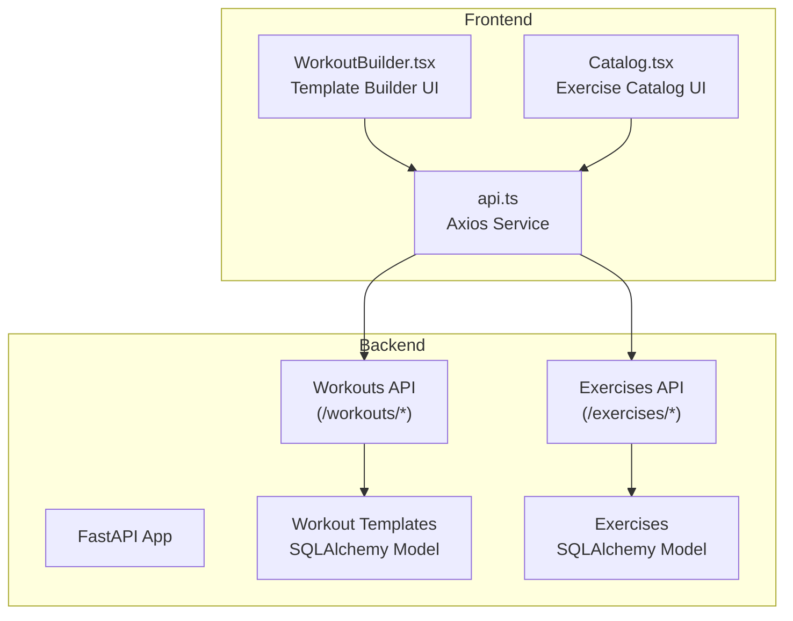
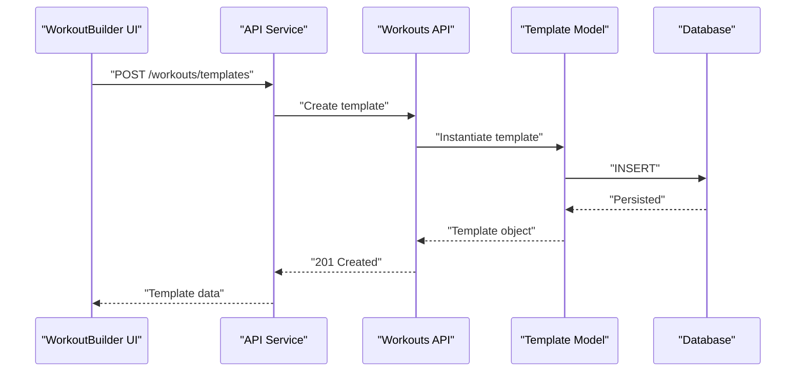
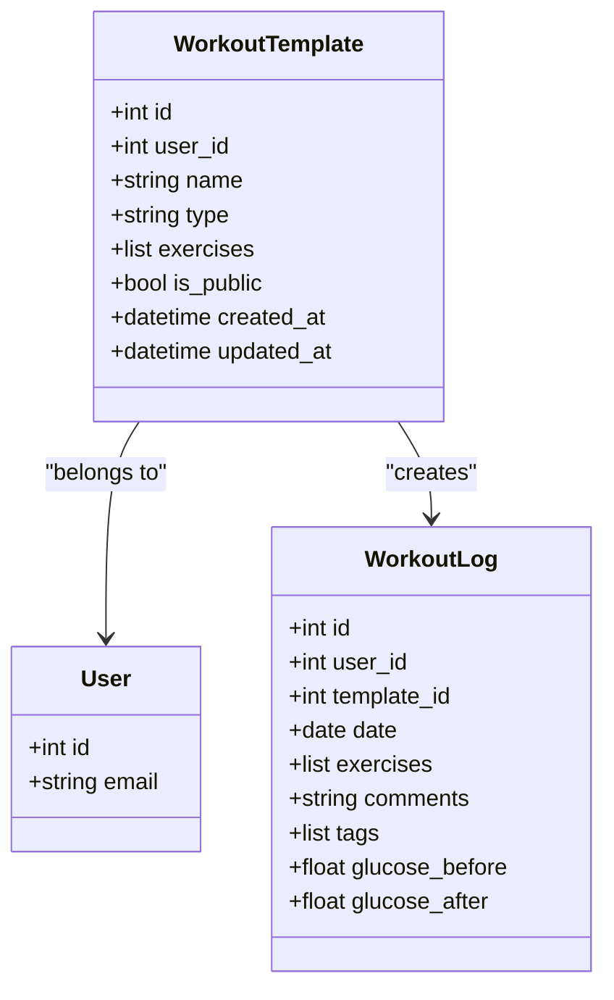
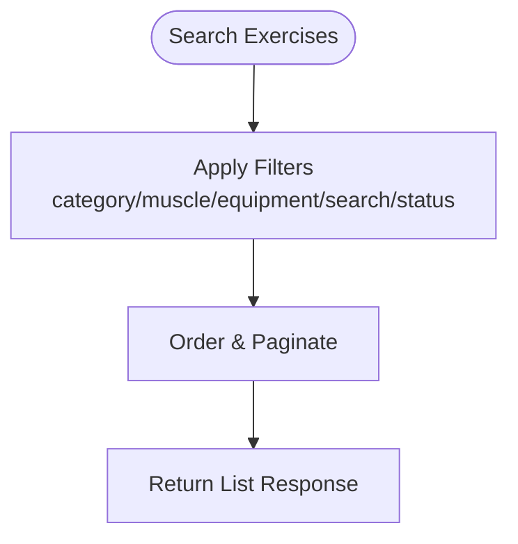
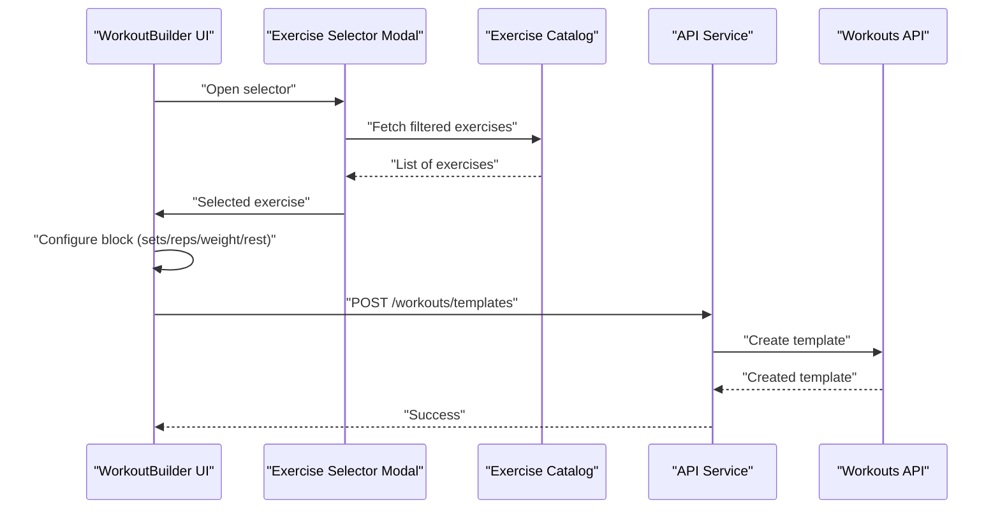
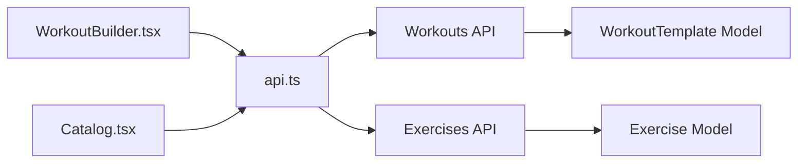

# Workout Template Management

<cite>
**Referenced Files in This Document**
- [workout_template.py](file://backend/app/models/workout_template.py)
- [workouts.py](file://backend/app/api/workouts.py)
- [workouts.py](file://backend/app/schemas/workouts.py)
- [exercises.py](file://backend/app/api/exercises.py)
- [exercise.py](file://backend/app/models/exercise.py)
- [exercises.py](file://backend/app/schemas/exercises.py)
- [WorkoutBuilder.tsx](file://frontend/src/pages/WorkoutBuilder.tsx)
- [Catalog.tsx](file://frontend/src/pages/Catalog.tsx)
- [api.ts](file://frontend/src/services/api.ts)
- [WorkoutsPage.tsx](file://frontend/src/pages/WorkoutsPage.tsx)
</cite>

## Table of Contents
1. [Introduction](#introduction)
2. [Project Structure](#project-structure)
3. [Core Components](#core-components)
4. [Architecture Overview](#architecture-overview)
5. [Detailed Component Analysis](#detailed-component-analysis)
6. [Dependency Analysis](#dependency-analysis)
7. [Performance Considerations](#performance-considerations)
8. [Troubleshooting Guide](#troubleshooting-guide)
9. [Conclusion](#conclusion)

## Introduction
This document describes the workout template management system, covering the backend API for CRUD operations on workout templates, the exercise catalog integration, and the frontend template builder interface. It explains template creation workflows, exercise catalog integration, validation processes, and provides examples for common operations such as adding/removing exercises, duplicating templates, and bulk operations. It also documents template sharing mechanisms, category organization, and search/filter capabilities.

## Project Structure
The system spans a FastAPI backend and a React/TypeScript frontend:
- Backend: SQLAlchemy models define workout templates and exercises; FastAPI routers expose endpoints for templates and exercises; Pydantic schemas validate requests/responses.
- Frontend: A drag-and-drop template builder allows creating, editing, and saving templates; an exercise catalog supports search and filtering; an API service centralizes HTTP communication.

**Diagram sources**
- [workouts.py:1-522](file://backend/app/api/workouts.py#L1-L522)
- [exercises.py:1-463](file://backend/app/api/exercises.py#L1-L463)
- [workout_template.py:1-83](file://backend/app/models/workout_template.py#L1-L83)
- [exercise.py:1-116](file://backend/app/models/exercise.py#L1-L116)
- [WorkoutBuilder.tsx:1-1048](file://frontend/src/pages/WorkoutBuilder.tsx#L1-L1048)
- [Catalog.tsx:1-1283](file://frontend/src/pages/Catalog.tsx#L1-L1283)
- [api.ts:1-69](file://frontend/src/services/api.ts#L1-L69)

**Section sources**
- [workouts.py:1-522](file://backend/app/api/workouts.py#L1-L522)
- [exercises.py:1-463](file://backend/app/api/exercises.py#L1-L463)
- [workout_template.py:1-83](file://backend/app/models/workout_template.py#L1-L83)
- [exercise.py:1-116](file://backend/app/models/exercise.py#L1-L116)
- [WorkoutBuilder.tsx:1-1048](file://frontend/src/pages/WorkoutBuilder.tsx#L1-L1048)
- [Catalog.tsx:1-1283](file://frontend/src/pages/Catalog.tsx#L1-L1283)
- [api.ts:1-69](file://frontend/src/services/api.ts#L1-L69)

## Core Components
- WorkoutTemplate model: Stores reusable workout templates with JSON-based exercises, type classification, visibility flag, and timestamps. Includes relationships to users and workout logs.
- Exercises catalog: Centralized exercise library with categories, equipment, muscle groups, risk flags, and moderation status.
- Workouts API: Endpoints for listing, creating, retrieving, updating, and deleting templates; starting and completing workouts; viewing history.
- Exercises API: Endpoints for browsing the exercise catalog, filtering by category/equipment/muscle groups, and administrative approval.
- Frontend Template Builder: Drag-and-drop builder for assembling templates, selecting exercises from the catalog, configuring sets/reps/weights/durations, and saving templates.
- Frontend Exercise Catalog: Search, filter, and view exercise details; supports adding exercises to templates.

**Section sources**
- [workout_template.py:18-83](file://backend/app/models/workout_template.py#L18-L83)
- [exercise.py:17-116](file://backend/app/models/exercise.py#L17-L116)
- [workouts.py:29-258](file://backend/app/api/workouts.py#L29-L258)
- [exercises.py:24-140](file://backend/app/api/exercises.py#L24-L140)
- [WorkoutBuilder.tsx:267-520](file://frontend/src/pages/WorkoutBuilder.tsx#L267-L520)
- [Catalog.tsx:1-1283](file://frontend/src/pages/Catalog.tsx#L1-L1283)

## Architecture Overview
The system follows a layered architecture:
- Data layer: SQLAlchemy models for templates and exercises.
- Service/API layer: FastAPI routers and Pydantic schemas for validation and serialization.
- Presentation layer: React components for building templates and browsing exercises.
- Communication: Axios-based API service encapsulates HTTP calls and auth headers.

**Diagram sources**
- [WorkoutBuilder.tsx:476-512](file://frontend/src/pages/WorkoutBuilder.tsx#L476-L512)
- [api.ts:52-54](file://frontend/src/services/api.ts#L52-L54)
- [workouts.py:108-162](file://backend/app/api/workouts.py#L108-L162)
- [workout_template.py:18-83](file://backend/app/models/workout_template.py#L18-L83)

**Section sources**
- [workouts.py:108-162](file://backend/app/api/workouts.py#L108-L162)
- [workout_template.py:18-83](file://backend/app/models/workout_template.py#L18-L83)
- [api.ts:1-69](file://frontend/src/services/api.ts#L1-L69)

## Detailed Component Analysis

### Backend: Workout Template Management
- Data model: The template model includes user association, name/type, JSON exercises array, public flag, and timestamps. It defines indexes for efficient queries and relationships to users and workout logs.
- Endpoints:
  - GET /workouts/templates: Lists user templates with pagination and optional type filter.
  - POST /workouts/templates: Creates a new template with validation via Pydantic.
  - GET /workouts/templates/{id}: Retrieves a specific template owned by the current user.
  - PUT /workouts/templates/{id}: Updates a template owned by the current user.
  - DELETE /workouts/templates/{id}: Deletes a template owned by the current user.
  - Additional endpoints for workout lifecycle: start, complete, and history.

**Diagram sources**
- [workout_template.py:18-83](file://backend/app/models/workout_template.py#L18-L83)

**Section sources**
- [workout_template.py:18-83](file://backend/app/models/workout_template.py#L18-L83)
- [workouts.py:29-258](file://backend/app/api/workouts.py#L29-L258)
- [workouts.py:42-70](file://backend/app/schemas/workouts.py#L42-L70)

### Backend: Exercise Catalog Integration
- Data model: Exercises include name, description, category, equipment, muscle groups, risk flags, media URL, status, and author association.
- Endpoints:
  - GET /exercises: Browse exercises with category, muscle group, equipment, search, and status filters; paginated.
  - GET /exercises/categories/list, /exercises/equipment/list, /exercises/muscle-groups/list: Enumerations for UI.
  - POST /exercises: Submit custom exercises for moderation (status starts as pending).
  - Admin endpoints: Update, delete, approve exercises.

**Diagram sources**
- [exercises.py:24-140](file://backend/app/api/exercises.py#L24-L140)
- [exercise.py:17-116](file://backend/app/models/exercise.py#L17-L116)

**Section sources**
- [exercises.py:24-140](file://backend/app/api/exercises.py#L24-L140)
- [exercise.py:17-116](file://backend/app/models/exercise.py#L17-L116)
- [exercises.py:10-84](file://backend/app/schemas/exercises.py#L10-L84)

### Frontend: Template Builder Interface
- Drag-and-drop builder: Uses @dnd-kit for reordering template blocks; supports strength/cardio/timer/note blocks.
- Exercise selection: Modal with search and category filters; integrates with the exercise catalog.
- Configuration: Per-block configuration for sets/reps/weight/rest for strength, duration/distance for cardio, duration for timer, and notes.
- Saving templates: Validates name and presence of blocks; sends template to backend; clears local draft.

**Diagram sources**
- [WorkoutBuilder.tsx:382-432](file://frontend/src/pages/WorkoutBuilder.tsx#L382-L432)
- [WorkoutBuilder.tsx:476-512](file://frontend/src/pages/WorkoutBuilder.tsx#L476-L512)
- [Catalog.tsx:1-1283](file://frontend/src/pages/Catalog.tsx#L1-L1283)
- [api.ts:52-54](file://frontend/src/services/api.ts#L52-L54)
- [workouts.py:108-162](file://backend/app/api/workouts.py#L108-L162)

**Section sources**
- [WorkoutBuilder.tsx:267-520](file://frontend/src/pages/WorkoutBuilder.tsx#L267-L520)
- [WorkoutBuilder.tsx:522-760](file://frontend/src/pages/WorkoutBuilder.tsx#L522-L760)
- [WorkoutBuilder.tsx:762-942](file://frontend/src/pages/WorkoutBuilder.tsx#L762-L942)
- [WorkoutBuilder.tsx:944-1042](file://frontend/src/pages/WorkoutBuilder.tsx#L944-L1042)
- [Catalog.tsx:1-1283](file://frontend/src/pages/Catalog.tsx#L1-L1283)
- [api.ts:1-69](file://frontend/src/services/api.ts#L1-L69)

### Frontend: Exercise Catalog
- Filtering: Supports category, equipment, muscle groups, difficulty, and search.
- Detail view: Rich modal with description, instructions, tips, equipment, risks, and similar exercises.
- Integration: Used by the template builder to add exercises to templates.

**Section sources**
- [Catalog.tsx:1-1283](file://frontend/src/pages/Catalog.tsx#L1-L1283)

### API Endpoints Reference

#### Workout Templates
- GET /workouts/templates
  - Query: page, page_size, template_type
  - Response: paginated list of templates
- POST /workouts/templates
  - Request: name, type, exercises[], is_public
  - Response: created template
- GET /workouts/templates/{id}
  - Response: template
- PUT /workouts/templates/{id}
  - Request: name, type, exercises[], is_public
  - Response: updated template
- DELETE /workouts/templates/{id}
  - Response: 204 No Content

#### Exercise Catalog
- GET /exercises
  - Query: category, muscle_group, equipment, search, status, page, page_size
  - Response: paginated list with filters
- GET /exercises/categories/list
  - Response: categories enumeration
- GET /exercises/equipment/list
  - Response: equipment enumeration
- GET /exercises/muscle-groups/list
  - Response: muscle groups enumeration
- POST /exercises
  - Request: exercise fields; status defaults to pending
  - Response: created exercise

**Section sources**
- [workouts.py:29-258](file://backend/app/api/workouts.py#L29-L258)
- [workouts.py:42-146](file://backend/app/schemas/workouts.py#L42-L146)
- [exercises.py:24-463](file://backend/app/api/exercises.py#L24-L463)
- [exercises.py:10-84](file://backend/app/schemas/exercises.py#L10-L84)

## Dependency Analysis
- Backend dependencies:
  - WorkoutTemplate depends on User and WorkoutLog relationships.
  - Workouts API depends on WorkoutTemplate and WorkoutLog models.
  - Exercises API depends on Exercise model and admin middleware.
- Frontend dependencies:
  - WorkoutBuilder uses @dnd-kit for drag-and-drop and integrates with the API service.
  - Catalog provides exercise data consumed by the builder.
  - API service injects auth tokens and centralizes HTTP logic.

**Diagram sources**
- [WorkoutBuilder.tsx:1-1048](file://frontend/src/pages/WorkoutBuilder.tsx#L1-L1048)
- [Catalog.tsx:1-1283](file://frontend/src/pages/Catalog.tsx#L1-L1283)
- [api.ts:1-69](file://frontend/src/services/api.ts#L1-L69)
- [workouts.py:1-522](file://backend/app/api/workouts.py#L1-L522)
- [exercises.py:1-463](file://backend/app/api/exercises.py#L1-L463)
- [workout_template.py:1-83](file://backend/app/models/workout_template.py#L1-L83)
- [exercise.py:1-116](file://backend/app/models/exercise.py#L1-L116)

**Section sources**
- [workout_template.py:66-72](file://backend/app/models/workout_template.py#L66-L72)
- [exercise.py:103-104](file://backend/app/models/exercise.py#L103-L104)
- [workouts.py:1-522](file://backend/app/api/workouts.py#L1-L522)
- [exercises.py:1-463](file://backend/app/api/exercises.py#L1-L463)
- [api.ts:1-69](file://frontend/src/services/api.ts#L1-L69)

## Performance Considerations
- Pagination: Both templates and exercises endpoints support page/page_size to limit payload sizes.
- Indexes: Template model includes indexes on user_id, type, is_public, and created_at for efficient filtering and sorting.
- JSON exercises: Storing exercises as JSON enables flexible schemas but requires careful validation and avoids overly large payloads.
- Frontend caching: Local storage drafts reduce unnecessary network calls during template creation.

[No sources needed since this section provides general guidance]

## Troubleshooting Guide
- Authentication: API service automatically attaches Authorization header when available; ensure tokens are present for protected routes.
- Validation errors: Template creation/update validates fields via Pydantic; check request payload structure and constraints.
- Not found errors: Template or workout retrieval raises 404 if ownership checks fail; verify template_id and current user context.
- Exercise moderation: Newly submitted exercises have status pending; confirm moderation flow if not visible immediately.

**Section sources**
- [api.ts:21-45](file://frontend/src/services/api.ts#L21-L45)
- [workouts.py:108-162](file://backend/app/api/workouts.py#L108-L162)
- [workouts.py:165-190](file://backend/app/api/workouts.py#L165-L190)
- [exercises.py:168-220](file://backend/app/api/exercises.py#L168-L220)

## Conclusion
The workout template management system combines a robust backend with flexible template storage and a comprehensive exercise catalog, enabling users to create, organize, and share workout templates. The frontend provides an intuitive builder with drag-and-drop, search, and configuration features, while the backend enforces validation, ownership, and moderation where applicable. Together, they support efficient template workflows, categorization, and discovery.