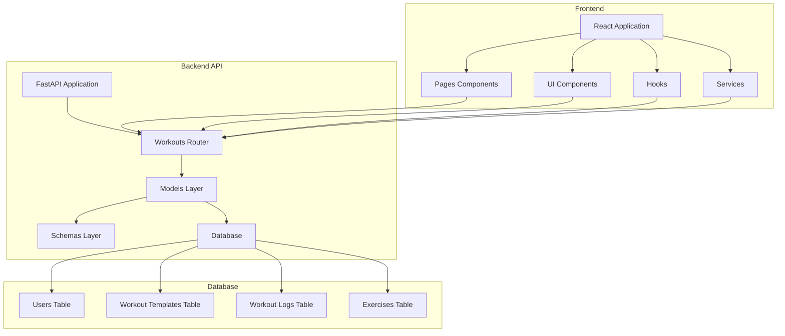
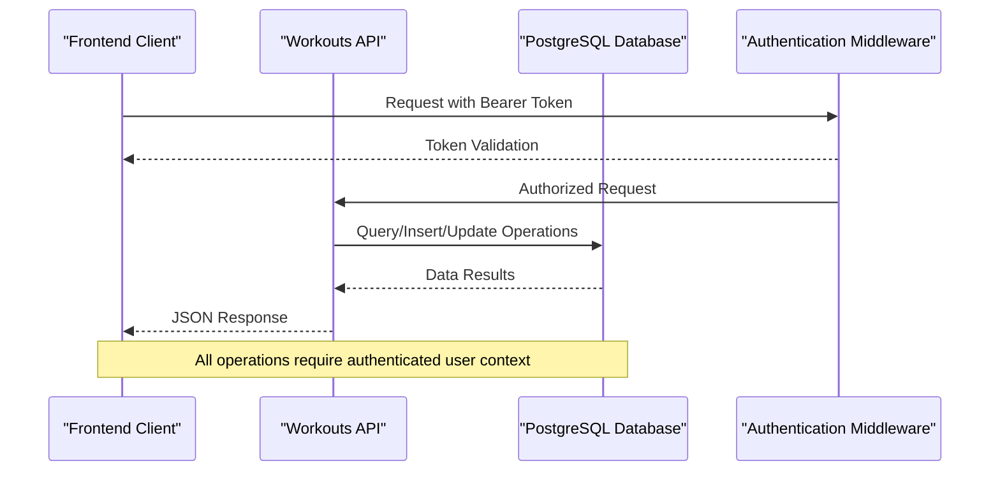
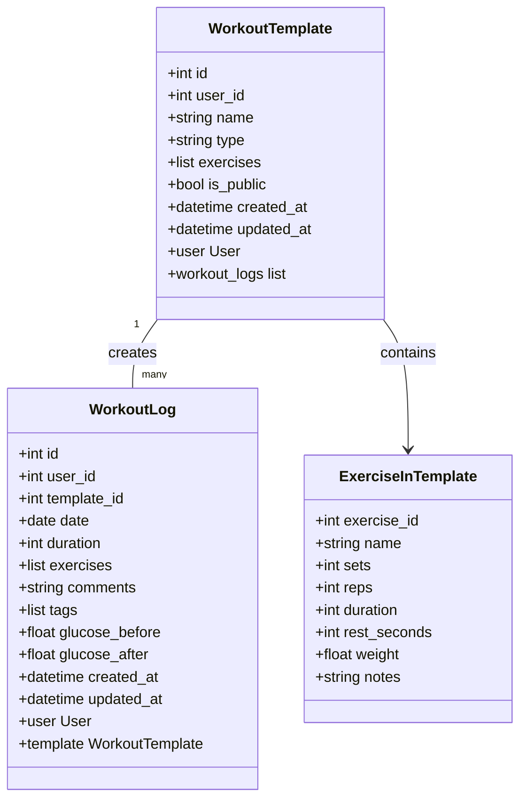
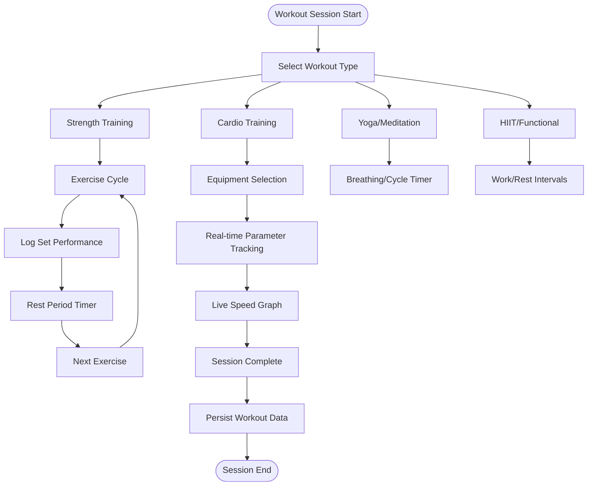
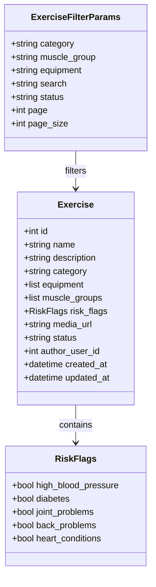
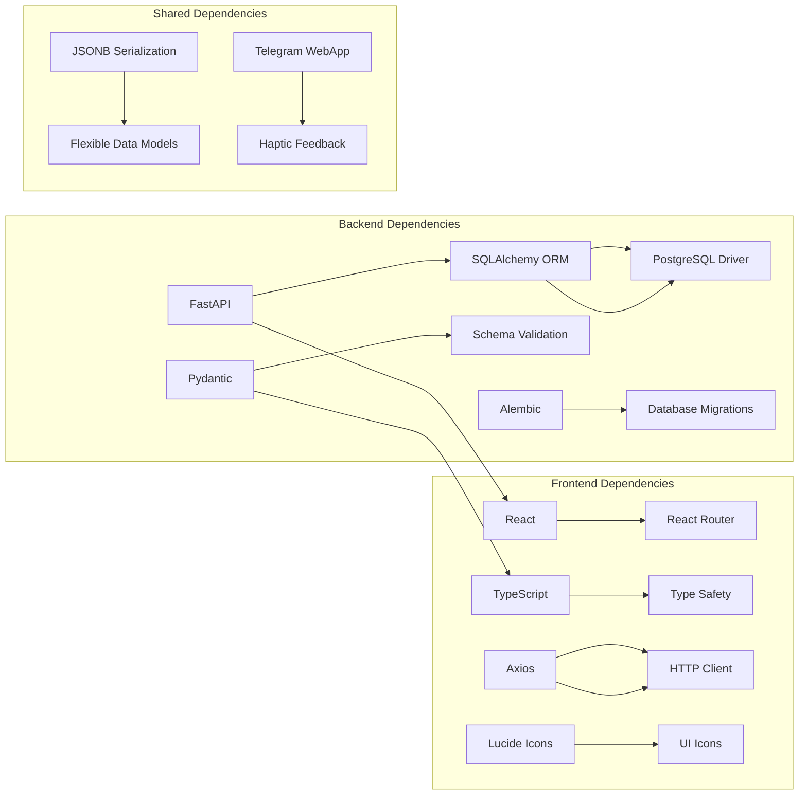

# Workout Tracking System

<cite>
**Referenced Files in This Document**
- [workouts.py](file://backend/app/api/workouts.py)
- [workout_template.py](file://backend/app/models/workout_template.py)
- [workout_log.py](file://backend/app/models/workout_log.py)
- [workouts.py](file://backend/app/schemas/workouts.py)
- [exercises.py](file://backend/app/schemas/exercises.py)
- [api.ts](file://frontend/src/services/api.ts)
- [WorkoutBuilder.tsx](file://frontend/src/pages/WorkoutBuilder.tsx)
- [WorkoutsPage.tsx](file://frontend/src/pages/WorkoutsPage.tsx)
- [Catalog.tsx](file://frontend/src/pages/Catalog.tsx)
- [AddExercise.tsx](file://frontend/src/pages/AddExercise.tsx)
- [WorkoutStrength.tsx](file://frontend/src/pages/WorkoutStrength.tsx)
- [WorkoutCardio.tsx](file://frontend/src/pages/WorkoutCardio.tsx)
- [WorkoutYoga.tsx](file://frontend/src/pages/WorkoutYoga.tsx)
- [WorkoutFunctional.tsx](file://frontend/src/pages/WorkoutFunctional.tsx)
- [RestTimer.tsx](file://frontend/src/components/workout/RestTimer.tsx)
- [useTimer.ts](file://frontend/src/hooks/useTimer.ts)
- [cd723942379e_initial_schema.py](file://database/migrations/versions/cd723942379e_initial_schema.py)
</cite>

## Table of Contents
1. [Introduction](#introduction)
2. [Project Structure](#project-structure)
3. [Core Components](#core-components)
4. [Architecture Overview](#architecture-overview)
5. [Detailed Component Analysis](#detailed-component-analysis)
6. [Dependency Analysis](#dependency-analysis)
7. [Performance Considerations](#performance-considerations)
8. [Troubleshooting Guide](#troubleshooting-guide)
9. [Conclusion](#conclusion)

## Introduction
This document provides comprehensive documentation for the workout tracking system implementation. It covers the complete workflow from workout template creation to session completion, including exercise selection, timer management, rest period handling, and progress tracking. The backend API exposes endpoints for workout management, template CRUD operations, and session logging. The frontend includes components for workout browsing, exercise selection, and real-time workout execution across different workout types (strength, cardio, yoga, functional).

## Project Structure
The system follows a clear separation of concerns with distinct backend and frontend layers:

**Diagram sources**
- [workouts.py:1-522](file://backend/app/api/workouts.py#L1-L522)
- [workout_template.py:1-83](file://backend/app/models/workout_template.py#L1-L83)
- [workout_log.py:1-112](file://backend/app/models/workout_log.py#L1-L112)

**Section sources**
- [workouts.py:1-522](file://backend/app/api/workouts.py#L1-L522)
- [workout_template.py:1-83](file://backend/app/models/workout_template.py#L1-L83)
- [workout_log.py:1-112](file://backend/app/models/workout_log.py#L1-L112)

## Core Components

### Backend API Endpoints
The backend provides comprehensive workout management through FastAPI routers:

**Workout Template Management:**
- GET `/workouts/templates` - Retrieve paginated workout templates with filtering by type
- POST `/workouts/templates` - Create new workout templates
- GET `/workouts/templates/{template_id}` - Get specific template
- PUT `/workouts/templates/{template_id}` - Update existing template
- DELETE `/workouts/templates/{template_id}` - Delete template

**Session Management:**
- GET `/workouts/history` - Retrieve workout history with date range filtering
- POST `/workouts/start` - Start a new workout session
- POST `/workouts/complete` - Complete a workout session
- GET `/workouts/history/{workout_id}` - Get specific workout details

**Exercise Catalog Management:**
- GET `/exercises` - List exercises with filtering and pagination
- POST `/exercises` - Create new exercises
- GET `/exercises/{exercise_id}` - Get exercise details
- PUT `/exercises/{exercise_id}` - Update exercise
- DELETE `/exercises/{exercise_id}` - Delete exercise

**Section sources**
- [workouts.py:29-522](file://backend/app/api/workouts.py#L29-L522)
- [exercises.py:1-84](file://backend/app/schemas/exercises.py#L1-L84)

### Database Schema
The system uses PostgreSQL with JSONB fields for flexible data storage:

**Core Tables:**
- `users` - User profiles and settings
- `workout_templates` - Reusable workout templates with JSONB exercises array
- `workout_logs` - Completed workout sessions with JSONB exercises and tags
- `exercises` - Exercise catalog with equipment and muscle group metadata

**Data Persistence Patterns:**
- JSONB serialization for dynamic exercise configurations
- Foreign key relationships with cascading deletes
- GIN indexes for efficient JSONB queries
- Timestamp tracking with automatic updates

**Section sources**
- [cd723942379e_initial_schema.py:19-460](file://database/migrations/versions/cd723942379e_initial_schema.py#L19-L460)

## Architecture Overview

**Diagram sources**
- [workouts.py:8-26](file://backend/app/api/workouts.py#L8-L26)
- [api.ts:21-45](file://frontend/src/services/api.ts#L21-L45)

The architecture implements a clean separation between presentation, business logic, and data access layers, with comprehensive error handling and validation at each boundary.

## Detailed Component Analysis

### Workout Template System

The template system enables users to create reusable workout plans with flexible exercise configurations:

**Diagram sources**
- [workout_template.py:18-83](file://backend/app/models/workout_template.py#L18-L83)
- [workout_log.py:19-112](file://backend/app/models/workout_log.py#L19-L112)
- [workouts.py:10-47](file://backend/app/schemas/workouts.py#L10-L47)

**Template Creation Workflow:**
1. User selects exercise type (strength/cardio/flexibility)
2. Configure sets, reps, weights, and rest periods
3. Save template with public/private visibility
4. Access templates for future workouts

**Section sources**
- [WorkoutBuilder.tsx:1-800](file://frontend/src/pages/WorkoutBuilder.tsx#L1-L800)
- [workouts.py:42-62](file://backend/app/schemas/workouts.py#L42-L62)

### Real-Time Workout Execution

The system provides specialized workout screens for different exercise types with integrated timing and progression tracking:

**Diagram sources**
- [WorkoutStrength.tsx:1-823](file://frontend/src/pages/WorkoutStrength.tsx#L1-L823)
- [WorkoutCardio.tsx:1-941](file://frontend/src/pages/WorkoutCardio.tsx#L1-L941)
- [WorkoutYoga.tsx:1-959](file://frontend/src/pages/WorkoutYoga.tsx#L1-L959)
- [WorkoutFunctional.tsx:1-738](file://frontend/src/pages/WorkoutFunctional.tsx#L1-L738)

**Section sources**
- [RestTimer.tsx:1-550](file://frontend/src/components/workout/RestTimer.tsx#L1-L550)
- [useTimer.ts:1-293](file://frontend/src/hooks/useTimer.ts#L1-L293)

### Exercise Catalog Management

The exercise catalog provides comprehensive exercise discovery and management:

**Diagram sources**
- [exercises.py:25-84](file://backend/app/schemas/exercises.py#L25-L84)

**Section sources**
- [Catalog.tsx:1-800](file://frontend/src/pages/Catalog.tsx#L1-L800)
- [AddExercise.tsx:1-845](file://frontend/src/pages/AddExercise.tsx#L1-L845)

### Frontend Component Architecture

The frontend implements a modular component system with specialized screens for each workout type:

**Shared Components:**
- `RestTimer` - High-precision timer with haptic feedback and sound
- `useTimer` - Hook for accurate timing with requestAnimationFrame
- `api.ts` - Centralized API service with interceptors

**Workout Type Components:**
- `WorkoutStrength` - Weight training with set logging and progression
- `WorkoutCardio` - Cardio sessions with equipment selection and metrics
- `WorkoutYoga` - Meditation and yoga with breathing cycles
- `WorkoutFunctional` - HIIT intervals with auto-switching

**Section sources**
- [api.ts:1-69](file://frontend/src/services/api.ts#L1-L69)
- [RestTimer.tsx:1-550](file://frontend/src/components/workout/RestTimer.tsx#L1-L550)
- [useTimer.ts:1-293](file://frontend/src/hooks/useTimer.ts#L1-L293)

## Dependency Analysis

**Diagram sources**
- [workouts.py:1-26](file://backend/app/api/workouts.py#L1-L26)
- [api.ts:1-69](file://frontend/src/services/api.ts#L1-L69)

**Backend Dependencies:**
- FastAPI for REST API development
- SQLAlchemy for ORM and database operations
- Pydantic for data validation and serialization
- Alembic for database schema migrations

**Frontend Dependencies:**
- React for component-based UI
- TypeScript for type safety
- Axios for HTTP communication
- Lucide icons for consistent UI elements

**Section sources**
- [workouts.py:1-26](file://backend/app/api/workouts.py#L1-L26)
- [api.ts:1-69](file://frontend/src/services/api.ts#L1-L69)

## Performance Considerations

### Database Optimization
- **GIN Indexes**: JSONB fields use GIN indexes for efficient querying
- **Pagination**: API endpoints implement pagination with configurable page sizes
- **Foreign Keys**: Proper indexing on foreign key relationships
- **JSONB Storage**: Flexible schema reduces table joins while maintaining performance

### Frontend Performance
- **requestAnimationFrame**: High-precision timing without blocking UI thread
- **Component Memoization**: React.memo for expensive components
- **Lazy Loading**: Dynamic imports for route components
- **State Management**: Local state for offline-first experience

### API Performance
- **Async Operations**: Non-blocking database operations
- **Query Optimization**: Efficient filtering and sorting
- **Response Caching**: Appropriate caching headers
- **Connection Pooling**: Database connection management

## Troubleshooting Guide

### Common Issues and Solutions

**Authentication Problems:**
- Verify Bearer token format in Authorization header
- Check token expiration and refresh mechanisms
- Ensure user authentication middleware is properly configured

**Database Connection Issues:**
- Verify PostgreSQL connection string and credentials
- Check database migration status
- Monitor connection pool limits

**Timer Synchronization:**
- Use requestAnimationFrame for accurate timing
- Handle browser background tab scenarios
- Implement wake lock for continuous operation

**Data Persistence:**
- Implement offline-first with localStorage fallback
- Handle network failures gracefully
- Use optimistic updates with rollback capabilities

**Section sources**
- [workouts.py:8-26](file://backend/app/api/workouts.py#L8-L26)
- [api.ts:21-45](file://frontend/src/services/api.ts#L21-L45)

## Conclusion

The workout tracking system provides a comprehensive solution for fitness management with robust backend APIs, flexible frontend components, and scalable database architecture. The system supports multiple workout types with specialized UI components, real-time timing capabilities, and offline-first data persistence. The modular design allows for easy extension and customization while maintaining performance and reliability.

Key strengths include:
- Flexible exercise and template management
- Real-time workout execution with precise timing
- Comprehensive exercise catalog with filtering
- Offline-first architecture with automatic synchronization
- Scalable database schema with JSONB flexibility
- Modular frontend components with shared utilities

The system is well-suited for both individual fitness tracking and community-driven exercise sharing, with clear pathways for extending functionality and integrating additional features.