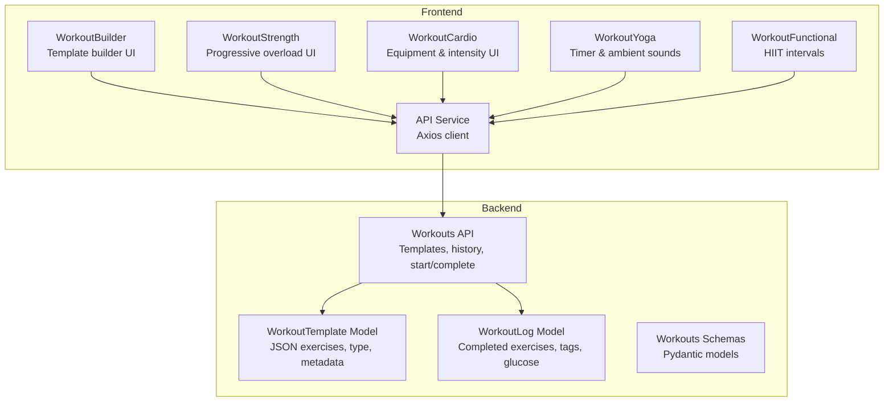
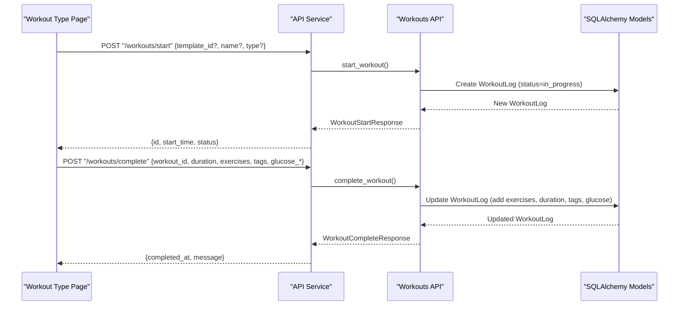
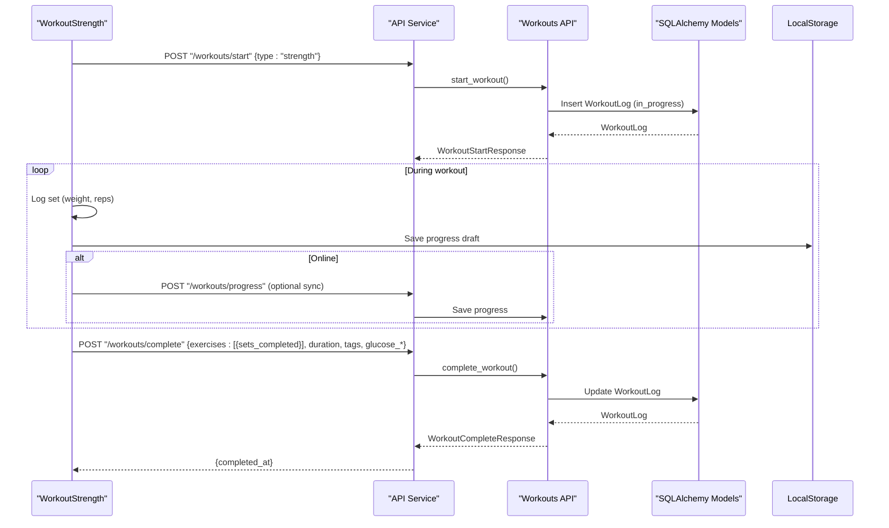
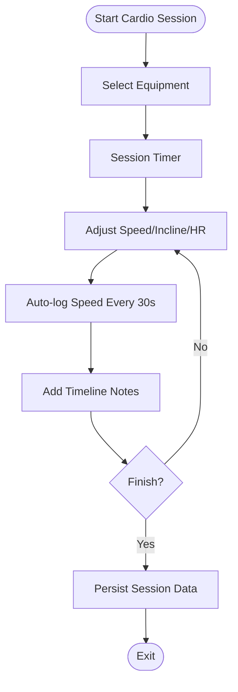
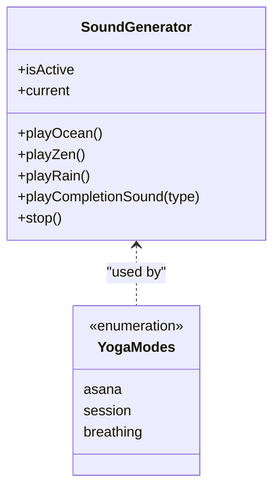
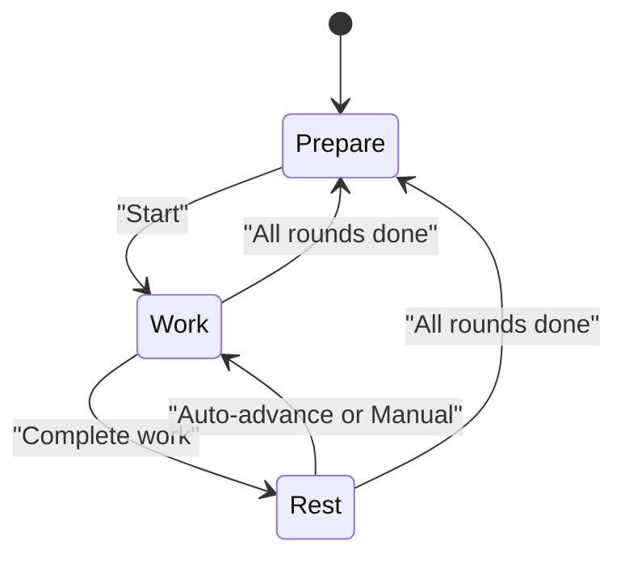
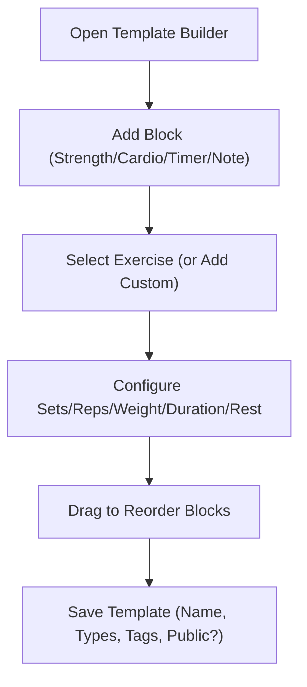
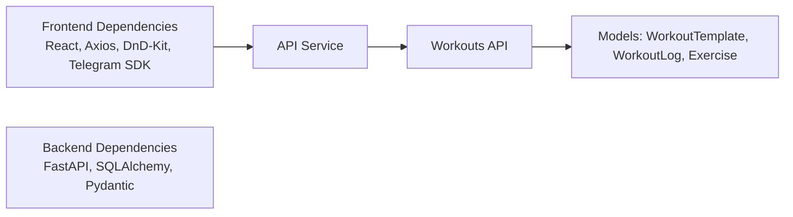

# Workout Type Specializations

<cite>
**Referenced Files in This Document**
- [workout_template.py](file://backend/app/models/workout_template.py)
- [exercise.py](file://backend/app/models/exercise.py)
- [workouts.py](file://backend/app/api/workouts.py)
- [workouts.py](file://backend/app/schemas/workouts.py)
- [workout_log.py](file://backend/app/models/workout_log.py)
- [WorkoutBuilder.tsx](file://frontend/src/pages/WorkoutBuilder.tsx)
- [WorkoutStrength.tsx](file://frontend/src/pages/WorkoutStrength.tsx)
- [WorkoutCardio.tsx](file://frontend/src/pages/WorkoutCardio.tsx)
- [WorkoutYoga.tsx](file://frontend/src/pages/WorkoutYoga.tsx)
- [WorkoutFunctional.tsx](file://frontend/src/pages/WorkoutFunctional.tsx)
- [api.ts](file://frontend/src/services/api.ts)
- [package.json](file://frontend/package.json)
</cite>

## Table of Contents
1. [Introduction](#introduction)
2. [Project Structure](#project-structure)
3. [Core Components](#core-components)
4. [Architecture Overview](#architecture-overview)
5. [Detailed Component Analysis](#detailed-component-analysis)
6. [Dependency Analysis](#dependency-analysis)
7. [Performance Considerations](#performance-considerations)
8. [Troubleshooting Guide](#troubleshooting-guide)
9. [Conclusion](#conclusion)

## Introduction
This document explains the workout type specializations implemented in the FitTracker Pro application. It covers backend models and APIs for workout templates and logs, and frontend components designed for four workout categories: strength training, cardio, yoga, and functional movements. It also documents specialized templates, exercise recommendations, protocols, UI patterns, progress tracking, metrics, equipment requirements, and safety considerations for each specialization.

## Project Structure
The system comprises:
- Backend: SQLAlchemy models for templates and logs, Pydantic schemas for API requests/responses, and FastAPI endpoints for managing workout templates, history, and session lifecycle.
- Frontend: TypeScript/React pages for each workout type, with dedicated UI patterns, timers, and progress tracking. Shared API service handles HTTP communication.

**Diagram sources**
- [workout_template.py:18-83](file://backend/app/models/workout_template.py#L18-L83)
- [workout_log.py:19-112](file://backend/app/models/workout_log.py#L19-L112)
- [workouts.py:26-522](file://backend/app/api/workouts.py#L26-L522)
- [workouts.py:42-146](file://backend/app/schemas/workouts.py#L42-L146)
- [WorkoutBuilder.tsx:1-800](file://frontend/src/pages/WorkoutBuilder.tsx#L1-L800)
- [WorkoutStrength.tsx:1-820](file://frontend/src/pages/WorkoutStrength.tsx#L1-L820)
- [WorkoutCardio.tsx:1-941](file://frontend/src/pages/WorkoutCardio.tsx#L1-L941)
- [WorkoutYoga.tsx:1-959](file://frontend/src/pages/WorkoutYoga.tsx#L1-L959)
- [WorkoutFunctional.tsx:1-738](file://frontend/src/pages/WorkoutFunctional.tsx#L1-L738)
- [api.ts:1-69](file://frontend/src/services/api.ts#L1-L69)

**Section sources**
- [workout_template.py:18-83](file://backend/app/models/workout_template.py#L18-L83)
- [workout_log.py:19-112](file://backend/app/models/workout_log.py#L19-L112)
- [workouts.py:26-522](file://backend/app/api/workouts.py#L26-L522)
- [workouts.py:42-146](file://backend/app/schemas/workouts.py#L42-L146)
- [WorkoutBuilder.tsx:1-800](file://frontend/src/pages/WorkoutBuilder.tsx#L1-L800)
- [WorkoutStrength.tsx:1-820](file://frontend/src/pages/WorkoutStrength.tsx#L1-L820)
- [WorkoutCardio.tsx:1-941](file://frontend/src/pages/WorkoutCardio.tsx#L1-L941)
- [WorkoutYoga.tsx:1-959](file://frontend/src/pages/WorkoutYoga.tsx#L1-L959)
- [WorkoutFunctional.tsx:1-738](file://frontend/src/pages/WorkoutFunctional.tsx#L1-L738)
- [api.ts:1-69](file://frontend/src/services/api.ts#L1-L69)

## Core Components
- Backend models:
  - WorkoutTemplate: reusable workout templates with type (cardio, strength, flexibility, mixed), JSON exercises array, and metadata.
  - WorkoutLog: completed workout records with exercises, duration, comments, tags, and optional glucose readings.
  - Exercise: exercise catalog with category (strength, cardio, flexibility, balance, sport), equipment needs, muscle groups, risk flags, and media.
- Backend API:
  - Templates CRUD, filtering by type, pagination, and validation via Pydantic schemas.
  - History retrieval with date range filters.
  - Start/complete workout session lifecycle.
- Frontend:
  - Template builder for creating reusable templates with drag-and-drop ordering.
  - Specialized workout screens with timers, controls, and progress tracking.
  - Shared API service for HTTP requests.

**Section sources**
- [workout_template.py:18-83](file://backend/app/models/workout_template.py#L18-L83)
- [workout_log.py:19-112](file://backend/app/models/workout_log.py#L19-L112)
- [exercise.py:17-116](file://backend/app/models/exercise.py#L17-L116)
- [workouts.py:26-522](file://backend/app/api/workouts.py#L26-L522)
- [workouts.py:42-146](file://backend/app/schemas/workouts.py#L42-L146)
- [WorkoutBuilder.tsx:1-800](file://frontend/src/pages/WorkoutBuilder.tsx#L1-L800)
- [WorkoutStrength.tsx:1-820](file://frontend/src/pages/WorkoutStrength.tsx#L1-L820)
- [WorkoutCardio.tsx:1-941](file://frontend/src/pages/WorkoutCardio.tsx#L1-L941)
- [WorkoutYoga.tsx:1-959](file://frontend/src/pages/WorkoutYoga.tsx#L1-L959)
- [WorkoutFunctional.tsx:1-738](file://frontend/src/pages/WorkoutFunctional.tsx#L1-L738)
- [api.ts:1-69](file://frontend/src/services/api.ts#L1-L69)

## Architecture Overview
The backend exposes REST endpoints for templates and workout logs. The frontend consumes these endpoints via a shared API service. Each workout type page encapsulates its own UI patterns and timers while reusing common components and services.

**Diagram sources**
- [workouts.py:337-493](file://backend/app/api/workouts.py#L337-L493)
- [workout_log.py:19-112](file://backend/app/models/workout_log.py#L19-L112)
- [api.ts:1-69](file://frontend/src/services/api.ts#L1-L69)

## Detailed Component Analysis

### Backend Models and Schemas
- WorkoutTemplate
  - Fields: user_id, name, type, exercises (JSON), is_public, timestamps.
  - Indexes: user_id, type, is_public, created_at.
  - Purpose: store reusable workout plans with exercise blocks and rest durations.
- WorkoutLog
  - Fields: user_id, template_id, date, duration, exercises (JSON), comments, tags, glucose_before/after.
  - Indexes: user_id, template_id, date, user_id+date.
  - Purpose: record completed sessions with actual performance data.
- Exercise
  - Fields: name, description, category, equipment (JSON), muscle_groups (JSON), risk_flags (JSON), media_url, status, author_user_id.
  - Indexes: name, category, status, author_user_id, created_at.
  - Purpose: exercise library with equipment and risk flags for safety.
- Workouts Schemas
  - ExerciseInTemplate: exercise fields within templates (sets, reps, duration, rest_seconds, weight, notes).
  - CompletedSet/CompletedExercise: structure for completed sets and exercises.
  - WorkoutTemplateCreate/Response: template creation and response.
  - WorkoutStart/Complete Request/Response: session lifecycle payloads.
  - WorkoutHistoryItem/Response: historical entries with pagination and date filters.

**Section sources**
- [workout_template.py:18-83](file://backend/app/models/workout_template.py#L18-L83)
- [workout_log.py:19-112](file://backend/app/models/workout_log.py#L19-L112)
- [exercise.py:17-116](file://backend/app/models/exercise.py#L17-L116)
- [workouts.py:42-146](file://backend/app/schemas/workouts.py#L42-L146)

### Strength Training Specialization
- Backend protocol
  - Templates support sets, reps, rest_seconds, and optional weight for strength exercises.
  - Start/complete endpoints manage session lifecycle and persist completed sets with actual results.
- Frontend UI patterns
  - Progressive overload tracking: target weight/reps per set, actual logged values, skip exercise flag.
  - Rest timer modal with configurable duration and haptic feedback.
  - Auto-advance to next exercise when all sets are completed.
  - Offline-first progress saving with local storage and sync on reconnect.
- Metrics and safety
  - Metrics: elapsed time, completed sets/exercises, optional glucose tracking.
  - Safety: risk flags embedded in exercise catalog; UI allows skipping exercises.

**Diagram sources**
- [WorkoutStrength.tsx:485-800](file://frontend/src/pages/WorkoutStrength.tsx#L485-L800)
- [workouts.py:337-493](file://backend/app/api/workouts.py#L337-L493)
- [workout_log.py:19-112](file://backend/app/models/workout_log.py#L19-L112)
- [api.ts:1-69](file://frontend/src/services/api.ts#L1-L69)

**Section sources**
- [WorkoutStrength.tsx:1-820](file://frontend/src/pages/WorkoutStrength.tsx#L1-L820)
- [workouts.py:337-493](file://backend/app/api/workouts.py#L337-L493)
- [workout_log.py:19-112](file://backend/app/models/workout_log.py#L19-L112)

### Cardiovascular Training Specialization
- Backend protocol
  - Templates support duration-based exercises; completed sessions include duration and exercise logs.
- Frontend UI patterns
  - Equipment selector with icons (treadmill, elliptical, bike, other).
  - Parameter steppers for speed, incline, optional heart rate.
  - Timeline notes with timestamps; sparkline chart for speed history.
  - Session timer with start/pause/stop controls; automatic speed logging every 30 seconds.
- Metrics and safety
  - Metrics: elapsed time, average speed, estimated calories, heart rate.
  - Safety: equipment-dependent parameters (inclined vs flat); optional heart rate input.

**Diagram sources**
- [WorkoutCardio.tsx:559-941](file://frontend/src/pages/WorkoutCardio.tsx#L559-L941)

**Section sources**
- [WorkoutCardio.tsx:1-941](file://frontend/src/pages/WorkoutCardio.tsx#L1-L941)
- [workouts.py:260-334](file://backend/app/api/workouts.py#L260-L334)

### Yoga Practice Specialization
- Backend protocol
  - No dedicated endpoints; yoga sessions are recorded locally and can be persisted optionally.
- Frontend UI patterns
  - Three modes: asana (poses), session (timed), breathing (box breathing).
  - Ambient sound generator (ocean, zen, rain) using Web Audio API; completion sounds.
  - Circular timer with customizable duration and repetition cycles.
  - Settings panel for duration presets, completion sound, repetitions, keep awake, background sound.
- Metrics and safety
  - Metrics: session duration, repetitions, optional comment.
  - Safety: breathing phase guidance; keep awake option to prevent screen dimming.

**Diagram sources**
- [WorkoutYoga.tsx:61-261](file://frontend/src/pages/WorkoutYoga.tsx#L61-L261)

**Section sources**
- [WorkoutYoga.tsx:1-959](file://frontend/src/pages/WorkoutYoga.tsx#L1-L959)

### Functional Movements Specialization
- Backend protocol
  - No dedicated endpoints; HIIT plan is managed within the frontend component.
- Frontend UI patterns
  - Interval timer with work/rest phases and preparation countdown.
  - Rounds-based progression with auto-advance or manual skip.
  - Live statistics: elapsed/remaining time, estimated calories, optional heart rate.
  - Settings: work/rest seconds, rounds, auto-advance, sound/haptic toggles.
  - Sound generator for interval cues and completion signals.
- Metrics and safety
  - Metrics: elapsed/remaining time, estimated calories, current round, completed intervals.
  - Safety: configurable work/rest ratios; manual pause/advance; haptic feedback.

**Diagram sources**
- [WorkoutFunctional.tsx:117-738](file://frontend/src/pages/WorkoutFunctional.tsx#L117-L738)

**Section sources**
- [WorkoutFunctional.tsx:1-738](file://frontend/src/pages/WorkoutFunctional.tsx#L1-L738)

### Template Builder and Exercise Catalog
- Template builder
  - Drag-and-drop ordering of blocks (strength, cardio, timer, note).
  - Exercise selector with search and category filters; custom exercise creation.
  - Configurable sets, reps, weight, duration, rest; save as template with tags and visibility.
- Exercise catalog
  - Categories: strength, cardio, flexibility, balance, sport.
  - Equipment needs, muscle groups, risk flags, media URL, status, author.
  - Used by template builder to populate strength/cardio blocks.

**Diagram sources**
- [WorkoutBuilder.tsx:267-800](file://frontend/src/pages/WorkoutBuilder.tsx#L267-L800)
- [exercise.py:17-116](file://backend/app/models/exercise.py#L17-L116)

**Section sources**
- [WorkoutBuilder.tsx:1-800](file://frontend/src/pages/WorkoutBuilder.tsx#L1-L800)
- [exercise.py:17-116](file://backend/app/models/exercise.py#L17-L116)

## Dependency Analysis
- Frontend dependencies include React, React Router, Axios, @dnd-kit for drag-and-drop, and Telegram SDK for native integrations.
- Backend depends on FastAPI, SQLAlchemy ORM, and Pydantic for schema validation.
- API service centralizes HTTP configuration and auth token injection.

**Diagram sources**
- [package.json:16-35](file://frontend/package.json#L16-L35)
- [workouts.py:26-522](file://backend/app/api/workouts.py#L26-L522)
- [workout_template.py:18-83](file://backend/app/models/workout_template.py#L18-L83)
- [workout_log.py:19-112](file://backend/app/models/workout_log.py#L19-L112)
- [exercise.py:17-116](file://backend/app/models/exercise.py#L17-L116)
- [api.ts:1-69](file://frontend/src/services/api.ts#L1-L69)

**Section sources**
- [package.json:16-35](file://frontend/package.json#L16-L35)
- [api.ts:1-69](file://frontend/src/services/api.ts#L1-L69)

## Performance Considerations
- Backend
  - Use paginated queries for templates and history to limit payload sizes.
  - Indexes on frequently filtered columns (user_id, type, date) improve query performance.
  - JSON fields enable flexible schemas but avoid overly deep nesting.
- Frontend
  - Debounce or throttle frequent updates (e.g., real-time stats) to reduce re-renders.
  - Use efficient state structures for timers and progress tracking.
  - Lazy-load heavy assets (media URLs) and avoid unnecessary re-renders in large lists.

## Troubleshooting Guide
- Authentication
  - Ensure Authorization header is present for protected endpoints; API service injects token automatically.
- Offline scenarios
  - Strength and functional workouts save progress to local storage; sync when online.
- Validation errors
  - Template type must match allowed values; exercise fields constrained by schemas.
- Equipment selection
  - Cardio screen validates parameters within configured min/max bounds.

**Section sources**
- [api.ts:21-45](file://frontend/src/services/api.ts#L21-L45)
- [WorkoutStrength.tsx:638-677](file://frontend/src/pages/WorkoutStrength.tsx#L638-L677)
- [WorkoutFunctional.tsx:380-388](file://frontend/src/pages/WorkoutFunctional.tsx#L380-L388)
- [workouts.py:42-146](file://backend/app/schemas/workouts.py#L42-L146)
- [WorkoutCardio.tsx:588-637](file://frontend/src/pages/WorkoutCardio.tsx#L588-L637)

## Conclusion
FitTracker Pro provides a robust foundation for four workout specializations:
- Strength: structured progressive overload with rest management and offline-first tracking.
- Cardio: equipment-aware intensity control with metrics and timeline notes.
- Yoga: ambient sound integration, guided breathing, and customizable sessions.
- Functional: HIIT intervals with live stats and configurable rounds.

The backend offers flexible templates and logs, while the frontend delivers specialized UI patterns and seamless offline experiences. Together, they support diverse fitness goals with clear safety and performance considerations.