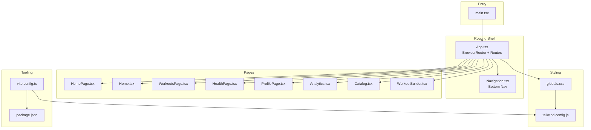
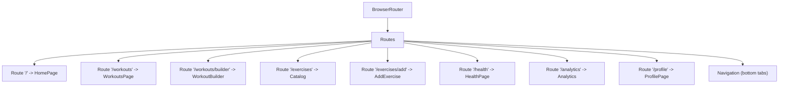
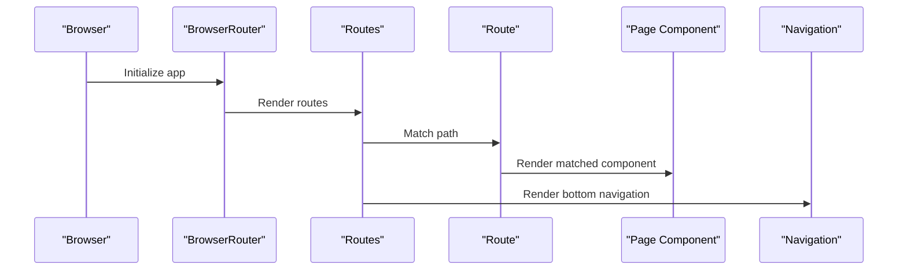
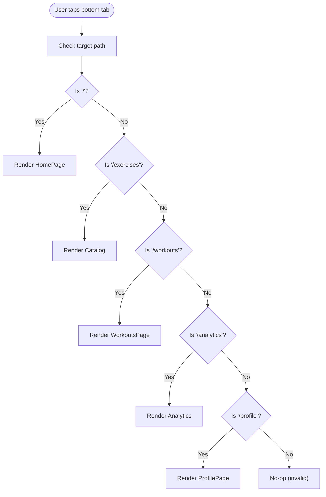
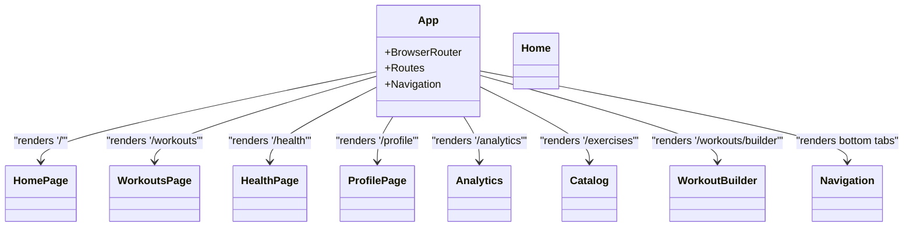
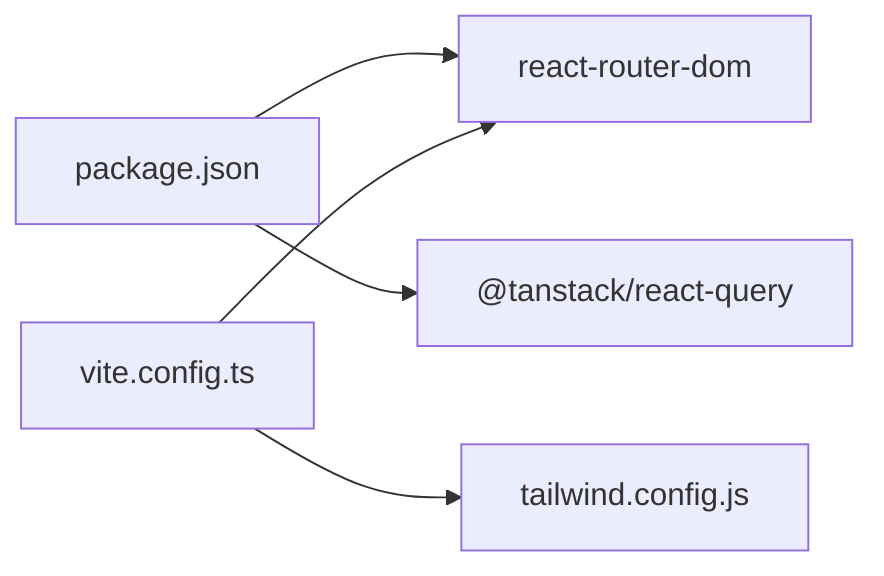

# Application Structure & Routing

<cite>
**Referenced Files in This Document**
- [main.tsx](file://frontend/src/main.tsx)
- [App.tsx](file://frontend/src/App.tsx)
- [Navigation.tsx](file://frontend/src/components/common/Navigation.tsx)
- [Home.tsx](file://frontend/src/pages/Home.tsx)
- [HomePage.tsx](file://frontend/src/pages/HomePage.tsx)
- [WorkoutsPage.tsx](file://frontend/src/pages/WorkoutsPage.tsx)
- [HealthPage.tsx](file://frontend/src/pages/HealthPage.tsx)
- [ProfilePage.tsx](file://frontend/src/pages/ProfilePage.tsx)
- [Analytics.tsx](file://frontend/src/pages/Analytics.tsx)
- [Catalog.tsx](file://frontend/src/pages/Catalog.tsx)
- [WorkoutBuilder.tsx](file://frontend/src/pages/WorkoutBuilder.tsx)
- [globals.css](file://frontend/src/styles/globals.css)
- [package.json](file://frontend/package.json)
- [vite.config.ts](file://frontend/vite.config.ts)
- [tailwind.config.js](file://frontend/tailwind.config.js)
</cite>

## Table of Contents
1. [Introduction](#introduction)
2. [Project Structure](#project-structure)
3. [Core Components](#core-components)
4. [Architecture Overview](#architecture-overview)
5. [Detailed Component Analysis](#detailed-component-analysis)
6. [Dependency Analysis](#dependency-analysis)
7. [Performance Considerations](#performance-considerations)
8. [Troubleshooting Guide](#troubleshooting-guide)
9. [Conclusion](#conclusion)

## Introduction
This document explains the FitTracker Pro frontend application’s structure and routing system. It focuses on how React Router is configured, how routes are defined, and how page components are organized. It also covers the main layout with BrowserRouter, route paths, component rendering patterns, the application entry point, global styling setup, and responsive/mobile-first design considerations. Finally, it outlines routing patterns, navigation flow, and component hierarchy, along with practical examples and best practices.

## Project Structure
FitTracker Pro follows a feature-based frontend structure under the frontend directory. Key areas:
- Entry point and provider setup in main.tsx
- Application shell and routing in App.tsx
- Page components under src/pages
- Shared UI and common components under src/components
- Global styles and design tokens under src/styles
- Build tooling and aliases via Vite and Tailwind

**Diagram sources**
- [main.tsx:1-23](file://frontend/src/main.tsx#L1-L23)
- [App.tsx:1-35](file://frontend/src/App.tsx#L1-L35)
- [Navigation.tsx:1-38](file://frontend/src/components/common/Navigation.tsx#L1-L38)
- [globals.css:1-581](file://frontend/src/styles/globals.css#L1-L581)
- [tailwind.config.js:1-349](file://frontend/tailwind.config.js#L1-L349)
- [vite.config.ts:1-40](file://frontend/vite.config.ts#L1-L40)
- [package.json:1-60](file://frontend/package.json#L1-L60)

**Section sources**
- [main.tsx:1-23](file://frontend/src/main.tsx#L1-L23)
- [App.tsx:1-35](file://frontend/src/App.tsx#L1-L35)
- [vite.config.ts:1-40](file://frontend/vite.config.ts#L1-L40)
- [tailwind.config.js:1-349](file://frontend/tailwind.config.js#L1-L349)

## Core Components
- Application shell and routing: App.tsx wraps the app with BrowserRouter and defines all routes with React Router’s Routes and Route.
- Navigation: Navigation.tsx provides a bottom tab bar with five main destinations aligned to the routes.
- Pages: Each route maps to a dedicated page component (e.g., HomePage, WorkoutsPage, HealthPage, ProfilePage, Analytics, Catalog, WorkoutBuilder).
- Entry point: main.tsx initializes React, React Query provider, and mounts the App component.
- Global styles: globals.css integrates Tailwind layers, Telegram theme variables, and utility classes for responsive and mobile-first design.

Key routing highlights:
- Root path "/" renders HomePage
- "/workouts" renders WorkoutsPage
- "/workouts/builder" renders WorkoutBuilder
- "/exercises" renders Catalog
- "/exercises/add" is present in App routes but Catalog handles discovery; add flow likely navigates internally
- "/health" renders HealthPage
- "/analytics" renders Analytics
- "/profile" renders ProfilePage

**Section sources**
- [App.tsx:12-32](file://frontend/src/App.tsx#L12-L32)
- [Navigation.tsx:5-11](file://frontend/src/components/common/Navigation.tsx#L5-L11)
- [main.tsx:7-22](file://frontend/src/main.tsx#L7-L22)
- [globals.css:88-118](file://frontend/src/styles/globals.css#L88-L118)

## Architecture Overview
The routing architecture centers on a single-page application pattern:
- BrowserRouter provides routing context
- Routes define static paths mapped to page components
- Navigation component offers persistent bottom tabs for quick switching
- Global styles and design tokens unify look-and-feel across pages

**Diagram sources**
- [App.tsx:17-26](file://frontend/src/App.tsx#L17-L26)
- [Navigation.tsx:13-37](file://frontend/src/components/common/Navigation.tsx#L13-L37)

**Section sources**
- [App.tsx:14-31](file://frontend/src/App.tsx#L14-L31)
- [Navigation.tsx:13-37](file://frontend/src/components/common/Navigation.tsx#L13-L37)

## Detailed Component Analysis

### Routing Configuration and Layout
- App.tsx sets up BrowserRouter and renders a main container with Routes and multiple Route declarations. It also renders Navigation below the routes to provide a persistent bottom tab bar.
- The layout ensures a minimum screen height and applies a base background and text color for light mode, while Telegram theme variables drive dynamic colors.

**Diagram sources**
- [App.tsx:14-31](file://frontend/src/App.tsx#L14-L31)
- [Navigation.tsx:13-37](file://frontend/src/components/common/Navigation.tsx#L13-L37)

**Section sources**
- [App.tsx:14-31](file://frontend/src/App.tsx#L14-L31)

### Navigation Flow and Bottom Tabs
- Navigation.tsx defines five bottom tab items: Home, Catalog, Workouts, Stats, and Profile. Each tab maps to a route path and uses NavLink to reflect active state.
- The component applies Tailwind utility classes for consistent sizing, spacing, and active/inactive styling.

**Diagram sources**
- [Navigation.tsx:5-11](file://frontend/src/components/common/Navigation.tsx#L5-L11)
- [App.tsx:17-26](file://frontend/src/App.tsx#L17-L26)

**Section sources**
- [Navigation.tsx:13-37](file://frontend/src/components/common/Navigation.tsx#L13-L37)

### Page Components and Rendering Patterns
- HomePage: A lightweight dashboard-style page with stats and recent items.
- Home: A feature-rich home page with widgets, pull-to-refresh, and interactive elements.
- WorkoutsPage: Lists workout types and recent entries with filtering.
- HealthPage: Displays health metrics with trend indicators and quick log actions.
- ProfilePage: User profile and settings menu.
- Analytics: Data visualization with charts and export capabilities.
- Catalog: Exercise catalog with filters, search, and detail modals.
- WorkoutBuilder: Drag-and-drop builder for workout templates with autosave and modal flows.

Rendering patterns:
- Each page component is self-contained and styled with Tailwind utility classes.
- Many pages use Telegram theme variables for consistent theming.
- Some pages implement internal navigation via programmatic navigation or modal-driven flows.

**Section sources**
- [HomePage.tsx:16-86](file://frontend/src/pages/HomePage.tsx#L16-L86)
- [Home.tsx:22-276](file://frontend/src/pages/Home.tsx#L22-L276)
- [WorkoutsPage.tsx:21-112](file://frontend/src/pages/WorkoutsPage.tsx#L21-L112)
- [HealthPage.tsx:24-123](file://frontend/src/pages/HealthPage.tsx#L24-L123)
- [ProfilePage.tsx:10-85](file://frontend/src/pages/ProfilePage.tsx#L10-L85)
- [Analytics.tsx:641-800](file://frontend/src/pages/Analytics.tsx#L641-L800)
- [Catalog.tsx:1-200](file://frontend/src/pages/Catalog.tsx#L1-L200)
- [WorkoutBuilder.tsx:267-531](file://frontend/src/pages/WorkoutBuilder.tsx#L267-L531)

### Component Hierarchy and Composition
- App.tsx composes:
  - BrowserRouter
  - Routes with multiple Route children
  - Navigation at the bottom
- Each Route renders a page component.
- Page components further compose shared UI elements (e.g., cards, inputs, chips, modals).

**Diagram sources**
- [App.tsx:17-29](file://frontend/src/App.tsx#L17-L29)
- [Navigation.tsx:13-37](file://frontend/src/components/common/Navigation.tsx#L13-L37)

**Section sources**
- [App.tsx:17-29](file://frontend/src/App.tsx#L17-L29)

## Dependency Analysis
- Routing library: react-router-dom is used for BrowserRouter, Routes, Route, and NavLink.
- State/data fetching: @tanstack/react-query is initialized in main.tsx with default caching and retry policies.
- Tooling and bundling: Vite resolves aliases for @components, @pages, @hooks, @stores, @services, @types, @utils, @styles.
- Styling pipeline: Tailwind processes content from index.html and src/**/*.{js,ts,jsx,tsx}, extending design tokens and animations.

**Diagram sources**
- [package.json:16-35](file://frontend/package.json#L16-L35)
- [vite.config.ts:9-21](file://frontend/vite.config.ts#L9-L21)
- [tailwind.config.js:3-7](file://frontend/tailwind.config.js#L3-L7)

**Section sources**
- [package.json:16-35](file://frontend/package.json#L16-L35)
- [vite.config.ts:9-21](file://frontend/vite.config.ts#L9-L21)
- [tailwind.config.js:3-7](file://frontend/tailwind.config.js#L3-L7)

## Performance Considerations
- Route-level lazy loading: Consider code-splitting per route to reduce initial bundle size. Vite’s manualChunks already groups vendor libraries; route-level chunks can be added for heavy pages like Analytics and Catalog.
- Query caching: React Query defaultOptions cache queries for 5 minutes with retry=1; adjust per route needs (e.g., Analytics may benefit from longer cache or background refetch).
- Rendering: Large lists (e.g., Catalog, Analytics) should leverage virtualization or pagination to improve scroll performance.
- Assets: Prefer lazy imports for heavy libraries (e.g., recharts) inside route components.

[No sources needed since this section provides general guidance]

## Troubleshooting Guide
Common issues and remedies:
- Routes not matching: Verify exact path strings in App.tsx Routes and Navigation.tsx navItems.
- Navigation not highlighting: Ensure NavLink isActive classes align with current route and that the bottom nav paths match route paths.
- Styles not applying: Confirm globals.css is imported in main.tsx and Tailwind content globs include page directories.
- Build errors after alias changes: Update vite.config.ts aliases and restart dev server.

**Section sources**
- [App.tsx:17-26](file://frontend/src/App.tsx#L17-L26)
- [Navigation.tsx:18-28](file://frontend/src/components/common/Navigation.tsx#L18-L28)
- [main.tsx:5](file://frontend/src/main.tsx#L5)
- [vite.config.ts:9-21](file://frontend/vite.config.ts#L9-L21)

## Conclusion
FitTracker Pro employs a clean, feature-based routing architecture centered on React Router. App.tsx orchestrates the shell with BrowserRouter and Routes, while Navigation.tsx provides persistent bottom tabs. Each route maps to a dedicated page component, enabling modular development. Global styles and Tailwind design tokens ensure consistent theming, including Telegram integration. For production readiness, consider route-level code splitting, refined React Query caching, and performance optimizations for heavy pages.